# 1 Supercomputerarchitecture 超级计算机体系结构

What is a supercomputer? 什么是超级计算机？

# Once upon a time, then came the memory wall 很久很久以前，后来遇到了内存墙

<table style="width: 100%; border-collapse: collapse;">
  <tr>
    <td style="width: 34%; vertical-align: top; padding-right: 1.5rem;">
      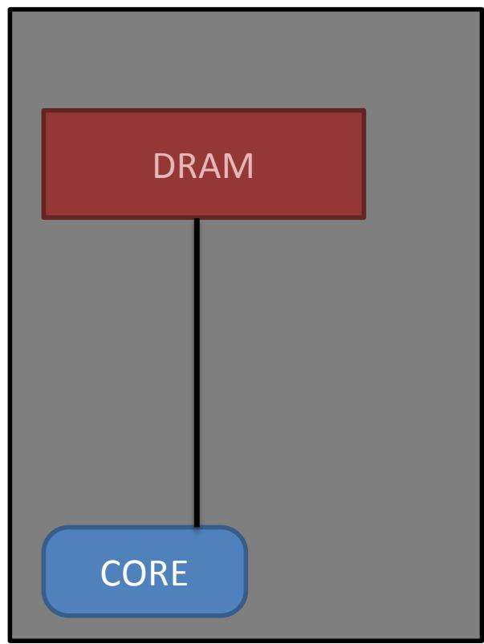
    </td>
    <td style="width: 66%; vertical-align: top;">
      <ul>
        <li>There was an Arithmetic and Logical Unit (ALU) able to realize operations: 有一个能够执行各种操作的算术逻辑单元（ALU）：
          <ul>
            <li>Arithmetic (add, sub, mul, ...) 算术运算（加、减、乘等）</li>
            <li>Logical (AND, OR, ...) 逻辑运算（与、或等）</li>
          </ul>
        </li>
        <li>...and a memory to store data 以及一个用于存储数据的内存</li>
        <li>Performance gain was achieved with increase of compute power 性能提升曾主要通过增加计算能力来实现
          <ul>
            <li>frequency 提高频率</li>
          </ul>
        </li>
        <li>Problem: compute performances increase faster than memory performances 问题在于：计算性能的提升速度快于内存性能</li>
        <li>Need to find ways to "feed" the compute unit 需要找到办法为计算单元“供粮”
          <ul>
            <li>Otherwise, it is not possible to achieve peak performance 否则就不可能达到峰值性能</li>
          </ul>
        </li>
      </ul>
    </td>
  </tr>
</table>

# Let there be caches 于是便有了缓存

<table style="width: 100%; border-collapse: collapse;">
  <tr>
    <td style="width: 34%; vertical-align: top; padding-right: 1.5rem;">
      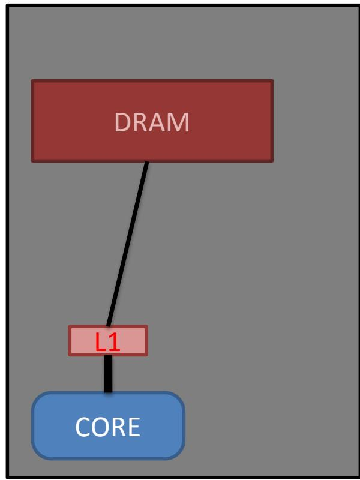
    </td>
    <td style="width: 66%; vertical-align: top;">
      <ul>
        <li>So a data cache was added between compute unit and data memory 因此在计算单元与数据内存之间加入了数据缓存</li>
        <li>Higher performance memory closer to the compute unit 更高性能的存储被放到了更靠近计算单元的位置
          <ul>
            <li>Better latency 更低延迟</li>
            <li>Better bandwidth 更高带宽</li>
          </ul>
        </li>
        <li>Act like a "buffer" memory close to the compute unit 它像是一个靠近计算单元的“缓冲区”内存
          <ul>
            <li>Keep temporarily last used data 临时保存最近使用过的数据</li>
          </ul>
        </li>
      </ul>
    </td>
  </tr>
</table>

# HPC saw it was good, but then came more power and more heat HPC 发现这确实很好用，但随后又需要更多算力并遇到更多热量问题

<table style="width: 100%; border-collapse: collapse;">
  <tr>
    <td style="width: 34%; vertical-align: top; padding-right: 1.5rem;">
      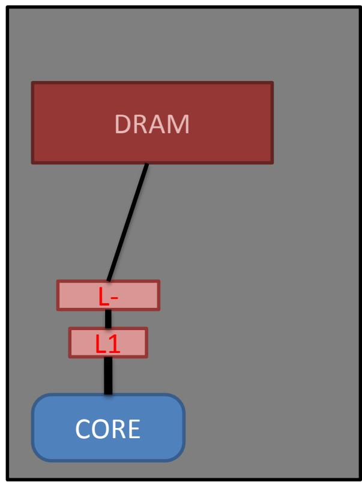
    </td>
    <td style="width: 66%; vertical-align: top;">
      <ul>
        <li>Only one level of cache may not be enough 只有一级缓存可能还不够
          <ul>
            <li>Too small to keep all data of interests 它太小，无法保存所有感兴趣的数据</li>
            <li>Hard to play its role and feed the compute unit efficiently 因而很难高效地发挥作用并持续供给计算单元</li>
          </ul>
        </li>
        <li>Add more cache levels 增加更多缓存层级
          <ul>
            <li>Depending on architecture (often 2 or 3 levels) 具体取决于体系结构，通常有 2 到 3 级</li>
            <li>Further the cache, lower the bandwidth and higher latency and capacity 越远离核心的缓存，带宽越低、延迟越高，但容量也越大</li>
          </ul>
        </li>
        <li>Each new generation of supercomputers (and processor generation) aims at providing more compute power 每一代新的超级计算机和处理器都在追求更强的算力</li>
        <li>Main way to reach more compute power: increase the processor frequency 获得更多算力的主要方式是提高处理器频率</li>
        <li>Increase frequency is done with increase of number of electrical transistors 提高频率通常意味着增加电晶体数量</li>
        <li>Usually roughly keeping the same size of chip 通常芯片整体尺寸大致保持不变
          <ul>
            <li>Leads to reducing transistor size 这会导致单个晶体管尺寸缩小</li>
          </ul>
        </li>
        <li>Density of transistor keeps increasing 晶体管密度持续上升
          <ul>
            <li>So does the electrical generated heat 由此产生的热量也会随之增加</li>
            <li>Double the density, n² increase of heat 密度翻倍，热量可能按 n² 级别增长</li>
            <li>Too much heat impossible to diffuse 热量过大时将无法有效散出</li>
          </ul>
        </li>
      </ul>
    </td>
  </tr>
</table>

# Multiplying cores 增加核心数量

<table style="width: 100%; border-collapse: collapse;">
  <tr>
    <td style="width: 34%; vertical-align: top; padding-right: 1.5rem;">
      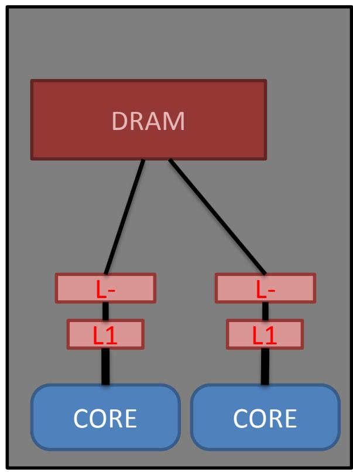
    </td>
    <td style="width: 66%; vertical-align: top;">
      <ul>
        <li>So, instead of increasing number of transistor per compute unit... 因此，与其继续增加每个计算单元中的晶体管数量……</li>
        <li>... let's multiply number of compute units ……不如直接增加计算单元的数量</li>
        <li>Allows to increase compute power while limiting proximity and density of transistors 这样可以在限制晶体管邻近程度和密度的同时提升算力</li>
        <li>Double the cores, double the heat 核心数翻倍，热量也会翻倍</li>
      </ul>
    </td>
  </tr>
</table>

# Caches are goooooood! 缓存真的很好用

<table style="width: 100%; border-collapse: collapse;">
  <tr>
    <td style="width: 34%; vertical-align: top; padding-right: 1.5rem;">
      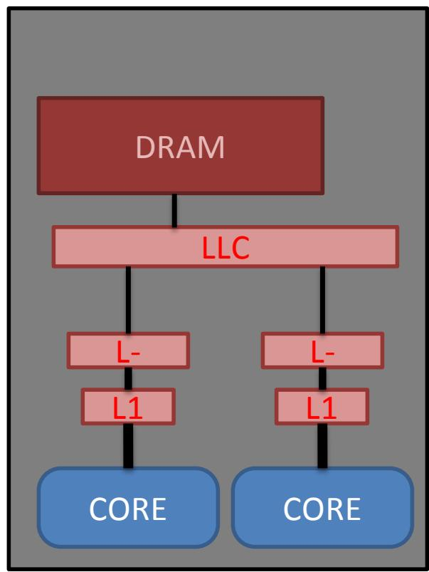
    </td>
    <td style="width: 66%; vertical-align: top;">
      <ul>
        <li>Sharing data between cores can happen only through global memory 核心之间共享数据可能只能通过全局内存完成
          <ul>
            <li>Not very efficient if the cores need to use the same data 如果多个核心要使用相同数据，这种方式效率并不高</li>
          </ul>
        </li>
        <li>In this case, caches are not useful 在这种情况下，私有缓存并不总是有效</li>
        <li>Often, the last level cache (LLC) is shared between cores 通常最后一级缓存（LLC）会在多个核心之间共享
          <ul>
            <li>Avoid to go the main memory each time a core need a shared data 这样可以避免每次访问共享数据时都去主存</li>
          </ul>
        </li>
        <li>Also possible to have intermediate shared caches 还可能存在中间层级的共享缓存</li>
      </ul>
    </td>
  </tr>
</table>

# Always need more data 永远还需要更多数据

<table style="width: 100%; border-collapse: collapse;">
  <tr>
    <td style="width: 34%; vertical-align: top; padding-right: 1.5rem;">
      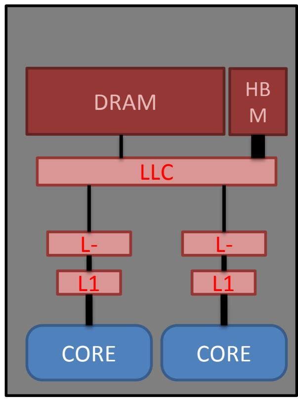
    </td>
    <td style="width: 66%; vertical-align: top;">
      <ul>
        <li>Increasing number of cores (and generally compute power) requires always more data to be transferred 核心数增加后，通常也就需要传输更多数据</li>
        <li>Even with caches, having only one memory with low bandwidth becomes problematic 即便有缓存，如果只有一个低带宽内存，也会变成瓶颈</li>
        <li>Adding more global memories, with different characteristics (HBM, NVMe) 因而需要增加更多具备不同特性的全局存储器，例如 HBM（High Bandwidth Memory，高带宽内存）和 NVMe（Non-Volatile Memory Express，高速非易失存储接口）</li>
      </ul>
    </td>
  </tr>
</table>

# Always need more compute power (with capped power) 在功耗受限下仍然需要更多算力

<table style="width: 100%; border-collapse: collapse;">
  <tr>
    <td style="width: 34%; vertical-align: top; padding-right: 1.5rem;">
      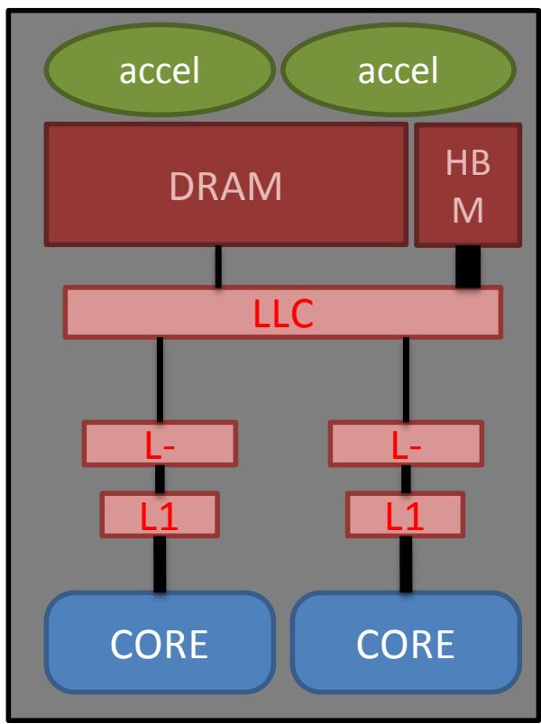
    </td>
    <td style="width: 66%; vertical-align: top;">
      <ul>
        <li>Cores are built to handle every possible operations 通用核心需要支持几乎所有可能的操作
          <ul>
            <li>Require lots of transistors for all cases 因而需要大量晶体管来覆盖各种情况</li>
          </ul>
        </li>
        <li>Increasing number of cores requires more and more electric power 增加核心数量会消耗越来越多电力
          <ul>
            <li>Back to hitting the heating wall 这又会把我们带回散热墙问题</li>
          </ul>
        </li>
        <li>Need to provide compute power with less energy 于是需要用更少的能量提供更多算力</li>
        <li>Accelerators attached to nodes, such as GPUs and other specialized computing devices 节点上可外挂加速器，例如 GPU 等专用计算设备</li>
        <li>More cores but specialized -&gt; less power 更多但更专用的核心，意味着更低功耗</li>
      </ul>
    </td>
  </tr>
</table>

# Building a Supercomputer: Multiplying sockets 构建超级计算机：增加插槽

<table style="width: 100%; border-collapse: collapse;">
  <tr>
    <td style="width: 34%; vertical-align: top; padding-right: 1.5rem;">
      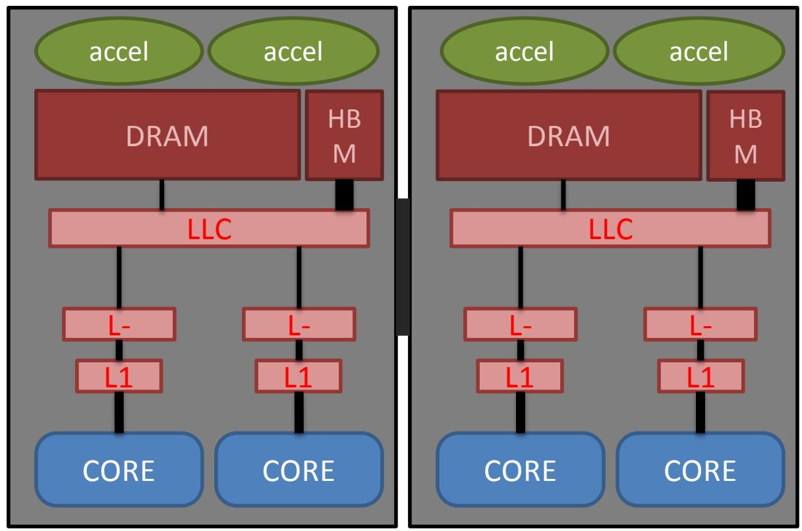
    </td>
    <td style="width: 66%; vertical-align: top;">
      <ul>
        <li>Hard to continue extending this number of elements within a limited size 在有限空间内继续增加这些组件会越来越困难</li>
        <li>Solution: multiply these complex structures and link them together 解决办法是复制这些复杂结构并将它们连接起来</li>
      </ul>
    </td>
  </tr>
</table>

# Building a Supercomputer: Multiplying nodes 构建超级计算机：增加节点

<table style="width: 100%; border-collapse: collapse;">
  <tr>
    <td style="width: 34%; vertical-align: top; padding-right: 1.5rem;">
      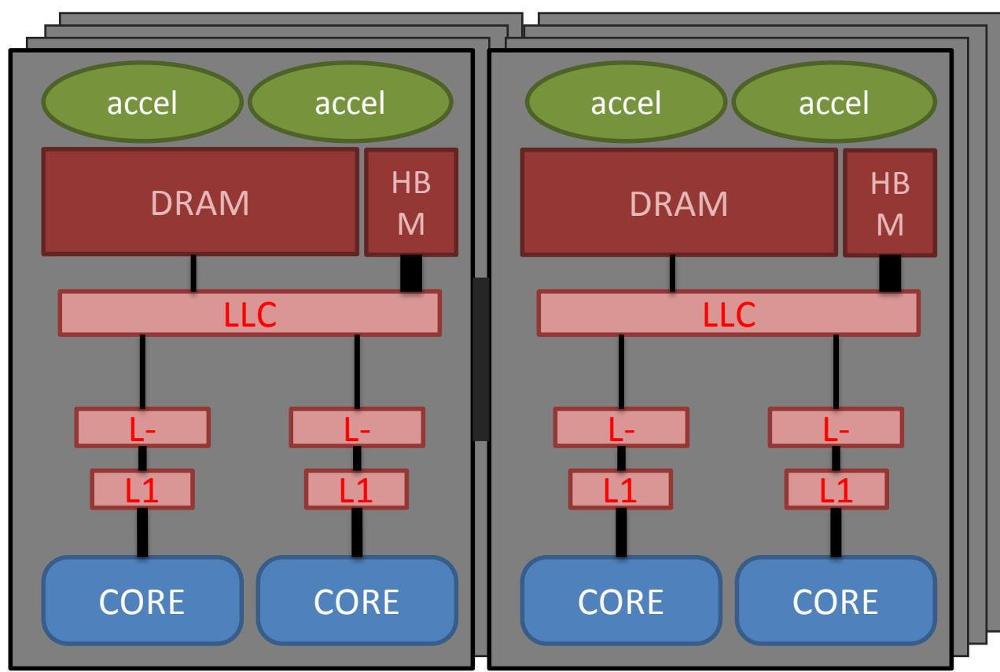
    </td>
    <td style="width: 66%; vertical-align: top;">
      <ul>
        <li>Same, difficult to continue multiplying sockets 同样地，继续单纯增加插槽也会变得困难</li>
        <li>Solution: multiply compute nodes, and link them together with a network 解决办法是增加计算节点，并通过网络将它们连接起来</li>
      </ul>
    </td>
  </tr>
</table>

# Building a Supercomputer: a cabinet 构建超级计算机：机柜

<table style="width: 100%; border-collapse: collapse;">
  <tr>
    <td style="width: 34%; vertical-align: top; padding-right: 1.5rem;">
      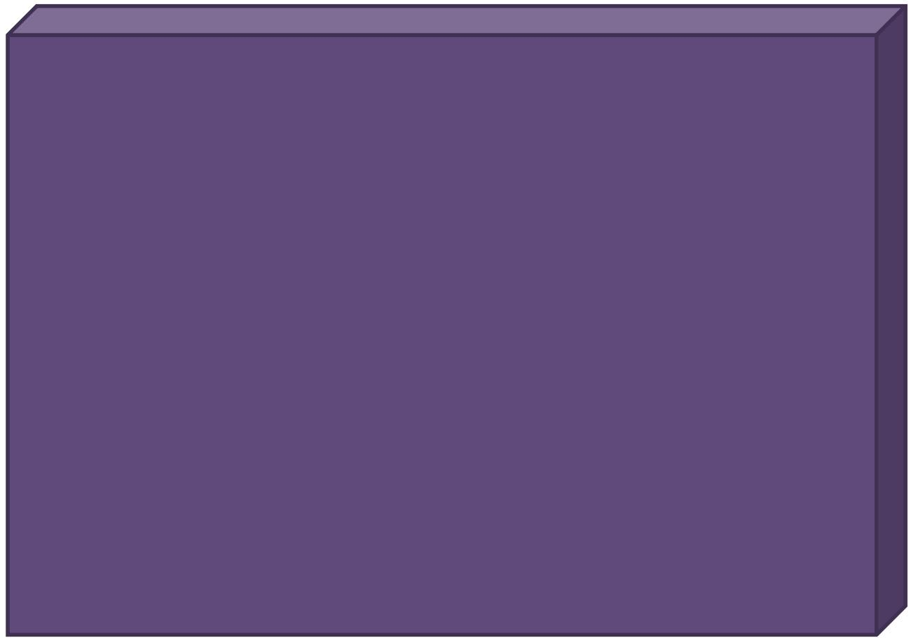
    </td>
    <td style="width: 66%; vertical-align: top;">
      <ul>
        <li>Nodes are combined in a rack 节点先被组合进机架中</li>
        <li>Racks are combined together inside a cabinet 多个机架再被组合进机柜中</li>
        <li>Need network links at every step 每一个层级都需要网络互连</li>
      </ul>
    </td>
  </tr>
</table>

# Building a Supercomputer: the supercomputer 构建超级计算机：整台超算系统

<table style="width: 100%; border-collapse: collapse;">
  <tr>
    <td style="width: 34%; vertical-align: top; padding-right: 1.5rem;">
      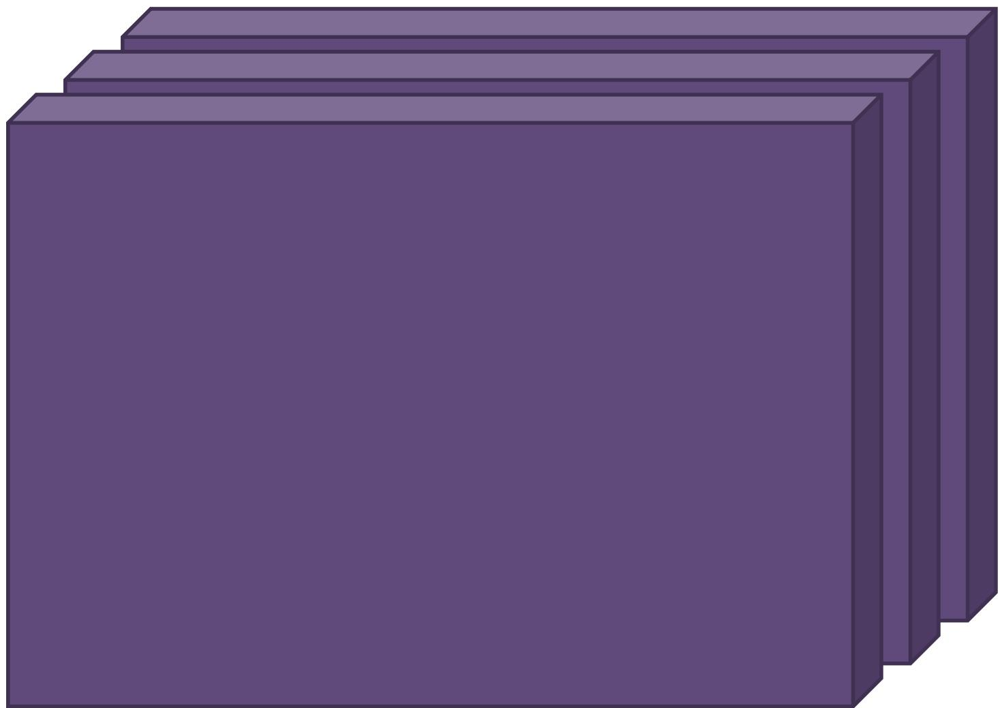
    </td>
    <td style="width: 66%; vertical-align: top;">
      <ul>
        <li>Finally, cabinets are linked together through network links 最终，多个机柜通过网络连接在一起</li>
        <li>Network cables 网络线缆</li>
        <li>Network switches 网络交换机</li>
        <li>A supercomputer is the whole ensemble of cabinets 一台超级计算机就是这些机柜组成的整体
          <ul>
            <li>Compute nodes 计算节点</li>
            <li>I/O nodes 输入输出节点</li>
            <li>Login nodes 登录节点</li>
          </ul>
        </li>
      </ul>
    </td>
  </tr>
</table>

# Example: Tera-1000 & Exa-1 示例：Tera-1000 与 Exa-1

<table style="width: 100%; border-collapse: collapse;">
  <tr>
    <td style="width: 50%; vertical-align: top; padding-right: 0.75rem;">
      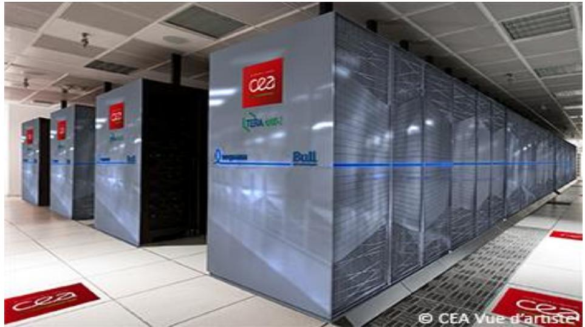
    </td>
    <td style="width: 50%; vertical-align: top; padding-left: 0.75rem;">
      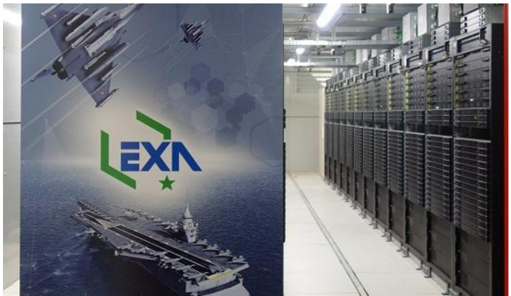
    </td>
  </tr>
</table>
