# 2 Memory layout and cache blocking 内存布局与缓存分块

Memory layout and access order strongly influence performance on modern processors. 内存布局和访问顺序会显著影响现代处理器上的性能。

# Memory layout 内存布局

<table style="width: 100%; border-collapse: collapse;">
  <tr>
    <td style="width: 100%; vertical-align: top;">
      <ul>
        <li>When a program reads data from the main memory (RAM), it fetches more than just the required cell 当程序从主存中读取数据时，实际取回的不只是目标单元本身</li>
        <li>The memory transfer unit is the cache line 内存传输的基本单位是缓存行</li>
        <li>The cache line size depends on the architecture 缓存行大小取决于具体体系结构</li>
        <li>When reading an `int` (4 B) with a cache line of 128 B, the processor fetches 32 contiguous integers 例如读取一个 4 字节的 `int` 时，如果缓存行为 128 字节，就会一并取回连续的 32 个整数</li>
        <li>To get good performance, software should follow this hardware behavior 要获得高性能，程序访问方式必须顺应这一硬件特性</li>
        <li>Reading `N` contiguous integers costs about `N/32` memory transfers, while strided access may cost `N` transfers 连续读取 `N` 个整数大约只需 `N/32` 次内存传输，而跨步访问则可能需要 `N` 次</li>
      </ul>
    </td>
  </tr>
</table>

# Row-major layout in C C 语言中的行主序布局

<table style="width: 100%; border-collapse: collapse;">
  <tr>
    <td style="width: 40%; vertical-align: top; padding-right: 1.5rem;">
      <pre><code class="language-c">int A[8][16];
for (int i = 0; i &lt; 8; ++i)
  for (int j = 0; j &lt; 16; ++j)
    use(A[i][j]);</code></pre>
    </td>
    <td style="width: 60%; vertical-align: top;">
      <ul>
        <li>C uses row-major layout C 语言使用行主序存储</li>
        <li>For multidimensional arrays, elements on the same row are contiguous in memory 对于多维数组，同一行上的元素在内存中是连续的</li>
        <li>Iterating on `j` in the innermost loop matches memory layout, so cache lines are used efficiently 将 `j` 放在最内层循环与内存布局一致，因此能更高效地利用缓存行</li>
      </ul>
    </td>
  </tr>
</table>

<table style="width: 100%; border-collapse: collapse;">
  <tr>
    <td style="width: 25%; padding: 0.25rem;"></td>
    <td style="width: 25%; padding: 0.25rem;">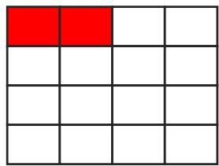</td>
    <td style="width: 25%; padding: 0.25rem;">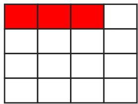</td>
    <td style="width: 25%; padding: 0.25rem;">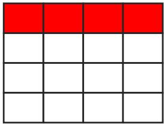</td>
  </tr>
</table>

Each panel corresponds to a successive value of `j`; the red cells show the current access and the neighboring elements brought together by the same cache line on a row, rather than a strict cache-line boundary drawing. 每一幅图对应连续增加的 `j` 值；红色单元表示当前访问位置，以及同一条 cache line 在这一行上顺带带入的相邻元素，而不是严格绘制出的 cache line 边界。

# Column-major layout in Fortran Fortran 中的列主序布局

<table style="width: 100%; border-collapse: collapse;">
  <tr>
    <td style="width: 40%; vertical-align: top; padding-right: 1.5rem;">
      <pre><code class="language-fortran">A(8,16)
do i = 1, 8
  do j = 1, 16
    call use(A(i,j))
  end do
end do</code></pre>
    </td>
    <td style="width: 60%; vertical-align: top;">
      <ul>
        <li>Fortran uses column-major layout Fortran 使用列主序存储</li>
        <li>For multidimensional arrays, elements on the same column are contiguous in memory 对于多维数组，同一列上的元素在内存中是连续的</li>
        <li>The best loop order is therefore different from C 因而最优循环顺序与 C 语言不同</li>
      </ul>
    </td>
  </tr>
</table>

<table style="width: 100%; border-collapse: collapse;">
  <tr>
    <td style="width: 25%; padding: 0.25rem;">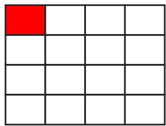</td>
    <td style="width: 25%; padding: 0.25rem;">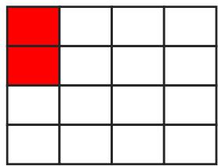</td>
    <td style="width: 25%; padding: 0.25rem;">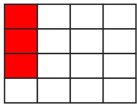</td>
    <td style="width: 25%; padding: 0.25rem;">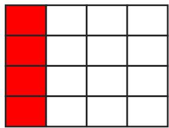</td>
  </tr>
</table>

Each panel again corresponds to a successive value of `j`; the red cells show that in column-major layout, contiguous memory accesses follow columns rather than rows. 这里每一幅图同样对应连续增加的 `j` 值；红色单元说明在列主序布局中，连续内存访问是沿列而不是沿行发生的。

# Data locality 数据局部性

<table style="width: 100%; border-collapse: collapse;">
  <tr>
    <td style="width: 100%; vertical-align: top;">
      <ul>
        <li>The closer the memory is to the compute unit, the more efficient it is 存储越靠近计算单元，通常效率越高</li>
        <li>Closer memories provide higher bandwidth and lower latency 更近的存储通常提供更高带宽和更低延迟</li>
        <li>Fetching data from main memory is costly 从主存取数代价很高</li>
        <li>Fetched data are automatically placed in cache levels 取回的数据会自动被放入各级缓存</li>
        <li>To get high performance, we must reuse data already present in cache 为了获得高性能，必须尽量复用已经在缓存中的数据</li>
      </ul>
    </td>
  </tr>
</table>

# Data structure and memory consumption 数据结构与内存占用

Let us compare two structures that contain the same fields in a different order. 下面比较两个字段相同但排列顺序不同的结构体。

<table style="width: 100%; border-collapse: collapse;">
  <tr>
    <td style="width: 50%; vertical-align: top; padding-right: 0.75rem;">
      <pre><code class="language-c">struct mem_1 {
    int a;
    int c;
    double b;
    double d;
};</code></pre>
    </td>
    <td style="width: 50%; vertical-align: top; padding-left: 0.75rem;">
      <pre><code class="language-c">struct mem_2 {
    int a;
    double b;
    int c;
    double d;
};</code></pre>
    </td>
  </tr>
</table>

<table style="width: 100%; border-collapse: collapse;">
  <tr>
    <td style="width: 100%; vertical-align: top;">
      <ul>
        <li>`int` is a 4-byte type and must be aligned on addresses such that `address % 4 == 0` `int` 是 4 字节类型，必须对齐到满足 `address % 4 == 0` 的地址</li>
        <li>`double` is an 8-byte type and must be aligned on addresses such that `address % 8 == 0` `double` 是 8 字节类型，必须对齐到满足 `address % 8 == 0` 的地址</li>
        <li>Field order therefore changes padding requirements 字段顺序会直接改变填充字节需求</li>
        <li>The three images below should be read from top to bottom: 下面三张图需要从上到下依次理解：
          <ul>
            <li>The first image shows an empty memory region divided into addressable cells 第一张图表示一段被划分成多个可寻址单元的空白内存区域</li>
            <li>The second image highlights the cells where an `int` may start, because only addresses divisible by 4 are valid for `int` 第二张图高亮了 `int` 可以开始存放的位置，因为只有能被 4 整除的地址才对 `int` 有效</li>
            <li>The third image adds the cells where a `double` may start, because `double` must begin at addresses divisible by 8 第三张图进一步标出了 `double` 可以开始存放的位置，因为 `double` 必须从能被 8 整除的地址开始</li>
          </ul>
        </li>
      </ul>
    </td>
  </tr>
  <tr>
    <td style="width: 100%; vertical-align: top;">
      <table style="width: 100%; border-collapse: collapse;">
        <tr>
          <td style="width: 100%; padding: 0.2rem;">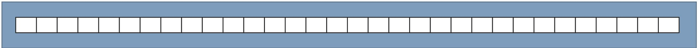</td>
        </tr>
        <tr>
          <td style="width: 100%; padding: 0.2rem;">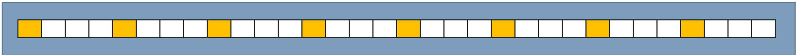</td>
        </tr>
        <tr>
          <td style="width: 100%; padding: 0.2rem;"></td>
        </tr>
      </table>
    </td>
  </tr>
</table>

## `mem_1`: compact layout `mem_1`：更紧凑的布局

<table style="width: 100%; border-collapse: collapse;">
  <tr>
    <td style="width: 100%; vertical-align: top;">
      <table style="width: 100%; border-collapse: collapse;">
        <tr>
          <td style="width: 100%; padding: 0.2rem;">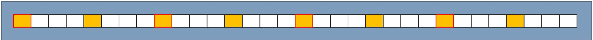</td>
        </tr>
        <tr>
          <td style="width: 100%; padding: 0.2rem;">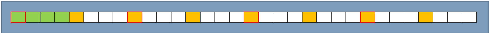</td>
        </tr>
        <tr>
          <td style="width: 100%; padding: 0.2rem;">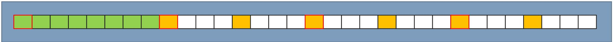</td>
        </tr>
        <tr>
          <td style="width: 100%; padding: 0.2rem;">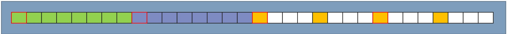</td>
        </tr>
        <tr>
          <td style="width: 100%; padding: 0.2rem;">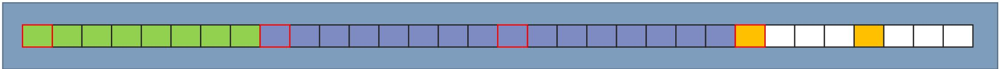</td>
        </tr>
      </table>
    </td>
  </tr>
  <tr>
    <td style="width: 100%; vertical-align: top;">
      <ul>
        <li>`mem_1` places the two `int` values first, then the two `double` values `mem_1` 先放两个 `int`，再放两个 `double`</li>
        <li>This order naturally satisfies alignment constraints 这种排列天然满足对齐约束</li>
        <li>No extra padding is needed between fields 字段之间不需要额外填充</li>
        <li>Size: `4 + 4 + 8 + 8 = 24 bytes` 大小为 `4 + 4 + 8 + 8 = 24 bytes`</li>
      </ul>
      <pre><code class="language-c">struct mem_1 {
    int a;
    int c;
    double b;
    double d;
};</code></pre>
    </td>
  </tr>
</table>

## `mem_2`: padded layout `mem_2`：带填充的布局

<table style="width: 100%; border-collapse: collapse;">
  <tr>
    <td style="width: 100%; vertical-align: top;">
      <table style="width: 100%; border-collapse: collapse;">
        <tr>
          <td style="width: 100%; padding: 0.2rem;"></td>
        </tr>
        <tr>
          <td style="width: 100%; padding: 0.2rem;">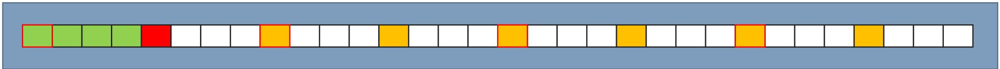</td>
        </tr>
        <tr>
          <td style="width: 100%; padding: 0.2rem;">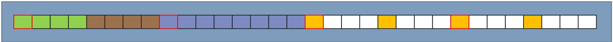</td>
        </tr>
        <tr>
          <td style="width: 100%; padding: 0.2rem;">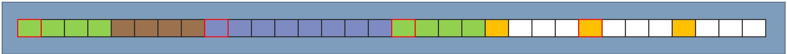</td>
        </tr>
        <tr>
          <td style="width: 100%; padding: 0.2rem;"></td>
        </tr>
        <tr>
          <td style="width: 100%; padding: 0.2rem;">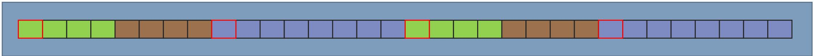</td>
        </tr>
      </table>
    </td>
  </tr>
  <tr>
    <td style="width: 100%; vertical-align: top;">
      <ul>
        <li>`mem_2` interleaves `int` and `double` fields `mem_2` 将 `int` 和 `double` 字段交错排列</li>
        <li>After the first `int`, the next address is not valid for a `double` 在第一个 `int` 之后，下一个地址并不满足 `double` 的对齐要求</li>
        <li>The compiler inserts 4 bytes of padding before each misaligned `double` 编译器会在每个未对齐的 `double` 前插入 4 字节填充</li>
        <li>Size: `4 + 4 + 8 + 4 + 4 + 8 = 32 bytes` 大小为 `4 + 4 + 8 + 4 + 4 + 8 = 32 bytes`</li>
      </ul>
      <pre><code class="language-c">struct mem_2 {
    int a;
    double b;
    int c;
    double d;
};</code></pre>
    </td>
  </tr>
</table>

## Practical effect 实际影响

<table style="width: 100%; border-collapse: collapse;">
  <tr>
    <td style="width: 100%; vertical-align: top;">
      <ul>
        <li>Allocating many structures amplifies the difference 大量分配结构体时，这种差异会被明显放大</li>
        <li>In the example, the badly ordered structure uses about 33% more memory 在这个例子中，字段顺序不佳的结构体多占用了约 33% 的内存</li>
        <li>The same principle also applies to C++ classes 这一原则同样适用于 C++ 类</li>
      </ul>
      <pre><code class="language-txt">$ ./memory_str.pgr
bad struct array size : 31968
good struct array size : 23976
ratio = 1.333333</code></pre>
    </td>
  </tr>
</table>

# SoA or AoS (or SoAoS) SoA 还是 AoS

`SoA` means `Structure of Arrays`, while `AoS` means `Array of Structures`. `SoA` 指数组的结构，`AoS` 指结构的数组。

<table style="width: 100%; border-collapse: collapse;">
  <tr>
    <td style="width: 50%; vertical-align: top; padding-right: 0.75rem;">
      <pre><code class="language-c">struct particle_soa {
    double temp[1000];
    double press[1000];
    double vit[1000];
};</code></pre>
    </td>
    <td style="width: 50%; vertical-align: top; padding-left: 0.75rem;">
      <pre><code class="language-c">struct particle {
    double temp;
    double press;
    double vit;
};

struct particle_aos {
    particle p[1000];
};</code></pre>
    </td>
  </tr>
</table>

<table style="width: 100%; border-collapse: collapse;">
  <tr>
    <td style="width: 100%; padding: 0.2rem;"></td>
  </tr>
  <tr>
    <td style="width: 100%; padding: 0.2rem;"></td>
  </tr>
  <tr>
    <td style="width: 100%; padding: 0.2rem;">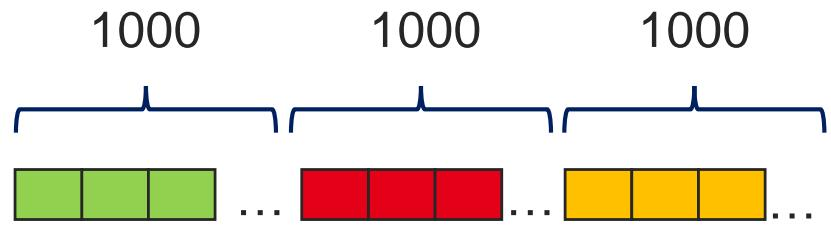</td>
  </tr>
  <tr>
    <td style="width: 100%; padding: 0.2rem;">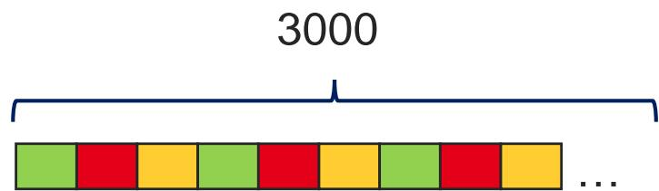</td>
  </tr>
  <tr>
    <td style="width: 100%; padding: 0.2rem;">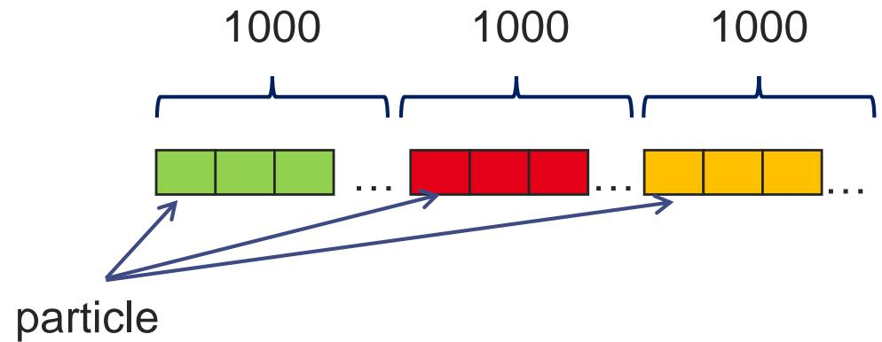</td>
  </tr>
  <tr>
    <td style="width: 100%; padding: 0.2rem;">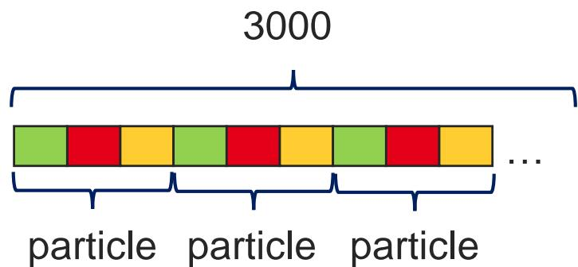</td>
  </tr>
</table>

<table style="width: 100%; border-collapse: collapse;">
  <tr>
    <td style="width: 100%; vertical-align: top;">
      <ul>
        <li>SoA and AoS are both common in simulation codes SoA 和 AoS 都是模拟程序中非常常见的数据组织方式</li>
        <li>Which one is better depends heavily on the access pattern 哪种更好，强烈依赖于实际访问模式</li>
        <li>SoA is usually better when a computation touches only one physical quantity at a time 当一次计算只处理一种物理量时，SoA 往往更好</li>
        <li>AoS is usually better when all physical quantities of one particle are accessed together 当一次更新需要同时访问单个粒子的多个物理量时，AoS 往往更合适</li>
      </ul>
    </td>
  </tr>
</table>

# Cache blocking 缓存分块

<table style="width: 100%; border-collapse: collapse;">
  <tr>
    <td style="width: 100%; vertical-align: top;">
      <ul>
        <li>In a multidimensional stencil computation, updating one cell requires data from neighboring cells 在多维 stencil 计算中，更新一个单元通常需要其邻居单元的数据</li>
        <li>If an array row is longer than the last-level cache, data fetched for one row cannot be fully reused for the next row 如果一整行数组比最后一级缓存还长，那么为当前行取回的数据无法完整复用于下一行</li>
        <li>We therefore need to change the traversal order of the array 所以需要改变数组遍历顺序</li>
        <li>This technique is called cache blocking 这种技术就叫缓存分块</li>
      </ul>
    </td>
  </tr>
</table>

## Blocking example: 2D stencil 分块示例：二维 stencil （模板式邻域计算）

<table style="width: 100%; border-collapse: collapse;">
  <tr>
    <td style="width: 100%; vertical-align: top;">
      <ul>
        <li>Consider a 2D Jacobi stencil 考虑一个二维 Jacobi stencil</li>
        <li>Each cell needs its four direct neighbors 每个单元都需要四个直接邻居</li>
        <li>Up, down, left, right 上、下、左、右</li>
        <li>Assume a cache line of 4 elements and a cache that stores 6 cache lines 假设缓存行大小为 4 个元素，缓存总共能容纳 6 条缓存行</li>
      </ul>
    </td>
  </tr>
  <tr>
    <td style="width: 100%; vertical-align: top;">
      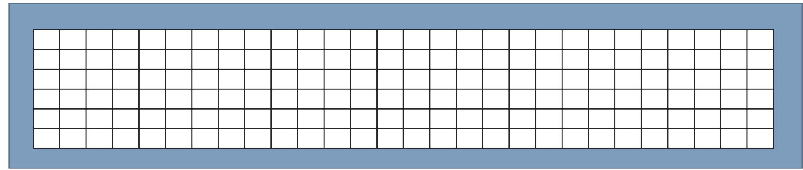
    </td>
  </tr>
</table>

## Unblocked traversal 未分块访问

<table style="width: 100%; border-collapse: collapse;">
  <tr>
    <td style="width: 100%; padding: 0.15rem;">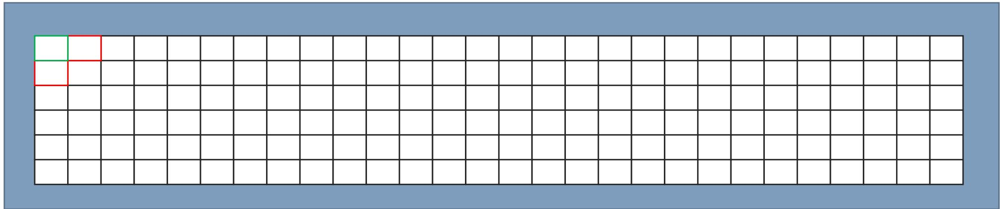</td>
  </tr>
  <tr>
    <td style="width: 100%; padding: 0.15rem;"></td>
  </tr>
  <tr>
    <td style="width: 100%; padding: 0.15rem;">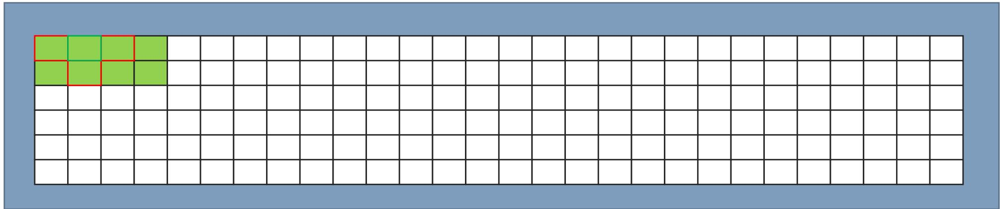</td>
  </tr>
  <tr>
    <td style="width: 100%; padding: 0.15rem;">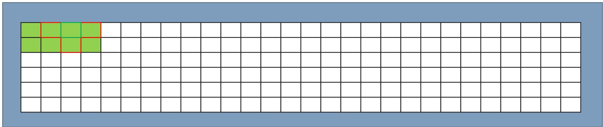</td>
  </tr>
  <tr>
    <td style="width: 100%; padding: 0.15rem;">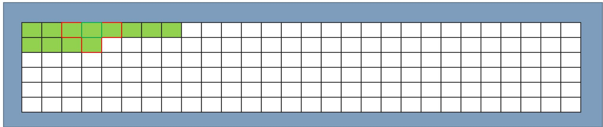</td>
  </tr>
  <tr>
    <td style="width: 100%; padding: 0.15rem;">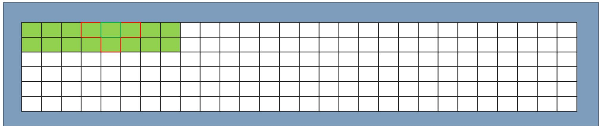</td>
  </tr>
  <tr>
    <td style="width: 100%; padding: 0.15rem;">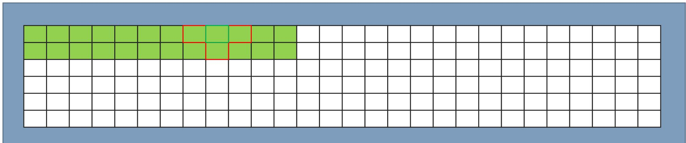</td>
  </tr>
  <tr>
    <td style="width: 100%; padding: 0.15rem;">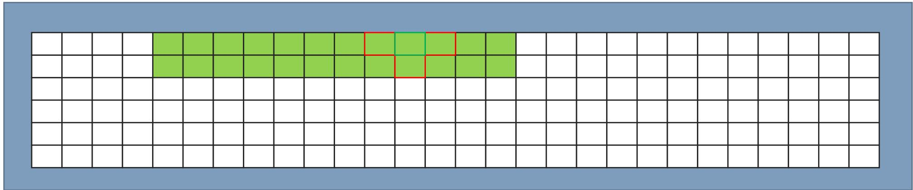</td>
  </tr>
  <tr>
    <td style="width: 100%; padding: 0.15rem;">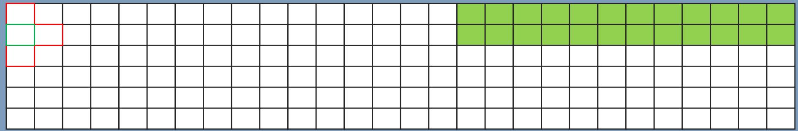</td>
  </tr>
  <tr>
    <td style="width: 100%; padding: 0.15rem;">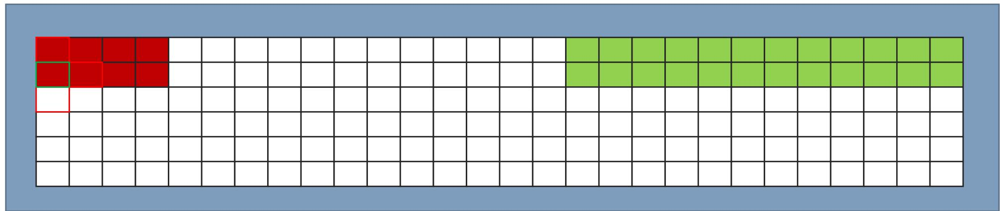</td>
  </tr>
</table>

<table style="width: 100%; border-collapse: collapse;">
  <tr>
    <td style="width: 100%; vertical-align: top;">
      <ul>
        <li>The first few updates reuse nearby cache lines effectively 开始的几个更新可以较好地复用附近缓存行</li>
        <li>But as the sweep progresses, the cache fills up and older lines are evicted 随着扫描继续，缓存会被填满，较早的缓存行被逐出</li>
        <li>When starting the next array row, needed lines may no longer be in cache 当开始处理下一行时，所需缓存行可能已经不在缓存里了</li>
        <li>This leads to poor temporal locality 这会造成较差的时间局部性</li>
      </ul>
    </td>
  </tr>
</table>

## Blocked traversal 分块访问

Instead of traversing the whole row before moving down, we traverse small tiles. 与其整行扫完再进入下一行，不如按小块进行遍历。

```c
for (int i = 0; i < 6; i += 2) {
  for (int j = 0; j < 28; j += 4) {
    for (int ii = 0; ii < 2; ++ii) {
      for (int jj = 0; jj < 4; ++jj) {
        use(A[i + ii][j + jj]);
      }
    }
  }
}
```

<table style="width: 100%; border-collapse: collapse;">
  <tr>
    <td style="width: 100%; padding: 0.15rem;">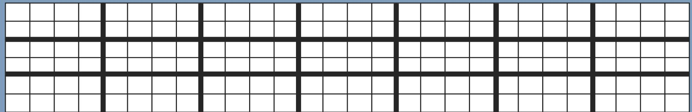</td>
  </tr>
  <tr>
    <td style="width: 100%; padding: 0.15rem;">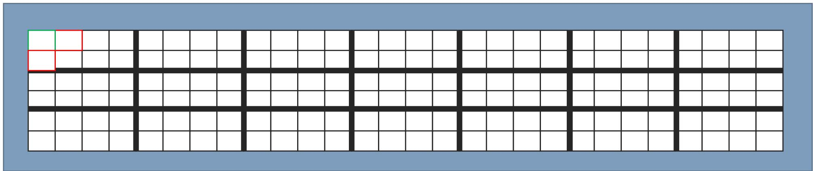</td>
  </tr>
  <tr>
    <td style="width: 100%; padding: 0.15rem;">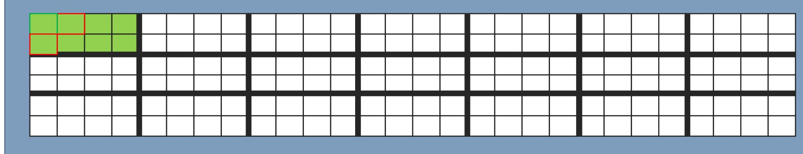</td>
  </tr>
  <tr>
    <td style="width: 100%; padding: 0.15rem;">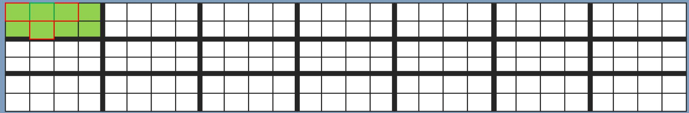</td>
  </tr>
  <tr>
    <td style="width: 100%; padding: 0.15rem;">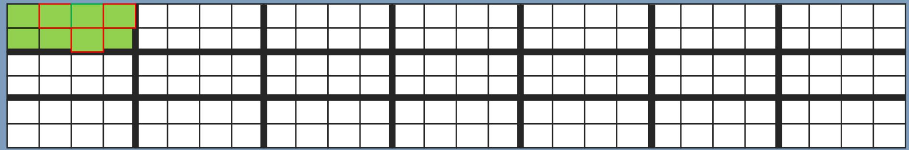</td>
  </tr>
  <tr>
    <td style="width: 100%; padding: 0.15rem;">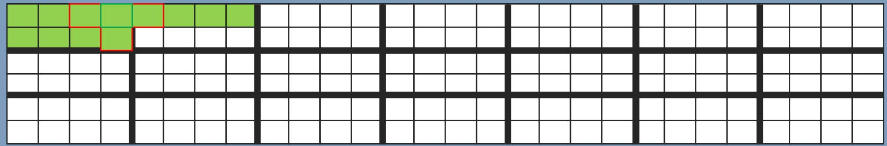</td>
  </tr>
  <tr>
    <td style="width: 100%; padding: 0.15rem;">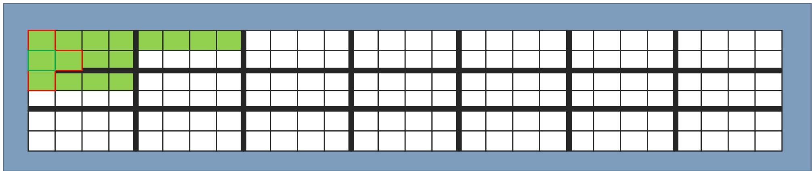</td>
  </tr>
  <tr>
    <td style="width: 100%; padding: 0.15rem;">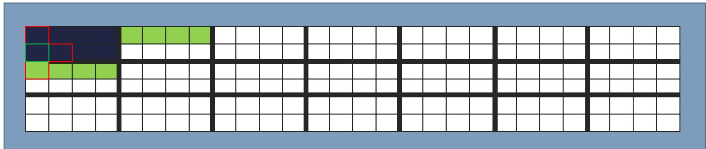</td>
  </tr>
  <tr>
    <td style="width: 100%; padding: 0.15rem;">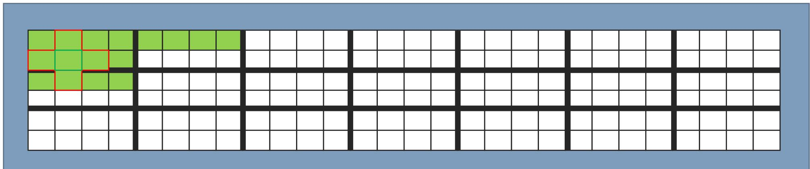</td>
  </tr>
  <tr>
    <td style="width: 100%; padding: 0.15rem;">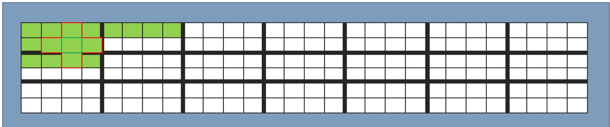</td>
  </tr>
  <tr>
    <td style="width: 100%; padding: 0.15rem;">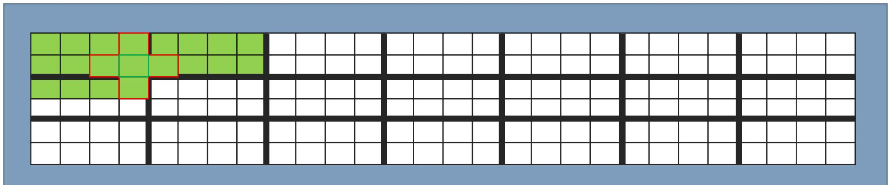</td>
  </tr>
  <tr>
    <td style="width: 100%; padding: 0.15rem;">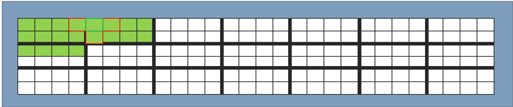</td>
  </tr>
  <tr>
    <td style="width: 100%; padding: 0.15rem;">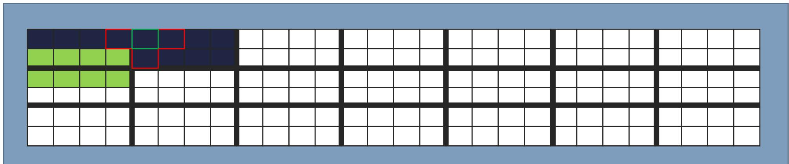</td>
  </tr>
</table>

<table style="width: 100%; border-collapse: collapse;">
  <tr>
    <td style="width: 100%; vertical-align: top;">
      <ul>
        <li>Within one block, data fetched for the first updates are reused by nearby updates 在同一个块内部，最开始取回的数据会被后续附近更新复用</li>
        <li>The access pattern improves temporal locality and reduces refetches 这种访问模式提升了时间局部性，并减少了重复取数</li>
        <li>Accessing contiguous cells inside the block still preserves spatial locality 在块内访问连续元素时，空间局部性也仍然得以保留</li>
      </ul>
    </td>
  </tr>
</table>

# Cache blocking summary 缓存分块总结

<table style="width: 100%; border-collapse: collapse;">
  <tr>
    <td style="width: 100%; vertical-align: top;">
      <ul>
        <li>Blocking changes the access pattern of multidimensional data to better exploit cache lines already in cache 分块通过改变多维数据的访问顺序，更充分地利用已经在缓存中的缓存行</li>
        <li>Accessing contiguous data is called spatial locality 访问连续数据叫做空间局部性</li>
        <li>Reusing data already fetched is called temporal locality 复用已经取回的数据叫做时间局部性</li>
        <li>Blocking aims at improving both forms of locality 分块的目标是同时改善这两种局部性</li>
        <li>Good blocking factors depend on hardware and software 优秀的分块参数同时取决于硬件和软件</li>
        <li>Hardware factors include cache size and cache-line size 硬件因素包括缓存容量和缓存行大小</li>
        <li>Software factors include which data are needed and how they are laid out in memory 软件因素包括需要访问哪些数据，以及它们在内存中的布局方式</li>
        <li>BLAS is historically written in Fortran, so interaction with C often requires layout conversion BLAS 历史上多以 Fortran 编写，因此与 C 代码交互时往往需要进行布局转换</li>
        <li>Sometimes transposing arrays is still cheaper than using a poor layout throughout the full computation 有时先转置数组再计算，仍然比一直使用糟糕布局更高效</li>
      </ul>
    </td>
  </tr>
</table>
