# 3 NUMA 非一致内存访问

Intra-node memory placement and cache coherence have a strong impact on performance. 节点内部的内存放置方式和缓存一致性机制会显著影响性能。

# NUMA basics NUMA 基础

`NUMA` means `Non-Uniform Memory Access`. `NUMA` 是 `Non-Uniform Memory Access`，即“非一致内存访问”。

<table style="width: 100%; border-collapse: collapse;">
  <tr>
    <td style="width: 100%; vertical-align: top;">
      <ul>
        <li>In a NUMA node, memory access cost is not uniform 在 NUMA 节点中，访问内存的代价并不是一致的</li>
        <li>Latency and bandwidth depend on where data is located relative to the requesting core 延迟和带宽取决于数据相对请求核心所在的位置</li>
        <li>Local caches and local DRAM are cheaper to access than remote caches and remote DRAM 本地缓存和本地 DRAM 的访问成本通常低于远端缓存和远端 DRAM</li>
      </ul>
    </td>
  </tr>
</table>

# Cache coherency costs 缓存一致性代价

This is only a short introduction to cache coherency. 这里只是对缓存一致性的一个简短引入。

Reference 参考：

<https://en.wikipedia.org/wiki/MESI_protocol>

# NUMA access: local and distant caches NUMA 访问：本地缓存与远端缓存

## Local L1 access 访问本地 L1

<table style="width: 100%; border-collapse: collapse;">
  <tr>
    <td style="width: 30%; padding: 0.25rem;">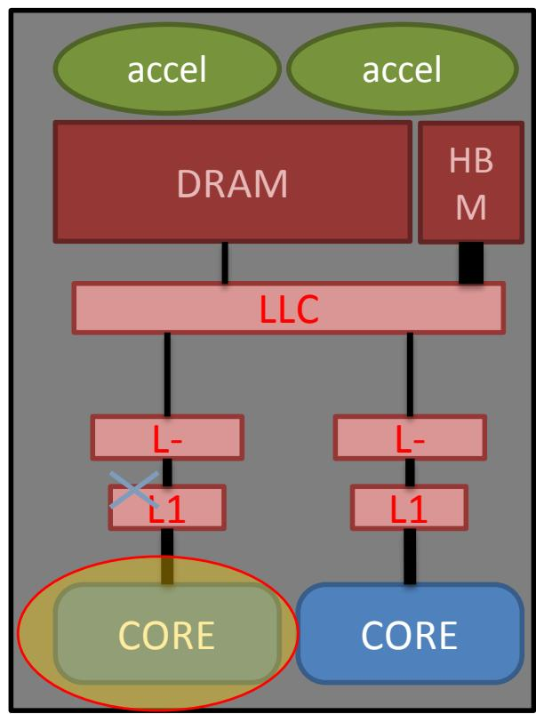</td>
    <td style="width: 100%; vertical-align: top;">
      <ul>
        <li>Example: core 0 accesses data located in its own L1 cache 例如，core 0 访问位于自己 L1 缓存中的数据</li>
        <li>The path is very short: the core only crosses the link to its own L1 路径很短，核心只需要经过自己到 L1 的链路</li>
        <li>This is the cheapest cache access case 这是缓存访问中代价最低的情况</li>
      </ul>
    </td>
  </tr>
</table>

## Distant L1 access on the same socket 同一插槽内访问远端 L1

<table style="width: 100%; border-collapse: collapse;">
  <tr>
    <td style="width: 40%; padding: 0.15rem;">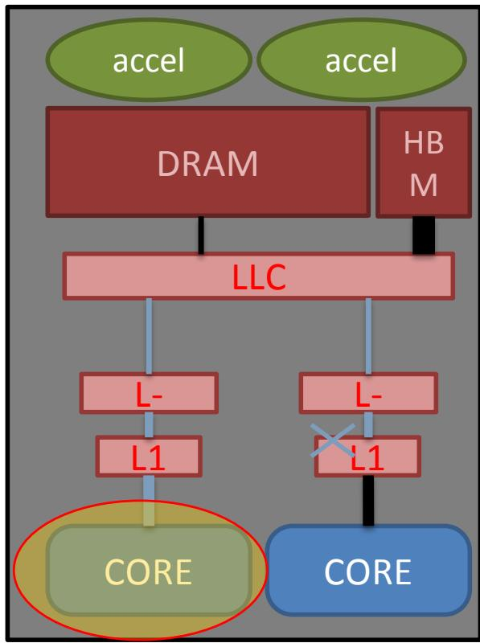</td>
        <td style="width: 100%; vertical-align: top;">
      <ul>
        <li>Example: core 0 accesses data that currently resides in a neighbor core's L1 cache 例如，core 0 访问当前位于相邻核心 L1 缓存中的数据</li>
        <li>The request must go through core 0's own L1, then L2, then L3, and then travel back toward the distant private caches 这次请求需要先经过 core 0 自己的 L1、L2、L3，然后再向远端私有缓存返回</li>
        <li>This longer path is the price of cache coherency 这种更长的路径就是缓存一致性带来的代价</li>
      </ul>
    </td>
</table>

## Distant L1 access on another socket 跨插槽访问远端 L1

<table style="width: 100%; border-collapse: collapse;">
  <tr>
    <td style="width: 50%; padding: 0.25rem;">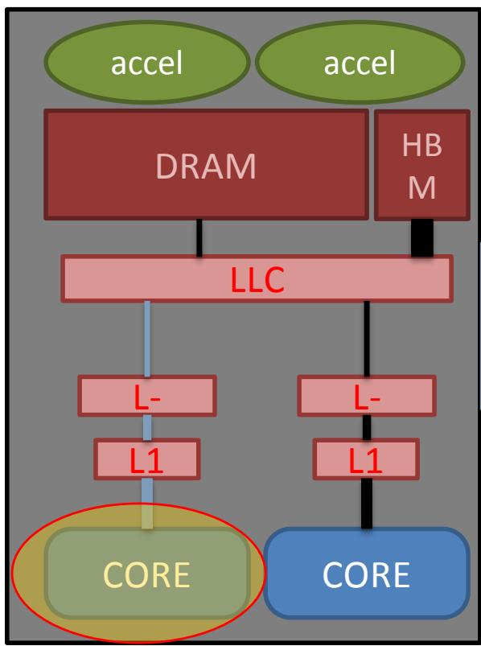</td>
    <td style="width: 50%; padding: 0.25rem;">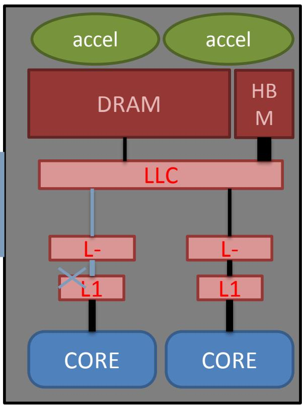</td>
  </tr>
</table>

<table style="width: 100%; border-collapse: collapse;">
  <tr>
    <td style="width: 100%; vertical-align: top;">
      <ul>
        <li>When the data is in an L1 cache on another socket, the path becomes even longer 如果数据位于另一颗插槽上的 L1 缓存，访问路径还会更长</li>
        <li>In addition to the previous cache links, the request must cross the inter-socket link 除了前面那些缓存层级链路之外，还必须跨越插槽间互连</li>
        <li>That is one of the reasons why remote accesses are more expensive 这也是远端访问更昂贵的重要原因之一</li>
      </ul>
    </td>
  </tr>
</table>

# Architecture example: Nehalem 架构示例：Nehalem

<table style="width: 100%; border-collapse: collapse;">
  <tr>
    <td style="width: 50%; padding-right: 0.75rem; vertical-align: top;">
      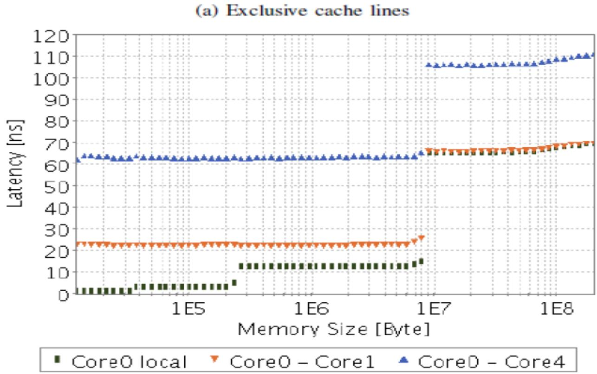
      <p>Read latencies with cache lines in the exclusive state 处于 Exclusive 状态时的读延迟</p>
    </td>
    <td style="width: 50%; padding-left: 0.75rem; vertical-align: top;">
      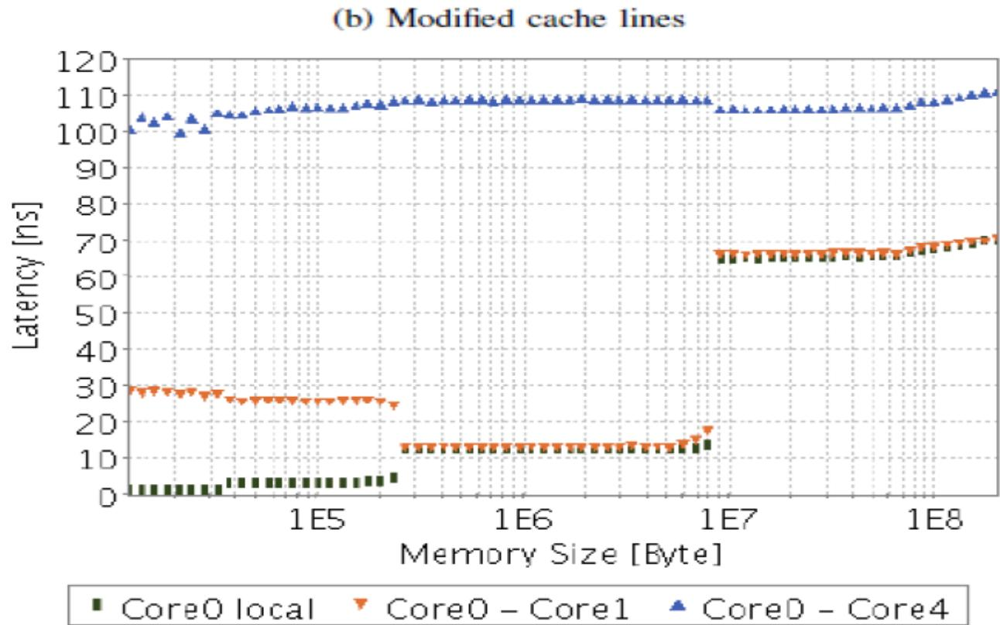
      <p>Read latencies with cache lines in the modified state 处于 Modified 状态时的读延迟</p>
    </td>
  </tr>
</table>

<table style="width: 100%; border-collapse: collapse;">
  <tr>
    <td style="width: 100%; vertical-align: top;">
      <ul>
        <li>Measured latency depends both on location and on the coherence state 实测延迟不仅取决于数据位置，还取决于一致性状态</li>
        <li>Local accesses are faster than on-die remote accesses, which are faster than cross-socket accesses 本地访问快于同芯片远端访问，而同芯片远端访问又快于跨插槽访问</li>
      </ul>
    </td>
  </tr>
</table>

<table style="width: 100%; border-collapse: collapse;">
  <tr>
    <td style="width: 50%; vertical-align: top; padding-right: 0.75rem;">
      <table>
        <tr><td rowspan="2"></td><td colspan="3">Exclusive</td><td colspan="3">Modified</td><td rowspan="2">RAM</td></tr>
        <tr><td>L1</td><td>L2</td><td>L3</td><td>L1</td><td>L2</td><td>L3</td></tr>
        <tr><td>Local</td><td>45.6</td><td>31.1</td><td>26.2</td><td>45.6</td><td>31.1</td><td rowspan="2">26.2</td><td rowspan="2">10.1</td></tr>
        <tr><td>Core1</td><td>19.3</td><td colspan="2">19.7</td><td>9.4</td><td>13.2</td></tr>
        <tr><td>Core4</td><td>9.0</td><td colspan="2">9.2</td><td colspan="3">5.6</td><td>6.3</td></tr>
      </table>
      <p>Core 0 read bandwidth in Gbps Core 0 读带宽（Gbps）</p>
    </td>
    <td style="width: 50%; vertical-align: top; padding-left: 0.75rem;">
      <table>
        <tr><td rowspan="2"></td><td colspan="3">Exclusive</td><td colspan="3">Modified</td><td rowspan="2">RAM</td></tr>
        <tr><td>L1</td><td>L2</td><td>L3</td><td>L1</td><td>L2</td><td>L3</td></tr>
        <tr><td>Local</td><td>45.6</td><td>28.8</td><td>19.9</td><td>45.6</td><td>28.8</td><td rowspan="2">19.9</td><td rowspan="2">8.4</td></tr>
        <tr><td>Core1</td><td>23.4</td><td>22.2</td><td>17.6</td><td>9.4</td><td>13.0</td></tr>
        <tr><td>Core4</td><td colspan="3">9.0</td><td colspan="2">8.3</td><td>9.6</td><td>5.5</td></tr>
      </table>
      <p>Core 0 write bandwidth in Gbps Core 0 写带宽（Gbps）</p>
    </td>
  </tr>
</table>

# First-touch policy 首次触碰策略

<table style="width: 100%; border-collapse: collapse;">
  <tr>
    <td style="width: 34%; vertical-align: top; padding-right: 1.5rem;">
      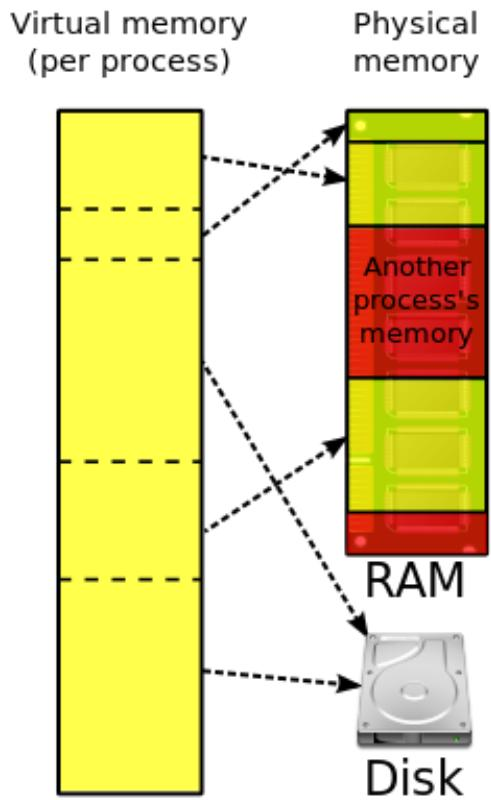
    </td>
    <td style="width: 66%; vertical-align: top;">
      <ul>
        <li>On most systems, `malloc` reserves virtual address space but does not immediately place the physical pages 在大多数系统上，`malloc` 只是保留虚拟地址空间，并不会立刻确定物理页的位置</li>
        <li>Pages are typically mapped on the NUMA node of the thread that first touches them 通常，物理页会被放到“第一次真正访问它们”的线程所在 NUMA 节点上</li>
        <li>If one thread allocates but another thread initializes, the data may end up on the second thread's NUMA node 如果一个线程分配而另一个线程先初始化，那么数据可能最终落在第二个线程对应的 NUMA 节点上</li>
        <li>This interacts with NUMA effects, false sharing, and scheduling 这会和 NUMA 效应、伪共享以及线程调度相互影响</li>
      </ul>
      <p>Reference 参考：<a href="https://en.wikipedia.org/wiki/Virtual_memory">https://en.wikipedia.org/wiki/Virtual_memory</a></p>
    </td>
  </tr>
</table>

# NUMA access on RAM RAM 上的 NUMA 访问

<p>We use vector addition as the running example 我们用向量加法作为贯穿示例。</p>

## Case 1: sequential init + sequential compute 情形 1：顺序初始化 + 顺序计算

<table style="width: 100%; border-collapse: collapse;">
  <tr>
    <td style="width: 38%; vertical-align: top; padding-right: 1.25rem;">
      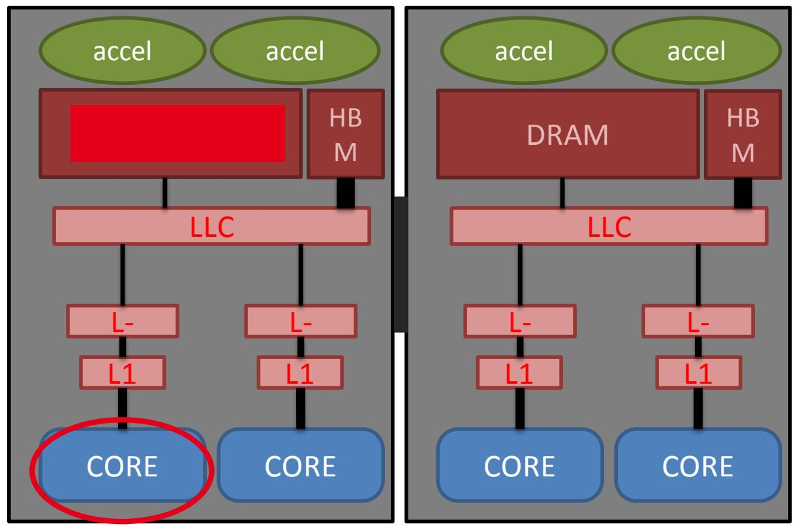
    </td>
    <td style="width: 62%; vertical-align: top;">
      <ul>
        <li>One core initializes the vectors and later computes on them 同一个核心先初始化向量，随后也由它自己进行计算</li>
        <li>With first touch, the pages are placed close to that core 根据首次触碰策略，这些页会被放到靠近该核心的 NUMA 节点上</li>
        <li>Most accesses therefore stay local, so latency is lower and bandwidth is better 因而大多数访问都保持本地化，延迟更低、带宽也更好</li>
        <li>This is the favorable baseline 这是最理想的基线情形</li>
      </ul>
    </td>
  </tr>
</table>

```c
#include <stdlib.h>

extern double somerandomvalue();

void init(double *tab, int size) {
    for (int i = 0; i < size; ++i) {
        tab[i] = somerandomvalue();
    }
}

void sum(double *tab_result, double *tab1, double *tab2, int size) {
    for (int i = 0; i < size; ++i) {
        tab_result[i] = tab1[i] + tab2[i];
    }
}

int main() {
    int size = 10000;
    double *a = malloc(size * sizeof(double));
    double *b = malloc(size * sizeof(double));
    double *c = malloc(size * sizeof(double));

    init(a, size);
    init(b, size);
    sum(c, a, b, size);

    return 0;
}
```

## Case 2: sequential init + parallel compute 情形 2：顺序初始化 + 并行计算

<table style="width: 100%; border-collapse: collapse;">
  <tr>
    <td style="width: 38%; vertical-align: top; padding-right: 1.25rem;">
      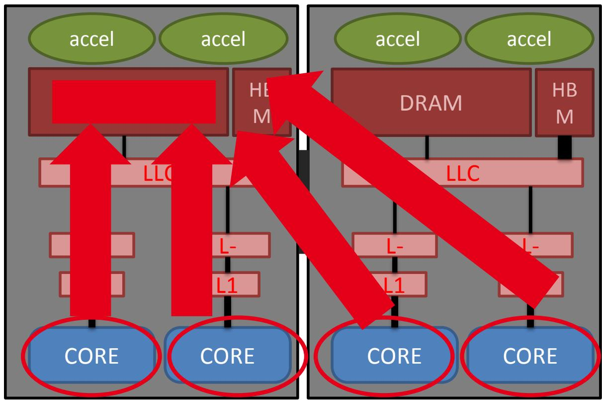
    </td>
    <td style="width: 62%; vertical-align: top;">
      <ul>
        <li>If only one thread performs initialization, first touch places all pages on a single NUMA node 如果只有一个线程执行初始化，首次触碰会把所有页都放到单个 NUMA 节点上</li>
        <li>When many threads later compute in parallel, most of them read remote memory 之后很多线程并行计算时，其中大部分线程都会去访问远端内存</li>
        <li>The work is parallel, but the data placement is not 虽然计算是并行的，但数据放置并不是并行友好的</li>
        <li>This causes poor NUMA locality and noticeably worse performance 这会造成糟糕的 NUMA 局部性，并显著拖慢性能</li>
      </ul>
    </td>
  </tr>
</table>

```c
#include <stdlib.h>
#include <omp.h>

extern double somerandomvalue();

void init(double *tab, int size) {
    for (int i = 0; i < size; ++i) {
        tab[i] = somerandomvalue();
    }
}

void sum(double *tab_result, double *tab1, double *tab2, int size) {
    #pragma omp parallel for
    for (int i = 0; i < size; ++i) {
        tab_result[i] = tab1[i] + tab2[i];
    }
}

int main() {
    int size = 10000;
    double *a = malloc(size * sizeof(double));
    double *b = malloc(size * sizeof(double));
    double *c = malloc(size * sizeof(double));

    init(a, size);
    init(b, size);
    sum(c, a, b, size);

    return 0;
}
```

## Case 3: parallel init + parallel compute 情形 3：并行初始化 + 并行计算

<table style="width: 100%; border-collapse: collapse;">
  <tr>
    <td style="width: 38%; vertical-align: top; padding-right: 1.25rem;">
      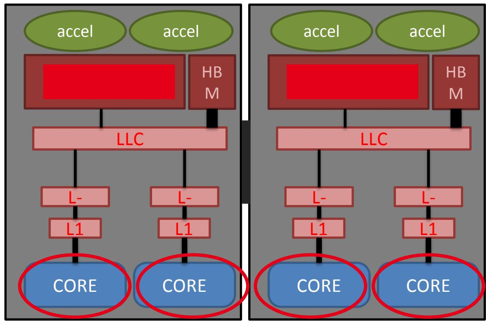
    </td>
    <td style="width: 62%; vertical-align: top;">
      <ul>
        <li>If initialization is also parallel, each thread tends to first-touch the pages it will later use 如果初始化本身也是并行的，那么每个线程往往会先触碰自己之后要使用的那些页</li>
        <li>Pages are then distributed across NUMA nodes instead of being concentrated on one node 于是这些页会分散到多个 NUMA 节点，而不是集中在某一个节点上</li>
        <li>During computation, each thread is much more likely to work on local memory 后续计算时，每个线程就更可能处理本地内存中的数据</li>
        <li>This is the preferred NUMA-aware pattern 这是更符合 NUMA 优化思路的模式</li>
      </ul>
    </td>
  </tr>
</table>

```c
#include <stdlib.h>
#include <omp.h>

extern double somerandomvalue();

void init(double *tab, int size) {
    #pragma omp parallel for
    for (int i = 0; i < size; ++i) {
        tab[i] = somerandomvalue();
    }
}

void sum(double *tab_result, double *tab1, double *tab2, int size) {
    #pragma omp parallel for
    for (int i = 0; i < size; ++i) {
        tab_result[i] = tab1[i] + tab2[i];
    }
}

int main() {
    int size = 10000;
    double *a = malloc(size * sizeof(double));
    double *b = malloc(size * sizeof(double));
    double *c = malloc(size * sizeof(double));

    init(a, size);
    init(b, size);
    sum(c, a, b, size);

    return 0;
}
```

# More recent architectures 更近代的架构

## Intel

<table style="width: 100%; border-collapse: collapse;">
  <tr>
    <td style="width: 100%; vertical-align: top;">
      <ul>
        <li>Intel Xeon Platinum 8260L Intel Xeon Platinum 8260L</li>
        <li>24 cores per processor 每颗处理器 24 个核心</li>
        <li>2 sockets 2 个插槽</li>
        <li>Inter-core one-way latency varies significantly between cores 核心间单向延迟会随着拓扑位置而显著变化</li>
      </ul>
    </td>
  </tr>
  <tr>
    <td style="width: 100%; vertical-align: top;">
      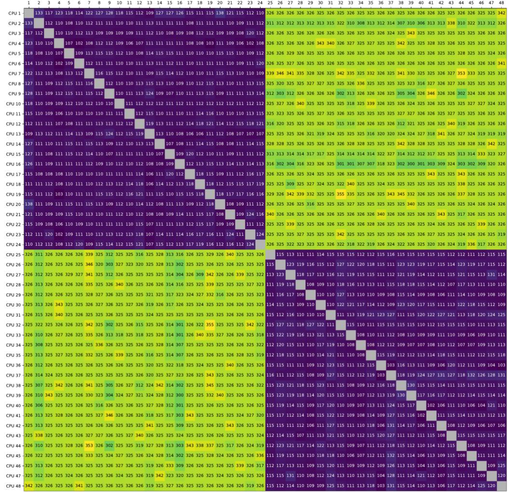
    </td>
  </tr>
</table>

## AMD

<table style="width: 100%; border-collapse: collapse;">
  <tr>
    <td style="width: 100%; vertical-align: top;">
      <ul>
        <li>AMD EPYC 7H12 AMD EPYC 7H12</li>
        <li>64 cores per processor 每颗处理器 64 个核心</li>
        <li>2 sockets 2 个插槽</li>
      </ul>
    </td>
  </tr>
  <tr>
    <td style="width: 100%; vertical-align: top;">
      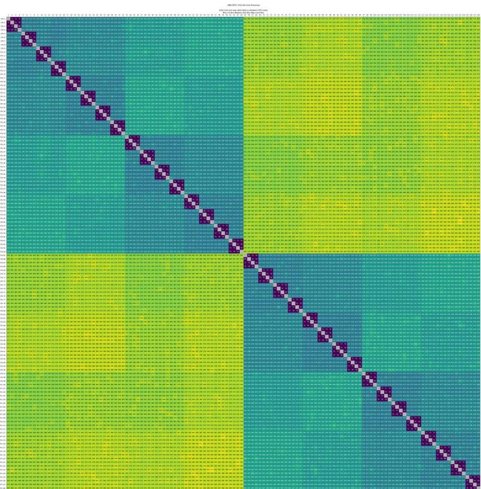
    </td>
  </tr>
</table>

## ARM

<table style="width: 100%; border-collapse: collapse;">
  <tr>
    <td style="width: 100%; vertical-align: top;">
      <ul>
        <li>ARM Neoverse N1 ARM Neoverse N1</li>
        <li>80 cores per processor 每颗处理器 80 个核心</li>
        <li>1 socket 1 个插槽</li>
      </ul>
    </td>
  </tr>
  <tr>
    <td style="width: 100%; vertical-align: top;">
      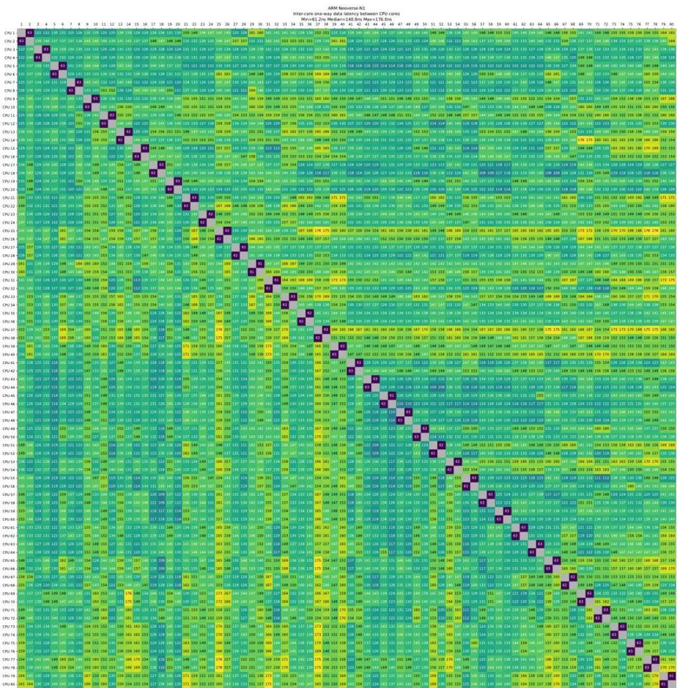
    </td>
  </tr>
</table>

# Data locality vs NUMA 数据局部性与 NUMA

<table style="width: 100%; border-collapse: collapse;">
  <tr>
    <td style="width: 100%; vertical-align: top;">
      <ul>
        <li>Having the required data close to the core is necessary for performance 要发挥性能，必须让需要的数据尽量靠近对应核心</li>
        <li>However, if several cores require the same data, NUMA effects can become costly 但如果多个核心都需要相同数据，NUMA 效应会带来额外代价</li>
        <li>We must avoid ping-pong movements of cache lines between threads 必须避免缓存行在不同线程之间来回“乒乓”传递</li>
        <li>That is where false sharing becomes important 这也正是伪共享问题变得重要的地方</li>
      </ul>
    </td>
  </tr>
</table>

# Concurrency and false sharing 并发与伪共享

## Data concurrency 数据并发

<table style="width: 100%; border-collapse: collapse;">
  <tr>
    <td style="width: 100%; vertical-align: top;">
      <ul>
        <li>Data concurrency means that multiple threads access shared data 数据并发指多个线程访问共享数据</li>
        <li>Sharing memory is a classical way to reduce memory footprint 共享内存是降低程序内存占用的经典方法</li>
        <li>The ideal case is to maximize useful data per cache line 最理想的情况是让每条缓存行中尽可能多地承载“有用数据”</li>
      </ul>
    </td>
  </tr>
</table>

## When true sharing happens 真共享发生时

<table style="width: 100%; border-collapse: collapse;">
  <tr>
    <td style="width: 100%; vertical-align: top;">
      <ul>
        <li>If multiple threads access the same memory cell, synchronization problems appear 如果多个线程访问同一个内存单元，就会出现同步问题</li>
        <li>The corresponding cache line may move from one cache to another 相应的缓存行可能会在不同缓存之间迁移</li>
        <li>To be efficient, different threads should avoid writing the same data at the same time 为了高效，不同线程应避免同时写同一份数据</li>
      </ul>
    </td>
  </tr>
</table>

## False sharing 伪共享

<table style="width: 100%; border-collapse: collapse;">
  <tr>
    <td style="width: 100%; vertical-align: top;">
      <ul>
        <li>False sharing happens when threads touch different addresses that still belong to the same cache line 伪共享指线程访问的是不同地址，但这些地址仍然落在同一条缓存行中</li>
        <li>Threads are not really sharing the same logical data, but caches still see the same line 线程在逻辑上并没有共享同一份数据，但缓存系统仍把它们视作同一条缓存行</li>
        <li>This creates the same cache-line movements and performance loss as true sharing 这会造成与真共享类似的缓存行迁移和性能损失</li>
      </ul>
    </td>
  </tr>
</table>

## False sharing example 伪共享示例

```cpp
#include <chrono>
#include <iostream>
#include <omp.h>
#include <stdlib.h>

double somerandomvalue() { return 42.0; }

void init(double *tab, int size) {
    #pragma omp parallel for
    for (int i = 0; i < size; ++i) {
        tab[i] = somerandomvalue();
    }
}

void increasing_values_seq(double *tab, int size) {
    for (int i = 0; i < size; ++i) {
        tab[i] = tab[i] + 1;
    }
}

void increasing_values_omp(double *tab, int size) {
    #pragma omp parallel for schedule(runtime)
    for (int i = 0; i < size; ++i) {
        tab[i] = tab[i] + 1;
    }
}
```

```bash
OMP_NUM_THREAD=4 OMP_SCHEDULE=static,268435456 ./a.out
echo "schedule static 268435456 : no false sharing"
OMP_NUM_THREAD=4 OMP_SCHEDULE=static ./a.out
echo "schedule static : no false sharing"
OMP_NUM_THREAD=4 OMP_SCHEDULE=static,1 ./a.out
echo "schedule static 1 : false sharing appears"
```

```txt
duration = 599487262
schedule static 268435456 : no false sharing
duration = 605557178
schedule static : no false sharing
duration = 5079612654
schedule static 1 : false sharing appears
```

<table style="width: 100%; border-collapse: collapse;">
  <tr>
    <td style="width: 100%; vertical-align: top;">
      <ul>
        <li>With `OMP_SCHEDULE=static`, each thread gets a large contiguous chunk 使用 `OMP_SCHEDULE=static` 时，每个线程拿到一大块连续迭代区间</li>
        <li>With `OMP_SCHEDULE=static,1`, threads interleave iterations 使用 `OMP_SCHEDULE=static,1` 时，不同线程交错执行迭代</li>
        <li>That interleaving makes several threads touch the same cache lines 这种交错会让多个线程触碰同一条缓存行</li>
        <li>The result can be dramatically slower, even though the arithmetic work is unchanged 结果会显著变慢，尽管算术工作本身并没有变化</li>
      </ul>
    </td>
  </tr>
  <tr>
    <td style="width: 100%; vertical-align: top;">
      
    </td>
  </tr>
</table>

## Static scheduling 静态调度

<table style="width: 100%; border-collapse: collapse;">
  <tr>
    <td style="width: 100%; vertical-align: top;">
      <ul>
        <li>Static scheduling splits the iteration space into chunks of equal size when possible 静态调度会尽可能把迭代空间分成大小相等的块</li>
        <li>By default, each thread gets one large chunk 默认情况下，每个线程通常拿到一大块连续区间</li>
        <li>If a chunk size is specified, chunks are distributed in round-robin order 如果显式指定 chunk 大小，这些块会按轮转方式分发</li>
      </ul>
    </td>
  </tr>
  <tr>
    <td style="width: 100%; vertical-align: top;">
      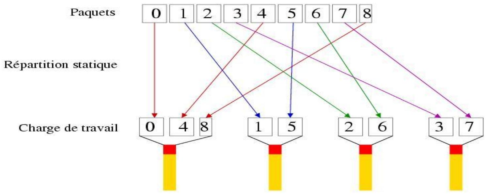
    </td>
  </tr>
</table>

## Avoiding false sharing 避免伪共享

<table style="width: 100%; border-collapse: collapse;">
  <tr>
    <td style="width: 100%; vertical-align: top;">
      <ul>
        <li>A simple but often impractical solution is to put each variable on a separate cache line 一个简单但通常不现实的方法是把每个变量单独放在一条缓存行上</li>
        <li>A better approach is to identify thread-private and read-only variables 更好的方法是识别线程私有变量和只读变量</li>
        <li>Read-only variables can be safely shared 只读变量通常可以安全共享</li>
        <li>Grouping fields by access pattern can also help 按访问模式重组结构字段也会有帮助</li>
      </ul>
      <pre><code class="language-c">struct {
    struct all {
        int bar;
        int xyzzy;
    };
    char pad[CLSIZE - sizeof(struct all)];
} rwstruct __attribute__((aligned(CLSIZE)));</code></pre>
    </td>
  </tr>
</table>

# Memory bandwidth 内存带宽

<table style="width: 100%; border-collapse: collapse;">
  <tr>
    <td style="width: 100%; vertical-align: top;">
      <ul>
        <li>Memory bandwidth per socket is limited 每个插槽可用的内存带宽是有限的</li>
        <li>All cores on the socket share that bandwidth 该插槽上的所有核心共享这部分带宽</li>
        <li>The more threads we use, the smaller the average bandwidth per thread 随着线程数增多，每个线程平均能分到的带宽会下降</li>
        <li>Bandwidth scaling does not simply follow frequency or core count 带宽并不会随着频率或核心数线性增长</li>
      </ul>
    </td>
  </tr>
</table>

## NUMA also affects bandwidth NUMA 也会影响带宽

<table style="width: 100%; border-collapse: collapse;">
  <tr>
    <td style="width: 38%; vertical-align: top; padding-right: 1.25rem;">
      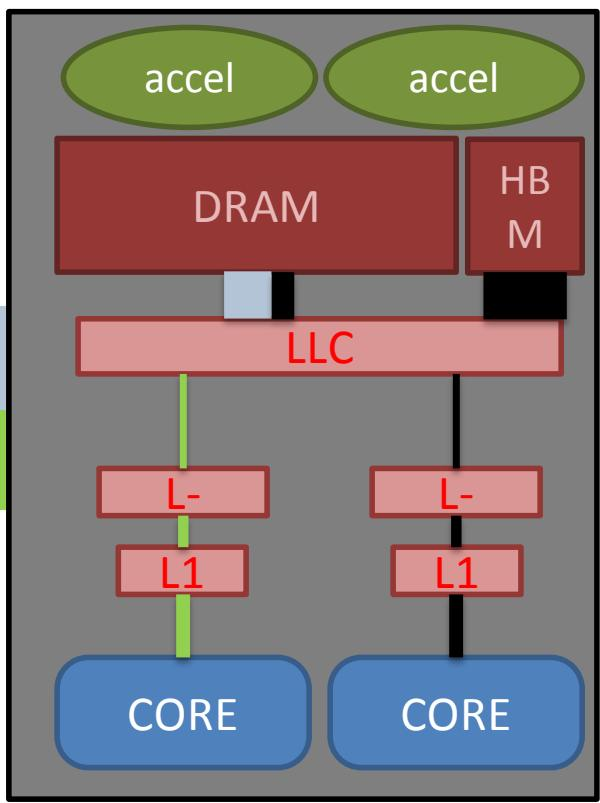
    </td>
    <td style="width: 62%; vertical-align: top;">
      <ul>
        <li>Locality improves latency, but bandwidth must also be considered 局部性会改善延迟，但带宽也必须单独考虑</li>
        <li>One thread may not be enough to saturate all available bandwidth 只用一个线程时，可能根本吃不满全部带宽</li>
        <li>Local memory requests may be prioritized over remote requests 本地内存请求可能会比远端请求拥有更高优先级</li>
        <li>Cross-socket accesses in both directions compete for the same interconnect 双向跨插槽访问会竞争同一条互连链路</li>
      </ul>
    </td>
  </tr>
</table>

<table style="width: 100%; border-collapse: collapse;">
  <tr>
    <td style="width: 50%; padding-right: 0.75rem; vertical-align: top;">
      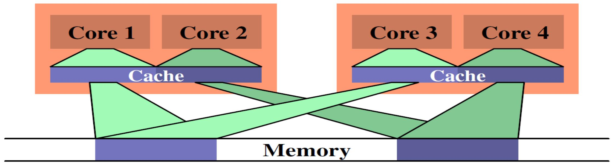
      <p>Inefficient scheduling 低效调度</p>
    </td>
    <td style="width: 50%; padding-left: 0.75rem; vertical-align: top;">
      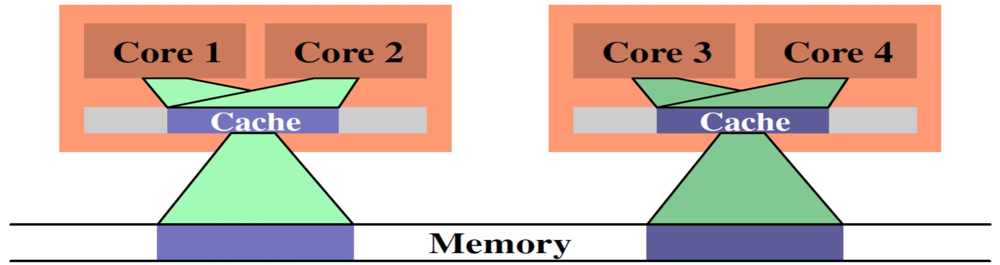
      <p>Efficient scheduling 高效调度</p>
    </td>
  </tr>
</table>

# Memory bandwidth examples 内存带宽示例

## 2-socket Intel Sandy Bridge 双插槽 Intel Sandy Bridge

<table style="width: 100%; border-collapse: collapse;">
  <tr>
    <td style="width: 100%; vertical-align: top;">
      <ul>
        <li>Node with 2 sockets of 8 cores each 一个节点有 2 个插槽，每个插槽 8 个核心</li>
        <li>Two arrays are added into a third one 将两个数组相加写入第三个数组</li>
        <li>One thread initializes the arrays 单线程初始化数组</li>
        <li>The first 8 threads perform the parallel addition 前 8 个线程执行并行加法</li>
      </ul>
      <pre><code class="language-txt">allocation by thread 0  -> about 28.96 s
allocation by thread 8  -> about 36.26 s</code></pre>
      <p>One socket accesses either local or distant memory 一个插槽访问的要么是本地内存，要么是远端内存。</p>
    </td>
  </tr>
</table>

# Memory bandwidth examples 内存带宽示例

## 2-socket Intel Sandy Bridge 双插槽 Intel Sandy Bridge

<table style="width: 100%; border-collapse: collapse;">
  <tr>
    <td style="width: 100%; vertical-align: top;">
      <ul>
        <li>Node with 2 sockets of 8 cores each 一个节点有 2 个插槽，每个插槽 8 个核心</li>
        <li>Two arrays are added into a third one 将两个数组相加写入第三个数组</li>
        <li>One thread initializes the arrays 单线程初始化数组</li>
        <li>The first 8 threads perform the parallel addition 前 8 个线程执行并行加法</li>
      </ul>
      <pre><code class="language-txt">allocation by thread 0  -> about 28.96 s
allocation by thread 8  -> about 36.26 s</code></pre>
      <p>One socket accesses either local or distant memory 一个插槽访问的要么是本地内存，要么是远端内存。</p>
    </td>
  </tr>
</table>

## 2-socket AMD Milan 双插槽 AMD Milan

<table style="width: 100%; border-collapse: collapse;">
  <tr>
    <td style="width: 100%; vertical-align: top;">
      <ul>
        <li>64 cores per processor 每颗处理器 64 核</li>
        <li>Local placement again outperforms distant placement 本地放置依旧优于远端放置</li>
      </ul>
      <pre><code class="language-txt">allocation by thread 0   -> about 24.21 s
allocation by thread 64  -> about 33.77 s</code></pre>
      <pre><code class="language-txt">all local   -> about 24.12 s
all distant -> about 38.12 s</code></pre>
    </td>
  </tr>
</table>

# Conclusion on memory bandwidth 内存带宽结论

<table style="width: 100%; border-collapse: collapse;">
  <tr>
    <td style="width: 100%; vertical-align: top;">
      <ul>
        <li>Affinity between data and threads must be controlled 必须控制数据与线程之间的亲和性</li>
        <li>The OS scheduler may move threads, but their data will not automatically move 操作系统调度器可能会迁移线程，但数据不会自动跟着迁移</li>
        <li>Users need to understand locality and bind threads accordingly 用户需要理解数据局部性，并相应绑定线程</li>
      </ul>
    </td>
  </tr>
</table>

# NUMA and I/O NUMA 与 I/O

NUMA does not affect only memory. NUMA 的影响并不只局限于内存。

<table style="width: 100%; border-collapse: collapse;">
  <tr>
    <td style="width: 100%; vertical-align: top;">
      <ul>
        <li>NUMA can impact all kinds of I/O devices NUMA 会影响各种 I/O 设备</li>
        <li>Examples include network communication, GPGPU devices, and storage 例如网络通信、GPGPU 设备以及存储访问</li>
        <li>This phenomenon is often ignored, but it becomes more visible on large systems 这一现象常常被忽视，但在大系统上会越来越明显</li>
      </ul>
    </td>
  </tr>
</table>

## Accessing local and distant accelerators 访问本地与远端加速器

<table style="width: 100%; border-collapse: collapse;">
  <tr>
    <td style="width: 38%; vertical-align: top; padding-right: 1.25rem;">
      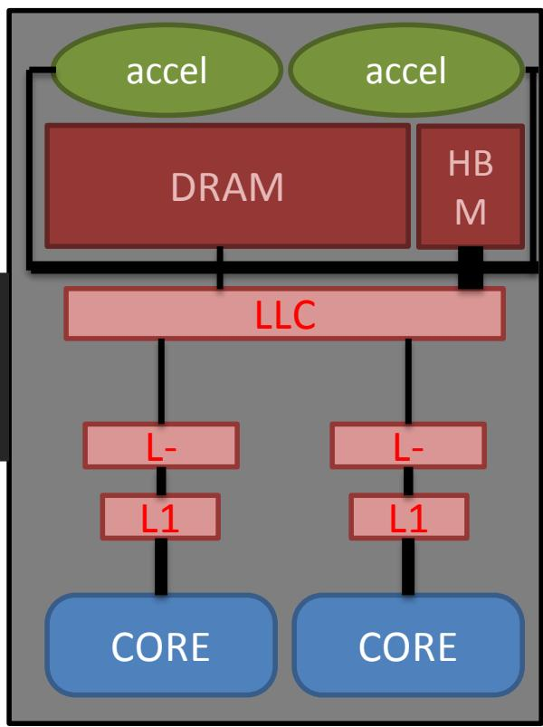
    </td>
    <td style="width: 62%; vertical-align: top;">
      <ul>
        <li>When core 0 accesses accelerator 0 on the same socket, the path stays local 当 core 0 访问同一插槽上的 accelerator 0 时，数据路径基本保持在本地</li>
        <li>This avoids extra socket-to-socket hops and is usually the cheapest case 这种情况避免了额外的跨插槽跳转，通常代价最低</li>
        <li>Placement and affinity therefore matter for accelerators too 因此加速器同样需要关注设备放置与线程亲和性</li>
      </ul>
    </td>
  </tr>
</table>

<table style="width: 100%; border-collapse: collapse;">
  <tr>
    <td style="width: 38%; vertical-align: top; padding-right: 1.25rem;">
      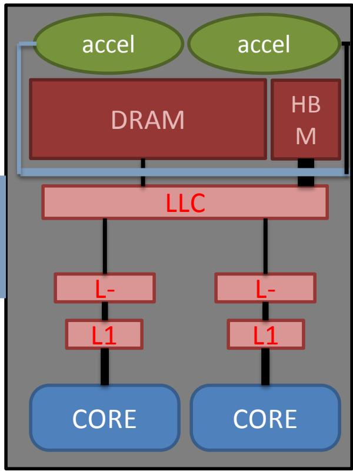
    </td>
    <td style="width: 62%; vertical-align: top;">
      <ul>
        <li>When core 0 accesses accelerator 2 attached to another socket, requests must cross more interconnects 当 core 0 访问挂在另一插槽上的 accelerator 2 时，请求必须穿过更多互连链路</li>
        <li>Those extra hops increase latency and can reduce effective bandwidth 这些额外跳转会提高延迟，并降低有效带宽</li>
        <li>The same reasoning applies to NICs, storage controllers, and other socket-attached devices 同样的道理也适用于网卡、存储控制器以及其他挂在插槽上的设备</li>
      </ul>
    </td>
  </tr>
</table>

<table style="width: 100%; border-collapse: collapse;">
  <tr>
    <td style="width: 100%; vertical-align: top;">
      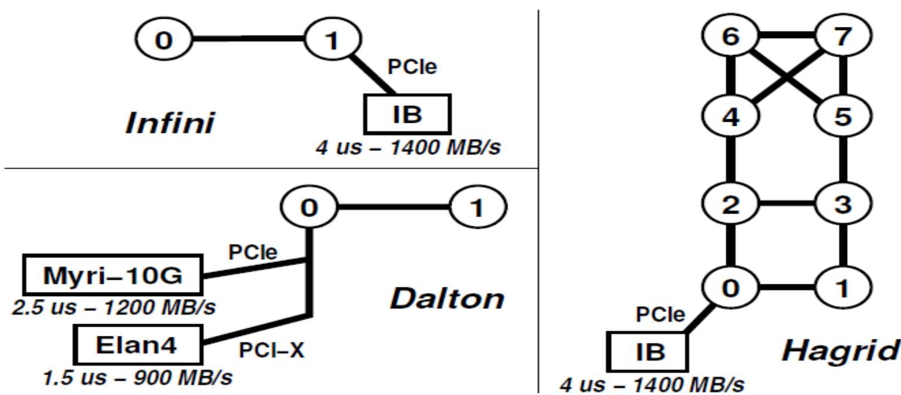
      <p>Topology of the experimentation platforms 实验平台拓扑</p>
    </td>
  </tr>
</table>

<table>
  <tr><td></td><td>Local Node</td><td>Distant Node</td><td>Overhead</td></tr>
  <tr><td>MYRI-10G</td><td>1739</td><td>1794</td><td>55</td></tr>
  <tr><td>ELAN4</td><td>1610</td><td>1670</td><td>60</td></tr>
  <tr><td>INFINIBAND</td><td>464</td><td>559</td><td>95</td></tr>
</table>

Table 1. Impact of NUMA placement on small-request round-trip latency (ns) 表 1：NUMA 放置对小请求往返延迟（纳秒）的影响。

<table style="width: 100%; border-collapse: collapse;">
  <tr>
    <td style="width: 100%; vertical-align: top;">
      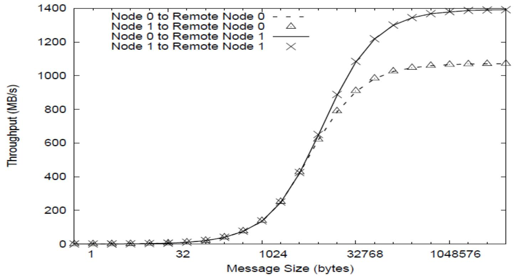
      <p>RDMA write performance under different NUMA placements 不同 NUMA 放置下的 RDMA 写性能</p>
    </td>
  </tr>
</table>

# Latency evaluation 延迟评估

<table style="width: 100%; border-collapse: collapse;">
  <tr>
    <td style="width: 100%; vertical-align: top;">
      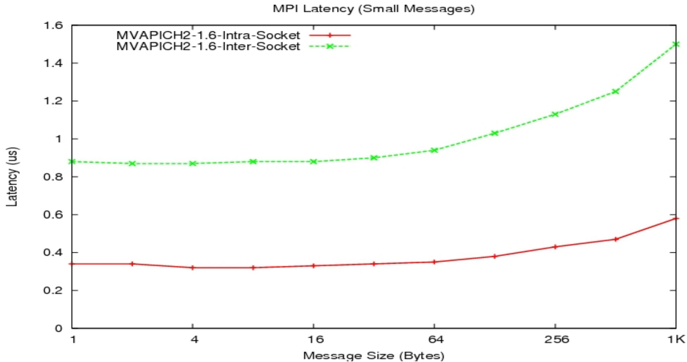
    </td>
  </tr>
</table>
