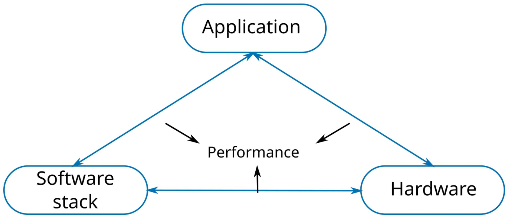
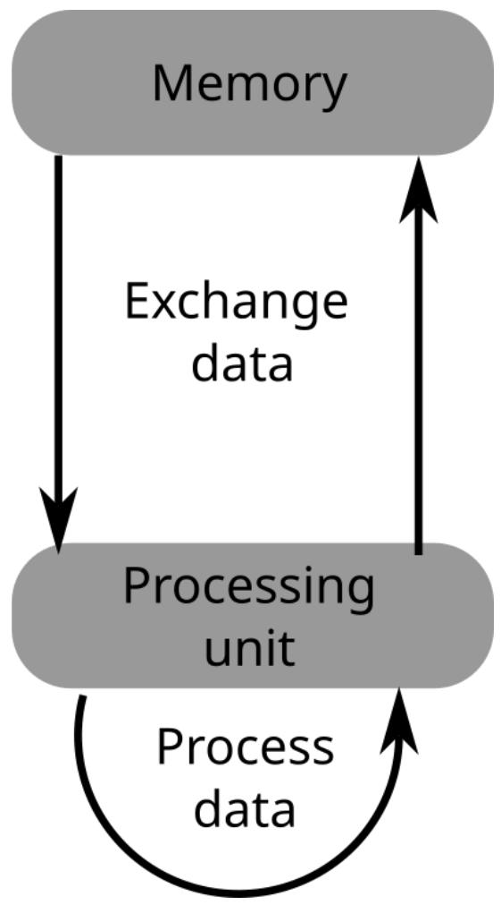
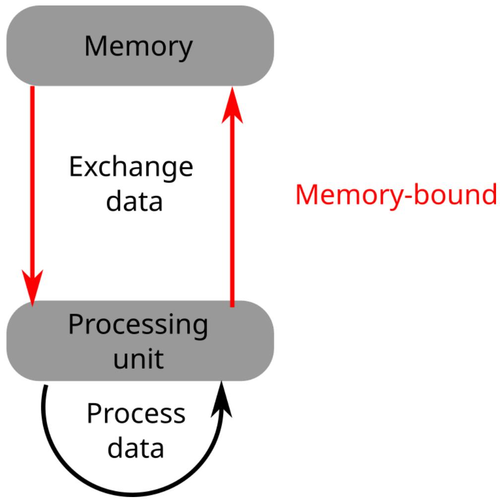
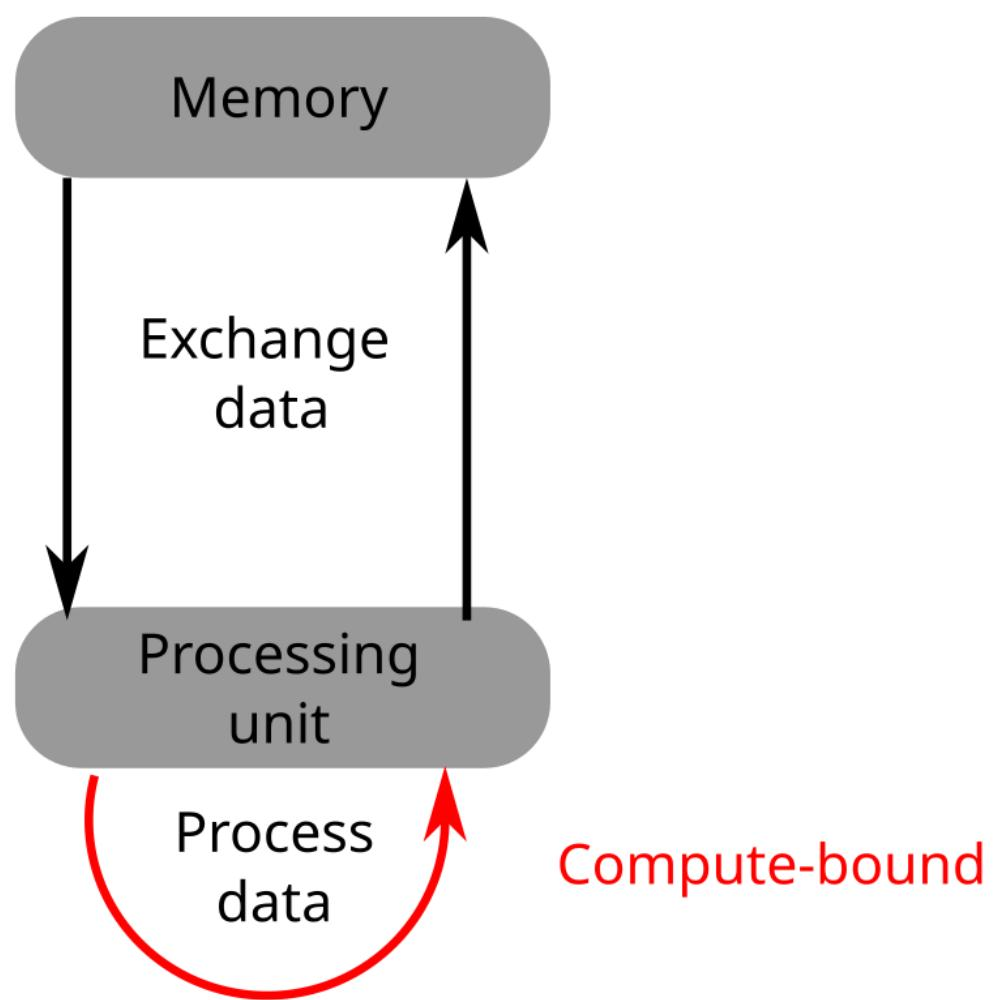
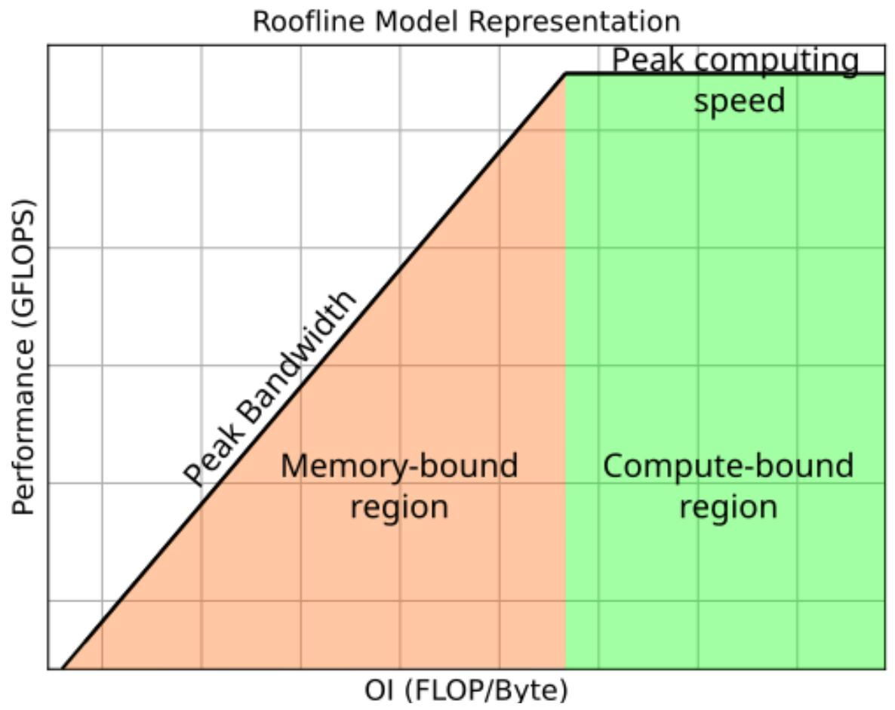

# 4 The Roofline model Roofline 模型

## Performance of applications 应用程序性能

<table style="width: 100%; border-collapse: collapse;">
  <tr>
    <td style="width: 38%; vertical-align: top; padding-right: 1.25rem;">
      
    </td>
    <td style="width: 62%; vertical-align: top;">
      <ul>
        <li>Application performance comes from the interaction between several hardware and software aspects 应用程序性能来自多个硬件与软件因素之间的相互作用</li>
        <li>It is usually not enough to look only at arithmetic throughput or only at memory speed 只看计算吞吐或者只看内存速度，通常都不足以解释整体性能</li>
        <li>Optimization therefore requires understanding how these factors constrain one another 因此性能优化需要理解这些因素如何彼此限制</li>
      </ul>
    </td>
  </tr>
</table>

## Performance analysis 性能分析

<table style="width: 100%; border-collapse: collapse;">
  <tr>
    <td style="width: 100%; vertical-align: top;">
      <ul>
        <li>Performance analysis tools and models help explain bottlenecks and guide optimization efforts 性能分析工具和模型可以帮助解释瓶颈，并指导优化方向</li>
        <li>One important model is the Roofline Model proposed by S. Williams et al. 一个重要模型是 S. Williams 等人提出的 Roofline 模型</li>
        <li>The model is simple, visual, and widely used in practice 这个模型简单、直观，而且在实际分析中被广泛使用</li>
        <li>It appears in tools such as Intel Advisor and NVIDIA Nsight Compute 它也出现在 Intel Advisor 和 NVIDIA Nsight Compute 等分析工具中</li>
      </ul>
      
Reference 参考：Samuel Williams, Andrew Waterman, and David Patterson, <em>Roofline: an insightful visual performance model for multicore architectures</em>, CACM 52(4), 2009. <a href="https://doi.org/10.1145/1498765.1498785">https://doi.org/10.1145/1498765.1498785</a>

    </td>
  </tr>
</table>

## The Roofline idea Roofline 的核心思想

<table style="width: 100%; border-collapse: collapse;">
  <tr>
    <td style="width: 33.3%; padding: 0.2rem;"></td>
    <td style="width: 33.3%; padding: 0.2rem;"></td>
    <td style="width: 33.3%; padding: 0.2rem;"></td>
  </tr>
</table>

<table style="width: 100%; border-collapse: collapse;">
  <tr>
    <td style="width: 100%; vertical-align: top;">
      <ul>
        <li>Computation can proceed only if operands are available and results can be written back 只有当操作数可用且结果能够写回时，计算才能真正进行</li>
        <li>Memory bandwidth therefore imposes a hard upper bound on many programs 因此内存带宽会对很多程序形成一个硬性的性能上限</li>
        <li>Operational intensity, often written OI, measures operations performed per byte moved `OI` 表示操作强度，常写作 `Operational Intensity`，即每移动 1 字节数据能够完成多少操作</li>
      </ul>
    </td>
  </tr>
</table>

## Roofline equation Roofline 公式

<table style="width: 100%; border-collapse: collapse;">
  <tr>
    <td style="width: 38%; vertical-align: top; padding-right: 1.25rem;">
      
    </td>
    <td style="width: 62%; vertical-align: top;">
      <ul>
        <li>The Roofline bound can be written as `roofline(OI) = min(Peak Bandwidth * OI, Peak Compute Performance)` Roofline 上界可以写成 `roofline(OI) = min(Peak Bandwidth * OI, Peak Compute Performance)`</li>
        <li>At low operational intensity, performance is limited by memory bandwidth 当操作强度较低时，程序性能主要受内存带宽限制</li>
        <li>At high operational intensity, performance is limited by peak compute capability 当操作强度较高时，程序性能主要受峰值计算能力限制</li>
        <li>This is why a program is often described as either memory-bound or compute-bound 这也是为什么我们常把程序分成 memory-bound 或 compute-bound 两类</li>
      </ul>
    </td>
  </tr>
</table>

## Reading the plot 如何阅读 Roofline 图

<table style="width: 100%; border-collapse: collapse;">
  <tr>
    <td style="width: 100%; vertical-align: top;">
      <ul>
        <li>The horizontal axis is operational intensity, usually in operations per byte 横轴是操作强度，通常单位是每字节操作数</li>
        <li>The vertical axis is achieved or theoretical performance 纵轴是实际达到的性能或理论性能上界</li>
        <li>The slanted part corresponds to the bandwidth-limited region 斜线部分对应带宽受限区域</li>
        <li>The flat roof corresponds to the compute-limited region 水平屋顶部分对应计算受限区域</li>
        <li>Optimization can either move a kernel to the right by increasing data reuse, or upward by improving efficiency 优化可以通过增加数据复用把点向右移动，也可以通过提高执行效率把点向上推近上界</li>
      </ul>
    </td>
  </tr>
</table>

## Further reading 延伸阅读

<table style="width: 100%; border-collapse: collapse;">
  <tr>
    <td style="width: 100%; vertical-align: top;">
      
For a deeper introduction, the original slide suggests Thierry Dumont's course material 若想进一步学习，原始课件推荐 Thierry Dumont 的讲义材料：

      
<a href="http://lyoncalcul.univ-lyon1.fr/ed/DOCS_2015-2016/intensite.pdf">http://lyoncalcul.univ-lyon1.fr/ed/DOCS_2015-2016/intensite.pdf</a>

    </td>
  </tr>
</table>
