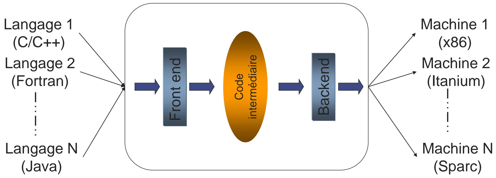
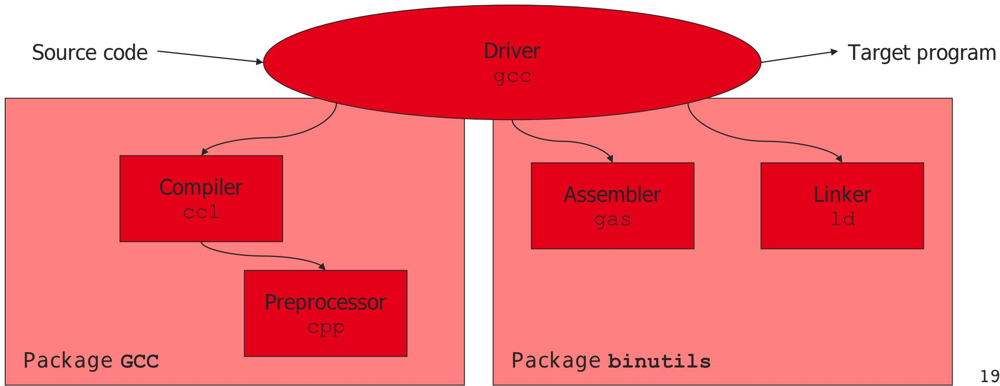
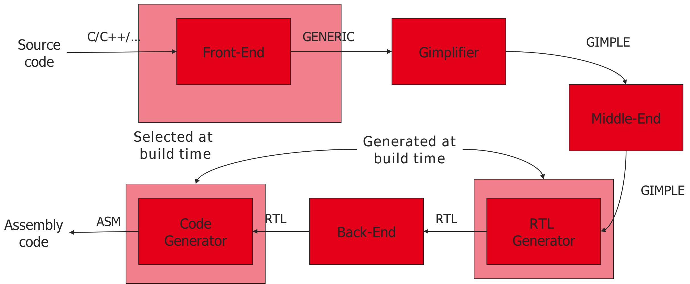

# 6 Compilers 编译器

## The standard compiler view 标准编译器视角

<table style="width: 100%; border-collapse: collapse;">
  <tr>
    <td style="width: 38%; vertical-align: top; padding-right: 1.25rem;">
      
    </td>
    <td style="width: 62%; vertical-align: top;">
      <ul>
        <li>An introductory view often presents the compiler as a simple pipeline 入门时我们常把编译器看成一条简单的处理流水线</li>
        <li>This is an idealized picture, but it is a useful starting point 这是一种理想化视角，但很适合作为理解编译流程的起点</li>
        <li>GCC is one of the most important examples of such a compilation infrastructure GCC 是最重要的编译基础设施之一</li>
      </ul>
    </td>
  </tr>
</table>

## GCC architecture GCC 架构

<table style="width: 100%; border-collapse: collapse;">
  <tr>
    <td style="width: 50%; vertical-align: top; padding-right: 0.75rem;">
      
    </td>
    <td style="width: 50%; vertical-align: top; padding-left: 0.75rem;">
      
    </td>
  </tr>
</table>

<table style="width: 100%; border-collapse: collapse;">
  <tr>
    <td style="width: 100%; vertical-align: top;">
      <ul>
        <li>GCC is organized around several major stages, from source parsing to target-specific code generation GCC 由多个主要阶段组成，从源代码解析一直到面向目标架构的代码生成</li>
        <li>The main stages are usually presented as preprocessor, front-end, middle-end, and back-end 主要阶段通常概括为 preprocessor、front-end、middle-end 和 back-end</li>
        <li>Different intermediate representations are used along the way 在这一过程中会使用多种中间表示</li>
      </ul>
      <p>Reference 参考：Uday Khedker, Indian Institute of Technology Bombay.</p>
    </td>
  </tr>
</table>

## Preprocessor 预处理器

<table style="width: 100%; border-collapse: collapse;">
  <tr>
    <td style="width: 100%; vertical-align: top;">
      <ul>
        <li>The C preprocessor, often called `CPP`, handles preprocessing directives C 预处理器通常记作 `CPP`，负责处理预处理指令</li>
        <li>Examples include `#ifdef`, `#include`, `#warning`, and `#error` 常见指令包括 `#ifdef`、`#include`、`#warning` 和 `#error`</li>
        <li>Preprocessing can greatly expand the size of the source code after macro expansion and header inclusion 经过宏展开和头文件包含之后，代码体积往往会显著膨胀</li>
        <li>`#pragma` is special and is not handled in exactly the same way as ordinary preprocessor directives `#pragma` 比较特殊，它并不等同于普通预处理指令的处理方式</li>
      </ul>
    </td>
  </tr>
</table>

## Front-end 前端

<table style="width: 100%; border-collapse: collapse;">
  <tr>
    <td style="width: 100%; vertical-align: top;">
      <ul>
        <li>The front-end reads the input source file and checks whether it is valid 前端负责读取输入源文件，并检查其语法和语义是否合法</li>
        <li>Typical work includes lexical analysis, syntax analysis, and semantic analysis 典型工作包括词法分析、语法分析和语义分析</li>
        <li>GCC has different front-ends for different languages, such as C, C++, and Fortran GCC 针对不同语言有不同的前端，例如 C、C++ 和 Fortran</li>
        <li>In GCC, C and Objective-C front-ends live in `gcc/c/` and `gcc/c-family/` 在 GCC 源码中，C 和 Objective-C 前端主要位于 `gcc/c/` 和 `gcc/c-family/`</li>
        <li>C++ front-end code is mainly in `gcc/cp/` and `gcc/c-family/` C++ 前端主要位于 `gcc/cp/` 和 `gcc/c-family/`</li>
        <li>Fortran front-end code is in `gcc/fortran/` Fortran 前端主要位于 `gcc/fortran/`</li>
        <li>The output of this stage is an internal representation such as `GENERIC`, or directly `GIMPLE` for some language paths 这一阶段的输出是内部表示，例如 `GENERIC`，而某些语言路径会更直接地产生 `GIMPLE`</li>
      </ul>
    </td>
  </tr>
</table>

## GENERIC 中间表示

<table style="width: 100%; border-collapse: collapse;">
  <tr>
    <td style="width: 100%; vertical-align: top;">
      <ul>
        <li>`GENERIC` is a high-level language-independent internal tree representation `GENERIC` 是一种较高层、与源语言无关的树状中间表示</li>
        <li>The parser first constructs an abstract syntax tree, then removes language-specific constructs 解析器会先构造抽象语法树，再逐步去掉语言特有结构</li>
        <li>The result is emitted as `GENERIC` near the end of parsing 最终在解析阶段结束附近产出 `GENERIC`</li>
        <li>Tree node kinds are described in `gcc/tree.def` 各种树节点类型定义在 `gcc/tree.def` 中</li>
      </ul>
    </td>
  </tr>
</table>

## Middle-end 中端

<table style="width: 100%; border-collapse: collapse;">
  <tr>
    <td style="width: 100%; vertical-align: top;">
      <ul>
        <li>The middle-end performs high-level optimizations that are mostly architecture-independent 中端负责执行高层优化，而且这些优化大多与具体硬件架构无关</li>
        <li>Optimizations may happen at function, loop, or interprocedural level 优化可以发生在函数级、循环级或者跨过程级别</li>
        <li>GCC uses a pass manager to schedule these transformations GCC 通过 pass manager 来管理这些变换的执行顺序</li>
        <li>A central representation used here is `GIMPLE`, often together with other structures such as the control-flow graph 这一阶段的核心表示之一是 `GIMPLE`，通常还会结合控制流图等其他结构一起使用</li>
      </ul>
    </td>
  </tr>
</table>

## GIMPLE 中间表示

<table style="width: 100%; border-collapse: collapse;">
  <tr>
    <td style="width: 100%; vertical-align: top;">
      <ul>
        <li>`GIMPLE` is a simplified high-level intermediate representation used by GCC `GIMPLE` 是 GCC 使用的一种简化高层中间表示</li>
        <li>It is designed to make optimization passes easier to implement and reason about 它的设计目标是让优化 pass 更容易实现和分析</li>
        <li>Key ideas include three-address style code, simplified control flow, and a restricted grammar 关键特征包括三地址风格代码、简化控制流以及受限制的语法形式</li>
        <li>The transformation from `GENERIC` to `GIMPLE` is performed by routines such as `gimplify_function_tree()` `GENERIC` 到 `GIMPLE` 的转换由类似 `gimplify_function_tree()` 这样的例程完成</li>
        <li>Slides often distinguish `High GIMPLE` and `Low GIMPLE` 课件里通常还会区分 `High GIMPLE` 与 `Low GIMPLE`</li>
      </ul>
    </td>
  </tr>
</table>

## A small C example 一个简单的 C 例子

<table style="width: 100%; border-collapse: collapse;">
  <tr>
    <td style="width: 100%; vertical-align: top;">
      <p>A tiny example in C can be compiled with `gcc -fdump-tree-all test.c` to inspect intermediate files 一个很小的 C 例子可以通过 `gcc -fdump-tree-all test.c` 编译，并查看生成的中间文件。</p>
    </td>
  </tr>
</table>

```c
int main() {
    int x = 10;
    if (x) {
        int y = 5;
        x = x * y + 15;
    }
}
```

<table style="width: 100%; border-collapse: collapse;">
  <tr>
    <td style="width: 100%; vertical-align: top;">
      <ul>
        <li>`GIMPLE` introduces temporaries such as `D.2720` `GIMPLE` 会引入像 `D.2720` 这样的临时变量</li>
        <li>Expressions are broken into simpler three-address operations 复杂表达式会被拆成更简单的三地址形式</li>
        <li>Control flow becomes more explicit, often with labels and gotos 控制流会变得更显式，通常会看到标签和跳转</li>
      </ul>
    </td>
  </tr>
</table>

```txt
main () {
  int D.2720;
  int x;

  x = 10;
  if (x != 0)
    goto <D.2718>;
  else
    goto <D.2719>;

<D.2718>:
  {
    int y;
    y = 5;
    D.2720 = x * y;
    x = D.2720 + 15;
  }

<D.2719>:
}
```

<table style="width: 100%; border-collapse: collapse;">
  <tr>
    <td style="width: 100%; vertical-align: top;">
      <p>If raw dumps are requested with `gcc -fdump-tree-all-raw test.c`, the same structure appears with explicit `gimple_*` node names 如果使用 `gcc -fdump-tree-all-raw test.c` 生成原始转储，同样的结构会以显式的 `gimple_*` 节点名称出现。</p>
    </td>
  </tr>
</table>

```txt
main ()
gimple_bind <
  int D.2720;
  int x;
  gimple_assign<integer_cst, x, 10, NULL>
  gimple_cond<ne_expr, x, 0, <D.2718>, <D.2719>>
  gimple_label<<D.2718>>
  gimple_bind <
    int y;
    gimple_assign<integer_cst, y, 5, NULL>
    gimple_assign<mult_expr, D.2720, x, y>
    gimple_assign<plus_expr, x, D.2720, 15>
  >
  gimple_label<<D.2719>>
>
```

## From GIMPLE to CFG 从 GIMPLE 到控制流图

<table style="width: 100%; border-collapse: collapse;">
  <tr>
    <td style="width: 100%; vertical-align: top;">
      <p>Later dumps such as `test.c.011t.cfg` make the basic-block structure explicit 更后面的转储，例如 `test.c.011t.cfg`，会把基本块结构表示得更加明显。</p>
    </td>
  </tr>
</table>

```txt
main () {
  int y;
  int x;
  int D.2720;

<bb 2>:
  x = 10;
  if (x != 0)
    goto <bb 3>;
  else
    goto <bb 4>;

<bb 3>:
  y = 5;
  D.2720 = x * y;
  x = D.2720 + 15;

<bb 4>:
  return;
}
```

## Other compilers 其他编译器

<table style="width: 100%; border-collapse: collapse;">
  <tr>
    <td style="width: 100%; vertical-align: top;">
      <ul>
        <li>GCC is only one example of a compiler infrastructure GCC 只是编译器基础设施中的一个代表</li>
        <li>Other compiler families, such as LLVM/Clang, use different internal organizations and intermediate representations 其他编译器家族，例如 LLVM/Clang，会采用不同的内部组织方式和中间表示</li>
        <li>But the same general idea remains: parse, represent, optimize, and generate code 但总体思路相通，仍然是解析、表示、优化，再生成代码</li>
      </ul>
    </td>
  </tr>
</table>
