# 9 MPI

## MPI optimization overview MPI 优化概览

<table style="width: 100%; border-collapse: collapse;">
  <tr>
    <td style="width: 100%; vertical-align: top;">
      <ul>
        <li>Writing and optimizing an MPI program is not trivial 编写和优化一个 MPI 程序并不简单</li>
        <li>Good MPI performance depends both on the user algorithm and on the MPI implementation itself 良好的 MPI 性能既取决于用户算法，也取决于 MPI 实现本身</li>
        <li>At user level, the main questions are decomposition, communication pattern, and scalability 在用户层面，主要问题是如何分解数据、如何组织通信模式，以及程序能否扩展</li>
        <li>At implementation level, the main questions are message progression, collective algorithms, and runtime options 在实现层面，主要问题是消息推进、集合通信算法以及运行时选项</li>
      </ul>
    </td>
  </tr>
</table>

## User-side performance thinking 用户侧的性能思维

<table style="width: 100%; border-collapse: collapse;">
  <tr>
    <td style="width: 100%; vertical-align: top;">
      <ul>
        <li>Use a parallel-friendly algorithm instead of trying to force a sequential design into MPI 应优先选择适合并行的算法，而不是强行把顺序算法塞进 MPI</li>
        <li>Follow Amdahl's law and reduce sequential sections, unnecessary synchronizations, and serialization 要遵循 Amdahl 定律，尽量减少串行部分、不必要同步和串行化行为</li>
        <li>Small code changes may strongly affect communication cost and scalability 代码里很小的变化也可能显著改变通信成本与扩展性</li>
        <li>A good scalable design is a trade-off between number of messages, message size, and concurrency 一个好的可扩展设计，是消息数量、消息大小和通信并发度之间的权衡</li>
      </ul>
    </td>
  </tr>
</table>

## Domain decomposition 域分解

<table style="width: 100%; border-collapse: collapse;">
  <tr>
    <td style="width: 100%; vertical-align: top;">
      <ul>
        <li>MPI programs distribute both computation and data among processes MPI 程序会把计算和数据一起分布到多个进程上</li>
        <li>For mesh-based computations, each process usually owns one subdomain 对基于网格的计算来说，每个进程通常拥有一个子区域</li>
        <li>Communications often occur at partition borders, through halo or ghost cells 通信通常发生在分区边界上，通过 halo cells 或 ghost cells 完成</li>
      </ul>
    </td>
  </tr>
</table>

## Example: 2D stencil decomposition 例子：二维 stencil 的分解

<table style="width: 100%; border-collapse: collapse;">
  <tr>
    <td style="width: 100%; vertical-align: top;">
      <ul>
        <li>Consider a `30 x 9` integer matrix distributed over 3 MPI processes 考虑一个 `30 x 9` 的整数矩阵，把它分给 3 个 MPI 进程</li>
        <li>The computation is a 4-point Jacobi stencil 计算模式是 4 点 Jacobi stencil</li>
        <li>Each updated cell needs its four direct neighbors 每个单元的更新都需要上、下、左、右四个直接邻居</li>
      </ul>
    </td>
  </tr>
  <tr>
    <td style="width: 100%; padding-top: 0.35rem;">
      
    </td>
  </tr>  
  <tr>
    <td style="width: 100%; padding-top: 0.35rem;">
      
    </td>
  </tr>
</table>

### Vertical decomposition 垂直分解

<table style="width: 100%; border-collapse: collapse;">
  <tr>
    <td style="width: 100%; vertical-align: top;">
      <ul>
        <li>With vertical decomposition, each process owns a vertical strip 垂直分解时，每个进程拥有一条竖向条带</li>
        <li>Ghost cells exchange then involves many small sends for border columns 这时 ghost cells exchange 会变成很多个针对边界列的小消息</li>
        <li>In the slide example, the decomposition leads to 18 sends 在课件示例里，这种分解会产生 18 次发送</li>
        <li>This is usually bad for communication overhead 这种做法通常不利于降低通信开销</li>
      </ul>
      <pre><code class="language-c">MPI_Send(&(a[0][1]), 1, MPI_INT, ...);
MPI_Send(&(a[1][1]), 1, MPI_INT, ...);
MPI_Send(&(a[2][1]), 1, MPI_INT, ...);
MPI_Send(&(a[3][1]), 1, MPI_INT, ...);
...
MPI_Send(&(a[0][L/3]), 1, MPI_INT, ...);
MPI_Send(&(a[1][L/3]), 1, MPI_INT, ...);</code></pre>
    </td>
  </tr>
  <tr>
    <td style="width: 100%; padding-top: 0.35rem;">
      
    </td>
  </tr>
</table>

### Horizontal decomposition 水平分解

<table style="width: 100%; border-collapse: collapse;">
  <tr>
    <td style="width: 100%; vertical-align: top;">
      <ul>
        <li>With horizontal decomposition, each process owns a block of rows 水平分解时，每个进程拥有若干整行</li>
        <li>Ghost cells exchange becomes more contiguous and easier to pack 这时 ghost cells exchange 会变得更连续，也更容易打包</li>
        <li>In the example, only 2 sends are needed 在这个例子中，只需要 2 次发送</li>
        <li>This illustrates how decomposition directly changes communication cost 这说明分解方式会直接改变通信成本</li>
      </ul>
      
<code>ghost cells</code> means neighboring boundary data cached locally for computation；<code>ghost cells</code> 指为了本地邻域计算而暂存的邻居边界数据副本。

    </td>
  </tr>
  <tr>
    <td style="width: 100%; padding-top: 0.35rem;">
      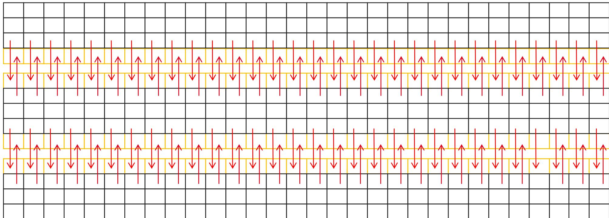
    </td>
  </tr>
</table>

## Example: stencils versus SGEMM 例子：stencil 与 SGEMM

<table style="width: 100%; border-collapse: collapse;">
  <tr>
    <td style="width: 100%; vertical-align: top;">
      <ul>
        <li>For SGEMM, decomposition choices are different from simple stencil cases 对 SGEMM 来说，分解方式与简单 stencil 场景并不一样</li>
        <li>Decomposing one matrix may force an inconvenient decomposition of the other 分解第一矩阵，往往会强迫第二矩阵也采用不方便的分解</li>
        <li>A naive decomposition can therefore be communication-heavy 因而一个看似自然的分解可能会带来很重的通信代价</li>
      </ul>
    </td>
  </tr>
  <tr>
    <td style="width: 100%; padding-top: 0.35rem;">
      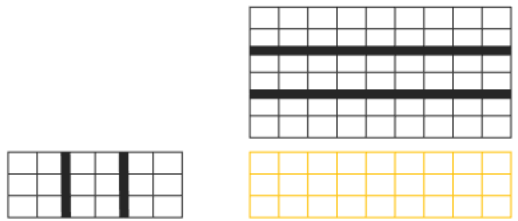
    </td>
  </tr>
</table>

<table style="width: 100%; border-collapse: collapse;">
  <tr>
    <td style="width: 100%; vertical-align: top;">
      <ul>
        <li>One option is to decompose only one matrix and replicate the other 一个选择是只分解一个矩阵，把另一个矩阵复制到各个进程上</li>
        <li>This works if replication fits in memory 如果复制后的数据仍能放进内存，这种方法是可行的</li>
        <li>If both matrices must be decomposed, transposition may help restore locality 如果两个矩阵都必须分解，那么转置往往有助于恢复局部性</li>
      </ul>
    </td>
  </tr>
  <tr>
    <td style="width: 100%; padding-top: 0.35rem;">
      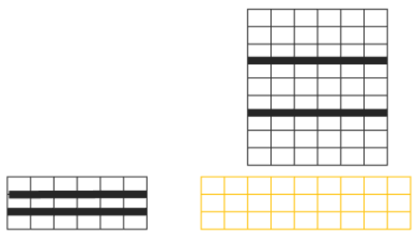
    </td>
  </tr>
</table>

## Partitioning trade-offs 分区权衡

<table style="width: 100%; border-collapse: collapse;">
  <tr>
    <td style="width: 100%; vertical-align: top;">
      <ul>
        <li>Communication cost is not the only metric when partitioning a problem 分区时不能只看通信代价</li>
        <li>Load balance is equally important, especially when cells or tasks have different computational weights 负载均衡同样重要，尤其当不同单元的计算代价不同时更是如此</li>
        <li>If one uses horizontal decomposition, communication is cheaper, but one process may receive all heavyweight cells 如果采用 horizontal decomposition，通信代价更低，但某一个进程可能拿到全部高负载单元</li>
        <li>In that case, the best communication pattern may still lead to compute workload imbalance 这意味着即使通信模式最好，也仍然可能出现计算负载不均衡</li>
        <li>With vertical decomposition, the workload can be more balanced, but communication becomes more expensive 而采用 vertical decomposition 时，负载可能更均衡，但通信成本会更高</li>
        <li>This is why automatic partitioners such as ParMETIS are useful 这也是为什么像 ParMETIS 这样的自动分区器会有价值</li>
      </ul>
    </td>
  </tr>
  <tr>
    <td style="width: 100%; padding-top: 0.35rem;">
      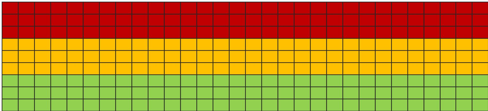
    </td>
  </tr>  
  <tr>
    <td style="width: 100%; padding-top: 0.35rem;">
      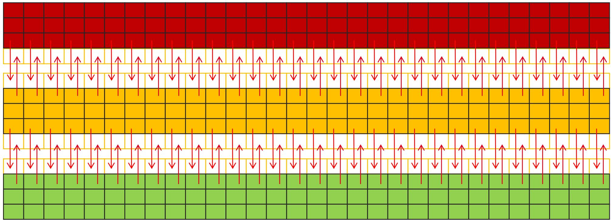
    </td>
  </tr>  
  <tr>
    <td style="width: 100%; padding-top: 0.35rem;">
      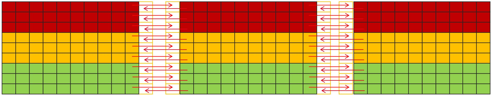
    </td>
  </tr>
</table>

<table style="width: 100%; border-collapse: collapse;">
  <tr>
    <td style="width: 62%; vertical-align: top;">
      <ul>
        <li>User-side MPI optimization is primarily about code design 用户侧 MPI 优化首先是代码设计问题</li>
        <li>Bad decomposition can create too many calls, dependencies, or serialized communication 糟糕的分解会造成过多调用、过强依赖或串行化通信</li>
        <li>The final choice is often a trade-off between communication cost and workload balance 最终方案往往是在通信成本与负载均衡之间做权衡</li>
      </ul>
    </td>
  </tr>
</table>

## Asynchronous progression 异步推进

<table style="width: 100%; border-collapse: collapse;">
  <tr>
    <td style="width: 100%; vertical-align: top;">
      <ul>
        <li>Asynchronous progression aims to overlap communication with computation 异步推进的目标是让通信和计算重叠</li>
        <li>Non-blocking communication is useful only if messages actually make progress in the background 只有当消息能在后台真正推进时，非阻塞通信才有意义</li>
        <li>Depending on the implementation, overlap may be partial, full, or almost absent 根据实现不同，通信与计算的重叠可能是部分的、完全的，甚至几乎没有</li>
        <li>The usual comparison is `(a)` blocking receive, `(b)` partially overlapped non-blocking receive, and `(c)` fully overlapped non-blocking receive 常见对比是 `(a)` 阻塞接收、`(b)` 部分重叠的非阻塞接收，以及 `(c)` 完全重叠的非阻塞接收</li>
      </ul>
    </td>
  </tr>
  <tr>
    <td style="width: 100%; padding-top: 0.35rem;">
      <table style="width: 100%; border-collapse: collapse;">
        <tr>
          <td style="width: 50%; padding-right: 0.75rem; vertical-align: top;">
            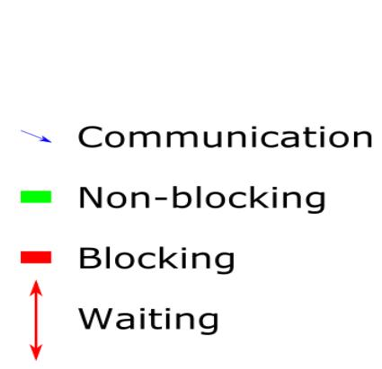
            
(a) blocking recv 阻塞接收

          </td>
          <td style="width: 50%; padding-left: 0.75rem; vertical-align: top;">
            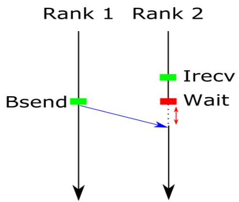
            
(b) non-blocking recv partially overlapped 部分重叠的非阻塞接收

          </td>
        </tr>
        <tr>
          <td colspan="2" style="width: 100%; padding-top: 0.35rem; vertical-align: top;">
            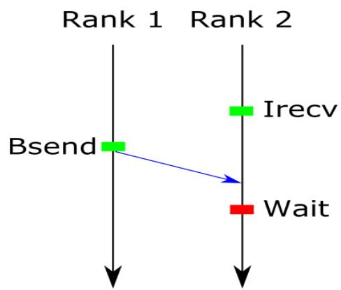
            
(c) non-blocking recv totally overlapped 完全重叠的非阻塞接收

          </td>
        </tr>
      </table>
    </td>
  </tr>
</table>

## How messages progress 消息如何推进

<table style="width: 100%; border-collapse: collapse;">
  <tr>
    <td style="width: 100%; vertical-align: top;">
      <ul>
        <li>Messages may progress only when the application thread calls MPI functions 消息可能只会在应用线程调用 MPI 函数时才被推进</li>
        <li>Another option is to use a dedicated progression thread 另一个办法是使用专门的推进线程</li>
        <li>A stronger option is to place progression on another core 更进一步的做法是把推进逻辑放到另一颗核心上</li>
        <li>Some systems can even offload part of the work to the network interface card 某些系统还能把部分推进工作下放给网卡</li>
      </ul>
    </td>
  </tr>
  <tr>
    <td style="width: 100%; padding-top: 0.35rem;">
      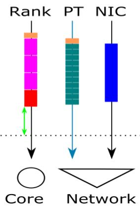
    </td>
  </tr>
</table>

## Implementation-specific options 实现相关选项

<table style="width: 100%; border-collapse: collapse;">
  <tr>
    <td style="width: 38%; vertical-align: top; padding-right: 1.25rem;">
      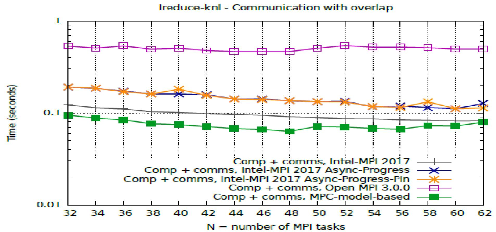
    </td>
    <td style="width: 62%; vertical-align: top;">
      <ul>
        <li>Different MPI implementations expose different tuning options 不同 MPI 实现会暴露不同的调优选项</li>
        <li>It helps to know whether derived datatypes, MPI I/O, collectives, or async progress are well supported 了解派生数据类型、MPI I/O、集合通信和异步推进是否被良好支持会很有帮助</li>
        <li>For example, some runtimes require environment variables to enable real asynchronous progress 例如某些运行时需要通过环境变量才能启用真正的异步推进</li>
      </ul>
    </td>
  </tr>
</table>

## Collective communication algorithms 集合通信算法

<table style="width: 100%; border-collapse: collapse;">
  <tr>
    <td style="width: 100%; vertical-align: top;">
      <ul>
        <li>Most collectives can be implemented by several different algorithms 大多数集合通信都可以用多种不同算法实现</li>
        <li>The best choice depends on process count, message size, and topology 最佳选择依赖于进程数、消息大小和底层拓扑</li>
        <li>MPI libraries often switch algorithms internally according to those factors MPI 库通常会根据这些因素在内部切换算法</li>
      </ul>
    </td>
  </tr>
</table>

### One-to-all and all-to-one 一对多与多对一

<table style="width: 100%; border-collapse: collapse;">
  <tr>
    <td style="width: 33.3%; padding: 0.2rem; vertical-align: top;">
      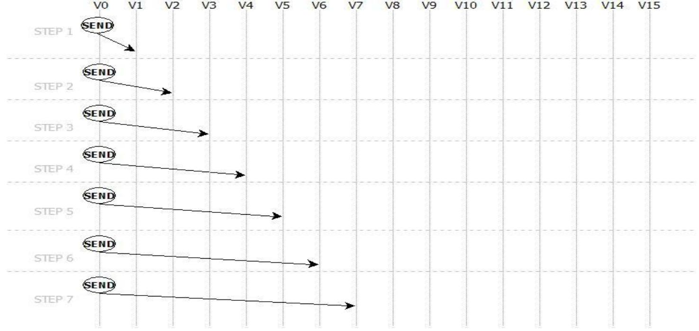
      
Linear 线性

    </td>
    <td style="width: 33.3%; padding: 0.2rem; vertical-align: top;">
      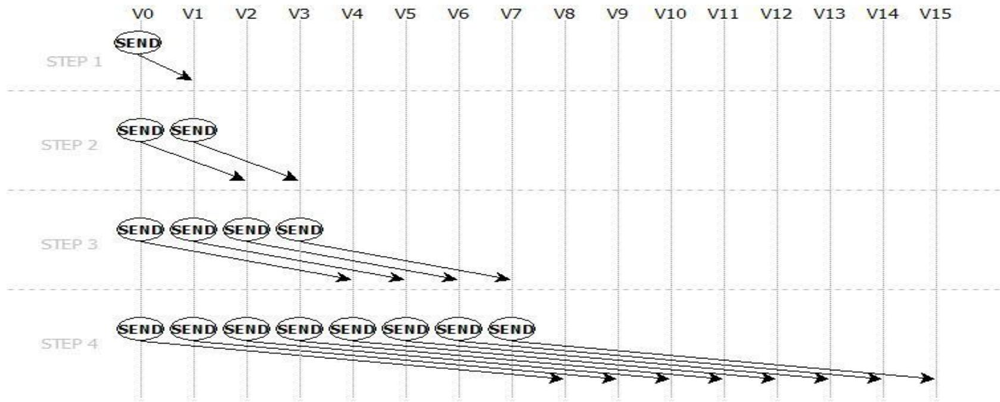
      
Binomial tree 二项树

    </td>
    <td style="width: 33.3%; padding: 0.2rem; vertical-align: top;">
      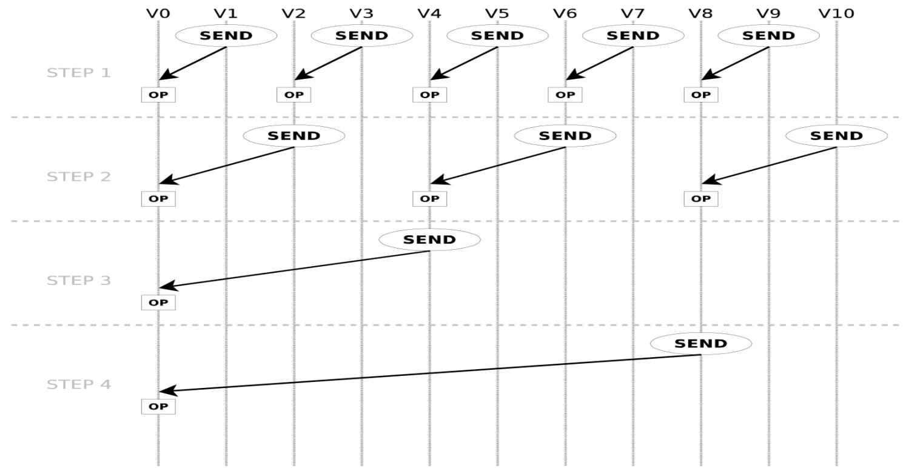
      
All-to-one 多对一

    </td>
  </tr>
</table>

<table style="width: 100%; border-collapse: collapse;">
  <tr>
    <td style="width: 100%; vertical-align: top;">
      <ul>
        <li>A linear broadcast needs `p - 1` steps 线性广播通常需要 `p - 1` 步</li>
        <li>A binomial tree broadcast needs about `log(p)` steps 二项树广播通常只需要大约 `log(p)` 步</li>
        <li>Gather and reduce families have similar design choices gather 和 reduce 这类集合通信也有类似的算法选择</li>
      </ul>
    </td>
  </tr>
</table>

### All-to-all and derived collectives 全对全及其派生集合通信

<table style="width: 100%; border-collapse: collapse;">
  <tr>
    <td style="width: 100%; vertical-align: top;">
      <ul>
        <li>Some all-to-all style collectives can be built from simpler patterns 某些全对全风格的集合通信可以由更基础的模式组合而成</li>
        <li>`Allreduce` is often viewed as `reduce + broadcast` `Allreduce` 常被看成 `reduce + broadcast` 的组合</li>
        <li>`Allgather` can also be seen as a composition of simpler collectives `Allgather` 也可以理解为更基础集合通信的组合</li>
        <li>Again, the best algorithm depends strongly on topology and contention 同样，最佳算法会强烈依赖拓扑结构和网络争用情况</li>
      </ul>
    </td>
  </tr>
  <tr>
    <td style="width: 100%; padding-top: 0.35rem;">
      <table style="width: 100%; border-collapse: collapse;">
        <tr>
          <td style="width: 50%; padding-right: 0.75rem; vertical-align: top;">
            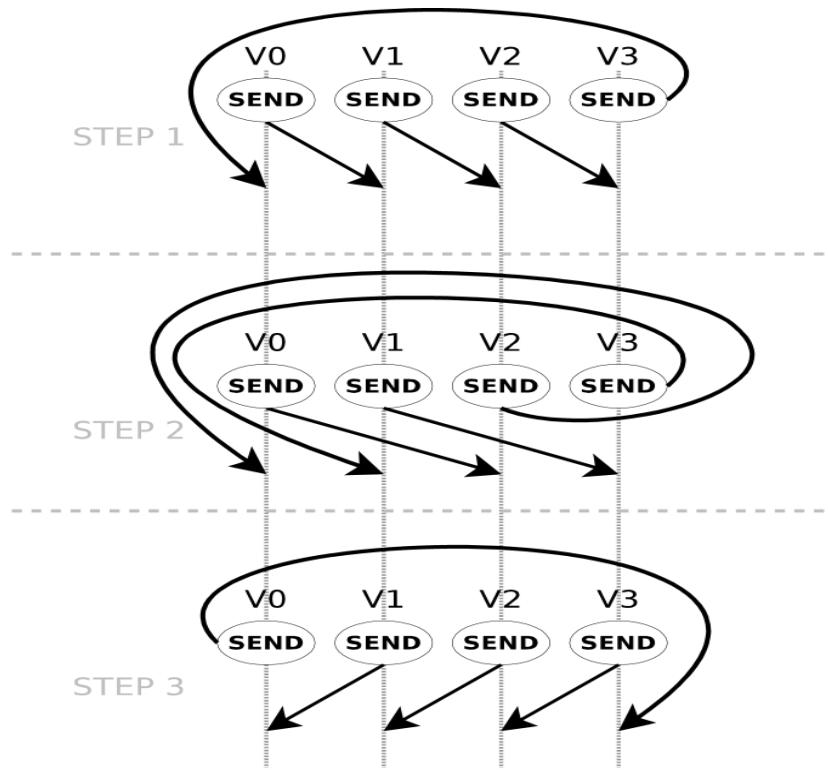
            
Parallel linear 并行线性算法

          </td>
          <td style="width: 50%; padding-left: 0.75rem; vertical-align: top;">
            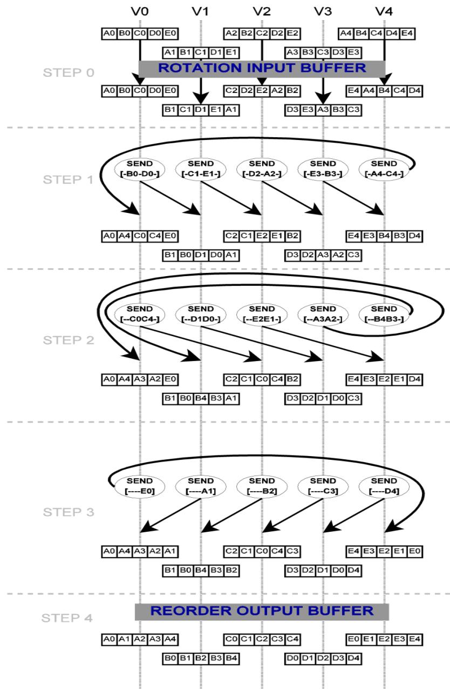
            
Disymmetric ring 非对称环算法

          </td>
        </tr>
      </table>
    </td>
  </tr>
</table>

### Broadcast tree placement effects 广播树与节点放置

<table style="width: 100%; border-collapse: collapse;">
  <tr>
    <td style="width: 50%; padding-right: 0.75rem; vertical-align: top;">
      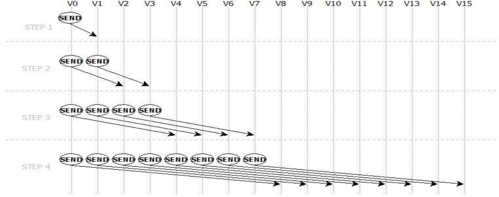
      
Version 1 overview 版本 1 概览

    </td>
    <td style="width: 50%; padding-left: 0.75rem; vertical-align: top;">
      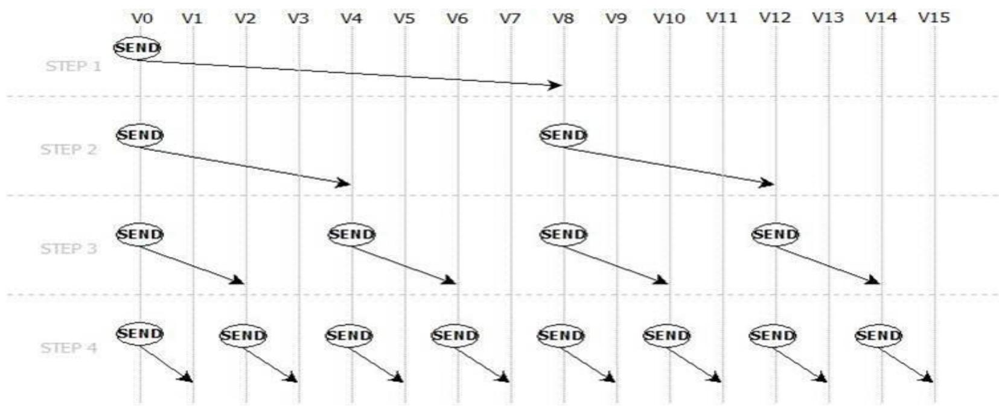
      
Version 2 overview 版本 2 概览

    </td>
  </tr>
</table>

<table style="width: 100%; border-collapse: collapse;">
  <tr>
    <td style="width: 50%; padding-right: 0.75rem; vertical-align: top;">
      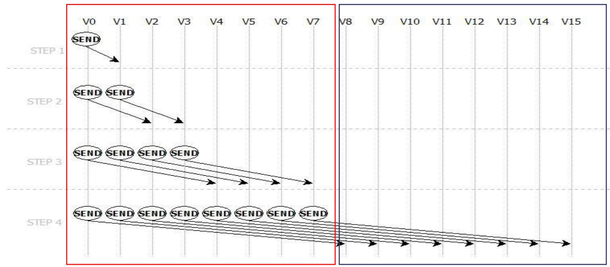
      
Version 1：more internode contention 版本 1：更多节点间争用

    </td>
    <td style="width: 50%; padding-left: 0.75rem; vertical-align: top;">
      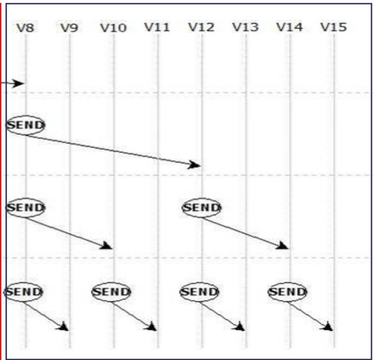
      
Version 2：less internode contention 版本 2：更少节点间争用

    </td>
  </tr>
</table>

<table style="width: 100%; border-collapse: collapse;">
  <tr>
    <td style="width: 100%; vertical-align: top;">
      <ul>
        <li>Both versions broadcast correctly, but they place internode traffic differently 两个版本都能正确完成广播，但它们放置跨节点流量的方式不同</li>
        <li>Two mathematically similar algorithms may behave very differently on real hardware 两个从数学上看相似的算法，在真实硬件上的表现可能差很多</li>
        <li>The reason is often the placement of internode communications across the network 根本原因往往在于跨节点通信如何落在网络上</li>
      </ul>
    </td>
  </tr>
</table>

## Topology-aware collective choice 拓扑感知的集合通信选择

<table style="width: 100%; border-collapse: collapse;">
  <tr>
    <td style="width: 62%; vertical-align: top;">
      <ul>
        <li>The best collective algorithm depends on the underlying network topology 最佳集合通信算法依赖底层网络拓扑</li>
        <li>An algorithm with fewer steps is not always faster if each step causes strong contention 即使一个算法步数更少，如果每一步都带来更强争用，它也不一定更快</li>
      </ul>
    </td>
  </tr>
</table>

## High-speed network topologies 高速网络拓扑

<table style="width: 100%; border-collapse: collapse;">
  <tr>
    <td style="width: 100%; vertical-align: top;">
      <ul>
        <li>Supercomputer nodes are connected through specialized high-speed networks 超级计算机节点通过专门的高速网络连接起来</li>
        <li>It is too expensive to give each node a direct link to every other node 不可能让每个节点都直接连接到所有其他节点，因为成本太高</li>
        <li>Topology design is therefore a trade-off between cost and communication efficiency 因此拓扑设计本质上是成本与通信效率之间的权衡</li>
        <li>Two common abstract criteria are average path length and bisection bandwidth 常用的两个抽象评价指标是平均路径长度和二分带宽</li>
      </ul>
    </td>
  </tr>
</table>

### Common topology families 常见拓扑家族

<table style="width: 100%; border-collapse: collapse;">
  <tr>
    <td style="width: 25%; padding: 0.2rem; vertical-align: top;">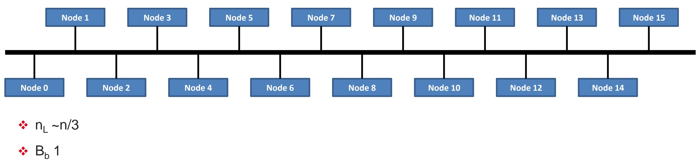</td>
    <td style="width: 25%; padding: 0.2rem; vertical-align: top;">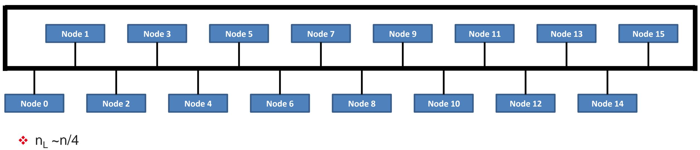</td>
    <td style="width: 25%; padding: 0.2rem; vertical-align: top;"></td>
    <td style="width: 25%; padding: 0.2rem; vertical-align: top;"></td>
  </tr>
</table>

## Grid and torus 网格与环面

<table style="width: 100%; border-collapse: collapse;">
  <tr>
    <td style="width: 50%; padding-right: 0.75rem; vertical-align: top;">
      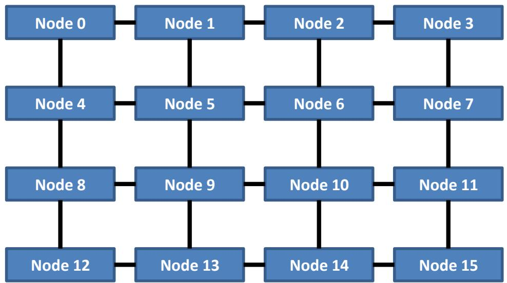
      
Grid 网格

    </td>
    <td style="width: 50%; padding-left: 0.75rem; vertical-align: top;">
      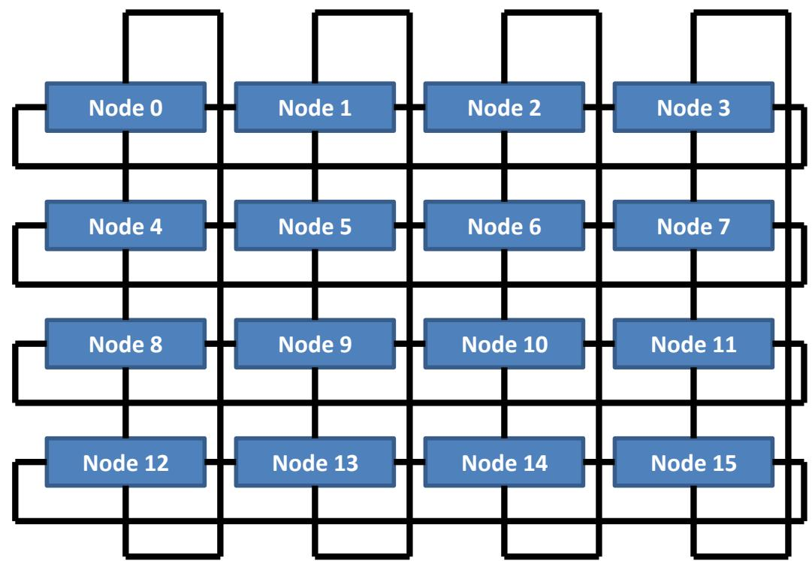
      
Torus 环面

    </td>
  </tr>
</table>

<table style="width: 100%; border-collapse: collapse;">
  <tr>
    <td style="width: 100%; vertical-align: top;">
      <ul>
        <li>Grid is simple and cheap but has border irregularity 网格结构简单、成本低，但边界存在不规则性</li>
        <li>Torus keeps the local-neighbor idea while reducing border effects 环面继承了局部邻居结构，同时减轻了边界问题</li>
        <li>Torus is often harder to build physically, because wrap-around links are long 环面的物理实现通常更难，因为回绕连接会更长</li>
      </ul>
    </td>
  </tr>
</table>

## Hypercube, tree, and fat-tree 超立方体、树与胖树

<table style="width: 100%; border-collapse: collapse;">
  <tr>
    <td style="width: 33.3%; padding: 0.2rem; vertical-align: top;">
      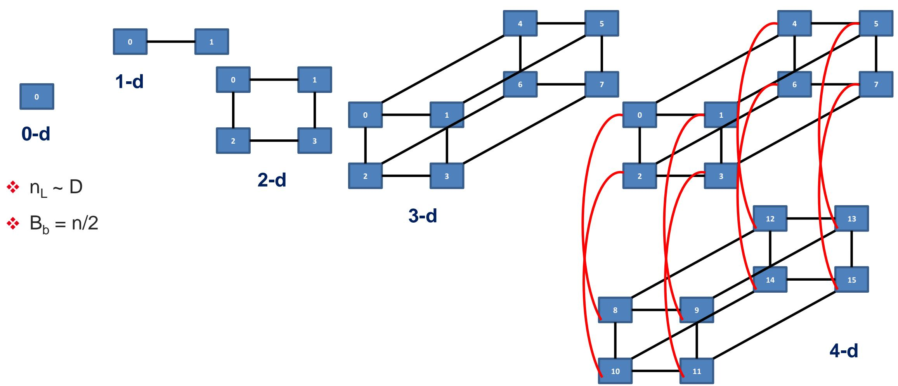
      
Hypercube 超立方体

    </td>
    <td style="width: 33.3%; padding: 0.2rem; vertical-align: top;">
      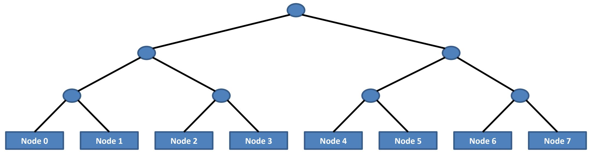
      
Tree 树

    </td>
    <td style="width: 33.3%; padding: 0.2rem; vertical-align: top;">
      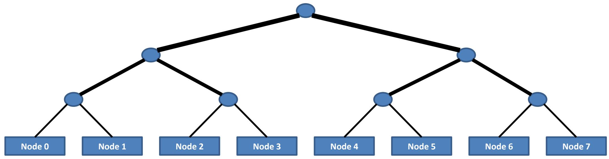
      
Fat-tree 胖树

    </td>
  </tr>
</table>

<table style="width: 100%; border-collapse: collapse;">
  <tr>
    <td style="width: 100%; vertical-align: top;">
      <ul>
        <li>Hypercube offers low diameter but becomes harder to map physically 超立方体直径较小，但物理实现和布线会更难</li>
        <li>Tree is easy to design but may overload upper levels under heavy traffic 树形结构容易设计，但上层链路在重流量下容易拥塞</li>
        <li>Fat-tree adds bandwidth near the top to reduce congestion 胖树会在靠近根部的地方增加带宽，以减轻拥塞</li>
      </ul>
    </td>
  </tr>
</table>

## Latency and bandwidth evaluation 延迟与带宽评估

<table style="width: 100%; border-collapse: collapse;">
  <tr>
    <td style="width: 50%; padding-right: 0.75rem; vertical-align: top;">
      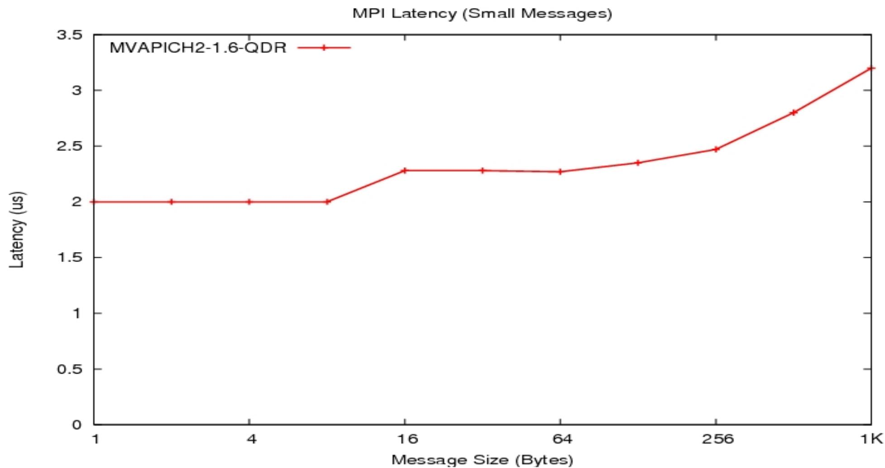
    </td>
    <td style="width: 50%; padding-left: 0.75rem; vertical-align: top;">
      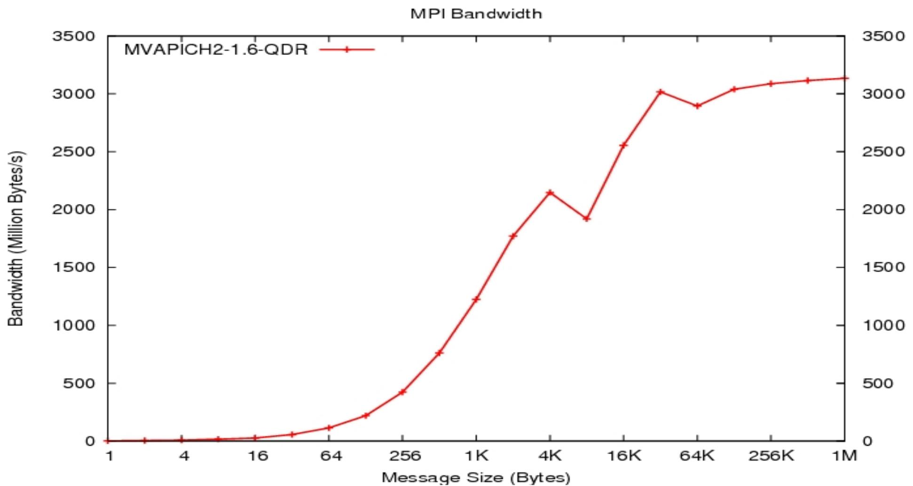
    </td>
  </tr>
</table>

<table style="width: 100%; border-collapse: collapse;">
  <tr>
    <td style="width: 100%; vertical-align: top;">
      <ul>
        <li>Real networks must be evaluated by both latency and bandwidth 真实网络既要看延迟，也要看带宽</li>
        <li>Different topologies excel under different communication patterns 不同拓扑会在不同通信模式下各有优势</li>
      </ul>
    </td>
  </tr>
</table>

## Butterfly and dragonfly 蝴蝶网络与蜻蜓网络

<table style="width: 100%; border-collapse: collapse;">
  <tr>
    <td style="width: 50%; padding-right: 0.75rem; vertical-align: top;">
      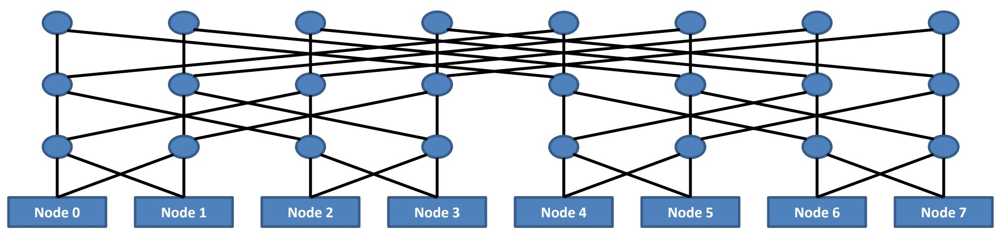
      
Butterfly 蝴蝶网络

    </td>
    <td style="width: 50%; padding-left: 0.75rem; vertical-align: top;">
      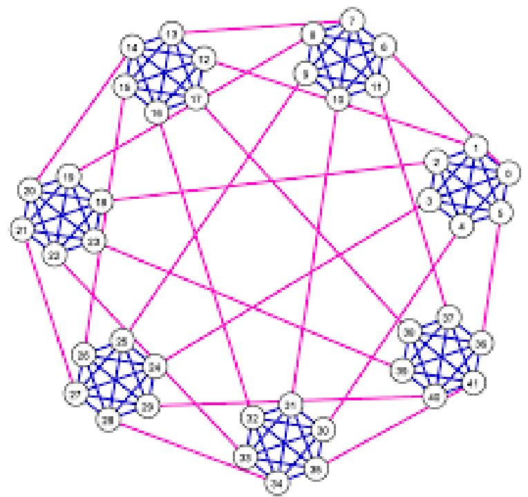
      
Dragonfly 蜻蜓网络

    </td>
  </tr>
</table>

<table style="width: 100%; border-collapse: collapse;">
  <tr>
    <td style="width: 100%; vertical-align: top;">
      <ul>
        <li>Butterfly and dragonfly are examples of more advanced interconnect organizations 蝴蝶网络和蜻蜓网络是更高级互连组织方式的代表</li>
        <li>Dragonfly-like designs are common in modern large systems 类似蜻蜓的设计在现代大规模系统中很常见</li>
      </ul>
    </td>
  </tr>
</table>

## General remarks on topology 拓扑的一般结论

<table style="width: 100%; border-collapse: collapse;">
  <tr>
    <td style="width: 100%; vertical-align: top;">
      <ul>
        <li>Topology can change which communication algorithm is best 拓扑会改变最优通信算法的选择</li>
        <li>Most MPI libraries do not fully model hardware topology when selecting algorithms 大多数 MPI 库在选算法时并不会完全建模硬件拓扑</li>
        <li>Resource allocation and rank mapping also strongly affect observed performance 资源分配和 rank 映射也会显著影响最终性能</li>
      </ul>
    </td>
  </tr>
</table>

## Resource managers and placement 资源管理器与放置

<table style="width: 100%; border-collapse: collapse;">
  <tr>
    <td style="width: 38%; vertical-align: top; padding-right: 1.25rem;">
      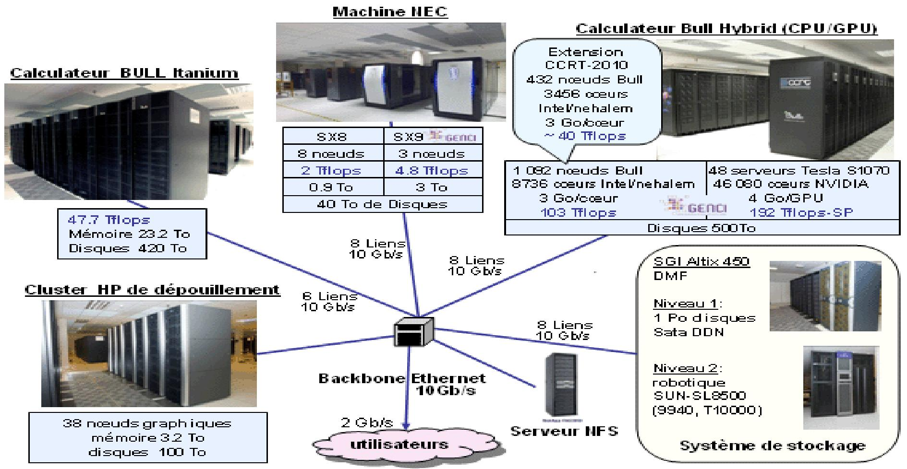
    </td>
    <td style="width: 62%; vertical-align: top;">
      <ul>
        <li>Schedulers such as Slurm allocate resources and launch jobs 像 Slurm 这样的调度器负责分配资源并启动作业</li>
        <li>They try to balance fairness, utilization, and waiting time 它们需要在公平性、利用率和等待时间之间做平衡</li>
        <li>Allocated nodes are not guaranteed to be ideally placed in the network 调度到的节点并不保证在网络拓扑上是理想相邻的</li>
        <li>The user must still understand the actual placement and adapt to it 用户仍然需要理解实际拿到的资源放置情况，并据此调整程序</li>
      </ul>
    </td>
  </tr>
</table>

## Final takeaways 最后结论

<table style="width: 100%; border-collapse: collapse;">
  <tr>
    <td style="width: 100%; vertical-align: top;">
      <ul>
        <li>Know your MPI implementation 了解你所使用的 MPI 实现</li>
        <li>Know your communication pattern 了解你的通信模式</li>
        <li>Be careful with decomposition, collective choice, and topology 注意分解方式、集合通信算法选择以及底层拓扑</li>
        <li>Scalable MPI performance is a joint problem of algorithm, runtime, and machine topology 可扩展的 MPI 性能是算法、运行时与机器拓扑共同决定的问题</li>
      </ul>
    </td>
  </tr>
</table>
