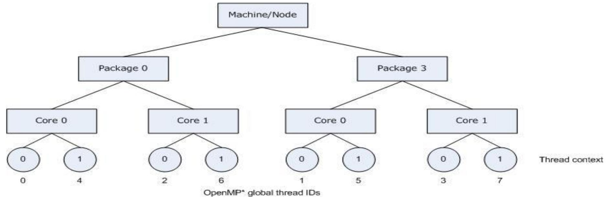

# 10 Placement 放置与绑定

## Why placement matters 为什么放置很重要

<table style="width: 100%; border-collapse: collapse;">
  <tr>
    <td style="width: 100%; vertical-align: top;">
      <ul>
        <li>Where threads and processes run can strongly affect memory locality and communication cost 线程和进程被放到哪里运行，会显著影响内存局部性和通信成本</li>
        <li>Placement therefore matters for both OpenMP and MPI placement 因此放置策略对 OpenMP 和 MPI 都非常重要</li>
      </ul>
    </td>
  </tr>
</table>

## OpenMP thread placement OpenMP 线程放置

<table style="width: 100%; border-collapse: collapse;">
  <tr>
    <td style="width: 100%; vertical-align: top;">
      <ul>
        <li>OpenMP provides standard mechanisms to bind threads to hardware locations OpenMP 提供了标准方法把线程绑定到具体硬件位置</li>
        <li>The two main ideas are `OMP_PLACES` and `OMP_PROC_BIND` 两个核心概念是 `OMP_PLACES` 和 `OMP_PROC_BIND`</li>
        <li>Some implementations also provide their own APIs, such as Intel `KMP_AFFINITY` 某些实现还提供自己的接口，例如 Intel 的 `KMP_AFFINITY`</li>
      </ul>
    </td>
  </tr>
</table>

## Step 1: define places 第一步：定义 places

<table style="width: 100%; border-collapse: collapse;">
  <tr>
    <td style="width: 100%; vertical-align: top;">
      <ul>
        <li>`OMP_PLACES` defines the hardware places available for thread binding `OMP_PLACES` 用来定义线程可绑定到哪些硬件位置</li>
        <li>OpenMP supports abstract names or explicit lists OpenMP 既支持抽象名字，也支持显式列表</li>
        <li>Common predefined names are `threads`, `cores`, and `sockets` 常见预定义名称包括 `threads`、`cores` 和 `sockets`</li>
        <li>The explicit syntax can describe intervals and strides 显式语法还可以描述区间和步长</li>
      </ul>
      <pre><code class="language-bash">export OMP_PLACES="{0,1,2,3},{4,5,6,7},{8,9,10,11},{12,13,14,15}"
export OMP_PLACES="{0:4},{4:4},{8:4},{12:4}"
export OMP_PLACES="{0:4}:4:4"</code></pre>
    </td>
  </tr>
</table>

## Step 2: choose a binding policy 第二步：选择绑定策略

<table style="width: 100%; border-collapse: collapse;">
  <tr>
    <td style="width: 100%; vertical-align: top;">
      <ul>
        <li>`OMP_PROC_BIND` controls how threads are mapped onto the available places `OMP_PROC_BIND` 决定线程如何映射到这些 places 上</li>
        <li>Typical policies include `close`, `spread`, `master`, `true`, and `false` 常见策略包括 `close`、`spread`、`master`、`true` 和 `false`</li>
        <li>`master` keeps threads near the master thread `master` 会让线程靠近主线程</li>
        <li>`close` places threads near their parent `close` 会让线程尽量靠近父线程</li>
        <li>`spread` distributes threads across the available places `spread` 会把线程尽量分散到可用 places 上</li>
      </ul>
    </td>
  </tr>
</table>

## Vendor API examples 厂商 API 示例

<table style="width: 100%; border-collapse: collapse;">
  <tr>
    <td style="width: 50%; padding-right: 0.75rem; vertical-align: top;">
      
      
`KMP_AFFINITY=compact` 紧凑放置

    </td>
    <td style="width: 50%; padding-left: 0.75rem; vertical-align: top;">
      
      
`KMP_AFFINITY=scatter` 分散放置

    </td>
  </tr>
</table>

## OpenMP placement example OpenMP 放置示例

<table style="width: 100%; border-collapse: collapse;">
  <tr>
    <td style="width: 100%; vertical-align: top;">
      <ul>
        <li>The example reuses the bandwidth test code 这个例子沿用了之前的带宽测试代码</li>
        <li>One thread initializes the arrays, then parallel threads compute the sum 一个线程先初始化数组，然后多个线程并行做求和</li>
        <li>With `OMP_PLACES=cores`, binding happens at core granularity 使用 `OMP_PLACES=cores` 时，绑定粒度是核心级别</li>
        <li>Two typical policies are compared: `close` and `spread` 这里比较两种典型策略：`close` 与 `spread`</li>
      </ul>
      <pre><code class="language-c">#pragma omp parallel proc_bind(spread)
{
    int thid = omp_get_thread_num();
    if (thid == THREAD_ALLOC) {
        for (int i = 0; i < GSIZE; ++i) {
            a[i] = i + 1;
            b[i] = GSIZE - i - 1;
            r[i] = 0;
        }
    }
}</code></pre>
      <pre><code class="language-bash">OMP_NUM_THREADS=2 OMP_PLACES=cores ./bandwidth_test_local_close.pgr
OMP_NUM_THREADS=2 OMP_PLACES=cores ./bandwidth_test_local_spread.pgr</code></pre>
      <pre><code class="language-txt">close  -> about 7.63 s
spread -> about 8.08 s</code></pre>
      
`close` keeps the allocating thread near the computing thread, while `spread` may place it on another socket；`close` 会让分配线程靠近计算线程，而 `spread` 可能把它放到另一插槽上。

    </td>
  </tr>
</table>

## MPI placement MPI 放置

<table style="width: 100%; border-collapse: collapse;">
  <tr>
    <td style="width: 100%; vertical-align: top;">
      <ul>
        <li>MPI placement is also critical for communication locality MPI 进程放置同样会显著影响通信局部性</li>
        <li>On Slurm systems, `srun` is a common entry point for rank placement 在 Slurm 系统上，`srun` 是常见的 rank 放置入口</li>
      </ul>
    </td>
  </tr>
</table>
