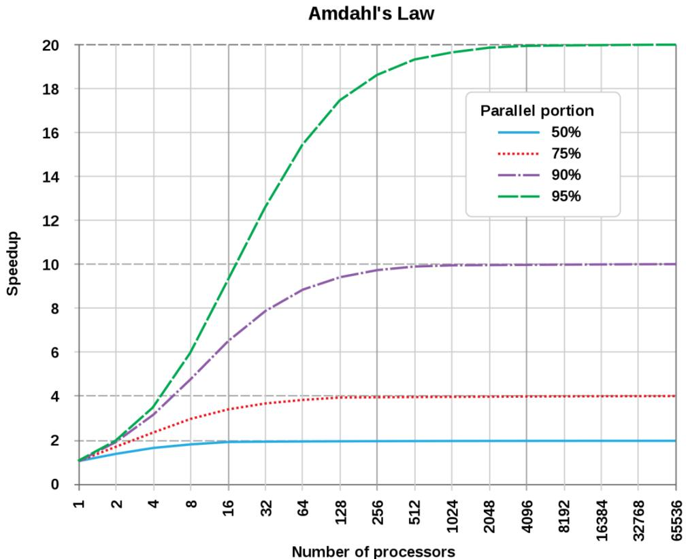
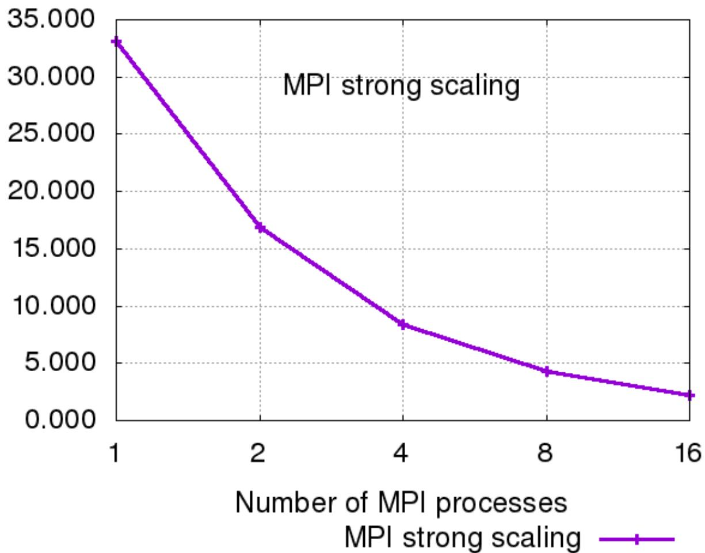
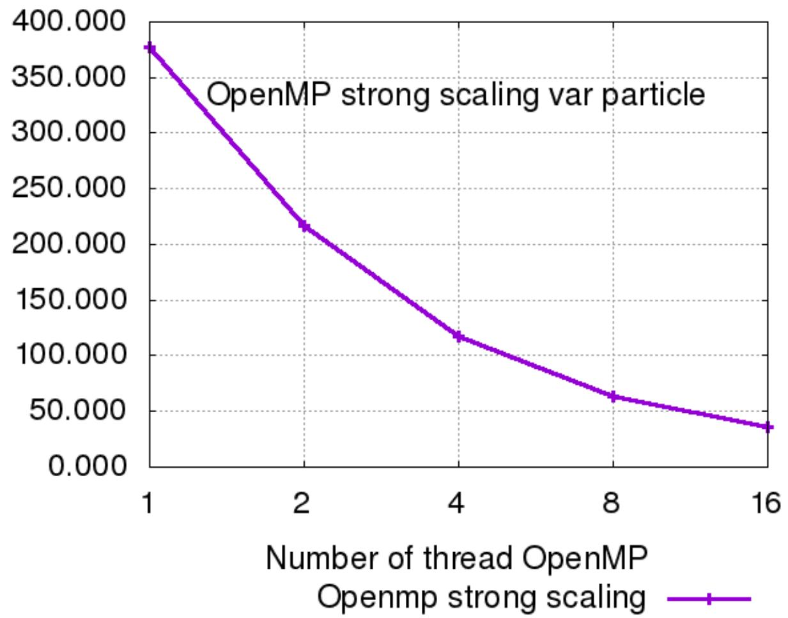
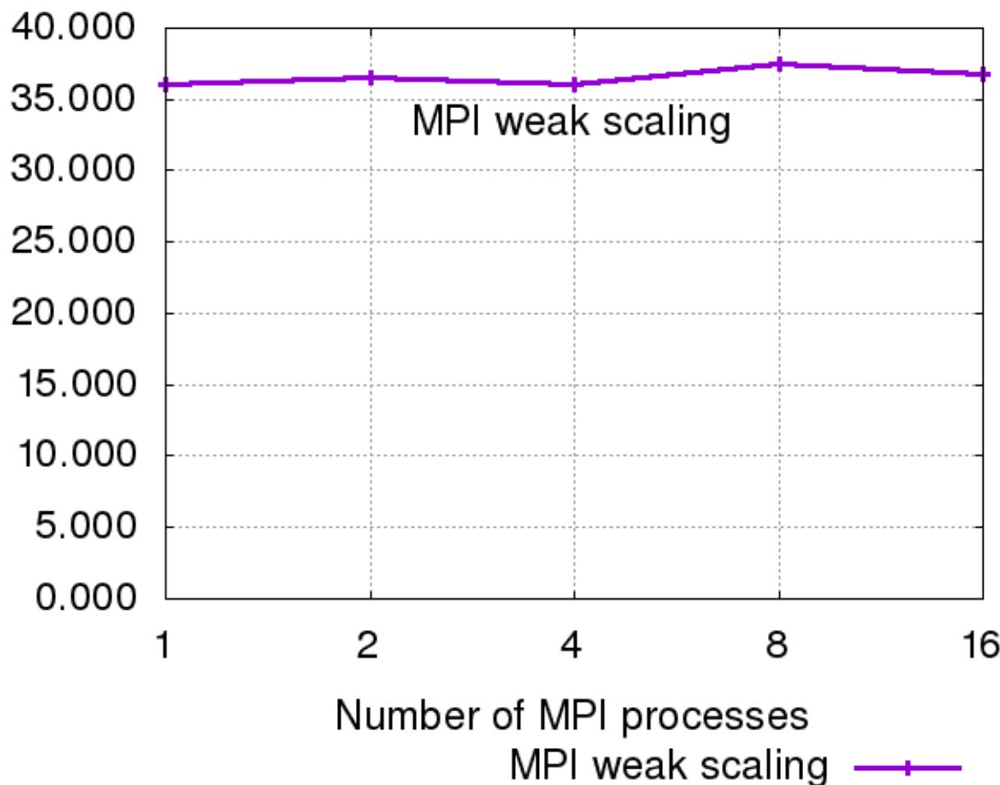
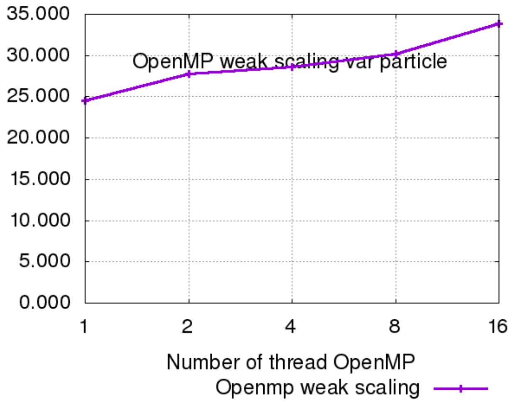
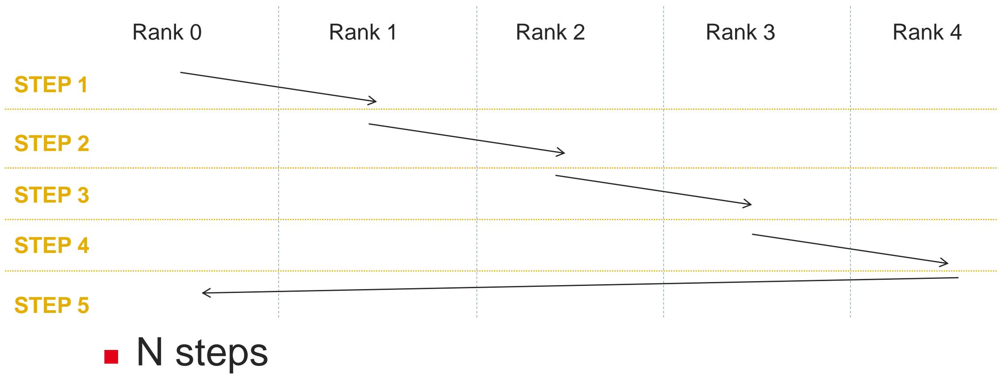
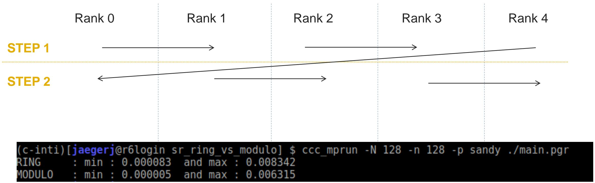

# 11 Scalability 可扩展性

## Parallel optimization reminder 并行优化回顾

<table style="width: 100%; border-collapse: collapse;">
  <tr>
    <td style="width: 100%; vertical-align: top;">
      <ul>
        <li>Writing and optimizing a parallel program is not trivial 编写和优化并行程序并不简单</li>
        <li>Use parallel-friendly algorithms instead of forcing sequential ones to scale 应优先选择适合并行的算法，而不是强行放大顺序算法</li>
        <li>Reduce sequential sections and unnecessary synchronizations 要尽量减少串行部分和不必要的同步</li>
      </ul>
    </td>
  </tr>
</table>

## Amdahl's law Amdahl 定律

<table style="width: 100%; border-collapse: collapse;">
  <tr>
    <td style="width: 100%; vertical-align: top;">
      <ul>
        <li>Amdahl's law gives a theoretical upper bound on speedup Amdahl 定律给出了加速比的理论上限</li>
        <li>If a fraction `1 - p` of the program is sequential, that part limits the global speedup 如果程序中有 `1 - p` 的部分不能并行，那么这部分会限制总体加速比</li>
      </ul>
      <pre><code class="language-txt">N : number of processors
p : proportion of parallel code</code></pre>
      
<code>Speedup = 1 / ((1 - p) + p / N)</code>

    </td>
  </tr>
  <tr>
    <td style="width: 100%; padding-top: 0.35rem;">
      
    </td>
  </tr>
</table>

## Parallel scalability 并行可扩展性

<table style="width: 100%; border-collapse: collapse;">
  <tr>
    <td style="width: 100%; vertical-align: top;">
      <ul>
        <li>The scalability of an algorithm is closely linked to its parallel efficiency 算法的可扩展性与并行效率密切相关</li>
        <li>Two standard viewpoints are strong scaling and weak scaling 两种标准观察方式是 strong scaling 和 weak scaling</li>
      </ul>
    </td>
  </tr>
</table>

## Strong scaling 强扩展

<table style="width: 100%; border-collapse: collapse;">
  <tr>
    <td style="width: 100%; vertical-align: top;">
      <ul>
        <li>Strong scaling keeps the global amount of work fixed 强扩展保持总工作量不变</li>
        <li>When we increase the number of compute units, each unit receives less work 当计算单元数增加时，每个单元分到的工作量会减少</li>
        <li>With perfect strong scaling, doubling the resources gives almost twice the performance 理想情况下，资源翻倍会带来近似两倍性能</li>
      </ul>
    </td>
  </tr>
</table>

<table style="width: 100%; border-collapse: collapse;">
  <tr>
    <td style="width: 50%; padding-right: 0.75rem; vertical-align: top;">
      
      
Nearly perfect strong scaling 接近理想的强扩展

    </td>
    <td style="width: 50%; padding-left: 0.75rem; vertical-align: top;">
      
      
Less perfect strong scaling 不那么理想的强扩展

    </td>
  </tr>
</table>

## Weak scaling 弱扩展

<table style="width: 100%; border-collapse: collapse;">
  <tr>
    <td style="width: 100%; vertical-align: top;">
      <ul>
        <li>Weak scaling keeps the amount of work per compute unit fixed 弱扩展保持每个计算单元承担的工作量不变</li>
        <li>When we increase the number of compute units, the total work also increases 当计算单元数增加时，总工作量也同步增加</li>
        <li>With perfect weak scaling, execution time remains approximately constant 理想情况下，弱扩展时执行时间应保持近似不变</li>
      </ul>
    </td>
  </tr>
</table>

<table style="width: 100%; border-collapse: collapse;">
  <tr>
    <td style="width: 50%; padding-right: 0.75rem; vertical-align: top;">
      
      
Nearly perfect weak scaling 接近理想的弱扩展

    </td>
    <td style="width: 50%; padding-left: 0.75rem; vertical-align: top;">
      
      
Less perfect weak scaling 不那么理想的弱扩展

    </td>
  </tr>
</table>

## A small MPI scalability example 一个小型 MPI 可扩展性例子

<table style="width: 100%; border-collapse: collapse;">
  <tr>
    <td style="width: 100%; vertical-align: top;">
      
Consider an MPI program where each rank sends a value to the next rank 考虑一个 MPI 程序，每个 rank 都把一个值发送给下一个 rank。

      <pre><code class="language-c">if (rank == 0) {
    MPI_Send(&a, 1, MPI_INT, (rank + 1) % P, ...);
    MPI_Recv(&b, 1, MPI_INT, rank - 1, ...);
} else {
    MPI_Recv(&b, 1, MPI_INT, rank - 1, ...);
    MPI_Send(&a, 1, MPI_INT, (rank + 1) % P, ...);
}</code></pre>
    </td>
  </tr>
</table>

<table style="width: 100%; border-collapse: collapse;">
  <tr>
    <td style="width: 50%; padding-right: 0.75rem; vertical-align: top;">
      
      
Sequential dependency 串行依赖模式

    </td>
    <td style="width: 50%; padding-left: 0.75rem; vertical-align: top;">
      
      
Improved concurrency 改善后的并发模式

    </td>
  </tr>
</table>

<table style="width: 100%; border-collapse: collapse;">
  <tr>
    <td style="width: 100%; vertical-align: top;">
      <ul>
        <li>The first version creates more serialization across ranks 第一个版本会在 rank 之间制造更多串行化</li>
        <li>A small code change such as alternating even and odd ranks can reduce the number of steps 一个小改动，例如让偶数 rank 和奇数 rank 交替通信，就可能减少总步数</li>
        <li>In the slide example, the improved version completes in 2 steps 在课件示例中，改进版本可以在 2 步内完成</li>
      </ul>
      <pre><code class="language-c">if (rank % 2 == 0) {
    MPI_Send(&a, 1, MPI_INT, (rank + 1) % P, ...);
    MPI_Recv(&b, 1, MPI_INT, rank - 1, ...);
} else {
    MPI_Recv(&b, 1, MPI_INT, rank - 1, ...);
    MPI_Send(&a, 1, MPI_INT, (rank + 1) % P, ...);
}</code></pre>
    </td>
  </tr>
</table>

## Know what you do and what you will do 清楚自己在做什么以及将要做什么

<table style="width: 100%; border-collapse: collapse;">
  <tr>
    <td style="width: 100%; vertical-align: top;">
      <ul>
        <li>A small code difference can have a huge performance impact 代码中的一点细微差异都可能带来巨大的性能影响</li>
        <li>You must understand the communication algorithm or pattern you are implementing 必须理解自己实现的通信算法或通信模式</li>
        <li>Good scalability is a trade-off between number of communications and their concurrency 良好的可扩展性是通信次数与通信并发度之间的权衡</li>
        <li>Scalability also depends on what is sent and to which rank 可扩展性还取决于发送什么，以及发送给哪个 rank</li>
      </ul>
    </td>
  </tr>
</table>
