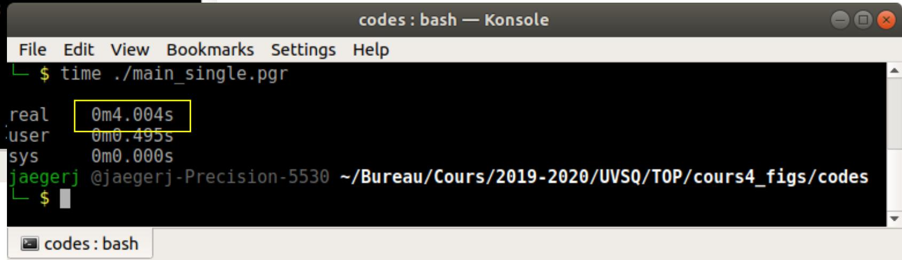
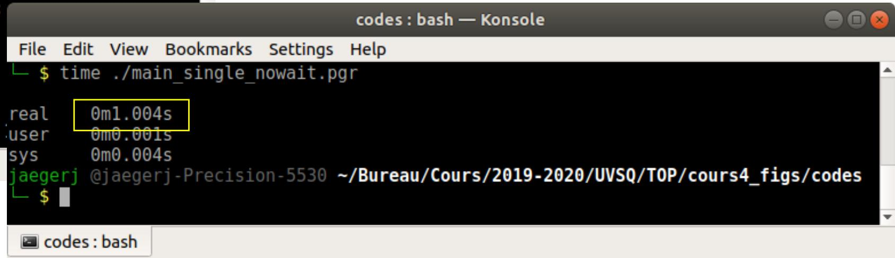
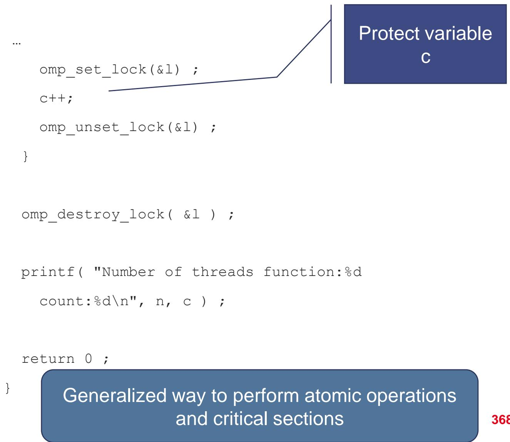

# 12 Threads Synchronisation 线程同步

## Multithread optimization overview 多线程优化概览

<table style="width: 100%; border-collapse: collapse;">
  <tr>
    <td style="width: 100%; vertical-align: top;">
      <ul>
        <li>Synchronization is one of the key issues in multithread optimization 同步是多线程优化中的关键问题之一</li>
        <li>Important topics include barriers, `nowait`, locks, atomicity, lock-free algorithms, and scheduling 重要主题包括 barriers、`nowait`、locks、atomicity、lock-free 算法以及调度策略</li>
      </ul>
    </td>
  </tr>
</table>

## OpenMP synchronizations OpenMP 同步机制

<table style="width: 100%; border-collapse: collapse;">
  <tr>
    <td style="width: 100%; vertical-align: top;">
      <ul>
        <li>OpenMP provides several directives to synchronize threads OpenMP 提供了多种线程同步指令</li>
        <li>Barriers may be explicit, such as `#pragma omp barrier` barriers 可以是显式的，例如 `#pragma omp barrier`</li>
        <li>They may also be implicit at the end of many OpenMP constructs 也可能隐式出现在很多 OpenMP 结构的末尾</li>
      </ul>
    </td>
  </tr>
</table>

## Implicit barriers 隐式 barrier

<table style="width: 100%; border-collapse: collapse;">
  <tr>
    <td style="width: 100%; vertical-align: top;">
      <ul>
        <li>Most OpenMP directives end with an implicit barrier 很多 OpenMP 指令在结束时都会带一个隐式 barrier</li>
        <li>When a thread finishes its own work, it cannot continue until the others also arrive 一个线程完成自己的工作后，不能立刻继续，必须等其他线程也到达</li>
        <li>This may reduce concurrency when there are no true dependencies 如果线程间实际上没有依赖，这种等待会降低并发性</li>
      </ul>
      
Examples include `omp for`, `omp sections`, `omp workshare`, `omp simd`, and many `target` constructs 常见例子包括 `omp for`、`omp sections`、`omp workshare`、`omp simd` 以及很多 `target` 相关结构。

    </td>
  </tr>
</table>

## The `single` directive `single` 指令

<table style="width: 100%; border-collapse: collapse;">
  <tr>
    <td style="width: 100%; vertical-align: top;">
      <ul>
        <li>`#pragma omp single` lets exactly one thread execute the enclosed region `#pragma omp single` 让恰好一个线程执行包围区域</li>
        <li>Unlike `master`, that thread does not have to be the master thread 与 `master` 不同，执行它的线程不一定是主线程</li>
        <li>However, by default the other threads still wait at the implicit barrier 但默认情况下，其他线程仍然要在隐式 barrier 处等待</li>
      </ul>
    </td>
  </tr>
</table>

## `nowait` as a solution `nowait` 作为解决方案

<table style="width: 100%; border-collapse: collapse;">
  <tr>
    <td style="width: 100%; vertical-align: top;">
      <ul>
        <li>The `nowait` clause removes the implicit barrier at the end of some directives `nowait` 子句可以去掉某些指令结尾的隐式 barrier</li>
        <li>Threads that arrive earlier can continue their execution immediately 提前到达的线程可以立刻继续执行</li>
        <li>This is useful only when there are no dependencies between the threads' remaining work 这种做法只有在后续工作没有线程依赖时才是安全的</li>
      </ul>
    </td>
  </tr>
</table>

## Example: `single` versus `single nowait` 例子：`single` 与 `single nowait`

<table style="width: 100%; border-collapse: collapse;">
  <tr>
    <td style="width: 100%; vertical-align: top;">
      <pre><code class="language-c">#include &lt;omp.h&gt;
#include &lt;unistd.h&gt;

int main() {
    int nb_th = -1;

    #pragma omp parallel
    {
        nb_th = omp_get_num_threads();
        for (int i = 0; i < nb_th; ++i) {
            #pragma omp single
            sleep(1);
        }
    }

    return 0;
}</code></pre>
      <ul>
        <li>With 4 threads and 4 `single` regions, the total time is about 4 seconds 用 4 个线程执行 4 次 `single` 时，总时间大约是 4 秒</li>
      </ul>
    </td>
  </tr>
  <tr>
    <td style="width: 100%; padding-top: 0.35rem;">
      
    </td>
  </tr>
</table>

<table style="width: 100%; border-collapse: collapse;">
  <tr>
    <td style="width: 100%; vertical-align: top;">
      <pre><code class="language-c">#include &lt;omp.h&gt;
#include &lt;unistd.h&gt;

int main() {
    int nb_th = -1;

    #pragma omp parallel
    {
        nb_th = omp_get_num_threads();
        for (int i = 0; i < nb_th; ++i) {
            #pragma omp single nowait
            sleep(1);
        }
    }

    return 0;
}</code></pre>
      <ul>
        <li>Adding `nowait` reduces waiting and the same program takes about 1 second 加上 `nowait` 后等待减少，相同程序大约只需 1 秒</li>
      </ul>
    </td>
  </tr>
  <tr>
    <td style="width: 100%; padding-top: 0.35rem;">
      
    </td>
  </tr>
</table>

<table style="width: 100%; border-collapse: collapse;">
  <tr>
    <td style="width: 100%; padding-top: 0.35rem;">
      
    </td>
  </tr>
</table>

## Locks 锁

<table style="width: 100%; border-collapse: collapse;">
  <tr>
    <td style="width: 100%; vertical-align: top;">
      <ul>
        <li>Locks are objects for mutual exclusion 锁是实现互斥访问的对象</li>
        <li>They protect shared data and create critical sections 它们可以保护共享数据，并形成临界区</li>
        <li>A lock can be acquired, tested, released, initialized, and destroyed 锁可以被加锁、测试、解锁、初始化和销毁</li>
      </ul>
    </td>
  </tr>
</table>

## OpenMP lock API OpenMP 锁 API

<table style="width: 100%; border-collapse: collapse;">
  <tr>
    <td style="width: 100%; vertical-align: top;">
      <pre><code class="language-c">omp_lock_t lock;
omp_init_lock(&lock);
omp_set_lock(&lock);
omp_unset_lock(&lock);
omp_destroy_lock(&lock);</code></pre>
      <ul>
        <li>`omp_test_lock()` can be used to try acquiring a lock without blocking `omp_test_lock()` 可以在不阻塞的情况下尝试获取锁</li>
        <li>OpenMP also provides nested locks through `omp_nest_lock_t` OpenMP 还通过 `omp_nest_lock_t` 提供嵌套锁</li>
      </ul>
    </td>
  </tr>
</table>

## Lock example 锁示例

<table style="width: 100%; border-collapse: collapse;">
  <tr>
    <td style="width: 100%; vertical-align: top;">
      
A lock can be used to protect a critical update region 可以用锁来保护一个关键更新区域。

    </td>
  </tr>
  <tr>
    <td style="width: 100%; padding-top: 0.35rem;">
      
    </td>
  </tr>
</table>

## Waiting policies 等待策略

<table style="width: 100%; border-collapse: collapse;">
  <tr>
    <td style="width: 100%; vertical-align: top;">
      <ul>
        <li>Threads may wait at barriers, locks, and other synchronization points 线程可能在 barrier、锁和其他同步点上等待</li>
        <li>Two main waiting policies are active waiting and passive waiting 两种主要等待策略是 active waiting 和 passive waiting</li>
      </ul>
    </td>
  </tr>
</table>

## Active waiting 主动等待

<table style="width: 100%; border-collapse: collapse;">
  <tr>
    <td style="width: 100%; vertical-align: top;">
      <ul>
        <li>Active waiting polls repeatedly until the expected state is reached 主动等待会不断轮询，直到达到期待状态</li>
        <li>It is reactive, but it consumes compute resources and keeps the core busy 它响应快，但会消耗计算资源并一直占用核心</li>
      </ul>
    </td>
  </tr>
</table>

## Passive waiting 被动等待

<table style="width: 100%; border-collapse: collapse;">
  <tr>
    <td style="width: 100%; vertical-align: top;">
      <ul>
        <li>Passive waiting gives control back to the scheduler 被动等待会把控制权交还给调度器</li>
        <li>It frees compute resources for other work, but may be less reactive 它能释放计算资源给其他任务使用，但响应性较差</li>
      </ul>
    </td>
  </tr>
</table>

## Lock versus barrier 锁与 barrier 的比较

<table style="width: 100%; border-collapse: collapse;">
  <tr>
    <td style="width: 100%; vertical-align: top;">
      <ul>
        <li>A barrier synchronizes all threads barrier 会同步所有线程</li>
        <li>A lock usually synchronizes only the threads involved in the protected region 锁通常只会同步参与临界区的线程</li>
        <li>Locks may therefore have less global impact than barriers, but they are harder to use correctly 因此锁对全局并发的影响可能小于 barrier，但正确使用也更复杂</li>
      </ul>
    </td>
  </tr>
  <tr>
    <td style="width: 100%; padding-top: 0.35rem;">
      
    </td>
  </tr>
</table>

## Atomicity 原子性

<table style="width: 100%; border-collapse: collapse;">
  <tr>
    <td style="width: 100%; vertical-align: top;">
      <ul>
        <li>If multiple threads update the same memory location at the same time, the result is not guaranteed 如果多个线程同时更新同一个内存位置，结果通常无法保证正确</li>
        <li>Atomic operations provide synchronization for simple operations 原子操作为简单操作提供同步机制</li>
        <li>They are often cheaper than broader synchronization methods such as locks or barriers 它们通常比锁或 barrier 这类更宽泛的同步方式便宜</li>
        <li>True hardware atomicity corresponds to operations that can be performed atomically at hardware level 真正的硬件原子性对应能够在硬件层面原子完成的操作</li>
      </ul>
    </td>
  </tr>
</table>
