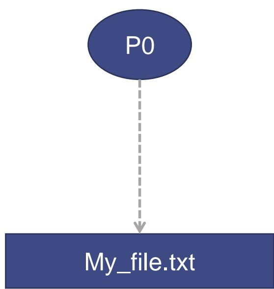
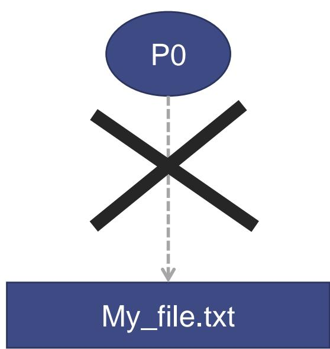
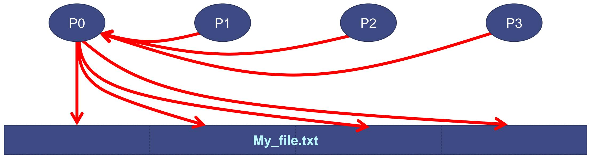
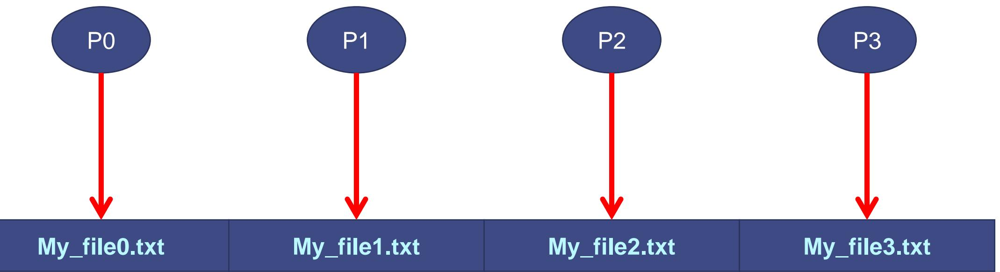
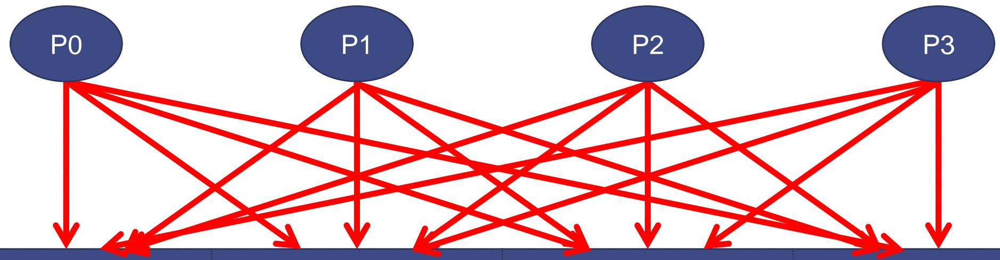

# 13 Parallel I/O 并行 I/O

## What is I/O 什么是 I/O

<table style="width: 100%; border-collapse: collapse;">
  <tr>
    <td style="width: 100%; vertical-align: top;">
      <ul>
        <li>`I/O` stands for Input/Output `I/O` 是 Input/Output 的缩写</li>
        <li>It includes reading, writing, and file management operations 它包括读取、写入以及文件管理相关操作</li>
        <li>Typical tasks include resizing, splitting, merging, organizing, and searching files 典型任务包括调整大小、拆分、合并、组织和搜索文件</li>
      </ul>
    </td>
  </tr>
</table>

## Why do we need I/O 为什么需要 I/O

<table style="width: 100%; border-collapse: collapse;">
  <tr>
    <td style="width: 100%; vertical-align: top;">
      <ul>
        <li>Simulations often produce large amounts of data 模拟程序通常会产生大量数据</li>
        <li>These data are not necessarily meant to be read directly by humans 这些数据通常并不是直接给人看的</li>
        <li>They must be stored for visualization, post-processing, history, and checkpoint/restart 它们需要被存储，用于可视化、后处理、历史保留和 checkpoint/restart</li>
      </ul>
    </td>
  </tr>
</table>

## Sequential I/O 顺序 I/O

<table style="width: 100%; border-collapse: collapse;">
  <tr>
    <td style="width: 100%; vertical-align: top;">
      <ul>
        <li>The original paradigm is sequential I/O, for example POSIX I/O 最原始的范式是顺序 I/O，例如 POSIX I/O</li>
        <li>One process opens a file handle, reads or writes data, then closes it 一个进程打开文件句柄、执行读写，然后关闭句柄</li>
        <li>This model is simple when only one process is involved 当只有一个进程时，这种模式很简单</li>
      </ul>
    </td>
  </tr>
  <tr>
    <td style="width: 100%; padding-top: 0.35rem;">
      <table style="width: 100%; border-collapse: collapse;">
        <tr>
          <td style="width: 33.3%; padding: 0.2rem;"></td>
          <td style="width: 33.3%; padding: 0.2rem;"></td>
          <td style="width: 33.3%; padding: 0.2rem;"></td>
        </tr>
      </table>
    </td>
  </tr>
</table>

## Why parallel I/O is harder 为什么并行 I/O 更难

<table style="width: 100%; border-collapse: collapse;">
  <tr>
    <td style="width: 100%; vertical-align: top;">
      <ul>
        <li>Parallel applications have many processes that all want to read and write 并行程序里有很多进程都希望同时读写数据</li>
        <li>The question is no longer only how to access a file, but also who accesses what and when 问题不再只是“如何访问文件”，还包括“谁在什么时候访问什么”</li>
        <li>Typical patterns include one-to-one, all-to-all, one-to-all, and all-to-one 常见模式包括 one-to-one、all-to-all、one-to-all 和 all-to-one</li>
      </ul>
    </td>
  </tr>
</table>

## Parallel one-to-one I/O 并行 one-to-one I/O

<table style="width: 100%; border-collapse: collapse;">
  <tr>
    <td style="width: 38%; vertical-align: top; padding-right: 1.25rem;">
      
    </td>
    <td style="width: 62%; vertical-align: top;">
      <ul>
        <li>One chosen process performs I/O on behalf of the others 一个被选中的进程代表其他进程执行 I/O</li>
        <li>This reuses a sequential I/O model and is compatible with libraries that do not support parallel I/O 这种方式沿用了顺序 I/O 模型，也适用于不支持并行 I/O 的库</li>
        <li>It produces only one output file and is easy to manage 它只产生一个输出文件，管理起来比较方便</li>
        <li>But it creates a bottleneck and scales poorly 但它会形成瓶颈，可扩展性较差</li>
      </ul>
    </td>
  </tr>
</table>

## Parallel all-to-all I/O 并行 all-to-all I/O

<table style="width: 100%; border-collapse: collapse;">
  <tr>
    <td style="width: 38%; vertical-align: top; padding-right: 1.25rem;">
      
    </td>
    <td style="width: 62%; vertical-align: top;">
      <ul>
        <li>Each process manages its own file handle and performs its own I/O 每个进程都管理自己的文件句柄，并执行自己的 I/O</li>
        <li>This removes the process-side bottleneck 这种方式消除了进程侧瓶颈</li>
        <li>However, it may generate many small files 但它会产生大量小文件</li>
        <li>It can also make restart and post-processing harder when the process count changes 当进程数发生变化时，它也会让重启和后处理更困难</li>
      </ul>
    </td>
  </tr>
</table>

## Parallel one-to-all I/O 并行 one-to-all I/O

<table style="width: 100%; border-collapse: collapse;">
  <tr>
    <td style="width: 38%; vertical-align: top; padding-right: 1.25rem;">
      
    </td>
    <td style="width: 62%; vertical-align: top;">
      <ul>
        <li>One process manages the I/O, but the output is spread across multiple files 一个进程负责管理 I/O，但输出会分散到多个文件里</li>
        <li>This still creates a bottleneck on the manager process 这仍然会在管理进程上形成瓶颈</li>
        <li>In addition, that process must manage several file handles 同时，该进程还要管理多个文件句柄</li>
      </ul>
    </td>
  </tr>
</table>

## Parallel all-to-one I/O 并行 all-to-one I/O

<table style="width: 100%; border-collapse: collapse;">
  <tr>
    <td style="width: 38%; vertical-align: top; padding-right: 1.25rem;">
      
    </td>
    <td style="width: 62%; vertical-align: top;">
      <ul>
        <li>Each process performs its own I/O, but all cooperate on the same file 每个进程都执行自己的 I/O，但它们会协作访问同一个文件</li>
        <li>This removes the single-process bottleneck and still keeps only one result file 这种方式没有单一进程瓶颈，同时仍然只保留一个结果文件</li>
        <li>The main difficulty is ordering and coordination when multiple processes write near the same region 最大难点在于多个进程同时写同一文件时的顺序与协调</li>
        <li>If handled correctly, all processes can write anywhere in the file 如果处理得当，所有进程都可以协同写入文件的不同位置</li>
      </ul>
    </td>
  </tr>
</table>

## I/O impact on performance I/O 对性能的影响

<table style="width: 100%; border-collapse: collapse;">
  <tr>
    <td style="width: 100%; vertical-align: top;">
      <ul>
        <li>I/O may have a huge impact on application performance I/O 可能会对应用性能造成巨大影响</li>
        <li>I/O relies on system calls and workers performing I/O are blocked until completion I/O 依赖系统调用，执行 I/O 的工作线程往往会被阻塞直到完成</li>
        <li>As a result, I/O can directly slow down the parallel application 因而 I/O 会直接拖慢并行应用程序</li>
      </ul>
    </td>
  </tr>
</table>

## I/O delegation I/O 委托

<table style="width: 100%; border-collapse: collapse;">
  <tr>
    <td style="width: 38%; vertical-align: top; padding-right: 1.25rem;">
      
    </td>
    <td style="width: 62%; vertical-align: top;">
      <ul>
        <li>I/O delegation is a common way to reduce the impact of I/O I/O 委托是降低 I/O 影响的一种常见方法</li>
        <li>Compute workers do not perform their own I/O; they delegate it to specialized I/O workers 计算线程不直接执行 I/O，而是把 I/O 委托给专门的 I/O 工作线程</li>
        <li>The I/O workers may block, while compute workers can continue their computation I/O 工作线程可以被阻塞，而计算线程仍然继续运行</li>
        <li>This principle appears in HPC libraries such as netCDF and HDF5 这种思路也体现在 netCDF、HDF5 等 HPC 库中</li>
      </ul>
    </td>
  </tr>
</table>

## Final remarks 最后说明

<table style="width: 100%; border-collapse: collapse;">
  <tr>
    <td style="width: 100%; vertical-align: top;">
      <ul>
        <li>Parallel I/O design is a trade-off between simplicity, scalability, and file management complexity 并行 I/O 设计本质上是在简单性、可扩展性和文件管理复杂度之间做权衡</li>
        <li>The right strategy depends on how much data is produced, how often I/O happens, and how files will be reused 正确策略取决于数据规模、I/O 频率以及文件后续如何被使用</li>
      </ul>
    </td>
  </tr>
</table>
