# Objectives 目标

Scientific Visualisation 科学可视化  
Dr. John Redford  
[john.redford@mews-labs.com](mailto:john.redford@mews-labs.com)  
[Mews Labs](https://www.mews-labs.com/), Cachan, France  
March/April 2026

Master the principle techniques of representation, modelling,
and visualisation of large groups of 3D data (structured and
unstructured) 掌握大规模三维数据（结构化与非结构化）的表示、建模与可视化基本技术

- Data : examples, meshing 数据：示例与网格划分

- Surface data visualisation 表面数据可视化

- Volume data visualisation 体数据可视化

- Visualisation of fluid mechanics data 流体力学数据可视化

## Material 材料

Installation of almost latest ParaView version (e.g. v6.0) from the
[ParaView download page](https://www.paraview.org/download/) 从 [ParaView 下载页面](https://www.paraview.org/download/)安装较新的 ParaView 版本（例如 v6.0）

Exercises from the [ParaView tutorial
guide](https://docs.paraview.org/en/latest/Tutorials/index.html) 练习材料来自 [ParaView 教程指南](https://docs.paraview.org/en/latest/Tutorials/index.html)

Download all ParaView tutorial data `ParaViewData-v5.13.0.zip` from the
[ParaView download page](https://www.paraview.org/download/) or the file for
the first day’s exercise:
[disk_out_ref.ex2 sample file](http://tacc.github.io/pvOSPRay/demos/data/disk_out_ref.ex2) 从 [ParaView 下载页面](https://www.paraview.org/download/)下载完整教程数据 `ParaViewData-v5.13.0.zip`，或者下载第一天练习所需的 [disk_out_ref.ex2 示例文件](http://tacc.github.io/pvOSPRay/demos/data/disk_out_ref.ex2)

## Planning 计划

Course dates/content: 课程日期与内容：

1. Day 1 (CM/TD) 第一天（讲授/辅导）

    - Fundamentals 基础

    - Data filtering 数据筛选

2. Day 2 (CM/TD) 第二天（讲授/辅导）

    - Time dependent data 时变数据

    - File formats 文件格式

3. Day 3 (TD/TD) 第三天（辅导/辅导）

    - Exercises 练习

    - Fluid mechanics (OpenFOAM) visualisation 流体力学（OpenFOAM）可视化

4. Day 4 (CM/TD) 第四天（讲授/辅导）

    - Python scripting Python 脚本

5. Day 5 (CM/TD) 第五天（讲授/辅导）

    - Visualisation of large models 大规模模型可视化

    - Evaluation exercise 考核练习

CM (Cours Magistral/Lecture) – TD (Travaux Dirigés/Tutorial) CM 表示讲授课，TD 表示辅导/习题课

## Introduction : Scientific Visualisation 科学可视化导论

Wiki page ‘The purpose of scientific visualization is to graphically
illustrate scientific data to enable scientists to understand,
illustrate, and glean insight from their data.’ 维基页面写道：“科学可视化的目的，是用图形方式展示科学数据，使科学家能够理解、说明并从数据中获取洞见。”

## What is Scientific Visualisation? 什么是科学可视化？

- Transformation of data or information into pictures (visual outputs) 将数据或信息转换为图像（视觉输出）

  - Does not necessarily imply the use of computers 这并不一定意味着必须使用计算机

  - Classical visualisation used hand-drawn figures and illustrations
    (2D means for visualisation) 传统可视化使用手绘图形和插图（二维手段）

- Modern visualisation is primarily 3D (digital images for 3D
  visualisation) 现代可视化主要是三维的（用于三维可视化的数字图像）

- In both cases, the ultimate goal is to understand important insights
  for the data through visual means 无论哪种方式，最终目标都是通过视觉手段理解数据中的重要信息

- Do not care how we visualise the picture – what picture we get is most
  important 我们并不特别在意图像是如何生成的，更重要的是最终得到什么样的图像

- Technical means used to arrive at visual outputs are mainly dependent
  on computer graphics techniques 生成视觉输出所用的技术手段主要依赖计算机图形学方法

## Why is visualisation useful and important? 为什么可视化有用且重要？

Which is more useful or accessible: left or right, or both? 左边和右边哪一种更有用、更容易理解，还是两者都重要？

About 71% of the Earth’s surface is water-covered, and the oceans
hold about 96.5% of all Earth’s water. 地球表面大约 71% 被水覆盖，而海洋大约容纳了地球全部水量的 96.5%。

<!-- markdownlint-disable MD033 -->
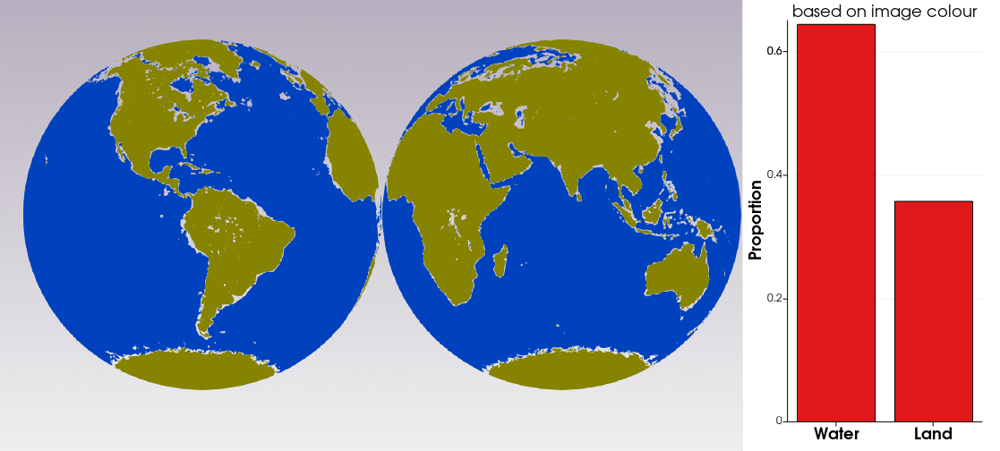
<!-- markdownlint-enable MD033 -->
Figure: [Earth](https://fr.wikibooks.org/wiki/Introduction_%C3%A0_ParaView/Quelques_exemples_simples) 图示：地球示意

## Visualisation terminology 可视化术语

- Different sub-fields of visualisation 可视化包含不同的子领域

- Scientific visualisation 科学可视化

  - discipline of computer science 它是计算机科学中的一个分支

  - visualisation of scientific and engineering data-sets 用于科学与工程数据集的可视化

- Scientific visualisation touches on a number of areas: 科学可视化涉及多个方面：

  - data representations 数据表示

  - data processing algorithms 数据处理算法

  - visual representations 视觉表示形式

  - user interfaces 用户界面

## Visualisation Terminology 可视化术语补充

- *Data visualisation* – includes data from other sources, such as
  financial, marketing, business 数据可视化还包括其他来源的数据，例如金融、市场营销和商业数据

- Sometimes involves statistical analysis and other analysis techniques
  not employed in scientific visualisation 有时它还会涉及科学可视化中不常使用的统计分析或其他分析技术

- Can you think of an example of financial information we might want to
  visualise? 你能想到哪些金融信息适合拿来可视化吗？

- So we might say that scientific visualisation is a type or subset of
  data visualisation 因此可以说，科学可视化是数据可视化的一种类型或子集

<!-- markdownlint-disable MD033 -->
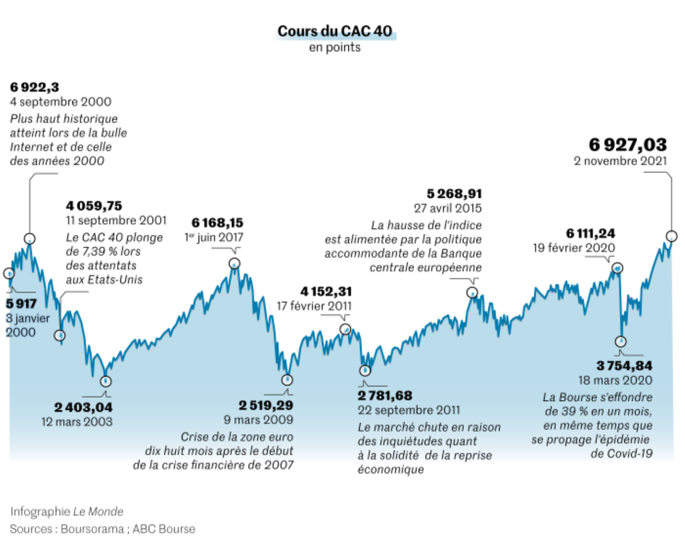
<!-- markdownlint-enable MD033 -->

## Motivation 动机

- Make sense of huge data-sets 理解海量数据集

  - Computational fluid dynamics produces very large data-sets 计算流体力学会产生非常庞大的数据集

- Uncover insights hidden in the data 挖掘隐藏在数据中的信息

- Extract important features and meaningful knowledge of the data to
  assist in the decision-making process 提取数据中的关键特征和有意义的知识，以辅助决策

<!-- markdownlint-disable MD033 -->

<!-- markdownlint-enable MD033 -->
Rayleigh-Taylor instability simulation with up to `3072^3` cells. 瑞利-泰勒不稳定性模拟，网格数量最高可达 `3072^3`。

## 2D example: Flow map 二维示例：流向图

- Show the movement of objects from one location to another 展示对象从一个地点移动到另一个地点

- Demonstrates route, size of army and return temperature 展示路线、军队规模以及返程温度

<!-- markdownlint-disable MD033 -->

<!-- markdownlint-enable MD033 -->

## 2D example: Dot style 二维示例：点状风格

Visualise disease (cholera) outbreak and find causes 用来可视化霍乱疫情并寻找成因

- Cases clustered around pump in Broad (now Broadwick) street 病例集中分布在 Broad 街（现 Broadwick 街）的水泵周围

- Water for the pump was polluted by sewage from nearby cesspit 该水泵的供水被附近粪坑渗出的污水污染了

<!-- markdownlint-disable MD033 -->
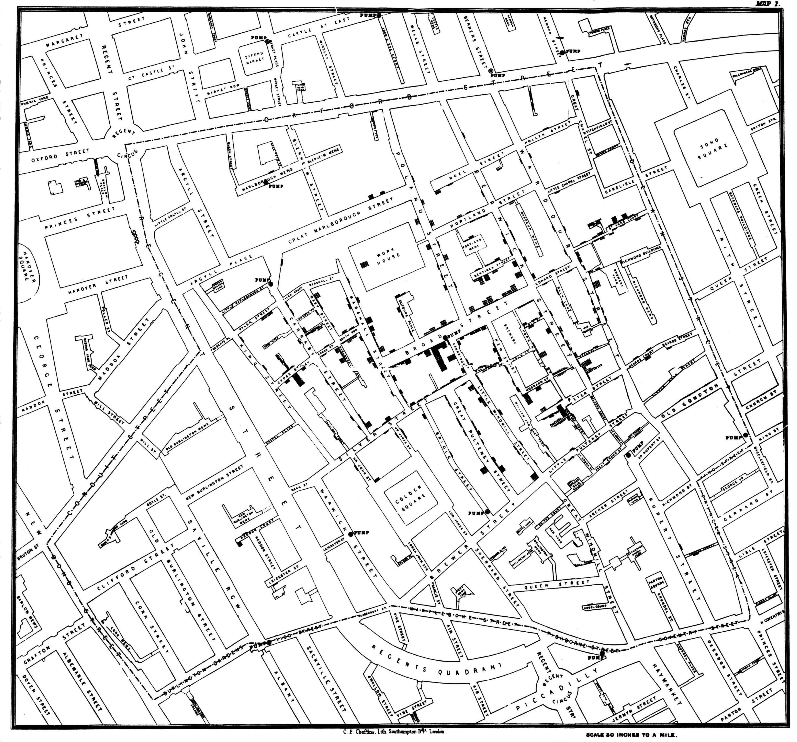
<!-- markdownlint-enable MD033 -->

## Introduction : ParaView ParaView 简介

- Open-source, scalable, multi-platform visualisation application 开源、可扩展、跨平台的可视化应用程序

- Data parallelism on shared-memory or distributed-memory
  multi-computers and clusters 支持共享内存或分布式内存多机与集群上的数据并行

- An open, flexible, and intuitive user interface 开放、灵活且直观的用户界面

- An extensible, modular architecture based on open standards 基于开放标准、可扩展且模块化的架构

- Large user community, both public and private sector 拥有庞大的用户群体，覆盖公共和私营部门

- A flexible BSD 3 Clause license 采用灵活的 BSD 3-Clause 许可证

Downloaded roughly 100,000 times a year. Won many awards. 每年下载量大约 10 万次，并获得过许多奖项。

## Introduction : ParaView examples ParaView 示例

<!-- markdownlint-disable MD033 -->
<table>
  <tr>
    <td valign="top" width="50%">
      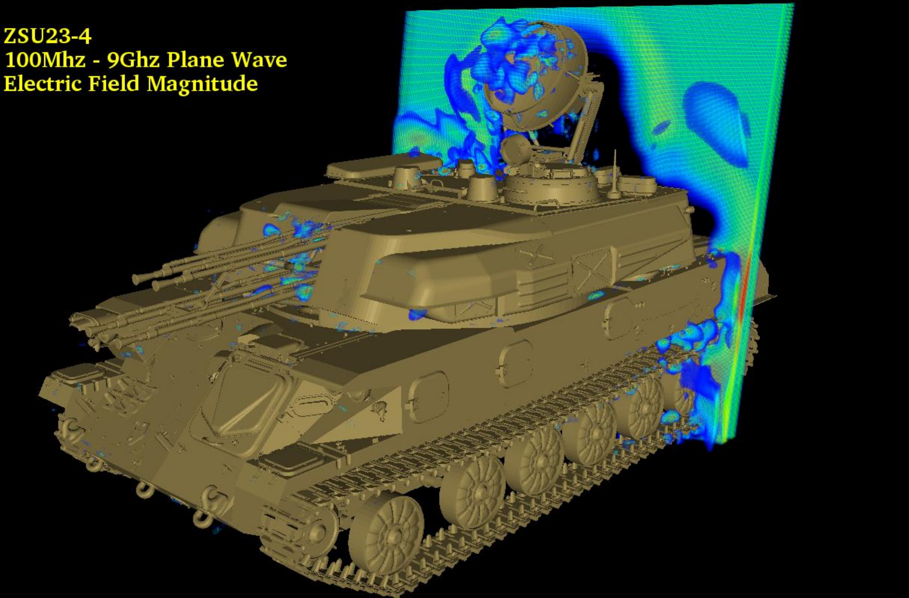
      <p>ZSU23-4 Russian Anti-Aircraft vehicle being hit by a planar wave. Image courtesy of Jerry Clarke, US Army Research Laboratory.</p>
    </td>
    <td valign="top" width="50%">
      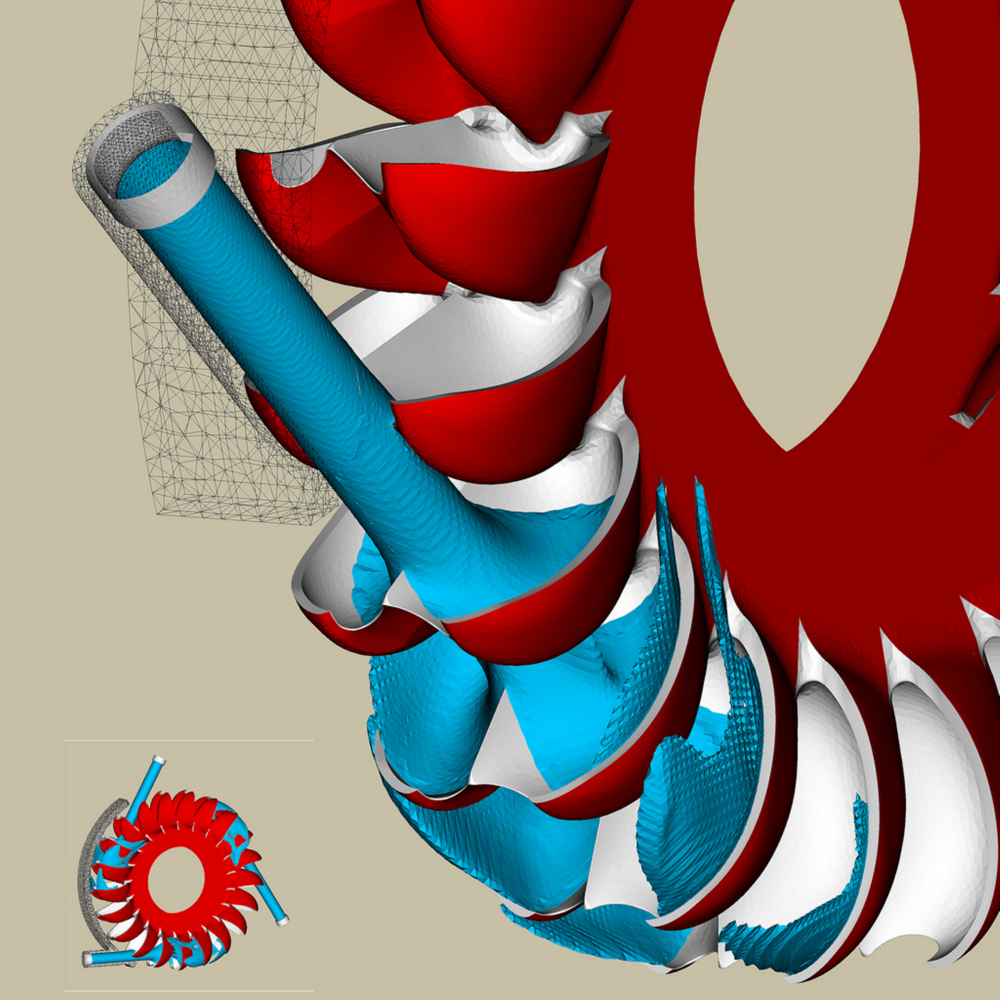
      <p>Simulation of a Pelton turbine. Image courtesy of the Swiss National Supercomputing Centre.</p>
    </td>
  </tr>
  <tr>
    <td valign="top" width="50%">
      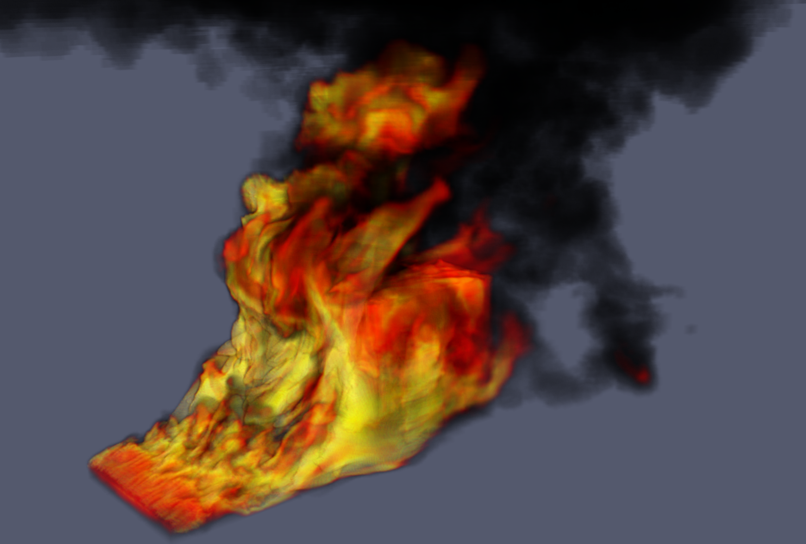
      <p>A loosely coupled SIERRA-Fuego-Syrinx-Calore simulation with 10 million unstructured hexahedra cells of objects-in-crosswind fire.</p>
    </td>
    <td valign="top" width="50%">
      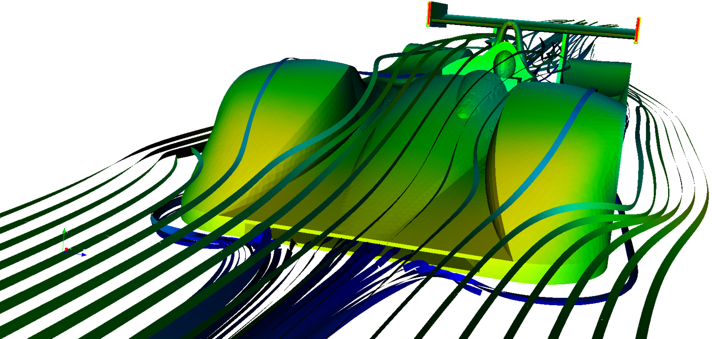
      <p>Airflow around a Le Mans race car. Image courtesy of Renato N. Elias, NACAD/COPPE/UFRJ, Rio de Janeiro, Brazil.</p>
    </td>
  </tr>
</table>
<!-- markdownlint-enable MD033 -->

## Introduction : ParaView application Architecture ParaView 应用架构

<!-- markdownlint-disable MD033 -->
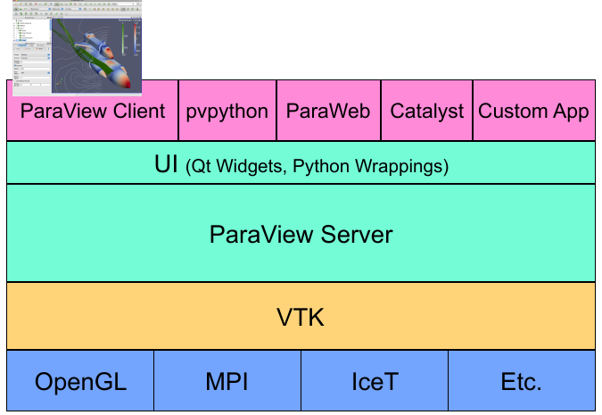
<!-- markdownlint-enable MD033 -->

- ParaView is just a small client application built on top of a tall
  stack of libraries ParaView 只是一个构建在庞大库栈之上的小型客户端应用

- pvpython allows automation of post-processing `pvpython` 允许自动化执行后处理任务

## Introduction : VTK library VTK 库简介

Visualization Toolkit (VTK) is an open-source, freely available software
system for : Visualization Toolkit（VTK）是一个开源、免费可获取的软件系统，用于：

- 3D computer graphics, modelling, image processing, volume rendering,
  **scientific visualisation**, 2D plotting 三维计算机图形、建模、图像处理、体渲染、**科学可视化**以及二维绘图

Filters : 过滤器：

- VTK applications manipulate data with filters VTK 应用通过过滤器处理数据

- inspect received data and produces derived data 它们会检查输入数据并生成派生数据

Multiple applications, e.g. open source platforms include : 多种应用和开源平台都基于它，例如：

- The **Insight Segmentation and Registration Toolkit (ITK)**;
  algorithms for medical research **ITK**：用于医学研究的算法工具包

- **ParaView** works with data on the desktop, on the web, on
  supercomputers, in immersive environments and more **ParaView**：可在桌面、Web、超级计算机和沉浸式环境中处理数据

- [**PyVista**](https://docs.pyvista.org/index.html) 3D plotting and
  mesh analysis [**PyVista**](https://docs.pyvista.org/index.html)：三维绘图与网格分析

- **3D Slicer** is an extensible platform for visualisation and medical
  image analysis **3D Slicer**：一个可扩展的可视化与医学图像分析平台

## ParaView Interface ParaView 界面

<!-- markdownlint-disable MD033 -->
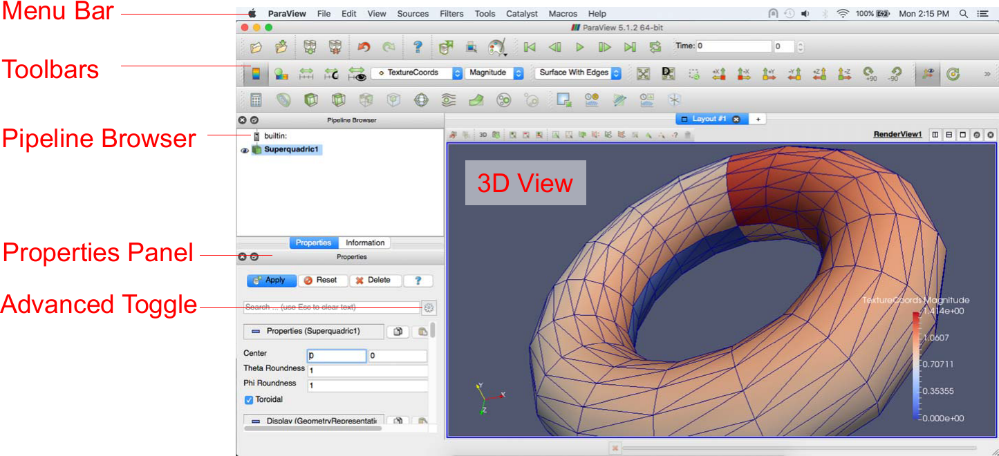
<!-- markdownlint-enable MD033 -->

Menu Bar 菜单栏  
Allows access to majority of features 可访问大多数功能

Toolbars 工具栏  
Provides quick access to most commonly used features 提供对常用功能的快速访问

Pipeline Browser 管线浏览器  
ParaView manages the reading and filtering of data with a pipeline.
Browser allows the pipeline structure and select pipeline objects to be
viewed ParaView 使用管线来管理数据读取与过滤；浏览器可查看管线结构并选择其中的对象

Properties Panel 属性面板  
Allows viewing and changing of parameters for current pipeline object 可查看并修改当前管线对象的参数

3D View 三维视图  
Used to present data so that you may view, interact with, and explore
data 用于展示数据，以便你查看、交互并探索数据

## Exercise 1: ParaView line plot 练习 1：ParaView 折线图

- Create `.csv` file (right) 创建右侧所示的 `.csv` 文件

- `File` -> `Open`, `OK` and `Apply` 选择 `File` -> `Open`，然后点击 `OK` 和 `Apply`

- `[ctrl] + [space]`, and search for `Plot Data`, & `Apply` 按 `[ctrl] + [space]`，搜索 `Plot Data`，然后点击 `Apply`

- Change $`x`$-axis parameter 修改 $`x`$ 轴参数

`"x", "y"`  
`0 , 0`  
`1 , 1`  
`2 , 4`  
`3 , 9`  
`4 , 16`  
`5 , 25`  
`6 , 36`  
`7 , 49`

## Sources 数据源

Two ways to get data into ParaView: 将数据导入 ParaView 有两种方式：

- Read data from a file 从文件读取数据

- Generate data with a **source** object 使用 **source** 对象生成数据

Exercise: open ParaView, then `Sources` -> `Cylinder`, `Apply`. 练习：打开 ParaView，选择 `Sources` -> `Cylinder`，然后点击 `Apply`。

<!-- markdownlint-disable MD033 -->

<!-- markdownlint-enable MD033 -->

After, increase the cylinder resolution. Manipulate the cylinder in the
viewing window. Continue by demonstrating basic features of ParaView
interface (colours, axes, opacity, auto apply, colour palette). 然后提高圆柱体分辨率，在视图窗口中操作这个圆柱体，并继续演示 ParaView 界面的基本功能（颜色、坐标轴、不透明度、自动应用、调色板）。

## Earth visualisation 地球可视化

Familiarisation exercise using the
[Earth visualisation example](https://fr.wikibooks.org/wiki/Introduction_%C3%A0_ParaView/Quelques_exemples_simples).
Prenons le
[Earth texture image](https://commons.wikimedia.org/wiki/File:Land_ocean_ice_2048.jpg),
puis : 这是一个熟悉操作的练习，使用 [地球可视化示例](https://fr.wikibooks.org/wiki/Introduction_%C3%A0_ParaView/Quelques_exemples_simples) 和 [地球纹理图像](https://commons.wikimedia.org/wiki/File:Land_ocean_ice_2048.jpg)，步骤如下：

1. Ouvrir ParaView 打开 ParaView

2. Cliquer sur le bouton `Open`, et ouvrir le fichier
    `Land_ocean_ice_2048.jpg`; `Apply`. 点击 `Open` 按钮，打开文件 `Land_ocean_ice_2048.jpg`，然后点击 `Apply`

3. Faire bouger l’image avec la souris 用鼠标移动图像

4. Cliquer sur le bouton `Split vertical` (en haut à droite de la
    fenêtre de visualisation). Dans la fenêtre `Create View` qui
    apparaît, cliquer sur le bouton `Render View` 点击 `Split vertical` 按钮（位于可视化窗口右上角）；在弹出的 `Create View` 窗口中点击 `Render View`

5. Sélectionner le menu `Sources` -> `Sphere`. Cliquer sur
    Apply. Changer les valeurs Theta resolution et Phi resolution sur
    16 et `Apply` 选择 `Sources` -> `Sphere`，点击 `Apply`；将 Theta resolution 和 Phi resolution 改为 16，再次点击 `Apply`

6. Sélectionner le menu
    `Filters` -> `Alphabetical` -> `Texture Map to Sphere`.
    `Apply` 选择 `Filters` -> `Alphabetical` -> `Texture Map to Sphere`，然后点击 `Apply`

7. Dans la boîte `Properties`, cliquer sur `Toggle advanced properties`
    . Dans la zone Lighting (tout en bas), cliquer sur le menu `Texture`
    et choisir l’option Load$`\dots`$ 在 `Properties` 面板中点击 `Toggle advanced properties`；在最下方的 Lighting 区域点击 `Texture` 菜单，并选择 `Load...`

8. Dans la fenêtre `Open texture` qui apparaît, aller chercher le
    fichier `Land_ocean_ice_2048.jpg` et cliquer sur OK 在弹出的 `Open texture` 窗口中找到文件 `Land_ocean_ice_2048.jpg` 并点击 `OK`

9. Dans la boîte `Properties`, décocher l’option `Prevent` seam,
    `Apply` 在 `Properties` 面板中取消勾选 `Prevent seam` 选项，然后点击 `Apply`

*But, this example is not quite perfect...* *不过，这个例子还不算完美……*

## Regular mesh types 规则网格类型

<!-- markdownlint-disable MD033 -->
<table>
  <tr>
    <td valign="top" width="33%">
      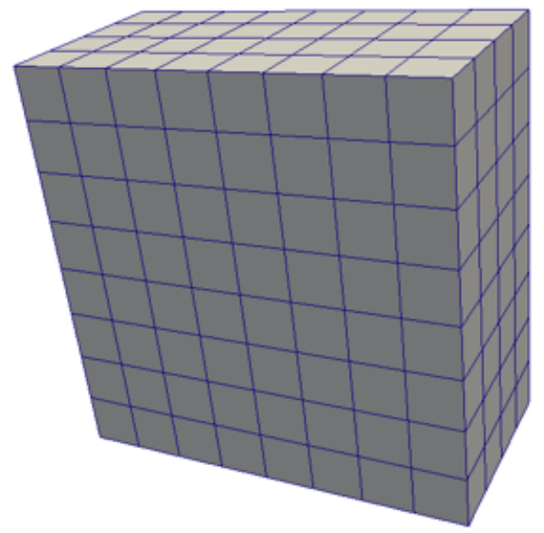
      <p><strong>Uniform Rectilinear 均匀直角坐标网格</strong></p>
      <p>A uniform rectilinear grid is a one-, two-, or three-dimensional array of data. The points are orthonormal to each other and are spaced regularly along each direction. 均匀直角坐标网格是一维、二维或三维的数据阵列。各点彼此正交，并且在各个方向上的间距是规则的。</p>
    </td>
    <td valign="top" width="33%">
      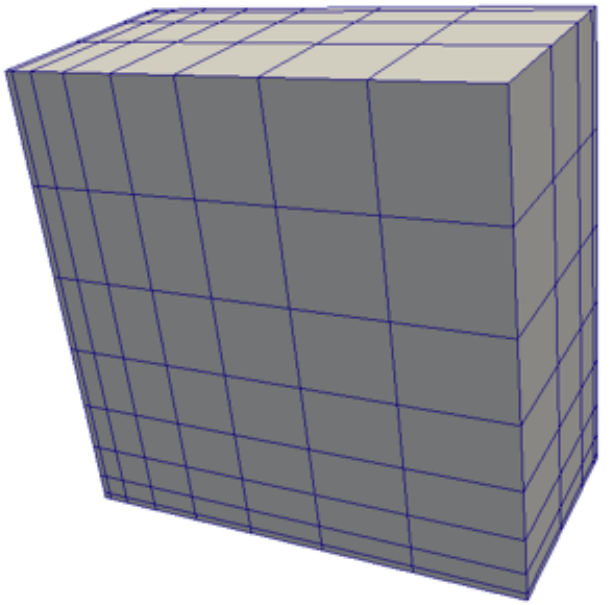
      <p><strong>Non-uniform Rectilinear 非均匀直角坐标网格</strong></p>
      <p>Similar to the uniform rectilinear grid except that the spacing between points may vary along each axis. 它与均匀直角坐标网格类似，不同之处在于点之间的间距可以沿每个坐标轴发生变化。</p>
    </td>
    <td valign="top" width="33%">
      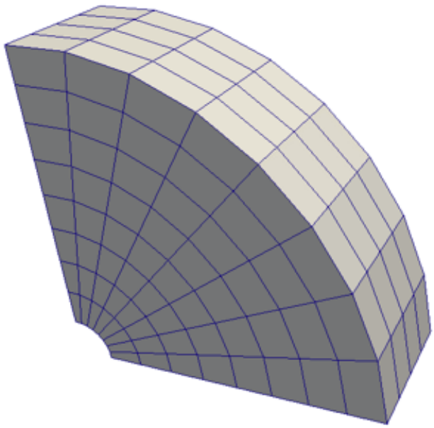
      <p><strong>Curvilinear 曲线网格</strong></p>
      <p>Curvilinear grids have the same topology as rectilinear grids. However, each point in a curvilinear grid can be placed at an arbitrary coordinate, provided that it does not result in cells that overlap or self-intersect. 曲线网格与直角坐标网格具有相同的拓扑结构，但其中每个点都可以放置在任意坐标位置，只要不会导致单元重叠或自相交。</p>
    </td>
  </tr>
</table>
<!-- markdownlint-enable MD033 -->

## Poly data and unstructured mesh 多边形数据与非结构网格

<!-- markdownlint-disable MD033 -->
<table>
  <tr>
    <td valign="top" width="33%">
      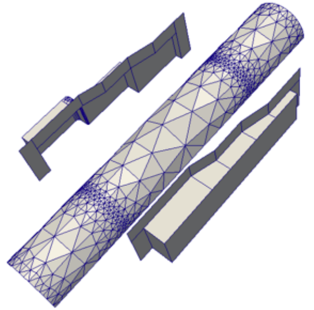
      <p><strong>Polygonal 多边形数据</strong></p>
      <p>Polygonal data sets are composed of points, lines, and 2D polygons. Connections between cells can be arbitrary or non-existent. 多边形数据集由点、线和二维多边形组成，单元之间的连接关系可以是任意的，也可以不存在。</p>
    </td>
    <td valign="top" width="33%">
      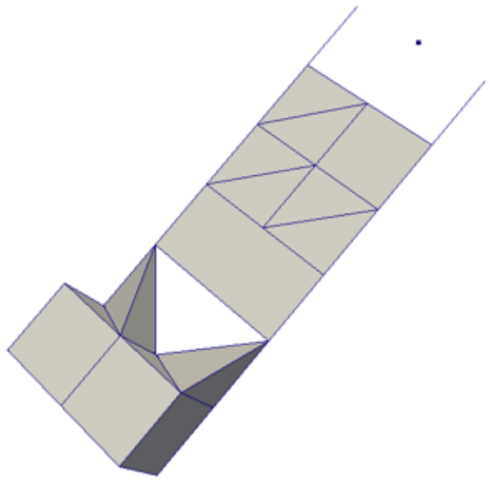
      <p><strong>Unstructured 非结构数据</strong></p>
      <p>Unstructured data sets are composed of points, lines, 2D polygons, 3D tetrahedra, and nonlinear cells. 非结构数据集由点、线、二维多边形、三维四面体以及非线性单元组成。</p>
    </td>
    <td valign="top" width="33%">
      <p><strong>Also 还包括</strong></p>
      <ul>
        <li>multi-block data</li>
        <li>adaptive mesh refinement</li>
        <li>...</li>
      </ul>
      <p>Multiblock familiarisation exercise: 多块数据熟悉练习：</p>
      <ul>
        <li><code>Testing/Data/bake/bake.e</code></li>
        <li><code>Testing/Data/can.ex2</code></li>
      </ul>
      <p><a href="https://www.paraview.org/Wiki/Advanced_Multiblock">Advanced Multiblock tutorial</a> 高级多块教程</p>
    </td>
  </tr>
</table>
<!-- markdownlint-enable MD033 -->

## Data filtering 数据筛选

Data filtering is the process of choosing a smaller part
of your data set and using that subset for viewing or analysis.
Filtering is generally (but not always) temporary – the complete data
set is kept, but only part of it is used for the calculation 数据筛选是指从数据集中选取较小的一部分，并使用这个子集进行查看或分析。筛选通常（但不一定）是临时的：完整数据集仍然保留，只是计算时只使用其中的一部分。

For scientific visualisation, filtering may be used to 对于科学可视化，筛选可以用于：

- Look at results for a particular period of time 查看某一特定时间段的结果

- Calculate results for particular zone of interest 计算特定感兴趣区域的结果

- Present results in an easily understandable manner 以更容易理解的方式呈现结果

- Extract important and practically useful measurements 提取重要且具有实际意义的测量量

ParaView has 183 filters listed in the
[ParaView filter list](https://www.paraview.org/Wiki/ParaView/Users_Guide/List_of_filters) ParaView 中列出了 183 个过滤器，见 [过滤器列表](https://www.paraview.org/Wiki/ParaView/Users_Guide/List_of_filters)

## ParaView data import ParaView 数据导入

There are two ways to get data into ParaView: 将数据导入 ParaView 有两种方式：

- read data from a file, or 从文件读取数据，或者

- generate data with a source object. 使用 source 对象生成数据。

ParaView currently supports about 220 distinct file formats ParaView 目前支持大约 220 种不同的文件格式

## Exercises: Day 1 第一天练习

For Exercise 2.7 in [Section 2.5](https://docs.paraview.org/en/latest/Tutorials/SelfDirectedTutorial/basicUsage.html#loading-data) of the ParaView tutorial, load `disk_out_ref.ex2` from `ParaView-v5.8.0-RC1/Testing/Data/` 在 ParaView 教程第 [2.5 节](https://docs.paraview.org/en/latest/Tutorials/SelfDirectedTutorial/basicUsage.html#loading-data) 的练习 2.7 中，从 `ParaView-v5.8.0-RC1/Testing/Data/` 加载 `disk_out_ref.ex2`

- Stop before Section 2.11 在 2.11 节之前停止

- Explore all the different options as you go along 在操作过程中探索各种不同选项

- If you finish, create document with image output 如果完成了，就生成带图像输出的文档

## Data files 数据文件

## Day 2: Understanding data 第二天：理解数据

Chapter 3 of ParaViewGuide-5.8.0.pdf 参考 `ParaViewGuide-5.8.0.pdf` 第 3 章

VTK data model is used by ParaView ParaView 使用 VTK 数据模型

Most fundamental data structure in VTK is a data object VTK 中最基本的数据结构是数据对象

These are either: 它们可以是：

- scientific datasets, such as rectilinear grids or finite elements
  meshes 科学数据集，例如直角坐标网格或有限元网格

- more abstract data structures, such as graphs or trees 更抽象的数据结构，例如图或树

## Mesh 网格

Mesh consists of 网格由以下部分组成：

- Vertices (points) 顶点（点）

- Cells (elements, zones) 单元（元素、区域）

Cells are used to discretize a region and can be tetrahedra, hexahedra,
etc 单元用于对区域进行离散化，可以是四面体、六面体等

Mapping from cells to vertices is called connectivity 从单元到顶点的映射称为连通关系

Faces & edges not represented explicitly by VTK (only needed for
arbitrary polyhedron) 面和边在 VTK 中通常不显式表示（只有在任意多面体情况下才需要）

<!-- markdownlint-disable MD033 -->
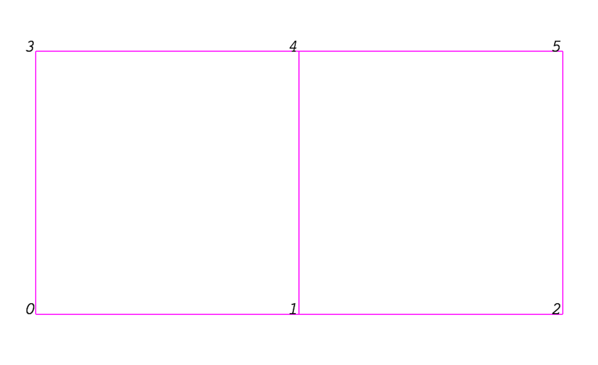
<!-- markdownlint-enable MD033 -->

- Cell 1; 0, 1, 3, 4 单元 1：0, 1, 3, 4

- Cell 2; 1, 2, 4, 5 单元 2：1, 2, 4, 5

Share points 1 & 4 共享点 1 和 4

## Attributes (fields, arrays) 属性（场、数组）

Data attributes stored at different mesh locations 数据属性存储在网格中的不同位置

- May depend on calculation, e.g. velocity at vertices and cell centred
  pressure 这取决于具体计算，例如速度存储在顶点上，而压力存储在单元中心

<!-- markdownlint-disable MD033 -->
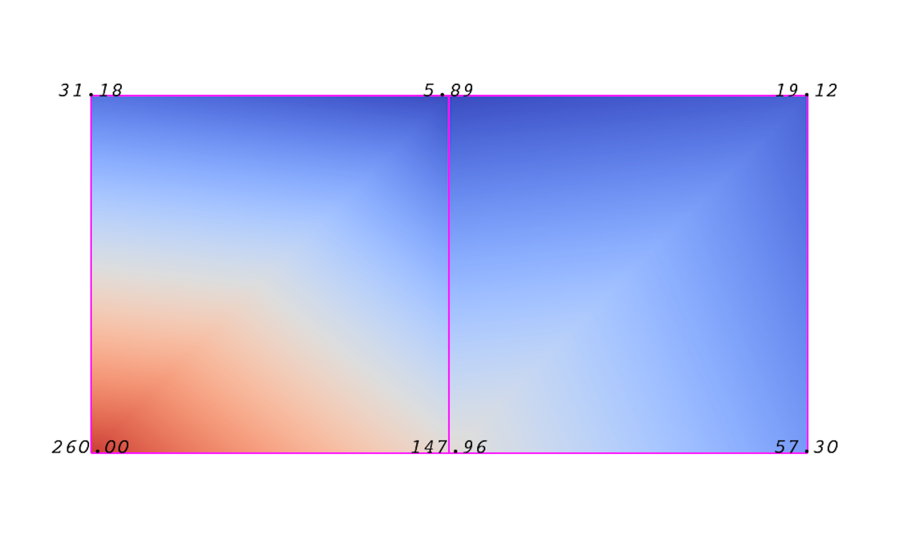
<!-- markdownlint-enable MD033 -->

Attribute only defined at vertices 属性只在顶点处定义

- Interpolation used to obtain values everywhere else 通过插值来获得其他位置上的数值

<!-- markdownlint-disable MD033 -->
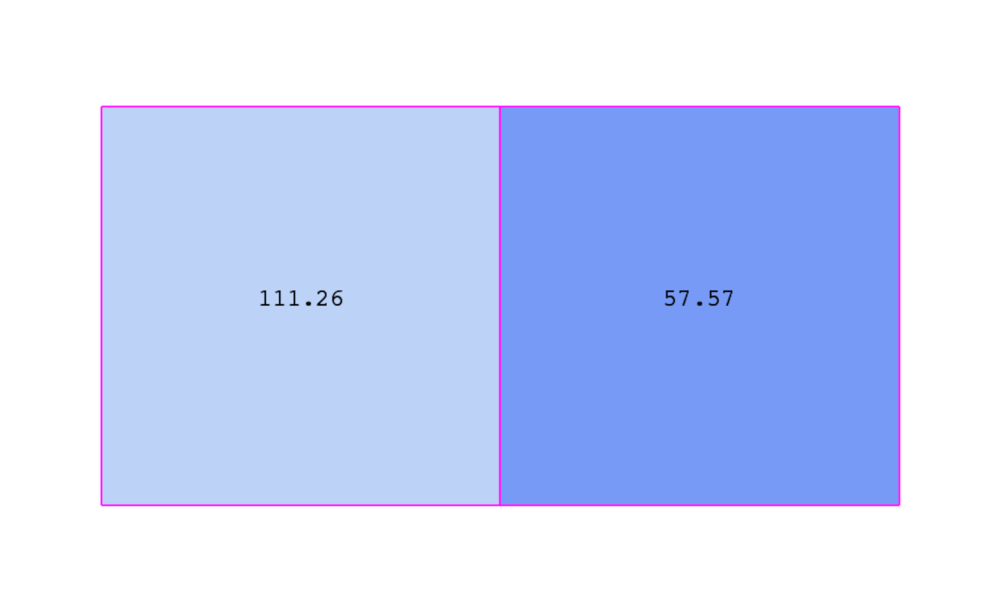
<!-- markdownlint-enable MD033 -->

Cell-centered attributes are assumed to be constant over each cell 单元中心属性通常被假定为在每个单元内保持常数

- Filter may not apply; requires `Cell Data to Point Data` filter 某些过滤器可能无法直接应用；这时需要使用 `Cell Data to Point Data` 过滤器

## VTK Data file formats VTK 数据文件格式

VTK supports five different data-set formats: VTK 支持五种不同的数据集格式：

- structured points, structured grid, rectilinear grid, unstructured
  grid, polygonal data 结构化点、结构化网格、直角坐标网格、非结构网格和多边形数据

Exercise; Create `file1.vtk`: 练习：创建 `file1.vtk`：

`# vtk DataFile Version 2.0`  
`Structured example`  
`ASCII`  
`DATASET STRUCTURED_POINTS`  
`DIMENSIONS 3 4 5`  
`ORIGIN 0 0 0`  
`SPACING 1 2 3`  

Now open with ParaView (beware! ‘\_’ character doesn’t copy-paste) 现在用 ParaView 打开它（注意：`\_` 字符复制粘贴时可能有问题）

Then add lines: 然后加入以下几行：

`POINT_DATA 60`  
`SCALARS volume_scalars char 1`  
`LOOKUP_TABLE default`  
`0 0 0 0 0 0 0 0 0 0 0 0`  
`0 5 10 15 20 25 25 20 15 10 5 0`  
`0 10 20 30 40 50 50 40 30 20 10 0`  
`0 5 10 15 20 25 25 20 15 10 5 0`  
`0 0 0 0 0 0 0 0 0 0 0 0`  

Open in ParaView and check data. 在 ParaView 中打开并检查数据。

Can you add cell data? 你能再添加单元数据吗？

## Unstructured grid example 非结构网格示例

`# vtk DataFile Version 2.0`  
`Unstructured Ex`  
`ASCII`  
`DATASET UNSTRUCTURED_GRID`  
`POINTS 27 float`  
`0 0 0 1 0 0 2 0 0 0 1 0 1 1 0 2 1 0 0 0 1`  
`1 0 1 2 0 1 0 1 1 1 1 1 2 1 1 0 1 2 1 1 2`  
`2 1 2 0 1 3 1 1 3 2 1 3 0 1 4 1 1 4 2 1 4`  
`0 1 5 1 1 5 2 1 5 0 1 6 1 1 6 2 1 6`  
`CELLS 11 60`  
`8 0 1 4 3 6 7 10 9`  
`8 1 2 5 4 7 8 11 10`  
`4 6 10 9 12`  
`4 5 11 10 14`  
`6 15 16 17 14 13 12`  
`6 18 15 19 16 20 17`  
`4 22 23 20 19`  
`3 21 22 18`  
`3 22 19 18`  
`2 26 25`  
`1 24`  
`CELL_TYPES 11`  
`12 12 10 10 7 6 9 5 5 3 1`  
`POINT_DATA 27`  
`SCALARS scalars float 1`  
`LOOKUP_TABLE default`  
`0.0 1.0 2.0 3.0 4.0 5.0 6.0`  
`7.0 8.0 9.0 10.0 11.0 12.0`  
`13.0 14.0 15.0 16.0 17.0 18.0`  
`19.0 20.0 21.0 22.0 23.0 24.0 25.0 26.0`  
`VECTORS vectors float`  
`1 0 0 1 1 0 0 2 0 1 0 0 1 1 0 0 2 0 1 0 0`  
`1 1 0 0 2 0 1 0 0 1 1 0 0 2 0 0 0 1 0 0 1`  
`0 0 1 0 0 1 0 0 1 0 0 1 0 0 1 0 0 1 0 0 1`  
`0 0 1 0 0 1 0 0 1 0 0 1 0 0 1 0 0 1`  

<!-- markdownlint-disable MD033 -->
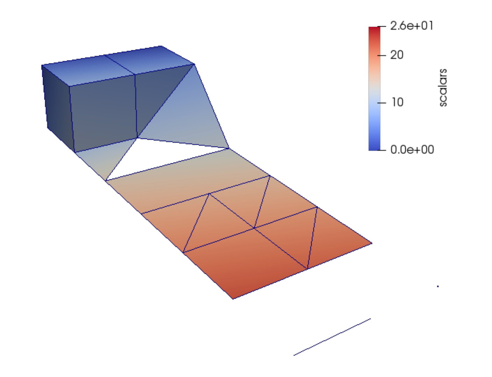
<!-- markdownlint-enable MD033 -->

Details on `CELL_TYPES` are given in the
[VTK file formats reference](https://vtk.org/wp-content/uploads/2015/04/file-formats.pdf)
on pp. 9 & 10 关于 `CELL_TYPES` 的细节，请参阅 [VTK 文件格式参考](https://vtk.org/wp-content/uploads/2015/04/file-formats.pdf) 第 9 和 10 页

## Time dependent data 时变数据

ParaView automatically detects several file naming patterns that
indicate a file series, including: ParaView 会自动识别若干表示文件序列的命名模式，包括：

`fooN.vtk` `foo_N.vtk` `fooN.vtk` `foo.N.vtk` `Nfoo.vtk` `N.foo.vtk`
`foo.vtk.N` `foo.vtksN`

where *foo* is any filename, *N* is a numeral sequence, and *vtk* could
be any extension 其中 *foo* 可以是任意文件名，*N* 是数字序列，而 *vtk* 也可以替换成其他扩展名

File sequences can be made that will be grouped by ParaView; e.g.
`file1.vtk`, `file2.vtk`, ... 可以构造这类文件序列，ParaView 会将其自动分组，例如 `file1.vtk`、`file2.vtk` 等

## Particle file 1 粒子文件 1

Create file named `part0.vtu` with: 创建名为 `part0.vtu` 的文件，内容如下：

```xml
<VTKFile type="UnstructuredGrid" version="2.0" byte_order="LittleEndian">
 <UnstructuredGrid>
 <Piece NumberOfPoints="3" NumberOfCells="0">
 <Points>
 <DataArray name="Position" type="Float32" NumberOfComponents="3" format="ascii">
  0 0 0 1 1 1 0 0 1
 </DataArray>
 </Points>
 <PointData Vectors="vector">
 <DataArray type="Float32" Name="Velocity" NumberOfComponents="3" format="ascii">
  4 4 4 4 0 0 2 2 -2
 </DataArray>
 <DataArray type="Float32" Name="Diameter" format="ascii">
  0.1 0.5 1
 </DataArray>
 <DataArray type="Float32" Name="Temperature" format="ascii">
  273 300 350
 </DataArray>
 </PointData>
 <Cells>
 <DataArray type="Int32" Name="connectivity" format="ascii">
 </DataArray>
 <DataArray type="Int32" Name="offsets" format="ascii">
 </DataArray>
 <DataArray type="UInt8" Name="types" format="ascii">
 </DataArray>
 </Cells>
 </Piece>
 </UnstructuredGrid>
</VTKFile>
```

## Particle file 2 粒子文件 2

- Open file in ParaView 在 ParaView 中打开该文件

- Add glyphs with diameter specified in file
  (`Properties` -> `Glyph Mode` -> `All Points`) 添加由文件中直径字段指定大小的 glyph（字形）

- Colour particles according to temperature 按温度为粒子着色

- Copy `part0.vtu` to create `part1.vtu` with different particle
  coordinates/temperature/diameter 复制 `part0.vtu` 生成 `part1.vtu`，并修改粒子坐标、温度和直径

<!-- markdownlint-disable MD033 -->
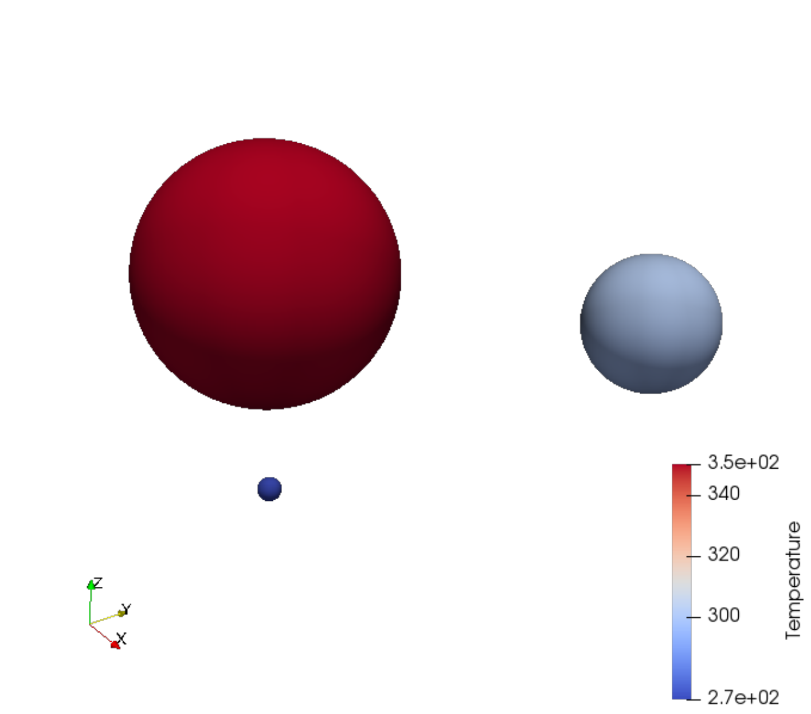
<!-- markdownlint-enable MD033 -->

## Other file formats 其他文件格式

[STL](https://en.wikipedia.org/wiki/STL_(file_format))
("stereolithography") file, e.g. [Utah
teapot](https://commons.wikimedia.org/wiki/File:Utah_teapot_(solid).stl) [STL](https://en.wikipedia.org/wiki/STL_(file_format))（stereolithography，立体光刻）文件，例如 [Utah teapot](https://commons.wikimedia.org/wiki/File:Utah_teapot_(solid).stl)

- Describe only the surface geometry of a three-dimensional object 只描述三维物体的表面几何

- Unstructured triangulated surface 属于非结构三角面片表面

[Exodus](https://cubit.sandia.gov/public/13.2/help_manual/WebHelp/finite_element_model/exodus/block_specification.htm)
Element Block Specification (e.g. `.ex2`) [Exodus](https://cubit.sandia.gov/public/13.2/help_manual/WebHelp/finite_element_model/exodus/block_specification.htm) 元素块规范格式（例如 `.ex2`）

- [CUBIT](https://cubit.sandia.gov/) Geometry and Mesh
  Generation Toolkit [CUBIT](https://cubit.sandia.gov/) 几何与网格生成工具包

### Binary files 二进制文件

- More compact and quicker to read 更紧凑，也更快读取

- Binary versions of most file formats 大多数文件格式都有对应的二进制版本

## Grid generation: Gmsh 网格生成：Gmsh

Normally, a mesh is generated by software 通常，网格由专门的软件生成

For example, [Gmsh](http://gmsh.info/) open-source
finite-element mesh generator. After installing Gmsh: 例如开源有限元网格生成器 [Gmsh](http://gmsh.info/)。安装 Gmsh 后：

1. Download script
    [t4.geo](https://gitlab.onelab.info/gmsh/gmsh/-/blob/master/tutorial/t4.geo) 下载脚本 [t4.geo](https://gitlab.onelab.info/gmsh/gmsh/-/blob/master/tutorial/t4.geo)

2. run command `$ gmsh -2 -format stl t4.geo` 运行命令 `$ gmsh -2 -format stl t4.geo`

3. open `t4.stl` in ParaView 在 ParaView 中打开 `t4.stl`

<!-- markdownlint-disable MD033 -->
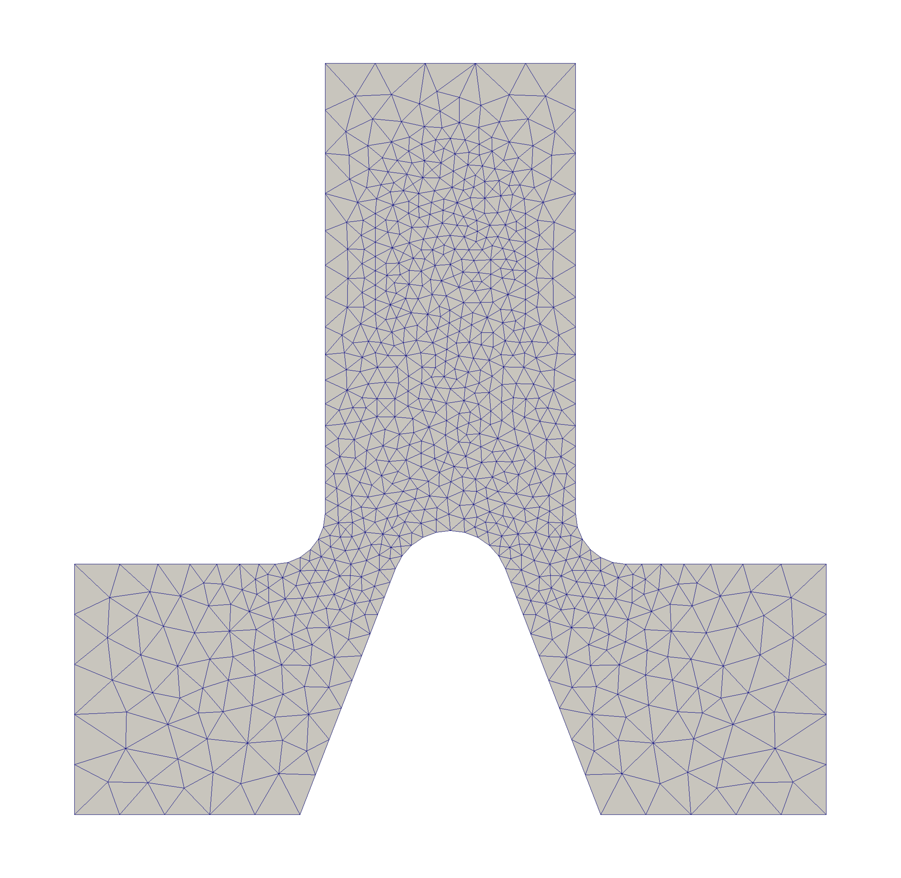
<!-- markdownlint-enable MD033 -->

## Computer simulation: OpenFOAM 计算机模拟：OpenFOAM

[OpenFOAM](https://openfoam.org/) is free, open source
software for CFD [OpenFOAM](https://openfoam.org/) 是一个免费开源的 CFD 软件

Can be obtained on Ubuntu from the
[OpenFOAM Ubuntu package page](https://develop.openfoam.com/Development/openfoam/-/wikis/precompiled/debian) 在 Ubuntu 上可以从 [OpenFOAM 安装页面](https://develop.openfoam.com/Development/openfoam/-/wikis/precompiled/debian) 获取

Tutorial examples including cylinder potential flow (right) 教程示例包括圆柱势流（右图）

`$FOAM_TUTORIALS/tutorials/basic/potentialFoam/cylinder`

Version of ParaView launched from command line: 从命令行启动的 ParaView 版本：

`$ paraFoam`

<!-- markdownlint-disable MD033 -->
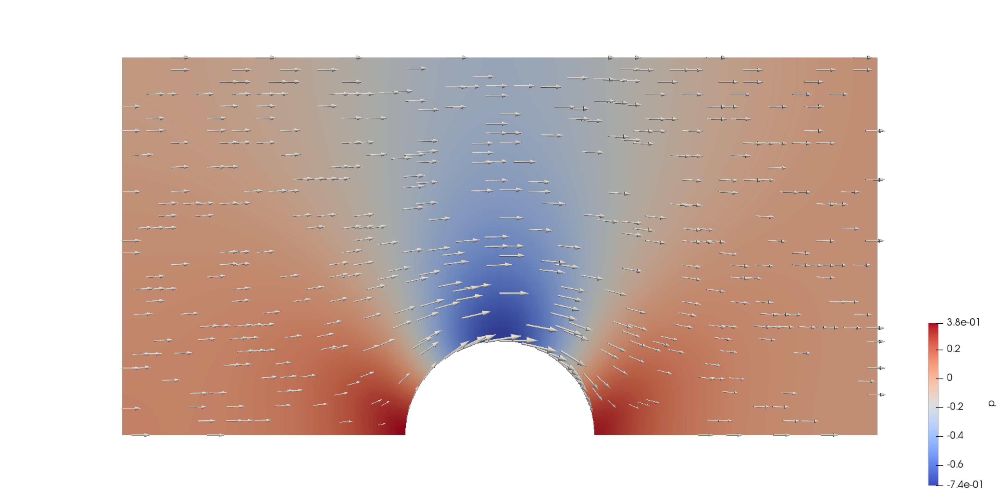
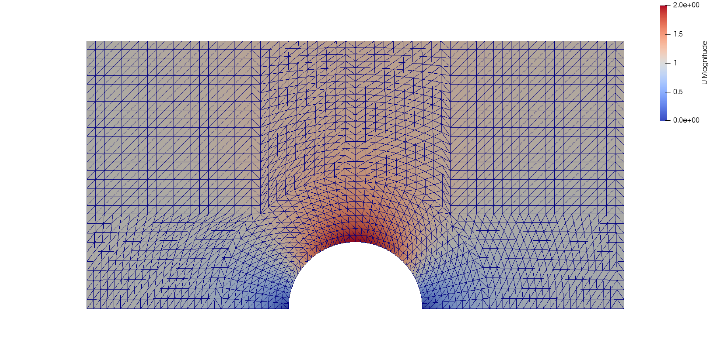
<!-- markdownlint-enable MD033 -->

Cylinder potential flow. 圆柱势流示例。

## Medical data: Head scan 医学数据：头部扫描

3D image file. Download
[headsq.vti](https://github.com/MrGeislinger/leapmotion-paraview/blob/master/Examples/ParaViewTutorialData/headsq.vti) 三维图像文件，可下载 [headsq.vti](https://github.com/MrGeislinger/leapmotion-paraview/blob/master/Examples/ParaViewTutorialData/headsq.vti)

- VTKFile with XML formats 这是 XML 格式的 VTK 文件

- Binary image data 包含二进制图像数据

<!-- markdownlint-disable MD033 -->
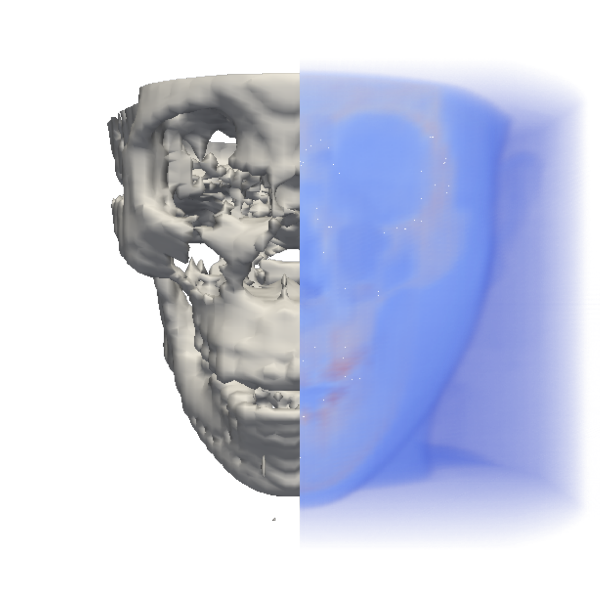
<!-- markdownlint-enable MD033 -->

## Exercises: Day 2 第二天练习

For Exercise 2.19, load `can.ex2` from
`ParaView-v5.8.0-RC1/Testing/Data/` 在练习 2.19 中，从 `ParaView-v5.8.0-RC1/Testing/Data/` 加载 `can.ex2`

- Explore all the different options as you go along 在操作过程中探索各种不同选项

- If you finish, create document with image output 如果完成了，就生成带图像输出的文档

## Exercises: Day 3 第三天练习

To prepare for the evaluation exercise: 为准备考核练习：

- Use data (ParaView examples, internet, simulation software, e.g.
  OpenFOAM tutorials,...) 使用数据（ParaView 示例、互联网、仿真软件，例如 OpenFOAM 教程等）

- Create images, videos, etc then put in document (good formatting, e.g.
  correct font sizes, etc) 创建图像、视频等内容，并整理到文档中（注意良好的排版，例如正确的字体大小等）

- Create plots / analysis to show interesting behaviour or phenomena 创建图表或分析内容，展示有趣的行为或现象

Work on several data-sets throughout the day. Discuss the results in
groups and show me what you have found. Ideas for data sources: 全天处理多个数据集，小组讨论结果，并展示你们发现了什么。数据来源建议如下：

- (morning) ParaView example data 上午：ParaView 示例数据

  - AMR `amr/spcth.0`, tutorial
    [AMR tutorial](https://docs.paraview.org/en/latest/Tutorials/ClassroomTutorials/targetedParaViewAndCTH.html#targeted-paraview-cth) AMR `amr/spcth.0`，参见 [AMR 教程](https://docs.paraview.org/en/latest/Tutorials/ClassroomTutorials/targetedParaViewAndCTH.html#targeted-paraview-cth)

  - Aerofoil `EnSight/naca.bin.case` 翼型数据 `EnSight/naca.bin.case`

  - Iron protein(?) `Iron_Xdmf/Iron_Protein.ImageData.Collection.xmf` 铁蛋白(?) 数据 `Iron_Xdmf/Iron_Protein.ImageData.Collection.xmf`

  - [3GQP](https://www.rcsb.org/structure/3GQP) protein
    `/3GQP.pdb` [3GQP](https://www.rcsb.org/structure/3GQP) 蛋白质数据 `/3GQP.pdb`

- (afternoon) OpenFoam tutorials:
  [OpenFOAM tutorial guide](https://www.openfoam.com/documentation/tutorial-guide/),
  other 3D simulation software 下午：OpenFOAM 教程（见 [OpenFOAM 教程指南](https://www.openfoam.com/documentation/tutorial-guide/)）以及其他三维仿真软件

- Other possibilities; create sources to demonstrate animations,
  mathematical geometric data, ... 其他可能性：创建 source 来演示动画、数学几何数据等

## OpenFOAM data OpenFOAM 数据

1. **Cavity flow tutorial;** obtain `cavity.zip` (with documentation
    [in the OpenFOAM tutorial guide](https://www.openfoam.com/documentation/tutorial-guide/))
    and open in ParaView, then apply filters (glyph, streamline, plot
    velocity profile along centre line). After output images and use in
    a document to make descriptions of the flow **方腔流教程：** 获取 `cavity.zip`（文档见 [OpenFOAM 教程指南](https://www.openfoam.com/documentation/tutorial-guide/)），在 ParaView 中打开，然后应用过滤器（glyph、streamline、沿中心线绘制速度剖面）。之后导出图像并写入文档，对流动进行说明

2. **Dam break tutorial;** obtain `damBreak.zip` and open in ParaView.
    Then create an animation and use to describe what is happening in
    the simulation, then find the maximum pressure on the right hand
    wall :
    [damBreak](https://www.openfoam.com/documentation/tutorial-guide/tutorialse8.php#x14-680004.1) **溃坝教程：** 获取 `damBreak.zip` 并在 ParaView 中打开。然后制作动画，用于描述模拟中发生的现象，并找出右侧壁面的最大压力，参见 [damBreak](https://www.openfoam.com/documentation/tutorial-guide/tutorialse8.php#x14-680004.1)

## Batch scripting: Day 4 第四天：批处理脚本

Python scripting can be leveraged in two ways within ParaView: 在 ParaView 中，Python 脚本主要有两种用途：

1. Automate the setup and execution of visualisations by performing the
    same actions as a user at the GUI 通过执行与用户在图形界面中相同的操作，自动完成可视化设置和执行

2. Run inside pipeline objects, thereby performing parallel
    visualisation algorithms 在管线对象内部运行，从而执行并行可视化算法

Good way to automate mundane and repetitive tasks 这是自动化枯燥且重复任务的好方法

Critical component when using ParaView in situations where the GUI is
undesired or unavailable 当图形界面不适合使用或无法使用时，它是 ParaView 的关键组成部分

Python scripting to establish *in situ* computation within simulation
code, i.e. script included in simulation code Python 脚本还可以建立模拟代码中的 *in situ* 计算，也就是将脚本直接嵌入模拟程序

Scripting allows access to much wider range of capabilities 脚本方式还可以访问更广泛的能力

## Python Python 简介

From [Python.org](https://www.python.org/): *“Python is a
programming language that lets you work quickly and integrate systems
more effectively”* 来自 [Python.org](https://www.python.org/)：*“Python is a programming language that lets you work quickly and integrate systems more effectively”*，即“Python 是一种让你能够快速工作并更高效集成系统的编程语言”

Open-source and freely available 开源且免费可用

Good for beginners and those experienced with other languages 既适合初学者，也适合有其他语言经验的人

Both Python’s standard library and the community-contributed modules
allow for endless possibilities. Libraries include: Python 标准库和社区贡献模块提供了几乎无穷的可能性。常见库包括：

- [NumPy](https://numpy.org/) is the fundamental package for
  scientific computing [NumPy](https://numpy.org/) 是科学计算的基础包

- [matplotlib](https://matplotlib.org/) is a comprehensive
  library for creating static, animated, and interactive visualisations [matplotlib](https://matplotlib.org/) 是一个用于创建静态、动画和交互式可视化的综合性库

Runs from command line and can be scripted 可以从命令行运行，并且支持脚本化

- Basic demonstration 基本演示

## Scripting approaches 脚本方式

Python Shell Python 交互窗口  
Find in `View` -> `Python Shell` 可在 `View` -> `Python Shell` 中找到

pvpython `pvpython`  
Runs on command line for interactive scripts 在命令行中运行交互式脚本

pvbatch `pvbatch`  
Runs on the command line for batch processing. Can be run in parallel 在命令行中执行批处理任务，并且可以并行运行

pvserver `pvserver`  
For remote visualization, useful on HPC resources 用于远程可视化，在 HPC 资源上特别有用

There are also programmable sources and filters... 此外还有可编程数据源和过滤器……

## Programmable filter example 可编程过滤器示例

- Apply a programmable filter to file1.vtk (day 2) 将一个可编程过滤器应用到第 2 天创建的 `file1.vtk`

``` python
input0 = inputs[0]
data = input0.PointData["volume_scalars"] / 2.0
output.PointData.append(data, "scalar_half") 
```

<!-- markdownlint-disable MD033 -->
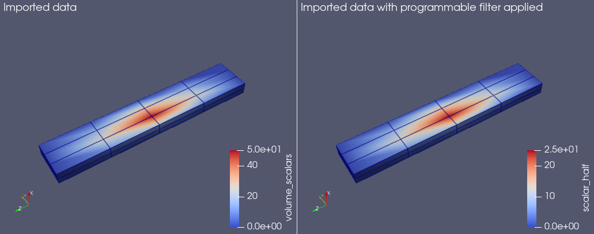
<!-- markdownlint-enable MD033 -->

## Programmable source example 可编程数据源示例

- Use data.csv to create a programmable source (day 1) 使用 `data.csv` 创建一个可编程 source（第 1 天内容）

``` python
import numpy as np
data = np.genfromtxt("data.csv",
                     dtype=None,
                     names=True,
                     delimiter=',',
                     autostrip=True)
for name in data.dtype.names:
    array = data[name]
    output.RowData.append(array, name)
```

<!-- markdownlint-disable MD033 -->
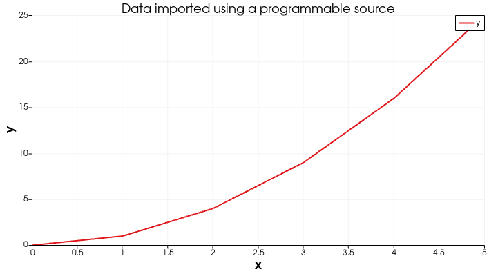
<!-- markdownlint-enable MD033 -->

## Programmable sources and filters 可编程数据源与过滤器

- Try the other examples given in the
  [programmable filter reference](https://docs.paraview.org/en/latest/ReferenceManual/pythonProgrammableFilter.html),
  adjust the code to see what changes 试试 [programmable filter reference](https://docs.paraview.org/en/latest/ReferenceManual/pythonProgrammableFilter.html) 中给出的其他示例，并调整代码观察会发生什么变化

<!-- markdownlint-disable MD033 -->
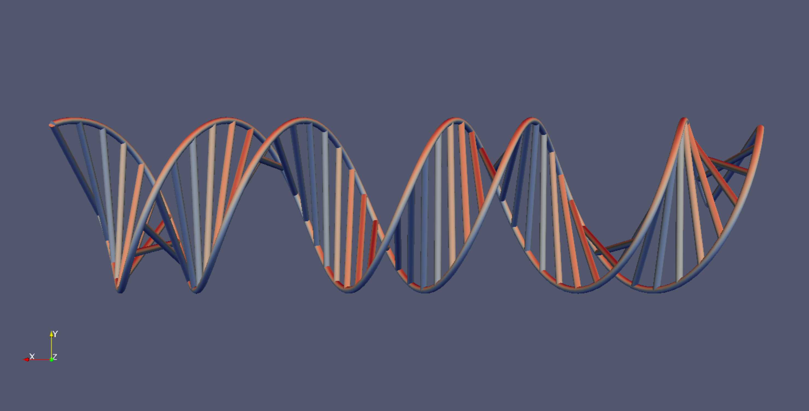
<!-- markdownlint-enable MD033 -->

## Tracing actions for scripting 脚本追踪操作

For tracing actions in the UI as a Python script 用于把界面中的操作追踪成 Python 脚本

- `Tools` -> `Start Trace` 选择 `Tools` -> `Start Trace`

- Execute a series of actions in the UI 在界面中执行一系列操作

- `Tools` -> `Stop Trace` 选择 `Tools` -> `Stop Trace`

Produces a python script that corresponds to performed actions 会生成一个与所执行操作相对应的 Python 脚本

Save script and use for batch processing 保存脚本并将其用于批处理

Good way to discover ParaView python commands and syntax 这是了解 ParaView Python 命令和语法的好方法

## Python scripting Python 脚本

## Exercises: Day 4 第四天练习

Exercises in chapter 3 of the ParaView tutorial on
scripting ParaView 教程第 3 章中的脚本练习

Create a script that outputs an annotated visualisation including
filters, and a plot over line, from day 3 OpenFOAM exercises, e.g.
the cavity flow tutorial. Afterward, run this in a terminal using
`pvpython script.py` (it may be necessary to put `Interact()` at the end
of the script). 编写一个脚本，输出带注释的可视化结果，包括过滤器和线图，数据来自第 3 天的 OpenFOAM 练习，例如 cavity flow 教程。随后在终端中使用 `pvpython script.py` 运行（可能需要在脚本末尾加上 `Interact()`）。

## Other scripting possibilities 其他脚本方案

- [PyVista](https://docs.pyvista.org/) 3D plotting and mesh
  analysis through a streamlined interface for the Visualization Toolkit
  (VTK) [PyVista](https://docs.pyvista.org/) 通过一个更简洁的接口为 VTK 提供三维绘图与网格分析功能

  - No GUI 无图形界面

  - Lighter than ParaView 比 ParaView 更轻量

  - Some filters that are not included in ParaView, e.g.
    [delaunay_2d](https://docs.pyvista.org/api/core/_autosummary/pyvista.UnstructuredGridFilters.delaunay_2d.html)
    to construct mesh from data points 包含一些 ParaView 中没有的过滤器，例如用 [delaunay_2d](https://docs.pyvista.org/api/core/_autosummary/pyvista.UnstructuredGridFilters.delaunay_2d.html) 从数据点构造网格

- VTK in
  [python](https://kitware.github.io/vtk-examples/site/Python/GeometricObjects/Cylinder/) 使用 [python](https://kitware.github.io/vtk-examples/site/Python/GeometricObjects/Cylinder/) 中的 VTK

  - No GUI, hence necessary to develop script from online examples and
    python commands 无图形界面，因此通常需要参考在线示例和 Python 命令来编写脚本

- VTK in
  [c++](https://kitware.github.io/vtk-examples/site/Cxx/GeometricObjects/Cylinder/) 使用 [c++](https://kitware.github.io/vtk-examples/site/Cxx/GeometricObjects/Cylinder/) 中的 VTK

  - No GUI, need for make/cmake files 无图形界面，需要 make/cmake 文件

  - Allows access to whole VTK library 可以访问完整的 VTK 库

  - Useful for full integration into simulation code, e.g.
    [Liggghts](https://www.cfdem.com/liggghts-open-source-discrete-element-method-particle-simulation-code) 对于将可视化完全整合进模拟代码很有用，例如 [Liggghts](https://www.cfdem.com/liggghts-open-source-discrete-element-method-particle-simulation-code)

## Creating dashboards 创建仪表板

A useful way to allow non-expert users to manipulate a visualisation 这是一种让非专业用户也能操作可视化结果的有效方式

<!-- markdownlint-disable MD033 -->
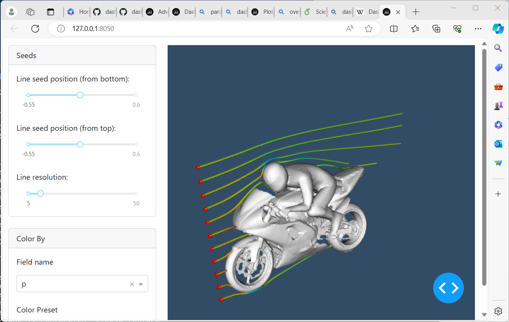
<!-- markdownlint-enable MD033 -->

Try to install and run this
[Dash VTK example repository](https://github.com/johnsgit9/dashvis.git). 尝试安装并运行这个 [Dash VTK 示例仓库](https://github.com/johnsgit9/dashvis.git)。

For some advanced, but illustrative, plotly examples, see the
[Plotly Dash VTK advanced examples](https://dash.plotly.com/vtk/advanced). 如果想看更高级但很有代表性的 Plotly 示例，可以参考 [Plotly Dash VTK advanced examples](https://dash.plotly.com/vtk/advanced)。

## Visualising large models 大规模模型可视化

### Visualising large models: examples 1 大规模模型可视化示例 1

ParaView used at institutions around the world to visualise data from
large-scale simulations run on the world’s largest supercomputers ParaView 被世界各地的机构用于可视化在顶级超级计算机上运行的大规模模拟数据

<!-- markdownlint-disable MD033 -->
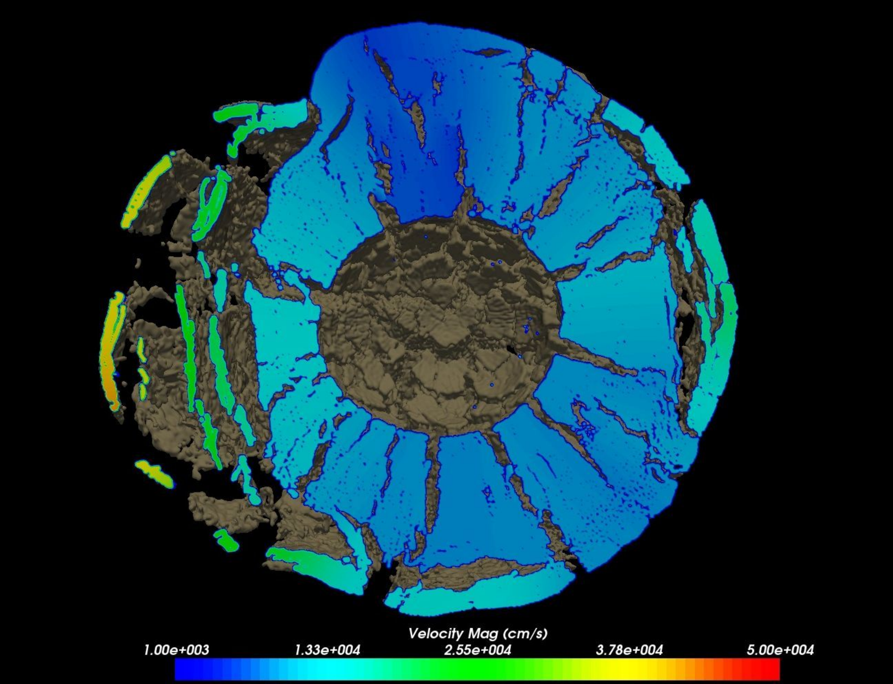
<!-- markdownlint-enable MD033 -->

CTH shock physics simulation with over 1 billion cells of a 10 megaton explosion detonated at the centre of the Golevka asteroid. CTH 冲击物理模拟，包含超过 10 亿个单元，描述一枚 1000 万吨当量爆炸在 Golevka 小行星中心引爆的情形。

<!-- markdownlint-disable MD033 -->
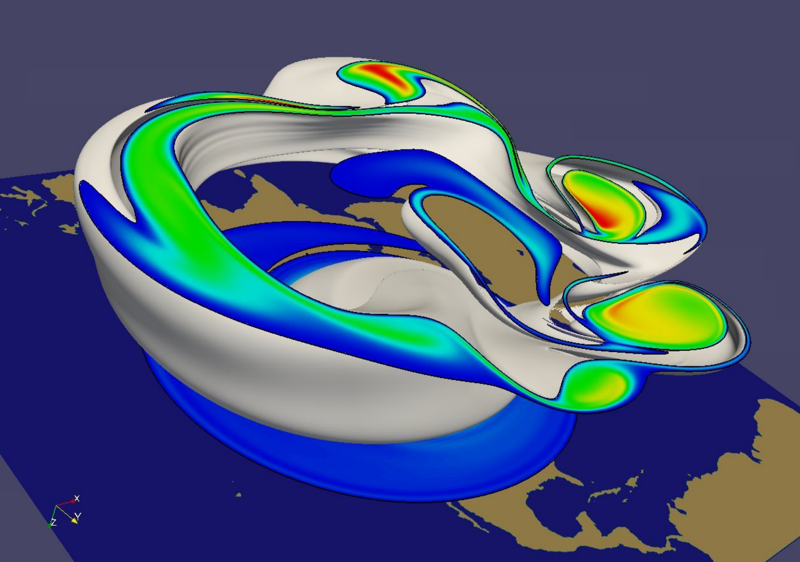
<!-- markdownlint-enable MD033 -->

SEAM Climate Modeling simulation with 1 billion cells modeling the breakdown of the polar vortex, a circumpolar jet that traps polar air at high latitudes. SEAM 气候模型模拟，包含 10 亿个单元，用于模拟极涡的瓦解过程；极涡是一种环绕极地、将极地冷空气限制在高纬度地区的急流。

### Visualising large models: examples 2 大规模模型可视化示例 2

<!-- markdownlint-disable MD033 -->
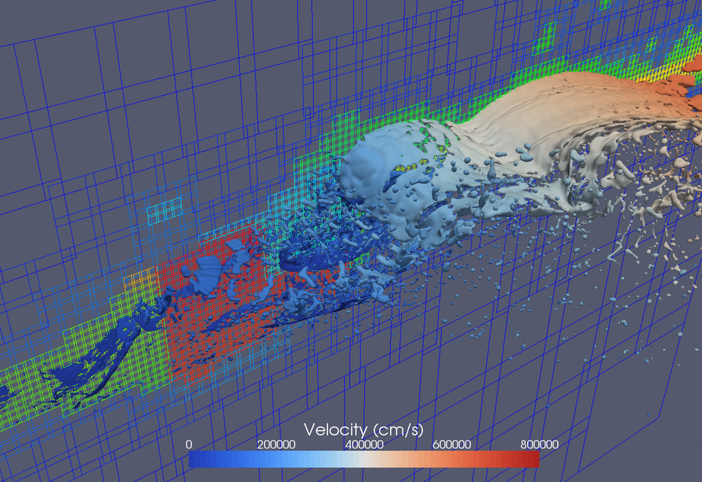
<!-- markdownlint-enable MD033 -->

A CTH simulation that generates AMR data. ParaView has been used to visualize CTH simulation AMR data comprising billions of cells, 100's of thousands of blocks, and eleven levels of hierarchy (not shown). 一个生成 AMR 数据的 CTH 模拟。ParaView 曾被用于可视化包含数十亿单元、数十万个块以及 11 层层级结构（图中未显示）的 CTH AMR 数据。

<!-- markdownlint-disable MD033 -->
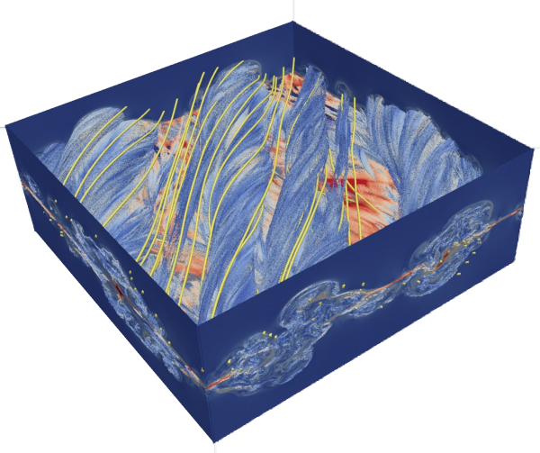
<!-- markdownlint-enable MD033 -->

A VPIC simulation of magnetic reconnection with 3.3 billion structured cells. 一项 VPIC 磁重联模拟，包含 33 亿个结构化单元。

### Visualising large models: examples 3 大规模模型可视化示例 3

<!-- markdownlint-disable MD033 -->
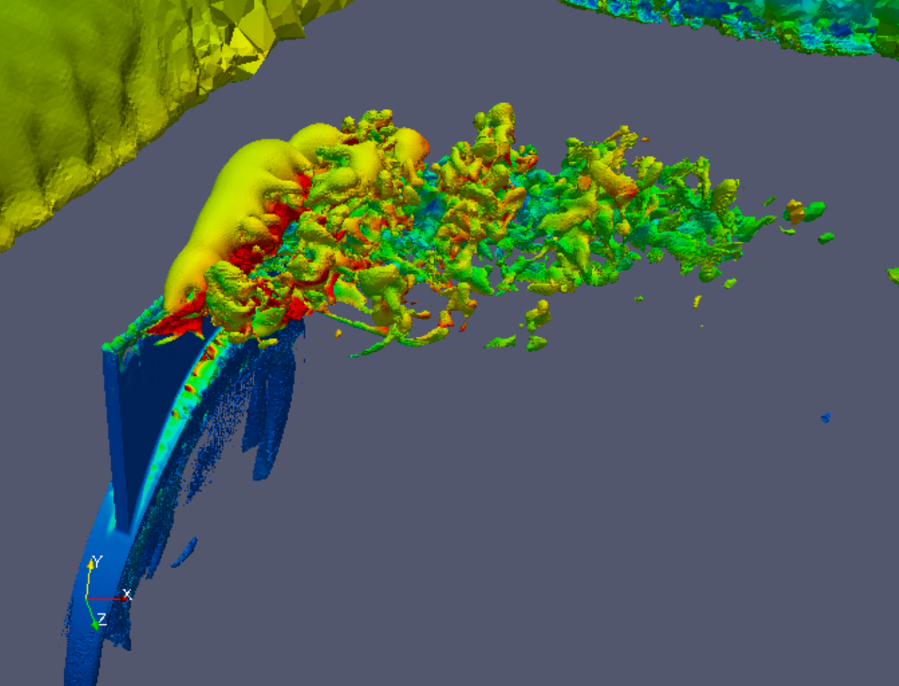
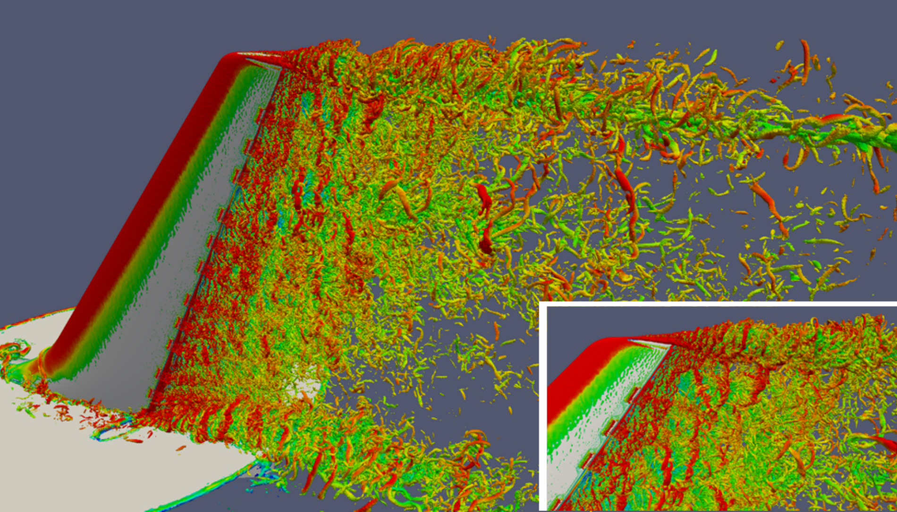
<!-- markdownlint-enable MD033 -->

ParaView visualizations run in situ with large scale
[PHASTA](https://phasta.scigap.org/) simulations ParaView 在大规模 [PHASTA](https://phasta.scigap.org/) 模拟中以原位方式运行可视化

**Left** billion tetrahedral mesh simulating the flow over a full wing
where a synthetic jet issues an unsteady crossflow jet (run on 160
thousand MPI processes) **左图**：十亿级四面体网格，模拟完整机翼上的流动，其中一个合成射流产生非定常横向射流（运行于 16 万个 MPI 进程）

**Right** is a 1.3 billion element mesh simulating the wake of a
deflected wing flap (run on 256 thousand MPI processes) **右图**：13 亿单元网格，模拟偏转襟翼后的尾流（运行于 25.6 万个 MPI 进程）

## Exercise 练习

Read parallel visualization algorithms and parallel rendering in Chapter
4 of the tutorials 阅读教程第 4 章中的并行可视化算法和并行渲染部分

Paraview tutorial exercise 4.1 完成 ParaView 教程练习 4.1

## Evaluation 考核

Evaluation exercise using scientific data: 使用科学数据完成考核练习：

- Choose from given OpenFOAM tutorials. All students must use different
  data 从给定的 OpenFOAM 教程中选择。所有学生必须使用不同的数据

- Create images, videos, etc then put in document (good formatting, e.g.
  correct font sizes, etc) 创建图像、视频等内容，并整理到文档中（注意良好的排版，例如合适的字体大小等）

## Marks awarded for 评分标准

- visualisations using filters 使用了过滤器的可视化

- extracted from 3-D data 从三维数据中提取的结果

- showing instructive behaviour 能展示有启发性的行为

- of interesting behaviour 展现有趣现象

- i.e. layout, colour choices, font sizes, etc 例如版式、配色、字体大小等表现质量

## Evaluation hints 考核提示

- Do not include screen captures. 不要包含屏幕截图。

- No visualisations without filters applied. 不要提交未经任何过滤器处理的可视化。

- Add axis labels to line charts. 给折线图添加坐标轴标签。

- Add annotation to movie; e.g. time, title, etc. 给视频添加注释，例如时间、标题等。

- Document in pdf format and separate movie file. 文档应为 pdf 格式，并单独提交视频文件。

- Only one animation. Use multi-view if necessary. 只允许一个动画；如有需要可以使用多视图。

- Best marks for comparisons involving superimposed statistics 涉及叠加统计信息的比较通常能获得最高分

## Transcript :
### Submission format 提交形式

- Submit the report as a `PDF`. 报告必须提交为 `PDF`。
- Put images inside the report. 图片放在报告中。
- Submit the movie as a separate file. 视频最好单独提交，不要依赖报告里的嵌入视频。
- Only one animation is required. 只需要一个动画。
- If useful, use multi-view layouts. 如果有帮助，可以使用多视图布局，例如左边 3D 视图、右边 line plot。

### What the teacher cares about 老师最看重什么

- This is not just a button-clicking exercise. 这不是单纯“点按钮出图”的练习。
- The goal is to show that you can analyse scientific data and communicate the result clearly. 目标是展示你能分析科学数据，并把结果清楚传达出来。
- The report should read like a results document, not a step-by-step tutorial. 报告应当像结果汇报，而不是操作说明书。
- You do not need to be a fluid mechanics expert, but your explanation should still be physically reasonable. 不要求成为流体力学专家，但解释必须至少合理。

### Visualisation requirements 可视化要求

- Every visualisation must use filters. 每个可视化都必须使用过滤器。
- Simply opening the file and showing the raw field is not enough. 仅仅打开文件并显示原始结果是不够的。
- Suitable examples mentioned by the teacher include `Contour`, `Glyph`, and `Stream Tracer`. 老师明确提到的例子包括 `Contour`、`Glyph` 和 `Stream Tracer`。
- Use the filters and analysis tools practiced in class over the last few days. 应使用这几天课程中练过的过滤器和分析方法。

### Images and comparisons 图片与比较

- Each image must have a purpose. 每张图片都必须有明确用途。
- Do not include many images that show essentially the same thing. 不要重复放很多本质相同的图。
- It is valid to place two images from different times side by side for comparison. 可以把不同时间的两张图并排放置做比较。
- Comparisons are especially valued. 比较类展示通常更加分。
- The teacher explicitly likes comparisons such as pressure versus velocity. 老师特别喜欢类似压力与速度的对比分析。

### Minimum content 最低内容

- Include multiple static visualisations. 至少要有若干张静态图。
- Include at least one `line plot`. 至少要有一个 `line plot`。
- Include one animation as a separate file. 需要一个单独提交的动画文件。
- In the report, explain what the animation shows. 在报告里说明动画展示了什么现象。

### Annotation and labels 注释与标签

- Add axis labels to line plots. 给 line plot 添加坐标轴标签。
- Add annotation to the movie. 给动画添加注释。
- The movie should at least show time and a title. 动画中至少要显示时间和标题。
- Add any other labels that help the viewer understand the result. 也可以添加其他有助于理解结果的标签。

### Formatting and readability 排版与可读性

- Formatting affects marks. 排版质量会影响分数。
- Use readable font sizes. 字体大小必须清晰可读，不要过小。
- Text inside figures should feel comparable to normal readable document text. 图中的文字大小应接近正常文档的可读性。
- Choose colours carefully. 配色要认真选择。
- Use a clean layout and good framing. 版式要整洁，构图要合适。
- Avoid overly tight crops or cluttered figures. 不要裁切过紧，也不要让图面显得拥挤混乱。

### Things to avoid 需要避免的事

- Do not include screen captures. 不要使用屏幕截图。
- Export clean figures properly instead of using snipping tools. 应使用导出功能生成干净图片，而不是随手截图。
- Do not submit visualisations without filters. 不要提交未使用过滤器的可视化。
- Do not fill the report with decorative images that are not analysed. 不要放只有观赏性、没有分析意义的图片。

### Practical interpretation 实际执行理解

- The audience is like a client, supervisor, thesis advisor, or paper reader. 报告面对的读者应当想象成客户、老板、导师或论文读者。
- Focus on results, interpretation, and communication. 重点应放在结果、解释和表达质量上。
- Scientific visualisation means using images to understand what is happening in the data. 科学可视化的重点是借助图像理解数据中发生了什么。
