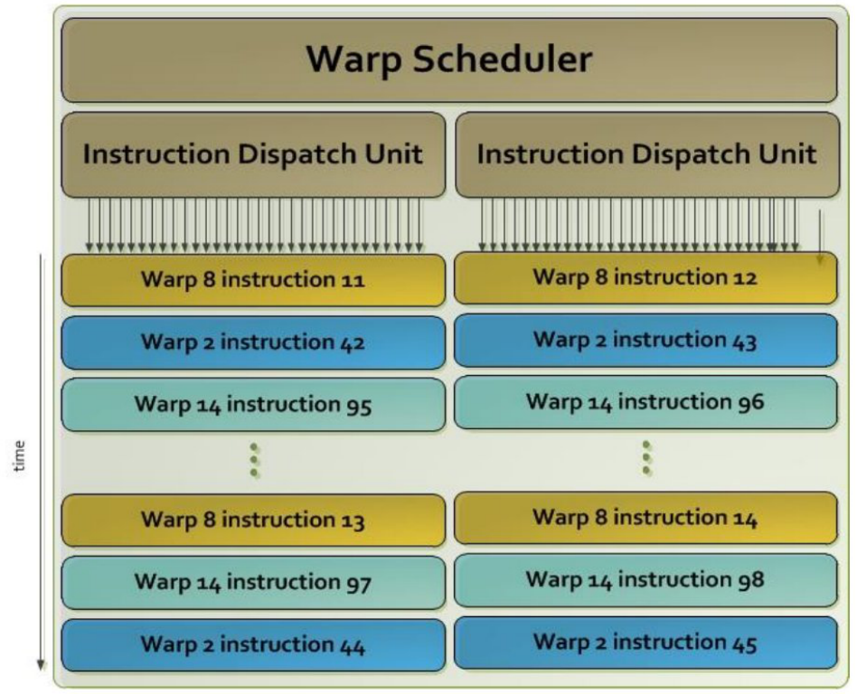

# 硬件加速器体系结构与编程

*第 1 讲：体系结构与编程模型*

> 译文说明：本文件翻译原课件的英文、法文正文，并按阅读需要合并重复展示。已去除页角装饰图、无信息的裁切碎片，以及被完整图覆盖的中间帧；保留必要的架构图、对照图和关键步骤。旧版 PDF 已归档，原文提取稿与原有图片文件均保留，可用于对照。未整理的代码片段仍可能含提取错误，不能视为已验证的可运行程序。

> 版本说明：2026-09-25 按今年更新的 96 页课件增量同步：补充新版第 38 页的 Kepler warp 调度器说明与配图，更新教师署名及页码。原文提取稿仍基于 93 页旧版；本译稿沿用已整理的共同内容。重复封面与课程总纲合并呈现，代码与公式请对照下方新版 PDF。此次同步不代表对全部技术结论或示例代码的独立核验。

**新版主封面署名：** Adrien Roussel · adrien.roussel@cea.fr

**新版 PDF：** [APM_Cours1_en.pdf](APM_Cours1_en.pdf)（96 页） · **旧版 PDF：** [2025 年归档](Archive/APM_Cours1_2025.pdf)（93 页） · **旧版原文提取稿：** [APM_Cours1.md](APM_Cours1.md)

<!-- classroom:provenance -->
> 课堂补充（2026-09-29）：按[第 1 讲课堂转录](Archive/APM_cours1_transcript.md)补入十三处讲解（首轮八处、复查五处），保留课件顺序。“课堂讲解”概括老师的解释，“补充说明／补充例子”用于澄清和展开；转录中的误识别、口头数字与临时安排未直接当作课件结论。
<!-- /classroom:provenance -->

## 引言

### 主题：加速器

- 技术现状
- 加速器体系结构
- 加速器编程
- 针对加速器的优化

### 预备知识

- 计算机体系结构基础
- 命令式编程，尤其是 C 语言
- 并行编程基础

### 课程概览

**目标：**

- 了解加速器
- 掌握 CUDA 编程

**内容：**

- 体系结构
- 编程模型
- CUDA 入门

**教师署名：**

- Adrien Roussel · adrien.roussel@cea.fr：新版主封面（第 1 页）及另一张课程总纲（第 5 页）。
- Julien Jaeger · julien.jaeger@cea.fr、Patrick Carribault · patrick.carribault@cea.fr：新版 GPU 编程封面（第 2 页）及共用课程总纲（第 4 页）。

两张课程总纲的目标和内容大体相同，在此合并；署名按原页分别记录。

**第 1 讲提纲：**

- 现有加速器概览
- NVIDIA GPU 架构：Kepler、Volta、Ampere、Grace+Hopper
- 加速器编程模型概览
- NVIDIA CUDA（第一部分）

<!-- classroom:why-cuda -->
**课堂讲解：为什么本课从 CUDA 学起？**

老师选择 CUDA，考虑的是课程能够使用的硬件、已有软件与工具，以及学生以后接触相关代码的机会。学会一套具体模型，也更容易理解其他加速器接口中的共同问题：由谁提交任务、数据放在哪里、怎样组织并行工作、什么时候可以使用结果。

老师还提醒，迁移一个维护多年的科学计算程序，需要开发、验证和人员培训。某种架构理论上更快，并不能让既有代码自动受益。先用 CUDA 把程序执行与数据流理解清楚，再学习可移植接口，更容易分辨哪些是共同概念、哪些是厂商特定细节。

**补充说明：** 这里记录课程选择的理由，不把课堂中的市场判断作为最新市场统计，也不把 CUDA 与 HIP 的相似性理解为所有代码和优化都能直接通用。

*课堂来源：[第 1 讲转录](Archive/APM_cours1_transcript.md)，第 56–116、131–140 行。以上为整理后的课堂解释；补充说明与技术核验另行标明。*
<!-- /classroom:why-cuda -->

## 加速器概览

### 加速器

### 定义

- 一种独立的计算资源，可以与主处理器位于同一芯片上，也可以位于不同芯片上；其设计目标与中央处理器不同。
**简而言之：**

- 专门面向某一类应用的处理器。
- 在其擅长的领域提供更好的性能。

### 加速器的互连

- 加速器通过互连链路连接到处理器。

**工作方式类似于外设：**

- 中央处理器控制对加速器的访问。
- 中央处理器还负责执行程序的主体部分。

**互连形式包括：**

- 片外加速器
- 片上加速器

### 连接方式

**通过系统总线：**

- Nvidia GPGPU, Intel MIC

**优点：**

- 成本低
- 易于集成
**缺点：**

- 总线具有通用性，因此性能有限
- 带宽和延迟不够理想

**通过处理器总线：**

- IBM Cell, AMD APU, ARM Grace + Nvidia Hopper

**优点：**

- 访问速度快
- 可以与 CPU 共享资源

**缺点：**

- 集成复杂
- 依赖具体处理器

<!-- classroom:offload-cost -->
**课堂讲解：什么时候值得把计算交给 GPU？**

老师用“任务只有很少几个线程”的提问提醒大家：GPU 计算部分很快，并不保证整个任务更快。对于本课采用的独立显存、显式传输流程，需要把输入送过去、启动 kernel、完成计算，再把需要的结果取回来。任务太小时，这些准备与传输可能比计算本身更耗时。

**补充说明：** 可以用下面的简单模型理解一次卸载的成本；这是便于分析的示意式，未考虑传输与计算重叠：

$$
T_{\text{GPU 整体}} \approx T_{\text{准备}} + T_{\text{传入}} + T_{\text{启动}} + T_{\text{计算}} + T_{\text{传出}}.
$$

应当把它与 CPU 完成同一任务的总时间比较。若输入已经在 GPU 上，或多个 kernel 连续使用同一批数据，就不一定要在每次计算前后重新传输。读互连参数时，带宽帮助判断搬运大量数据的成本，延迟帮助理解一次交互的起步成本。

因此，老师所说“问题太小就不划算”是一种性能判断思路，没有“少于 32 个元素就绝对不能用 GPU”的固定门槛。

*课堂来源：[第 1 讲转录](Archive/APM_cours1_transcript.md)，第 161–203、578–594 行。以上为整理后的讲解；标为“补充说明”的内容用于澄清口语或展开例子。*
<!-- /classroom:offload-cost -->

### 加速器体系结构

### 微架构

- 由待运行应用的多样性和目标领域决定。
- 相比 CPU，简化了部分机制
- 例如乱序执行、分支预测等。

**利用的并行性：**

- 通常是细粒度并行。
- 多数加速器采用某种单指令多数据（SIMD）形式。
**但需要注意：**

- 很大一部分工作需要由软件栈和开发者承担。

<!-- classroom:software-responsibility -->
**课堂讲解：为什么理解架构会影响程序性能？**

老师把 GPU 概括为“许多较简单的计算单元”，重点是说明它依赖大量可并行的工作。程序员需要把问题拆成足够多的任务，并安排这些任务访问的数据，才能利用这些资源。照搬 CPU 程序的组织方式，即使结果正确，也可能让许多计算资源空闲。

课堂反复使用矩阵乘法作为例子：先写出能算对的版本，再逐步改进线程与数据的组织。每一步都要知道改变了什么、为什么能减少开销，而不能只凭核心数量推断程序速度。

**补充说明：** 不要把“CUDA 核心”当成与一个完整 CPU 核心一一等价的单位，也不要把“较简单”理解成 GPU 没有复杂的控制逻辑。这里需要记住的是：并行任务数量、数据访问方式和硬件资源之间要匹配。

*课堂来源：[第 1 讲转录](Archive/APM_cours1_transcript.md)，第 203–239 行。以上为整理后的讲解；标为“补充说明”的内容用于澄清口语或展开例子。*
<!-- /classroom:software-responsibility -->

### 加速器体系结构

### 存储层次

- 由软件控制的存储器，如暂存存储器（scratchpad memory）。
- 由硬件管理的缓存，与通用 CPU 类似。
- 不同计算处理器之间的硬件互连。
- 加速器与全局内存之间具有较高带宽。

### 小结

- 为高性能计算提供了有吸引力的选择。
- 但许多方面需要手动管理。
- 这会直接影响加速器的编程方式。

### 加速器编程

- 可以把加速器看作负责执行任务的外设。
- 主处理器控制对专用计算资源的访问：
- 主处理器（CPU）：主机（host）
- 加速器：设备（device）

**基本概念：**

- 数据传输
- 使用不同的语言执行卸载到设备的代码
- 手动管理执行过程
- 查询加速器状态
- 将数据取回主机

<!-- classroom:completion -->
**课堂讲解：CPU 发出命令以后，怎样知道 GPU 做完了？**

老师把这一点与非阻塞 MPI 操作作类比：提交一个操作以后，还需要知道它什么时候完成，才能安全地使用结果。CPU 可以负责准备数据、安排 GPU 工作，并在适当的时候处理结果。

**补充说明：** 对异步 kernel 启动而言，主机端调用返回，不表示设备上的计算已经结束。可以先做与结果无关的工作；到必须读取结果或复用相关资源时，再通过适当的同步或完成状态检查确认依赖已经满足。

这里的“查询加速器”也不意味着必须不停地轮询，更不意味着每个 kernel 后都要等待整个设备。等待范围应当与实际依赖对应；具体的 stream、event 和同步 API 留到后续课程。参见 [NVIDIA 异步执行说明](https://docs.nvidia.com/cuda/cuda-programming-guide/02-basics/asynchronous-execution.html)。

*课堂来源：[第 1 讲转录](Archive/APM_cours1_transcript.md)，第 241–254 行。以上为整理后的课堂解释；补充说明与技术核验另行标明。*
<!-- /classroom:completion -->

### 加速器概览

### 专用加速器

- Cell (IBM)
- MIC 或 Xeon Phi（Intel）
- 图形处理器
- NVIDIA
- AMD/ATI
- 可重构架构
- FPGA

### CELL 处理器（IBM）


*图：CELL 芯片中的处理单元与互连。*

- 由 IBM、Sony 和 Toshiba 联合开发（2005 年起）。

**8 个 64 位浮点计算核心：**
- 称为协同处理单元（Synergistic Processor Element，SPE）。
- 一个能够执行两个线程的 64 位 PowerPC 主处理器。
- SPE 可以处理 128 位操作数，将其分为四个 32 位字（SIMD）。
- MIC 与 Xeon Phi（Intel）

**Intel 提出的加速器：**

- 众核集成架构（Many-Integrated Core，MIC）。

**体系结构：**

- x86 核心
- 支持超线程
- 缓存一致性
- 第一版：KNF（2010）
- 课件所列最新版本：KNL（2013）与 KNM（2017）

### KNL

### KNL 概览


*图：KNL：Tile、MCDRAM 与外部接口。*

- 芯片：36 个 Tile 通过二维 Mesh 互连；每个 Tile 包含 2 个核心、每核心 2 个 VPU，以及 1 MB L2 缓存。
- 内存：封装内集成 16 GB 高带宽 MCDRAM；DDR4 提供 6 个 2400 速率通道，容量最高 384 GB。I/O：36 条 PCIe Gen3 通道，另有 4 条 DMI 通道连接芯片组。节点：仅支持单插槽。互连：封装内集成 Intel® Omni-Path Architecture（图中未示出）。
- 向量峰值性能：双精度超过 3 TFLOPS，单精度超过 6 TFLOPS。MCDRAM 带宽约为 DDR 的 5 倍；标量性能约为 Knights Corner 的 3 倍。STREAM Triad 带宽（GB/s）：MCDRAM 超过 400，DDR 超过 90。
- 来源 Intel：这里列出的产品、计算机系统、日期和数值均为基于当时预期的初步信息，可能变更，恕不另行通知；KNL 数据也属于初步数据。¹ 与采用 Haswell 指令集的 Intel Xeon 处理器二进制兼容，TSX 除外。² 带宽数值基于将 MCDRAM 用作平坦内存时类似 STREAM 的访问模式。结果根据 Intel 内部分析估算，仅供参考；系统硬件、软件设计或配置的差异可能影响实际性能。其他名称和品牌可能属于其各自所有者。

### 图形处理器

- 显卡最初用于屏幕上的二维和三维显示：
- 配备专用图形处理器。

**很强的计算能力：**

- 针对图像渲染优化，设计目标与通用处理器不同。
- 适合处理规则的数据。

**用于科学计算：**

- GPGPU：通用 GPU 计算。

### GPGPU

**连接系统总线的显卡：**

- 通过主板上的互连连接。
- 通过 PCI Express 接口通信。

**可以连接多块显卡：**

- 多 GPU 编程。
- 用于异构超级计算机。

### NVIDIA Fermi 架构（2010）


*图：Fermi 裸片布局。*


*图：Fermi 架构示意图。*

- NVIDIA Volta 架构（2017）


*图：Volta 裸片布局。*


*图：Volta 计算单元与缓存布局。*

### ATI Cypress 架构（2009）


*图：ATI Cypress 的 SIMD Engine 与缓存。*

- 一组向量单元：SIMD Engine。
- 存储层次：L2 缓存。

**峰值性能：**

- 单精度：2.72 TFLOPS
- 双精度：0.54 TFLOPS

### ATI Radeon Navi 架构（2019）


*图：ATI Radeon Navi 架构。*

### AMD Fusion Llano 架构（2011）


*图：AMD Fusion：CPU 与 GPU 集成示意。*

- AMD/ATI 架构代号：Fusion
- APU（课件展开为 Accelerator Processing Unit）的设计

**位于同一芯片上：**

- CPU
- GPU 类型的加速器
- 第一代于 2011 年推出
- 课件将 Llano 与 Bulldozer 或 Bobcat 技术并列提及
- http://fusion.amd.com

### AMD APU Picasso 架构

### Ryzen-bridge（2019）

### AMD APU Picasso 架构

### Ryzen-bridge（2019）


*图：Picasso：标注 CPU CCX 与 GPU 区域。*

### AMD MI300 – Frontier (2023)


*图：MI300X：标注 GPU 计算区域。*


*图：MI300A：标注 CPU 与 GPU 区域。*

### Nvidia Grace+Hopper (2022)


*图：Grace+Hopper：CPU 与 GPU 位置。*

### Top500 中加速器的演变


*图：Top500：包含无加速器系统的性能份额。*


*图：Top500：加速器家族的性能份额。*

## NVIDIA 显卡体系结构

### NVIDIA GeForce 架构

### 基本组成单元

- 非常简单的计算核心。
- 一组计算核心组成一个流式多处理器。

### 为什么称为“流式”？

- 设计用于处理连续的数据流。
- 每个多核单元采用同步执行方式。

### 面向细粒度并行的设计

### NVIDIA Kepler 架构（2012）

### 15 个流式多处理器（SM）

- 垂直于共享 L2 缓存排列。

### 图例

- 绿色：计算核心；双精度单元用橙色表示。
- 橙色：调度器和分派器。
- 浅蓝色：寄存器组和 L1 缓存。


*图：Kepler：SMX 与共享 L2 缓存。*

### Kepler：流式多处理器

- 流式多处理器（SMX）。

**192 个支持 CUDA 的核心：**

- 算术逻辑单元（ALU）。
- 单精度浮点单元。
- 64 个双精度浮点单元。
- 32 个特殊函数单元（SFU）。
- 32 个加载／存储单元。


*图：Kepler SMX：调度器、计算单元与存储资源。*

### Kepler：流式多处理器

### SIMT 执行方式

- 单指令多线程（Single-Instruction Multiple Thread）。
- 与 SIMD 类似。
- 计算核心同步执行。

**每个 SMX 以 32 个线程为一组管理和执行计算线程：**

- 这一组称为 warp。
- 每个 SMX 有 4 个 warp 调度器。

<!-- classroom:warp-efficiency -->
**课堂讲解：warp 和程序中的 `if` 有什么关系？**

老师用条件分支解释 SIMT：同一 warp 的线程运行相同的 kernel，但条件可能由各自的数据决定。若部分线程满足条件、另一部分不满足，它们就可能走不同的执行路径。

**补充说明：** 以一个含 32 个线程的 warp 为例：

| 条件结果 | 如何理解 |
| --- | --- |
| 32 个线程都走同一分支 | 这个分支不会因为线程选择不同而发生 warp 内分歧 |
| 一部分走 `if`，另一部分走 `else` | 两条路径可能需要分别推进，各路径只对相应线程生效，计算资源利用率可能下降 |
| 最后一组只有部分线程对应有效数据 | 其余线程不应访问越界元素；有效工作不足以填满整个 warp |

因此要关注的是线程如何分组、分支是否一致及各路径的工作量，不能把课堂的简化说法写成“GPU 不能使用 `if`”。例如，检查 `i < N` 对保证数组访问正确仍然必要。不同架构的具体执行机制有所变化，也不能把 warp 理解成无需同步就能任意交换数据的一组线程。

**调度器数量也不等于线程容量。** 后面的 Kepler 图说明一个周期内如何选择 warp、分派指令；一个 SM 能驻留多少 warp 是另一项资源限制。转录中混杂的“182 个线程”等数字不用于计算容量。

技术校注参见 [NVIDIA SIMT 说明](https://docs.nvidia.com/cuda/cuda-programming-guide/02-basics/writing-cuda-kernels.html#basics-of-simt)及[硬件多线程说明](https://docs.nvidia.com/cuda/archive/13.0.0/cuda-c-programming-guide/index.html#hardware-multithreading)。

*课堂来源：[第 1 讲转录](Archive/APM_cours1_transcript.md)，第 542–594 行。以上为整理后的讲解；标为“补充说明”的内容用于澄清口语或展开例子。*
<!-- /classroom:warp-efficiency -->

### Kepler：warp 调度器

*对应新版 PDF 第 38 页，为本次新增内容。*

**调度器与分派单元：**

- 每个 SMX 有 4 个 warp 调度器；每个 warp 包含 32 个线程。
- 每个 SMX 有 8 个指令分派单元（Instruction Dispatch Unit），即每个 warp 调度器对应 2 个分派单元。

**四个调度器如何工作：**

1. 四个调度器各选择一个 warp，总共选择 4 个 warp。
2. 对于选中的 warp，每个周期可以调度其中两条相互独立的指令。



*图：新版 PDF 第 38 页右侧的调度示意图。图中展示一个 warp 调度器及其两个指令分派单元；时间沿向下的箭头推进，每一行是一对来自同一 warp 的指令，不同颜色代表不同 warp。*

**读图说明：** 图中的 Warp Scheduler 是 warp 调度器，Instruction Dispatch Unit 是指令分派单元。例如，第一行的 “Warp 8 instruction 11” 和 “Warp 8 instruction 12” 表示 warp 8 的第 11、12 条指令。这一行用于说明：当两条指令相互独立、满足调度条件时，可以由两个分派单元调度。后续行展示调度器选择其他 warp，以及再次选择之前的 warp。

> 理解提示：课件使用的是“可以”（may），不表示每个 warp 每周期必然执行两条指令。这里说明的是 Kepler 的结构，不能直接推广到所有 NVIDIA 架构。

### Kepler：存储层次

- 线程被调度到某个 SMX 上的计算核心。
- 通过 load 或 store 指令访问内存。

**两种情况：**

- 访问共享内存：不经过缓存。
- 访问设备全局内存：经过两级缓存。
- 从物理实现看，L1 缓存与共享内存使用同一块存储资源：
- 引入了只读缓存（48 KB）。


*图：Kepler 存储访问路径。*

<!-- classroom:memory-path -->
**课堂讲解：怎样阅读上面的存储层次图？**

老师希望大家沿着数据访问路径看图：SM 内有靠近计算单元的存储资源，多个 SM 共享更外层的 L2，显存则通过内存控制器访问。理解这些位置关系，是后面讨论数据复用和减少显存访问的基础。

**补充说明：** 这里必须区分两种机制：

- **缓存**由硬件按访问规则管理。访问全局内存时，能否命中相应缓存，会影响实际访问成本；具体路径还取决于架构和指令。
- **共享内存**是程序显式使用的存储空间。线程需要把数据写入其中，安排复用，并在协作访问时处理必要的同步。它不是一次全局内存读取会自动先去搜索的缓存。

所以，不能把图读成“每次读数据都会依次搜索共享内存、L1、L2、显存”。课件所说 L1 与共享内存使用同一块物理资源，也不表示二者具有相同的软件语义。

例如，一组线程反复使用同一批输入时，可以考虑先合作把数据放入共享内存再复用；是否值得这样做，还要比较搬运、同步和资源占用的成本。这里只建立概念，具体实现留到后续课程。

技术校注参见 [NVIDIA 共享内存说明](https://docs.nvidia.com/cuda/cuda-programming-guide/02-basics/writing-cuda-kernels.html#shared-memory)。

*课堂来源：[第 1 讲转录](Archive/APM_cours1_transcript.md)，第 599–621 行。以上为整理后的讲解；标为“补充说明”的内容用于澄清口语或展开例子。*
<!-- /classroom:memory-path -->

### NVIDIA Volta（2017）


*图：Volta 架构总览。*

- 6 个图形处理簇（GPC）。
- 每个 GPC 有 7 个纹理处理簇（TPC）。
- 每个 TPC 有 2 个 SM。
- 总计：2 × 7 × 6 = 84 个 SM！

- 5376 个单精度浮点单元（14 TFLOPS），以及同样数量的整数单元。
- 2688 个双精度浮点单元（7 TFLOPS）。
- 672 个 Tensor Core（112 TFLOPS）。
- 另有 336 个纹理单元。

<!-- classroom:managed-memory -->
**课堂讲解：自动管理数据后，传输成本还在吗？**

老师讲到架构演进时，强调了软件使用方式的变化：有些内存机制可以让系统代为管理 CPU、GPU 之间的数据可用性，减少应用显式编写复制操作的负担。

**补充说明：** 这里可以用统一内存理解其意图，但不能把它称为 CPU 与 GPU 之间多出来的一层普通缓存，也不能把“不写复制操作”推导成“没有数据移动”。实际系统可能通过迁移数据或远程访问来满足请求，具体方式取决于硬件、系统支持及访问模式。

例如，CPU 初始化数据后交给 GPU 连续使用，与 CPU、GPU 反复交替访问同一批数据，成本可能很不同。自动管理简化了接口，数据位置、局部性和同步仍然影响性能。关于功能出现在哪一代架构，转录中的口头年代不在此沿用；机制解释参见 [NVIDIA 统一内存说明](https://docs.nvidia.com/cuda/cuda-programming-guide/02-basics/understanding-memory.html)。

*课堂来源：[第 1 讲转录](Archive/APM_cours1_transcript.md)，第 623–633 行。以上为整理后的课堂解释；补充说明与技术核验另行标明。*
<!-- /classroom:managed-memory -->

### NVIDIA Ampere（2020）


*图：Ampere 架构总览。*

- 8 个图形处理簇（GPC）。
- 每个 GPC 有 8 个纹理处理簇（TPC）。
- 每个 TPC 有 2 个 SM。
- 总计：2 × 8 × 8 = 128 个 SM！

### NVIDIA Ampere：SM 内部结构

- 每个 SM 有 4 个处理分区。
- 每分区 16 个整数单元；总计 8192 个（21 TOPS）。
- 每分区 16 个单精度浮点单元；总计 8192 个（21 TFLOPS）。
- 每分区 8 个双精度浮点单元；总计 4096 个（10 TFLOPS）。
- 1 个 Tensor Core（课件标注 112 TFLOPS）。


*图：Ampere SM 内部结构。*

<!-- classroom:tensor-peak -->
**课堂讲解：为什么 Tensor Core 的数字不能直接当作程序速度？**

老师指出，SM 内有针对不同工作设计的单元。看一张 GPU 的总性能数字之前，需要知道自己的计算能不能用到对应单元。课堂中被转录成“电路时间”的段落，结合张量运算上下文，应理解为在讨论 Tensor Core。

**补充说明：** Tensor Core 用于加速矩阵乘加等特定计算，机器学习和科学计算都可能使用它。普通的向量逐元素加法，并不会因为在同一张卡上运行，就自动达到 Tensor Core 标注的峰值。实际利用这些单元还涉及运算形式、数据类型、实现或库所选择的路径。

阅读后面的 Hopper 性能表时，应分别看常规计算与 Tensor Core、不同精度对应的条目，再考虑应用本身的访存和其他开销。不要把不同精度的峰值直接相加，也不要把“没有使用 Tensor Core”量化成“一定浪费一半 GPU”：转录中的这个比例是口语夸张，不能作为通用结论。参见 [NVIDIA GPU 性能背景说明](https://docs.nvidia.com/deeplearning/performance/dl-performance-gpu-background/index.html)。

*课堂来源：[第 1 讲转录](Archive/APM_cours1_transcript.md)，第 653–687 行。以上为整理后的课堂解释；补充说明与技术核验另行标明。*
<!-- /classroom:tensor-peak -->

### NVIDIA Hopper：整体结构


*图：Hopper 架构总览。*

- 8 个图形处理簇（GPC）。
- 每个 GPC 有 9 个纹理处理簇（TPC）。
- 每个 TPC 有 2 个 SM。
- 总计：2 × 9 × 8 = 144 个 SM！

### Hopper：SM 内部结构

**4 个处理分区，每个分区包含：**

- 16 个 INT32 单元。
- 32 个单精度单元。
- 16 个双精度单元。
- 8 个加载／存储单元。
- 1 个 warp 调度器。
- 1 个指令分派单元。
- 最多 64 个活跃 warp（原文列于此处）。


*图：Hopper SM 内部结构。*

### Hopper 性能

**常规计算：**
- FP32：60 TFLOPS；FP64：30 TFLOPS。

**AI 计算（Tensor Core）：**
- FP64：60 TFLOPS；TF32：1 PFLOPS；FP16：2 PFLOPS；FP8：4 PFLOPS。

**FP32 与 TF32 的区别：**

### Grace-Hopper 超级芯片：未来的方向？

**Grace 处理器：**

- ARM Neoverse V2 架构。
- 72 个核心。

**CPU 与 GPU 位于同一裸片（die）上，以加速数据传输〔原文如此；这里需区分裸片与封装，未据此作硬件结构结论〕：**

- 2 × 450 GB/s。
- 通过内存一致性系统（C2C）提供原生统一内存。

- 注意 NUMA 效应！


*图：GH200：CPU、GPU、内存与互连接口。*

<!-- classroom:integrated-memory -->
**课堂讲解：MI300A 与 Grace＋Hopper 的区别，要从内存看**

老师在前面的 MI300A 图片和这里的 Grace＋Hopper 图片之间做了对比。重点不只是 CPU、GPU 放得多近，而是它们访问什么内存，以及软件怎样安排数据。

**补充说明（依据厂商资料校正口语）：**

| 架构 | 内存组织 | 对程序的启示 |
| --- | --- | --- |
| MI300A | CPU 与 GPU 集成在同一封装中，共享统一的 HBM3 内存 | 可以减少独立内存副本之间的数据搬运，但仍需正确安排 CPU、GPU 对数据的读写顺序 |
| Grace＋Hopper | Grace 连接 LPDDR5X，Hopper 连接 HBM，二者通过一致性的 NVLink-C2C 互连 | 可以支持统一的访问模型，但数据实际位于哪一侧，仍会影响访问成本 |

上方课件“同一裸片”的表述不宜照字面理解为一整块相同的硅片；封装、裸片和内存区域是不同层次的概念。硬件提供内存一致性，也不等于程序可以省略任务之间的同步。例如 CPU 要读取 GPU 刚生成的结果，仍需确认相应计算已经完成。

资料：[AMD MI300A 架构说明](https://instinct.docs.amd.com/projects/system-acceptance/en/latest/gpus/mi300a.html)、[NVIDIA Grace Hopper 架构说明](https://developer.nvidia.com/blog/nvidia-grace-hopper-superchip-architecture-in-depth/)。本段只澄清内存组织，不沿用转录中未经核验的机型排名或带宽单位。

*课堂来源：[第 1 讲转录](Archive/APM_cours1_transcript.md)，第 332–386、689–702 行。以上为整理后的讲解；标为“补充说明”的内容用于澄清口语或展开例子。*
<!-- /classroom:integrated-memory -->

## 加速器编程模型

### 编程模型

### 专用语言

- Close To Metal (CTM), HIP/ROCm, CUDA.
- 可移植语言：
- 底层语言：OpenCL。
- 基于指令的方式：OpenMP、OpenACC。

**高级语言／领域专用语言（DSL）：**

- Kokkos, Legion, RAJA, SYCL

<!-- classroom:portability -->
**课堂讲解：为什么有这么多编程模型？**

老师用一个维护了二十年的科学计算程序作例子：程序第一次迁移到 GPU 已经需要投入开发工作，如果下一台机器换了厂商，团队通常不希望再把整个应用重写一遍。可移植接口的价值，就是尽量降低这种重复开发的成本。

以课堂提到的 Kokkos 为例，可以把关系理解为：应用通过接口表达并行计算和数据组织，构建时选择适合目标机器的后端，再由对应工具链生成程序。更换目标机器仍可能需要重新构建、配置和调优，不是同一个二进制文件天然适用于所有 GPU。

老师还区分了两件事：**代码移植后可以编译、运行，与它在新机器上达到良好性能，是两个目标。** 即使转换工具帮助处理了 API 差异，线程组织、访存和资源使用仍可能需要调整。基于指令的方案便于逐步改造既有程序；更细致的优化则要看接口及其实现提供了哪些控制能力。

**阅读提示：** 这里保留课堂讨论的动机，不把口语中的厂商评价、标准组织历史或“只改名字就完全等价”的说法作为技术结论。

*课堂来源：[第 1 讲转录](Archive/APM_cours1_transcript.md)，第 716–774、785–804 行。以上为整理后的讲解；标为“补充说明”的内容用于澄清口语或展开例子。*
<!-- /classroom:portability -->

### ATI/AMD 编程

### Close to Metal（CTM）／CAL/IL

- 非常底层。
- 如今很少使用。

**HIP/ROCm:**

- 提供工具包，用于编写 GPU 代码，并将 CUDA 代码转换为 HIP。

**OpenCL/SYCL:**

- 支持 OpenCL 和 SYCL 标准。
- AMD/ATI 是相关联盟的成员。
- 后续课程继续介绍……

### 并行化指令

- 基于指令的编程方案：
- 在顺序代码中加入 `#pragma`（C、C++）。
- 也可能在已经并行化的代码中加入这些指令，例如 MPI、OpenMP 程序；具体取决于编程模型。

**已有方案：**

- OpenACC
- OpenMP 4+

**优点：**

- 可移植性取决于加速器支持情况。
- 可以保留原有语义，甚至顺序执行语义。

**缺点：**

- 通常还需要手动完成一部分工作。
- 有时适用范围有限。

## NVIDIA CUDA

### 你认为……

- GPU 程序中会有哪些内容？
- 包含哪些部分？
- 需要哪些步骤？

### 概览

- 两个部分：主机程序和计算内核。
- 需要在主机与设备之间传输数据。
- 计算内核使用不同的语言，因此需要专门的编译工具链。
- 与运行时库（用户空间）和驱动程序（内核空间）配合。

### 编程流程

1. 在主机上初始化：分配内存、读取输入等。
2. 在 GPU 上分配内存：需要手动管理。
3. 将数据从主机传到 GPU。
4. 执行计算内核：可以启动多个内核。
5. 将数据从 GPU 传回主机。
6. 释放 GPU 内存。
7. 释放 CPU 内存。

### 如何编译？

### 代码结构

- 主机端部分。
- 设备端部分。
- 实际上，两部分代码可以写在同一个文件中。
- 主机端编程：C 或 C++。
- 设备端编程：CUDA；课件将其描述为 C99 标准的超集。

**编译工具链：NVCC**

- 对程序员而言，使用 nvcc 编译器。
- 可以查阅 SDK 随附的文档。

<!-- classroom:host-device-compilation -->
**课堂讲解：一个源文件，为什么会生成 CPU 和 GPU 两部分程序？**

老师强调，主机代码与设备代码可以写在同一个文件里，但运行它们的是不同的计算实体。源文件放在一起，方便表达调用关系，并不意味着 CPU、GPU 执行同一套机器指令。

**补充说明：** 可以把构建和运行分成下面几个层次理解：

| 层次 | 主要作用 |
| --- | --- |
| 主机代码编译 | 生成在 CPU 上执行的控制流程、准备工作等代码 |
| 设备代码编译 | 为 GPU 上的 kernel 等设备函数生成相应代码 |
| NVCC 协调构建 | 处理主机与设备部分，调用所需工具；主机部分通常交给受支持的主机 C++ 编译器 |
| 运行时与驱动 | 程序运行时，提供内存管理、提交任务等支持，使主机能够控制设备工作 |

所以，NVCC 的编译工作与运行时提交 kernel 是不同阶段。不能把编译成功理解成计算已经在 GPU 上运行，也不能把 CUDA Runtime、用户态驱动接口和内核态驱动笼统视为同一个组件。这里先建立分工，详细调用层次留到后续课程。编译流程参见 [NVCC 官方说明](https://docs.nvidia.com/cuda/cuda-compiler-driver-nvcc/)。

*课堂来源：[第 1 讲转录](Archive/APM_cours1_transcript.md)，第 805–846 行。以上为整理后的课堂解释；补充说明与技术核验另行标明。*
<!-- /classroom:host-device-compilation -->

### 示例程序

- 示例：两个向量相加。

**基本操作：**

- c[i] = a[i] + b[i].

如何用顺序程序实现这个计算内核？

- 一个简单循环。
- 对每个元素执行基本操作。

```cpp
void vectAdd(
    double * a, double * b,
    double * c, int N) {
    int i;
    for (i=0;i<N;i++) {
    c[i] = a[i] + b[i]
    }
}
```

```cpp
void vectAdd(
    double * a, double * b,
    double * c, int N) {
    int i;
    for (i=0;i<N;i++) {
    c[i] = a[i] + b[i]
    }
}
```

- 传输数组 c
- 传输数组 a
- 传输数组 b
- 传输整数 N
- 传输数组 c
- 在 GPU 上执行（并行吗？）
- 移植我们的示例
- 传输数组 a
- 传输数组 b
- 传输整数 N
- 传输数组 c
- 在 GPU 上执行（并行吗？）


*图：向量加法移植到 GPU 时的数据传输。*

- 将数组 c 传回主机
- 传输数组 a
- 传输数组 b
- 传输整数 N

### 主机端编程

### 主机（CPU）端的管理工作

- 管理 GPU 内存。
- 传输数据。
- 发出执行内核的命令。
- CUDA 主机端 API：
- 高层／底层 CUDA API。
- `cudaMalloc`：在设备上分配内存。
- `cudaMemcpy`：向设备或主机传输数据。

<!-- classroom:vector-dataflow -->
**课堂讲解：向量加法中，哪些数据需要来回传？**

对于本例 `c[i] = a[i] + b[i]`，老师特别强调 C 是输出：需要给它分配设备端空间，但不需要先把主机端 C 的旧内容复制过去。

| 数据 | 设备端需要空间吗？ | 计算前由主机传入吗？ | 本例计算后取回吗？ |
| --- | --- | --- | --- |
| A、B | 需要 | 需要，它们提供输入值 | 不需要，主机已有原输入 |
| C | 需要 | 不需要，旧值不参与计算 | 需要，它保存输出结果 |
| N | 作为 kernel 参数使用 | 传递长度这个值 | 不需要 |

因此流程是：声明设备指针 → 分配 A、B、C 的设备空间 → 上传 A、B → 启动 kernel → 取回 C → 释放设备空间。**声明一个指针、分配它指向的空间、向空间写入数据是三个不同的动作。**

**补充说明：** 不上传 C 的前提是本例会写入所有需要的结果元素，且不读取 C 的旧值。如果运算改成 `c[i] += a[i] + b[i]`，就需要先保证设备端已有正确的 C 初值。转录中释放内存附近的“CUDA 流”是识别或翻译错误；此处对应代码中的 `cudaFree`。

按这个数据流读后面的多页代码，会比逐行记忆 API 名称更容易理解。

*课堂来源：[第 1 讲转录](Archive/APM_cours1_transcript.md)，第 848–882 行。以上为整理后的讲解；标为“补充说明”的内容用于澄清口语或展开例子。*
<!-- /classroom:vector-dataflow -->

> 校注：下面对应新版 PDF 第 64–70 页逐步展示的双栏示例。自动提取将页眉、注释和左右栏混入代码块；这些代码块仅用于对照幻灯片，不能直接编译运行。

**主机端程序：**

```cpp
void vectAdd(
    double * a, double * b, double * c,
    int N) {
    double * d_a;
    double * d_b;
    double * d_c;
    cudaMalloc((void **)&d_a,N*sizeof(double));
    cudaMalloc((void **)&d_b,N*sizeof(double));
    cudaMalloc((void **)&d_c,N*sizeof(double));
    cudaMemcpy(d_a, a, N*sizeof(double),
    cudaMemcpyHostToDevice);
    cudaMemcpy(d_b, b, N*sizeof(double),
    cudaMemcpyHostToDevice);
    vectAddKernel(d_a, d_b, d_c, N);
    cudaMemcpy(c, d_c, N*sizeof(double),
    cudaMemcpyDeviceToHost);
    cudaFree(d_a);
    cudaFree(d_b);
    cudaFree(d_c);
```

**主机端程序：**

设备指针：`d_a`、`d_b` 和 `d_c` 用于保存设备内存地址。

```cpp
void vectAdd(
    double * a, double * b, double * c,
    int N) {
    double * d_a;
    double * d_b;
    double * d_c;

    cudaMalloc((void **)&d_a,
    N*sizeof(double));
    cudaMalloc((void **)&d_b,
    N*sizeof(double));
    cudaMalloc((void **)&d_c,
    N*sizeof(double));

    cudaMemcpy(d_a, a, N*sizeof(double),
    cudaMemcpyHostToDevice);
    cudaMemcpy(d_b, b, N*sizeof(double),
    cudaMemcpyHostToDevice);

    vectAddKernel(d_a, d_b, d_c, N);

    cudaMemcpy(c, d_c, N*sizeof(double),
    cudaMemcpyDeviceToHost);

    cudaFree(d_a);
    cudaFree(d_b);
    cudaFree(d_c);
```

**主机端程序：**

在设备上分配内存。

```cpp
void vectAdd(
    double * a, double * b, double * c,
    int N) {
    double * d_a;
    double * d_b;
    double * d_c;

    cudaMalloc((void **)&d_a,
    N*sizeof(double));
    cudaMalloc((void **)&d_b,
    N*sizeof(double));
    cudaMalloc((void **)&d_c,
    N*sizeof(double));

    cudaMemcpy(d_a, a, N*sizeof(double),
    cudaMemcpyHostToDevice);
    cudaMemcpy(d_b, b, N*sizeof(double),
    cudaMemcpyHostToDevice);

    vectAddKernel(d_a, d_b, d_c, N);

    cudaMemcpy(c, d_c, N*sizeof(double),
    cudaMemcpyDeviceToHost);

    cudaFree(d_a);
    cudaFree(d_b);
    cudaFree(d_c);
```

**主机端程序：**

将数据从主机传输到设备。

```cpp
void vectAdd(
    double * a, double * b, double * c,
    int N) {
    double * d_a;
    double * d_b;
    double * d_c;

    cudaMalloc((void **)&d_a,
    N*sizeof(double));
    cudaMalloc((void **)&d_b,
    N*sizeof(double));
    cudaMalloc((void **)&d_c,
    N*sizeof(double));

    cudaMemcpy(d_a, a, N*sizeof(double),
    cudaMemcpyHostToDevice);
    cudaMemcpy(d_b, b, N*sizeof(double),
    cudaMemcpyHostToDevice);

    vectAddKernel(d_a, d_b, d_c, N);

    cudaMemcpy(c, d_c, N*sizeof(double),
    cudaMemcpyDeviceToHost);

    cudaFree(d_a);
    cudaFree(d_b);
    cudaFree(d_c);
```

**主机端程序：**

调用计算内核。

内核将在设备上执行。

```cpp
void vectAdd(
    double * a, double * b, double * c,
    int N) {
    double * d_a;
    double * d_b;
    double * d_c;

    cudaMalloc((void **)&d_a,
    N*sizeof(double));
    cudaMalloc((void **)&d_b,
    N*sizeof(double));
    cudaMalloc((void **)&d_c,
    N*sizeof(double));

    cudaMemcpy(d_a, a, N*sizeof(double),
    cudaMemcpyHostToDevice);
    cudaMemcpy(d_b, b, N*sizeof(double),
    cudaMemcpyHostToDevice);

    vectAddKernel(d_a, d_b, d_c, N);

    cudaMemcpy(c, d_c, N*sizeof(double),
    cudaMemcpyDeviceToHost);

    cudaFree(d_a);
    cudaFree(d_b);
    cudaFree(d_c);

    void vectAdd(
    double * a, double * b, double * c,
    int N) {
    double * d_a;
    double * d_b;
    double * d_c;
```

**主机端程序：**

将结果从设备传回主机。

原提取稿另有“从设备传输到 GPU”的旁注，与本页传回主机的内容不一致，需对照原页理解。

```cpp
void vectAdd(
    double * a, double * b, double * c,
    int N) {
    double * d_a;
    double * d_b;
    double * d_c;

    cudaMalloc((void **)&d_a,
    N*sizeof(double));
    cudaMalloc((void **)&d_b,
    N*sizeof(double));
    cudaMalloc((void **)&d_c,
    N*sizeof(double));

    cudaMemcpy(d_a, a, N*sizeof(double),
    cudaMemcpyHostToDevice);
    cudaMemcpy(d_b, b, N*sizeof(double),
    cudaMemcpyHostToDevice);

    vectAddKernel(d_a, d_b, d_c, N);

    cudaMemcpy(c, d_c, N*sizeof(double),
    cudaMemcpyDeviceToHost);

    cudaFree(d_a);
    cudaFree(d_b);
    cudaFree(d_c);
```

**主机端程序：**

释放在设备上分配的内存。

```cpp
void vectAdd(
    double * a, double * b, double * c,
    int N) {
    double * d_a;
    double * d_b;
    double * d_c;

    cudaMalloc((void **)&d_a,
    N*sizeof(double));
    cudaMalloc((void **)&d_b,
    N*sizeof(double));
    cudaMalloc((void **)&d_c);
    N*sizeof(double));

    cudaMemcpy(d_a, a, N*sizeof(double),
    cudaMemcpyHostToDevice);
    cudaMemcpy(d_b, b, N*sizeof(double),
    cudaMemcpyHostToDevice);

    vectAddKernel(d_a, d_b, d_c, N);

    cudaMemcpy(c, d_c, N*sizeof(double),
    cudaMemcpyDeviceToHost);

    cudaFree(d_a);
    cudaFree(d_b);
    cudaFree(d_c);
```

### 执行模型

- 接下来需要在设备上执行内核。
- 如何在设备端实现下面的代码？

$$
\text { for } (i = 0; i <   N; i + +)
$$

$$
c [ i ] = a [ i ] + b [ i ];
$$

- CUDA 模型以线程为基础。
- 调用内核时，会启动一组线程。
- 每个线程执行这个内核。
- 这与将同一个内核函数传给多次 `pthread_create` 调用有些相似。
- CUDA 编程属于多线程编程。
- 需要从单个线程的角度思考，而不是只从循环或循环迭代的角度思考。

**本例中的内核代码：**

```cpp
int i = index; /* 将 index 替换为当前线程的索引 */ c[i] = a[i] + b[i];
```

<!-- classroom:loop-to-thread -->
**课堂讲解：把 `for` 去掉之后，谁来完成那些迭代？**

老师在下课前反复解释这一点：原来由一个线程依次执行所有迭代；现在启动一组线程，让不同线程分别处理不同元素。kernel 写的是“一个线程要做什么”，索引则回答“这个线程负责哪一个元素”。

**补充例子：** 假设数组有 4 个元素，在本例的一线程一元素映射下：

| 元素 | 顺序程序 | 并行映射 |
| --- | --- | --- |
| `c[0]` | 同一线程执行第 0 次迭代 | 全局索引为 0 的线程计算 |
| `c[1]` | 同一线程执行第 1 次迭代 | 全局索引为 1 的线程计算 |
| `c[2]` | 同一线程执行第 2 次迭代 | 全局索引为 2 的线程计算 |
| `c[3]` | 同一线程执行第 3 次迭代 | 全局索引为 3 的线程计算 |

每个线程运行同一份 kernel 代码，但取得的索引不同，因而读写不同元素。这里的并行映射不保证所有线程在同一时刻执行，也不要求它们按索引顺序执行。这个向量加法例子能如此拆分，是因为不同输出元素之间没有依赖。

老师随后也回答了线程数量少于数据量的情况：**kernel 内仍然可以有循环，让一个线程负责多个元素。** 因此，“拆掉循环”是在解释当前示例的映射方式，不是 CUDA 禁止循环。线程数多于 N 时，则需要避免多出的线程访问越界元素。

接着阅读线程层次时，重点追踪两个问题：怎样为每个线程算出索引？怎样让所有需要的元素都被正确处理？转录在这个思路处结束，下面二维索引的完整推导仍以课件为来源。

*课堂来源：[第 1 讲转录](Archive/APM_cours1_transcript.md)，第 883 行至文件末尾。以上为整理后的讲解；标为“补充说明”的内容用于澄清口语或展开例子。*
<!-- /classroom:loop-to-thread -->

### 线程层次结构

- 如何得知线程的标识？
- 这与 CUDA 执行模型中的线程组织方式有关。
- CUDA 使用线程块（block）和网格（grid）对线程进行分层组织：
- 一个网格包含多个线程块。
- 一个线程块包含多个线程。
- 网格和线程块都可以是一维、二维或三维的；这是逻辑表示，不是物理排列。
- 实际如何使用？

### 线程层次结构

### 示例配置

- 网格中的线程块按二维排列。
- 6 个线程块，每个块内的线程也按二维排列。
- 网格共有 6 个线程块，每块有 12 个线程。
- 因此总共 72 个线程。
- 如何求线程索引？
- 将二维数组线性化。


*图：二维网格与线程块的组织。*

### 线程层次结构

### CUDA 在内核中定义了多个变量

- `gridDim`：各维度的线程块数量。
- `blockIdx`：当前线程块在网格三个维度上的坐标。
- `blockDim`：各维度的线程数量。
- `threadIdx`：当前线程在所属线程块三个维度上的坐标。

**这些变量使用 CUDA 特有的类型：**

- dim3

- 该类型有三个字段 `{x, y, z}`，分别表示各维度的值。

### 计算所选线程的索引

下面保留逐步演示的完整计算：先求线程块编号，再求块内线程编号，最后合成为全局编号。

本例的网格大小为 `gridDim = (3, 2)`，每个线程块的大小为 `blockDim = (4, 3)`。所选线程位于线程块 `blockIdx = (1, 0)` 内，其块内坐标为 `threadIdx = (1, 2)`。

按先 x 后 y 的顺序线性化：

| 步骤 | 计算方法 | 本例结果 |
|---|---|---:|
| 线程块的线性编号 | `blockIdx.y × gridDim.x + blockIdx.x` | `0 × 3 + 1 = 1` |
| 每个线程块的线程数 | `blockDim.x × blockDim.y` | `4 × 3 = 12` |
| 线程在块内的线性编号 | `threadIdx.y × blockDim.x + threadIdx.x` | `2 × 4 + 1 = 9` |
| 按线程块顺序排列的全局线程编号 | 线程块编号 × 每块线程数 + 块内线程编号 | `1 × 12 + 9 = 21` |


*图：所选线程在网格与线程块中的位置。*

**CUDA 编程要点：**

- 在 GPU 上声明内核，并使用 `__global__` 属性。
- 根据网格和线程块计算线程索引；示例采用一维网格和一维线程块。
- 检查线程索引是否超出数组长度，这相当于保留原循环中的边界判断。

```cpp
__global__ void vecAddKernel(
    double *a,
    double *b,
    double *c, int N) {
    int i;
    i = blockIdx.x * blockDim.x + threadIdx.x;
    if (i<N) {
    c[i] = a[i]+b[i];
    }
}
```

### 内核调用

- 如何选择内核的网格和线程块大小？
- 用户在调用内核时指定大小。
- 有多种指定方式。

最常用的内核启动语法如下：

```cpp
my_kernel<<<Dg, Db>>>(arg1, arg2, arg3);
```

- `Dg`：网格大小，即每个维度上的线程块数量，类型为 `dim3`。
- `Db`：线程块大小，即每个维度上的线程数量，类型为 `dim3`。

线程块总数是多少？

每个线程块有多少线程？

- 线程总数是多少？

### 内核调用

- 课件称 Blackwell 引入了一个新层级。〔译注：此处保留原文归属，具体架构支持需另查官方文档。〕
- 线程块簇（thread block cluster）
- 位于网格与线程块之间
- 无法直接纳入 `<<<Dg, Db>>>` 形式
- 存在兼容性问题
- 因此使用编译期内核属性
- `cluster_dims__(X,Y,Z)`〔原文如此〕
- 或者使用 `cudaLaunchKernelEx`

### 完整 CUDA 程序

> 校注：本节对应新版 PDF 第 88–96 页逐步展示的 HOST／DEVICE 双栏示例。自动提取混合了两栏与页眉，以下代码仅供查找原页，不能视为可编译的完整程序。

#### 主机端（HOST）

- void vectAdd( double * a, double * b, double * c, int N)
- double 大 adouble double 大c
- cudaMalloc((void **)&d_a, N*sizeof(double)) cudaMalloc((void **)&d_b, N*sizeof(double)); cudaMalloc((void **)&d_c, N*sizeof(double));
- a a, N* sizeof(double),cudaMemcpyHos ecudaMemcpy(d_b, N 大 *sizeof(double),cudaMemcpyHostToDevice)cudaMemCpy(d c, 大 s zeof(double),cudaMemcpyHostToDevice)
- vectAddKernel<<<32,64>>>(d_a, d_b, d_c, N);
- cudaMemcpy(c, d c, N sizeof(double), cudaMemcpyDeviceToHost);
- cudaFree(d_a); cudaFree(d_b); cudaFree(d_c);

#### 设备端（DEVICE）

- _global__ void vecAddKernel( double *a, double *b, double *c, int N)
- int i ;
- i = blockIdx.x * blockDim.x + threadIdx.x ;
- if ( i<N ) c[i] = a[i]+b[i];

### 完整 CUDA 程序

#### 主机端（HOST）

- void vectAdd( double * a, double * b, double * c, int N)
- double * d a double double
- cudaMalloc((void **)&d_a, N*sizeof(double)); cudaMalloc((void **)&d_b, N*sizeof(double)); cudaMalloc((void **)&d_c, N*sizeof(double));
- cudaMemcpy(d_a, a, N*sizeof(double), cudaMemcpyHostToDevice); cudaMemcpy(d_b, b, N*sizeof(double), cudaMemcpyHostToDevice);
- vectAddKernel<<<32,64>>>(d_a, d_b, d_c, N);
- cudaMemcpy(c, d_c, N*sizeof(double), cudaMemcpyDeviceToHost);
- cudaFree(d_a); cudaFree(d_b); cudaFree(d_c);

#### 设备端（DEVICE）

```cpp
__global__ void vecAddKernel( double *a, double *b, double *c, int N) {
    int i;

    i = blockIdx.x * blockDim.x + threadIdx.x;

    if (i<N) {
    c[i] = a[i]+b[i];
    }
}
```

### 完整 CUDA 程序

#### 主机端（HOST）

- void vectAdd( double * a, double * b, double * c, int N)

```cpp
double * d_a ;
double * d_b ;
double * d_c ;
```

```cpp
cudaMalloc((void **)&d_a, N*sizeof(double));
cudaMalloc((void **)&d_b, N*sizeof(double));
cudaMalloc((void **)&d_c, N*sizeof(double));
```

```cpp
cudaMemcpy(d_a, a, N*sizeof(double), cudaMemcpyHostToDevice);
cudaMemcpy(d_b, b, N*sizeof(double), cudaMemcpyHostToDevice);
```

```cpp
vectAddKernel<<<32,64>>>(d_a, d_b, d_c, N);
```

- cudaMemcpy(c, d_c, N*sizeof(double), cudaMemcpyDeviceToHost);

```cpp
cudaFree(d_a);
cudaFree(d_b);
cudaFree(d_c);
```

#### 设备端（DEVICE）

```cpp
__global__ void vecAddKernel( double *a, double *b, double *c, int N) {
    int i;

    i = blockIdx.x * blockDim.x + threadIdx.x;

    if (i<N) {
    c[i] = a[i]+b[i];
    }
}
```

### 完整 CUDA 程序

#### 主机端（HOST）

- void vectAdd( double * a, double * b, double * c, int N)
- double * d a double * d b double d c
- cudaMalloc((void **)&d_a, N*sizeof(double)); cudaMalloc((void **)&d_b, N*sizeof(double)); cudaMalloc((void **)&d_c, N*sizeof(double));
- cudaMemcpy(d_a, a, N*sizeof(double), cudaMemcpyHostToDevice); cudaMemcpy(d_b, b, N*sizeof(double), cudaMemcpyHostToDevice);
- vectAddKernel<<<32,64>>>(d_a, d_b, d_c, N);
- cudaMemcpy(c, d_c, N*sizeof(double), cudaMemcpyDeviceToHost);
- cudaFree(d_a); cudaFree(d_b); cudaFree(d_c);

#### 设备端（DEVICE）

```cpp
__global__ void vecAddKernel( double *a, double *b, double *c, int N) {
    int i;

    i = blockIdx.x * blockDim.x + threadIdx.x;

    if (i<N) {
    c[i] = a[i]+b[i];
    }
}
```

### 完整 CUDA 程序

#### 主机端（HOST）

- void vectAdd( double * a, double * b, double * c, int N)
- double * d a double * d b double d c
- cudaMalloc((void **)&d_a, N*sizeof(double)); cudaMalloc((void **)&d_b, N*sizeof(double)); cudaMalloc((void **)&d_c, N*sizeof(double));
- cudaMemcpy(d_a, a, N*sizeof(double), cudaMemcpyHostToDevice); cudaMemcpy(d_b, b, N*sizeof(double), cudaMemcpyHostToDevice);
- vectAddKernel<<<32,64>>>(d_a, d_b, d N)
- cudaMemcpy(c, d_c, N*sizeof(double), cudaMemcpyDeviceToHost);
- cudaFree(d_a); cudaFree(d_b); cudaFree(d_c);

#### 设备端（DEVICE）

- global _ void vecAddKernel( double *a, double *b, double *c, int N)
- int i ;
- i = blockIdx.x * blockDim.x + threadIdx.x ;
- if ( i<N ) { c[i] = a[i]+b[i];

```cpp
__global__ void vecAddKernel( double *a, double *b, double *c, int N) {
    int i;

    i = blockIdx.x * blockDim.x + threadIdx.x;

    if (i<N) {
    c[i] = a[i]+b[i];
    }
}
```

### 完整 CUDA 程序

#### 主机端（HOST）

- void vectAdd( double * a, double * b, double * c, int N)
- double * d a double * d b double d c
- cudaMalloc((void **)&d_a, N*sizeof(double)); cudaMalloc((void **)&d_b, N*sizeof(double)); cudaMalloc((void **)&d_c, N*sizeof(double));
- cudaMemcpy(d_a, a, N*sizeof(double), cudaMemcpyHostToDevice); cudaMemcpy(d_b, b, N*sizeof(double), cudaMemcpyHostToDevice);
- vectAddKernel<<<32,64>>>(d_a, d_b, d_c, N);
- cudaMemcpy(c, d_c, N*sizeof(double), cudaMemcpyDeviceToHost);
- cudaFree(d_a); cudaFree(d_b); cudaFree(d_c);

#### 设备端（DEVICE）

### 完整 CUDA 程序

#### 主机端（HOST）

- void vectAdd( double * a, double * b, double * c, int N)

```cpp
double * d_a ;
double * d_b ;
double * d_c ;
```

- cudaMalloc((void **)&d_a, N*sizeof(double)); cudaMalloc((void **)&d_b, N*sizeof(double)); cudaMalloc((void **)&d_c, N*sizeof(double));
- cudaMemcpy(d_a, a, N*sizeof(double), cudaMemcpyHostToDevice); cudaMemcpy(d_b, b, N*sizeof(double), cudaMemcpyHostToDevice);
- vectAddKernel<<<32,64>>>(d_a, d_b, d_c, N);
- cudaMemcpy(c, d_c, N*sizeof(double), cudaMemcpyDeviceToHost);
- cudaFree(d_a); cudaFree(d_b); cudaFree(d_c);

#### 设备端（DEVICE）

```cpp
__global__ void vecAddKernel( double *a, double *b, double *c, int N) {
    int i;

    i = blockIdx.x * blockDim.x + threadIdx.x;

    if (i<N) {
    c[i] = a[i]+b[i];
    }
}
```

### 完整 CUDA 程序

#### 主机端（HOST）

- void vectAdd( double * a, double * b, double * c, int N)

```cpp
double * d_a ;
double * d_b ;
double * d_c ;
```

- cudaMalloc((void **)&d_a, N*sizeof(double)); cudaMalloc((void **)&d_b, N*sizeof(double)); cudaMalloc((void **)&d_c, N*sizeof(double));
- cudaMemcpy(d_a, a, N*sizeof(double), cudaMemcpyHostToDevice); cudaMemcpy(d_b, b, N*sizeof(double), cudaMemcpyHostToDevice);
- vectAddKernel<<<32,64>>>(d_a, d_b, d_c, N);
- cudaMemcpy(c, d_c, N*sizeof(double), cudaMemcpyDeviceToHost);
- cudaFree(d_a); cudaFree(d_b); cudaFree(d_c);

#### 设备端（DEVICE）

```cpp
__global__ void vecAddKernel( double *a, double *b, double *c, int N) {
    int i;

    i = blockIdx.x * blockDim.x + threadIdx.x;

    if (i<N) {
    c[i] = a[i]+b[i];
    }
}
```

### 完整 CUDA 程序

#### 主机端（HOST）

- void vectAdd( double * a, double * b, double * c, int N)
- double * d a double * d b double d c

```cpp
cudaMalloc((void **)&d_a, N*sizeof(double));
cudaMalloc((void **)&d_b, N*sizeof(double));
cudaMalloc((void **)&d_c, N*sizeof(double));
```

- cudaMemcpy(d_a, a, N*sizeof(double), cudaMemcpyHostToDevice); cudaMemcpy(d_b, b, N*sizeof(double), cudaMemcpyHostToDevice);
- vectAddKernel<<<32,64>>>(d_a, d_b, d_c, N);
- cudaMemcpy(c, d_c, N*sizeof(double), cudaMemcpyDeviceToHost);

```cpp
cudaFree(d_a);
cudaFree(d_b);
cudaFree(d_c);
```

#### 设备端（DEVICE）

```cpp
__global__ void vecAddKernel( double *a, double *b, double *c, int N) {
    int i;

    i = blockIdx.x * blockDim.x + threadIdx.x;

    if (i<N) {
    c[i] = a[i]+b[i];
    }
}
```
