# ARCHITECTURE ET PROGRAMMATION D’ACCÉLÉRATEURS MATÉRIELS

*Lecture 2 : Advanced CUDA*

> 本文由教师 PDF 自动提取，已整理本地图片并校正部分明确的识别错误。幻灯片的逐步展示会造成内容重复；代码和公式请以同名 PDF 为准。

**Enseignant :** Adrien Roussel · adrien.roussel@cea.fr

**PDF source :** [APM_Cours2.pdf](APM_Cours2.pdf)

> Version synchronisée : PDF du 29 septembre 2026, 98 pages. Les ajouts des pages 8 et 53 ainsi que la signature rendue lisible à la page 95 sont intégrés ci-dessous.

## Overview

### Programming languages

- Keywords
- Available functions
- Examples
- Kernel optimisations
- Multi-GPUs
- CUDA programming

### Noyau de calcul

- Basé sur la norme C99
- Quelques restrictions
- Quelques ajouts

### Extensions

- Mots clés
- Variables définies par défaut
- Fonctions

### Voir l’appendice B de la documentation CUDA C Programming Guide


### Noyau de base

### Syntaxe de base pour un noyau

- Fonction qui ne renvoie rien (retour de type void)
- Attribut définissant la fonction comme s’exécutant sur le device
  - `__global__`
- Arguments en entrée

### Exemple

```cpp
__global__ void vecAddKernel( double *a,
    double *b, double *c, int N ) {
    int i ;
    i = blockIdx.x * blockDim.x + threadIdx.x ;
    if (i<N) {
    c[i] = a[i]+b[i];
    }
}
```

### Extensions – Mots clés

- Définition de nouveaux mots clés
- Catégories
- Attributs de fonctions
- Attributs de variables
- Types
- Ensemble de variables définies par défaut
- Utilisant les nouveaux types de données


### Attributs de fonction

- Mot clé à ajouter dans la déclaration et la définition de la fonction
- Ajout entre le type de retour et le nom de la fonction
- Fonction s’exécutant sur le device et appelable depuis l’hôte
  - `__global__`
- Fonction dédiée sur l’hôte ou le device (combinable)
  - `__host__`
  - `__device__`
- Par défaut, équivalent à `__host__`


### Restrictions des fonctions

### Fonction déclarée `__global__`

- Type de retour void
- Appel avec un contexte d’exécution (nombre de blocs, nombre de threads par bloc, …)
- Appel asynchrone
- Impossible de capturer son pointeur
- Fonction s’exécutant sur le device
- Pas de variable statique
- Pas de nombre d’arguments variable
- Récursion restreinte (uniquement pour les fonctions déclarées device

### Type de données

### Nouveau types

- Vecteur
- Entiers multi-dimensions
- Vecteurs
- Type de base + nombre de données
- Exemple : int2, float4
- Besoin de respecter les règles d’alignements
- Fonctions associées pour construire un tel type
- Exemple : int2 make_int2(int $\textrm { x } ,$ int y);

**Exemple ajouté — PDF, p. 8 :** [CUDA Pro Tip: Increase Performance with Vectorized Memory Access](https://developer.nvidia.com/blog/cuda-pro-tip-increase-performance-with-vectorized-memory-access/).

### Type de données (suite)

### Entiers 3 dimensions

- dim3
- Equivalent au type de vecteur uint3
- Accès aux composantes par les champs x, y et z
- Par défault, initialisé à 1
- Type de données utilisées pour les coordonnées et dimensions de la grille, des blocs et des threads CUDA.

### Exemple

```text
dim3 a ;
```

```text
a.x = 4 ;
```

## GESTION DE LA MÉMOIRE

### Hiérarchie mémoire d’un GPU:


### résumé


### Les GPUs Nvidias actuels ont une hiérarchie mémoire complexe

- Plusieurs mémoires….
- … avec des systèmes d’accès différents…
- … avec des localités d’accès différentes…
- … manipulées de façon distinctes…
- … la plupart du temps directement par l’utilisateur

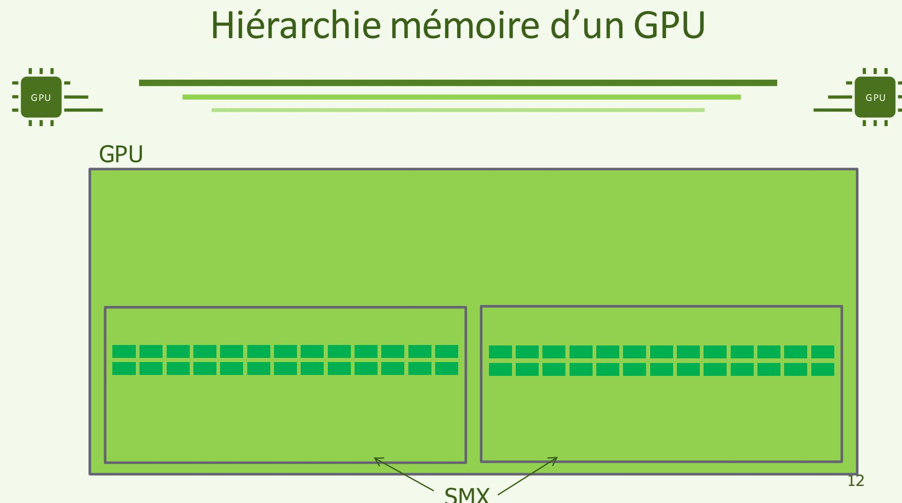

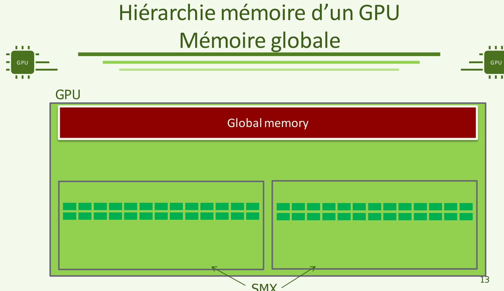

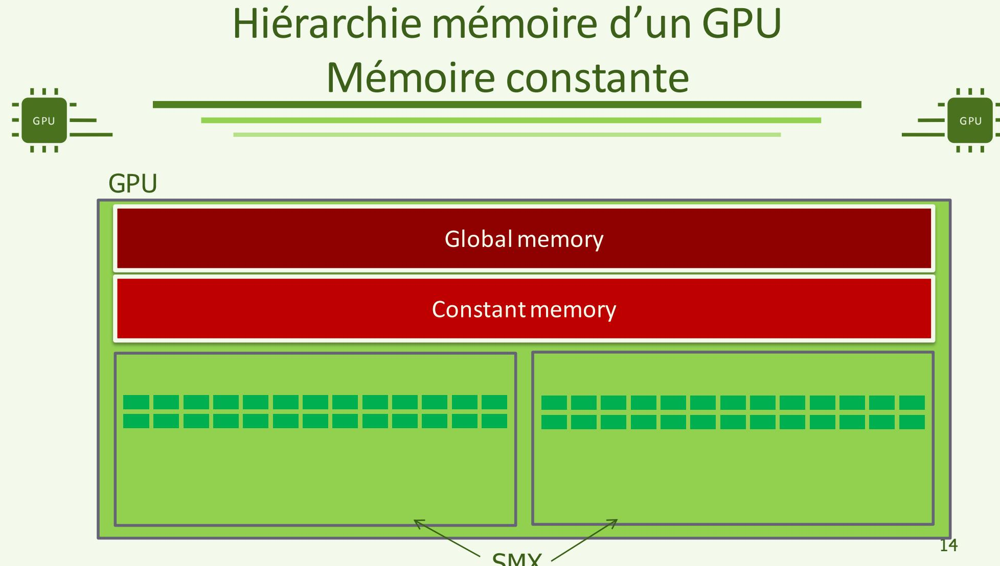


### Hiérarchie mémoire d’un GPU Mémoire de texture

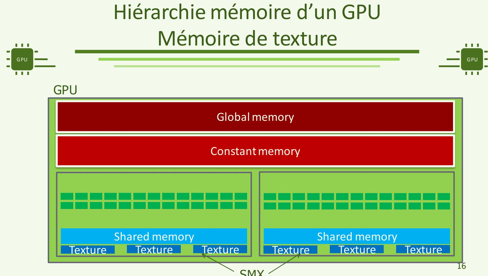

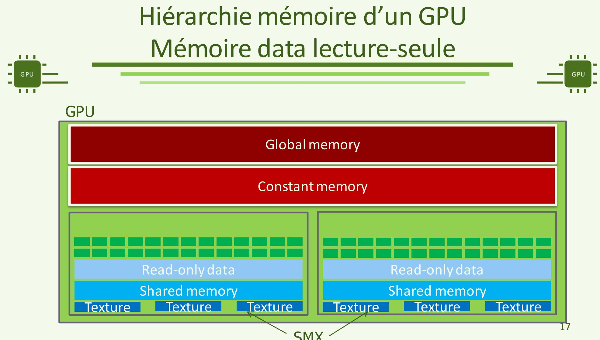

### Hiérarchie mémoire d’un GPU Ensemble de Registres

- Global memory
- Constant memory
- Register File
- Register File
- Read-only data
- Shared memory
- Read-only data
- Texture
- Texture
- Texture
- Shared memory
- Texture
- Texture
- Texture

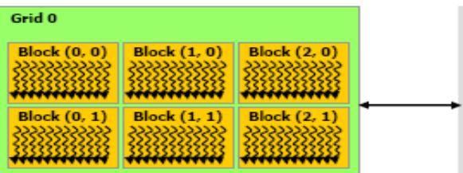


### Hiérarchie mémoire

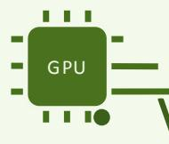

### Vision par entité de calcul

- Thread
- Accès mémoire local
- Banc de registres privé
- Bloc
- Shared memory privé
- Grille
- Mémoire globale


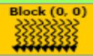

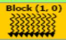

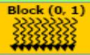

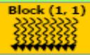

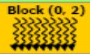

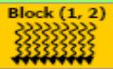

- Alloc et transfert: Global Mem.
- GPU
- cudaMalloc
- cudaMemcpy
- CPUs

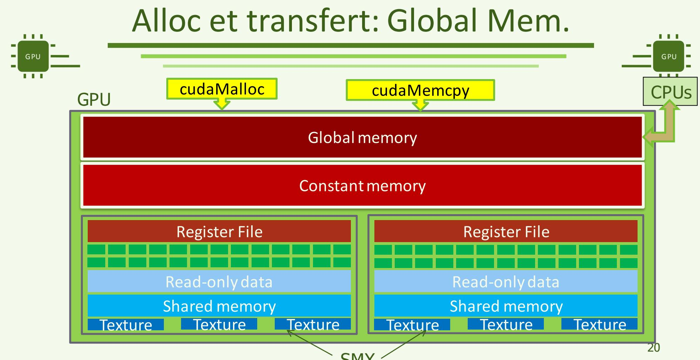

- Global memory
- Constant memory
- Register File
- Register File
- Read-only data
- Shared memory
- Read-only data
- Texture
- Texture
- Texture
- Shared memory
- Texture
- Texture
- Texture

$$
\begin{array}{c} \text { Allocation de base sur le GPU } \\ \text { GPU } \\ \text { host\_device\_cudaError\_t\_cudaMalloc (void } \\ \text { **ptr, size\_t size) } \end{array}
$$

### Allocation de base sur le GPU

- host device__ cudaError_t cudaMalloc (void ** ptr, size_t size)
- Alloue de la mémoire sur le dévice
- Alloue size octets, dans la mémoire globale du device

### Allocation de base sur le GPU

- host device__ cudaError_t cudaMalloc (void ** ptr, size_t size)
- Alloue de la mémoire sur le dévice
- Alloue size octets, dans la mémoire globale du device
- X Donne l’adresse du pointeur ptr
- Le runtime CUDA s’occupe de l’allocation et récupère l’adresse de la zone mémoire
- L’adresse est renvoyée et stockée dans ptr
- L’adresse n’est pas utilisable sur le host!!!

### Allocation de base sur le GPU

- host device__ cudaError_t cudaMalloc (void ** ptr, size_t size)
- Alloue de la mémoire sur le dévice
- Alloue size octets, dans la mémoire globale du device
- Donne l’adresse du pointeur ptr
- Le runtime CUDA s’occupe de l’allocation et récupère l’adresse de la zone mémoire
- VAV L’adresse est renvoyée et stockée dans ptr
- L’adresse n’est pas utilisable sur le host!!!

### Allocation avancée sur le GPU

- host__ cudaError_t cudaMallocPitch (void ** ptr, size_t * pitch, size_t width, size_t height)
- Alloue de la mémoire 2D sur le device
- Alloue au moins width x height

### Allocation avancée sur le GPU

- host__ cudaError_t cudaMallocPitch (void ** ptr, size_t * pitch, size_t width, size_t height)
- Alloue de la mémoire 2D sur le device
- Alloue au moins width x height
- Les allocations mémoires subissent des contraintes d’alignement
- Peut avoir un impact sur les allocations 2D et 3D
- Chaque ligne doit être correctement alignée
- Possible qu’un padding en fin de ligne soit nécessaire
- La taille réelle d’une ligne (width+padding) est renvoyée dans la variable pitch

### Allocation avancée sur le GPU


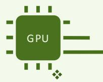

### Allocation avancée sur le GPU

### host cudaError_t cudaMalloc3D ( struct cudaPitchPtr * pitchedDevPtr,

### Struct cudaExtent extent)

- Spécifie le minimum d’octets à allouer
- La structure cudaExtent contient trois champs
- size_t depth
- size_t height
- size_t width
- Alloue au minimum depth x height x width octets


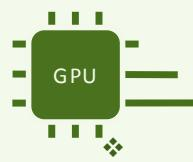

### Allocation avancée sur le GPU

- host cudaError_t cudaMalloc3D ( struct cudaPitchPtr * pitchedDevPtr,
- Récupère l’adresse de la mémoire allouée sur le device
- Plus quelques infos stockée dans la structure liées aux contraintes d’alignement
- size_t size et size_t ysize : correspondent aux champs width et height de la structure extent passée à l’allocation
- size_t pitch : la taille réelle de la zone mémoire allouée (avec le padding nécessaire dans chaque dimension)
- struct cudaExtent extent)

### Copie de base sur le GPU

- _host__ cudaError_t cudaMemcpy
- (void * dst, const void * src,
- size_t count, enum cudaMemcpyKind kind)

### Copie de base sur le GPU

- _host__ cudaError_t cudaMemcpy
- (void * dst, const void * src,
- size_t count, enum cudaMemcpyKind kind)
- Copie count octets de la mémoire pointée par src vers la mémoire pointée par dst

### Copie de base sur le GPU

- host__ cudaError_t cudaMemcpy
- (void * dst, const void * src,
- size_t count, enum cudaMemcpyKind kind)
- Copie count octets de la mémoire pointée par src vers la mémoire pointée par dst
- Kind permet de données la direction de la copie
- cudaMemcpyHostToDevice
- cudaMemcpyDeviceToHost
- cudaMemcpyHostToHost
- cudaMemcpyDeviceToDevice

### Copie de base sur le GPU

- host__ cudaError_t cudaMemcpy
- (void * dst, const void * src,
- size_t count, enum cudaMemcpyKind kind)
- Copie count octets de la mémoire pointée par src vers la mémoire pointée par dst
- Kind permet de données la direction de la copie
- cudaMemcpyHostToDevice
- cudaMemcpyDeviceToHost
- cudaMemcpyHostToHost
- cudaMemcpyDeviceToDevice
- cudaMemcpy(d_a, h_a, ( sizeof(int) * 1024), cudaMemcpyHostToDevice);

```text
Copie avancée sur le GPU
__host__ cudaError_t cudaMemcpy2D
(void * dst, size_t dpitch,
const void * src, size_t spitch,
size_t width, size_t height,
enum cudaMemcpyKind kind)
• Copie width x height octets de la mémoire pointée par src vers la mémoire pointée par dst
```

### Copie avancée sur le GPU

```c
__host__ cudaError_t cudaMemcpy2D (void * dst, size_t dpitch, const void * src, size_t spitch, size_t width, size_t height, enum cudaMemcpyKind kind)
```

- Copie width x height octets de la mémoire pointée par src vers la mémoire pointée par dst
- Permet de spécifier le padding pour les deux zones mémoires, source et destination
- Compatible avec les zones mémoires allouées avec cudaMallocPitch

### Copie avancée sur le GPU

```c
__host__ cudaError_t cudaMemcpy2D (void * dst, size_t dpitch, const void * src, size_t spitch, size_t width, size_t height, enum cudaMemcpyKind kind)
```

- Copie width x height octets de la mémoire pointée par src vers la mémoire pointée par dst
- Permet de spécifier le padding pour les deux zones mémoires, source et destination
- Compatible avec les zones mémoires allouées avec cudaMallocPitch
- cudaMemcpy2D(d_a, pitch, h_a, ( sizeof(int) * 64), ( sizeof(int) * 64), 16, cudaMemcpyostToDevice);

$$
\begin{array}{c} \text {Copie avancée sur le GPU} \\ \hline \text {GPU} \\ \hline \text {\_host\_cudaError\_t cudaMemcpy3D (const struct} \\ \text {\_cudaMemcpy3DParms * p)} \end{array}
$$

### Copie avancée sur le GPU

- host__ cudaError_t cudaMemcpy3D (const struct cudaMemcpy3DParms * p)
- struct cudaArray *srcArray;
- struct cudaPos srcPos
- (size_t x, size_t y, size_t z)
- struct cudaPitchedPtr srcPtr;
- struct cudaArray *dstArray;
- X struct cudaPos dstPos;
- struct cudaPitchedPtr dstPtr;
- struct cudaExtent extent;
- enum cudaMemcpyKind kind;

### Exemple code 2D

```c
__global__ void plus_one(int * a, int size, size_t pitch)
{
    int y = blockIdx.x;
    int x = threadIdx.x;
    int rp = (int)(pitch / sizeof(int));

    int test = blockIdx.x * blockDim.x + threadIdx.x;

    if (test < size)
    {
    a[y * rp + x] += 1;
    }
}

int main (int argc, char * argv[])
{
    int * h_a = NULL;
    h_a = (Int *)malloc(sizeof(int) * 1024);

    int i;
    for (i = 0; i < 1024; i++)
    {
    h_a[i] = 10;
    }

    int * d_a = NULL;
    size_t pitch;
    cudaMallocPitch(&d_a, &pitch, (sizeof(int) * 64), 16);

    cudaMemcpy2D(d_a, pitch, h_a, (sizeof(int) * 64), (sizeof(int) * 64), 16, cudaMemcpyHostToDevice);

    plus_one<<<16, 64>>>(d_a, 1024, pitch);

    cudaMemcpy2D(h_a, (sizeof(int) * 64), d_a, pitch, (sizeof(int) * 64), 16, cudaMemcpyDeviceToHost);

    for (i = 0; i < 1024; i++)
    {
    printf("%d]", h_a[i]);
    }
    printf("\n");

    return 0;
```

### Autres fonctions avancées

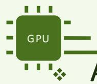

### Allocation

- cudaMallocArray
- cudaMalloc3DArray

### Copie

- cudaMemcpyToArray
- cudaMemcpy2DToArray
- cudaMemcpyFromArray
- cudaMemcpy2DFromArray
- cudaMemcpyArrayToArray
- cudaMemcpy2DArrayToArray

### Gestion automatique de la mémoire (mémoire unifiée)

### Introduit avec CUDA 6.0

- Vue unifiée de la mémoire entre host et devices
- Un seul pointeur est utilisée pour la mémoire sur le host ou sur le(s) GPU(s)
- Les transferts sont réalisés automatiquement en fonction de l’utilisation des données sur le host ou sur un device


### Gestion automatique de la mémoire (mémoire unifiée)

### Deux façons pour demander de la mémoire gérée automatiquement

- host__ cudaMallocManaged( void** devPtr, size_t size, unsigned int flags)
- cudaMemAttachGlobal
- Memory can be accessed from any devices
- cudaMemAttachHost
- Memory cannot be accessed from any devices
- managed__ attribut devant le nom des variables

### Mémoire unifiée: Exemple

- cudaMallocManaged
- Default flag: cudaMemAttachGlobal

```c
__global__ void AplusB(int *ret, int a, int b) {
    ret[threadIdx.x] = a + b + threadIdx.x;
}

int main() {
    int *ret;
    cudaMallocManaged(&ret, 1000 * sizeof(int));
    AplusB<< 1, 1000 >>>(ret, 10, 100);
}
```

- Attribut managed
- device managed int ret[1000]; global void AplusB(int a, int b){ ret[threadIdx.x] = a + b + threadIdx.x;
- int main() { ÀplùsB<<< 1, 1000 >>>(10, 100); cudaDeviceSynchronize() ;

### Gestion automatique de la mémoire (mémoire unifiée)

- Introduit avec CUDA 6.0
- Vue unifiée de la mémoire entre host et devices
- Un seul pointeur est utilisée pour la mémoire sur le host ou sur le(s) GPU(s)
- Les transferts sont réalisés automatiquement en fonction de l’utilisation des données sur le host ou sur un device

### Gestion automatique de la mémoire (mémoire

- Introduit avec CUDA 6.0
- Vue unifiée de la mémoire entre host et devices
- Un seul pointeur est utilisée pour la mémoire sur le host ou sur le(s) GPU(s)
- Les transferts sont réalisés automatiquement en fonction de l’utilisation des données sur le host ou sur un device
- /!\ Attention aux problèmes de performances en cas de pingpong CPU-GPU

```c
cudaMallocManaged(&a, 100000*sizeof(int));
for(i=0; i<100000; i++) a[i] = i;
gettimeofday(&start1, NULL);
for(j=0; j<2000; j++)
{
    kernel<<<100,1000>>>(a);
    cudaDeviceSynchronize();
    function(a);
}
gettimeofday(&stop1, NULL);

gettimeofday(&start2, NULL);
for(j=0; j<2000; j++)
{
    kernel<<<100,1000>>(a);
    cudaDeviceSynchronize();
}
for(j=0; j<2000; j++)
{
    function(a);
}
gettimeofday(&stop2, NULL);
```

- Mémoire unifiée Perf issue example

### Exemple:

- Réalise 2000 fois l’invocation de kernel et function pour update le meme tableau _host__ void function(int * a)
- int i; for(i=0; i< 100000; i++)
- Mémoire unifiée Perf issue example

**Exemple:**

- Réalise 2000 fois l’invocation de kernel et function pour update le meme tableau
- Ping-pong: 2000 fois kernel + function
- _host__ void function(int * a)

```text
int i;
for(i=0; i< 100000; i++)
```

```c
cudaMallocManaged(&a, 100000*sizeof(int));
for(i=0; i<100000; i++) a[i] = i;

gettimeofday(&start1, NULL);
for(j=0; j<2000; j++)
{
    kernel<<<100,1000>>>(a);
    cudaDeviceSynchronize();
    function(a);
}
gettimeofday(&stop1, NULL);

gettimeofday(&start2, NULL);
for(j=0; j<2000; j++)
{
    kernel<<<100,1000>>(a);
    cudaDeviceSynchronize();
}
for(j=0; j<2000; j++)
{
    function(a);
}
gettimeofday(&stop2, NULL);
```

### Mémoire unifiée Perf issue example

### Exemple:

- Réalise 2000 fois l’invocation de kernel et function pour update le meme tableau
- Ping-pong: 2000 fois kernel + function
- Grouped : 2000 fois kernel puis 2000 fois function
- Temps mesurés:
- _host__ void function(int * a)
- int i; for(i=0; i< 100000; i++)

```c
cudaMallocManaged(&a, 100000*sizeof(int));
for(i=0; i<100000; i++) a[i] = i;

gettimeofday(&start1, NULL);
for(j=0; j<2000; j++)
{
    kernel<<<100,1000>>>(a);
    cudaDeviceSynchronize();
    function(a);
}
gettimeofday(&stop1, NULL);

gettimeofday(&start2, NULL);
for(j=0; j<2000; j++)
{
    kernel<<<100,1000>>(a);
    cudaDeviceSynchronize();
}
for(j=0; j<2000; j++)
{
    function(a);
}
gettimeofday(&stop2, NULL);
```

```c
cudaMallocManaged(&a, 100000*sizeof(int));
for(i=0; i<100000; i++) a[i] = i;
gettimeofday(&start1, NULL);
for(j=0; j<2000; j++)
{
    kernel<<<100,1000>>>(a);
    cudaDeviceSynchronize();
    function(a);
}
gettimeofday(&stop1, NULL);

gettimeofday(&start2, NULL);
for(j=0; j<2000; j++)
{
    kernel<<<100,1000>>(a);
    cudaDeviceSynchronize();
}
for(j=0; j<2000; j++)
{
    function(a);
}
```

### Mémoire unifiée Perf issue example

### Exemple:

- Réalise 2000 fois l’invocation de kernel et function pour update le meme tableau
- Ping-pong: 2000 fois kernel + function
- Grouped : 2000 fois kernel puis 2000 fois function
- Temps mesurés:
- _global__ void kernel(int * a)
- _host__ void function(int * a)
- int i; for(i=0; i< 100000; i++)
- a[i]++;


### Accès mémoire

- Exécution synchrone dans un warp
- Un thread exécutant un chargement mémoire ralenti les autres
- Plusieurs accès mémoire simultanées peuvent être sérialisés
- Plus l’accès est long, plus il nous faudra de threads pour recouvrir cet accès
- Optimisations possibles
- Load coalescing
- Eviter les conflits de bancs


### Load coalescing

- Accès à la mémoire globale
- Accès concurrent émis par les threads d’un même warp
- Tous les threads d’un même warp exécute la même instruction au même instant
- Les requêtes sont sérialisés par paquets de 128 octets (taille de la ligne de cache)
- Optimisation si ces accès sont contigus !

### Load coalescing — Numérotation des threads dans un warp

*Ajout du PDF 2026, p. 53.*

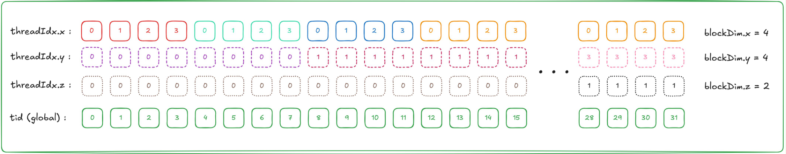

- Un warp est un groupe de 32 threads.
- Plusieurs « warp schedulers » par SM.
  - Un warp scheduler est capable d’exécuter jusqu’à 2 instructions simultanément.
- Le warp scheduler peut charger jusqu’à 128 B en une seule transaction.
  - Si tous les threads du warp accèdent à des données contiguës, les accès seront coalescés, c’est-à-dire que le nombre de chargements mémoire sera réduit.
  - Sinon, le warp scheduler fera autant de chargements par paquet de 32 B que nécessaire.

> Note de lecture : les indications « 2 instructions », « 128 B » et « 32 B » reproduisent les formulations de la diapositive ; leur portée dépend de l’architecture et du type d’accès. Dans ce schéma, la ligne « tid (global) » représente la numérotation linéaire dans le bloc illustré, sans terme `blockIdx`.

### Load coalescing et mémoire shared

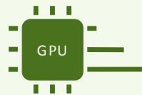

- Utilisation de la mémoire shared


- Nécessite de déclarer des buffers résidant dans la mémoire shared
- Transferts des données en début de noyau
- Mise à jour de la mémoire globale à la fin du noyau
- Optimisation : profiter de ce premier transferts (global  shared) pour faire des accès contigus aux données
- Même si toutes les données ne sont pas nécessaires !
- Attention aux conflits de bancs


### Attributs de variables (1)

### Variable résidente sur le device

- device
- Par défault dans la mémoire globale, accessible par tous les threads, pendant toute la durée de l’application
- Variable résidente dans la mémoire constante
- constant
- Durée de vie de l’application
- Ne peut pas être défini sur le device

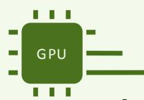

### Attributs de variables (2)

### Variable dans la mémoire shared

- shared
- Partagée entre tous les threads d’un même bloc
- Une copie par bloc
- Durée de vie du bloc

### Par défaut une variable déclarée sur le device est stockée dans un registre

### Variable volatile

- Synchronisation des données communes accédées de façon concurrente
- Exemple d’accès concurrents

```cpp
// myArray is an array of non-zero integers
// located in global or shared memory
__global__ void MyKernel(int* result) {
    int tid = threadIdx.x;
    int ref1 = myArray[tid] * 1;
    myArray[tid + 1] = 2;
    int ref2 = myArray[tid] * 1;
    result[tid] = ref1 * ref2;
}
```

- Que vaut result[tid] ?

```text
✿ myArray[tid] est dans un registre, donc ref1==ref2
```

- Par contre, si déclaré volatile, alors ok (ou alors mettre une barrière mémoire - memory fence)
- Mais cela ne garantie pas l’ordre d’exécution

### Restrictions des variables

- Gestion dynamique des variables shared

```c
extern __shared__ char array[];
__device__ void func() {
    short* array0 = (short*)array;
    float* array1 = (float*)&array[128];
    int* array2 = (int*)&array[64];
}
```

- Besoin de gérer à la main l’allocation des données si on décide d’utiliser la mémoire shared de façon dynamique Respect des règles d’alignements

### Allocation de registres


- Chaque noyau de calcul a besoin d’utiliser plusieurs registres
- En fonction des instructions présentes dans le noyau VA Transformations/optimisations du compilateur
- X Allocation de registres
- Mais
- Le nombre de registres est limité
- Les registres sont partagés entre les threads s’exécutant sur un même Streaming Multiprocessor
- Relation avec le nombre de threads ?


### Allocation de registres

- Option pour définir une borne au compilateur
- maxrregcount=N
- Attribut pour donner une indication sur le nombre maximum de threads et de blocs

```text
__global__ void
    _launch bounds (maxThreadsPerBlock,
    _minBlocksPerMultiprocessor)
MyKernel(...)
{
    ...
}
```

## ASYNCHRONISME

### Exécution asynchrone en CUDA

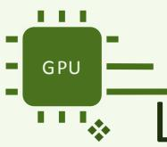

### Les kernels CUDA sont asynchrones


- Au retour de l’invocation d’un kernel, celui-ci n’a pas forcément déjà été exécuté
- Lors de l’invocation de kernel, celui-ci n’est pas lancé immédiatement
- C’est comme si on avait donné « l’ordre » au GPU d’exécuter le kernel
- Le kernel peut être exécuté plus tard
- Pour s’assurer de l’exécution du kernel, il faut synchroniser le device

### Synchronisation globale

- host device cudaDeviceSynchronize();
- Attend que les opérations sur le device soient terminées
- Si appelée depuis le host, alors synchronise le host et le device
- En fonction du flag de synchronisation mis en place pour ce device


### Copie asynchrone


- Possibilité de faire des copies asynchrone
- Y host cudaMemcpyAsync
- host cudaMemcpyPitchAsync
- host cudaMemcpy3DAsync
- Permet d’éviter les synchronisations host / device pour les copies de données

### Copie asynchrone

- Possibilité de faire des copies asynchrone
- host cudaMemcpyAsync
- host cudaMemcpyPitchAsync
- host cudaMemcpy3DAsync
- Permet d’éviter les synchronisations host / device pour les copies de données
- /!\ Nécessaire de synchroniser la copie device -> host avant d’afficher/utiliser le host buffer
- cudaMemcpyAsync(h_a, d_a, ( sizeof(int) * 1024), cudaMemcpyDeviceToHost);cudaDeviceSynchronize(日
- for(i=0; i<1024; i++)
- printf("[%d]", h_a[i]);

### Asynchronisme

- Par défault certaines fonctions rendent la main au programme hôte
- Exécution de kernel
- Copies device vers device
- Initialisation de la mémoire
- Possibilité d’attendre la fin de l’exécution à un instant donné cudaDeviceSynchronize();
- Appels consécutifs à notre noyau vecAdd
- Si les vecteurs sont différents ?
- S’il existe une dépendance RAW dans notre calcul ?


### Asynchronisme

- Pas besoin de synchronisation globale en cas de dépendances entre des kernels appelés consécutivement
- Même si la main est rendue à l’hôte, la sémantique reste séquentielle
- Les noyaux de calcul sont exécutés dans l’ordre
- La gestion des dépendances est implicites

### Asynchronisme

- cudaMemcpyAsync(d_a, h_a, (sizeof(int)* (1024)), cudaMemcpyHostToDevice);
- kernel1<<<16, 64>>>(d_a, size); kernel2<<<32, 32>>>(d_a, size); kernel3<<<64, 16>>>(d_a, size);
- cudaMemcpyAsync(h_a, d_a, (sizeof(int) * (1024)), cudaMemcpyDeviceToHost) ;
- cudaDeviceSynchronize();
- kernel4<<<8, 128>>>(d_a, size);

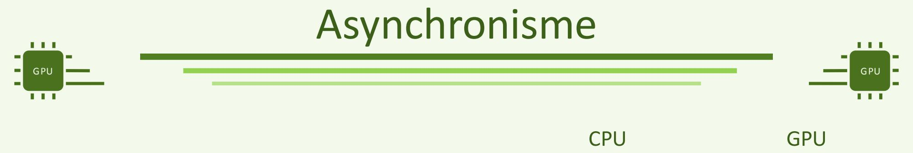

### Asynchronisme

- cudaMemcpyAsync(d_a, h_a, (sizeof(int) * (1024)), cudaMemcpyHostToDevice);
- kernel1<<<16, 64>>>(d a, size); kernel2<<<32, 32>>>(d_a, size); kernel3<<<64, 16>>>(d_a, size);
- cudaMemcpyAsync(h_a, d_a, (sizeof(int) * (1024)), cudaMemcpyDeviceToHost);
- cudaDeviceSynchronize();
- kernel4<<<8, 128>>>(d_a, size);

### Asynchronisme

- cudaMemcpyAsync(d_a, h_a, (sizeof(int) * (1024)), cudaMemcpyHostToDevice);
- kernel1<<<16, 64>>>(d_a, size); kernel2<<<32, 32>>>(d_a, size); kernel3<<<64, 16>>>(d a, size);
- cudaMemcpyAsync(h_a, d_a, (sizeof(int) * (1024)), cudaMemcpyDeviceToHost);
- cudaDeviceSynchronize();
- kernel4<<<8, 128>>>(d_a, size);
- CPU
- GPU
- Cpy H->D

### Asynchronisme

- cudaMemcpyAsync(d_a, h_a, (sizeof(int) * (1024)), cudaMemcpyHostToDevice) ;
- kernel1<<<16, 64>>>(d_a, size); kernel2<<<32, 32>>>(d_a, size); kernel3<<<64, 16>>>(d_a, size);
- cudaMemcpyAsync(h_a, d_a, (sizeof(int) * (1024)), cudaMemcpyDeviceToHost) ;
- cudaDeviceSynchronize();
- kernel4<<<8, 128>>>(d_a, size);
- CPU
- GPU
- Cpy H->D

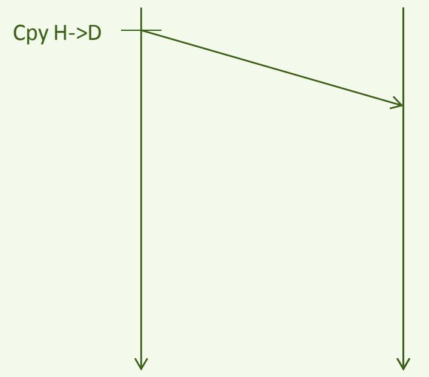

### Asynchronisme

- cudaMemcpyAsync(d_a, h_a, (sizeof(int) * (1024)), cudaMemcpyHostToDevice);
- kernel1<<<16, 64>>>(d_a, size); kernel2<<<32, 32>>>(d_a, size); kernel3<<<64, 16>>>(d_a, size);
- cudaMemcpyAsync(h_a, d_a, (sizeof(int) * (1024)), cudaMemcpyDeviceToHost);
- cudaDeviceSynchronize();
- kernel4<<<8, 128>>>(d_a, size);
- CPU
- GPU
- Cpy H->D

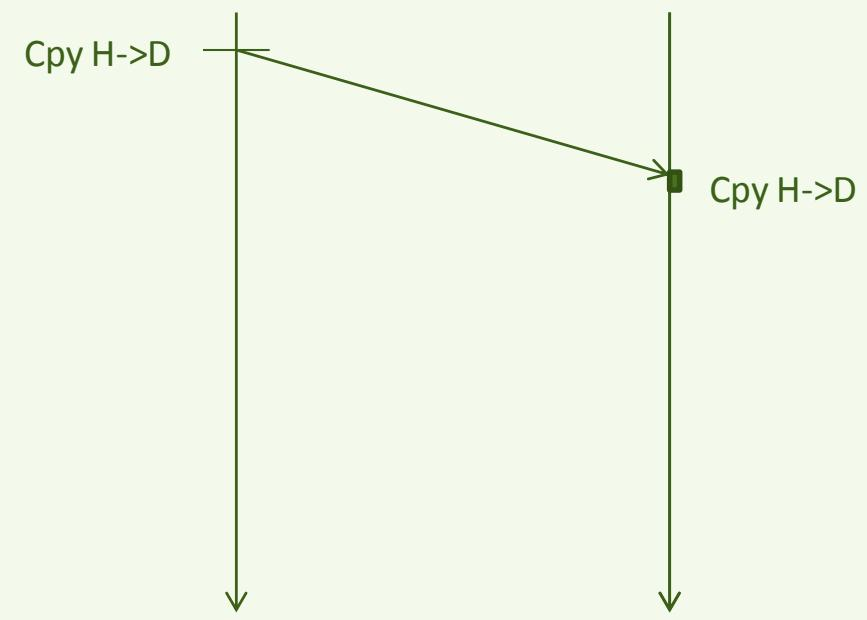

- Cpy H->D

### Asynchronisme

- cudaMemcpyAsync(d_a, h_a, (sizeof(int)* (1024)), cudaMemcpyHostToDevice);
- kernel1<<<16, 64>>>(d a, size); kernel2<<<32, 32>>>(d_a, size); kernel3<<<64, 16>>>(d a, size);
- cudaMemcpyAsync(h_a, d_a, (sizeof(int) * (1024)), cudaMemcpyDeviceToHost);
- cudaDeviceSynchronize();
- kernel4<<<8, 128>>>(d_a, size);
- CPU
- GPU
- Cpy H->D kernel1

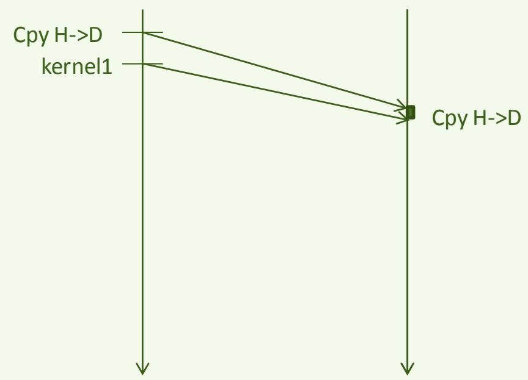

### Asynchronisme

- cudaMemcpyAsync(d_a, h_a, (sizeof(int) * (1024)), cudaMemcpyHostToDevice);
- kernel1<<<16, 64>>>(d a, size); kernel2<<<32, 32>>>(d_a, size); kernel3<<<64, 16>>>(d a, size);
- cudaMemcpyAsync(h_a, d_a, (sizeof(int) * (1024)), cudaMemcpyDeviceToHost);
- cudaDeviceSynchronize();
- kernel4<<<8, 128>>>(d_a, size);
- CPU
- GPU
- Cpy H->D kernel1

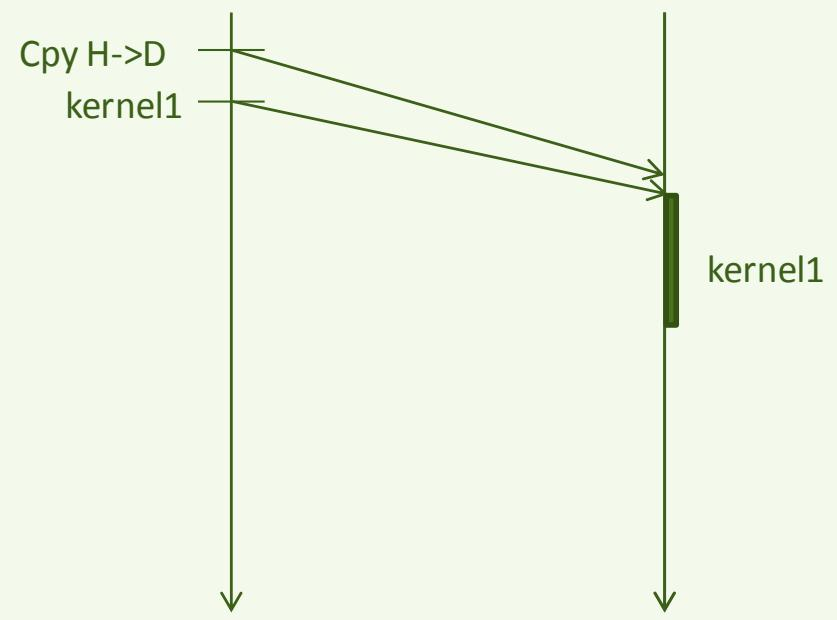

- kernel1

### Asynchronisme

- cudaMemcpyAsync(d_a, h_a, (sizeof(int)* (1024)), cudaMemcpyHostToDevice);
- kernel1<<<16, 64>>>(d a, size); kernel2<<<32, 32>>>(d_a, size) ; kernel3<<<64, 16>>>(d_a, size);
- cudaMemcpyAsync(h_a, d_a, (sizeof(int) * (1024)), cudaMemcpyDeviceToHost);
- cudaDeviceSynchronize();
- kernel4<<<8, 128>>>(d_a, size);

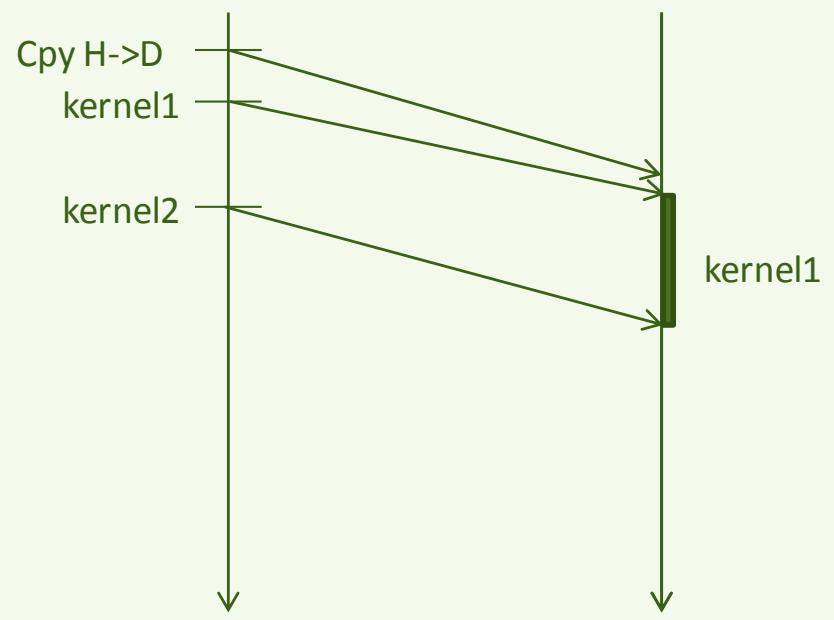

### Asynchronisme

- cudaMemcpyAsync(d_a, h_a, (sizeof(int) * (1024)), cudaMemcpyHostToDevice);
- kernel1<<<16, 64>>>(d a, size); kernel2<<<32, 32>>>(d_a, size) ; kernel3<<<64, 16>>>(d_a, size);
- cudaMemcpyAsync(h_a, d_a, (sizeof(int) * (1024)), cudaMemcpyDeviceToHost) ;
- cudaDeviceSynchronize();
- kernel4<<<8, 128>>>(d_a, size);

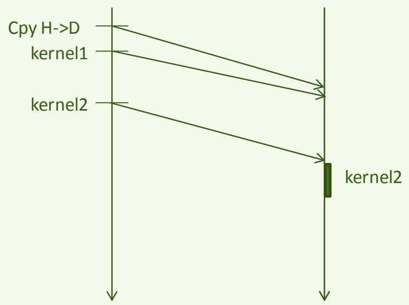

### Asynchronisme

- cudaMemcpyAsync(d_a, h_a, (sizeof(int)* (1024)), cudaMemcpyHostToDevice);
- kernel1<<<16, 64>>>(d_a, size); kernel2<<<32, 32>>>(d a, size); kernel3<<<64, 16>>>(d_a, size);
- cudaMemcpyAsync(h_a, d_a, (sizeof(int)* (1024)), cudaMemcpyDeviceToHost);
- cudaDeviceSynchronize();
- kernel4<<<8, 128>>>(d_a, size);

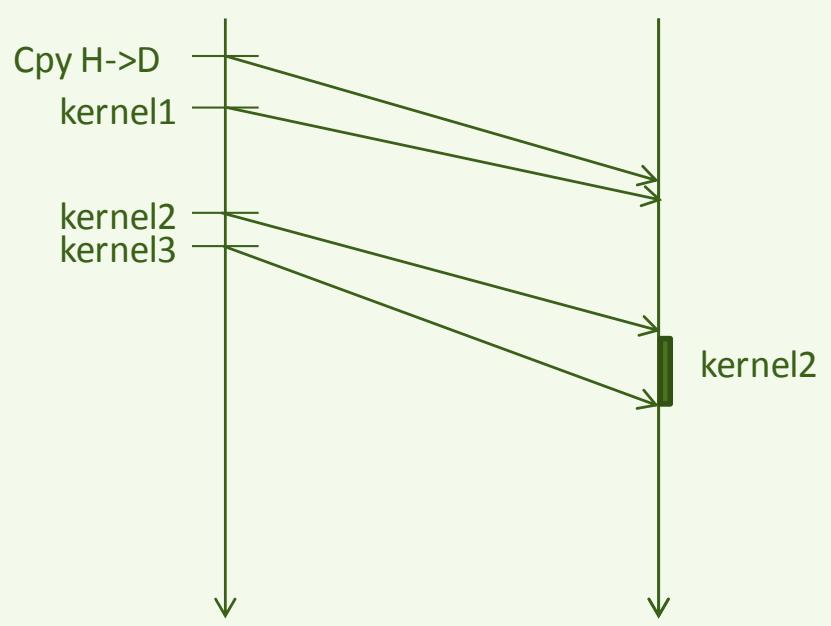

### Asynchronisme

- cudaMemcpyAsync(d_a, h_a, (sizeof(int) * (1024)), cudaMemcpyHostToDevice);
- kernel1<<<16, 64>>>(d_a, size); kernel2<<<32, 32>>>(d a, size); kernel3<<<64, 16>>>(d_a, size);
- cudaMemcpyAsync(h_a, d_a, (sizeof(int) * (1024)), cudaMemcpyDeviceToHost);
- cudaDeviceSynchronize();
- kernel4<<<8, 128>>>(d_a, size);

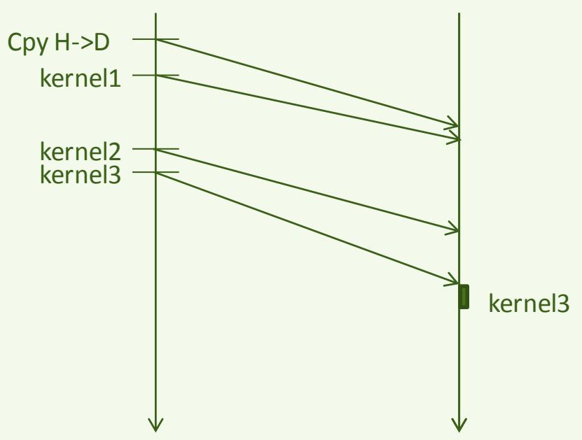

### Asynchronisme

- cudaMemcpyAsync(d_a, h_a, (sizeof(int)* (1024)), cudaMemcpyHostToDevice);
- kernel1<<<16, 64>>>(d a, size); kernel2<<<32, 32>>>(d_a, size); kernel3<<<64, 16>>>(d_a, size);
- cudaMemcpyAsync(h_a, d_a, (sizeof(int) * (1024)), cudaMemcpyDeviceToHost);
- cudaDeviceSynchronize();
- kernel4<<<8, 128>>>(d_a, size);

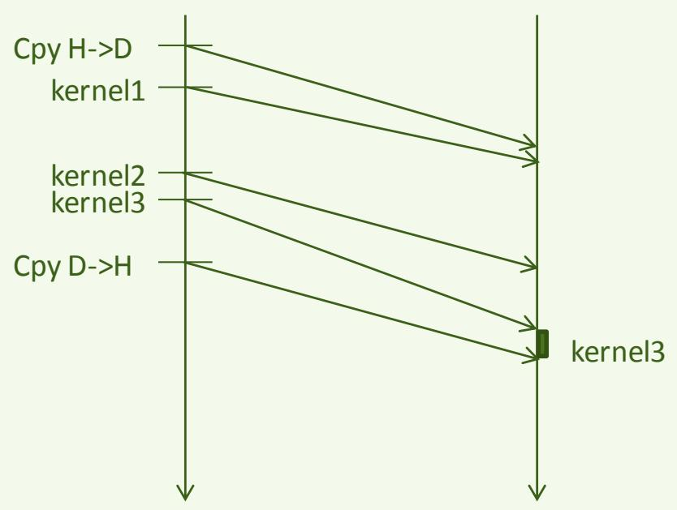

### Asynchronisme

- cudaMemcpyAsync(d_a, h_a, (sizeof(int)* (1024)), cudaMemcpyHostToDevice);
- kernel1<<<16, 64>>>(d a, size); kernel2<<<32, 32>>>(d_a, size); kernel3<<<64, 16>>>(d_a, size);
- cudaMemcpyAsync(h_a, d_a, (sizeof(int) * (1024)), cudaMemcpyDeviceToHost);
- cudaDeviceSynchronize();
- kernel4<<<8, 128>>>(d_a, size);

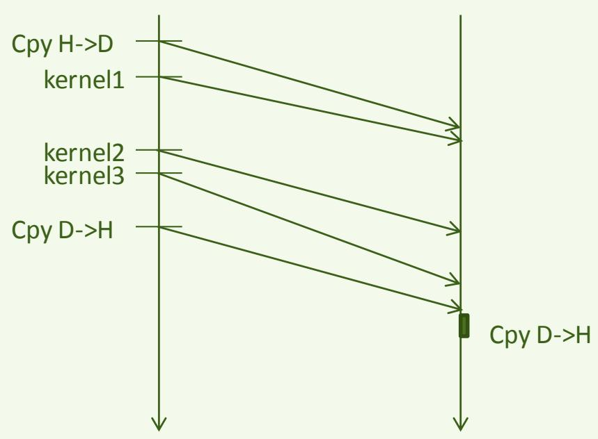

### Asynchronisme

- cudaMemcpyAsync(d_a, h_a, (sizeof(int)* (1024)), cudaMemcpyHostToDevice);
- kernel1<<<16, 64>>>(d a, size); kernel2<<<32, 32>>>(d_a, size); kernel3<<<64, 16>>>(d_a, size);
- cudaMemcpyAsync(h_a, d_a, (sizeof(int) * (1024)), cudaMemcpyDeviceToHost);
- cudaDeviceSynchronize();
- kernel4<<<8, 128>>>(d_a, size);
- CPU

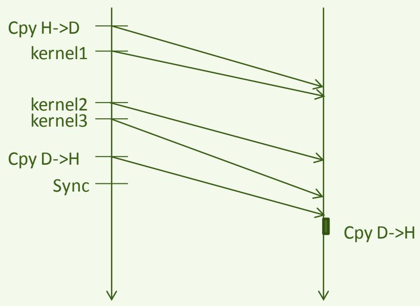

### Asynchronisme

- cudaMemcpyAsync(d_a, h_a, (sizeof(int)* (1024)), cudaMemcpyHostToDevice);
- kernel1<<<16, 64>>>(d a, size); kernel2<<<32, 32>>>(d_a, size); kernel3<<<64, 16>>>(d_a, size);
- cudaMemcpyAsync(h_a, d_a, (sizeof(int) * (1024)), cudaMemcpyDeviceToHost);
- cudaDeviceSynchronize();
- kernel4<<<8, 128>>>(d_a, size);

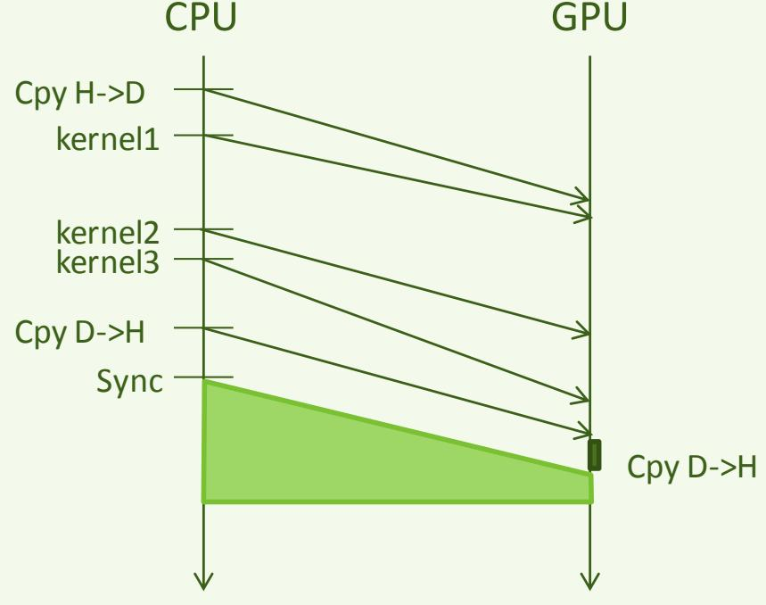

### Asynchronisme

- cudaMemcpyAsync(d_a, h_a, (sizeof(int) * (1024)), cudaMemcpyHostToDevice);
- kernel1<<<16, 64>>>(d a, size); kernel2<<<32, 32>>>(d_a, size); kernel3<<<64, 16>>>(d_a, size);
- cudaMemcpyAsync(h_a, d_a, (sizeof(int) * (1024)), cudaMemcpyDeviceToHost);
- cudaDeviceSynchronize();
- kernel4<<<8, 128>>>(d_a, size);

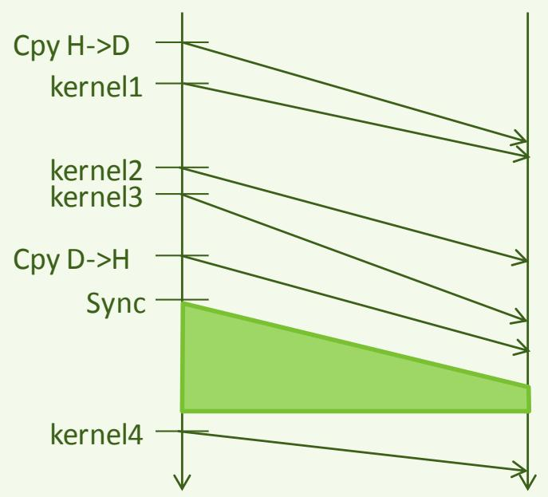

### Asynchronisme – mémoire host


- Problème: entre l’appel à cudaMemcpyAsync et la réalisation de la copie, l’adresse physique sur le host peut changer
- En raison de la séparation espace d’adressage virtuelle / espace d’adressage physique
- Besoin d’un fonction pour fixer l’adresse physique de l’host pour les copies async.
- cudaMallocHost

### Asynchronisme

- Pas besoin de synchronisation globale en cas de dépendances entre des kernels appelés consécutivement
- Même si la main est rendue à l’hôte, la sémantique reste séquentielle
- Les noyaux de calcul sont exécutés dans l’ordre
- La gestion des dépendances est implicites
- Comment obtenir du vrai asynchronisme ?

### Asynchronisme avancé

- Motivations :
- Pouvoir transférer des données pendant l’exécution d’un kernel
- Pouvoir exécuter plusieurs noyaux de calculs
- Si la carte graphique le permet (Fermi)
- S’il n’y a pas de dépendances entre les noyaux

### Solution : streaming

### Asynchronisme avancé

- Déclaration d’un ou plusieurs streams
- Chaque interaction avec le device se fait sur un stream en particulier
- Le driver sait alors ce qui peut être parallélisé ou non

```cpp
cudaMemCpy(d_c, c, N*sizeof(double), cudaMemcpyHostToDevice, stream[0]);
my_kernel<<<Dg, Db, 0, stream[0]>>> (arg1, arg2, arg3);
```

### Asynchronisme avancé

- Déclaration d’un ou plusieurs streams
- Chaque interaction avec le device se fait sur un stream en particulier
- Le driver sait alors ce qui peut être parallélisé ou non

```cpp
cudaMemCpy(d_c, c, N*sizeof(double), cudaMemcpyHostToDevice, stream[0]);
my_kernel<<<Dg, Db, 0, stream[1]>>> (arg1, arg2, arg3);
```

### Asynchronisme avancé

### Structure stream

- cudaStream_t

### Creation d’un stream

- cudaStream_t stream;
- cudaStreamCreate(&stream);

### Destruction d’un stream

- cudaStreamDestroy(stream);

### Synchronization d’un stream

- cudaStreamSynchronize(stream);
- cudaStreamWaitEvent(stream, event, flag)

### Synchronisation dans un bloc


### void syncthreads();

- Synchronisation entre tous les threads d’un même bloc
- Permet également une synchronisation des données
- Attention au flot de contrôle !

### Pour les cartes compatibles 2.0

- int syncthreads_count(int predicate);
- int syncthreads_and(int predicate);
- int syncthreads_or(int predicate);


## AUTRES FONCTIONNALITÉS


### Mathématiques

- Ensemble de fonctions mathématiques optimisées pour GPU
- Ex: sin(float), cos(double), …
- Option de compilation pour utiliser les fonctions optimisées
- -use_fast_math
- Seulement pour les calculs simple précisions

### Opérations atomiques

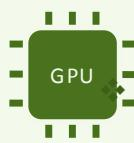

### Instructions assurants une atomicité

- Ex : int atomicAdd(int* address, int val);

### Fonctions disponibles

- Opérations : atomicAdd, atomicSub
- Echange : atomicExch
- Min/Max : atomicMin
- Incrément/Décrément : atomicInc
- CAS, …

### Restrictions

**Fonctionne sur:**

- les entiers, flottants,
- 16-bits, 32-bits, 64-bits
- Depends de la compute capability

### Print

### Sortie formattée

- int printf(const char *format[, arg, ...]);
- Cartes supportant les capacités 2.0
- Fonction par thread
- Format final fait sur l’hôte

### Timing et suivi du programme

- Mesure de temps (profiling)
- Utilisation des évenements définis par CUDA
- Type principal : cudaEvent_t

### Création

- cudaEventCreate(cudaEvent_t * e)
- Activation
- cudaEventRecord(cudaEvent_t e, cudaStream_t s)
- Attente de l’activation des évênements
- cudaEventSynchronize(cudaEvent_t e);

### Calcul du temps passé

- `cudaEventElapsedTime(float *ms, cudaEvent_t start, cudaEvent_t stop);`
- Signature entièrement visible dans le PDF 2026, p. 95.


### Gestion des erreurs

- X En CUDA, (presque) toutes les fonctions retournent un code d’erreur
- Retour d’un type cudaError_t
- Si tout se passe bien, il s’agit alors de cudaSuccess
- Sinon, il est possible d’obtenir une description
- const char * cudaGetErrorString (cudaError_t error);
- Pour les fonctions ne retournant pas une telle info (par exemple, un appel à un kernel)
- Appel à cudaGetLastError()
- Retourne un type cudaError_t


### Debugging


### Comment débugger un code ?

- Utilisation de printf directement possible mais pas infaillible
- Ajout de synchronisation
- Vérifier le retour de chaque fonction CUDA
- Récupérer les cudaError aussi pour les kernels

### Optimisation

### Priorité haute

- Penser parallèle
- Minimiser les transferts hote/device
- Nombre de blocs au moins égal au nombre de SM
- Et nombre de threads au moins égal eu nombre de coeurs
- Accès coalescés à la mémoire globale
- Utilisation de la mémoire shared
- Eviter de multiplier les chemins d’exécution dans le code

### Priorité moyenne/basse

- Eviter les conflits de banc de la mémoire shared
- Avoir un grand nombre de threads par blocs (multiple de 32)
- Utilisation des fonctions mathématiques optimisées
