# ARCHITECTURE ET PROGRAMMATION D’ACCÉLÉRATEURS MATÉRIELS

*Lecture 3 : CUDA APIs - Multi-GPUs programming*

> 本文由教师 PDF 自动提取，已整理本地图片并校正部分明确的识别错误。幻灯片的逐步展示会造成内容重复；代码和公式请以同名 PDF 为准。

**Enseignant :** Julien Jaeger · julien.jaeger@cea.fr

**PDF source :** [APM_Cours3.pdf](APM_Cours3.pdf)

## Lecture 3 outline

- CUDA several APIs
- What is a CUDA context ?
- Multi-GPUs programming

## CUDA SEVERAL APIS

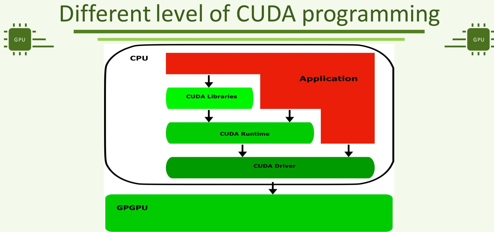

- CUDA several APIs
- Runtime API
- Driver API
- What is a CUDA context ?
- Multi-GPUs programming

### Runtime API(1)

- It is the API used by the end-user
- All examples in the slides and in the hands-ons so far are done with the Runtime API
- Prefix used in function names: « cuda »
- This API provides the basic functions for CUDA programming
- cudaMalloc, cudaFree, cudaMemcpy, …

### Runtime API (2)

- High-level API
- Abstraction level is high
- Most CUDA internals are hidden from the end-user and cannot be tampered with
- Plan du cours
- CUDA several APIs
- Runtime API
- X Driver API
- What is a CUDA context ?
- Multi-GPUs programming

### Driver API(1)

- Low-level API
- It is the API used by experts and library developpers
- Requires a higher level of expertise and knowledge to be used
- Allows isolating CUDA development in a library from other CUDA development done in other parts of the program
- Especially from end-user developments

### Driver API (2)


- Prefix used in function names: « cu »
- This API provides similar functionnalities than the Runtime API
- With additional details
- cudaMalloc  cuMemAlloc
- cudaMemcpy  cuMemcpyDtoH cuMemcpyHtoD cuMemcpyHtoH cuMemcpyDtoD

## CUDA CONTEXTS

### Lecture 3 outline

- Les différentes APIs pour CUDA
- What is a CUDA context ?
- Contexte Primaire
- Contexte « classique »
- Multi-GPUs programming

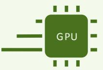


### Contexts (1)

- CUDA internal structure attached to a GPU
- Each time a operation requiring a GPU is realised, the CUDA runtime « look up » in this structure which one is the concerned GPU
- Created when a user asked to be « attached » to a GPU
- If a context doesn’t aready exist

### Contexts (2)

- Encapsulates all objects related to having a functionnal CUDA program, such as:
- All memory allocation with its own address space.
- Thus, only compute agents (e.g., threads) sharing the same context can share the same GPU address space
- CUDA streams
- CUDA events

### Contexts (3)

- Two types of contexts
- Primary and « classical »
- Depending on which level API is used
- Primary: by default through the Runtime API
- « classical »: historic one, through the Driver API

### CUDA several APIs

- What is a CUDA context ?
- Primary context
- « classical » context
- Multi-GPUs programming

### Primary Contexte (1)

- Most recent context in CUDA hisory
- Available since CUDA 4.0
- Context shared between all the threads targeting the same GPU
- Data written by a specific thread in GPU global memory can be read by any other threads associated to the same GPU
- A new primary context is created each time the a thread is associated to a never-targeted-before GPU
- E.g., if any context associated to this GPU is already present in the « stack » of created context

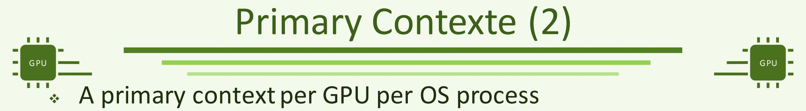

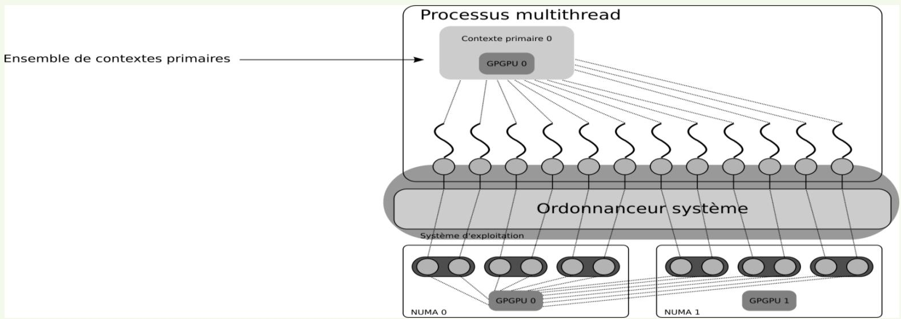

### Primary Contexte (3)

- Several threads in the same OS process can be associated to different GPUs through different primary contexts

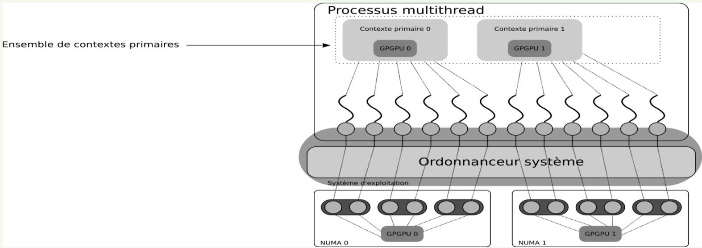


### Primary Contexte (4)

- Threads sharing the same primary context also share the same address space on the GPU
- A buffer allocated by a thread can be used by ano other thread using the same primary context Processus multithread
- Ensemble de contextes primaires

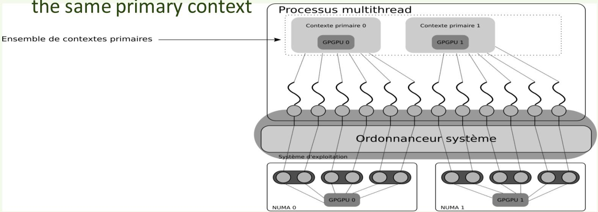

### CUDA several APIs

- What is a CUDA context ?
- Primary context
- « classical » context
- Multi-GPUs programming

### « Classical » context (1)

- First historic context in CUDA API
- Default context before CUDA 4.0
- Contexte privé à chaque thread
- Création d’un nouveau contexte à l’appel de cuCtxCreate(…)
- Peu importe le contenu des piles de contextes « classiques » ou primaires.
- Dans les versions récentes de CUDA, seules les contextes primaires sont disponibles

### « Classical » context (2)

- One stack of « classical » context per thread
- Stored in the TLS
- Pile de contextes classiques

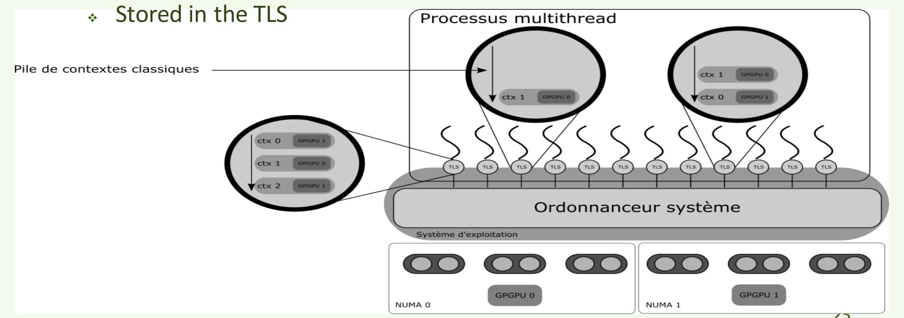

- Ordonnanceur système
- GPGPU 0
- GPGPU 1
- NUMA 1


### « Classical » context (3)

- Issue with user threads: context stack needs to be handled by hand
- Processus multithread
- Pile de contextes classiques

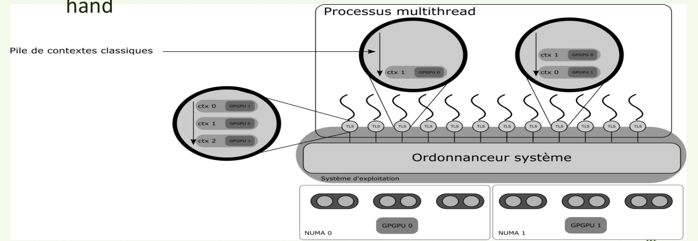

- Ordonnanceur système
- Système d'exploitation
- GPGPU 0
- GPGPU 1
- NUMA 0
- NUMA 1

### « Classical » context (4)

- Priority over primary context
- Classical ctx read before primary ctx
- Pile de contextes classiques

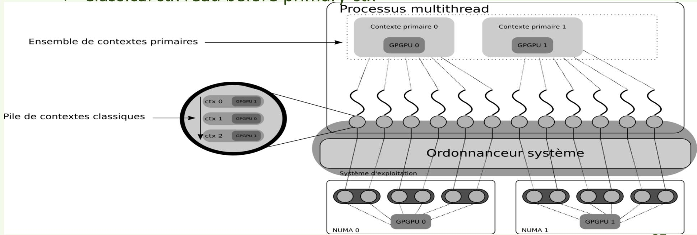

## MULTI-GPUS PROGRAMMING

- Lecture 3 outline

### CUDA several APIs

- What is a CUDA context ?
- Multi-GPUs programming
- Selecting which GPU to use in CUDA
- UVA
- MPI+CUDA
- OpenMP + CUDA
- NCCL


### GPU selection in CUDA

- Two possible ways to select on which GPU the next functions will be executed:
- Runtime API: cudaSetDevice(…)
- Driver API: cuCreateCtx(…)

### API Runtime: cudaSetDevice

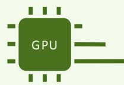


- host__cudaError_t cudaSetDevice (int device)
- Set device to be used for GPU executions.

### Parameters

- device
- Device on which the active host thread should execute the device code.

```text
Utilisation de cudaSetDevice
Int main()
{
...
    cudaMalloc(&d_a, ...) // malloc on the default device (device 0)
    cudaSetDevice(1); // Select device 1 for the following CUDA functions
    cudaMalloc(&d_b, ...) // malloc on device 1
...
```

### cudaSetDevice: details (1)

- cudaSetDevice checks if a context is already associated with the required GPU
- If a « classical » context stack exists
- If yes, checks if a context attached to the required GPU exists
- If yes, select it by putting it at the top of the stack
- If not, creates a new classical context attached to the device
- If not, checks if a primary context attached to the required GPU exists
- If yes, the context is chosen
- If not, creates an appropriate primary context

### cudaSetDevice: details (1)

- cudaSetDevice checks if a context is already associated with the required GPU
- If a « classical » context stack exists
- If yes, checks if a context attached to the required GPU exists
- If yes, select it by putting it at the top of the stack
- If not, creates a new classical context attached to the device
- If not, checks if a primary context attached to the required GPU exists
- If yes, the context is chosen
- If not, creates an appropriate primary context

### cudaSetDevice: details (1)

- cudaSetDevice checks if a context is already associated with the required GPU
- If a « classical » context stack exists
- If yes, checks if a context attached to the required GPU exists
- If yes, select it by putting it at the top of the stack
- If not, creates a new classical context attached to the device
- If not, checks if a primary context attached to the required GPU exists
- If yes, the context is chosen
- If not, creates an appropriate primary context

### cudaSetDevice: details (1)

### cudaSetDevice checks if a context is already associated with the required GPU

- If a « classical » context stack exists
- If yes, checks if a context attached to the required GPU exists
- If yes, select it by putting it at the top of the stack
- If not, creates a new classical context attached to the device
- If not, checks if a primary context attached to the required GPU exists
- If yes, the context is chosen
- If not, creates an appropriate primary context

### cudaSetDevice: details (2)

- Priority over primary contexts
- « Classical » contexts are checked and chosen before primary context


### cudaSetDevice: details (3)

- What if the required device doesn’t exist ?
- E.g., a user give 3 to the cudaSetDevice function with only two devices present on the node ?
- No error nor segfault
- The following CUDA functions will be executed on the default device (device 0)

### Runtime API: cudaGetDeviceCount

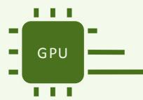

- host device__cudaError_t cudaGetDeviceCount (int *count)


- Returns the number of compute-capable devices.

### Parameters

- Count
- Returns the number of devices with compute capability greater or equal to 2.0

```text
cudaSetDevice usage
int main()
{
...
    cudaMalloc(&d_a, ...);
    cudaGetDeviceCount(&nbGPUs); // Get the number of available devices
    cudaSetDevice(1%nbGPUs); // A mod on the number of GPUs allows always choosing n existing GPU
    cudaMalloc(&d_b, ...); //
...
}
```

### API Driver: cuCtxCreate


### CUresult cuCtxCreate (CUcontext *pctx, unsigned int flags, CUdevice dev)

- Create a CUDA context.
- This new context is « pushed » a the top of the stack of the calling thread

### Parameters

- Pctx: Returned context handle of the new context
- Flags: Context creation flags
- Dev: Device to create context on

### API Driver: cuCtxPopCurrent


- CUresult cuCtxPopCurrent (CUcontext *pctx)
- Pops the current CUDA context from the current CPU thread.

### Parameters

- Pctx
- Returned new context handle

### API Driver: cuCtxPushCurrent

- CUresult cuCtxPushCurrent (CUcontext ctx)
- Pushes a context on the current CPU thread.
- Parameters
- Ctx
- Context to push

```text
Utilisation de cuCtxCreate
Int main()
{
...
cudaMalloc(&d_a, ...) // malloc on the default device (device 0)
cuCtxCreate(&myctx, flags, 1); // Select device 1 for the following CUDA operations
cudaMalloc(&d_b, size) // malloc on device 1
cuMemAlloc(&d_c, size) // malloc on device 1
...
```

### Using cuCtxPopCurrent and cuCtxPushCurrent

```text
Int main()
{
    cuCtxCreate(&myctx, flags, 1);
    cudaMalloc(&d_a, ...); // malloc on device 1
    cuCtxPopCurrent(&tmpctx); // « pop » myctx from the top of the stack
    cudaMalloc(&d_b, ...); // malloc on the previous device
    cuCtxPushCurrent(tmpctx); // put back the device 1 context a the top of the context stack
    cudaMalloc(&d_c, ...); // malloc on device 1
}
```


### cuCtxCreate: details

- cuCtxCreate creates a new context for the required GPU
- with no regards to the current content of the context stack
- Thus, it is possible to have several “classical” contexts attached to the same GPU in the stack
- A call to cudaSetDevice will select the first encountered context attached to the required GPU


### Driver API: Other fonctions

- CUresult cuCtxGetCurrent (CUcontext *pctx)
- Returns the CUDA context bound to the calling CPU thread.
- This context isn’t « popped » and remain at the top of the stack


### Driver API: Other fonctions


- CUresult cuCtxGetCurrent (CUcontext *pctx)
- Returns the CUDA context bound to the calling CPU thread.
- CUresult cuCtxGetDevice (CUdevice *device)
- Returns the device ID for the current context.


### Driver API: Other fonctions


- CUresult cuCtxGetCurrent (CUcontext *pctx)
- Returns the CUDA context bound to the calling CPU thread.
- CUresult cuCtxGetDevice (CUdevice *device)
- Returns the device ID for the current context.
- CUresult cuCtxSetCurrent (CUcontext ctx)
- Binds the specified CUDA context to the calling CPU thread.
- In fact, realize a sort of « swap » context : pop the head of the stack, then push ctx at the head)


- « Classical » context fine-grain management (1)

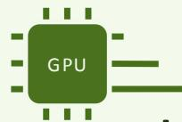

- How to avoid creating several « classical » contexts attached to the same GPU :
- Check “by hand” the classical context stack
- Before creating a new context, “pop” all context from the stack to check them
- At each step, a call to cuCtxGetDevice() will return the device ID of the current context at the head

### « Classical » context fine-grain management (2)

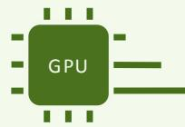

- If it is the asked GPU, “pop” it, then “push” back all the other poped context, then pop the required one at the head
- If you don’t find the asked GPU, then call cuCtxCreate
- Or let the Runtime API handle it through cudaSetDevice
- Create a first “classical context” for your thread
- Then, each subsequent call to cudaSetDevice will check the « classical » context stack a corresponding context, or will create a new « classical context » fitting the requirement
- Lecture 3 outline
- What is a CUDA context ?
- Multi-GPUs programming
- Selecting which GPU to use in CUDA
- UVA
- MPI+CUDA
- OpenMP + CUDA
- NCCL

```text
Using same address on different address space
Int main()
{ ...
    cudaMalloc(&d_a, ...) //
    cudaSetDevice(1); //
    cudaMemcpy(&d_a, ...) //
...
}
```

### Using same address on different address space

```text
Int main()
{ ...
    cudaMalloc(&d_a, ...) //
    cudaSetDevice(1); //
    cudaMemcpy(&d_a, ...) //
...
}
```

- What happens in this case ?

```text
Using same address on different address space
Int main()
{ ...
    cudaMalloc(&d_a, ...) // malloc on the default device (device 0)
    cudaSetDevice(1); // Select device 1 for the next CUDA calls
    cudaMemcpy(&d_a, ...) // Error! d_a is allocated on device 0, and doesn't have meaning for device 1
...
```

### What happens in this case ?

```text
Using same address on different address space
int main()
{ ...
    cudaMalloc(&d_a, ...) // malloc on the default device (device 0)
    cudaSetDevice(1); // Select device 1 for the next CUDA calls
    cudaMemcpy(&d_a, ...) // Error! d_a is allocated on device 0, and doesn't have meaning for device 1
...
```

- That is what happens before UVA

### UVA: Unified Virtual Addressing

- UVA arrived withCUDA 4.0
- UVA is a unified virtual addressing
- Memories of the host and the different GPUs are independent et have different address spaces
- UVA present all these memories in the same address space
- Each with its own address boundaries
- Thus, host or devices can correctly understand memory addresses coming from other devices
- It can kno from which device this address come from

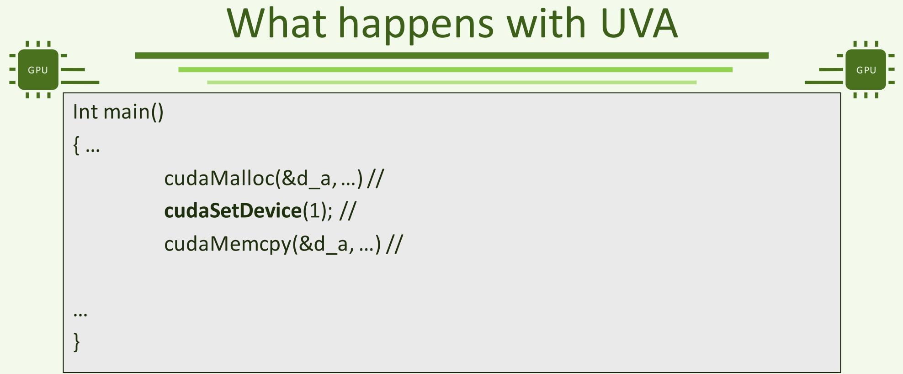

- That is what happens before UVA

```text
What happens with UVA
int main()
{ ...
    cudaMalloc(&d_a, ...) // malloc on the default device (device 0)
    cudaSetDevice(1); //
    cudaMemcpy(&d_a, ...) //
...
}
```

### That is what happens before UVA

```text
What happens with UVA
int main()
{ ...
    cudaMalloc(&d_a, ...) // malloc on the default device (device 0)
    cudaSetDevice(1); // Select device 1 for the next CUDA calls
    cudaMemcpy(&d_a, ...) //
...
}
```

- That is what happens before UVA

```text
What happens with UVA
int main()
{ ...
    cudaMalloc(&d_a, ...) // malloc on the default device (device 0)
    cudaSetDevice(1); // Select device 1 for the next CUDA calls
    cudaMemcpy(&d_a, ...) // Le runtime reconnaît que d_a est une adresse sur le GPU 0, et va donc copier les données sur ce GPU
...
```

### That is what happens before UVA

### UVA: Unified Virtual Addressing


- It is possible to copy data to, or from, a GPU different than the one we are currently attached to
- The CUDA runtime can recognize the location of any address
- No need to specify the direction of the copy anymore

### UVA: Unified Virtual Addressing


- It is possible to copy data to, or from, a GPU different than the one we are currently attached to
- The CUDA runtime can recognize the location of any address
- No need to specify the direction of the copy anymore
- CudaMemcpyHostToDevice
- CudaMemcpyDeviceToHost…


### UVA: Unified Virtual Addressing

- It is possible to copy data to, or from, a GPU different than the one we are currently attached to
- The CUDA runtime can recognize the location of any address
- No need to specify the direction of the copy anymore
- CudaMemcpyHostToDevice
- CudaMemcpyDeviceToHost…

### cudaMemcpyDefault

- Runtime find itself the direction of the copy
- What is a CUDA context ?
- Multi-GPUs programming
- Selecting which GPU to use in CUDA
- UVA
- MPI+CUDA
- OpenMP + CUDA
- NCCL

```text
MPI+CUDA (1)
GPU
Int main()
{
    MPI_Init(...)//
...
    cudaMalloc(...); // All the MPI processes will target the same
GPU
...
    MPI_Finalize(...)
}
```

```text
MPI+CUDA (2)
GPU
Int main()
{
    MPI_Init(...)//
...
    cudaSetDevice (1); // Assign GPU 1
    cudaMalloc(...); // All MPI processes did the same assignment, so all MPI processes will target the same GPU 1
...
    MPI_Finalize(...)
}
```

```cpp
MPI+CUDA (3)
GPU
Int main()
{
    MPI_Init(...)//
    MPI_Comm_rank(MCW, &rank);
    cudaSetDevice(rank); // Assign a unique GPU to each MPI processus, as long as rank<nb GPU.
    cudaMalloc(...); //
...
    MPI_Finalize(...)
}
```

```text
MPI+CUDA (4)
Int main()
{
    MPI_Init(...)//
    MPI_Comm_rank(MCW, &rank);
    cudaGetDeviceCount(&nbGPU);
    cudaSetDevice(rank % nbGPU); // Assign a GPU to each MPI process following a Round-Robin distribution.
    cudaMalloc(...);
...
    MPI_Finalize(...)
}
```


### Round-Robin GPU affectation (1)

- Maximize spreading of MPI processes on all the GPUs available
- Don’t necessarily optimize GPUs occupation
- Each MPI may have a different compute load to give to the GPU.
- MPI processes may not be attached to the closest GPUs
- Numa effects may have impact

### Round-Robin GPU affectation (2)

- MPI processes attached to the same GPU don’t share the same address space
- E.g., a data written in GPU memory by an MPI process may not be read by another MPI process
- To share the address space requires that multiple MPI processes share the same context
- Process-based MPI: not possibe. Bcast of the GPU context to other MPI processes is not possible : CUDA context are opaque objects
- Size and content are not available to users
- Thread-based MPI: just need to use primary contexts
- What is a CUDA context ?
- Multi-GPUs programming
- Selecting which GPU to use in CUDA
- UVA
- MPI+CUDA
- OpenMP + CUDA
- NCCL

```text
OpenMP+CUDA (1)
Int main()
{
    #pragma omp parallel
    {
    rank = omp_get_thread_num();
    cudaGetDeviceCount(&nbGPU);
    cudaSetDevice(rank % nbGPU); // Each thread chooses its GPU. The GPU current context is only modified for the current thread. Shared memory and address space for the threads attached to the same GPU (thanks to primary context).
    cudaMalloc(...);
    }
}
```

```text
OpenMP+CUDA (2)
Int main()
{
    #pragma omp parallel
    {
    rank = omp_get_thread_num();
    cudaGetDeviceCount(&nbGPU);
    cuCtxCreate(rank % nbGPU); // Create and assign a new context independent for each thread. Available GPUs are associated in Round-Robin fashion. GPU memory is not shared between threads.
    cudaMalloc(...);
    }
}
```

```text
OpenMP+CUDA (2)
GPU
Int main()
{
    #pragma omp parallel
    {
    rank = omp_get_thread_num();
    cudaGetDeviceCount(&nbGPU);
    cuCtxCreate (rank % nbGPU);
    cudaMalloc(&d_a,...);

    cudaGetDeviceCount(&nbGPU);
    cuCtxCreate (rank % nbGPU);
    cudaMemcpy(&d_a,...); // Error! Even if it is the same GPU, context are different with means memory address spaces are different.
    }
}
```


### Round-Robin GPU affectation (3)

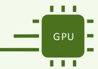

- We have the same issues with threads+CUDA than with MPI+CUDA
- Don’t maximize GPU occupation
- GPUs associated to thread are not necessarily the closest ones
- Threads attached to the same GPU doesn’t necessarily share the same address space
- Depending of which contextsare used

### Round-Robin GPU affectation (4)

- Ensemble de contextes primaires
- Processus multithread
- Contexte primaire 0
- GPGPU 0
- Contexte primaire 1
- GPGPU 1

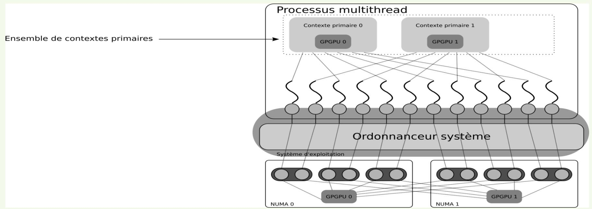

- Ordonnanceur système
- Système d'exploitation
- GPGPU 0
- GPGPU1
- NUMA 1

### MPI+OpenMP+CUDA (1)

- Best case… almost (for GPUs)
- 1 MPI process/GPU available

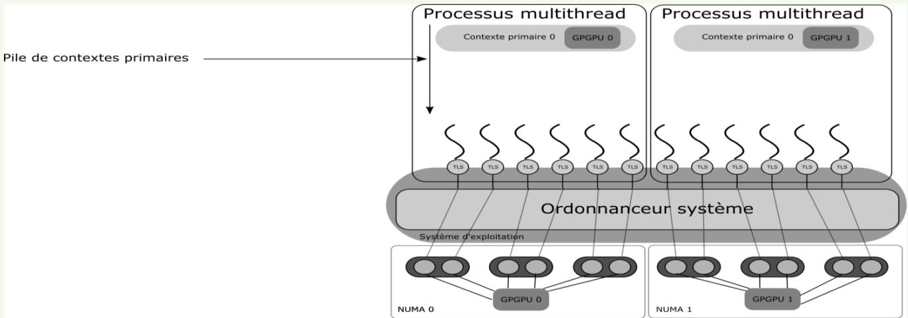

### MPI+OpenMP+CUDA (2)

### X Uses all available GPUs

- All threads in one MPI process can share the same address space on the GPU
- Possible to alloc+memcpy before the OpenMP parallel region, then each thread launches its kernel on the data
- Possible to do this with the Runtime API
- Not necessary to use complex features from the Driver API
- Also woks with user-level threads

### MPI+OpenMP+CUDA (3)

- /!\ Each CUDA call in a same MPI process will be serialized
- Need to use streams to avoid this dependency: associate one stream per threads
- streams are independent: no serialization, thus is is possible for two threads using only half of the same GPU to run concurrently
- Be careful to the number of streams available in your GPU: 16 or 128, depending on the GPU

### MPI+OpenMP+CUDA (4)

### Best case (for GPUs)

- 1 MPI process per GPU available + streams

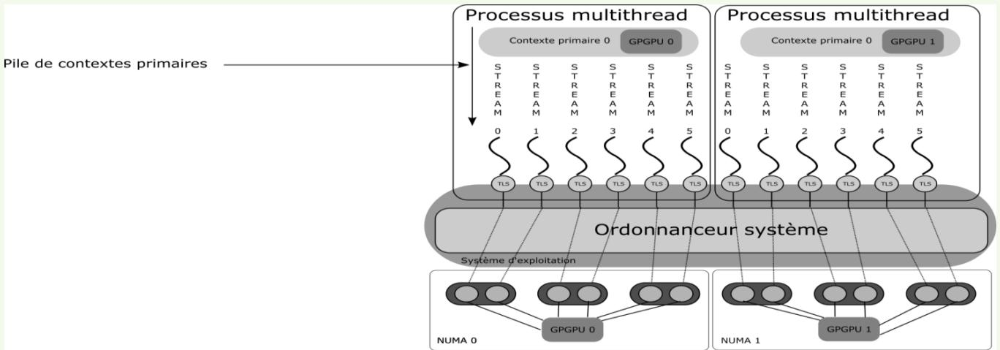

```text
MPI+OpenMP+CUDA (5)
GPU
Int main()
{
    MPI_Init(...)//
    MPI_Comm_rank(MCW, &mpirank);
    cudaGetDeviceCount(&nbGPU);
    cudaSetDevice(mpirank % nbGPU); // modulo nécessaire pour associer chaque rang au bon GPU en multi-noeud
    #pragma omp parallel
    {
    omprank = omp_get_thread_num();
    cudaMalloc(..., omprank % 16); // appel à cudaMalloc sur le stream n° (omprank %16).
    }
    MPI_Finalize(...)
}
```

### MPI+OpenMP+CUDA (6)

- For best performances, it is better to take into account the position of the GPUs to attach MPI processes closest to each GPU and avoid NUMA effects
- It may be not possible to completely avoid NUMA effects
- Example: 2 sockets, with both GPUs attached to the same socket

### MPI+OpenMP+CUDA (7)

- /!\ The best placement MPI processes/Threads for GPU usage may not be the best performance for CPUs.
- /!\ External libraries may manupulate GPUs/CUDA contexts and « break » your optimal placement.
- CUDA several APIs
- What is a CUDA context ?
- Multi-GPUs programming
- Selecting which GPU to use in CUDA
- UVA
- MPI+CUDA
- OpenMP + CUDA
- WA NCCL

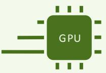

### NCCL (1)

- NCCL (« Nickel »): Nvidia Collectvice Communications Library
- Goal: allows point-to-point and collective communications between multiple GPUs on the same node
- Possible to do between GPUs on different nodes, as long as they are interconnected with Nvidio Mellanox Infiniband network

### NCCL (2)

### Very similar to MPI

- A « clique » regroups the GPUs concerned by a collective (not necessarily all)
- A communicator is initialized for each GPU in the « clique »
- Either with a call for each GPU
- This initialization incurs a barrier : it must be done in parallel
- Different MPI processes or different threads
- Or with a global call

### Initilization functions

- ncclResult_t ncclCommInitRank (ncclComm_t* comm, int nGPUs, ncclUniqueId cliqueId, int rank);
- Initialize the « rank »
- Parameters
- Comm: CUDA communicator
- nGPUs: number of GPUs in the clique
- cliqueID: unique ID for the clique
- A rank must call ncclGetUniqueId() then broadcast (MPI_Bcast, …)
- Rank: unique ID for the current GPU

### Initialization functions

- ncclResult_t ncclCommInitAll (ncclComm_t* comms, int nGPUs, int* devList);
- Directly initialize the nGPUs GPUs
- Parameters
- Comms: array of comm, one for each GPU
- nGPUs: number of GPUs in the comm
- devList: which CUDA device is associated to which rank

```text
ncclCommInitRank (MPI)
GPU
Int main()
{
...
MPI_Init();
MPI_Comm_rank(MCW, &rank);
ncclCommInitRank(&gpucomm, nGPUs, cUID, getGPU(rank)); // Seuls les rangs choisis initialisent leur communicateur GPU.
MPI_Finalize();
...
}
```

```text
ncclCommInitRank (OpenMP)
Int main()
{
...
    #pragma omp parallel
    {
    rank = omp_get_thread_num();
    ncclCommInitRank(&gpucomm, nGPUs, cUID, getGPU(rank)); //Only the chosen ranks must initialize their GPU communicator
    }
...
}
```

### ncclCommInitRank

- /!\ If more than one MPI process or thread is associated to one GPU, the user must impose that only one call to ncclCommInitRank per GPU are done.
- The argument of ncclCommInitRank is the GPU Id, and not the Id the MPI process/thread.

```text
ncclCommInitAll (MPI)
int clique = {0,3,1,5}
Int main()
{
    ncclComm_t gpucomm [4]; // Need as many nccl communicators than GPUs in the clique
    MPI_Init();
    MPI_Comm_rank(MCW, &rank);
    if(rank == constante)
    ncclCommInitAll(&gpucomm, nGPUs, clique); // Only call this collective initialization one time
    MPI_Finalize();
}
```

```text
ncclCommInitAll (OpenMP)
int clique = {0,3,1,5}
Int main()
{
    ncclComm_t gpucomm [4]; // Need as many nccl communicators than GPUs in the clique
    ncclCommInitAll(&gpucomm, nGPUs, clique); // Only call this collective initialization one time
    #pragma omp parallel
    {
    ...
    }
}
```


### NCCL (3)

- Collectives communication functions have very similar prototypes to MPI collectives
- Each GPU must call the same function with the same parameters
- All the nccl collectives are asynchronous
- It is possible for every call to be done by the same MPI process/thread
- GPU selection + function call

### Collective functions: allreduce

- 原 PDF 第 95 页并列比较 NCCL 与 MPI 的 all-reduce 函数签名。下列文字按幻灯片转录；其中 NCCL 参数名 `sendoff` 为原页所写。
- **NCCL**

```text
ncclResult_t ncclAllReduce(
    void* sendoff,
    void* recvbuff,
    int count,
    ncclDataType_t type,
    ncclRedOp_t op,
    ncclComm_t comm,
    cudaStream_t stream);
```

- **MPI**

```text
int MPI_Allreduce(
    void* sendbuf,
    void* recvbuf,
    int count,
    MPI_Datatype datatype,
    MPI_Op op,
    MPI_Comm comm);
```

```text
Collective communications (MPI 1)
int clique = {0,3,1,5}
Int main()
{
    MPI_Init();
    MPI_Comm_rank(MCW, &rank);
    ... // Initialization of nccl comms
    if(inClique(getGPU(rank)) // Either the chosen ranks realize the calls
    {
    ncclAllReduce(&sendbuf, &recvbuf, count, type, op, gpucomm[getGPU(rank)]);
    }
    MPI_Finalize();
}
```

### Collective communications (MPI 2)

```text
int clique = {0,3,1,5}
Int main()
{
    MPI_Init();
    MPI_Comm_rank(MCW, &rank);
    ... // Initialization of nccl comms
    if(rank==0) // Or only one rank realizes all the GPU calls
    for(i=0; i<nbGPUs; i++)
    {
    if(inClique (i))
    {
    ncclAllReduce(&sendbuf, &recvbuf, count, type, op, gpucomm);
    }
    }
    MPI_Finalize();
}
```

### Collective communications (MPI 3)

```text
// If all GPUs are concerned, no need for selection/check: simpler code
Int main()
{
    MPI_Init();
    MPI_Comm_rank(MCW, &rank);
    ... // Initialization of nccl comms

    if(rank==0)
    {
    for(i=0; i<nbGPUs; i++)
    {
    ncclAllReduce(&sendbuf, &recvbuf, count, type, op, gpucomm);
    }
    }
    MPI_Finalize();
}
```

```text
Utilisation de ncclCommInitAll (OpenMP 1)
int clique = {0,3,1,5}
Int main()
{
    ... // Initialization of nccl comms
    #pragma omp parallel
    {
    rank = omp_get_thread_num();
    if (inClique (getGPU(rank)) // Either the chosen ranks realize the calls
    {
    ncclAllReduce(&sendbuf, &recvbuf, count, type, op, gpucomm);
    }
    }
}
```

### Utilisation de ncclCommInitAll (OpenMP 2)

```text
int clique = {0,3,1,5}
Int main()
{
    ... // Initialization of nccl comms
    for(i=0; i<nGPUs, i++)
    {
    if(inClique (i) // Or only one thread realizes all the GPU calls, inside ou outside of the OpenMP parallel region
    {
    ncclAllReduce(&sendbuf, &recvbuf, count, type, op, gpucomm);
    }
    }
    #pragma omp parallel
    {
    }
}
```

### NCCL 2.19.3 status

### Collectives

- Broadcast
- All-Gather
- Reduce
- All-Reduce
- Reduce-Scatter

### Point-to-point

- Send / recv
- One-to-all (scatter)
- All-to-one (gather)
- All-to-all
- Neighbor exchange

### Key Features

- Single-node and multi-nodes
- Host-side API
- Asynchronous/non-blocking interface
- Multi-thread, multi-process support
- In-place and out-of-place operation
- Automatic Topology Detection
- NVLink & PCIe/QPI*support
- InfiniBand verbs, libfabric, RoCE and IP Socket internode communication
