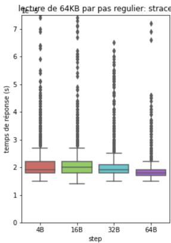
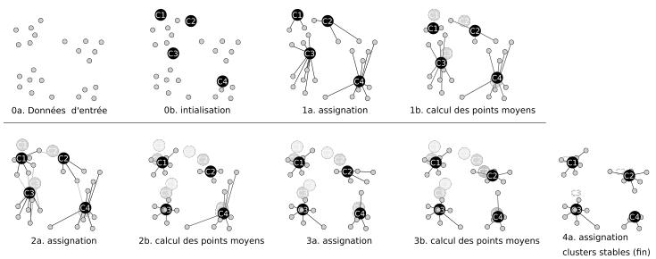

# Cours 2 — Workloads

Soraya Zertal · Master 2 CHPS · Li-PaRAD / UVSQ

[课程入口](../README.md) · [教师课件 PDF](2_edp.pdf)

保留课件正文顺序，合并连续重复的幻灯片标题；内容订正在相应位置标为“校注”，依据见[审校说明](../审校说明.md)。

## Plan du cours

1. Introduction.
2. Sélection : service délivré, niveau de détail, représentativité et alignement temporel.
3. Caractérisation : moyennes, dispersion, quantiles et histogrammes.
4. Workloads synthétiques : timing, addressing et nombre de sources.
5. Workloads réels : benchmarks et applications utilisateurs.

## Workloads : Introduction

Il existe deux classes de workloads (charges de travail) : charges réelles et synthétiques.

### Les charges réelles

Observées ou mesurées sur un système réel pendant une exécution.

Uniques et ne peuvent être réitérées.

### Les charges synthétiques

Creées selon des caractéristiques bien déterminées pour représenter un contexte/comportement spécifique.

Peuvent être réitérées à l’infini.

### Les charges réelles

Avantages : représentativité optimale, riches en détails Inconvénients : grande taille, pas de répétition, mode d’extraction parfois difficile

### Les charges synthétiques

Avantages : rapidité de développement, répétition à l’infini, taille réduite, portabilité Inconvénients : représentativité moindre, beaucoup d’approximations

## Comment sélectionner les charges ?

La sélection de la charge est cruciale pour l’évaluation des performances puisqu’elle détermine l’utilité et l’exactitude de l’impact des résultats obtenus par l’analyse.

Quatre points majeurs à considérer pour sélectionner une charge :

1. le service délivré par le système

2. le niveau de détail demandé

3. la représentativité des charges

4. l’alignement temporel au sein des charges

## Sélection : Service délivré

### Service délivré

Le système à analyser est perçu comme un fournisseur d’un ensemble de services (voir approche). Il faut considérer le service concerné par l’étude et bien le séparer des autres services que le système peut fournir.

### Remarque

Un service indépendant du contexte est plus représentatif, donc plus approprié pour l’analyse puisqu’il ne restreint pas la validité des résultats à un contexte bien particulier.

### Exemple

L’analyse porte sur le stockage de données:

Le système analysé est le système de stockage mais on considère le disque puisqu’il est le composant qui délivre le service analysé.

Le métrique utilisé pour l’analyse doit être au niveau système et non au niveau disque. Plutôt le temps de réponse moyen, débit en TPS...etc que le temps d’accés disque.

## Sélection : Niveau de détail

### Relation avec la méthode d’évaluation

La modélisation mathématique nécessite moins de détails (utilise souvent moyennes ou distributions).

La simulation et la mesure utilisent des charges estampillées par le temps : traces ou (charges exécutables).

### Les traces sont souvent de grandes tailles et riches en détails

On utilise des traces de haut niveau afin de réduire la quantité de données à analyser.

On adapte la finesse du détail des traces à analyser selon les résultats obtenus et ceux souhaités.

## Sélection : Représentativité

### Représentativité

Un workload de test doit être représentatif d’une certaine application/comportement ou une classe d’applications avec des paramètres communs.

Pour qu’une charge soit représentative d’une application, il faut que les deux correspondent en termes de :

Taux d’arrivée

Ressources demandées

Profil d’utilisation de la ressource

## Sélection : Alignement dans le temps

### Alignement dans le temps

Les workloads doivent suivre et représenter les changements temporels dans le comportement du système.

On distingue plusieurs niveaux:

Faible : donnant juste la tendance du comportement dans le temps,

Fort : retraçant avec exactitude tous les événements survenus dans le système,

Intermediaire : retraçant les changement essentiels qui forment la tendance du comportement du système.

## Sélection

> 校注：负载高低的“最好／最坏”取决于考察吞吐量还是响应时间；真实负载的原始运行难以完全复现，但记录的轨迹可重放。

### Autres considérations pour la sélection

De bon usage pour la calibration de résultats

Niveau de charge reflète les régimes sous lesquels un système peut opérer : l’utilisation du système à sa capacité maximale (meilleur cas), en dessous de sa capacité (pire cas) ou à un niveau habituellement observé (cas typique).

Répétition: pour obtenir les ”mêmes” résultats à chaque exécution avec les mêmes charges.

### Remarque

Les charges qui introduisent une grande variabilité des résultats sont peu appréciables car elles génèrent des intervalles de confiance assez grands.

### Intervalle de confiance

Un intervalle de confiance décrit l’incertitude sur un paramètre estimé, ici la moyenne. Sur des échantillonnages répétés, une méthode à 95 % produit des intervalles contenant la vraie moyenne dans 95 % des cas.

À niveau de confiance fixé, un intervalle plus étroit indique une estimation plus précise ; pour les mêmes données, augmenter le niveau de confiance élargit l’intervalle.

### Calcul des intervalles de confiance

Pour des observations indépendantes, de moyenne estimée $\bar X$ et d’écart type empirique $s$, une approximation à grand échantillon donne :

$$
\left[\bar X-z_{1-\alpha/2}\frac{s}{\sqrt n},\quad \bar X+z_{1-\alpha/2}\frac{s}{\sqrt n}\right].
$$

Le niveau de confiance est $1-\alpha$. Pour une population normale de variance inconnue, utiliser $t_{1-\alpha/2,n-1}$ à la place de $z_{1-\alpha/2}$.

> 校注：原课件将 1、2、3 倍标准误分别对应 68%、95%、99%；准确的正态覆盖率约为 68.27%、95.45%、99.73%。双侧 95%、99% 应分别使用约 1.960、2.576，不能把 $3\sigma$ 当成准确的 99%。

## Workloads : Caractérisation

Quelque soit le type de workload, on en extrait les caractéristiques clés pour représenter le contexte de l’étude.

### Intérêt

* Représenter/identifier le contexte de l’étude,
* Générer des workloads synthétiques associés aux workloads réels, mais qu’on pourrait répéter à l’infini.

### Implémentation

Se base sur des techniques statistiques comme: moyennes, facteurs de dispersions, histogrammes simples et multiples...etc

## Techniques de caractérisation de workloads

### Moyennes

Technique la plus simple : caractériser les charges avec une seule valeur qui résume toutes celles que peut prendre le paramètre étudié dans la charge et qui renseigne donc sur sa tendance.

Il existe plusieurs moyennes (arithmétique, géométrique, harmonique...etc) et l’usage de chacune est plus approprié selon le paramètre analysé.

Soit $\left( x _{1} , x _{2} , \ldots , x _{n} \right)$ les valeurs que peut prendre le paramètre X dans la charge analysée.

#### Moyenne arithmétique

$$
\bar{X} = \frac{1}{n} \sum_{i = 1} ^{n} x _{i}
$$

#### Moyenne géométrique

$$
\bar{X} = \bigl(\prod_{i = 1} ^{n} x _{i} \bigr) ^{1 / n}
$$

Moyennes :

#### Moyenne harmonique

$$
\bar{X} = \frac{n}{\frac{1}{x _{1}} + \frac{1}{x _{2}} + \cdots + \frac{1}{x _{n}}}
$$

### Exemples:

Temps de réponse moyen : moyenne arithmétique pour des requêtes de même poids. Une vitesse moyenne sur des distances égales utilise la moyenne harmonique.

> 校注：总体缓存未命中率应为总未命中次数除以总访问次数，即按访问次数加权；不能普遍使用几何平均。几何平均适用于正的比值或乘法因子，需明确聚合目的。

### Moyenne pondérée

Une moyenne pondérée est une moyenne où chacune des différentes valeurs dans la charge considérée est associée à un coefficient qui détermine son poids.

#### Moyenne arithmétique pondérée :

$$
\bar{X} = \frac{\sum_{i = 1} ^{n} p _{i} x _{i}}{\sum_{i = 1} ^{n} p _{i}}
$$

$P _{j}$ : non négatifs.

### Facteur de dispersion

La moyenne seule ne suffit pas, surtout lorsqu’il y a une grande dispersion (variabilité) dans les valeurs que peut prendre le paramètre.

La dispersion est estimée par la variance

$$
\operatorname{var} (X) = \sigma^{2} = \frac{1}{n - 1} \sum_{i = 1} ^{n} (X _{i} - \bar{X}) ^{2}
$$

> 校注：本段沿用课件的 σ 记号，但分母 n−1 给出的是样本方差估计，通常记作 s²，以区别于总体方差。变异系数适用于有意义的比率尺度且均值非零的情形；样本标准差为零只表明这些观测值相同。

On en déduit l’écart type

$$
\sigma = \sqrt{\operatorname{var} (X)}
$$

On utilise souvent le coefficient de variation ou écart type relatif

$$
\sigma / \bar{X}
$$

### Remarque 1

Si l’écart type est nul, cela signifie que le paramètre est constant

### Remarque 2

Si l’écart type est élevé, il est plus approprié d’organiser les valeurs du paramètre en classes.

### Quantiles : définition

Les quantiles sont des points à intervalles réguliers qui divisent la liste ordonnée en q sous-parties d’effectifs égaux.

### Les quantiles les plus utilisés

Les 100-quantiles ou centiles : diviser l’échantillon en 100

Les 10-quantiles ou déciles : diviser l’échantillon en 10

Les 4-quantiles ou quartiles : diviser l’échantillon en 4

Les 2-quantiles ou médiane : diviser l’échantillon en 2

### Quantiles : calcul

Pour une proportion $p\in(0,1)$, une convention empirique définit $Q_p=\inf\{x:F_n(x)\geq p\}$. Il ne faut pas confondre le nombre de parts $q$ avec une proportion $p$ ; différentes conventions d’interpolation existent.

### Exemples :

Le premier décile (10-quantile) est la plus petite valeur de l’echantillon dont 10% de ce même échantillon sont en dessous.

Le troisième quartile (4-quantile) est la plus petite valeur de l’echantillon dont 75% de ce même échantillon sont en dessous.

### Exemple :

| valeur | 4 | 7 | 9 | 11 | 13 | 15 | 18 |
| --- | --- | --- | --- | --- | --- | --- | --- |
| nbr occurrence | 6 | 5 | 10 | 6 | 2 | 7 | 4 |

Le 1er quart-quantile = 7

$\Rightarrow 25 \%$ des valeurs sont inférieures ou égales (au moins la proportion indiquée)

Le 3eme quart-quantile = 15

$\Rightarrow 75 \%$ des valeurs sont inférieures ou égales (au moins la proportion indiquée)

Le 2-quantiles = 9

Avec les valeurs répétées du tableau, on a au moins 50 % des observations inférieures ou égales à 9, et non exactement 50 % strictement inférieures.

### L’écart inter-quartile

L’écart interquartile vaut $Q_3-Q_1$. Son importance s’interprète dans les unités et l’échelle des données.
Un écart inter-quartile important (resp. faible) indique une distribution hétérogène (resp. homogène).

Dans notre exemple précédent : l’écart inter-quartile est important (8), donc distribution hétérogène.

### Médiane : définition

Autre nom du 2-quantile, la médiane représente la valeur centrale d’un échantillon ordonné.

Elle est moins sensible aux valeurs extrêmes que la moyenne.

### Médiane : calcul

Si échantillon de $( 2 n + 1 )$ termes, médiane $=u_{n+1}$

Si échantillon de $2 n$ termes, mediane $= {\frac{u _{n} + u _{n + 1}} {2}}$

### Exemple 1: Médiane, moyenne et mode

| valeur | 4 | 7 | 9 | 11 | 13 | 15 | 18 |
| --- | --- | --- | --- | --- | --- | --- | --- |
| nbr occurrence | 6 | 5 | 10 | 6 | 2 | 7 | 4 |

Moyenne pondérée : 10.45

Médiane : 9 ; les observations de rangs 20 et 21 valent toutes deux 9.

Mode : 9 c’est la valeur la plus fréquente.

### Exemple 2: Médiane, moyenne et mode

| valeur | 32 | 41 | 48 | 58 | 60 | 97 | 124 |
| --- | --- | --- | --- | --- | --- | --- | --- |
| nbr occurrence | 15 | 10 | 15 | 15 | 15 | 2 | 6 |

Moyenne pondérée : 55.4 effet de valeur aberrante.

Médiane : 48 ; les observations de rangs 39 et 40 valent toutes deux 48.

Modes : 32, 48, 58, 60 c’est les valeurs les plus fréquentes.

### Représentation graphique de la variabilité

> 校注：箱线图须注明须线规则，5%／95% 分位数只是其中一种约定。

Un outil statistique graphique permettant une représentation très appropriée lorsqu’une grande variabilité est constatée dans un échantillon : Box plot (boite à moustache).

### Intérêt :

Avoir de manière visuelle claire, l’étendue de 50% de l’échantillon (situé entre les 25% et les 75%), la position de la médiane et la moyenne, sans oublier les outliers. Les écarts de la boite des points correspondants au 5% et 95% de l’echantillon sont représentés.

### Exemple de box plot:

### Analyse plus fine de la variabilité

Lorsque la variabilité est accentuée montrant un échantillon hétérogène,

Il faut privilégier l’identification de ces classes composant l’échantillon initial par une des techniques de classification (clustering) et analyser chaque classe séparément.

### Classification

> 校注：k-means 需要数值特征，类别特征须先作适当编码；编码和距离选择会影响结果。

La technique du k − means permet de faire une classification efficace et repose sur le calcul de la distance ou l’éloignement entre les diferents éléments (points) de l’echantillon. L’éloignement peut être quantitatif (temps, taille, débit ) et qualitatif (arrivée d’évènement)

### Classification avec le k-means

Le plus souvent en HPC, les données analysées sont quantitatives et la mesure de l’éloignement est : la distance euclidienne

1. Choisir les C points pour former les centres Ctr des c classes à construire. Ce choix a un impact important sur la convergence.

2. Former les classes en calculant la distance de chaque point des centres Ctr et les associer à la classe dont le centre est le plus proche.

3. Calcul des nouveaux centres $C t r _{n e w}$ : Les barycentres des classes formées précédement.

4. Ré-itérer les point 2 et 3 avec $\mathrm{Ctr}\leftarrow\mathrm{Ctr}_{\mathrm{new}}$ jusqu’à convergence

Le barycentre ou centre de gravité d’un ensemble (sous échantillon) se calcule par :

$$
G = \frac{1}{\sum_{i = 1} ^{N} p _{i}} \sum_{i = 1} ^{N} p _{i} n _{i}
$$

$$
\sum_{i = 1} ^{N} p _{i} \neq 0
$$

Dans le cas où les points ont des poids équivalents :

$$
G = \frac{1}{N} \sum_{i = 1} ^{N} n _{i}
$$

La convergence est atteinte lorsque les classes d’une itération sont identiques à celles de l’itération précédente.

Possibilité de s’arrêter aprés un nombre défini d’itérations (sans condition sur les classes)

### Exemple graphique de classification k-means :

Oa. Données d'entrée

0b. initialisation

1a. assignation

1b. calcul des points moyens

2a. assignation

2b. calcul des points moyens

3a. assignation

3b. calcul des points moyens

4a. assignation clusters stables (fin)

### Autres outils : Histogrammes

Le type le plus utilisé est le simple ou mono-paramètre. Il met en évidence le nombre de valeurs similaires que peut prendre un paramètre.

L’histogramme est le lien entre les outils de représentation des valeurs observées/quantiles (avec tri, mixage de lots de mesures par exp.) et leur description par une loi de probabilité/distribution (loi normale par exp.)

Techniques de caractérisation de workloads

### Autres outils : Histogrammes multiples

Utilisé lorsque plusieurs paramètres sont corrélés. Le plus souvent 2 à 3 paramètres.

Un ”damier” avec des tours de différentes hauteurs en guise de pièces pour un histogramme à 2 paramètres.

## Paramètres à générer

Les paramètres les plus utilisés pour caractériser les charges notamment en calcul haute performance sont :

1. timing des charges

2. adresses d’accès

3. nombre de sources des charges

4. temps d’exécution/service

et les valeurs qu’ils peuvent prendre sont générées en utilisant des lois de probabilités.

## Génération : timing

### Temps d’inter-arrivées

Les dates d’arrivées d’instructions/requêtes d’accès (caches, disques...)/tâches sont générées :

A partir d’une date de référence. Cette date peut être nulle (amorce du système) ou correspondre à la date d’arrivée d’un événement.

Selon une fréquence qui détermine le stress auquel est soumis le système à analyser.

Selon un profil qui détermine le comportement des applications dédiées à ce système et par conséquent son utilisation.

Taux d’arrivée ou Fréquence/Débit, noté λ, détermine le nombre d’instructions/requêtes/tâches... soumises au système en une unité de temps.

Utilisée dans la génération des temps inter-arrivées en combinaison avec le profil d’utilisation du système pour une meilleure représentativité des charges synthétiques.

Utilisation fixe

Utilisation ordinaire

Utilisation en rafales

Utilisations périodiques (ON/OFF), heavy tailed,...etc

Utilisation fixe :

Les dates qui fixent le timing des charges sont séparées par un temps fixe δt

⇒ Les arrivées sont alors périodiques.

Pas besoin donc de loi de probabilité pour la génération des dates. Celle-ci se fait par un processus incrémental d’un pas de δt.

$$
\mathrm{date} _{i} = \mathrm{date} _{r e f} + i \times \delta t
$$

### Utilisation ordinaire (standard):

Cas typique, les arrivées suivent une loi de poisson et les temps inter-arrivées une loi exponentielle avec un paramètre λ (la fréquence)

La génération des dates d’arrivées :

1. Tirer une valeur $u$ uniforme sur $(0,1)$, sans les extrémités.

2. Utiliser cette valeur pour calculer le temps inter-arrivée :

$$
\delta t = - \frac{1}{\lambda} \ln (u)
$$

3. La date de l’instruction/requête/tâche actuelle est obtenue par celle de la précédente incrémentée de ce δt

### Utilisation en rafales :

Les arrivées se produisent en rafales (bursts) selon une loi de poisson et avec des tailles de rafales selon une loi géométrique de paramètre p correspondant à l’inverse de la taille moyenne d’une rafale.

La génération des dates d’arrivées se fait en 2 étapes :

1. La génération de la taille de la rafale

2. La génération des temps d’arrivées des événements composant le workload

La taille de la rafale correspond au nombre de ses événements. Pour la génération de cette taille :

1. Tirer une valeur $u$ uniforme sur $(0,1)$, sans les extrémités.

2. Utiliser cette valeur pour calculer la taille de la rafale

$$
G (p) = \lceil \frac{\ln (u)}{\ln (1 - p)} \rceil
$$

Pour la génération des temps d’arrivées des événements composant le workload :

1. Générer les intervalles entre rafales selon une loi exponentielle, puis cumuler ces intervalles pour obtenir les dates (processus de Poisson)

2. Générer sa taille (décrit précédemment), générer ce nombre d’événements arrivant à cette date.

Il existe des variantes qui précisent la distribution des événements au sein de la rafale.

## Génération : addressing

> 校注：离散地址应按范围取整，例如 $\lfloor uM\rfloor$，其中 $0\le u<1$、$M$ 为地址个数。

Les adresses d’accès aux caches/disques et autres supports peuvent être uniformément distribuées sur la totalité de l’espace d’adressage comme elles peuvent montrer une certaine localité spatiale avec une concentration sur certaines zones (hot spots).

Uniforme : la génération des adresses se fait selon une loi uniforme.

hot spots : la génération des adresses se fait selon une loi uniforme avec des facteurs de concentration sur les zones composant les hot spots.

La génération d’adressage uniforme :

Générer des valeurs u (adresses) selon une loi uniforme dans l’intervalle [0..1]

Adapter ces adresses à la taille de l’espace d’adressage du système à analyser :

$$
a d r = u * A d d r e s s i n g \_c a p a c i t y
$$

La génération de hot spots :

Subdiviser l’espace en sous-ensembles,

Déterminer les sous-ensembles les plus actifs d’entre eux,

Associer un facteur de concentration (a) à ces zones actives.

Remarque : un facteur a est associé à chaque zone. Pour les zones actives, a > 1 et a = 1 pour les autres.

## Génération : nombre de sources

Les charges peuvent provenir d’un seul utilisateur/application (charge à source unique) ou bien de plusieurs (charge à sources multiples).

Charge à source unique : voir précédemment.

Le cours propose une génération par une loi d’Erlang à $k$ étapes.

> 校注：Erlang 描述独立指数等待时间之和，$k$ 是阶段数，并非一般意义上的源数量。多个独立泊松源的叠加仍为泊松过程；不能仅凭“多源”推出 Erlang 到达间隔。

Remarque :

$\operatorname{Erlang}(1,\lambda)=\operatorname{Exp}(\lambda)$

## Génération : nombre de sources multiples

### Génération de charge à k sources $( k > 1 )$

Dans ce modèle, les temps inter-arrivées suivent une loi d’Erlang à $k$ étapes. Avec le facteur $1/(\lambda k)$ de la formule ci-dessous, le taux de chaque étape est $k\lambda$ et la moyenne totale vaut $1/\lambda$. Les $u_i$ doivent être indépendants.

Donner une valeur à une variable aléatoire u suivant une loi Uniforme sur [0..1],

Utiliser cette valeur et celle du taux d’arrivée λ pour calculer le temps inter-arrivée par :

$$
t = - \bigl(\frac{1}{\lambda k} \bigr) \times \ln \bigl(\prod_{i = 1} ^{k} u _{i} \bigr)
$$

## Workloads réels

Les charges réelles peuvent provenir de deux sources :

Collecte au cours d’exécution d’une application-utilisateur sur le système observé.

Collecte au cours d’exécution de benchmarks sur le système observé.

## Workloads réels : Benchmarks

### Définition

Une portion d’un code utilisateur qui caractérise le mieux le comportement de cette application.

### Exemples

Calcul : les benchmarks SPEC, Linpack , Livermore, NAS Entrées/Sorties : Bonnie, IOzone

## Workloads réels : Applications utilisateurs

Il s’agit d’exécuter l’application utilisateur à analyser ou celle représentant la classe à analyser.

Collecter les charges générées pendant cette exécution.

Les re-utiliser eventuellement dans des contextes d’exécution différents dans le futur ou bien,

En déduire les principales caractéristiques et les représenter par des lois de distributions pour multiplier les cas d’analyse possibles.

Bien cibler quoi mesurer avant d’exécuter l’application utilisateur et préparer les outils d’extractions des charges qui en résultent.

Pour plus d’infos :

Voir Cours Mesure dans quelques semaines

## Workloads réels : paramètres

Que la collecte concerne un benchmark ou une application-utilisateur:

Elle se concentre sur les événements qui changent l’état du système:

changement de contexte,

Seek (disque),

reception ou envoi de messages...etc

Avec leurs datations, leurs nombres en une unité de temps, leurs tailles...etc
