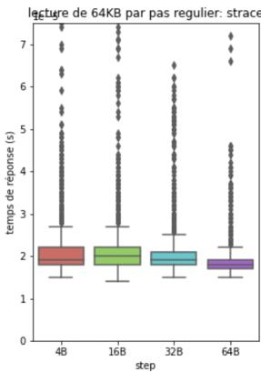
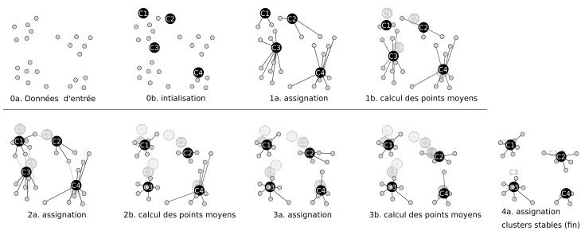

# 性能评估：工作负载

[课程入口](../README.md) · [法语课件 PDF（59 页）](2_edp.pdf) · [法语 Markdown](2_edp.md)

已于 2026-09-30 按当前 59 页法语课件核对，依次讲解引言、负载选择、特征化、合成负载和真实负载。保留必要的法文术语、公式与例子，补充解释紧接对应概念。文末提供 PDF 页码对照；原资料中的数学简写及订正见[审校说明](../审校说明.md)。

## 1 引言 (Introduction)

存在两类工作负载 (workloads/charges de travail): 真实负载 (charges réelles) 和合成负载 (charges synthétiques)。

### 1.1 真实负载 (Les charges réelles)
- 在真实系统执行期间被观察或测量
- 一次真实运行及其完整环境难以精确重现；已记录的轨迹可以重放，但只能复现轨迹中保留的事件

优点:
- 最优的代表性 (représentativité optimale)
- 细节丰富 (riches en détails)

缺点:
- 数据量大
- 原始运行环境难以完全复现
- 提取方式有时困难

### 1.2 合成负载 (Les charges synthétiques)
- 根据明确的特征创建, 以代表特定的上下文/行为 (contexte/comportement)
- 可以无限次重复 (réitérées à l’infini)

优点:
- 开发快速
- 可无限重复
- 数据量小
- 可移植性 (portabilité)

缺点:
- 代表性较低
- 大量近似 (approximations)

## 2 工作负载的选择 (Sélection)

工作负载的选择对于性能评估至关重要, 因为它决定了分析所获得结果的实用性和准确性。选择工作负载需要考虑四个主要方面:

1. 系统提供的服务 (service délivré)

2. 所需的细节级别 (niveau de détail)

3. 负载的代表性 (représentativité)

4. 负载内的时间对齐 (alignement temporel)

### 2.1 提供的服务 (Service délivré)

要分析的系统被视为一组服务的提供者。必须考虑研究所涉及的服务, 并将其与系统可能提供的其他服务明确区分。

备注: 独立于上下文 (contexte) 的服务更具代表性, 因此更适合分析, 因为它不会将结果的有效性限制在特定的上下文中。

示例: 分析数据存储时:
- 分析的系统是存储系统, 但我们考虑磁盘, 因为它是提供所分析服务的组件
- 用于分析的指标 (métrique) 应该在系统级别而非磁盘级别。应该使用平均响应时间 (temps de réponse moyen)、TPS 吞吐量 (débit en TPS) 等, 而不是磁盘访问时间

### 2.2 细节级别 (Niveau de détail)

#### 2.2.1 与评估方法的关系
- 数学建模 (modélisation mathématique) 需要较少的细节 (通常使用平均值或分布)
- 仿真 (simulation) 和测量 (mesure) 使用带时间戳的负载: 跟踪 (traces) 或可执行负载 (charges exécutables)

#### 2.2.2 跟踪处理

跟踪通常数据量大且细节丰富:
- 使用高层跟踪以减少要分析的数据量
- 根据获得的结果和期望的结果调整跟踪的细节精度

### 2.3 代表性 (Représentativité)

测试工作负载必须代表某个应用/行为或具有共同参数的应用类别。

为了使负载能代表一个应用, 两者必须在以下方面相匹配:
- 到达率 (taux d’arrivée)
- 所需资源 (ressources demandées)
- 资源使用概况 (profil d’utilisation)

### 2.4 时间对齐 (Alignement dans le temps)

工作负载必须跟随并代表系统行为的时间变化。

可以区分几个级别:
- 弱 (Faible): 仅给出时间行为的趋势
- 强 (Fort): 准确追踪系统中发生的所有事件
- 中等 (Intermédiaire): 追踪构成系统行为趋势的关键变化

### 2.5 其他选择考虑因素

> 校注：负载高低的“最好／最坏”取决于考察吞吐量还是响应时间；真实负载的原始运行难以完全复现，但记录的轨迹可重放。

#### 2.5.1 校准结果的良好使用

负载级别反映系统可以运行的状态:
- 低负载：观察排队较少时的基础响应时间
- 典型负载：代表平时的使用状态
- 接近饱和的高负载：观察吞吐能力以及响应时间是否快速增长

“最好／最坏”必须针对具体指标判断：高吞吐量不代表低响应时间。

#### 2.5.2 重复性 (Répétition)

使用相同负载每次执行获得” 相同” 的结果。

备注: 引入结果高度可变性的负载不太理想, 因为它们会产生较大的置信区间 (intervalles de confiance)。

### 2.6 置信区间 (Intervalle de confiance)

置信区间描述对总体参数（此处为均值）估计的不确定性。95% 置信水平指：反复抽样并使用同一方法构造区间时，长期约 95% 的区间包含真实均值；不是说某个已经算出的固定区间有 95% 的概率包含固定的总体均值。

在置信水平相同的条件下，区间越窄，估计越精确。对同一批数据，提高置信水平会使区间变宽。

#### 2.6.1 置信区间的计算

对独立样本，在均值的正态近似适用时：

$$
\left[\bar X-z_{1-\alpha/2}\frac{s}{\sqrt n},\quad \bar X+z_{1-\alpha/2}\frac{s}{\sqrt n}\right].
$$

其中 $1-\alpha$ 是置信水平，$s$ 是样本标准差。正态总体且方差未知时，使用 $t_{1-\alpha/2,n-1}$。

> 校注：原笔记沿用课件中的粗略对应关系。标准正态的 1、2、3 倍标准差范围约覆盖 68.27%、95.45%、99.73%；双侧 95%、99% 的临界值分别约为 1.960、2.576。

## 3 工作负载的特征化 (Caractérisation)

无论工作负载类型如何, 我们都提取关键特征来代表研究的上下文。

### 3.1 目的 (Intérêt)
- 表示/识别研究上下文
- 生成与真实工作负载相关的合成工作负载, 但可以无限重复

### 3.2 实施 (Implémentation)

基于统计技术, 如: 平均值、离散因子、简单和多重直方图等。

### 3.3 平均值和离散因子 (Moyennes et facteurs de dispersion)

#### 3.3.1 平均值 (Moyennes)

最简单的技术: 用单个值来表征负载, 该值总结了所研究参数在负载中可能取的所有值, 从而提供其趋势信息。

存在多种平均值 (算术、几何、调和等), 每种的使用根据所分析的参数更为合适。

设 $( x _{1} , x _{2} , \ldots , x _{n} )$ 为参数 X 在分析的负载中可能取的值。

算术平均值 (Moyenne arithmétique):

$$
\bar{X} = \frac{1}{n} \sum_{i = 1} ^{n} x _{i}
$$

几何平均值 (Moyenne géométrique):

$$
\bar{X} = \left(\prod_{i = 1} ^{n} x _{i}\right) ^{1 / n}
$$

调和平均值 (Moyenne harmonique):

$$
\bar{X} = \frac{n}{\frac{1}{x _{1}} + \frac{1}{x _{2}} + \cdots + \frac{1}{x _{n}}}
$$

示例:
- 平均响应时间 (算术)
- 总体缓存未命中率：总未命中次数 / 总访问次数，等价于按访问次数加权的算术平均
- 等距离路段的平均速度：调和平均；等时间段则使用算术平均

#### 3.3.2 加权平均值 (Moyenne pondérée)

加权平均值是一种平均值, 其中所考虑负载中的每个不同值都与确定其权重的系数相关联。

算术加权平均值:

$$
\bar{X} = \frac{\sum_{i = 1} ^{n} p _{i} x _{i}}{\sum_{i = 1} ^{n} p _{i}}
$$

其中 $p_i$ 为非负权重，且权重总和大于零。

#### 3.3.3 离散因子 (Facteur de dispersion)

仅有平均值是不够的, 特别是当参数可能取的值存在很大离散 (variabilité) 时。

离散度由方差 (variance) 估计:

$$
\operatorname{var} (X) = \sigma^{2} = \frac{1}{n - 1} \sum_{i = 1} ^{n} (X _{i} - \bar{X}) ^{2}
$$

> 校注：本段沿用课件的 σ 记号，但分母 n−1 给出的是样本方差估计，通常记作 s²，以区别于总体方差。变异系数适用于有意义的比率尺度且均值非零的情形；样本标准差为零只表明这些观测值相同。

由此推导出标准差 (écart type):

$$
\sigma = \sqrt{\operatorname{var} (X)}
$$

常使用变异系数 (coefficient de variation) 或相对标准差:

$$
\sigma / \bar{X}
$$

备注 1：样本标准差为零，说明本次观测值都相同，不能据此保证未来运行中的参数始终不变。

备注 2: 如果标准差较高, 更适合将参数值组织成类别。

### 3.4 分位数和直方图 (Quantiles et histogrammes)

#### 3.4.1 分位数定义 (Quantiles: définition)

分位数是将有序列表以规则间隔划分为 q 个等效部分的点。

##### 最常用的分位数:
- 100-分位数或百分位数 (centiles): 将样本分为 100 份
- 10-分位数或十分位数 (déciles): 将样本分为 10 份
- 4-分位数或四分位数 (quartiles): 将样本分为 4 份
- 2-分位数或中位数 (médiane): 将样本分为 2 份

#### 3.4.2 分位数计算 (Quantiles: calcul)

对比例 $p\in(0,1)$，一种经验分位数定义是 $Q_p=\inf\{x:F_n(x)\ge p\}$，即至少比例 $p$ 的观测值不大于 $Q_p$。分成 $q$ 份与取比例 $p$ 是两种记法，不应混淆；软件还可能使用插值约定。示例：
- 第一个十分位数 (10-分位数) 是使至少 10% 的观测值不大于它的最小样本值
- 第三个四分位数 (4-分位数) 是使至少 75% 的观测值不大于它的最小样本值

#### 3.4.3 示例

| 值 | 4 | 7 | 9 | 11 | 13 | 15 | 18 |
| --- | --- | --- | --- | --- | --- | --- | --- |
| 出现次数 | 6 | 5 | 10 | 6 | 2 | 7 | 4 |
- 第 1 个四分位数 = 7，至少 25% 的值不大于它
- 第 3 个四分位数 = 15，至少 75% 的值不大于它
- 2-分位数 (中位数) = 9，第 20、21 个观测值均为 9

#### 3.4.4 四分位距 (L’écart inter-quartile)

四分位距为 $Q_3-Q_1$，应结合数据单位与量级判断它的大小。

较大 (或较小) 的四分位距表示异质 (或同质) 分布。

在前面的例子中，$Q_3-Q_1=15-7=8$。它描述中间一半观测值的跨度；是否算“大”，还需结合数据单位和应用场景判断。

#### 3.4.5 中位数 (Médiane)

2-分位数的另一个名称, 表示有序样本 (ASC) 的中心值。

它不像平均值那样受异常值的影响。

中位数计算:
- 如果样本有 (2n+1) 项, 中位数 $= u _{n + 1}$
- 如果样本有 2n 项, 中位数 $\textstyle{\frac{u _{n} + u _{n + 1}} {2}}$

#### 3.4.6 示例 1: 中位数、平均值和众数 (Mode)

| 值 | 4 | 7 | 9 | 11 | 13 | 15 | 18 |
| --- | --- | --- | --- | --- | --- | --- | --- |
| 出现次数 | 6 | 5 | 10 | 6 | 2 | 7 | 4 |
- 加权平均值:10.45
- 中位数：9（第 20、21 个观测值均为 9）
- 众数:9(最频繁的值)

#### 3.4.7 示例 2: 中位数、平均值和众数

| 值 | 32 | 41 | 48 | 58 | 60 | 97 | 124 |
| --- | --- | --- | --- | --- | --- | --- | --- |
| 出现次数 | 15 | 10 | 15 | 15 | 15 | 2 | 6 |
- 加权平均值:55.4(异常值的影响)
- 中位数：48（第 39、40 个观测值均为 48）
- 众数:32, 48, 58, 60(最频繁的值)

#### 3.4.8 可变性的图形表示

> 校注：箱线图须注明须线规则，5%／95% 分位数只是其中一种约定。

箱线图 (Box plot/boîte à moustache) 是一种统计图形工具, 当样本中观察到很大的可变性时, 它提供了非常合适的表示。

用途:
- 以清晰的视觉方式获得样本 50% 的范围 (位于 25% 和 75% 之间)
- 中位数和平均值的位置
- 异常值 (outliers)
- 对应于样本 5% 和 95% 的点距离箱体的偏差被表示出来

图中横轴为访问步长，纵轴为响应时间。先比较中位数和箱体，再观察高延迟点：典型请求相近，并不意味着长尾表现相同。须线的具体规则需要由作图方法确认，不能仅凭图片认定它就是 5%／95% 分位数。

#### 3.4.9 可变性的更精细分析

当可变性加剧显示出异质样本时:

必须优先通过分类技术之一 (聚类/clustering) 识别组成初始样本的这些类别, 并分别分析每个类别。

### 3.5 分类 (Classification)

#### 3.5.1 k-means 技术

> 校注：k-means 需要数值特征，类别特征须先作适当编码；编码和距离选择会影响结果。

k-means 技术允许进行有效的分类, 基于样本不同元素 (点) 之间的距离或间隔的计算。

间隔可以是定量的 (时间、大小、吞吐量) 和定性的 (事件到达)。

#### 3.5.2 k-means 分类

在 HPC 中, 分析的数据最常是定量的, 间隔度量是: 欧几里得距离 (distance euclidienne)

##### k-means 算法步骤:

1. 选择 C 个点形成要构建的 c 个类的中心 Ctr。此选择对收敛有重要影响

2. 通过计算每个点到中心 Ctr 的距离形成类, 并将它们关联到最近中心的类

3. 计算新中心 $\operatorname{C t r} _{\operatorname{n e w}} .$ : 前面形成的类的质心 (barycentres)

4. 用 $( \mathrm{C t r} \gets \mathrm{C t r} _{\mathrm{n e w}} )$ 重复步骤 2 和 3 直到收敛

#### 3.5.3 质心计算

集合 (子样本) 的质心或重心 (centre de gravité) 计算公式:

$$
G = \frac{1}{\sum_{i = 1} ^{N} p _{i}} \sum_{i = 1} ^{N} p _{i} n _{i} \quad \text{其中} \sum_{i = 1} ^{N} p _{i} \neq 0
$$

在点具有等价权重的情况下:

$$
G = \frac{1}{N} \sum_{i = 1} ^{N} n _{i}
$$

#### 3.5.4 收敛条件

当一次迭代的类与前一次迭代的类相同时, 达到收敛。

可能在定义的迭代次数后停止 (不考虑类的条件)。

图中的 0a 是输入数据，0b 初始化四个中心；随后交替执行“分配到最近中心”和“重新计算质心”，直到 4a 中的分组保持稳定。

### 3.6 其他工具: 直方图 (Histogrammes)

#### 3.6.1 简单直方图

最常用的类型是简单或单参数直方图。它突出显示参数可能取的相似值的数量。

直方图是观察值/分位数表示工具 (通过排序、实验测量批次混合) 与概率定律/分布描述 (例如正态定律) 之间的联系。

#### 3.6.2 多重直方图 (Histogrammes multiples)

当多个参数相关时使用。最常见的是 2 到 3 个参数。

对于 2 参数直方图, 使用不同高度的” 塔” 作为棋盘上的棋子。

## 4 合成工作负载 (Workloads synthétiques)

### 4.1 要生成的参数 (Paramètres à générer)

在高性能计算中最常用来表征负载的参数是:

1. 负载的时序 (timing)

2. 访问地址 (adresses d’accès)

3. 负载源的数量 (nombre de sources)

4. 执行/服务时间 (temps d’exécution/service)

它们可能取的值使用概率定律生成。

### 4.2 生成: 时序 (Timing)

#### 4.2.1 到达间隔时间 (Temps d’inter-arrivées)

指令/访问请求 (缓存、磁盘等)/任务的到达日期生成:
- 从参考日期开始。此日期可以是零 (系统启动) 或对应于事件到达的日期
- 根据频率, 确定被分析系统所承受的压力
- 根据使用模式，刻画应用对系统的使用行为

#### 4.2.2 到达率或频率/吞吐量

记为 λ, 确定在一个时间单位内提交给系统的指令/请求/任务数量。

在生成到达间隔时间时使用, 结合系统的使用模式, 以更好地代表合成负载。

##### 使用类型:
- 固定使用 (utilisation fixe)
- 普通使用 (utilisation ordinaire)
- 突发使用 (utilisation en rafales)
- 周期性使用 (périodiques) (ON/OFF), 重尾 (heavy tailed) 等

#### 4.2.3 固定使用 (Utilisation fixe)

确定负载时序的日期由固定时间 δt 分隔。

到达是周期性的。

因此不需要概率定律来生成日期。这通过步长为 δt 的增量过程完成。

$$
\mathrm{date} _{i} = \mathrm{date} _{\mathrm{ref}} + i \times \delta t
$$

#### 4.2.4 普通使用 (Utilisation ordinaire)

在速率为 $\lambda>0$ 的齐次泊松过程模型中，长度为 $\Delta$ 的时间窗口内的到达数量服从 $\operatorname{Poisson}(\lambda\Delta)$；相邻到达之间的等待时间独立，服从 $\operatorname{Exp}(\lambda)$，均值为 $1/\lambda$。泊松分布描述数量，指数分布描述间隔。

##### 生成到达日期:

1. 生成遵循 $(0,1)$ 上均匀分布（排除端点） (loi Uniforme) 的随机变量 u 的值

2. 使用此值计算到达间隔时间:

$$
\delta t = - \frac{1}{\lambda} \ln(u)
$$

3. 当前指令/请求/任务的日期由前一个的日期加上此 δt 获得

#### 4.2.5 突发使用 (Utilisation en rafales)

到达以突发 (bursts) 形式发生, 遵循泊松定律, 突发大小遵循参数为 p 的几何定律 (loi géométrique),对应于突发平均大小的倒数。

##### 生成到达日期分两步:

1. 生成突发大小

2. 生成组成工作负载的事件的到达时间

突发大小生成: 突发大小对应于其事件数量。

1. 给随机变量 u 赋予遵循 $(0,1)$ 上均匀分布（排除端点）的值

2. 使用此值计算突发大小:

$$
G (p) = \left\lceil \frac{\ln(u)}{\ln(1 - p)} \right\rceil
$$

##### 生成事件到达时间:

1. 按指数分布生成突发之间的间隔，再累加得到到达时刻（泊松过程）

2. 生成其大小 (前面描述), 生成在此日期到达的该数量的事件

存在指定突发内事件分布的变体。

公式要求 $0<p<1$，生成的突发大小为正整数，均值为 $1/p$；$p=1$ 时直接取大小 1。区分“突发到达率”和“事件到达率”：若每单位时间平均有 $\lambda_b$ 个突发，大小与到达时刻独立，则事件平均到达率为 $\lambda_b/p$。

### 4.3 生成: 地址 (Addressing)

> 校注：离散地址应按范围取整，例如 $\lfloor uM\rfloor$，其中 $0\le u<1$、$M$ 为地址个数。

对缓存/磁盘和其他存储的访问地址可以均匀分布在整个地址空间上, 也可以显示某种空间局部性(localité spatiale), 集中在某些区域 (热点/hot spots)。

#### 4.3.1 均匀分布

地址生成遵循均匀定律。

#### 4.3.2 热点 (hot spots)

地址生成遵循均匀定律, 在组成热点的区域上有集中因子。

##### 均匀地址生成:

1. 在区间 $[0,1)$ 中生成均匀随机数 $u$

2. 将这些地址适配到要分析系统的地址空间大小:

$$
\mathrm{adr}=\lfloor uM\rfloor\in\{0,\ldots,M-1\}
$$

热点生成:
- 将空间细分为子集
- 确定其中最活跃的子集
- 将集中因子 (a) 关联到这些活跃区域

备注: 每个区域关联一个因子 a。对于活跃区域，$a > 1$ ; 对于其他区域，$a = 1$

### 4.4 生成: 源数量 (Nombre de sources)

负载可以来自单个用户/应用 (单源负载) 或多个 (多源负载)。

#### 4.4.1 单源负载

见前述。

#### 4.4.2 多源负载

本节给出用 $k$ 阶 Erlang 分布生成到达间隔的一种模型。

> 校注：$k$ 表示独立指数等待阶段的数量。多个独立泊松源叠加后仍是泊松过程，不能根据源数量直接推断 Erlang 间隔。

备注：$\operatorname{Erlang}(1,\lambda)=\operatorname{Exp}(\lambda)$，其等待时间是指数分布，不能写成离散的泊松计数分布。

生成 k 阶段等待时间 (k > 1): 到达间隔时间采用 k 阶 Erlang 定律, 其中 $k$ 是等待阶段数。下式的阶段速率为 $k\lambda$，总等待时间均值为 $1/\lambda$，各 $u_i$ 须独立。

1. 独立生成 $k$ 个均匀随机数 $u_1,\ldots,u_k\in(0,1)$

2. 使用这些值和目标到达率 $\lambda$ 计算等待时间：

$$
t = - \left(\frac{1}{\lambda k}\right) \times \ln \left(\prod_{i = 1} ^{k} u _{i}\right)
$$

## 5 真实工作负载 (Workloads réels)

真实负载可以来自两个来源:

1. 在观察系统上执行用户应用期间收集

2. 在观察系统上执行基准测试 (benchmarks) 期间收集

### 5.1 基准测试 (Benchmarks)

#### 5.1.1 定义

用户代码的一部分, 最能表征该应用的行为。

#### 5.1.2 示例
- 计算: SPEC 基准测试、Linpack、Livermore、NAS
- 输入/输出: Bonnie、IOzone

### 5.2 用户应用 (Applications utilisateurs)
- 执行要分析的用户应用或代表要分析类别的应用
- 收集此执行期间生成的负载
- 在将来的不同执行上下文中可能重用它们, 或
- 推导出主要特征并用分布定律表示它们, 以增加可能的分析案例

#### 5.2.1 注意事项

在执行用户应用之前, 明确要测量什么, 并准备提取由此产生的负载的工具。

更多信息: 参见几周后的测量课程 (Cours Mesure)

### 5.3 真实工作负载: 参数

无论收集涉及基准测试还是用户应用:

它专注于改变系统状态的事件:
- 上下文切换 (changement de contexte)
- 磁盘寻道 (Seek)
- 消息接收或发送等

包括它们的日期、一个时间单位内的数量、大小等。

## 课件页码对照

以下采用 PDF 阅读器页码，包含封面。第 1–3 页是课程标题与目录，其余内容按原顺序展开。

| PDF 页码 | 中文讲义位置 |
|---|---|
| 1–3 | 课程标题与五部分目录 |
| 4–5 | §1：真实与合成负载 |
| 6–8 | §2–2.1：选择原则与服务边界 |
| 9–10 | §2.2：细节级别 |
| 11–12 | §2.3–2.4：代表性与时间对齐 |
| 13–15 | §2.5–2.6：负载级别、重复性与置信区间 |
| 16–20 | §3.1–3.3.2：特征化与各类平均值 |
| 21–23 | §3.3.3：方差、标准差与变异系数 |
| 24–30 | §3.4.1–3.4.7：分位数与两组数据例子 |
| 31–33 | §3.4.8–3.4.9：箱线图与分组分析 |
| 34–39 | §3.5：算法、质心、收敛与图例 |
| 40–41 | §3.6：单参数与多参数直方图 |
| 42 | §4.1：合成负载的四类参数 |
| 43–46 | §4.2.1–4.2.4：到达率、固定间隔与指数间隔 |
| 47–49 | §4.2.5：突发大小与到达时刻 |
| 50–52 | §4.3：均匀地址与热点 |
| 53–54 | §4.4：多源与 Erlang 模型 |
| 55–56 | §5–5.1：真实负载与基准测试 |
| 57–58 | §5.2：运行、采集与复用 |
| 59 | §5.3：采集事件及属性 |
