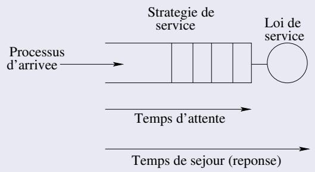
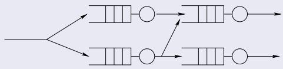
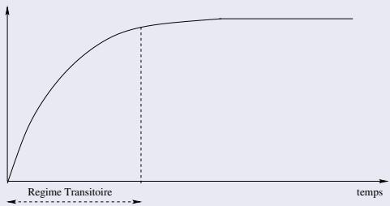
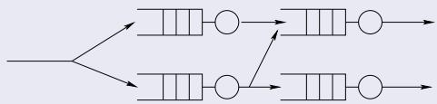
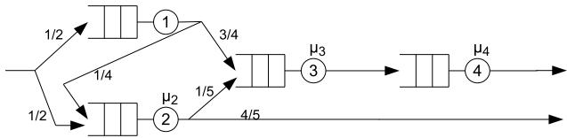
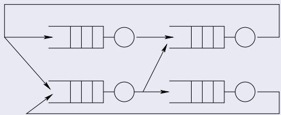
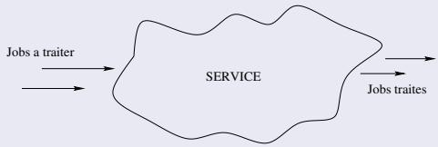

# Cours 3 — Modélisation mathématique

Soraya Zertal · Master 2 CHPS · Li-PaRAD / UVSQ

[课程入口](../README.md) · [教师课件 PDF](3_edp.pdf)

保留课件正文顺序，合并连续重复的幻灯片标题；内容订正在相应位置标为“校注”，依据见[审校说明](../审校说明.md)。

## Introduction

### Définition

La modélisation mathématique est un outil relativement simple, qui consiste en l’abstraction du système réel en un ensemble de fonctions mathématiques, représentant ses principales fonctionnalités/services afin d’analyser le comportement dudit système.

### Formalismes de description

Le système peut être décrit par différents formalismes : files d’attente, chaines de Markov, réseaux de Petri...etc

## Introduction aux files d’attente

### Files d’attente

Une théorie mathématique, basée sur les probabilités et utilisée pour l’évaluation des performances des systèmes où des clients peuvent arriver et demandent l’acquisition de ressources pour une certaine durée.

Certains clients doivent donc patienter avant d’être servi et quitter le système.

La file d’attente est alimentée par le flux d’arrivée des clients et vidée par les serveurs (ressources).

Pour le modèle M/M/1 à capacité infinie étudié ici, un régime stationnaire exige $\lambda<\mu$. La théorie des files d’attente traite aussi les régimes transitoires et les systèmes saturés.

> 校注：稳定条件限制的是本节稳态公式的使用范围，不是整个排队论的适用范围。

## Modélisation analytique : intérêt et limitation

### Intérêt

La modélisation mathématique permet l’évaluation d’un nombre considérable de configurations possibles du système à analyser ainsi que des charges qu’il est susceptible de supporter.

### Limitation

Les hypothèses et les approximations sur lesquelles se base la modélisation peuvent restreindre le champ d’application de ses résultats et impacter leur précision.

## Vocabulaire

$$
\begin{array}{c} \text{Ressource (CPU, mémoire, disque…)}\equiv\text{serveur} \\ \text{Job, processus, requête I/O}\equiv\text{client} \end{array}
$$

### Définition

Les clients attendent dans une file que le serveur soit libre pour les servir.

Le serveur sélectionne selon une stratégie définie, un client en attente dans la file à servir.

## Modèles de files d’attente

Figure: File d’attente élémentaire

### Stratégies de sélection

FIFO premier arrivé dans la file, le premier servi

LIFO dernier arrivé dans la file, le premier servi

Random aléatoire (au hasard)

Round Robin cyclique

Time sharing (TS) temps partagé, valable surtout pour la ressource processeur

## Réseaux de files d’attente

### Connecter les files d’attente ...

Les serveurs et les files peuvent être interconnectés pour former un réseau de files d’attente

Figure: Réseau de files d’attente

## Régime permanent et transitoire

### Régime transitoire

Régime d’évolution d’un système qui n’a pas encore atteint son régime stable ou permanent.

Il peut apparaitre lors de l’amorce du système ou de sa modiffication.

### Régime permanent

Régime de stabilité que le système atteint aprés un certain temps de fonctionnement. Dans un régime stationnaire, la distribution des états est invariante par translation du temps. Un régime périodique établi reste dépendant de la phase et doit être distingué de la stationnarité stricte.

## Réseaux de files d’attente : paramètres

### Paramètres de performance

Dans un réseau de files d’attente, ils se définissent aussi bien dans le régime transitoire que permanent par :

Débit ou fréquence d’arrivée et de sortie

Nombre moyen de clients dans le système

Temps moyen de séjour

Taux d’utilisation du serveur

## Réseaux de files d’attente : stabilité

### Condition de stabilité

La stabilité d’un système n’a de sens que pour le régime permanent

Une condition nécessaire de conservation du flux est :

Le débit moyen en entrée est égal au débit moyen en sortie dans le régime stationnaire considéré.

> 校注：仅凭长期流入流出相等，不能推出稳定性。无限容量 M/M/1 还要求 $\rho<1$，临界值 $\rho=1$ 不存在可归一化的稳态分布。

## Topologies et classes

Selon leurs topologies, les réseaux de files d’attente peuvent être:

Ouverts : des clients arrivent de l’extérieur et quittent le réseau ; des boucles internes de routage restent possibles.

Fermés : une population fixe circule dans le réseau, sans arrivée ni départ externe.

## Réseaux de files d’attente ouverts

### Définition

Un réseau de files d’attente ouvert est un réseau où :

1. Les clients arrivent d’une source externe,

2. Sont servis par les différents serveurs,

3. Peuvent se terminer complètement ou génèrent de nouveaux clients.

### Remarques

Tous les clients dans de tels réseaux se terminent et quittent le système un jour.

Un nombre illimité de clients compose donc un flux entrant et sortant du système.

### Exemple

Figure: Réseau de files d’attente ouvert

### Réseaux de jackson

Mono-classe de clients

Les arrivées Poissonniènes

Un serveur par station, avec temps de service exponentiels indépendants dans le modèle de Jackson présenté ici

File de capacité illimitée, Discipline FIFO

Routage probabiliste

### Exemple :

Figure: Réseau de Jackson

Calcul des taux d’arrivées :

$$
\lambda_{1} = \frac{\lambda}{2}, \lambda_{2} = \frac{5 \lambda}{8}, \lambda_{3} = \frac{\lambda}{2}, \lambda_{4} = \frac{\lambda}{2}
$$

## Réseaux de files d’attente fermés

### Définition

Un réseau de files d'attente fermé a un nombre fixe de clients qui circulent à travers les différents serveurs et files d'attente. La sortie est directement connectée à l'entrée du réseau.Donc, il n y a ni arrivée et ni départ dans ce réseau.

### Remarques

Un réseau fermé représente une population finie de clients. Cela ne fixe pas, à lui seul, une capacité de buffer propre à chaque station.

La résolution de tels modèles reste plus complexe.

### Exemple

Figure: Réseau de files d’attente fermé

## Hypothèses

A considérer avant la modélisation sont :

### Equilibre du flux des clients

Le nombre de clients sortants doit être équivalent à celui des clients entrants en considérant une observation à long terme.

### Comportement à une étape

A chaque moment, seul un client peut entrer ou sortir du système. L’état du système change donc de manière incrémentale

### Remarques

Concernant le comportement à chaque étape :

Les arrivées ainsi que les départs multiples ne sont pas autorisés.

Les mouvements simultanés des clients entre les files d’attente au sein du même système sont non autorisés.

### Homogénéité

Le taux moyen d’arrivée et le taux moyen de service sont indépendants de l’état du système.

### Exclusivité

Un client peut se trouver au niveau d’un seul serveur (en service ou en attente).

Un client ne peut pas demander deux services simultanément et quand il obtient un, il est le seul à être servi par ce serveur.

### Service non-bloquant

Le serveur est seul maître du service fourni. Celui-ci ne peut être contrôlé par aucun composant du système.

## Notation

Dans le reste du cours, on utilisera la notation suivante:

| Symbole | Commentaire |
| --- | --- |
| s | temps de service moyen pour un client |
| $\mu$ | taux de service (1/s) |
| $\lambda$ | taux d'arrivée moyen |
| $\rho$ | l'intensité du trafic ( $\lambda/\mu$ ) |
| r | temps de réponse moyen |
| w | temps d'attente moyen |
| q | nombre moyen de clients dans la file d'attente |
| n | nombre de clients dans le système (en attente + en service) |
| U | fraction d'utilisation du système |
| a | nombre d'arrivées pendant un temps d'observation T |
| d | nombre de départs pendant un temps d'observation T |

## L’analyse opérationnelle

### Vue globale

L’analyse débute en considérant le système à analyser comme une boite noire à l’entrée de laquelle arrivent des jobs (clients) à traiter (servir) et en sortie de laquelle figure des jobs traités.

Figure: Vue globale de l’analyse opérationnelle

### Caractérisation

Les caractéristiques du système sont évalués par mesure ou par hypothèse (utilisateur,fabriquant/constructeur).

L’évaluation du comportement du système pourra alors s’effectuer dans ce contexte précis.

### Lois d’utilisation

### Taux d’arrivée

On observe le système pendant une période T, durant laquelle a clients sont arrivés,

on en déduis le taux d’arrivée λ :

$$
\lambda = \frac{a}{T}
$$

### Lois d’utilisation

### Utilisation du serveur

Si le serveur a été occupé pendant seulement b unités de temps durant toute la période d'observation T,
On en déduis l'utilisation du serveur U :

$$
U = \frac{b}{T} = \frac{b}{d} \times \frac{d}{T}
$$

d étant le nombre de clients servis, $\frac{b}{d}$ est le temps moyen pour servir un client, et $\frac{d}{T}$ le taux de départ des clients.

### Lois d’utilisation

### Utilisation du serveur

Selon l’hypothèse d’équilibre, le flux en entrée doit être équivalent à celui en sortie, d’où :

$$
U = \frac{b}{d} \times \frac{d}{T} = s \times \frac{d}{T}
$$

$$
U = \lambda \times s
$$

### L’intensité du trafic

$$
\rho = \frac{\lambda}{\mu}
$$

$\rho > 1$ : signifiant que le taux d’arrivée est supérieur à celui du départ.

Le nombre de clients en attente dans la file va augmenter et engendrer des temps d’attente infinis.

⇒ Le système n’est pas stable

$$
\rho = \frac{\lambda}{\mu}
$$

- $\rho < 1$ : signifiant que le système est dans un état stable. $\Rightarrow$ L'utilisation $U$ n'excède jamais les 100%.

(1 − ρ): la probabilité que le serveur soit inactif.

### Loi de Little

Une loi générale qui peut s’appliquer à tout système.

Pas d’hypothèse particulière sur les distributions d’inter-arrivées et de service

Les moyennes à long terme doivent exister et utiliser la même frontière du système et le même flux de clients.

La seule condition est la stabilité ⇒ la satisfaction de l’hypothèse de l’équilibre des flux et donc ne concerne que le régime permanent.

Le nombre moyen de clients (N), le temps moyen de séjour ou (t) et le débit moyen λ d’un système en régime permanent se relient selon la loi :

$$
N = t \times \lambda
$$

### Loi de Little : importance

Permet de calculer l’un des trois paramètres (N,t,λ) en fonction des 2 autres.

Peut s’appliquer à n’importe quel système :

Un buffer uniquement

Un buffer + serveur

Le serveur de la file

### Un buffer uniquement

N représente le nombre moyen de clients dans la file d’attente, t représente le temps moyen d’attente avant le service et λ le flux d’arrivée (ou de départ) des clients.

### Un buffer + serveur

N représente le nombre moyen de clients dans le système (dans la file ou en service), t représente le temps moyen de séjour (attente et service) et λ le flux d’arrivée.

### Le serveur de la file

N représente le nombre moyen de clients en service, t représente le temps moyen de service et λ le flux d’arrivée.

## L’analyse stochastique

### Limite des lois d’utilisation et de Little

Elles ne considèrent aucune hypothèse concernant les lois de probabilité des inter-arrivées et du service.

Elles sont complètement indépendantes des distributions

### Intérêt de l’analyse stochastique

La connaissance des distributions permet d’effectuer une analyse stochastique et d’affiner ainsi l’analyse du système en fournissant des résultats plus détaillés que ceux de l’analyse opérationnelle.

### Définition

Avec l’analyse stochastique, le système n’est plus une boite noire. Ce qui permet d’avoir des résultats bien détaillés sur le système analysé, tel que :

le temps d’attente moyen pour un client,

le nombre moyen de clients dans la file,

la probabilité d’avoir un certain nombre de clients en attente,

le temps de réponse moyen...

### Notation de Kendall

Le système est composé d’une file d’attente et d’un ou plusieurs serveurs. Il sera représenté par le mot A/S/C/B/N/D avec :

A : La distribution du processus d’arrivée, symbolisée par M pour Exponentielle (cas typique), D pour constante, $E _{k}$ pour Erlang, G pour général.

S : La distribution du service, utilisant des lois similaires à celles pour le processus d’entrée.

C : le nombre de serveurs identiques dans le système. Si un système contient des serveurs différents, il faut le décomposer en sous systèmes ayant chacun des serveurs identiques.

B : Le nombre total de clients dans le système (sa capacité), supposé infini pour simplifier l’analyse.

N : le nombre de clients pouvant entrer au système, supposé infini pour simplifier l’analyse.

D : L’ordre ou la stratégie de service: FIFO, LIFO...etc

### Cas M/M/1

C’est le cas le plus simple :

L’arrivée est Poissonienne de taux λ,

Le service exponentiel de taux µ,

Il y a un seul serveur,

Capacité infinie de la file (par défaut),

Nombre de clients pouvant entrer dans le système est infini (par défaut) et

Stratégie de service FIFO (par défaut).

Les paramètres de performance de la file ${\sf M} / {\sf M} / 1$ en régime permanent (stable) sont :

Débit La file est stable, donc il y a un équilibre entre les flux, d’ou :

$$
\mathrm{Débit} = \lambda
$$

Taux d’utilisation du serveur C’est la probabilité que le serveur soit occupé :

$$
U = \frac{\lambda}{\mu} = \rho
$$

Probabilité que le système soit vide

$$
P _{0} = 1 - \rho
$$

Probabilité qu’un client arrivant doive attendre

$$
P _{a} = \rho
$$

Nombre moyen de clients dans le système :

$$
n = \frac{\rho}{(1 - \rho)}
$$

Temps moyen de séjour se déduit de la loi de Little :

$$
r = \frac{n}{\lambda} = \frac{1}{\mu(1 - \rho)}
$$

et peut se décomposer en :

$$
\frac{1}{\mu} + \frac{\rho}{\mu(1 - \rho)}
$$

Temps passé dans la file d’attente en découle :

$$
w = \frac{\rho}{\mu(1 - \rho)}
$$

Nombre moyen de clients dans la file

$$
q = w \times \lambda = \frac{\rho^{2}}{(1 - \rho)}
$$

En régime stationnaire :

La probabilité d’avoir 0 clients dans le système est :

$$
P _{0} = (1 - \rho)
$$

La probabilité d’avoir n clients dans le système est :

$$
P _{n} = \rho^{n} P _{0}
$$

## L’analyse stochastique : cas M/M/C

Le modèle comporte $C$ serveurs identiques, chacun de taux $\mu$, et une file commune de capacité infinie. Les arrivées sont poissoniennes de taux $\lambda$ et les temps de service exponentiels indépendants. Un serveur libre prend le prochain client de la file (FIFO).

### Condition de stabilité

$$
\lambda<C\mu,\qquad a=\frac{\lambda}{\mu},\qquad \rho=\frac{\lambda}{C\mu}=\frac aC<1.
$$

> 校注（教师 PDF 第 52–55 页）：原稿先定义 $\rho=\lambda/(C\mu)$，随后却将 $\rho$ 当作 $\lambda/\mu$ 代入公式。这里用 $a$ 表示总业务量，用 $\rho$ 表示每台服务器的平均利用率，避免混用。

Le débit stationnaire vaut $\lambda$. Les autres paramètres sont :

**Probabilité que le système soit vide :**

$$
P_0=\left[\sum_{k=0}^{C-1}\frac{a^k}{k!}+\frac{a^C}{C!(1-\rho)}\right]^{-1}.
$$

**Probabilité qu’un client arrivant doive attendre (Erlang C) :**

$$
P_a=P_0\frac{a^C}{C!(1-\rho)}
    =P_0\frac{a^C}{(C-1)!(C-a)}.
$$

**Nombre moyen de clients dans le système :**

$$
n=a+\frac{\rho P_a}{1-\rho}
 =a\left(1+\frac{P_a}{C-a}\right).
$$

**Temps moyen de séjour :**

$$
r=\frac n\lambda=\frac1\mu+\frac{P_a}{C\mu-\lambda}
 =\frac1\mu\left(1+\frac{P_a}{C-a}\right).
$$

**Temps moyen d’attente et nombre moyen de clients en file :**

$$
w=\frac{P_a}{C\mu-\lambda}
 =\frac{P_0a^C}{\mu(C-1)!(C-a)^2},\qquad q=\lambda w.
$$

Les temps $r$ et $w$ sont des moyennes à long terme, et $\mu$ est le taux de chaque serveur, non le taux total.
