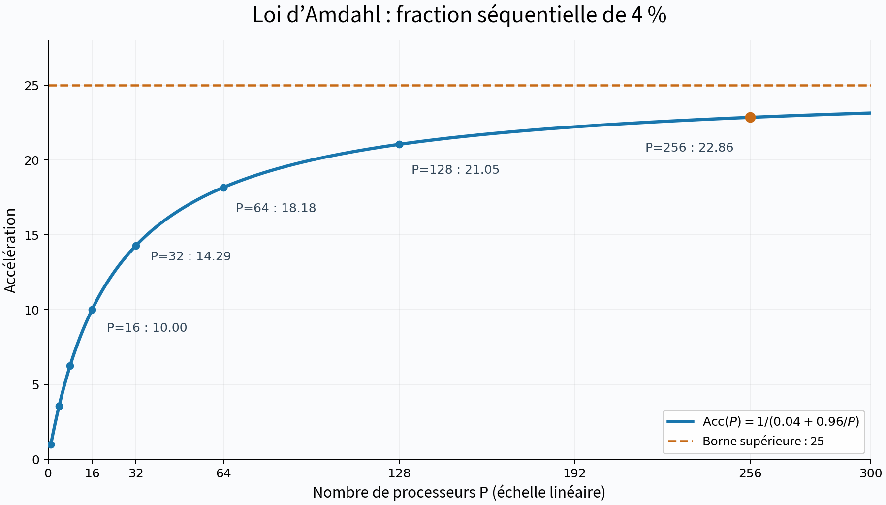
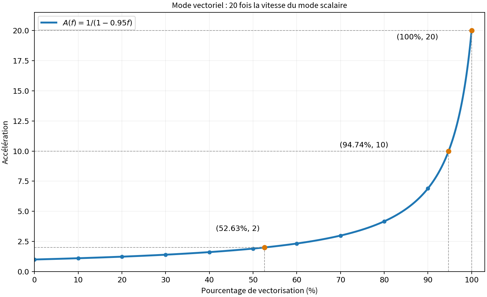

# TD1 — Métriques d'évaluation de performances

S. Zertal · Master 2 CHPS

[课程目录](../README.md) · [原始 PDF](td1_metrics.pdf) · [第一课中文笔记](../Notes/edpcm1.md)

## 1 Loi d'Amdahl

Les questions qui suivent sont indépendantes :

### 1.1 Fraction séquentielle et nombre de processeurs

La fraction séquentielle d'une application représente 4% du temps d'exécution sur un processeur. Calculer l'accélération et l'efficacité sur un multiprocesseur de $2^n$ processeurs $2\le n\le7$ . Quelle est la borne supérieure de l'accélération ?

#### Solution

La fraction séquentielle vaut $s=0.04$ et la fraction parallélisable $1-s=0.96$. En notant $T_1$ le temps séquentiel et en négligeant les surcoûts de parallélisation :

$$
T_P=T_1\left(0.04+\frac{0.96}{P}\right).
$$

La loi d’Amdahl donne l’accélération et l’efficacité :

$$
\boxed{\mathrm{Acc}(P)=\frac{T_1}{T_P}=\frac{1}{0.04+0.96/P}=\frac{25P}{P+24}},
\qquad
\boxed{E(P)=\frac{\mathrm{Acc}(P)}{P}=\frac{25}{P+24}}.
$$

Pour $P=2^n$, on obtient :

| $n$ | Processeurs $P=2^n$ | Temps relatif $T_P/T$ | Accélération $\mathrm{Acc}(P)$ | Efficacité $E(P)$ |
| ---: | ---: | ---: | ---: | ---: |
| 0 (référence séquentielle) | 1 | 1 | 1 | 100% |
| 2 | 4 | 0.28 | 3.5714 | 89.29% |
| 3 | 8 | 0.16 | 6.2500 | 78.13% |
| 4 | 16 | 0.10 | 10.0000 | 62.50% |
| 5 | 32 | 0.07 | 14.2857 | 44.64% |
| 6 | 64 | 0.055 | 18.1818 | 28.41% |
| 7 | 128 | 0.0475 | 21.0526 | 16.45% |
| 8 (complément) | 256 | 0.04375 | 22.8571 | 8.93% |

Lorsque $P\to\infty$, la partie séquentielle nécessite toujours $0.04T_1$. La borne supérieure de l’accélération est donc :

$$
\boxed{\sup\mathrm{Acc}(P)=\lim_{P\to\infty}\frac{25P}{P+24}=25.}
$$

Pour tout nombre fini de processeurs, l’accélération reste inférieure à 25. Lorsque $P$ augmente, elle tend vers 25, tandis que l’efficacité tend vers zéro.

En passant de $P=128$ à $P=256$, l’accélération passe de 21.0526 à 22.8571, soit un gain de performance d’environ 8.57 %. La partie séquentielle limite le bénéfice de processeurs supplémentaires.

### 1.2 Comparaison de deux programmes

La mesure des accélérations des programmes A et B fournit les résultats suivants :

| Procs | 2 | 3 | 4 | 5 | 6 | 7 | 8 |
| --- | --- | --- | --- | --- | --- | --- | --- |
| $\mathrm{Acc}_A$ | 1.9 | 2.73 | 3.47 | 4.16 | 4.8 | 5.38 | 5.93 |
| $\mathrm{Acc}_B$ | 1.94 | 2.72 | 3.34 | 3.82 | 4.2 | 4.49 | 4.72 |

Calculer la fraction séquentielle pour chacune des exécutions. Comment peut-on décrire le comportement parallèle des deux programmes ?

#### Solution

**1. Déterminer les fractions parallélisable et séquentielle.** On note $F_a$ la fraction parallélisable et $s$ la fraction séquentielle. La loi d’Amdahl donne :

$$
\mathrm{Acc}(P)=\frac{1}{(1-F_a)+F_a/P},\qquad s=1-F_a.
$$

$$
1-\frac{1}{\mathrm{Acc}(P)}=F_a\left(1-\frac1P\right)
\quad\Longrightarrow\quad
\boxed{F_a(P)=\frac{1-1/\mathrm{Acc}(P)}{1-1/P}
=\frac{P(\mathrm{Acc}(P)-1)}{\mathrm{Acc}(P)(P-1)}}.
$$

$$
\boxed{s(P)=1-F_a(P)=\frac{P/\mathrm{Acc}(P)-1}{P-1}}.
$$

**2. Résultats.** $F_a$ est exprimée sous forme décimale et $s$ en pourcentage.

| Processeurs $P$ | A : fraction parallélisable $F_{a,A}$ | A : fraction séquentielle $s_A$ | B : fraction parallélisable $F_{a,B}$ | B : fraction séquentielle $s_B$ |
| ---: | ---: | ---: | ---: | ---: |
| 2 | 0.9474 | 5.26% | 0.9691 | 3.09% |
| 3 | 0.9505 | 4.95% | 0.9485 | 5.15% |
| 4 | 0.9491 | 5.09% | 0.9341 | 6.59% |
| 5 | 0.9495 | 5.05% | 0.9228 | 7.72% |
| 6 | 0.9500 | 5.00% | 0.9143 | 8.57% |
| 7 | 0.9498 | 5.02% | 0.9068 | 9.32% |
| 8 | 0.9501 | 4.99% | 0.9007 | 9.93% |

Par exemple, pour le programme A avec $P=4$ :

$$
F_{a,A}=\frac{1-1/3.47}{1-1/4}\approx0.9491,
\qquad s_A=1-F_{a,A}\approx5.09\%.
$$

**3. Analyse et conclusion.** Les codes A et B restent inchangés pendant tous les tests.

- **A conserve une fraction parallélisable d’environ 95 %, soit une fraction séquentielle proche de 5 %.** Les mesures sont approximativement compatibles avec un modèle d’Amdahl à fraction séquentielle constante et ne montrent pas de croissance marquée des surcoûts de parallélisation. A se prête mieux au passage à l’échelle ; si ce modèle reste valable, sa borne idéale d’accélération est d’environ $1/0.05=20$.
- **Pour B, la fraction parallélisable passe d’environ 97 % à 90 %, et la fraction séquentielle effective d’environ 3 % à 10 %.** Puisque le code est inchangé, cette tendance indique une influence croissante des surcoûts de parallélisation, tels que les communications et la synchronisation. La fraction déduite absorbe ces surcoûts ; la partie intrinsèquement séquentielle du code n’augmente pas. B passe moins bien à l’échelle et bénéficie moins de processeurs supplémentaires.
- **Comparaison globale :** B présente une accélération légèrement supérieure pour $P=2$. À partir de $P=3$, A obtient une meilleure accélération et l’écart se creuse. A passe donc mieux à l’échelle sur l’intervalle mesuré. Sans les temps séquentiels respectifs, on ne peut pas comparer les vitesses d’exécution absolues.

### 1.3 Expression générale de l'accélération

On supposera qu'une machine parallèle (multiprocesseurs) à p processeurs permet de diviser par $p$ le temps d'exécution d'une fraction de code parallélisé. On appellera $T_1$ le temps d'exécution d'un programme sur un processeur et $T_p$ celui sur p processeurs.

**(a)** Sachant que seq est la fraction séquentielle du programme à paralléliser, exprimez l'accélération pour une machine parallèle à p processeurs. Quelle est l'accélération maximale envisageable ?

**(b)** Quelle est l'accélération pour une machine dotée d'un très grand nombre de processeurs ?

**(c)** Si seq est inversement proportionnelle à la taille n du code (nombre d'instructions). Calculez alors l'accélération. Quelle est l'accélération pour un très grand code ?

#### Solution

**(a) Accélération et borne idéale**

Notons $s=\mathrm{seq}$ la fraction séquentielle. La partie séquentielle prend un temps $sT_1$, et la partie parallélisable prend $(1-s)T_1/p$ sur $p$ processeurs. En négligeant les surcoûts de communication et de synchronisation,

$$
T_p=sT_1+\frac{(1-s)T_1}{p}.
$$

La loi d'Amdahl donne donc

$$
\boxed{\mathrm{Acc}(p)=\frac{T_1}{T_p}
=\frac{1}{s+\frac{1-s}{p}}
=\frac{p}{1+(p-1)s}.}
$$

Cette expression est la borne idéale pour $s$ et $p$ donnés : la partie parallélisable est parfaitement répartie, sans surcoût. Pour un nombre fixé de processeurs,

$$
\mathrm{Acc}(p)\leq p.
$$

Le maximum idéal $\mathrm{Acc}=p$ est atteint lorsque $s=0$, c'est-à-dire lorsque tout le programme est parallélisable.

**(b) Très grand nombre de processeurs**

Pour une fraction séquentielle fixée $s>0$,

$$
\boxed{\lim_{p\to\infty}\mathrm{Acc}(p)=\frac{1}{s}.}
$$

L'ajout de processeurs réduit uniquement le temps de la partie parallélisable. La partie séquentielle exige toujours un temps $sT_1$ et limite donc l'accélération. Si $s=0$, alors $\mathrm{Acc}=p$ et il n'existe pas de borne finie dans ce modèle idéal.

**(c) Fraction séquentielle décroissante avec la taille du code**

En prenant $s=1/n$, on obtient

$$
\boxed{\mathrm{Acc}(p,n)
=\frac{1}{\frac{1}{n}+\frac{1-1/n}{p}}
=\frac{np}{n+p-1}.}
$$

À nombre de processeurs $p$ fixé, la fraction séquentielle devient négligeable lorsque la taille du code tend vers l'infini :

$$
\boxed{\lim_{n\to\infty}\mathrm{Acc}(p,n)=p.}
$$

L'accélération tend vers l'accélération linéaire idéale et l'efficacité $E=\mathrm{Acc}/p$ tend vers $1$. La limite est alors imposée par le nombre de processeurs disponibles.

Plus généralement, si $s=k/n$, avec $k$ constant et $0\leq k/n\leq1$,

$$
\mathrm{Acc}(p,n)=\frac{np}{n+k(p-1)},
\qquad
\lim_{n\to\infty}\mathrm{Acc}(p,n)=p.
$$

### 1.4 Mode scalaire/vectoriel

Un mode d'exécution vectoriel est un mode dans lequel on effectue des opérations de haut niveau portant sur des vecteurs au même titre que l'on manipule habituellement des opérations sur de simples scalaires.

Pour cet exercice, on considèrera l'amélioration d'une machine liée à l'ajout d'un mode vectoriel. Quand un code s'exécute en mode vectoriel, il est 20 fois plus rapide qu'en mode scalaire.

Le pourcentage du nombre d'opérations effectuées en mode vectoriel est appelé pourcentage de vectorisation.

**(a)** Tracez un graphe donnant l'accélération liée au calcul réalisé en mode vectoriel en fonction du pourcentage de vectorisation.

**(b)** Quel est le pourcentage de vectorisation nécessaire pour obtenir une accélération de 2 ?

**(c)** L'accélération est maximale lorsque la totalité des instructions est effectuée en mode vectoriel. Quel est le pourcentage de vectorisation nécessaire pour obtenir la moitié de cette accélération maximale ?

**(d)** Le pourcentage de vectorisation mesuré pour les programmes est de 70%. On peut augmenter les performances en doublant la vitesse du mode vectoriel par l'intégration d'un nouveau dispositif matériel. En l'absence d'un tel dispositif, comment pourrait-on assurer les mêmes performances ?

#### Solution

**(a) Courbe d'accélération**

Notons $f\in[0,1]$ la fraction vectorisée et $T_s$ le temps d'exécution entièrement scalaire. Dans le modèle de coût uniforme des opérations utilisé ici, $f$ représente aussi leur fraction du temps d'exécution scalaire. Le mode vectoriel divise ce temps par $20$ :

$$
T=T_s\left((1-f)+\frac{f}{20}\right),
\qquad
\boxed{\mathrm{Acc}(f)=\frac{T_s}{T}=\frac{1}{1-\frac{19}{20}f}.}
$$

| $100f$ (%) | 0 | 10 | 20 | 30 | 40 | 50 | 60 | 70 | 80 | 90 | 100 |
| --- | --- | --- | --- | --- | --- | --- | --- | --- | --- | --- | --- |
| $\mathrm{Acc}$ | 1.0000 | 1.1050 | 1.2346 | 1.3986 | 1.6129 | 1.9048 | 2.3256 | 2.9851 | 4.1667 | 6.8966 | 20.0000 |

La courbe est croissante et devient particulièrement raide près de la vectorisation complète. Pour $f=0$, l'accélération vaut $1$ ; pour $f=1$, elle atteint son maximum de $20$. Même avec $90\%$ de vectorisation, l'accélération globale ne vaut qu'environ $6{,}90$.

**(b) Pourcentage nécessaire pour une accélération de 2**

En inversant la formule,

$$
\boxed{f=\frac{20}{19}\left(1-\frac{1}{\mathrm{Acc}}\right).}
$$

Pour $\mathrm{Acc}=2$,

$$
f=\frac{20}{19}\left(1-\frac12\right)=\frac{10}{19}
\quad\Longrightarrow\quad
\boxed{100f\approx52{,}63\%.}
$$

**(c) Moitié de l'accélération maximale**

L'accélération maximale vaut $20$. Pour atteindre $\mathrm{Acc}=10$,

$$
f=\frac{20}{19}\left(1-\frac1{10}\right)=\frac{18}{19}
\quad\Longrightarrow\quad
\boxed{100f\approx94{,}74\%.}
$$

Pour exploiter pleinement le matériel vectoriel, la très grande majorité des opérations doit être vectorisable : la partie scalaire restante limite l'accélération globale.

**(d) Même performance sans nouveau matériel**

Le pourcentage initial est $f=0{,}70$. Doubler la vitesse du mode vectoriel fait passer son facteur d'accélération de $20$ à $40$. On obtient alors

$$
\mathrm{Acc}_{\mathrm{new}}
=\frac{1}{0{,}30+\frac{0{,}70}{40}}
=\frac{400}{127}\approx3{,}1496.
$$

Avec le matériel initial, on peut modifier l'algorithme ou optimiser le code afin d'augmenter la fraction vectorisée à $f'$. Pour obtenir le même temps d'exécution,

$$
1-f'+\frac{f'}{20}
=0{,}30+\frac{0{,}70}{40}=0{,}3175.
$$

D'où

$$
\boxed{f'=\frac{1-0{,}3175}{0{,}95}=\frac{273}{380}\approx0{,}718421.}
$$

Il suffit donc de passer de $70\%$ à environ **$71{,}84\%$ de vectorisation**, soit une hausse de **$1{,}84$ point de pourcentage**, pour obtenir la même performance dans ce modèle. L'accélération initiale est $1/(0{,}30+0{,}70/20)\approx2{,}9851$ ; les deux améliorations augmentent la performance globale d'environ $5{,}51\%$.

## 2 Performance en MIPS/MFLOPS

Les deux questions suivantes sont indépendantes :

### 2.1 Whetstone : coprocesseur ou émulation logicielle

Un programme de test (Whetstone) contient 195578 opérations flottantes de base par itération. En considérant les types d'opérations flottantes, on obtient la décomposition suivante:

| Type d'opération flottante | Nombre |
| --- | --- |
| Addition | 82014 |
| Soustraction | 8229 |
| Multiplication | 73220 |
| Division | 21399 |
| Conversion entier vers flottant | 6006 |
| Comparaison | 4710 |
| Total | 195578 |

Whetstone a été exécuté sur une machine M cadencée par une horloge de 16.67 MHz, dotée d'un coprocesseur flottant et utilisant un compilateur Fortran. Ce compilateur permet d'utiliser au choix le coprocesseur ou bien des routines logicielles, selon les options de compilation.

L'exécution d'une seule itération de Whetstone a duré 1.08 s avec le coprocesseur et 13.6 s avec l'option logicielle. On a mesuré un CPI moyen de 10 en utilisant le coprocesseur et de 6 en utilisant l'option logicielle.

**(a)** Quel est le nombre de MIPS pour les deux exécutions ?

**(b)** Quel est le nombre total d'instructions exécutées dans les deux cas.

**(c)** En moyenne, combien faut-il d'instructions entières pour calculer chaque opération flottante par logiciel ?

**(d)** Quel est le nombre de MFLOPS pour la machine M avec le coprocesseur flottant exécutant Whetstone (on suppose que toutes les opérations flottantes du tableau précédent comptent pour une opération) ?

### 2.2 Ajout d'un coprocesseur flottant

Votre entreprise a un programme de test qui est considéré comme représentatif de vos applications typiques. Une des stations de travail d'un modèle plus ancien n'a pas d'unité flottante, et doit émuler chaque instruction flottante par une séquence d'instructions entières. Cette station de modèle ancien a un débit de 120 MIPS sur ce programme test. Un vendeur tiers offre un coprocesseur qui est destiné à donner un « coup de fouet » à votre station. Ce coprocesseur exècute chaque instruction flottante sur un processeur dédié (aucune émulation n'est nécessaire). Le débit de l'ensemble station/coprocesseur est 80 MIPS sur le même programme test. Les symboles suivants sont utilisés pour répondre aux questions.

| Symbole | Commentaire |
| --- | --- |
| I | Nombre d'instructions entières exécutées dans le programme |
| F | Nombre d'instructions flottantes exécutées dans le programme |
| Y | Nombre d'instructions entières pour émuler une instruction flottante |
| W | Temps pour exécuter le programme sur la station seule |
| B | Temps pour exécuter le programme sur l'ensemble station/coprocesseur |

**(a)** Écrire la formule du débit MIPS de chaque configuration avec les symboles de la table. Justifiez votre réponse.

**(b)** Pour la configuration sans coprocesseur, on mesure $F=8\times10^6$ , Y = 50, W = 4. Calculez I en conséquence.

**(c)** Quelle est la valeur de B ?

**(d)** Quel est le débit MFLOPS du système avec le coprocesseur.

**(e)** Votre collègue veut acquérir le coprocesseur même si le débit MIPS pour la configuration l'utilisant est moindre que celui de la station de travail seule. Est-ce que l'estimation de votre collègue est correcte ? Justifiez votre réponse.

## 3 Loi de Gustafson-Barsis

### Définition

La métrique de Gustafson-Barsis sert à calculer la capacité d'exécuter un code plus grand dans la même durée d'exécution que le problème initial en utilisant plus de processeurs. Ici, c'est le cas d'un passage du séquentiel (1 processeur) à P processeurs $P>1$ d'un code dont la fraction séquentielle est seq. Ce passage s'accompagne par une accélération de mise à l'échelle (Scaled speed up), tel que :

$$
\mathrm{Acc}_{\mathrm{scaled}}\le P+(1-P)\,\mathrm{seq}
$$

### 3.1 Accélération sur huit processeurs

Quelle est l'accélération selon Gustafson-Barsis (scaled speedup) pour une application s'exécutant sur 8 processeurs et qui passe 14% de son temps à exécuter sa partie séquentielle.

### 3.2 Passage à dix processeurs

Quelle est la fraction séquentielle maximale qu'on puisse tolérer pour garder au moins la même accélération (scaled speedup) quand le nombre de processeurs passe à 10.

## 4 Métrique de Karp-Flatt

### Définition

La métrique de Karp-Flatt sert à inclure le coût de la parallélisation sur P processeurs en considérant davantage de sources de coût et d'inefficacité. Elle se focalise sur la partie séquentielle qui prend plus d'importance avec l'augmentation du nombre de processeurs. Cette métrique se calcule par un facteur e

$$
e=\frac{\frac{1}{\mathrm{Acc}}-\frac{1}{P}}{1-\frac{1}{P}}
$$

### 4.1 Cray Y-MP/8

Soit le tableau ci-dessous, regroupant les temps d'exécution mesurés pour un code P durant ses exécutions sur la machine Cray Y-MP/8 avec différents nombres de processeurs.

| Nombre de processeurs P | Temps d'exécution (s) |
| --- | --- |
| 1 | 2.170 |
| 2 | 1.110 |
| 3 | 0.754 |
| 4 | 0.577 |
| 8 | 0.312 |

**(a)** Calculez l'accélération, l'efficacité et le facteur e de Karp-Flatt pour chacun des quatre cas (P = 2, 3, 4 et 8)

**(b)** Que pensez-vous des accélérations et efficacités obtenues ? Argumentez votre réponse.

**(c)** Qu'indiquent les valeurs du facteur e dans ce cas ?

### 4.2 Aliant FX/40

Soit le tableau ci-dessous, regroupant les temps d'exécution mesurés pour un code P durant ses exécutions sur la machine Aliant FX/40 avec différents nombres de processeurs.

| Nombre de processeurs P | Temps d'exécution (s) |
| --- | --- |
| 1 | 66.1 |
| 2 | 34.8 |
| 3 | 24.9 |
| 4 | 20.5 |

**(a)** Calculez l'accélération, l'efficacité et le facteur e de Karp-Flatt pour chacun des trois cas (P = 2, 3 et 4).

**(b)** Interprétez la variation de l'efficacité puis faites de même pour le facteur e.
