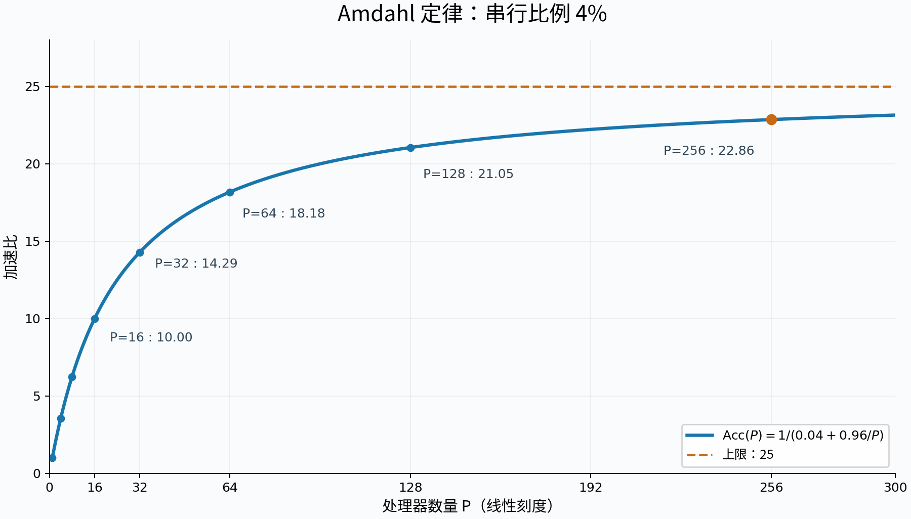
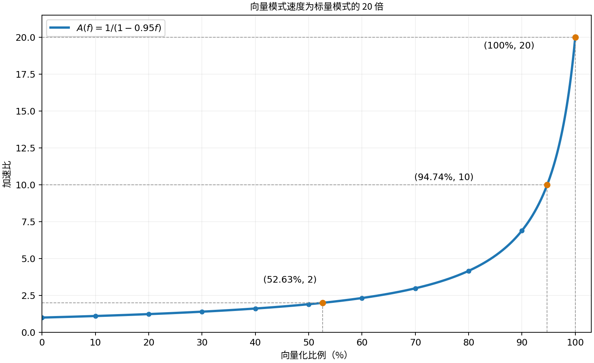

# TD1 — 性能评估指标

S. Zertal · Master 2 CHPS

[课程目录](../README.md) · [法文版](td1_metrics.md) · [原始 PDF](td1_metrics.pdf) · [第一课中文笔记](../Notes/edpcm1.md)

## 1 Amdahl 定律

以下各题相互独立。

### 1.1 串行比例与处理器数量

一个应用的串行部分占其在单处理器上执行时间的 4%。计算该应用在配备 $2^n$ 个处理器的多处理器系统上的加速比和并行效率，其中 $2\le n\le7$。加速比的上限是多少？

#### 解答

串行比例为 $s=0.04$，可并行比例为 $1-s=0.96$。设单处理器执行时间为 $T_1$，忽略并行开销，则：

$$
T_P=T_1\left(0.04+\frac{0.96}{P}\right).
$$

由 Amdahl 定律，加速比和并行效率为：

$$
\boxed{\mathrm{Acc}(P)=\frac{T_1}{T_P}=\frac{1}{0.04+0.96/P}=\frac{25P}{P+24}},
\qquad
\boxed{E(P)=\frac{\mathrm{Acc}(P)}{P}=\frac{25}{P+24}}.
$$

代入 $P=2^n$，得到：

| $n$ | 处理器数 $P=2^n$ | 相对执行时间 $T_P/T$ | 加速比 $\mathrm{Acc}(P)$ | 并行效率 $E(P)$ |
| ---: | ---: | ---: | ---: | ---: |
| 0（串行参照） | 1 | 1 | 1 | 100% |
| 2 | 4 | 0.28 | 3.5714 | 89.29% |
| 3 | 8 | 0.16 | 6.2500 | 78.13% |
| 4 | 16 | 0.10 | 10.0000 | 62.50% |
| 5 | 32 | 0.07 | 14.2857 | 44.64% |
| 6 | 64 | 0.055 | 18.1818 | 28.41% |
| 7 | 128 | 0.0475 | 21.0526 | 16.45% |
| 8（补充） | 256 | 0.04375 | 22.8571 | 8.93% |

当 $P\to\infty$ 时，串行部分的执行时间仍为 $0.04T_1$，因此加速比的上限为：

$$
\boxed{\sup\mathrm{Acc}(P)=\lim_{P\to\infty}\frac{1}{0.04+0.96/P}=25.}
$$

有限处理器数量下，加速比始终小于 25；随着 $P$ 增大，加速比趋近 25，而并行效率趋近 0。

从 $P=128$ 增至 $P=256$，加速比由 21.0526 增至 22.8571，性能仅提升约 8.57%。串行部分限制了继续增加处理器所能获得的收益。

### 1.2 两个程序的比较

测得程序 A 和 B 的加速比如下：

| 处理器数量 | 2 | 3 | 4 | 5 | 6 | 7 | 8 |
| --- | --- | --- | --- | --- | --- | --- | --- |
| $\mathrm{Acc}_A$ | 1.9 | 2.73 | 3.47 | 4.16 | 4.8 | 5.38 | 5.93 |
| $\mathrm{Acc}_B$ | 1.94 | 2.72 | 3.34 | 3.82 | 4.2 | 4.49 | 4.72 |

计算每次执行对应的串行比例。如何描述这两个程序的并行性能表现？

#### 解答

**1. 反求可并行比例与串行比例。** 记可并行比例为 $F_a$，串行比例为 $s$。根据 Amdahl 定律：

$$
\mathrm{Acc}(P)=\frac{1}{(1-F_a)+F_a/P},\qquad s=1-F_a.
$$

$$
1-\frac{1}{\mathrm{Acc}(P)}=F_a\left(1-\frac1P\right)
\quad\Longrightarrow\quad
\boxed{F_a(P)=\frac{1-1/\mathrm{Acc}(P)}{1-1/P}
=\frac{P(\mathrm{Acc}(P)-1)}{\mathrm{Acc}(P)(P-1)}}.
$$

$$
\boxed{s(P)=1-F_a(P)=\frac{P/\mathrm{Acc}(P)-1}{P-1}}.
$$

**2. 计算结果。** $F_a$ 用小数表示，$s$ 用百分比表示。

| 处理器数 $P$ | A：可并行比例 $F_{a,A}$ | A：串行比例 $s_A$ | B：可并行比例 $F_{a,B}$ | B：串行比例 $s_B$ |
| ---: | ---: | ---: | ---: | ---: |
| 2 | 0.9474 | 5.26% | 0.9691 | 3.09% |
| 3 | 0.9505 | 4.95% | 0.9485 | 5.15% |
| 4 | 0.9491 | 5.09% | 0.9341 | 6.59% |
| 5 | 0.9495 | 5.05% | 0.9228 | 7.72% |
| 6 | 0.9500 | 5.00% | 0.9143 | 8.57% |
| 7 | 0.9498 | 5.02% | 0.9068 | 9.32% |
| 8 | 0.9501 | 4.99% | 0.9007 | 9.93% |

例如，程序 A 在 $P=4$ 时：

$$
F_{a,A}=\frac{1-1/3.47}{1-1/4}\approx0.9491,
\qquad s_A=1-F_{a,A}\approx5.09\%.
$$

**3. 分析与结论。** 两个程序在全部测试期间均未修改。

- **A 的可并行比例稳定在约 95%，串行比例约为 5%。** 测量结果近似符合固定串行比例的 Amdahl 模型，没有显示随处理器数量增加而明显增长的额外并行开销。A 更适合扩大并行规模；若该模型继续适用，理想加速比上限约为 $1/0.05=20$。
- **B 的可并行比例从约 97% 降至 90%，等效串行比例从约 3% 增至 10%。** 在代码不变的前提下，这一趋势表明通信、同步等并行化开销的影响随处理器数量增加而增强。反推的串行比例吸收了这些开销，不表示源代码中固有的串行部分增加。B 的扩展性较差，继续增加处理器的收益受限。
- **总体比较：** B 在 $P=2$ 时加速比略高；从 $P=3$ 开始，A 的加速比更高且优势逐渐扩大。在已测范围内，A 的扩展性更好。由于缺少各自的单处理器执行时间，不能据此比较两者的绝对运行速度。

### 1.3 加速比的一般表达式

假设一台配备 $p$ 个处理器的并行机器（多处理器系统），能够将代码中可并行部分的执行时间缩短为原来的 $1/p$。记程序在单处理器上的执行时间为 $T_1$，在 $p$ 个处理器上的执行时间为 $T_p$。

**(a)** 已知待并行化程序的串行比例为 $\mathrm{seq}$，写出该程序在配备 $p$ 个处理器的并行机器上的加速比表达式。可能达到的最大加速比是多少？

**(b)** 当机器配备的处理器数量非常大时，加速比是多少？

**(c)** 如果 $\mathrm{seq}$ 与代码规模 $n$（指令数量）成反比，计算此时的加速比。当代码规模非常大时，加速比是多少？

#### 解答

**(a) 加速比与理想上界**

记串行比例为 $s=\mathrm{seq}$。串行部分的执行时间为 $sT_1$，可并行部分在 $p$ 个处理器上的执行时间为 $(1-s)T_1/p$。忽略通信、同步等额外开销，有

$$
T_p=sT_1+\frac{(1-s)T_1}{p}.
$$

因此，Amdahl 定律给出

$$
\boxed{\mathrm{Acc}(p)=\frac{T_1}{T_p}
=\frac{1}{s+\frac{1-s}{p}}
=\frac{p}{1+(p-1)s}.}
$$

这是给定 $s$ 和 $p$ 时、可并行部分理想均分且没有额外开销的加速比上界。对于固定的 $p$，有

$$
\mathrm{Acc}(p)\leq p.
$$

当 $s=0$，即程序完全可并行时，达到理想最大值 $\mathrm{Acc}=p$。

**(b) 处理器数量趋于无穷**

固定串行比例 $s>0$，则

$$
\boxed{\lim_{p\to\infty}\mathrm{Acc}(p)=\frac{1}{s}.}
$$

增加处理器只能缩短可并行部分的执行时间，串行部分仍需 $sT_1$，因此加速比最终受串行比例限制。若 $s=0$，则 $\mathrm{Acc}=p$，在该理想模型中没有有限上界。

**(c) 串行比例随代码规模减小**

取 $s=1/n$，代入可得

$$
\boxed{\mathrm{Acc}(p,n)
=\frac{1}{\frac{1}{n}+\frac{1-1/n}{p}}
=\frac{np}{n+p-1}.}
$$

固定处理器数量 $p$，当代码规模趋于无穷时，串行比例趋于零，因此

$$
\boxed{\lim_{n\to\infty}\mathrm{Acc}(p,n)=p.}
$$

此时加速比接近理想线性加速，效率 $E=\mathrm{Acc}/p$ 趋于 $1$，性能上限由处理器数量决定。

更一般地，若 $s=k/n$，其中 $k$ 为固定常数且 $0\leq k/n\leq1$，则

$$
\mathrm{Acc}(p,n)=\frac{np}{n+k(p-1)},
\qquad
\lim_{n\to\infty}\mathrm{Acc}(p,n)=p.
$$

### 1.4 标量模式与向量模式

向量执行模式允许对向量进行高级运算，就像通常对单个标量进行运算一样。

本题研究为机器增加向量模式所带来的性能提升。当代码以向量模式执行时，其速度是标量模式的 20 倍。

以向量模式执行的运算数量占总运算数量的百分比，称为向量化百分比。

**(a)** 绘制使用向量模式后，加速比随向量化百分比变化的曲线。

**(b)** 要获得 2 倍加速比，所需的向量化百分比是多少？

**(c)** 当所有指令都以向量模式执行时，加速比达到最大值。要获得这一最大加速比的一半，所需的向量化百分比是多少？

**(d)** 测得程序的向量化百分比为 70%。通过加入一个新的硬件装置，可以将向量模式的执行速度提高到原来的两倍，从而提升性能。如果不使用这个装置，如何达到相同的性能？

#### 解答

**(a) 加速比曲线**

记向量化比例为 $f\in[0,1]$，纯标量执行时间为 $T_s$。按题目的统一运算成本模型，$f$ 也是这些运算在纯标量执行时所占的时间比例。向量模式将这部分执行时间缩短为原来的 $1/20$，因此

$$
T=T_s\left((1-f)+\frac{f}{20}\right),
\qquad
\boxed{\mathrm{Acc}(f)=\frac{T_s}{T}=\frac{1}{1-\frac{19}{20}f}.}
$$

| $100f$ (%) | 0 | 10 | 20 | 30 | 40 | 50 | 60 | 70 | 80 | 90 | 100 |
| --- | --- | --- | --- | --- | --- | --- | --- | --- | --- | --- | --- |
| $\mathrm{Acc}$ | 1.0000 | 1.1050 | 1.2346 | 1.3986 | 1.6129 | 1.9048 | 2.3256 | 2.9851 | 4.1667 | 6.8966 | 20.0000 |

曲线单调上升，且在接近完全向量化时增长明显。$f=0$ 时加速比为 $1$；$f=1$ 时达到最大值 $20$。例如，即使向量化比例达到 $90\%$，整体加速比也只有约 $6.90$。

**(b) 获得 2 倍加速所需的向量化比例**

由加速比反求向量化比例：

$$
\boxed{f=\frac{20}{19}\left(1-\frac{1}{\mathrm{Acc}}\right).}
$$

代入 $\mathrm{Acc}=2$：

$$
f=\frac{20}{19}\left(1-\frac12\right)=\frac{10}{19}
\quad\Longrightarrow\quad
\boxed{100f\approx52.63\%.}
$$

**(c) 获得最大加速比的一半**

最大加速比为 $20$，目标为 $\mathrm{Acc}=10$，因此

$$
f=\frac{20}{19}\left(1-\frac1{10}\right)=\frac{18}{19}
\quad\Longrightarrow\quad
\boxed{100f\approx94.74\%.}
$$

要充分发挥向量硬件的性能，程序中绝大部分运算都需要能够向量化；剩余标量部分会限制整体加速比。

**(d) 不升级硬件，达到相同的性能**

原向量化比例为 $f=0.70$。向量模式的速度翻倍后，其相对标量模式的加速倍数从 $20$ 变为 $40$，整体加速比为

$$
\mathrm{Acc}_{\mathrm{new}}
=\frac{1}{0.30+\frac{0.70}{40}}
=\frac{400}{127}\approx3.1496.
$$

保持原硬件的 $20$ 倍向量速度，通过修改算法或优化代码，提高向量化比例至 $f'$。令执行时间与升级硬件后相同：

$$
1-f'+\frac{f'}{20}
=0.30+\frac{0.70}{40}=0.3175.
$$

解得

$$
\boxed{f'=\frac{1-0.3175}{0.95}=\frac{273}{380}\approx0.718421.}
$$

因此，将向量化比例从 $70\%$ 提高到约 **$71.84\%$**（增加约 **$1.84$ 个百分点**），即可在该模型下达到相同的整体性能。原整体加速比为 $1/(0.30+0.70/20)\approx2.9851$，两种改进都使整体性能提高约 $5.51\%$。

## 2 用 MIPS 与 MFLOPS 衡量性能

以下两题相互独立。

### 2.1 Whetstone：协处理器与软件仿真

基准测试程序 Whetstone 每次迭代包含 195578 次基本浮点操作。按操作类型划分如下：

| 浮点操作类型 | 数量 |
| --- | --- |
| 加法 | 82014 |
| 减法 | 8229 |
| 乘法 | 73220 |
| 除法 | 21399 |
| 整数转浮点数 | 6006 |
| 比较 | 4710 |
| 合计 | 195578 |

Whetstone 在一台时钟频率为 16.67 MHz、配备浮点协处理器的机器 M 上运行，使用 Fortran 编译器。通过选择编译选项，可以让程序使用协处理器，也可以使用软件例程完成浮点操作。

执行一次 Whetstone 迭代，使用协处理器时耗时 1.08 s，使用软件方式时耗时 13.6 s。测得两种情况下的平均 CPI（每条指令的平均时钟周期数）分别为 10 和 6。

**(a)** 两种执行方式的 MIPS 分别是多少？

**(b)** 两种情况下执行的指令总数分别是多少？

**(c)** 使用软件计算一次浮点操作，平均需要多少条整数指令？

**(d)** 机器 M 使用浮点协处理器执行 Whetstone 时，MFLOPS 是多少？假设上表中列出的每次浮点操作均按一次操作计数。

### 2.2 增加浮点协处理器

你的公司有一个基准测试程序，被认为能够代表公司的典型应用。一台较旧型号的工作站没有浮点运算单元，必须用一串整数指令来仿真每条浮点指令。这台工作站运行该测试程序时，指令吞吐率为 120 MIPS。

一家第三方供应商提供了一款用于提升工作站性能的协处理器。它使用专门的处理器执行每条浮点指令，无需软件仿真。工作站与协处理器组合运行同一测试程序时，指令吞吐率为 80 MIPS。

回答以下问题时使用这些符号：

| 符号 | 含义 |
| --- | --- |
| $I$ | 程序执行的整数指令数量 |
| $F$ | 程序执行的浮点指令数量 |
| $Y$ | 仿真一条浮点指令所需的整数指令数量 |
| $W$ | 仅使用工作站执行程序所需的时间 |
| $B$ | 使用工作站与协处理器组合执行程序所需的时间 |

**(a)** 使用表中的符号，分别写出两种配置的 MIPS 表达式，并说明理由。

**(b)** 对于没有协处理器的配置，测得 $F=8\times10^6$、$Y=50$、$W=4$。据此计算 $I$。

**(c)** $B$ 的值是多少？

**(d)** 配备协处理器的系统，其 MFLOPS 是多少？

**(e)** 尽管使用协处理器后的 MIPS 低于仅使用工作站时的 MIPS，你的同事仍希望购买该协处理器。你同事的判断是否正确？请说明理由。

## 3 Gustafson–Barsis 定律

### 定义

Gustafson–Barsis 指标用于衡量：增加处理器数量后，在与原问题相同的执行时间内，能够处理多大规模的代码。

这里考虑将串行比例为 $\mathrm{seq}$ 的代码，从单处理器执行改为在 $P$ 个处理器上执行，其中 $P>1$。这一变化对应的规模扩展加速比（scaled speedup）满足：

$$
\mathrm{Acc}_{\mathrm{scaled}}\le P+(1-P)\,\mathrm{seq}
$$

### 3.1 使用八个处理器时的加速比

一个应用在 8 个处理器上运行，其中 14% 的运行时间用于执行串行部分。按照 Gustafson–Barsis 定律，其规模扩展加速比是多少？

### 3.2 增加到十个处理器

当处理器数量增加到 10 时，为了至少保持相同的规模扩展加速比，允许的最大串行比例是多少？

## 4 Karp–Flatt 指标

### 定义

Karp–Flatt 指标用于计入使用 $P$ 个处理器进行并行化的成本，考虑更多导致开销和效率损失的因素。它关注随着处理器数量增加而变得更加重要的串行部分。该指标用因子 $e$ 表示：

$$
e=\frac{\frac{1}{\mathrm{Acc}}-\frac{1}{P}}{1-\frac{1}{P}}
$$

### 4.1 Cray Y-MP/8

下表给出程序 P 在 Cray Y-MP/8 机器上使用不同数量的处理器运行时，测得的执行时间。

| 处理器数量 P | 执行时间（s） |
| --- | --- |
| 1 | 2.170 |
| 2 | 1.110 |
| 3 | 0.754 |
| 4 | 0.577 |
| 8 | 0.312 |

**(a)** 对于 $P=2,3,4,8$ 这四种情况，分别计算加速比、并行效率和 Karp–Flatt 因子 $e$。

**(b)** 你如何评价得到的加速比和并行效率？请说明理由。

**(c)** 在这个例子中，因子 $e$ 的数值说明了什么？

### 4.2 Aliant FX/40

下表给出程序 P 在 Aliant FX/40 机器上使用不同数量的处理器运行时，测得的执行时间。

| 处理器数量 P | 执行时间（s） |
| --- | --- |
| 1 | 66.1 |
| 2 | 34.8 |
| 3 | 24.9 |
| 4 | 20.5 |

**(a)** 对于 $P=2,3,4$ 这三种情况，分别计算加速比、并行效率和 Karp–Flatt 因子 $e$。

**(b)** 解释并行效率的变化，再解释因子 $e$ 的变化。
