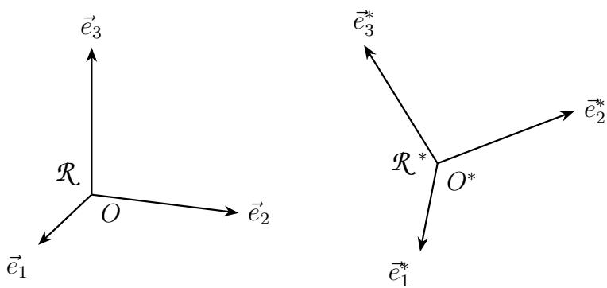
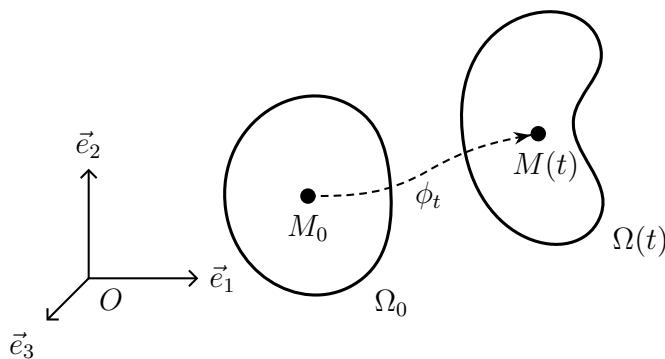
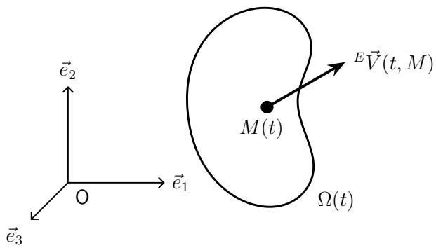

## Chapitre 1

# Cinématique des milieux continus

Ce chapitre donne l’essentiel des concepts et outils nécessaires à la description et la caractérisation de la cinématique des Milieux Continus. Il s’agit de donner une représentation du mouvement (la cinématique), en termes de déplacement ou de vitesse, selon le contexte.

## 1.1 Repérage dans le temps et l’espace

## 1.1.1 La notion de temps

En mécanique classique, l’espace des instants est schématisé par un espace affine $\mathcal { T }$ orienté de dimension 1 sur R. À chaque évènement instantané, on associe un élément t de $\mathcal { T }$ qui est l’instant où il se produit. Une datation galiléenne est une application affine strictement croissante de $\mathcal{T}$ dans $\mathbb{R}$.

Si l’on fixe une origine des instants (instant « zéro » $t _ { 0 }$ , très souvent $t _ { 0 } = 0$) et une unité de durée $\vec{u}$ (vecteur non nul orienté dans le sens positif), à chaque instant t on peut associer sa date τ telle que :

$$
\overrightarrow {t _ {0} t} = \tau \vec {u}\tag{1.1}
$$

Si ces ingrédients (non intrinsèques) sont choisis une fois pour toutes, on peut confondre t et $\tau$ ; c’est ce que nous ferons dans la suite.

## 1.1.2 La notion d’observateur

Un observateur (on emploie aussi la terminologie espace d’observateur ou repère d’espace) correspond à la modélisation des corps solides suffisamment peu déformables pour que l’on puisse les considérer comme parfaitement rigides : les distances des différentes particules sont constantes par rapport au temps.

Un espace d’observateur est schématisé par un espace affine euclidien $\mathcal { E }$ (muni d’un produit scalaire) orienté de dimension 3. En général, le solide Σ associé n’est qu’une partie (bornée) de $\mathcal{E}$ ; les autres points de $\mathcal{E}$ sont liés au solide Σ. En pratique, on introduit donc un espace tel que $\mathcal{E}$ par solide à modéliser.

Un observateur $\mathcal{E}$ étant donné, il est facile de définir un point M en mouvement par rapport à $\mathcal{E}$ par la donnée d’une application de $\mathcal { T }$ dans E qui à t associe $M ( t )$

$$
\mathcal {T} \to \mathcal {E}: t \mapsto M (t)\tag{1.2}
$$

Si l’on choisit une origine $O$ dans $\mathcal { E }$ , on peut décrire le mouvement de M par la fonction vectorielle :

$$
\mathcal {T} \to \mathbf {E}: t \mapsto \overrightarrow {O M} (t)\tag{1.3}
$$

où $\mathbf{E}$ est l’espace vectoriel associé à $\mathcal{E}$.

Si l’on choisit une base (généralement orthonormée) dans $\mathbf { E } : \mathcal { B } = ( \vec { e } _ { 1 } , \vec { e } _ { 2 } , \vec { e } _ { 3 } )$ , le mouvement est décrit par la donnée de 3 fonctions scalaires :

$$
\mathcal {T} \to \mathbb {R}: t \mapsto x _ {i} (t) \quad (i = 1, 2, 3)\tag{1.4}
$$

qui sont les fonctions coordonnées de $\overrightarrow { O M } ( t )$ dans la base $\mathcal{B}$ ou encore du point $M ( t )$ dans le repère orthonormé direct $\mathcal { R } = ( O ; B )$ . Si ce repère est choisi une fois pour toutes, on confond souvent l’observateur $\mathcal { E }$ , le solide qui lui est associé et le repère $\mathcal { R }$

La vitesse de M dans $\mathcal { R }$ est définie par :

$$
\vec {V} (t, M / \mathcal {R}) = \frac {\mathrm{d}}{\mathrm{d} t} \overrightarrow {O M} (t) = \dot {x} _ {1} (t) \vec {e} _ {1} + \dot {x} _ {2} (t) \vec {e} _ {2} + \dot {x} _ {3} (t) \vec {e} _ {3}\tag{1.5}
$$

et son accélération par :

$$
\vec {\Gamma} (t, M / \mathcal {R}) = \frac {\mathrm{d} ^ {2}}{\mathrm{d} t ^ {2}} \overrightarrow {O M} (t) = \ddot {x} _ {1} (t) \vec {e} _ {1} + \ddot {x} _ {2} (t) \vec {e} _ {2} + \ddot {x} _ {3} (t) \vec {e} _ {3}\tag{1.6}
$$

Figure 1.1 – Composition des vitesses

Remarque 1.1 La véritable difficulté de la cinématique est de relier les mouvements d’un « même point » dans différents observateurs. C’est l’objet de la composition des mouvements que nous supposerons ici connue du lecteur (mais que nous n’utiliserons que très peu dans la suite de ce cours). Si $\mathcal R \ = \ ( O ; \vec { e } _ { 1 } , \vec { e } _ { 2 } , \vec { e } _ { 3 } )$ et $\mathcal R ^ { * } = ( O ^ { * } ; \vec { e } _ { 1 } ^ { * } , \vec { e } _ { 2 } ^ { * } , \vec { e } _ { 3 } ^ { * } )$ sont deux espaces d’observateur, on a (cf. figure 1.1) :

$$
\vec {V} (t, M / \mathcal {R}) = \vec {V} (t, M / \mathcal {R} ^ {*}) + \left[ \vec {V} (t, O ^ {*} / \mathcal {R}) + \vec {\Omega} (t, \mathcal {R} ^ {*} / \mathcal {R}) \wedge \overrightarrow {O ^ {*} M} \right]\tag{1.7}
$$

## 1.2 La notion de milieu continu

L’objet est ici de décrire les mouvements des corps physiques déformables par rapport à un observateur $\mathcal { E }$ (ou repère $\mathcal { R } )$ donné. Le parti pris de la Mécanique des Milieux Continus est de regarder les corps physiques à une échelle dite macroscopique qui ignore volontairement la structure discrète de la matière. Ainsi, nous supposerons que, à chaque instant t, le corps physique que l’on veut étudier occupe un domaine « continu » de l’espace $\mathcal { E }$ . Avec cette approche, on peut considérer que chaque particule constituant le milieu continu occupe une partition du volume matériel, dont la taille caractéristique minimale est de l’ordre de $1 0 ^ { - 8 } \mathrm { m }$ à $1 0 ^ { - 9 } \mathrm { m }$

Remarque 1.2 La notion de domaine « continu » peut bien sûr être définie rigoureusement d’un point de vue mathématique en utilisant des notions topologiques. Nous nous contenterons ici, pour cette première approche, de considérations intuitives.

## 1.2.1 Le mouvement et ses représentations

## Description lagrangienne

Pour décrire le mouvement, on se donne l’application vectorielle $\phi$ décrivant la transformation du milieu :

$$
\phi : [ 0, T ] \times \Omega_ {0} \rightarrow \mathcal {E}, (t, M _ {0}) \mapsto M = \phi (t, M _ {0})\tag{1.8}
$$

[0, T] est l’intervalle d’étude, et $\Omega _ { 0 }$ la configuration à l’instant initial $t_0$, c’est-à-dire le domaine occupé par le milieu continu à cet instant $t _ { 0 }$ (cf. figure 1.2). On parle aussi de « configuration initiale », (ou configuration de référence, voire parfois configuration non déformée). Dans la description lagrangienne, les grandeurs physiques sont définies en des points attachés à la matière, potentiellement mobiles.

Plaçons nous à t fixé. L’ensemble des points $M = \phi ( t , M _ { 0 } )$ lorsque $M _ { 0 }$ décrit $\Omega _ { 0 }$ est noté $\Omega ( t )$ et est appelé « configuration à l’instant t » (cf. figure 1.2). On parle aussi de configuration actuelle, courante, voire parfois déformée. C’est l’image de $\Omega _ { 0 }$ par l’application partielle :

$$
\phi_ {t}: M _ {0} \mapsto \phi (t, M _ {0})\tag{1.9}
$$

La configuration $\Omega ( t )$ (ou aussi notée $\Omega _ { t }$ ou Ω en abrégé), correspond donc aux positions des particules du domaine d’étude à l’instant t.

Figure 1.2 – Description lagrangienne : position actuelle des particules.

## Trajectoires

Plaçons nous maintenant à $M _ { 0 }$ fixé. L’ensemble des points $M ( t ) = \phi ( t , M _ { 0 } )$ pour $t \in [ 0 , T ]$ est la trajectoire de la particule M, qui à l’instant initial se trouvait en $M _ { 0 }$ . Selon le contexte, on écrira indifféremment :

$$
\overrightarrow {O M} (t) = \vec {\phi} (t, \overrightarrow {O M _ {0}}) \qquad \vec {M} (t) = \vec {\phi} (t, \vec {M} _ {0}) \qquad M (t) = \phi (t, M _ {0})\tag{1.10}
$$

ou même, en coordonnées (pour $i = 1 , 2 , 3 )$

$$
x _ {i} (t) = \phi_ {i} (t, X _ {1}, X _ {2}, X _ {3}) \quad \text { ou,   selon   les   notations, } \quad x _ {i} (t) = \phi_ {i} (t, x _ {1} ^ {0}, x _ {2} ^ {0}, x _ {3} ^ {0})\tag{1.11}
$$

Il est évident que l’on peut écrire :

$$
\vec {M} _ {0} = \vec {\phi} (t = 0, \overrightarrow {O M _ {0}}) \quad \text { et } \quad X _ {i} = \phi_ {i} (t = 0, X _ {1}, X _ {2}, X _ {3})\tag{1.12}
$$

Remarque 1.3 La fonction ϕ doit être supposée suffisamment régulière. Cela a des consé- quences sur les valeurs que peut prendre le Jacobien (déterminant de la matrice Jacobienne), qui ici correspond au déterminant du gradient de l’application de transformation ϕ, c’est-à-dire $J ( t , M _ { 0 } ) = \det\!\left(\overline{\operatorname{grad}}\,\phi(t,M_0)\right)$ Cela traduit le rapport entre le volume actuel (instant t) et initial (instant $t_0$) d’une particule que l’on suit dans son mouvement. Par exemple, on peut imposer, en plus du naturel $J ( t = 0 ) = 1$

— ϕ est deux fois dérivable par rapport au temps (sauf en un nombre fini d’instants, pour traiter les chocs) ;

— à $t$ fixé, on impose que $M_0\mapsto\phi(t,M_0)$ soit un difféomorphisme local et global qui conserve l’orientation : $M=\phi_t(M_0)$ et $M_0=\phi_t^{-1}(M)$, avec $J(t,M_0)>0$ ;

— ϕ est continûment dérivable par rapport aux variables d’espace =⇒ J est continu. Par conséquent, en tenant compte de $J ( t = 0 ) = 1 \ e t \ J ( t , M _ { 0 } ) \neq 0$ , on arrive à $J ( t , M _ { 0 } ) > 0$

> **Erratum théorique (PDF, p. 4, remarque 1.3).** La bijectivité et la régularité $C^1$ ne suffisent pas à déduire $J\ne0$ : $x\mapsto x^3$ est bijectif et $C^1$, mais sa dérivée est nulle en $0$. Il faut imposer l’inversibilité différentiable locale, ou directement $J>0$, avec les hypothèses de continuité nécessaires.\n\nD’autres cadres de régularité peuvent être utiles pour des raisons plus complexes (existence de solutions par exemple), mais ces considérations sortent du cadre d’un cours d’initiation à la MMC!

Remarque 1.4 Dans la description lagrangienne, toute grandeur physique est décrite par une fonction de $( t , M _ { 0 } )$ qui représente la valeur à l’instant t de la grandeur au point $M ( t )$ , position à t de la particule qui à l’instant initial était en $M _ { 0 }$ . Par exemple, on a :

— pour la vitesse

$$
\vec {V} (t, M _ {0}) = \frac {\partial}{\partial t} \vec {\phi} (t, M _ {0})\tag{1.13}
$$

— pour l’accélération

$$
\vec {\Gamma} (t, M _ {0}) = \frac {\partial^ {2}}{\partial t ^ {2}} \vec {\phi} (t, M _ {0})\tag{1.14}
$$

## Description eulérienne

Ici on ne privilégie pas de configuration particulière. La cinématique est décrite par la donnée à chaque instant t de la vitesse (par rapport au repère R) de la particule qui se trouve en $M ( t )$ à l’instant $t : ^ { E } \vec { V } ( t , M )$ , où t et M sont deux variables indépendantes (cf. figure 1.3). Dans ce type de description on parle plutôt d’écoulement que de mouvement. Dans la description eulérienne, les grandeurs physiques sont définies en des points fixes du repère (ou référentiel).

Figure 1.3 – Description eulérienne : vitesses actuelle des particules.

## Équivalence entre les deux descriptions

Tout champ matériel peut être décrit via les descriptions eulérienne ou lagrangienne. Comme $\phi$ est une application bijective, elle est inversible, donc pour une fonction scalaire, notée $f$ en description lagrangienne, notée $^ E f$ en description eulérienne, on a les équivalences :

$$
{ } ^ { E } f ( t , M ) = f \left[ t , \phi _ { t } ^ { - 1 } ( M ) \right]\tag{1.15}
$$

$$
f (t, M _ {0}) = ^ {E} f [ t, \phi_ {t} (M _ {0}) ] = ^ {E} f [ t, \phi (t, M _ {0}) ]\tag{1.16}
$$

Il est néanmoins important de retenir que $f$ et $^ E f$ :

— sont deux applications différentes ;

— mais représentent la même grandeur physique avec la même valeur pour une même particule.

## Passage d’une description à l’autre

1. Si on connait la description lagrangienne du mouvement, il est facile de déterminer le champ eulérien des vitesses :

$$
^ {E} \vec {V} (t, M) = \vec {V} \left(t, \phi_ {t} ^ {- 1} (M)\right) = \vec {V} (t, M _ {0}) = \frac {\partial}{\partial t} \vec {\phi} (t, M _ {0})\tag{1.17}
$$

2. La connaissance de $^ { E } \vec { V } ( t , M )$ et de la configuration initiale $\Omega _ { 0 }$ permet (sous réserve de régularité) de reconstruire la fonction $\phi$ de la représentation lagrangienne.

$$
\vec {V} (t, M _ {0}) = \frac {\partial}{\partial t} \vec {\phi} (t, M _ {0}) \quad \mathsf {e t} \quad \vec {V} (t, M _ {0}) = ^ {E} \vec {V} (t, M) = ^ {E} \vec {V} [ t, \phi (t, M _ {0}) ]\tag{1.18}
$$

Cela implique donc de résoudre l’équation différentielle :

$$
\frac {\partial}{\partial t} \vec {\phi} (t, M _ {0}) = ^ {E} \vec {V} [ t, \phi (t, M _ {0}) ] \quad \text { avec   les   conditions   initiales } \quad \phi (t _ {0}, M _ {0}) = M _ {0}\tag{1.19}
$$

## Dérivée par rapport au temps en représentation eulérienne

Cas d’une fonction scalaire :

Soit f une grandeur physique et ses représentations lagrangienne et eulérienne :

$$
f (t, M _ {0}) \quad ; \quad^ {E} f (t, M)\tag{1.20}
$$

On peut relier les différentes dérivées temporelles comme suit :

$$
\frac {\mathrm{d}}{\mathrm{d} t} \left[ ^ {E} f (t, M) \right] = \frac {\partial}{\partial t} \left[ ^ {E} f (t, \phi (t, M _ {0})) \right] = \frac {\partial}{\partial t} f (t, M _ {0})\tag{1.21}
$$

On a :

$$
\frac {\mathrm{d}}{\mathrm{d} t} \left[ ^ {E} f (t, M) \right] = \frac {\partial}{\partial t} \left[ ^ {E} f \right] + \frac {\partial}{\partial M} \left[ ^ {E} f \right] \frac {\partial M}{\partial t} = \underbrace {\frac {\partial}{\partial t} \left[ ^ {E} f \right]} _ {\text {dérivée locale}} + \underbrace {\overrightarrow {\operatorname{grad}} _ {M} \left[ ^ {E} f \right] \cdot {} ^ {E} \vec {V}} _ {\text {terme convectif}}\tag{1.22}
$$

Pour une représentation eulérienne, et pour la distinguer de la dérivée partielle en temps, cette dérivée est appelée dérivée particulaire ou encore dérivée totale par rapport au temps.

Démonstration :

On part de l’expression de la différentielle de la fonction $f$ :

$$
\mathrm{d}\left[{}^{E}f(t,M)\right] = \frac {\partial}{\partial t} \left[ ^ {E} f (t, M) \right] \mathrm{d} t + \frac {\partial}{\partial M} \left[ ^ {E} f (t, M) \right] \mathrm{d} M\tag{1.23}
$$

> **Note de vérification (source PDF, p. 6, formule 1.23).** Le PDF imprime `f(t\,\mathrm dM)` dans le membre de gauche. La différentielle totale requiert `f(t,M)` ; la formule ci-dessus corrige cette coquille de la source.

On divise par dt

$$
\frac {\mathrm{d}}{\mathrm{d} t} \left[ ^ {E} f (t, M) \right] = \frac {\partial}{\partial t} \left[ ^ {E} f (t, M) \right] + \frac {\partial}{\partial M} \left[ ^ {E} f (t, M) \right] \frac {\mathrm{d} M}{\mathrm{d} t}\tag{1.24}
$$

On fait apparaître le gradient eulérien et la vitesse eulérienne :

$$
\frac {\mathrm{d}}{\mathrm{d} t} \left[ ^ {E} f (t, M) \right] = \frac {\partial}{\partial t} \left[ ^ {E} f (t, M) \right] + \overrightarrow {\operatorname{grad} _ {M}} \left[ ^ {E} f (t, M) \right] \cdot^ {E} \vec {V}\tag{1.25}
$$

Généralisation :

Ce type de relation s’étend sans grande difficulté à tous les types de grandeurs. Par exemple, on a :

$$
\vec {\Gamma} (t, M _ {0}) = \frac {\partial}{\partial t} [ \vec {V} (t, M _ {0}) ] = \frac {\mathrm{d}}{\mathrm{d} t} [ ^ {E} \vec {V} (t, M) ] = \frac {\partial}{\partial t} [ ^ {E} \vec {V} ] + \frac {\partial}{\partial M} [ ^ {E} \vec {V} ] \frac {\partial M}{\partial t}\tag{1.26}
$$

$$
\vec {\Gamma} (t, M _ {0}) = \frac {\partial}{\partial t} \left[ ^ {E} \vec {V} \right] + \overline {{\overline {{\mathrm{grad}}}}} _ {M} \left[ ^ {E} \vec {V} \right] \cdot^ {E} \vec {V}\tag{1.27}
$$

Remarque 1.5 En pratique, on note souvent de la même façon la représentation lagrangienne et la représentation eulérienne d’une même grandeur physique. Ce sont alors le contexte et les variables utilisées $( t , M _ { 0 } )$ ou $( t , M )$ qui précisent la représentation utilisée. Ainsi, si $M =$ $\phi ( t , M _ { 0 } )$ , on peut écrire : $f ( t , M _ { 0 } ) = f ( t , M )$ . Dans le membre de gauche, il s’agit d’une représentation lagrangienne, dans celui de droite d’une représentation eulérienne.

Remarque 1.6 La dérivée totale par rapport au temps de f est souvent notée ${ \dot { f } } .$ . On a donc $\begin{array} { r } { \dot { f } = \frac { \partial } { \partial t } f } \end{array}$ en représentation lagrangienne et $\begin{array} { r } { \dot { f } = \frac { \mathrm { d } } { \mathrm { d } t } f } \end{array}$ en représentation eulérienne.

## Lignes de courant

Définition 1.1 Les lignes de courant à un instant t fixé sont les enveloppes du champ eulérien des vitesses à cet instant. On peut les calculer en posant l’équation :

$$
\mathrm{d} \vec {M} \wedge {} ^ {E} \vec {V} = \vec {0}\tag{1.28}
$$

## Mouvements particuliers

Stationnaire un mouvement est dit stationnaire (ou permanent) si le champ eulérien des vitesses est indépendant du temps.

$$
\frac{\partial\left[{}^{E}\vec V\right]}{\partial t} = 0 \quad \Longleftrightarrow \quad \text { mouvement   stationnaire }\tag{1.29}
$$

Incompressible un mouvement est dit incompressible si la divergence du champ eulérien des vitesses est nulle.

$$
\operatorname{div}\left[{}^{E}\vec V\right]=0 \quad \Longleftrightarrow \quad \text {   mouvement   incompressible   }\tag{1.30}
$$

Irrotationnel un mouvement est dit irrotationnel si le rotationnel du champ eulérien des vitesses est nul.

$$
\overrightarrow{\mathrm{rot}}\left[{}^{E}\vec V\right] = 0 \quad \Longleftrightarrow \quad \text { mouvement   irrotationnel }\tag{1.31}
$$

Remarque 1.7 Pour un mouvement stationnaire, les trajectoires sont aussi les lignes de courant. Néanmoins, si les trajectoires et lignes de courant sont confondues, le mouvement n’est pas forcément stationnaire.

## 1.2.2 Cas des corps rigides

Un milieu continu a un mouvement de corps rigide (ou solide rigide) si et seulement si on a, en représentation lagrangienne :

$$
\forall M, N: \overrightarrow {M (t) N (t)} = \mathbb {Q} (t) \cdot \overrightarrow {M _ {0} N _ {0}}\tag{1.32}
$$

$\mathbb { Q } ( t )$ est une isométrie directe <a href="#note-1">1</a> (on parle aussi d’opérateur orthogonal, positif ou direct) :

$$
\mathbb {Q} (t) ^ {\mathsf {T}} \mathbb {Q} (t) = \mathbb {I} \qquad \mathrm{et} \qquad \det (\mathbb {Q} (t)) = 1\tag{1.33}
$$

Remarque de typographie : pour l’opérateur « transposé », on utilise ici la notation anglo-saxonne $\mathbb{M}^{\mathsf{T}}$, au lieu de la notation française ${}^{\mathsf{t}}\mathbb{M}$.

La représentation lagrangienne du mouvement d’un corps rigide est donc de la forme :

$$
\overrightarrow {O M} (t) = \vec {\alpha} (t) + \mathbb {Q} (t) \cdot \overrightarrow {O M _ {0}}\tag{1.34}
$$

Pour un corps rigide, on a :

$$
\forall M, N: \vec {V} (t, N) = \vec {V} (t, M) + \vec {\omega} (t) \wedge \overrightarrow {M (t) N (t)}\tag{1.35}
$$

où le vecteur $\vec { \omega } ( t )$ , qui ne dépend que du temps, est le vecteur rotation instantanée. Le champ eulérien des vitesses d’un corps rigide est donc déterminé dès que l’on connait, à tout instant t, la vitesse d’un point du corps rigide et le vecteur $\vec { \omega } ( t )$

## Notes

**1.** Une isométrie est une transformation qui conserve les distances et donc les angles. Elle est directe (ou positive) si elle conserve aussi l’orientation. Dans une base orthonormée, la matrice d’une isométrie est une matrice orthogonale c’est-à-dire une matrice dont l’inverse est égal à la transposée. Elle est directe (ou positive) si son déterminant est égal à 1.
