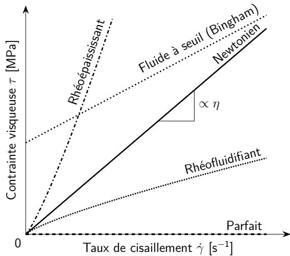
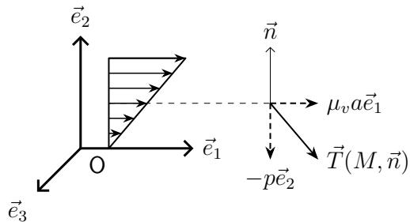

## Chapitre 5

# Relations de comportement

Les équations établies aux chapitres précédents sont très générales. L’objet de ce chapitre est d’introduire de nouvelles relations, appelées relations de comportement afin de prendre en compte les propriétés des différents types de milieux continus : milieux déformables « solides » ou « fluides ». Ces nouvelles relations ne se déduisent pas des grands principes de la physique (même si elles sont construites de façon à respecter ces principes). En d’autres termes, ce ne sont pas des « lois physiques » mais des choix de modélisation. Il s’agit de relations au niveau local, entre cause et effet, bien différentes des lois de conservation.

Dans cet exposé élémentaire, nous nous intéressons aux relations de comportement utilisées dans la modélisation des milieux continus les plus simples : solides élastiques, fluides parfaits et fluides classiques.

## 5.1 Solides élastiques

## 5.1.1 Généralités

Les milieux continus élastiques sont des milieux qui gardent en mémoire une configuration privilégiée $\Omega _ { 0 }$ . L’opérateur des contraintes de Piola-Kirchhoff S, en un point et à un instant donné, ne dépend que de la déformation subie entre l’état naturel et l’état actuel, en ce point et à cet instant.

Les déformations sont mesurées à partir de cette configuration $\Omega _ { 0 }$ par l’opérateur de Green-Lagrange $\mathbb { E } ( t , M _ { 0 } )$ . La relation de comportement d’un milieu élastique est donc de la forme :

$$
\mathbb {S} (t, M _ {0}) = \mathcal {G} [ \mathbb {E} (t, M _ {0}) ]\tag{5.1}
$$

où $\mathcal { G }$ est un opérateur caractéristique du matériau.

## 5.1.2 Élasticité linéaire

Pour de très nombreuses applications, on peut supposer que l’application $\mathcal { G }$ est linéaire. On remplace alors la notation $\mathcal { G }$ par $\kappa$ :

$$
\mathbb {S} (t, M _ {0}) = \mathcal {K} [ \mathbb {E} (t, M _ {0}) ]\tag{5.2}
$$

L’opérateur $\kappa$ est appelé « opérateur de Hooke » du matériau <a href="#note-1">1</a>.

## 5.1.3 Élasticité isotrope

Très souvent, le milieu peut être considéré comme isotrope : schématiquement, le comportement est indépendant de la direction de la sollicitation, ce qui se traduit mathématiquement par la propriété <a href="#note-2">2</a> :

$$
\forall \mathbb {Q} \left\{ \begin{array}{l} \text { opérateur   orthogonal } \\ \text { isométrie   directe } \end{array} \right. \quad \text { et } \quad \forall \mathbb {E} \quad \text { on   a } \quad \mathcal {G} [ \mathbb {Q} \mathbb {E} \mathbb {Q} ^ {\mathsf {T}} ] = \mathbb {Q} \mathcal {G} [ \mathbb {E} ] \mathbb {Q} ^ {\mathsf {T}}\tag{5.3}
$$

En élasticité isotrope, la relation de comportement élastique (linéaire ou non) est de la forme <a href="#note-3">3</a> :

$$
\mathbb {S} = \ell_ {0} (I _ {1}, I _ {2}, I _ {3})\mathbb I + \ell_ {1} (I _ {1}, I _ {2}, I _ {3}) \mathbb {E} + \ell_ {2} (I _ {1}, I _ {2}, I _ {3}) \mathbb {E} ^ {2}\tag{5.4}
$$

> **Erratum dimensionnel (PDF, p. 2, formule 5.4).** Le PDF omet $\mathbb I$ après le coefficient scalaire $\ell_0$ ; son addition à deux tenseurs serait indéfinie. L’identité est rétablie ci-dessus.

où $\begin{array} { r } { I _ { n } \overset { \mathrm { i c i } } { = } I _ { n } ( \mathbb { E } ) = \frac { 1 } { n } \operatorname { T r } [ \mathbb { E } ^ { n } ( t , M _ { 0 } ) ] } \end{array}$ pour $n = 1 , 2 , 3$ et où $\ell _ { 0 } , \ell _ { 1 } , \ell _ { 2 }$ sont des fonctions plus ou moins arbitraires, fortement liées à la thermodynamique.

## Élasticité linéaire isotrope

Si l’élasticité est à la fois linéaire et isotrope, on a :

$$
\mathbb {S} (t, M _ {0}) = \lambda \operatorname{Tr} [ \mathbb {E} (t, M _ {0}) ] \mathbb {I} + 2 \mu \mathbb {E} (t, M _ {0})\tag{5.5}
$$

où $\lambda$ et $\mu$ sont des coefficients (indépendants des invariants $I _ { n } )$ appelés coefficients de Lamé. Plus précisément, λ est le premier coefficient de Lamé et $\mu$ le second coefficient de Lamé (ou plus communément le module de cisaillement), tous deux exprimés en Pa (ou plus communé- ment MPa, voire GPa).

## 5.1.4 Élasticité en petites perturbations

On suppose que l’on se place dans le cadre de l’Hypothèse des Petites Perturbations (HPP), dont on rappelle le cadre de validité :

— les déplacements $\vec{u}$ sont petits devant les dimensions de la structure : $\lVert \vec { u } \rVert \ll [ V ( \Omega ) ] ^ { 1 / 3 }$

— les transformations sont infinitésimales : $\left\| { \overline{\overline{\operatorname{grad}}} } { \vec { u } } \right\| = \left\| { \frac { \partial { \vec { u } } } { \partial M _ { 0 } } } \right\| \ll 1$

On a alors, sous réserve de validité de cette hypothèse, comme une « équivalence » entre les descriptions eulérienne et lagrangienne :

$$
\begin{array}{r} \Omega (t) \approx \Omega_ {0} \\ M (t) \approx M _ {0} \\ \mathbb {F} \approx \mathbb {I} \\ \frac {\partial}{\partial M} \approx \frac {\partial}{\partial M _ {0}} \\ \frac {\mathrm{d}}{\mathrm{d} t} \approx \frac {\partial}{\partial t} \\ \mathbb {E} \approx \varepsilon (\vec {u}) \\ \mathbb {S} \approx \sigma \end{array}\tag{5.6}
$$

Tableau 5.1 – Quelques ordres de grandeur de propriétés élastiques de matériaux solides usuels. Des variations plus ou moins fortes peuvent apparaitre pour certains matériaux, en fonction des nuances.

| Matériau | Module d’Young $E$ (MPa) | Coef. de Poisson $\nu$ (sans unité) | Module de cisaillement $\mu$ (ou $G$) (MPa) | Limite élastique $\sigma_e$ (ou $R_e$, $\sigma_y$) (MPa) |
|---|---:|---:|---:|---:|
| Acier doux | 210 000 | 0,3 | 79 000 | 250 |
| Aluminium | 70 000 | 0,34 | 26 000 | 400 |
| Titane | 115 000 | 0,33 | 41 000 | 200 |
| Verre | 70 000 | 0,2 | 24 500 | 40 |
| Béton | 30 000 | 0,2 | 12 500 | 20 |
| Plexiglas | 3000 | 0,4 | 1100 | 80 |
| Caoutchouc | 2 | 0,5 | 0,67 | 20 |

Dans ces conditions, la relation de comportement élastique linéaire (ou loi de Hooke), s’écrit :

$$
\sigma (t, M) = \mathbf {K}: \varepsilon (t, M)\tag{5.7}
$$

Dans le cas d’un comportement élastique linéaire et isotrope, elle devient :

$$
\sigma = \mathbf {K}: \varepsilon = \lambda \operatorname{Tr} (\varepsilon) \mathbb {I} + 2 \mu \varepsilon\tag{5.8}
$$

On peut également écrire la relation de comportement inverse :

$$
\varepsilon = \mathbf {K} ^ {- 1} \sigma = \frac {1 + \nu}{E} \sigma - \frac {\nu}{E} \mathrm{Tr} (\sigma) \mathbb {I}\tag{5.9}
$$

où $E$ est le module d’Young, exprimé en Pa (voire MPa ou GPa) et ν le coefficient de Poisson, sans dimension. On a comme équivalence avec les coefficients de Lamé λ et $\mu$ :

$$
2 \mu = \frac {E}{1 + \nu}; \lambda = \frac {\nu E}{(1 + \nu) (1 - 2 \nu)}; E = \frac {\mu (3 \lambda + 2 \mu)}{\lambda + \mu} \text {et} \nu = \frac {\lambda}{2 (\lambda + \mu)}\tag{5.10}
$$

Remarque 5.1 Dans le cas particulier où $\nu = 1 / 2$ , nous sommes en présence d’un matériau élastique incompressible et la relation de comportement inverse devient :

$$
\varepsilon = \frac {1}{2 \mu} \sigma^ {D} \qquad a v e c \qquad \mathrm{Tr} (\varepsilon) = \mathrm{Tr} (\overline {{\overline {{\mathrm{grad}}}}} \vec {u}) = \mathrm{div} \vec {u} = 0\tag{5.11}
$$

## 5.1.5 Homogénéité

En général, en élasticité linéaire, l’opérateur de Hooke dépend du point considéré dans le matériau :

$$
\mathcal {K} = \mathcal {K} (M _ {0}) \quad \text {   voire,   en   HPP   } \quad \mathbf {K} = \mathbf {K} (M _ {0}) = \mathbf {K} (M)\tag{5.12}
$$

Définition 5.1 Un matériau élastique est homogène si son opérateur de Hooke est indépendant du point M auquel il est exprimé.

## 5.1.6 Thermoélasticité isotrope

Les relations étudiées ci-dessus sont valables uniquement en isotherme i.e. à température constante (ou plus exactement, en négligeant les effets des variations de température). On peut tenir compte de façon simple d’une variation de température $\delta T ( t , M ) = T ( M t , ) - T _ { 0 } ( M )$ donnée sur $\Omega$ en utilisant la relation de comportement suivante (en HPP) :

$$
\boldsymbol {\sigma} = \mathbf {K}: \varepsilon_ {e l} = \mathbf {K}: (\varepsilon - \varepsilon_ {d}) = \mathbf {K}: (\varepsilon - \varepsilon_ {t h}) = \lambda \operatorname{Tr} (\varepsilon - \varepsilon_ {t h}) \mathbb {I} + 2 \mu (\varepsilon - \varepsilon_ {t h})\tag{5.13}
$$

avec $\varepsilon _ { e l }$ la déformation élastique, $\varepsilon = \varepsilon ( \vec { u } )$ la déformation totale et $\varepsilon _ { t h }$ la déformation thermique, qui peut s’exprimer comme suit :

$$
\varepsilon_ {t h} = \frac {\alpha_ {v}}{3} \delta T \mathbb {I} \quad \Longrightarrow \quad \operatorname{Tr} (\varepsilon_ {t h}) = \alpha_ {v} \delta T\tag{5.14}
$$

où $\alpha _ { v }$ est le coefficient de dilatation thermique volumique. On peut alors aussi écrire :

$$
\boldsymbol {\sigma} = \lambda \operatorname{Tr} (\varepsilon) \mathbb {I} + 2 \mu \varepsilon - \frac {3 \lambda + 2 \mu}{3} \alpha_ {v} \delta T \mathbb {I} = \mathbf {K}: \varepsilon - K \alpha_ {v} \delta T \mathbb {I}\tag{5.15}
$$

avec $K$ le module de compressibilité (hydrostatique) défini par $3 K = 3 \lambda + 2 \mu = E / ( 1 - 2 \nu )$ (scalaire), à ne pas confondre avec l’opérateur de Hooke K.

Remarque 5.2 On peut également exprimer la déformation thermique à partir du coefficient de dilatation thermique linéique α, ce qui donne :

$$
\varepsilon_ {t h} = \alpha \delta T \mathbb {I} \quad \Longrightarrow \quad \operatorname{Tr} (\varepsilon_ {t h}) = 3 \alpha \delta T\tag{5.16}
$$

Soit, au final la relation de comportement thermoélastique devient :

$$
\boldsymbol {\sigma} = \mathbf {K}: \varepsilon - 3 K \alpha \delta T \mathbb {I}\tag{5.17}
$$

## 5.2 Fluides

## 5.2.1 Généralités

Il existe deux grandes classes de fluides :

1. les fluides compressibles (essentiellement les gaz) ;

2. les fluides incompressibles ou quasi-incompressibles (essentiellement les liquides).

Un milieu est incompressible si et seulement si $\rho ( t , M ) = \rho _ { 0 } ( M _ { 0 } )$ . Il résulte alors de l’équation de continuité que div $\vec { V } = 0$ . Et, généralement, on suppose alors que $\rho _ { 0 }$ est indépendant du point (hypothèse d’homogénéité). Dans chaque catégorie, le fluide considéré peut être visqueux ou non visqueux.

Définition 5.2 Un fluide est un milieu dont la relation de comportement est de la forme :

$$
\sigma (t, M) = \mathcal {L} [ \mathbb {D} (t, M) ]\tag{5.18}
$$

où $\mathcal { L }$ est un opérateur linéaire et isotrope caractéristique du fluide considéré.

La forme générale d’une relation de comportement d’un fluide est donc :

$$
\sigma = \ell_ {0} (I _ {1}, I _ {2}, I _ {3})\mathbb I + \ell_ {1} (I _ {1}, I _ {2}, I _ {3}) \mathbb {D} + \ell_ {2} (I _ {1}, I _ {2}, I _ {3}) \mathbb {D} ^ {2}\tag{5.19}
$$

> **Erratum dimensionnel (PDF, p. 5, formule 5.19).** Même omission de $\mathbb I$ dans le terme sphérique $\ell_0$. L’expression (5.19) peut être non linéaire puisque ses coefficients dépendent des invariants ; elle n’est donc pas équivalente à la définition linéaire (5.18) sans hypothèse supplémentaire.

où $\begin{array} { r } { I _ { n } = \frac { 1 } { n } \operatorname { T r } [ \mathbb { D } ^ { n } ( t , M ) ] } \end{array}$ pour $n = 1 , 2 , 3$ et où $\ell _ { 0 } , \ell _ { 1 } , \ell _ { 2 }$ sont des fonctions arbitraires.

## 5.2.2 Fluides parfaits

Ce type de fluide est caractérisé par un état de contrainte sphérique en tout point $\left( \sigma ^ { D } = 0 \right)$ La relation de comportement est donc de la forme :

$$
\sigma = - p \mathbb {I}\tag{5.20}
$$

où $p$ est la pression dans le fluide. La détermination du champ de contrainte $\boldsymbol { \sigma } ( t , M )$ se ramène à la détermination de la seule fonction scalaire $p ( t , M )$ . Une autre façon d’écrire la relation de comportement est donc d’écrire simplement :

$$
\sigma^ {D} = \mathbb {O}\tag{5.21}
$$

## Fluide parfait compressible

Pour obtenir complètement le comportement de ce type de fluide, il faut se donner une fonction $p = g ( \rho , T )$ où $T$ est la température. La fonction g ne peut être quelconque ; elle doit vérifier les principes de la thermodynamique. Si l’on a $p = g ( \rho )$ , on dit que le fluide parfait est barotrope. Ce type de fluide ne sera pas abordé dans le cours.

## Fluide parfait incompressible

Pour les fluides parfaits incompressibles $( \operatorname { d i v } { \vec { V } } = 0 )$ , la pression $p \ ( \sigma = - p \mathbb { I } )$ est une inconnue qui devra être déterminée au cours de la résolution du problème. Une autre façon d’écrire la relation de comportement est donc d’écrire simplement :

$$
\sigma^ {D} = \mathbb {O} \qquad \text { avec } \qquad \operatorname{div} \vec {V} = 0\tag{5.22}
$$

## 5.2.3 Fluide visqueux newtonien

Les fluides visqueux newtoniens sont aussi appelés fluides classiques. Un fluide newtonien est fluide dont la relation de comportement (contrainte – vitesse de déformation) est linéaire. Cela implique que la viscosité (facteur de proportionnalité entre contrainte et vitesse de déformation) est constante, spécifiquement indépendante de la vitesse de sollicitation. Un comparatif de comportement avec les autres catégories de fluides est présenté en figure 5.1.

## Fluide visqueux newtonien compressible

Un fluide visqueux newtonien compressible a une relation de comportement de la forme :

$$
\sigma = - p \mathbb {I} + \lambda_ {v} \operatorname{Tr} (\mathbb {D}) \mathbb {I} + 2 \mu_ {v} \mathbb {D}\tag{5.23}
$$

avec $p = g ( \rho , T ) . ~ \lambda _ { v }$ et $\mu _ { v }$ sont des coefficients positifs constants donnés, caractéristiques du fluide considéré, exprimés en $\mathsf { P a } \cdot \mathsf { s } . \mu _ { v }$ est appelé viscosité dynamique et $\lambda _ { v }$ est appelé seconde viscosité (ou viscosité de volume). Il est aussi fréquent de noter la viscosité dynamique $\eta$ ou tout simplement $\mu$

Quelques ordres de grandeur de viscosités dynamiques :

— eau à $2 0 ^ { \circ } \mathsf { C }$ et 1 bar à 100 bar : $\mu _ { v } = 1 0 ^ { - 3 } \mathsf { P a } \cdot \mathsf { s }$

— sang à $2 0 ^ { \circ } \mathsf { C } : 2 \times 1 0 ^ { - 3 } \mathsf { P a } \cdot \mathsf { s } \text{ à }9 \times 1 0 ^ { - 3 } \mathsf { P a } \cdot \mathsf { s }$

— miel à $2 0 ^ { \circ } \mathsf { C } : 2 \mathsf { P a } \cdot \mathsf { s } \text{ à } 1 0 \mathsf { P a } \cdot \mathsf { s }$

— manteau inférieur à $3 0 0 0 ^ { \circ } \mathsf { C } \text{ à } 4 0 0 0 ^ { \circ } \mathsf { C } : 1 0 ^ { 2 1 } \mathsf { P a } \cdot \mathsf { s } \text{ à } 2 \times 1 0 ^ { 2 1 } \mathsf { P a } \cdot \mathsf { s }$

Figure 5.1 – Fluides parfait, Newtonien et non Newtoniens

## Fluide visqueux newtonien incompressible

Ce sont des milieux incompressibles $( \operatorname { T r } \mathbb { D } = \operatorname { d i v } \vec { V } = 0 )$ dont la relation de comportement est de la forme :

$$
\sigma = - p \mathbb {I} + 2 \mu_ {v} \mathbb {D}\tag{5.24}
$$

où la pression $p$ est une inconnue à déterminer et $\mu _ { v }$ la viscosité dynamique, déjà définie précédemment. On peut aussi écrire la relation de comportement sous la forme :

$$
\sigma^ {D} = 2 \mu_ {v} \mathbb {D}\tag{5.25}
$$

Interprétation du coefficient $\mu _ { v }$

Considérons un écoulement stationnaire de glissement simple défini par le champ de vitesse :

$$
\vec{V}=a x_2\vec{e}_1
\quad\Longrightarrow\quad
\mathbb{D}=\frac{a}{2}\begin{pmatrix}0&1&0\\1&0&0\\0&0&0\end{pmatrix}
\quad\Longrightarrow\quad
\sigma=\begin{pmatrix}-p&\mu_v a&0\\\mu_v a&-p&0\\0&0&-p\end{pmatrix}\tag{5.26}
$$

$$
\Longrightarrow\quad\vec{T}(M,\vec{e}_2)=\mu_v a\vec{e}_1-p\vec{e}_2\tag{5.27}
$$

Le terme $\mu _ { v } a \vec { e } _ { 1 }$ schématise le frottement interne des couches de fluide les unes sur les autres (figure 5.2).

Figure 5.2 – Interprétation du coefficient $\mu _ { v }$ .

Remarque 5.3 Dans ce module, nous nous focaliserons sur les fluides visqueux newtoniens incompressibles.

## Notes

**1.** On a donc $\mathcal{K}[\mathbb{E}_1+\mathbb{E}_2]=\mathcal{K}[\mathbb{E}_1]+\mathcal{K}[\mathbb{E}_2]$ et $\mathcal{K}[\alpha\mathbb{E}]=\alpha\mathcal{K}[\mathbb{E}]$.

**2.** L’opérateur $\mathbb{Q}\mathbb{E}\mathbb{Q}^{\mathsf{T}}$ est appelé opérateur tourné de $\mathbb{E}$ par $\mathbb{Q}$. La matrice de $\mathbb{E}$ dans la base des $(\vec{X}_i)$ est égale à la matrice de $\mathbb{Q}\mathbb{E}\mathbb{Q}^{\mathsf{T}}$ dans la base des $(\mathbb{Q}\vec{X}_i)$, appelée base tournée de la base des $(\vec{X}_i)$ par $\mathbb{Q}$.

**3.** Si la relation est de la forme indiquée, il est facile de vérifier l’isotropie. La réciproque, plus délicate, sera admise.
