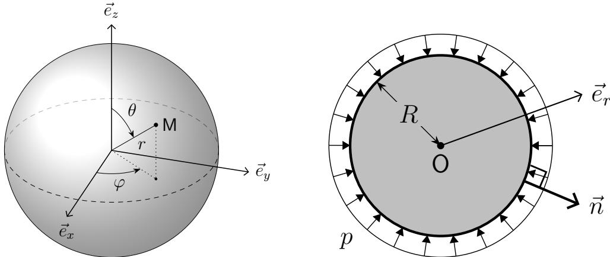
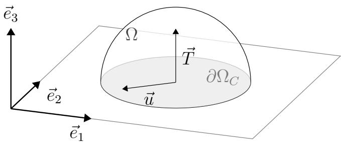
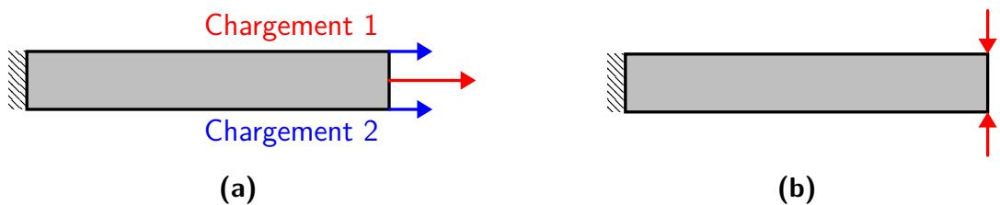
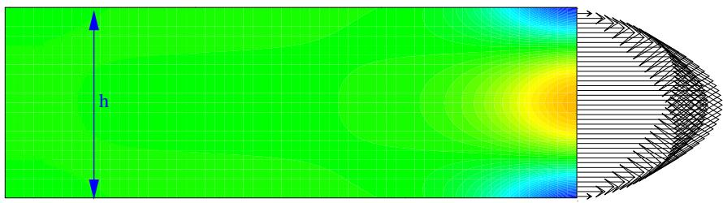
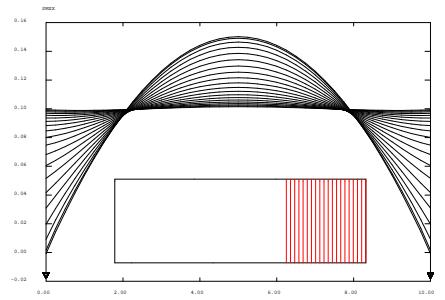
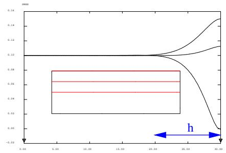
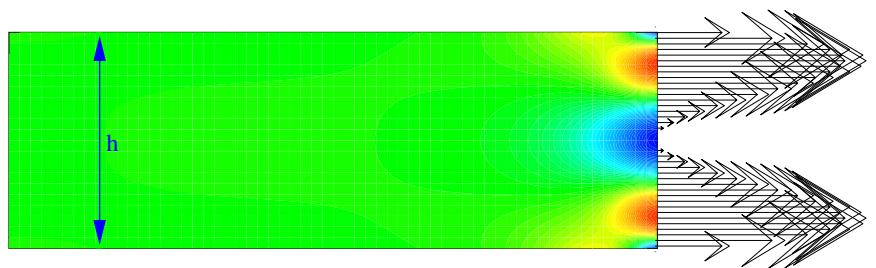
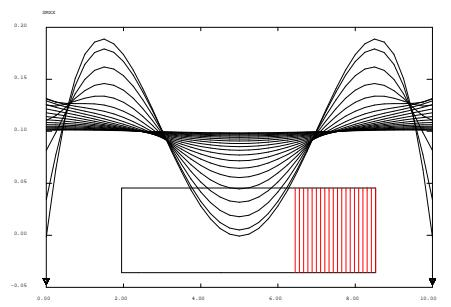
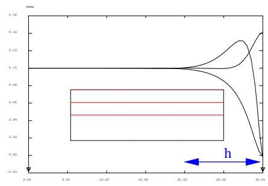

## Chapitre 6

## Problème d’élasticité linéaire solide : formulation, résolution et propriétés

On se place dans le cadre des hypothèses des petites perturbations (HPP). Dans ces conditions, la relation de comportement élastique linéaire s’écrit $\sigma ( t , M ) = \mathbf { K } : \varepsilon ( t , M )$ . Si le matériau est homogène, K est indépendant de M. Si le matériau est non homogène, on notera K(M). Par contre, dans ce cours, on supposera toujours que K est indépendant du temps <a href="#note-17">17</a>.

## 6.1 Propriétés de l’opérateur de Hooke

## Linéarité

L’opérateur de Hooke K est un opérateur linéaire de $L _ { S } ( { \bf E } ^ { 3 } )$ (espace des tenseurs symétriques du second ordre) dans lui-même <a href="#note-18">18</a> : à tout opérateur symétrique de ${ \bf E } ^ { 3 }$ , il associe un opérateur symétrique de ${ \bf E } ^ { 3 }$

$$
\forall \varepsilon_ {1}, \varepsilon_ {2} \quad \mathbf {K}: (\varepsilon_ {1} + \varepsilon_ {2}) = \mathbf {K}: \varepsilon_ {1} + \mathbf {K}: \varepsilon_ {2} \quad \text {et} \quad \forall \varepsilon , \alpha \quad \mathbf {K}: (\alpha \varepsilon) = \alpha \mathbf {K}: \varepsilon\tag{6.1}
$$

## Symétrie

L’opérateur K est un opérateur symétrique <a href="#note-19">19</a> :

$$
\forall \varepsilon_ {1}, \forall \varepsilon_ {2}, \quad \operatorname{Tr} [ \varepsilon_ {1} \mathbf {K}: \varepsilon_ {2} ] = \operatorname{Tr} [ \varepsilon_ {2} \mathbf {K}: \varepsilon_ {1} ] \quad \text {ou} \quad \varepsilon_ {1}: \mathbf {K}: \varepsilon_ {2} = \varepsilon_ {2}: \mathbf {K}: \varepsilon_ {1}\tag{6.2}
$$

La symétrie de K entraîne l’existence d’une énergie interne appelée énergie de déformation élastique.

## Caractère défini positif

L’opérateur K est symétrique défini positif :

$$
\forall \varepsilon , \quad \operatorname{Tr} [ \varepsilon \mathbf {K}: \varepsilon ] = \varepsilon : \mathbf {K}: \varepsilon \geqslant 0; \quad \operatorname{Tr} [ \varepsilon \mathbf {K}: \varepsilon ] = \varepsilon : \mathbf {K}: \varepsilon = 0 \quad \Longleftrightarrow \quad \varepsilon = \mathbb {O}\tag{6.3}
$$

L’opérateur K est donc inversible et l’opérateur inverse ${ \bf K } ^ { { - 1 } }$ est linéaire, symétrique et défini positif.

## 6.2 Formulation forte d’un problème d’élasticité

On se place dans un premier temps en statique.

## 6.2.1 Données

Un milieu continu occupe dans l’état naturel un domaine Ω. On se donne aussi :

des liaisons avec l’extérieur : encastrement, appui, etc

Pour simplifier, on suppose que l’on se donne le champ de déplacement sur une partie $\partial \Omega _ { u }$ de la frontière ∂Ω de Ω :

$$
\vec {u} = \vec {u} _ {d} \quad \forall M \in \partial \Omega_ {u}\tag{6.4}
$$

des efforts extérieurs

1. une densité volumique de force $\vec { f } _ { d }$ dans Ω ;

2. une densité surfacique de force $\vec { T _ { d } }$ sur la partie $\partial \Omega _ { T } = \partial \Omega - \partial \Omega _ { u }$

la relation de comportement élastique linéaire

L’opérateur de Hooke K est donc donné.

## 6.2.2 Inconnues

On applique le chargement et l’on veut connaître l’état final de la structure une fois le chargement appliqué. Les inconnues principales sont :

— le champ de déplacement $\vec { u } ( M )$ en tout point ;

— le champ de contrainte $\sigma ( M )$ en tout point.

Il est à noter que les efforts de liaison sur $\partial \Omega _ { u }$ sont aussi des inconnues. Nous les considérons ici comme des inconnues secondaires. Nous reviendrons sur ce point ultérieurement.

## 6.2.3 Équations du problème

Le problème peut être formulé de la façon suivante : trouver $\vec { u } ( M )$ et $\sigma ( M )$ tels que :

— le champ de déplacement $\vec { u } ( M )$ vérifie les équations de liaison et est compatible <a href="#note-20">20</a>

$$
\vec{u}=\vec{u}_d\qquad\forall M\in\partial\Omega_u\qquad[\text{équation de liaison}]\tag{6.5}
$$

$$
\varepsilon(\vec{u})=\frac12\left(\overline{\overline{\operatorname{grad}}}\,\vec{u}+\overline{\overline{\operatorname{grad}}}^{\mathsf{T}}\,\vec{u}\right)
\qquad\forall M\in\Omega\qquad[\text{équation de compatibilité}]\tag{6.6}
$$

Cela implique que $\vec{u}$ est compatible : continu, régulier<a href="#note-21">21</a>, fini (physique).

On dit que $\vec { u }$ est Cinématiquement Admissible (CA). L’espace $\mathcal { U } _ { a d }$ représente l’ensemble des champs CA (i.e. satisfaisant les équations CA).

— le champ de contrainte $\sigma$ vérifie les équations d’équilibre :

$$
\overrightarrow {\operatorname{div}} \sigma + \vec {f} _ {d} = \vec {0} \quad \forall M \in \Omega \quad \text{équilibre local (ou intérieur)}\tag{6.7}
$$

$$
\sigma \cdot \vec {n} = \vec {T _ {d}} \quad \forall M \in \partial \Omega_ {T} \quad \text { équilibre   aux   frontières(ou   CL   statique) }\tag{6.8}
$$

On dit que $\sigma$ est Statiquement Admissible (SA). L’espace $S _ { a d }$ représente l’ensemble des champs $\mathsf { S A }$ (i.e. satisfaisant les équations $\mathsf { S A } )$

— le champ de contrainte $\sigma$ et le champ de déformation $\varepsilon ( \vec { u } )$ sont liés par la relation de comportement :

$$
\sigma = \mathbf {K}: \varepsilon (\vec {u}) \quad \forall M \in \Omega\tag{6.9}
$$

## 6.2.4 Détermination des efforts de liaison

Supposons connue « la » solution $( \vec { u } , \sigma )$ du problème précédent. Alors, on peut calculer les efforts de liaison $\vec { T }$ sur $\partial \Omega _ { u }$ par :

$$
\vec {T} = \boldsymbol {\sigma} \cdot \vec {n} \quad \forall M \in \partial \Omega_ {u}\tag{6.10}
$$

## 6.2.5 Extension à la dynamique

En dynamique, les données $\vec { u } _ { d } , ~ \vec { f } _ { d }$ et $\vec { T _ { d } }$ sont fonctions du temps t et du point M. Les inconnues $\vec { u } ( t , M )$ et $\sigma ( t , M )$ sont aussi fonctions du temps t et du point M. Le problème devient : trouver $\vec { u } ( t , M )$ et $\boldsymbol { \sigma } ( t , M )$ tels que :

— le champ de déplacement $\vec{u}$ vérifie les équations de liaison :

$$
\vec {u} (t, M) = \vec {u} _ {d} (t, M) \quad \forall t \in [ 0, T ] \quad \text { et } \quad \forall M \in \partial \Omega_ {u}\tag{6.11}
$$

— le champ de contrainte $\sigma$ vérifie les équations d’équilibre :

$$
\begin{array}{r l} \overrightarrow {\mathrm{div}}   \sigma (t, M) + \vec {f} _ {d} (t, M) = \rho \vec {\Gamma} (t, M) & \forall t \in [ 0, T ] \quad \mathsf {e t} \quad \forall M \in \Omega \\ \sigma (t, M) \vec {n} = \vec {T} _ {d} (t, M) & \forall t \in [ 0, T ] \quad \mathsf {e t} \quad \forall M \in \partial \Omega_ {T} \end{array}\tag{6.12}
$$

— le champ de contrainte $\sigma$ et le champ de déformation $\varepsilon ( \vec { u } )$ sont liés par la relation de comportement :

$$
\sigma (t, M) = \mathbf {K}: \varepsilon (\vec {u}) (t, M) \quad \forall t \in [ 0, T ] \quad \text {et} \quad \forall M \in \Omega\tag{6.13}
$$

— le champ $\vec{u}$ vérifie les conditions initiales :

$$
\vec {u} (0, M) = \vec {u} _ {0} (M) \qquad \text { et } \qquad \dot {\vec {u}} (0, M) = \vec {V} _ {0} (M) \qquad \forall   M \in \Omega\tag{6.14}
$$

## 6.3 Résolution de problèmes d’élasticité

## 6.3.1 Par approche directe

Même lorsque qu’une solution analytique existe, il n’est en général pas possible de la déterminer facilement. On procède par un algorithme de type essai/erreur dans lequel ont commence par faire une hypothèse sur la forme de la solution. En suivant ce procédé, il existe deux approches : dans la première, on commence par faire une hypothèse sur la forme du déplacement et dans la seconde sur le champ de contrainte.

## Approche directe en déplacement

1. Poser le problème.

2. Choix d’une forme de champ de déplacement $\vec { u }$ cinématiquement admissible par observation des propriétés du problème (symétries et invariances, à la fois de la géométrie et du chargement).

3. Calcul du champ de déformation $\varepsilon$.

4. Calcul du champ de contrainte $\sigma$ , après soustraction de la déformation donnée $\varepsilon_d$ si problème anisotherme.

5. Vérification de l’admissibilité statique de $\sigma .$ . Si ce n’est pas le cas, on retourne à l’étape 2.

Exemple : sphère sous pression On considère une sphère pleine de rayon R soumise à un chargement statique constitué uniquement d’une pression $p$ sur sa surface extérieure. Elle est constituée d’un matériau élastique linéaire et isotrope caractérisé par ses coefficients de Lamé λ et $\mu$

Figure 6.1 – Problème de la sphère sous pression.

1. Le problème est : trouver $( \vec { u } , \sigma )$ tels que

— Admissibilité cinématique :

• Pas de conditions aux limites en déplacement

• $\varepsilon(\vec{u})=\frac12\left(\overline{\overline{\operatorname{grad}}}\,\vec{u}+\overline{\overline{\operatorname{grad}}}^{\mathsf{T}}\,\vec{u}\right)$

— Admissibilité statique :

$\overrightarrow { \mathrm { d i v } } \sigma = \overrightarrow { 0 } \qquad \forall M \in \Omega$ (forces de volume négligées car non spécifiées)

$$
\bullet \quad \sigma \cdot \vec {n} = \vec {T _ {d}} \quad \forall M \in \partial \Omega_ {T} \quad \text { i.e.   pour } r = R \quad \Longrightarrow \quad \sigma (r = R) \cdot \vec {e} _ {r} = - p \cdot \vec {e} _ {r}
$$

— Relation de comportement :

$$
\bullet \sigma = \mathbf {K}: \varepsilon = \lambda (\operatorname{Tr} \varepsilon) \mathbb {I} + 2 \mu \varepsilon
$$

2. Choix d’une forme de champ de déplacement : compte-tenu de la symétrie sphérique du problème, on se place dans un système de coordonnées sphériques et on fait l’hypothèse que le champ de déplacement est de la forme :

$$
\vec {u} (r, \theta , \varphi) = u _ {r} (r) \vec {e} _ {r} \quad \Longrightarrow \quad \frac {\partial u _ {r}}{\partial r} = \frac {\mathrm{d} u _ {r}}{\mathrm{d} r}
$$

3. Calcul du champ de déformation : $\varepsilon ( \vec { u } ) = \frac { 1 } { 2 } \left( \overline { { \overline { { \mathrm { g r a d } } } } } \vec { u } + \overline { { \overline { { \mathrm { g r a d } } } } } ^ { \mathsf { T } } \vec { u } \right)$

$$
\begin{array}{r l r} \varepsilon_ {r r} = \frac {\mathrm{d} u _ {r}}{\mathrm{d} r} & ; \quad \varepsilon_ {\theta \theta} = \frac {u _ {r}}{r}; \quad \varepsilon_ {\varphi \varphi} = \frac {u _ {r}}{r} \\ & \varepsilon_ {r \theta} = \varepsilon_ {r \varphi} = \varepsilon_ {\theta \varphi} = 0 \end{array}
$$

4. Calcul du champ de contrainte : $\begin{array} { r } { \sigma = \lambda ( \operatorname { T r } \varepsilon ) \mathbb { I } + 2 \mu \varepsilon } \end{array}$

$$
\sigma_ {r r} = (\lambda + 2 \mu) \frac {\mathrm{d} u _ {r}}{\mathrm{d} r} + 2 \lambda \frac {u _ {r}}{r}; \quad \sigma_ {\theta \theta} = \sigma_ {\varphi \varphi} = \lambda \frac {\mathrm{d} u _ {r}}{\mathrm{d} r} + 2 (\lambda + \mu) \frac {u _ {r}}{r}
$$

$$
\sigma_ {r \theta} = \sigma_ {r \varphi} = \sigma_ {\theta \varphi} = 0
$$

5. Admissibilité statique de $\sigma$ :

— Équilibre local : $\overrightarrow { \mathrm { d i v } } \sigma = \vec { 0 }$

$$
\left[ \frac {\mathrm{d} \sigma_ {r r}}{\mathrm{d} r} + \frac {1}{r} (2 \sigma_ {r r} - \sigma_ {\theta \theta} - \sigma_ {\varphi \varphi}) \right] \vec {e} _ {r} = (\lambda + 2 \mu) \left[ \frac {\mathrm{d} ^ {2} u _ {r}}{\mathrm{d} r ^ {2}} + \frac {2}{r} \frac {\mathrm{d} u _ {r}}{\mathrm{d} r} - 2 \frac {u _ {r}}{r ^ {2}} \right] \vec {e} _ {r} = \vec {0}
$$

soit, en projetant sur $\vec { e _ { r } }$ :

$$
\begin{array}{r l} & {\frac {\mathrm{d} ^ {2} u _ {r}}{\mathrm{d} r ^ {2}} + \frac {2}{r} \frac {\mathrm{d} u _ {r}}{\mathrm{d} r} - 2 \frac {u _ {r}}{r ^ {2}} = \frac {\mathrm{d}}{\mathrm{d} r} \left(\frac {\mathrm{d} u _ {r}}{\mathrm{d} r} + \frac {2}{r} u _ {r}\right) = \frac {\mathrm{d}}{\mathrm{d} r} \left[ \frac {1}{r ^ {2}} \left(r ^ {2} \frac {\mathrm{d} u _ {r}}{\mathrm{d} r} + 2 r u _ {r}\right) \right] = 0} \\ & {\qquad \frac {\mathrm{d}}{\mathrm{d} r} \left[ \frac {1}{r ^ {2}} \frac {\mathrm{d}}{\mathrm{d} r} (r ^ {2} u _ {r}) \right] = 0 \quad \Longrightarrow \quad u _ {r} (r) = C _ {1} r + \frac {C _ {2}}{r ^ {2}}} \end{array}
$$

Remarque 6.1 Il est aussi possible, pour effectuer la résolution de cette équation différentielle, de supposer que la forme de la solution est un polynôme et donc de partir d’une solution de type $u ( r ) = r ^ { \alpha }$ . Il reste à injecter cette forme dans l’équation différentielle et de résoudre le polynôme caractéristique pour obtenir les différentes valeurs de α compatibles avec l’équation différentielle, ce qui donnera les degrés différents termes du polynôme. Cela donne :

$$
\begin{array}{r l} & {\frac {\mathrm{d} ^ {2} u _ {r}}{\mathrm{d} r ^ {2}} + \frac {2}{r} \frac {\mathrm{d} u _ {r}}{\mathrm{d} r} - 2 \frac {u _ {r}}{r ^ {2}} = 0 \quad \xrightarrow {u (r) = r ^ {\alpha}} \quad \alpha (\alpha - 1) r ^ {\alpha - 2} + 2 \alpha r ^ {\alpha - 2} - 2 r ^ {\alpha - 2} = 0} \\ & {\qquad \Longrightarrow \quad [ \alpha (\alpha - 1) + 2 \alpha - 2 ] r ^ {\alpha - 2} = 0 \quad \xrightarrow {r ^ {\alpha} \neq 0} \quad \alpha (\alpha - 1) + 2 \alpha - 2 = 0} \\ & {\Longrightarrow \quad (\alpha - 1) (\alpha + 2) = 0 \quad \Longrightarrow \quad \alpha = \{1; - 2 \} \quad \Longrightarrow \quad u _ {r} (r) = C _ {1} r + \frac {C _ {2}}{r ^ {2}}} \end{array}
$$

Le point $r = 0$ appartenant au domaine, il faut nécessairement $C _ { 2 } = 0$ donc

$$
u _ {r} (r) = C _ {1} r
$$

— Conditions aux limites :

$$
\sigma_ {r r} (r = R) = - p = (3 \lambda + 2 \mu) C _ {1} \quad \Longrightarrow \quad C _ {1} = - \frac {p}{3 \lambda + 2 \mu}
$$

La solution est donc :

$$
\vec {u} = - \frac {p r}{3 \lambda + 2 \mu} \vec {e _ {r}} \qquad ; \qquad \sigma_ {r r} = \sigma_ {\theta \theta} = \sigma_ {\varphi \varphi} = - p \qquad ; \qquad \sigma_ {r \theta} = \sigma_ {r \varphi} = \sigma_ {\theta \varphi} = 0
$$

## Approche directe en contrainte

1. Poser le problème.

2. Choix d’une forme de champ de contrainte $\sigma$ statiquement admissible par observation des propriétés du problème (symétries et invariances, à la fois de la géométrie et du chargement).

3. Calcul du champ de déformation $\varepsilon$.

4. Calcul du champ de déplacement $\vec { u }$ par intégration de $\varepsilon$. Si la compatibilité des déformations n’est pas vérifiée, retour à l’étape 2.

5. Vérification de l’admissibilité cinématique de $\vec{u}$. Si ce champ n’est pas admissible on retourne à l’étape 2.

Exemple : traction pure On considère le problème de traction pure suivant. Le domaine étudié Ω est parallélépipède rectangle. Les normales à ses faces sont alignées avec les vecteurs de la base orthonormée directe $( \vec { e } _ { 1 } , \vec { e } _ { 2 } , \vec { e } _ { 3 } )$ . La surface latérale, notée $S _ { l a t }$ , est le regroupement des deux faces normales à $\vec { e } _ { 2 }$ et des deux normales à $\vec { e } _ { 3 }$ . Elle est libre d’effort. La face $S _ { + }$ de normale sortante $\vec { e } _ { 1 }$ est soumise à une densité surfacique de charge $f _ { s } \vec { e } _ { 1 }$ . La face $S _ { - }$ de normale sortante $- \vec { e } _ { 1 }$ est soumise à une densité surfacique de charge $- f _ { s } { \vec { e } } _ { 1 } . \ f _ { s }$ est un paramètre de charge donné. Le matériau est élastique linéaire de paramètres $E$ et ν. On se place dans l’hypothèse des petites perturbations et les effets dynamiques sont négligés.

## 1. Posons le problème :

$$
\overrightarrow {\mathrm{div}} \sigma = \vec {0} \quad \forall M \in \Omega
$$

(équation d’équilibre SA)

$$
\boldsymbol {\sigma} \cdot (\pm \vec {e _ {2}}) = \boldsymbol {\sigma} \pm \vec {e _ {3}} = \vec {0} \quad \forall M \in S _ {l a t}
$$

(condition aux limites SA)

$$
\sigma \cdot \vec {e} _ {1} = f _ {s} \vec {e} _ {1} \quad \forall M \in S _ {+}
$$

(condition aux limites SA)

$$
\boldsymbol {\sigma} \cdot (- \vec {e} _ {1}) = - f _ {s} \vec {e} _ {1} \quad \forall M \in S _ {-}
$$

(condition aux limites SA)

$$
\varepsilon = \frac {1}{2} \left(\overline {{\overline {{\mathrm{grad}}}}}   \vec {u} + \overline {{\overline {{\mathrm{grad}}}}} ^ {\mathsf {T}} \vec {u}\right) \quad \forall M \in \Omega
$$

(équation HPP CA)

$$
\varepsilon = \frac {1 + \nu}{E} \sigma - \frac {\nu}{E} (\mathrm{Tr} \sigma) \mathbb {I} \quad \forall M \in \Omega
$$

(relation de comportement)

2. Choix d’une forme de champ de contrainte : compte tenu des conditions aux limites, et par expérience, on suppose

$$
\sigma = \left( \begin{array}{c c c} \sigma & 0 & 0 \\ 0 & 0 & 0 \\ 0 & 0 & 0 \end{array} \right)
$$

où σ est un scalaire à définir. Ce champ est tel que :

$\overrightarrow { \mathrm { d i v } } \sigma = \vec { 0 }$

$\boldsymbol { \sigma } \cdot \vec { e } _ { 1 } = f _ { s } \vec { e } _ { 1 }$ uniquement si $\sigma = f _ { s }$

• toutes les autres conditions d’admissibilité statique

3. Calcul du champ de déformation :

$$
\varepsilon = \frac {f _ {s}}{E} \left( \begin{array}{c c c} 1 & 0 & 0 \\ 0 & - \nu & 0 \\ 0 & 0 & - \nu \end{array} \right)
$$

4. Calcul du champ de déplacement (cf. formulaire d’intégration du TD) :

$$
\vec {u} (M) = \frac {f _ {s}}{E} \left( \begin{array}{c} x _ {1} \\ - \nu x _ {2} \\ - \nu x _ {3} \end{array} \right) + \left( \begin{array}{c} \lambda_ {1} \\ \lambda_ {2} \\ \lambda_ {3} \end{array} \right) + \left( \begin{array}{c} p \\ q \\ r \end{array} \right) \wedge \left( \begin{array}{c} x _ {1} \\ x _ {2} \\ x _ {3} \end{array} \right)
$$

où les paramètres du mouvement de corps rigide sont $\lambda _ { 1 } , \lambda _ { 2 } , \lambda _ { 3 }$ pour la partie translation et p, q, r pour la partie rotation. En dérivant ce champ, on retombe sur $\varepsilon$ calculé précédemment, il est donc bien compatible.

5. Il n’y a pas de conditions aux limites cinématiques, donc la solution obtenue jusque là est correcte. Néanmoins, comme on le verra par la suite, elle est définie à un mouvement de corps rigide près (translation + rotation) et n’est donc pas unique en déplacement.

## 6.3.2 Par équations unifiées (Navier ou Beltrami)

## Équations de Navier

Afin de trouver directement un champ de déplacement tel que le champ de contrainte associé sera en équilibre, on peut combiner toutes les équations en volume du problème (équilibre, RdC et HPP) en une seule de la manière suivante, sous l’hypothèse d’un matériau élastique, homogène et isotrope

Remarque 6.2 En résumé, la démonstration de ces équations se résumé au processus suivant :

— écriture de l’équation d’équilibre ;

— injection de la relation de comportement;

— utilisation de la forme linéarisée du tenseur de déformation (HPP) ;

— utilisation du théorème de Schwarz;

— utilisation d’identité d’algèbre (vectorielle et tensorielle).

L’équation d’équilibre s’écrit :

$$
\overrightarrow {\mathrm{div}} \sigma + \vec {f _ {d}} = \rho \vec {\Gamma}\tag{6.15}
$$

Cette relation valable quel que soit le milieu peut être transposée en terme de déformation si on utilise la loi de comportement (isotrope) du solide :

$$
\sigma = 2 \mu \varepsilon + \lambda (\mathrm{Tr} \varepsilon) \mathbb {I}\tag{6.16}
$$

On peut de même exprimer le tenseur des déformations à l’aide du gradient du déplacement :

$$
\varepsilon = \frac {1}{2} \left(\overline {\overline {{\text { grad }}}}   \vec {u} + \overline {\overline {{\text { grad }}}} ^ {\mathsf {T}}   \vec {u}\right)\tag{6.17}
$$

En écriture indicielle, l’équation d’équilibre peut donc se réécrire :

$$
\sigma_ {i j, j} + f _ {i} = 2 \mu \varepsilon_ {i j, j} + \lambda (\varepsilon_ {k k} \delta_ {i j}) _ {, j} + f _ {i} = 2 \mu \varepsilon_ {i j, j} + \lambda \varepsilon_ {k k, j} \delta_ {i j} + f _ {i} = \rho \Gamma_ {i}\tag{6.18}
$$

or, on a $2 \varepsilon _ { i j } = u _ { i , j } + u _ { j , i }$ et $\varepsilon _ { k k } = u _ { k } ,$ k

$$
2 \mu \varepsilon_ {i j, j} + \lambda \varepsilon_ {k k, j} \delta_ {i j} + f _ {i} = \mu (u _ {i, j} + u _ {j, i}) _ {, j} + \lambda u _ {k, k j} \delta_ {i j} + f _ {i} = \mu u _ {i, j} + \mu u _ {j, i j} + \lambda u _ {k, k j} \delta_ {i j} + f _ {i} = \rho \Gamma_ {i}\tag{6.19}
$$

Sachant que $\delta _ { i j }$ est non nul ${ \mathsf { S S l } } \ i \ \ i = \ j$ , on obtient $u _ { k , k j } \delta _ { i j } = u _ { k , k i }$ et par le théorème de Schwarz $u _ { j , i j } = u _ { j , j i }$

$$
\mu u _ {i, j j} + \mu u _ {j, j i} + \lambda u _ {k, k i} + f _ {i} = \rho \Gamma_ {i}\tag{6.20}
$$

soit :

$$
\boxed {\mu \Delta \vec {u} + (\lambda + \mu) \overrightarrow {\mathrm{grad}} (\mathrm{div} \vec {u}) + \vec {f} _ {d} = \rho \vec {\Gamma}}\tag{6.21}
$$

En développant ${ \overrightarrow { \mathrm { g r a d } } } ( \mathrm { d i v } { \vec { u } } ) = \Delta \vec { u } + \overrightarrow { \mathrm { r o t } } \overrightarrow { \mathrm { r o t } } { \vec { u } } ,$ cette relation peut également s’exprimer selon :

$$
\boxed{(\lambda + 2 \mu) \Delta \vec {u} + (\lambda + \mu) \overrightarrow {\operatorname{rot}} \overrightarrow {\operatorname{rot}} \vec {u} + \vec {f} _ {d} = \rho \vec {\Gamma} }\tag{6.22}
$$

ou encore

$$
\boxed {(\lambda + 2 \mu) \overrightarrow {\operatorname{grad}} (\operatorname{div} \vec {u}) - \mu \overrightarrow {\operatorname{rot}} \overrightarrow {\operatorname{rot}} \vec {u} + \vec {f} _ {d} = \rho \vec {\Gamma}}\tag{6.23}
$$

Les trois équations 6.21, 6.22 et 6.23 sont appelées équations de Navier. Elles sont totalement équivalentes. Le choix de l’utilisation de l’une plutôt que de l’autre repose uniquement sur des considérations de simplicité des expressions, notamment dans les cas où des termes peuvent être nuls.

La méthodologie à suivre, lors de l’utilisation de l’équation de Navier, est la suivante :

1. Poser le problème.

2. Choix d’une forme de champ de déplacement $\vec{u}$ cinématiquement admissible par observation des propriétés du problème (symétries et invariances, à la fois de la géométrie et du chargement).

3. Résolution de l’équation de Navier (sous une forme pertinente) pour obtenir la forme du déplacement.

4. Calcul du champ de déformation $\varepsilon$.

5. Calcul du champ de contrainte $\sigma$.

6. Vérification de l’admissibilité statique de $\sigma$ (conditions aux limites uniquement car l’équilibre local est inclus dans Navier). Si ce n’est pas le cas, on retourne à l’étape 2.

## Remarque 6.3 On peut également écrire les équations de Navier dans le cas anisotherme, en tenant compte de la déformation thermique

## Équations de Beltrami (hors-programme)

Pour garantir la compatibilité du champ de déformation dès les choix de forme du tenseur des contraintes, on peut chercher à traduire les conditions de compatibilité sur les composantes des contraintes. La recherche d’une forme différentielle sur les termes du tenseur des contraintes passe par l’expression des équations de compatibilité. On rappelle que le champ de déformation d’un milieu continu doit vérifier :

$$
\varepsilon_ {i j, k l} + \varepsilon_ {k l, i j} = \varepsilon_ {i k, j l} + \varepsilon_ {j l, i k}\tag{6.24}
$$

Ceci induit six équations non colinéaires. À noter que la symétrie de $\varepsilon$ associée au théorème de Schwarz, plusieurs formes de ces équations existent. On conserve les six équations en posant $k = l$ , soit :

$$
\varepsilon_ {i j, k k} + \varepsilon_ {k k, i j} = \varepsilon_ {i k, j k} + \varepsilon_ {j k, i k}\tag{6.25}
$$

On utilise ensuite la loi de comportement duale :

$$
\varepsilon = \frac {1 + \nu}{E} \sigma - \frac {\nu}{E} \mathrm{Tr} (\sigma) \mathbb {I}\tag{6.26}
$$

Cela donne en indiciel :

$$
\varepsilon_ {i j} = \frac {1 + \nu}{E} \sigma_ {i j} - \frac {\nu}{E} \sigma_ {k k} \delta_ {i j}\tag{6.27}
$$

On identifie les expressions dans l’équation de compatibilité :

$$
\varepsilon_ {i j, k k} = \frac {1 + \nu}{E} \sigma_ {i j, k k} - \frac {\nu}{E} \sigma_ {l l, k k} \delta_ {i j}\tag{6.28}
$$

$$
\varepsilon_ {k k, i j} = \frac {1 + \nu}{E} \sigma_ {k k, i j} - \frac {3 \nu}{E} \sigma_ {k k, i j} = \frac {1 - 2 \nu}{E} \sigma_ {k k, i j}\tag{6.29}
$$

$$
\varepsilon_ {i k, j k} = \frac {1 + \nu}{E} \sigma_ {i k, j k} - \frac {\nu}{E} \sigma_ {l l, j k} \delta_ {i k} = \frac {1 + \nu}{E} \sigma_ {i k, j k} - \frac {\nu}{E} \sigma_ {l l, i j}\tag{6.30}
$$

$$
\varepsilon_ {j k, i k} = \frac {1 + \nu}{E} \sigma_ {j k, i k} - \frac {\nu}{E} \sigma_ {l l, i k} \delta_ {j k} = \frac {1 + \nu}{E} \sigma_ {j k, i k} - \frac {\nu}{E} \sigma_ {l l, i j}\tag{6.31}
$$

L’équation (6.25) donne donc :

$$
\frac {1 + \nu}{E} \sigma_ {i j, k k} - \frac {\nu}{E} \sigma_ {l l, k k} \delta_ {i j} + \frac {1 - 2 \nu}{E} \sigma_ {k k, i j} = \frac {1 + \nu}{E} \sigma_ {i k, j k} - \frac {\nu}{E} \sigma_ {l l, i j} + \frac {1 + \nu}{E} \sigma_ {j k, i k} - \frac {\nu}{E} \sigma_ {l l, i j}\tag{6.32}
$$

$$
(1 + \nu) \sigma_ {i j, k k} - \nu \sigma_ {l l, k k} \delta_ {i j} + \sigma_ {k k, i j} = (1 + \nu) (\sigma_ {i k, j k} + \sigma_ {j k, i k})\tag{6.33}
$$

On transforme ensuite cette expression de manière à y introduire les forces volumiques $\vec { f } _ { d }$ à travers l’équation d’équilibre statique $( \overrightarrow { \mathrm { d i v } } \sigma + \overrightarrow { f _ { d } } = \overrightarrow { 0 } )$ . On reconnaît ainsi :

$$
\sigma_ {i k, j k} = \left(\sigma_ {i k, k}\right) _ {, j} = - f _ {i, j} \quad \mathsf {e t} \quad \sigma_ {j k, i k} = \left(\sigma_ {j k, k}\right) _ {, i} = - f _ {j, i}\tag{6.34}
$$

soit :

$$
(1 + \nu) \sigma_ {i j, k k} - \nu \sigma_ {l l, k k} \delta_ {i j} + \sigma_ {k k, i j} + (1 + \nu) (f _ {i, j} + f _ {j, i}) = 0\tag{6.35}
$$

Cette première équation différentielle en contrainte est généralement transformée de manière à remplacer le terme $\sigma _ { l l , k k }$

Prenons le cas particulier $i = j$ , on procède à une sommation sur cet indice (attention : $\delta _ { i i } = 3 ! )$

$$
(1 + \nu) \sigma_ {i i, k k} - 3 \nu \sigma_ {l l, k k} + \sigma_ {k k, i i} + 2 (1 + \nu) f _ {i, i} = 0\tag{6.36}
$$

$\sigma _ { i i , k k }$ a alors le même sens que $\sigma _ { l l , k k }$ et $\sigma _ { k k , i i }$ . On obtient finalement :

$$
\sigma_ {l l, k k} = - \frac {(1 + \nu)}{1 - \nu} f _ {i, i}\tag{6.37}
$$

relation qu’on introduit dans la forme générale, simplifiée de $( 1 + \nu )$

$$
\sigma_ {i j, k k} + \frac {\nu}{1 - \nu} f _ {k, k} \delta_ {i j} + \frac {1}{1 + \nu} \sigma_ {k k, i j} + (f _ {i, j} + f _ {j, i}) = 0\tag{6.38}
$$

On obtient six équations, nommées les équations de Beltrami. Ces équations s’écrivent sous forme vectorielle :

$$
\boxed {\Delta \sigma + \frac {\nu}{1 - \nu} \operatorname{div} \vec {f} _ {d} \mathbb {I} + \frac {1}{1 + \nu} \overline {{\overline {{\operatorname{grad}}}}} \overrightarrow {\operatorname{grad}} (\operatorname{Tr} \sigma) + \overline {{\overline {{\operatorname{grad}}}}} \vec {f} _ {d} + \overline {{\overline {{\operatorname{grad}}}}} ^ {\intercal} \vec {f} _ {d} = \mathbb {O}}\tag{6.39}
$$

Elles présentent l’intérêt de se simplifier dans un certain nombre de configurations. En particulier, dans le cas où les forces volumiques sont uniformes (ce qui est généralement le cas), on obtient :

$$
\boxed {\Delta \sigma + \frac {1}{1 + \nu} \overline {{\mathrm{grad}}} \overrightarrow {\mathrm{grad}} (\mathrm{Tr}   \sigma) = \mathbb {O} \quad \text { ou   encore } \quad \sigma_ {i j, k k} + \frac {1}{1 + \nu} \sigma_ {k k, i j} = 0}\tag{6.40}
$$

Remarque 6.4 On peut également écrire les équations de Beltrami dans le cas anisotherme, en tenant compte de la déformation thermique

## 6.4 Thermoélasticité

## 6.4.1 Généralités

On se donne une variation de température $\delta T ( t , M )$ obtenue en résolvant sur la structure un problème de thermique (conservation de l’énergie) et engendrant une déformation d’origine thermique $\varepsilon _ { t h }$ . On utilise la relation de comportement en thermoélasticité (cf. section 5.1.6), reliant la contrainte à la déformation élastique $\varepsilon _ { e l }$

$$
\begin{array}{l} \sigma = \mathbf {K}: \varepsilon_ {e l} = \mathbf {K}: (\varepsilon - \varepsilon_ {d}) \qquad \text {avec} \qquad \varepsilon_ {d} = \varepsilon_ {t h} = \frac {\alpha_ {v}}{3} \delta T \mathbb {I} \\ \sigma = 2 \mu \varepsilon + (\lambda \operatorname{Tr} \varepsilon - K \alpha_ {v} \delta T) \mathbb {I} \end{array}\tag{6.41}
$$

## 6.4.2 Cas d’une structure libre

On considère une structure libre Ω soumise à une variation de température uniforme $\delta T ( M ) = T _ { 0 }$ . La solution (triviale) est donnée par :

$$
\varepsilon_ {t h} = \frac {\alpha_ {v} T _ {O}}{3} \mathbb {I} \quad \Longrightarrow \quad \vec {u} = \frac {\alpha_ {v} T _ {0}}{3} \overrightarrow {O M}; \quad \varepsilon_ {e l} = \mathbb {O}; \quad \varepsilon = \frac {\alpha_ {v} T _ {O}}{3} \mathbb {I} \quad \text {et} \quad \sigma = \mathbb {O}\tag{6.42}
$$

## 6.4.3 Cas d’une structure bloquée

On considère une structure Ω telle que sur ∂Ω, on a $\vec { u } _ { d } = \vec { 0 }$ et on la suppose soumise à une variation de température uniforme $\delta T ( M ) = T _ { 0 }$ . On vérifie que la solution est de la forme :

$$
\vec {u} = \vec {w} + \frac {\alpha_ {v}}{3} T _ {0} \overrightarrow {O M}\tag{6.43}
$$

avec $\vec { w }$ solution du problème d’élasticité avec des conditions en déplacement sur toute la frontière : 0

$$
\begin{array}{c} \vec {w} = - \frac {\alpha_ {v}}{3} T _ {0} \overrightarrow {O M} \qquad \forall M \in \partial \Omega \\ \overrightarrow {\mathrm{div}} \sigma = \vec {0} \\ \sigma = \lambda \operatorname{Tr} [ \varepsilon (\vec {w}) ] \mathbb {I} + 2 \mu \varepsilon (\vec {w}) \end{array}\tag{6.44}
$$

## 6.4.4 Équations de Navier anisotherme

L’équation d’équilibre s’écrit :

$$
\overrightarrow {\mathrm{div}} \boldsymbol {\sigma} + \vec {f _ {d}} = \rho \vec {\Gamma}\tag{6.45}
$$

En écriture indicielle, l’équation d’équilibre peut donc se réécrire :

$$
\sigma_ {i j, j} + f _ {i} = 2 \mu \varepsilon_ {i j, j} + \lambda (\varepsilon_ {k k} \delta_ {i j}) _ {, j} - (K \alpha_ {v} \delta T \delta_ {i j}) _ {, j} + f _ {i} = \rho \Gamma_ {i}\tag{6.46}
$$

Le terme supplémentaire − $\mathbf { \nabla } \cdot ( K \alpha _ { v } \delta T \delta _ { i j } ) _ { , j }$ donne :

$$
- (K \alpha_ {v} \delta T) _ {, i} = - K \alpha_ {v} (T - T _ {0}) _ {, i} = - K \alpha_ {v} T _ {, i}
$$

ce qui correspond à $-K\alpha_v\overrightarrow{\operatorname{grad}}T$.

L’équation de Navier anisotherme prend donc les 3 formes suivantes <a href="#note-22">22</a> :

$$
\boxed {\mu \Delta \vec {u} + (\lambda + \mu) \overrightarrow {\operatorname{grad}} (\operatorname{div} \vec {u}) - K \alpha_ {v} \overrightarrow {\operatorname{grad}} T + \vec {f} _ {d} = \rho \vec {\Gamma}}\tag{6.47}
$$

$$
\boxed{(\lambda + 2 \mu) \Delta \vec {u} + (\lambda + \mu) \overrightarrow {\operatorname{rot}} (\overrightarrow {\operatorname{rot}} \vec {u}) - K \alpha_ {v} \overrightarrow {\operatorname{grad}} T + \vec {f} _ {d} = \rho \vec {\Gamma} }\tag{6.48}
$$

$$
\boxed{(\lambda + 2 \mu) \overrightarrow {\operatorname{grad}} (\operatorname{div} \vec {u}) - \mu \overrightarrow {\operatorname{rot}} (\overrightarrow {\operatorname{rot}} \vec {u}) - K \alpha_ {v} \overrightarrow {\operatorname{grad}} T + \vec {f} _ {d} = \rho \vec {\Gamma} }\tag{6.49}
$$

## 6.5 Formulation globale des équations d’équilibre

## 6.5.1 Champ de déplacement cinématiquement admissible à zéro

Définition 6.1 On dit qu’un champ de déplacement $\vec { u } ^ { \star }$ est Cinématiquement Admissible à Zéro (CAZ) si et seulement si :

$$
\vec {u} ^ {\star} = \vec {0} \forall M \in \partial \Omega_ {u}\tag{6.50}
$$

L’ensemble des champs de déplacement CAZ est un espace vectoriel $\mathcal { U } _ { 0 }$ :

$$
\mathcal {U} _ {0} = \{\vec {u} ^ {\star} / \vec {u} ^ {\star} \text {   est   régulier   et   } \vec {u} ^ {\star} = \vec {0} \quad \forall M \in \partial \Omega_ {u} \}\tag{6.51}
$$

Remarque 6.5 La conséquence directe est que pour tous champs CA $\vec{u}$ et $\vec{v}$ et tout champ $C A Z \vec { u } ^ { \star }$ , on peut écrire :

$$
\vec {v} = \vec {u} + \vec {u} ^ {\star} \qquad o u \qquad \vec {u} ^ {\star} = \vec {v} - \vec {u}\tag{6.52}
$$

## 6.5.2 Théorème fondamental (équilibre global)

Théorème 6.1 Si un champ de contrainte $\sigma$ vérifie les équations d’équilibre :

$$
\begin{array}{c c} \overrightarrow {\mathrm{div}}   \sigma + \vec {f} _ {d} = \vec {0} & \forall   M \in \Omega \\ \sigma \cdot \vec {n} = \vec {T} _ {d} & \forall   M \in \partial \Omega_ {T} \end{array}\tag{6.53}
$$

alors on a <a href="#note-23">23</a> :

$$
\int_ {\Omega} \boldsymbol {\sigma}: \varepsilon (\vec {u} ^ {\star}) \mathrm{d} V = \int_ {\Omega} \vec {f} _ {d} \cdot \vec {u} ^ {\star} \mathrm{d} V + \int_ {\partial \Omega_ {T}} \vec {T} _ {d} \cdot \vec {u} ^ {\star} \mathrm{d} S \quad \forall \vec {u} ^ {\star} \in \mathcal {U} _ {0}\tag{6.54}
$$

Cette équation d’équilibre global, traduit le fait que le travail des efforts intérieurs dans les déformations d’un champ de déplacement admissible à zéro est égal au travail des efforts extérieurs dans ce champ de déplacement.

## 6.5.3 Formulation variationnelle en déplacement

Si $\vec{u}$ est solution du problème d’élasticité, le champ de contrainte associé ${ \boldsymbol { \sigma } } = \mathbf { K } : \varepsilon ( { \vec { u } } )$ est statiquement admissible donc, en remplaçant dans l’équation 6.54 :

$$
\int_ {\Omega} \left[ \mathbf {K}: \varepsilon (\vec {u}) \right]: \varepsilon (\vec {u} ^ {\star}) \mathrm{d} V = \int_ {\Omega} \vec {f} _ {d} \cdot \vec {u} ^ {\star} \mathrm{d} V + \int_ {\partial \Omega_ {T}} \vec {T} _ {d} \cdot \vec {u} ^ {\star} \mathrm{d} S \quad \forall \vec {u} ^ {\star} \in \mathcal {U} _ {0}\tag{6.55}
$$

## 6.6 Existence et unicité des solutions en statique

## 6.6.1 Problème bien posé

En MMC, on dit qu’un problème d’élasticité est bien posé <a href="#note-24">24</a> si une solution existe, est unique et dépend continûment des données, dans les espaces fonctionnels choisis.

La partition des conditions aux limites ci-dessous spécifie les données à fournir ; elle ne garantit pas, à elle seule, existence, unicité ni stabilité. En tout point de la frontière ∂Ω et pour toute composante i du repère, on impose la composante i, soit du déplacement $\vec{u}$ via ${ \vec { u } } _ { d } ,$ soit de la densité surfacique d’effort $\vec { T }$ via $\vec { T _ { d } }$ . Il n’existe aucun point où ni l’une ni l’autre n’est imposée.

Cela se traduit mathématiquement, quel que soit le type de repère choisi, par :

$$
\forall \text {   composante   } i \quad \left\{ \begin{array}{l l} \vec {u} \cdot \vec {e} _ {i} = u _ {d i} & \forall M \in \partial \Omega_ {u i} \\ \sigma \cdot \vec {n} \cdot \vec {e} _ {i} = T _ {d i} & \forall M \in \partial \Omega_ {T i} \end{array} \right. \text {   avec   } \quad \left\{ \begin{array}{l l} \partial \Omega_ {u i} \cup \partial \Omega_ {T i} = \partial \Omega \\ \partial \Omega_ {u i} \cap \partial \Omega_ {T i} = \varnothing \end{array} \right.\tag{6.56}
$$

## 6.6.2 Étude de l’unicité

Si $( \vec { u } _ { 1 } , \sigma _ { 1 } )$ et $( \vec { u } _ { 2 } , \sigma _ { 2 } )$ sont deux solutions, on peut montrer que :

$$
\varepsilon (\vec {u} _ {1}) = \varepsilon (\vec {u} _ {2}); \quad \sigma_ {1} = \sigma_ {2}\tag{6.57}
$$

On a donc unicité de la solution en déformations et en contraintes.

Si, de plus, on a une frontière de surface non nulle sur laquelle les déplacements sont fixés, c’est-à-dire

$$
\left\{\varepsilon (\vec {u}) = 0 \quad \mathsf {e t} \quad \vec {u} = \vec {0} \quad \forall M \in \partial \Omega_ {u} \right\}
$$

alors on a aussi $\vec { u } _ { 1 } = \vec { u } _ { 2 }$ , car dans ce cas les mouvements de corps rigides seront alors bloqués.

Remarque 6.6 On a :

$$
\varepsilon (\vec {u}) = 0 \quad \Longleftrightarrow \quad \vec {u} = \vec {\lambda} _ {0} + \vec {\omega} _ {0} \wedge \overrightarrow {O M}
$$

avec $\vec { \lambda } _ { 0 }$ et $\vec { \omega } _ { 0 }$ vecteurs constants (translation de CR et rotation de CR au point O). Posons :

$$
\mathcal {U} _ {C R} = \left\{\vec {u} / \varepsilon (\vec {u}) = 0 e t \vec {u} \in \mathcal {U} _ {a d} \right\} = \left\{\vec {u} / \vec {u} = \vec {\lambda} _ {0} + \vec {\omega} _ {0} \wedge \overrightarrow {O M} e t \vec {u} \in \mathcal {U} _ {a d} \right\}
$$

Il y a unicité de la solution si et seulement si $\mathcal { U } _ { C R } = \{ 0 \}$ , c’est-à-dire que les mouvements de corps rigides sont bloqués.

## 6.6.3 Étude de l’existence

## Cas sans mouvement de corps rigide (où $\mathcal { U } _ { C R } = \{ 0 \} )$

Dans cette situation, il n’y a pas de difficultés autres que d’ordre mathématique : en choisissant les bons espaces mathématiques, il existe toujours une solution et donc une seule. C’est le cas par exemple dès que $\partial \Omega _ { u }$ a une mesure surfacique non nulle.

Cas sans déplacements donnés (où $\partial \Omega _ { u } = \emptyset )$

Une condition nécessaire et suffisante d’existence de solution est :

$$
\forall \vec {u} ^ {\star} \quad \text {tel que} \quad \varepsilon (\vec {u} ^ {\star}) = 0, \int_ {\Omega} \vec {f} _ {d} \cdot \vec {u} ^ {\star} \mathrm{d} V + \int_ {\partial \Omega_ {T}} \vec {T} _ {d} \cdot \vec {u} ^ {\star} \mathrm{d} S = 0\tag{6.58}
$$

ou sous forme équivalente :

$$
\int_ {\Omega} \vec {f} _ {d} \mathrm{d} V + \int_ {\partial \Omega_ {T}} \vec {T} _ {d} \mathrm{d} S = \vec {0} \quad \mathsf {e t} \quad \int_ {\Omega} \overrightarrow {O M} \wedge \vec {f} _ {d} \mathrm{d} V + \int_ {\partial \Omega_ {T}} \overrightarrow {O M} \wedge \vec {T} _ {d} \mathrm{d} S = \vec {0}\tag{6.59}
$$

## 6.6.4 Généralisation à d’autres types de conditions aux limites

En pratique, il peut exister des situations un peu plus complexes que la situation simple où la frontière ∂Ω est subdivisée en deux parties :

— une partie $\partial \Omega _ { u }$ où le déplacement est imposé ;

— une partie $\partial \Omega _ { T }$ où la densité surfacique de force est donnée.

Considérons l’exemple d’un solide déformable élastique en contact sur une partie $\partial \Omega _ { c }$ de ∂Ω avec un obstacle plan parfaitement rigide orthogonal à $\vec{e}_3$ . Sur la partie $\partial \Omega _ { T } = \partial \Omega - \partial \Omega _ { c }$ les efforts surfaciques $\vec { T _ { d } }$ sont donnés.

Si le contact est supposé persistant <a href="#note-25">25</a> et sans frottement sur $\partial \Omega _ { c }$ , il faut imposer :

— la nullité de la projection du déplacement sur $\vec { e } _ { 3 }$ :

$$
\vec {u} \cdot \vec {e _ {3}} = 0\tag{6.60}
$$

— la nullité des projections de la densité surfacique de force sur $\vec { e } _ { 1 }$ et $\vec { e } _ { 2 }$ :

$$
\vec {T} \cdot \vec {e} _ {1} = \vec {T} \cdot \vec {e} _ {2} = 0\tag{6.61}
$$

Par contre, les projections du déplacement sur $\vec { e } _ { 1 }$ et sur $\vec { e } _ { 2 }$ sont des inconnues et la projection de la densité surfacique de force sur $\vec { e } _ { 3 }$ est une inconnue secondaire.

Figure 6.2 – Contact sans frottement avec un plan rigide.

Dans ce cas, on montre que les conditions nécessaires et suffisantes d’existence de solutions sont :

$$
\begin{array}{r l r} & {\vec {e} _ {i} \cdot \left[ \int_ {\Omega} \vec {f} _ {d} \mathrm{d} \Omega + \int_ {\partial \Omega_ {T}} \vec {T} _ {d} \mathrm{d} S \right] = 0} & {(i = 1, 2)} \\ & {\vec {e} _ {3} \cdot \left[ \int_ {\Omega} \overrightarrow {O M} \wedge \vec {f} _ {d} \mathrm{d} \Omega + \int_ {\partial \Omega_ {T}} \overrightarrow {O M} \wedge \vec {T} _ {d} \mathrm{d} S \right] = 0} \end{array}\tag{6.62}
$$

Si ces conditions sont remplies, la solution est unique en contrainte (et en déformation) et le champ de déplacement est défini à un champ de la forme $a _ { 0 } ^ { 1 } { \vec { e } } _ { 1 } + a _ { 0 } ^ { 2 } { \vec { e } } _ { 2 } + \omega _ { 0 } { \vec { e } } _ { 3 } \wedge \overrightarrow { O M }$ près.

Remarque 6.7 La condition de contact sans frottement correspond à une condition de symé- trie, souvent employée pour réduire la taille du problème et bloquer une partie des mouvements de corps rigides.

Remarque 6.8 On peut aussi opter pour des conditions de périodicité pour bloquer ces mouvements de corps rigides

## 6.7 Principes de modélisation

## 6.7.1 Principe de Saint-Venant

Tant que le torseur d’actions résultant est identique sur une partie de la frontière, la solution du problème loin des conditions aux limites (là où sont appliqués les efforts) ne varie pas en fonction de la manière dont sont appliqués ces efforts (distribution). Ce principe s’applique aussi pour les modèle poutre (1D).

La longueur d’influence L, dans le cas d’un effort ponctuel est de l’ordre de 1 à 3 fois la plus grande dimension de la section (ici h). Ce principe permet de traiter les cas où l’on représente les efforts par des forces ponctuelles que la MMC ne saurait pas traiter.

Exemple d’une poutre console chargée en différents points : cf. figure 6.3a

⇒ Il est logique de considérer que loin de l’extrémité de la poutre, les efforts et déformations seront les mêmes dans les deux cas de chargements.

Exemple d’une poutre console chargée en 2 points , forces opposées dans la même ligne d’action : cf. figure 6.3b

⇒ On peut considérer que loin de l’extrémité, il n’y a pas de déformation, il est clair que l’état du solide à proximité des points d’application des efforts sera mal représenté.

Figure 6.3 – Exemples de chargement sur poutre console.

La figure 6.4 présente les résultats d’une simulation numérique d’un chargement de traction pure sur une poutre avec un chargement réparti non uniforme sur l’extrémité. On remarque que la répartition des contraintes axiales devient rapidement uniforme dans la section à mesure qu’on s’éloigne de la zone d’application des efforts.

Figure 6.4 – Traction pure : premier chargement.

Figure 6.5 – Traction pure : second chargement.

Pour une seconde répartition d’effort (cf. figure 6.5) dont le torseur résultant est le même que celui de la première, on retrouve les mêmes résultats sachant que l’état de contrainte loin du bord est le même que pour le premier chargement.

L’état de contrainte interne ne dépend donc que du torseur résultant des efforts appliqués. Le champ des contraintes ne dépend de cette répartition qu’en proximité du bord (à une distance inférieure à l’épaisseur h).

## 6.7.2 Linéarité par rapport aux données – Superposition

On se contentera ici de donner un exemple. La généralisation à d’autres situations est simple. Considérons un milieu continu élastique Ω et fixons une décomposition de sa frontière ∂Ω en deux parties $\partial \Omega _ { u }$ et $\partial \Omega _ { T }$ . Considérons les deux problèmes suivants :

## Problème 1

Trouver $\vec { u } _ { 1 } ( M )$ et $\sigma _ { 1 } ( M )$ tels que :

— le champ de déplacement $\vec { u } _ { 1 }$ vérifie les équations de liaison :

$$
\vec {u} _ {1} = \vec {u} _ {d 1} \quad \forall M \in \partial \Omega_ {u}\tag{6.63}
$$

— le champ de contrainte $\sigma _ { 1 }$ vérifie les équations d’équilibre :

$$
\begin{array}{c c} \overrightarrow {\mathrm{div}}   \sigma_ {1} + \vec {f} _ {d 1} = \vec {0} & \forall   M \in \Omega \\ \sigma_ {1} \vec {n} = \vec {T} _ {d 1} & \forall   M \in \partial \Omega_ {T} \end{array}\tag{6.64}
$$

— le champ de contrainte $\sigma _ { 1 }$ et le champ de déformation $\varepsilon ( \vec { u } _ { 1 } )$ sont liés par la relation de comportement :

$$
\sigma_ {1} = \mathbf {K}: \varepsilon (\vec {u} _ {1}) \quad \forall M \in \Omega\tag{6.65}
$$

## Problème 2

Trouver $\vec { u } _ { 2 } ( M )$ et $\sigma _ { 2 } ( M )$ tels que :

— le champ de déplacement $\vec { u } _ { 2 }$ vérifie les équations de liaison :

$$
\vec {u} _ {2} = \vec {u} _ {d 2} \quad \forall M \in \partial \Omega_ {u}\tag{6.66}
$$

— le champ de contrainte $\sigma _ { 2 }$ vérifie les équations d’équilibre :

$$
\begin{array}{c c} \overrightarrow {\mathrm{div}}   \sigma_ {2} + \vec {f} _ {d 2} = \vec {0} & \forall   M \in \Omega \\ \sigma_ {2} \vec {n} = \vec {T} _ {d 2} & \forall   M \in \partial \Omega_ {T} \end{array}\tag{6.67}
$$

— le champ de contrainte $\sigma _ { 2 }$ et le champ de déformation $\varepsilon ( \vec { u } _ { 2 } )$ sont liés par la relation de comportement :

$$
\sigma_ {2} = \mathbf {K}: \varepsilon (\vec {u} _ {2}) \quad \forall M \in \Omega\tag{6.68}
$$

Il s’agit du principe de superposition.

Si $\left( \vec { u } _ { 1 } , \sigma _ { 1 } \right) \in \left( \vec { u } _ { 2 } , \sigma _ { 2 } \right)$ sont les solutions des problèmes précédents, alors $( \vec { u } _ { 3 } , \sigma _ { 3 } ) = ( \vec { u } _ { 1 } , \sigma _ { 1 } ) +$ $( \vec { u } _ { 2 } , \sigma _ { 2 } )$ est la solution du problème : trouver $\vec { u } ( M )$ et $\sigma ( M )$ tels que :

— le champ de déplacement $\vec{u}$ vérifie les équations de liaison :

$$
\vec {u} = \vec {u} _ {d 1} + \vec {u} _ {d 2} \quad \forall M \in \partial \Omega_ {u}\tag{6.69}
$$

— le champ de contrainte $\sigma$ vérifie les équations d’équilibre :

$$
\begin{array}{r l} \overrightarrow {\mathrm{div}}   \sigma + \vec {f} _ {d 1} + \vec {f} _ {d 2} = \vec {0} & \forall M \in \Omega \\ \sigma \cdot \vec {n} = \vec {T} _ {d 1} + \vec {T} _ {d 2} & \forall M \in \partial \Omega_ {T} \end{array}\tag{6.70}
$$

— le champ de contrainte $\sigma$ et le champ de déformation $\varepsilon ( \vec { u } )$ sont liés par la relation de comportement :

$$
\sigma = \mathbf {K}: \varepsilon (\vec {u}) \quad \forall M \in \Omega\tag{6.71}
$$

## 6.7.3 Résolution approchée

## Principe

Le principe de la résolution approchée est de chercher une approximation du déplacement dans un sous espace vectoriel de l’espace vectoriel des solutions cinématiquement admissibles (souvent CAZ mais pas forcément). Ce sous espace est engendré par une base de fonctions choisies :

$$
(\vec {\phi} _ {1}, \dots , \vec {\phi} _ {N})\tag{6.72}
$$

de telle manière qu’on cherche une solution approchée dans cette base :

$$
\vec {u} _ {\mathrm{app}} = \sum_ {i = 1} ^ {N} q _ {i} \vec {\phi} _ {i}\tag{6.73}
$$

En utilisant la propriété qui dit que pour qu’une condition soit vraie pour tous les vecteurs d’un espace vectoriel, il faut et il suffit qu’elle soit vraie pour tous les vecteurs de base, la formulation variationnelle (6.55) devient :

$$
\int_ {\Omega} \left[ \mathbf {K}: \varepsilon (\vec {u} _ {\mathrm{app}}) \right]: \varepsilon (\vec {\phi} _ {i}) \mathrm{d} V = \int_ {\partial \Omega_ {T}} \vec {T} _ {d} \cdot (\vec {\phi} _ {i}) \mathrm{d} S + \int_ {\Omega} \vec {f} _ {d} \cdot (\vec {\phi} _ {i}) \mathrm{d} V \quad i=1,\dots,N\tag{6.74}
$$

soit, en remplaçant $\vec { u } _ { \mathsf { a p p } }$ par son expression (avec les indices $j$ au lieu de i, déjà utilisés) :

$$
\int_ {\Omega} \mathbf {K}: \varepsilon \left(\sum_ {j = 1} ^ {N} q _ {j} \vec {\phi} _ {j}\right): \varepsilon (\vec {\phi} _ {i}) \mathrm{d} V = \int_ {\partial \Omega_ {T}} \vec {T} _ {d} \cdot (\vec {\phi} _ {i}) \mathrm{d} S + \int_ {\Omega} \vec {f} _ {d} \cdot (\vec {\phi} _ {i}) \mathrm{d} V \quad i=1,\dots,N\tag{6.75}
$$

Or étant donné que $\varepsilon$ est linéaire <a href="#note-26">26</a>, K est linéaire défini positif et que les quantités $q _ { j }$ sont des constantes scalaires :

$$
\sum_ {j = 1} ^ {N} \left(\int_ {\Omega} \left[ \mathbf {K}: \varepsilon (\vec {\phi} _ {i}) \right]: \varepsilon (\vec {\phi} _ {j}) \mathrm{d} V\right) q _ {j} = \int_ {\partial \Omega_ {T}} \vec {T} _ {d} \cdot (\vec {\phi} _ {i}) \mathrm{d} S + \int_ {\Omega} \vec {f} _ {d} \cdot (\vec {\phi} _ {i}) \mathrm{d} V \quad i=1,\dots,N\tag{6.76}
$$

> **Erratum de quantificateur (PDF, p. 17, formules 6.74–6.76).** Le PDF imprime « $\forall\Omega$ », alors que le domaine $\Omega$ est fixé. Seul l’indice de test $i=1,\ldots,N$ varie.\n\nL’ensemble de ces N équations correspond au système linéaire de taille $N \times N$

$$
[ K ] \{q \} = \{F \}\tag{6.77}
$$

où $[ K ]$ est la matrice de raideur. Elle est symétrique ; elle est définie positive et inversible si le sous-espace discret élimine les mouvements rigides et si les fonctions de base sont linéairement indépendantes. Sinon, elle peut être singulière. Ses termes sont :

$$
K _ {i j} = \int_ {\Omega} \left[ \mathbf {K}: \varepsilon (\vec {\phi} _ {i}) \right]: \varepsilon (\vec {\phi} _ {j}) \mathrm{d} V\tag{6.78}
$$

et $\{ F \}$ le vecteur des forces généralisées dont les composantes sont

$$
F _ {i} = \int_ {\partial \Omega_ {T}} \vec {T} _ {d} \cdot (\vec {\phi} _ {i}) \mathrm{d} S + \int_ {\Omega} \vec {f} _ {d} \cdot (\vec {\phi} _ {i}) \mathrm{d} V\tag{6.79}
$$

La résolution du système 6.77 conduit à l’obtention des scalaires $q _ { i }$ et donc à l’expression de la solution approchée dans la base d’approximation.

Remarque 6.9 la méthode de Galerkin est une alternative qui consiste à superposer une solution Cinématiquement Admissible $\vec { u } _ { 0 }$ avec une combinaison de solutions Cinématiquement Admissibles à Zéro $\vec { \phi _ { i } }$

$$
\vec {u} _ {a p p} = \vec {u} _ {0} + \sum_ {i = 1} ^ {N} q _ {i} \vec {\phi} _ {i}\tag{6.80}
$$

## Notes

**17.** Cela revient à négliger toutes les variations en temps des caractéristiques élastiques des matériaux.

**18.** L’espace $L_S(\mathbf{E}^{3})$ est de dimension 6.

**19.** $\mathbf{K}$ est donc un élément de $L_S[L_S(\mathbf{E}^{3})]$ qui est un espace vectoriel de dimension 21.

**20.** Le champ de déformation est issu d’une dérivation en espace du champ de déplacement, lorsqu’il est connu ou sa forme supposée. Dans ce cas la régularité du champ de déplacement suffit. Si c’est le champ de déformation qui est connu ou sa forme supposée, il doit permettre de remonter, par intégration, à un champ de déplacement. Ceci est cadrée par les équations de compatibilité, engendrées par le cadre HPP (cf. formulaire d’intégration).

**21.** $\vec{u}$ est 2 fois continûment dérivable (en espace), par morceaux dans le cas de matériaux collés.

**22.** Car pour tout champ de vecteurs $\vec{V}$, on a $\overrightarrow{\operatorname{rot}}(\overrightarrow{\operatorname{rot}}\vec{V})=\overrightarrow{\operatorname{grad}}(\operatorname{div}\vec{V})-\Delta\vec{V}$.

**23.** Sous réserve de se placer dans le bon cadre de régularité, on peut aussi démontrer la réciproque de cette propriété.

**24.** Selon Hadamard, mathématicien français (1865-1923), un problème est bien posé d’un point de vue mathématique s’il respecte 3 conditions : (1) une solution existe, (2) la solution est unique et (3) cette dernière dépend de façon continue des données. **Erratum théorique :** la troisième condition porte sur la continuité de l’application « données du problème → solution » dans des normes précisées. Le fait qu’un champ de déplacement donné soit $C^1$ en espace ne suffit pas à assurer cette dépendance continue.

**25.** La principale difficulté (qui ne sera pas abordée) pour résoudre ce type de problème est de déterminer la partie $\partial\Omega_c$ une fois que le chargement est appliqué car elle peut être très différente de la zone de contact dans l’état naturel en l’absence de chargement.

**26.** $\varepsilon(\vec{u})$ est linéaire car $\varepsilon(\vec{u}_1+\vec{u}_2)=\varepsilon(\vec{u}_1)+\varepsilon(\vec{u}_2)$ et $\varepsilon(\alpha\vec{u})=\alpha\varepsilon(\vec{u})$.
