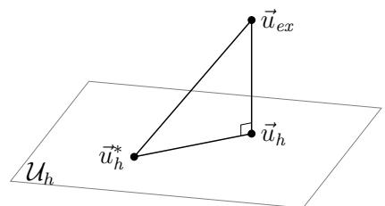
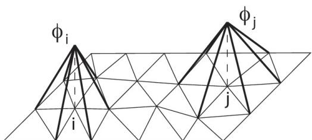

## Chapitre 9

# Initiation aux méthodes d’éléments finis en déplacement

On se limitera aux méthodes d’éléments finis dites « en déplacement » pour les problèmes d’élasticité, qui sont fondées sur le théorème de l’énergie potentielle.

## 9.1 Principes de base

## 9.1.1 Hypothèses

On considère ici un problème d’élasticité en 3D. Dans un premier temps, pour simplifier, on suppose que le champ de déplacement est imposé nul sur une partie de la frontière $\partial \Omega _ { u } .$ , de mesure non nulle. Cela implique que les mouvements de corps rigide sont forcément bloqués.

Avec cette hypothèse, notée H, la solution exacte en déplacement $\vec { u } _ { e x }$ est unique et les champs CA sont les éléments de l’espace vectoriel $\mathcal { U } _ { a d }$

## 9.1.2 Problème exact

Rappelons que $\vec { u } _ { e x }$ est la solution (unique ici) du problème de minimisation :

$$
\min _ {\vec {u} \in \mathcal {U} _ {a d}} E _ {p} (\vec {u}) \qquad \text { soit } \qquad \vec {u} _ {e x} = \underset {\vec {u} \in \mathcal {U} _ {a d}} {\arg \min} E _ {p} (\vec {u})\tag{9.1}
$$

Une fois le champ $\vec { u } _ { e x }$ déterminé, la contrainte associée $\sigma _ { e x }$ s’obtient en utilisant la relation de comportement :

$$
\sigma_ {e x} = \mathbf {K}: \varepsilon (\vec {u} _ {e x})\tag{9.2}
$$

## 9.1.3 Problème approché discrétisé – solution approchée

## Formulation

L’idée de base est de minimiser l’énergie potentielle, non pas sur l’espace $\mathcal { U } _ { a d }$ entier mais sur un sous-espace $\mathcal { U } _ { h }$ de $\mathcal { U } _ { a d }$ de dimension finie N. Le problème approché est donc :

$$
\min _ {\vec {u} \in \mathcal {U} _ {h}} E _ {p} (\vec {u}) \qquad \text { soit } \qquad \vec {u} _ {h} = \underset {\vec {u} \in \mathcal {U} _ {h}} {\arg \min} E _ {p} (\vec {u})\tag{9.3}
$$

La solution de ce problème, notée ${ \vec { u } } _ { h }$ , est une approximation de $\vec { u } _ { e x }$ . Pour obtenir une approximation de la contrainte, on utilise la relation de comportement : $\boldsymbol { \sigma } _ { h } = \mathbf { K } : \varepsilon ( \vec { u } _ { h } )$

## Écriture des conditions de minimisation

Soit $( \vec { \phi } _ { 1 } , \vec { \phi } _ { 2 } , \ldots , \vec { \phi } _ { N } )$ une base de $\mathcal { U } _ { h }$ (constituée de champs de déplacement CA, tous linéairement indépendants). Alors tous les champs $\vec{u}$ de $\mathcal { U } _ { h }$ sont de la forme :

$$
\vec {u} (M) = \sum_ {i = 1} ^ {N} u _ {i} \vec {\phi} _ {i} (M) \quad (\text { où   les   } u _ {i} \text {   sont   des   réels })\tag{9.4}
$$

Proposition 9.1 Pour les champs $\vec { u } \in \mathcal { U } _ { h }$ , l’énergie potentielle est de la forme :

$$
E _ {p} (\{U \}) = \frac {1}{2} \{U \} ^ {\mathsf {T}} [ K ] \{U \} - \{F \} ^ {\mathsf {T}} \{U \}\tag{9.5}
$$

avec

• {U} : Vecteur des degrés de liberté (inconnues du problème), de dimension N et d’éléments :

$$
u _ {i} \quad \Longrightarrow \quad \{U \} = [ u _ {1}, u _ {2}, \dots , u _ {N} ] ^ {\mathsf {T}}\tag{9.6}
$$

$[ K ]$ : Matrice de rigidité (symétrique), de taille $N \times N$ et d’éléments :

$$
K _ {i j} = \int_ {\Omega} \varepsilon (\vec {\phi} _ {i}): \mathbf {K}: \varepsilon (\vec {\phi} _ {j}) \mathrm{d} V\tag{9.7}
$$

$\{ F \}$ : Vecteur de force généralisée (ou second membre), de dimension N et d’éléments :

$$
F _ {i} = \int_ {\Omega} \vec {f} _ {d} \cdot \vec {\phi} _ {i} \mathrm{d} V + \int_ {\partial \Omega_ {T}} \vec {T} _ {d} \cdot \vec {\phi} _ {i} \mathrm{d} S\tag{9.8}
$$

Sous les hypothèses H précédentes, les conditions de minimisation donnent :

$$
[ K ] \{U \} = \{F \}\tag{9.9}
$$

## Détermination de la solution approchée

Sous les hypothèses H précédentes, la matrice $[ K ]$ est régulière. Le système $[ K ] \left\{ U \right\} =$ $\{ F \}$ admet donc une solution unique $\{ U _ { h } \} = [ u _ { h 1 } , u _ { h 2 } , \ldots , u _ { h N } ] ^ { \mathsf { T } }$ . La solution est alors :

$$
\vec {u} _ {h} (M) = \sum_ {i = 1} ^ {N} u _ {h i} \vec {\phi} _ {i} (M) \quad \mathsf {e t} \quad \sigma_ {h} (M) = \sum_ {i = 1} ^ {N} u _ {h i} \mathbf {K}: \varepsilon [ \vec {\phi} _ {i} (M) ]\tag{9.10}
$$

## 9.1.4 Propriétés complémentaires

## Origine des approximations

Le couple approché $( \vec { u } _ { h } , \sigma _ { h } )$ vérifie les liaisons cinématiques et la relation de comportement. L’approximation porte donc sur les équations d’équilibre ; celles-ci ne sont pas vérifiées par $\sigma _ { h }$

Proposition 9.2 La contrainte $\sigma _ { h }$ est telle que :

$$
\forall \vec {u} _ {h} ^ {*} \in \mathcal {U} _ {h}, \quad \int_ {\Omega} \sigma_ {h}: \varepsilon (\vec {u} _ {h} ^ {*}) \mathrm{d} V = \int_ {\Omega} \vec {f} _ {d} \cdot \vec {u} _ {h} ^ {*} \mathrm{d} V + \int_ {\partial \Omega_ {T}} \vec {T} _ {d} \cdot \vec {u} _ {h} ^ {*} \mathrm{d} S\tag{9.11}
$$

C’est une forme affaiblie de l’équilibre vérifié par la contrainte exacte $\sigma _ { e x }$ :

$$
\forall \vec {u} ^ {\star} \in \mathcal {U} _ {a d}, \quad \int_ {\Omega} \sigma_ {e x}: \varepsilon (\vec {u} ^ {\star}) \mathrm{d} V = \int_ {\Omega} \vec {f} _ {d} \cdot \vec {u} ^ {\star} \mathrm{d} V + \int_ {\partial \Omega_ {T}} \vec {T} _ {d} \cdot \vec {u} ^ {\star} \mathrm{d} S\tag{9.12}
$$

On dit que $\sigma _ { h }$ vérifie l’équilibre au sens (faible) des éléments finis.

## Interprétation dans l’espace des champs CA

Posons

$$
\langle \vec {u} _ {1}, \vec {u} _ {2} \rangle_ {\mathcal {U}} = \int_ {\Omega} \varepsilon (\vec {u} _ {1}): \mathbf {K}: \varepsilon (\vec {u} _ {2}) \mathrm{d} V \quad \mathsf {e t} \quad \| \vec {u} \| _ {\mathcal {U}} = \left[ \int_ {\Omega} \varepsilon (\vec {u}): \mathbf {K}: \varepsilon (\vec {u}) \mathrm{d} V \right] ^ {1 / 2}
$$

On définit ainsi un produit scalaire et une norme sur U.

Proposition 9.3 Pour tout $\vec { u } _ { h } ^ { * } \in \mathcal { U } _ { h }$ , on a l’orthogonalité (Figure 9.1) :

$$
\langle \vec {u} _ {e x} - \vec {u} _ {h}, \vec {u} _ {h} - \vec {u} _ {h} ^ {*} \rangle_ {\mathcal {U}} = 0\tag{9.13}
$$

Par conséquent, pour tout $\vec { u } _ { h } ^ { * } \in \mathcal { U } _ { h }$

$$
\| \vec {u} _ {e x} - \vec {u} _ {h} \| _ {\mathcal {U}} \leqslant \| \vec {u} _ {e x} - \vec {u} _ {h} ^ {*} \| _ {\mathcal {U}}\tag{9.14}
$$

c’est-à-dire que la solution approchée ${ \vec { u } } _ { h }$ est le champ de $\mathcal { U } _ { h }$ le plus « proche » de $\vec { u } _ { e x }$ au sens de la norme $\| \bullet \| _ { \mathcal { U } }$

Figure 9.1 – Interprétation dans l’espace des déplacements CA.

## Bases adaptées aux méthodes d’éléments finis

La détermination de la matrice de rigidité nécessite a priori $N ( N + 1 ) / 2$ calculs d’inté- grales sur toute la structure ce qui conduit, quand N est grand, à des calculs importants. Pour simplifier ces calculs, l’idée est de choisir les champs $\vec { \phi _ { i } }$ de la base de façon à ce qu’ils ne soient non nuls que sur une petite partie de la structure. Ainsi de nombreux termes $K _ { i j }$ sont nuls et ne sont pas calculés. Pour les termes non nuls, l’intégrale ne porte que sur un petit nombre d’éléments. C’est ce type de propriété qui distingue une méthode d’éléments finis d’une méthode de Ritz-Galerkin classique.

En 2D, on choisit comme sous-espace $\mathcal { U } _ { h }$ le sous-espace des fonctions continues sur le domaine et affines par triangle (plus généralement polynomiales par morceaux). En introduisant un maillage, les fonctions de forme valent 1 en un noeud particulier du maillage et 0 en tous les autres noeuds (Figure 9.2).

Figure 9.2 – Fonctions de base dans un maillage par des triangles

## 9.2 Traitement général des conditions aux limites

L’objet est de donner les méthodes d’utilisation de la MEF lorsque les hypothèses H précédentes ne sont plus vérifiées.

## 9.2.1 Cas où il n’y a pas de déplacement imposé

D’une manière générale, la matrice [K] est singulière s’il existe dans $\left\{ U _ { h } \right\}$ des champs non nuls qui sont à déformation nulle (modes rigides). Si c’est le cas, la charge généralisée $\{ F \}$ doit être orthogonale au noyau de [K] ; sinon le problème n’a pas de solution. En pratique, des considérations purement mécaniques permettent de vérifier cette propriété. Pour résoudre le système, on bloque des degrés de liberté (ddl) de façon à rendre le système régulier. Ensuite, une fois qu’une solution particulière est calculée, on peut lui ajouter un mode rigide arbitraire.

## 9.2.2 Cas d’un déplacement imposé non nul

Plusieurs méthodes peuvent être employées pour imposer des contraintes liées à un déplacement imposé non nul (ou nul) :

— méthode d’élimination dans laquelle on résout le système directement en remplaçant les valeurs imposées par leur valeur ;

— méthode de pénalisation ;

— méthode des multiplicateurs de Lagrange.

## Méthode des multiplicateurs de Lagrange

Cette méthode est un moyen très général pour résoudre les problèmes d’optimisation sous contraintes (c’est aussi une méthode très efficace pour construire de nouvelles formulations pour les problèmes de mécanique).

On considère le problème de minimisation sous contrainte suivant :

$$
\min _ {[ C ] \{U \} = \{\beta \}} E _ {p} (\{U \})\tag{9.15}
$$

où $[ C ] \left\{ U \right\} = \left\{ \beta \right\}$ traduit des contraintes linéaires sur la variable d’optimisation $\{ U \}$ , avec :

$- \textrm { } [ C ]$ : matrice de taille $p \times N$

— {β} : vecteur de dimension p

Soit $E_p$ une fonction définie sur un espace vectoriel de dimension finie $N$. On définit le lagrangien :

$$
f \left(\{U \}, \{\Lambda \}\right) = E _ {p} (\{U \}) + \{\Lambda \} ^ {\mathsf {T}} \left([ C ] \{U \} - \{\beta \}\right)\tag{9.16}
$$

Proposition 9.4 $S i \left\{ U _ { e x } \right\}$ est la solution du problème, il existe un vecteur $\{ \Lambda \}$ de $\mathbb { R } ^ { p }$ tel que :

$$
\nabla E_p(\{U_{ex}\}) + [C]^{\mathsf T}\{\Lambda\}=0
$$

> **Erratum théorique (PDF, p. 3, proposition 9.4).** Le PDF écrit $\partial f(U_{ex})/\partial U=C^T\Lambda$, alors que $f$ vient de désigner le lagrangien. Pour le signe choisi en (9.16), la condition correcte est $\nabla E_p(U_{ex})+C^T\Lambda=0$ ; il faut aussi $CU_{ex}=\beta$.

Le lagrangien est stationnaire au couple solution-multiplicateur :

$$
\min_{\{U\}}\;\sup_{\{\Lambda\}} f(\{U\},\{\Lambda\})\tag{9.17}
$$

> **Erratum théorique (PDF, p. 3, formule 9.17).** Le PDF minimise simultanément en $U$ et $\Lambda$. Pour tout $U$ non admissible ($CU\ne\beta$), la dépendance affine en $\Lambda$ rend cette fonction non bornée inférieurement ; la minimisation conjointe n’existe donc pas. La formulation ci-dessus donne le problème contraint et ses conditions de point selle, sous les hypothèses usuelles d’existence.

Les conditions de stationnarité sont :

$$
\frac {\partial f}{\partial \left\{U \right\}} = 0 \quad \Longrightarrow \quad \left[ K \right] \left\{U \right\} - \left\{F \right\} + \left[ C \right] ^ {\mathsf {T}} \left\{\Lambda \right\} = 0\tag{9.18}
$$

$$
\frac {\partial f}{\partial \left\{\Lambda \right\}} = 0 \quad \Longrightarrow \quad [ C ] \left\{U \right\} - \left\{\beta \right\} = 0\tag{9.19}
$$

On résout donc le système :

$$
\left[ \begin{array}{c c} [ K ] & [ C ] ^ {\mathsf {T}} \\ [ C ] & 0 \end{array} \right] \left[ \begin{array}{c} \{U \} \\ \{\Lambda \} \end{array} \right] = \left[ \begin{array}{c} \{F \} \\ \{\beta \} \end{array} \right]\tag{9.20}
$$

Qui peut se réécrire de manière condensée :

$$
[ \hat {K} ] \{\hat {U} \} = \{\hat {F} \}\tag{9.21}
$$

avec

$$
[ \hat {K} ] = \left[ \begin{array}{c c} [ K ] & [ C ] ^ {\mathsf {T}} \\ [ C ] & 0 \end{array} \right] \qquad ; \qquad \{\hat {U} \} = \left[ \begin{array}{c} \{U \} \\ \{\Lambda \} \end{array} \right] \qquad \texttt {e t} \qquad \{\hat {F} \} = \left[ \begin{array}{c} \{F \} \\ \{\beta \} \end{array} \right]\tag{9.22}
$$

Remarque 9.1 Les composantes de {Λ} peuvent s’interpréter comme des efforts de réaction.

Remarque 9.2 La matrice $[ \hat { K } ]$ est symétrique mais n’est pas définie positive. La résolution du système doit donc se faire avec un algorithme ne nécessitant pas cette propriété.

Posons :

$$
\mathcal {L} (\{U \}; \{\Lambda \}) = \frac {1}{2} \{U \} ^ {\mathsf {T}} [ K ] \{U \} - \{F \} ^ {\mathsf {T}} \{U \} + \{\Lambda \} ^ {\mathsf {T}} [ [ C ] \{U \} - \{\beta \} ]\tag{9.23}
$$

Cette fonction est appelée un Lagrangien. Le système précédent traduit les conditions d’extrémalité du Lagrangien.

## 9.3 Fonctions de forme

## 9.3.1 Propriétés

— continues (mais leurs dérivées sont souvent discontinues d’un élément à l’autre) ;

— non nulles que sur les éléments contenant leur nœud d’attache (et, donc, nulles dans tous les autres éléments) ;

— d’amplitude égale à 1 à leur nœud d’attache et 0 à tous les autres nœuds du maillage.

Les fonctions de forme permettent d’exprimer le déplacement $\vec { u } ( M )$ en tout point M d’un élément, en fonction des déplacements discrétisés aux nœuds de l’éléménts. Par exemple pour un élément 2D triangulaire à 3 nœuds (linéaire) :

$$
\vec {u} (M) = \binom{u (M)}{v (M)} \quad \xrightarrow {\text { fonctions   de   forme }} \quad \left\{q _ {e} \right\} = \left[ \begin{array}{c} u _ {1} \\ v _ {1} \\ u _ {2} \\ v _ {2} \\ u _ {3} \\ v _ {3} \end{array} \right]\tag{9.24}
$$

## 9.3.2 Approximation sur un élément barre (1D)

## Approximation du déplacement

Dans un élément barre (1D), c’est-à-dire ne travaillant qu’en traction-compression, le déplacement longitudinal peut s’exprimer dans le repère local de l’élément :

$$
\vec {u} _ {e} (x) = u (x) \vec {e _ {x}} \quad \texttt {a v e c} \quad u _ {e} (x) = a x + b \quad \texttt {e t} \quad \left\{ \begin{array}{l} u (x = 0) = u _ {1} \\ u (x = L _ {e}) = u _ {2} \end{array} \right.\tag{9.25}
$$

où $u _ { 1 }$ et $u _ { 2 }$ sont les valeurs des déplacements aux nœuds définissant l’élément. On parle aussi de degrés de liberté ou d’inconnues nodales. Dans un problème de thermique, il s’agira des températures aux nœuds.

Le vecteur de degrés de libertés local à cet élémént est donc :

$$
\{q _ {e} \} = \binom{u _ {1}}{u _ {2}}\tag{9.26}
$$

On peut exprimer le déplacement local comme une interpolation linéaire de ces degrés de liberté et ainsi faire apparaitre les fonctions de forme de l’élément (propres à chaque nœud) :

$$
u _ {e} (x) = \underbrace {\left(1 - \frac {x}{L _ {e}}\right)} _ {N _ {1} (x)} u _ {1} + \underbrace {\left(\frac {x}{L _ {e}}\right)} _ {N _ {2} (x)} u _ {2}\tag{9.27}
$$

Ces fonctions de forme sont définies une fois pour toute lors de la formulation de l’élément de référence.

$$
u _ {e} (x) = \left[ \begin{array}{c c} N _ {1} (x) & N _ {2} (x) \end{array} \right] \binom{u _ {1}}{u _ {2}} = [ N ] \left\{q _ {e} \right\}\tag{9.28}
$$

où [N] est la matrice des fonctions de forme de l’élément avec :

— autant de lignes que dimensions de l’élément ;

— autant de colonnes que de degrés de libertés (inconnues nodales) dans l’élément.

## Approximation de la déformation

Pour exprimer la déformation dans l’élément, il faut passer par une dérivation par rapport à l’espace. Celle s’effectue donc sur les fonctions de forme :

$$
\varepsilon (x) \stackrel {{\mathrm{1D}}} {{=}} \left[ \varepsilon_ {x x} (M) \right] \quad \stackrel {{\text {discrétisation}}} {{\Longrightarrow}} \quad \varepsilon (x) = \left[ \varepsilon_ {e} (x) \right]\tag{9.29}
$$

$$
\varepsilon_ {e} (x) = \frac {\partial}{\partial x} [ u _ {e} (x) ] = N _ {1, x} (x) u _ {1} + N _ {2, x} (x) u _ {2} = [ D ] [ N ] \{q _ {e} \} = [ B ] \{q _ {e} \}\tag{9.30}
$$

où [D] est la matrice de dérivation avec :

— autant de lignes que de composantes d’un tenseur symétrique ;

— autant de colonnes que de dimensions.

On a alors :

$$
[ B ] = [ D ] [ N ] \quad \text {avec ici} \quad [ D ] = \left[ \frac {\partial}{\partial x} \right] \quad \text {et} \quad [ B ] = \left[ \begin{array}{cc} \frac{\partial N_1}{\partial x} & \frac{\partial N_2}{\partial x} \end{array} \right]\tag{9.31}
$$

> **Erratum dimensionnel (PDF, p. 5, formule 9.31).** Le PDF imprime $[B]$ en colonne $2\times1$ ; les formules (9.28), (9.30) et (9.32) exigent une ligne $1\times2$, puisque $[B]\{q_e\}$ est un scalaire.

## Approximation de la contrainte

Toujours dans le cas de l’élément barre, on peut exprimer la contrainte longitudinale à partir de la déformation :

$$
\sigma (M) = \mathbf {K}: \varepsilon \stackrel {{1 D}} {{=}} E \varepsilon_ {x x} \quad \xrightarrow {\text {discrétisation}} \quad \sigma (M) = E \varepsilon_ {e} = E [ B ] \left\{q _ {e} \right\}\tag{9.32}
$$

## Approximation de l’énergie potentielle

## 9.4 Assemblage

L’assemblage consiste à rassembler la contribution :

— de chaque élément à la rigidité globale pour construire la matrice de rigidité globale du domaine, notée $[ K ]$

— de chaque partie du chargement pour construire le vecteur de forces nodales (ou vecteur de forces généralisées), noté $\{ F \}$

Ceci dans le but de déterminer les valeurs des degrés de libertés, c’est-à-dire chaque composante des déplacements en chaque nœud, rassemblés dans le vecteur de déplacements nodaux (ou vecteur de déplacements généralisés), noté $\{ U \}$ , et ce en inversant le système :

$$
[ K ] \{U \} = \{F \}\tag{9.33}
$$
