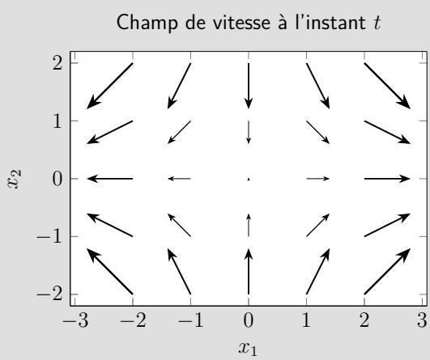
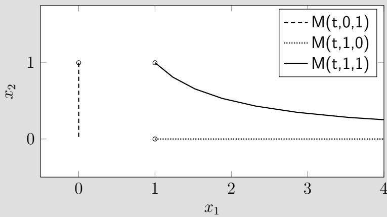

| Numéro d’anonymat | Feuille |
|---|---|
| … | … / … |

École Normale Supérieure Paris-Saclay

Master 2 CHPS

## IMMC – Introduction à la Mécanique des Milieux Continus

## Examen (correction)

Session 1 – Contrôle continu 1 – Mercredi 23 octobre 2024 – 1 heure

Tous les documents de CM et TD sont autorisés. L’usage des calculatrices, téléphones portables, oreillettes, tablettes et ordinateurs est interdit.

## Exercice 1 – Questions de cours et compréhension (QCM)

— Indiquer le nom ou numéro d’anonymat ainsi que la numérotation de la feuille dans les cadres en haut des pages recto du QCM.

— Répondre aux questions en cochant les cases des bonnes réponses directement sur ces feuilles, sans justification.

— Pour chaque question, il n’y aucun point négatif si la réponse globale est incorrecte.

— Remettre ces feuilles avec les autres copies d’examen.

Question 1.1 : Lister les éléments donnés en description eulérienne (A et B sont des constantes).

- [x] (A) $\rho ( t , \vec { M } ) = A x _ { 1 } - B x _ { 2 } \rho _ { 0 }$
- [x] (B) $\vec { V } ( t , \vec { M } ) = A x _ { 1 } \vec { e } _ { 1 } + B t \vec { e } _ { 2 }$
- [ ] (C) $\vec { u } ( t , \vec { M _ { 0 } } ) = A X _ { 2 } \vec { e _ { 1 } }$
- [x] (D) $\vec { \Gamma } ( t , \vec { M } ) = ( x _ { 1 } ) ^ { 2 } \vec { e } _ { 1 } + ( x _ { 2 } ) ^ { 2 } \vec { e } _ { 2 }$

Question 1.2 : Quelles sont les caractéristiques du mouvement que décrit l’équation suivante ?

$$
\vec {V} (t, M) = \omega (x _ {2} \vec {e} _ {1} - x _ {1} \vec {e} _ {2})
$$

où $( x _ { 1 } , x _ { 2 } , x _ { 3 } )$ sont les coordonnées courantes du point M et ω une constante.

- [ ] (A) Irrotationnel
- [x] (B) Stationnaire
- [x] (C) Incompressible
- [x] (D) Mouvement de corps rigide

Question 1.3 : En quel(s) mouvement(s) élémentaire(s) peut-on décomposer le mouvement d’un milieu déformable ?

- [x] (A) Une translation
- [ ] (B) Une symétrie
- [x] (C) Une rotation
- [x] (D) Une déformation

Question 1.4 : Quel(s) mouvement(s) homogène(s) s’opère(nt) forcément à volume constant ?

- [ ] (A) Contraction uniaxiale
- [ ] (B) Extension uniaxiale
- [x] (C) Translation
- [x] (D) Glissement simple
- [ ] (E) Dilatation
- [x] (F) Rotation

Question 1.5 : Si une barre de 1 m est dilatée d’un facteur 2 selon son axe, que vaut sa déformation dans cette même direction ?

- [ ] (A) 1 m
- [ ] (B) 2 m
- [x] (C) 1
- [ ] (D) 2
- [ ] (E) 1 %
- [ ] (F) 2 %
- [x] (G) 100 %
- [ ] (H) 200 %

Question 1.6 : Avec $\overrightarrow { O M }$ , le vecteur position du point M, $\sigma$ le tenseur de contraintes et $\vec { n }$ la normale sortante au point M du domaine Ω, en quelle(s) unité(s) peut-on exprimer la quantité suivante ? $\overrightarrow { O M } \wedge \sigma ( M ) \cdot \vec { n } ( M )$

- [ ] (A) Pa
- [ ] (B) $\mathsf { P a } \cdot \mathsf { m } ^ { - 1 }$
- [x] (C) $\mathsf { P a } \cdot \mathsf { m }$
- [ ] (D) ${ \sf M P a }$
- [ ] (E) $\mathsf { M P a } \cdot \mathsf { m } ^ { - 1 }$
- [x] (F) ${ \mathsf { M P a } } \cdot { \mathsf { m } }$
- [ ] (G) N
- [x] (H) $\mathsf { N } \cdot \mathsf { m } ^ { - 1 }$
- [ ] (I) N · m

Question 1.7 : Quelles affirmations sont vraies pour cet état de contrainte ?

$$
\sigma=\begin{pmatrix}\alpha&0&\gamma\\0&\alpha&0\\\gamma&0&\beta\end{pmatrix}
$$

- [x] (A) Dans la facette de normale $\vec { e } _ { 1 }$ , la contrainte normale vaut α.
- [ ] (B) Dans la facette de normale $\vec { e } _ { 1 }$ , la contrainte tangentielle vaut α.
- [x] (C) Dans la facette de normale $\vec { e } _ { 1 }$ , la contrainte tangentielle vaut $\gamma .$
- [x] (D) Dans la facette de normale $\vec { e } _ { 3 }$ , la contrainte normale vaut $\beta .$
- [ ] (E) Dans la facette de normale $\vec { e } _ { 3 } ,$ , la contrainte tangentielle vaut $\beta .$
- [x] (F) Dans la facette de normale $\vec { e } _ { 3 }$ , la contrainte tangentielle vaut $\gamma .$

Question 1.8 : Que peut-on dire de ce tenseur de contraintes ?

$$
\sigma=\begin{pmatrix}\sigma_1&0&0\\0&\sigma_2&0\\0&0&0\end{pmatrix}_{(\vec{e}_1,\vec{e}_2,\vec{e}_3)}
$$

avec $\sigma_1$ et $\sigma_2$ des constantes strictement positives et $\sigma_1\ne\sigma_2$.

- [ ] (A) Il est de traction pure.
- [ ] (B) Il est sphérique.
- [x] (C) Il est à divergence nulle.
- [ ] (D) Il est de cisaillement pur.
- [ ] (E) Il est déviatorique.
- [x] (F) Il est biaxial.
- [x] (G) Il est plan.

Question 1.9 : Le déviateur d’un tenseur symétrique du second ordre est un tenseur dont on a remplacé les termes diagonaux par des zéros.

- [ ] (A) Vrai
- [x] (B) Faux

Question 1.10 : Comment se traduit une condition aux limites en pression p en chaque point M de la surface ∂Ω d’un solide ?

- [ ] (A) $\sigma ( M ) = - p \mathbb { I }$
- [ ] (B) $\sigma ( M ) = p \mathbb { I }$
- [x] (C) $\sigma ( M ) \cdot \vec { n } = - p \vec { n } ( M )$
- [ ] (D) $\sigma ( M ) \cdot \vec { n } = p \vec { n } ( M )$

## Exercice 2 – Descriptions eulérienne et lagrangienne

On considère le mouvement plan d’un milieu continu défini par la représentation suivante du champ des vitesses en description eulérienne :

$$
\vec {V} (M) = \alpha (x _ {1} \vec {e} _ {1} - x _ {2} \vec {e} _ {2}) = \left( \begin{array}{c} \alpha x _ {1} \\ - \alpha x _ {2} \\ 0 \end{array} \right) _ {(\vec {e} _ {1}, \vec {e} _ {2}, \vec {e} _ {3})}
$$

exprimé dans la base cartésienne $( \vec { e } _ { 1 } , \vec { e } _ { 2 } , \vec { e } _ { 3 } )$ , α étant un scalaire constant, supposé positif.

On désigne par $( x _ { 1 } , x _ { 2 } , x _ { 3 } )$ les composantes du vecteur position $\vec{x}$ d’une particule à l’instant t, et par $( X _ { 1 } , X _ { 2 } , X _ { 3 } )$ les composantes du vecteur position $\vec { X }$ de cette même particule à l’instant initial $t = 0$ . Le milieu continu occupe à l’instant t le domaine $\Omega ( t )$ défini par $x _ { 1 } > 0 , x _ { 2 } > 0$ et $x _ { 3 }$ quelconque.

Question 2.1 : Quelle est l’unité de la constante α ? Quelle(s) quantité(s) s’expriment dans cette unité ?

Question 2.1 : Solution

La vitesse $\vec { V }$ étant en $\mathsf { m } \cdot \mathsf { s } ^ { - 1 }$ et les coordonnées $x _ { 1 }$ et $x _ { 2 }$ étant en m, α est en $\mathsf { S } ^ { - 1 }$ . Cela correspond à un taux de déformation (aussi appelé vitesse de déformation) ou une fréquence.

Question 2.2 : Tracer, dans le plan $( O , \vec { e } _ { 1 } , \vec { e } _ { 2 } )$ , la forme du champ des vitesses à l’instant t. A que type de mouvement ou phénomène cela peut-il correspondre ?

Question 2.2 : Solution

Question 2.3 : Calculer div $\vec { V }$ . Que peut-on en déduire concernant la variation de volume d’un domaine $\boldsymbol { \omega } ( t ) \in \Omega ( t )$ entre les instants 0 et $t ?$

## Question 2.3 : Solution

La divergence du champ de vitesse se calcule comme la trace du gradient de vitesse :

$$
\operatorname{div} \vec {V} = \frac {\partial V _ {1}}{\partial x _ {1}} + \frac {\partial V _ {2}}{\partial x _ {2}} + \frac {\partial V _ {3}}{\partial x _ {3}} = \alpha - \alpha + 0 = 0\tag{*2.1}
$$

La divergence du champ de vitesse correspond à la variation de volume d’une particule :

$$
\operatorname{div}\vec V=\operatorname{Tr}\mathbb D=\frac{1}{J}\frac{\mathrm DJ}{\mathrm Dt}=\frac{1}{\mathrm dV}\frac{\mathrm D(\mathrm dV)}{\mathrm Dt},\qquad J=\det\mathbb F=\frac{\mathrm dV}{\mathrm dV_0}\tag{*2.2}
$$

> **Erratum théorique (PDF, p. 4, formule *2.2).** Le PDF assimile $\operatorname{div}\vec V$ (un taux en $\mathrm s^{-1}$) à $J-1=(\mathrm dV-\mathrm dV_0)/\mathrm dV_0$ (une variation relative sans unité). La relation correcte est la dérivée temporelle ci-dessus. Pour le champ de cette question, $\operatorname{div}\vec V=0$ et la condition initiale $J(0)=1$ donnent $J(t)=1$.\n\nSi la divergence est nulle le long du mouvement, il n’y a pas de variation du volume matériel : la transformation est isochore et le mouvement incompressible.

Question 2.4 : Calculer le taux de déformation D. Quelles sont les unités de ses composantes ?

## Question 2.4 : Solution

Le taux de déformation D correspond à la partie symétrique du gradient de vitesse, il s’exprime donc en $\mathsf { S } ^ { - 1 }$ . On calcule donc en premier lieu ce gradient :

$$
\overline {{\overline {{\operatorname{grad}}}}}   \vec {V} = \left( \begin{array}{c c c} \frac {\partial V _ {1}}{\partial x _ {1}} & \frac {\partial V _ {1}}{\partial x _ {2}} & \frac {\partial V _ {1}}{\partial x _ {3}} \\ \frac {\partial V _ {2}}{\partial x _ {1}} & \frac {\partial V _ {2}}{\partial x _ {2}} & \frac {\partial V _ {2}}{\partial x _ {3}} \\ \frac {\partial V _ {3}}{\partial x _ {1}} & \frac {\partial V _ {3}}{\partial x _ {2}} & \frac {\partial V _ {3}}{\partial x _ {3}} \end{array} \right) = \alpha \left( \begin{array}{c c c} 1 & 0 & 0 \\ 0 & - 1 & 0 \\ 0 & 0 & 0 \end{array} \right) = \mathbb {D} \quad \texttt {c a r} \quad \mathbb {D} = \frac {1}{2} \left(\overline {{\overline {{\operatorname{grad}}}}}   \vec {V} + \overrightarrow {\operatorname{grad}} ^ {\mathsf {T}}   \vec {V}\right)\tag{*2.3}
$$

Question 2.5 : Déterminer la représentation lagrangienne du mouvement, i.e. les fonctions $f _ { 1 } , f _ { 2 }$ $f _ { 3 }$ telles que :

$$
\begin{array}{l} x _ {1} = f _ {1} (X _ {1}, X _ {2}, X _ {3}, t) \\ x _ {2} = f _ {2} (X _ {1}, X _ {2}, X _ {3}, t) \\ x _ {3} = f _ {3} (X _ {1}, X _ {2}, X _ {3}, t) \end{array}
$$

## Question 2.5 : Solution

On pose, à partir de la description eulérienne du mouvement, le système d’équations différentielles suivant :

$$
\left\{ \begin{array}{l} \dot {x} _ {1} = \alpha x _ {1} \\ \dot {x} _ {2} = - \alpha x _ {2} \\ \dot {x} _ {3} = 0 \end{array} \right.
$$

avec pour conditions initiales

$$
\left\{ \begin{array}{l} x _ {1} (0) = X _ {1} \\ x _ {2} (0) = X _ {2} \\ x _ {3} (0) = X _ {3} \end{array} \right.
$$

$$
\left\{ \begin{array}{l} x _ {1} (t) = C _ {1} \exp (\alpha t) \\ x _ {2} (t) = C _ {2} \exp (- \alpha t) \\ x _ {3} (t) = C _ {3} \end{array} \right. \quad \Longrightarrow \quad \left\{ \begin{array}{l} x _ {1} (0) = C _ {1} = X _ {1} \\ x _ {2} (0) = C _ {2} = X _ {2} \\ x _ {3} (0) = C _ {3} = X _ {3} \end{array} \right. \quad \Longrightarrow \quad \left\{ \begin{array}{l} x _ {1} (t) = X _ {1} \exp (\alpha t) \\ x _ {2} (t) = X _ {2} \exp (- \alpha t) \\ x _ {3} (t) = X _ {3} \end{array} \right.
$$

Question 2.6 : Tracer la trajectoire des points initialement situés en (0, 1, 0), (1, 0, 0) et (1, 1, 0).

## Question 2.6 : Solution

Trajectoires des points (0, 1, 0), (1, 0, 0) et (1, 1, 0)

Question 2.7 : Déterminer le tenseur gradient de la transformation $\mathbb { F } .$ En déduire que la masse volumique d’une particule reste constante au cours du temps.

## Question 2.7 : Solution

$$
\mathbb {F} = \frac {\partial \overrightarrow {O M}}{\partial \overrightarrow {O M _ {0}}} = \left( \begin{array}{c c c} \exp (\alpha t) & 0 & 0 \\ 0 & \exp (- \alpha t) & 0 \\ 0 & 0 & 1 \end{array} \right) \quad \Longrightarrow \quad \det \mathbb {F} = \exp (\alpha t) \cdot \exp (- \alpha t) \cdot 1 = 1
$$

Le déterminant de cette matrice correspond au Jacobien, ce qui permet de déterminer la variation de volume des particules. Si on part de la conservation de la masse et qu’on exprime la masse ${ \mathsf { d } } ^ { \prime }$ une particule à l’instant initial et courant :

$$
\mathrm{d} M = \rho_ {0} \mathrm{d} V _ {0} = \rho (t) \mathrm{d} V (t) \quad \Longrightarrow \quad \rho_ {0} = \rho (t) \frac {\partial V (t)}{\partial V _ {0}} = \rho \det \mathbb {F} (t) = \rho (t)
$$

Question 2.8 : Calculer le tenseur des déformations de Green-Lagrange E. Quelles sont les unités des composantes des deux tenseurs $\mathbb { F }$ et E ?

## Question 2.8 : Solution

Les composantes des tenseurs gradient de la transformation $\mathbb { F }$ et des déformations de Green-Lagrange $\mathbb { E }$ sont toutes adimensionnelles.

$$
\mathbb {E} = \frac {1}{2} (\mathbb {F} ^ {\mathsf {T}} \cdot \mathbb {F} - \mathbb {I}) = \frac {1}{2} \left( \begin{array}{c c c} \exp (2 \alpha t) - 1 & 0 & 0 \\ 0 & \exp (- 2 \alpha t) - 1 & 0 \\ 0 & 0 & 0 \end{array} \right)
$$

Question 2.9 : Donner, sans passer par des calculs, une déformation principale et une direction principale de déformation.

## Question 2.9 : Solution

On constate que les déformations sont planes, dans le plan $( \vec { e } _ { 1 } , \vec { e } _ { 2 } )$ . La direction $\vec { e } _ { 3 }$ est donc une direction principale, correspondant à une déformation principale nulle.

Question 2.10 : Pour quelles valeurs de t peut-on utiliser la forme linéarisée du tenseur des déformations ? En déduire l’expression de tenseur des déformations linéarisé $\varepsilon$, en avec ces simplifications. Comparer les expressions obtenues pour D et $\varepsilon$.

Question 2.10 : Solution

On peut utiliser cette forme dans le cadre HPP (déplacements et transformations infinitésimaux). Sans information sur la taille du domaine, on peut uniquement se baser sur l’hypothèse de transformations infinitésimales :

$$
\overline {{\overline {{\operatorname{grad}}}}}   \vec {u} = \mathbb {F} - \mathbb {I} = \left( \begin{array}{c c c} \exp (\alpha t) & 0 & 0 \\ 0 & \exp (- \alpha t) & 0 \\ 0 & 0 & 1 \end{array} \right) - \left( \begin{array}{c c c} 1 & 0 & 0 \\ 0 & 1 & 0 \\ 0 & 0 & 1 \end{array} \right) = \left( \begin{array}{c c c} \exp (\alpha t) - 1 & 0 & 0 \\ 0 & \exp (- \alpha t) - 1 & 0 \\ 0 & 0 & 0 \end{array} \right)
$$

$$
\left\| \overline {{\overline {{\operatorname{grad}}}}} \vec {u} \right\| \ll 1 \quad \Longrightarrow \quad \max \left(| \exp (\alpha t) - 1 |, | \exp (- \alpha t) - 1 |\right) \ll 1 \quad \Longrightarrow \quad | t | \ll \frac {\ln (2)}{\alpha} \approx \frac {0 . 7}{\alpha}
$$

Cela correspond au tout début de la déformation (du mouvement). Dans ces conditions :

$$
| t | \ll \frac {1}{\alpha} \quad \stackrel {{\alpha > 0}} {{\Longrightarrow}} \quad | \alpha t | \ll 1 \quad \stackrel {{\text { D.L. au } 1 ^ {\text { er }} \text { ordre }}} {{\Longrightarrow}} \quad \left\{ \begin{array}{l} \exp (\alpha t) \simeq 1 + \alpha t \\ \exp (- \alpha t) \simeq 1 - \alpha t \end{array} \right.
$$

On peut alors écrire l’expression du tenseur $\varepsilon$ :

$$
\varepsilon = \frac {1}{2} \left[ \overline {{\overline {{\text {grad}}}}}   \vec {u} + \overline {{\overline {{\text {grad}}}}} ^ {\mathsf {T}}   \vec {u} \right] = \overline {{\overline {{\text {grad}}}}}   \vec {u} = \left( \begin{array}{c c c} \exp (\alpha t) - 1 & 0 & 0 \\ 0 & \exp (- \alpha t) - 1 & 0 \\ 0 & 0 & 0 \end{array} \right) \simeq \alpha t \left( \begin{array}{c c c} 1 & 0 & 0 \\ 0 & - 1 & 0 \\ 0 & 0 & 0 \end{array} \right)
$$

On remarque que $\dot { \varepsilon } = \mathbb { D }$ , ce qui est généralement le cas en ${ \mathsf { H P P } }$ pour un mouvement stationnaire, i.e. lorsque $\begin{array} { r } { \frac { \partial \vec { V } } { \partial t } = \vec { 0 } } \end{array}$

Question 2.11 : Calculer le rotationnel du champ de vitesse eulérienne $\vec { V } ( M )$ et donner toutes les caractéristiques de ce mouvement.

## Question 2.11 : Solution

$\overrightarrow{\operatorname{rot}}\vec{V}=\vec{0}$, cela donne donc un mouvement :

— irrotationnel $( \overrightarrow { \mathrm { r o t } } \overrightarrow { V } = \overrightarrow { 0 } )$

— incompressible $( \overrightarrow { \mathrm { d i v } } \overrightarrow { V } = 0 )$

— stationnaire $\begin{array} { r } { ( \frac { \partial \vec { V } } { \partial t } = \vec { 0 } ) } \end{array}$

## Exercice 3 – Champ d’autocontraintes dans un cylindre

On considère un solide dont la configuration d’équilibre statique est un cylindre droit de révolution Ω de hauteur h et de rayon R. L’axe du cylindre étant l’axe $O \vec { e } _ { z }$ , on suppose que les composantes du tenseur des contraintes sont, dans le repère cartésien :

$$
\sigma = \left( \begin{array}{c c c} A (R ^ {2} - x ^ {2} - 3 y ^ {2}) & 2 A x y & 0 \\ & A (R ^ {2} - 3 x ^ {2} - y ^ {2}) & 0 \\ & & 0 \end{array} \right) _ {(\vec {e} _ {x}, \vec {e} _ {y}, \vec {e} _ {z})}\tag{3.1}
$$

Question 3.1 : Compléter la forme du tenseur $\sigma$ .

## Question 3.1 : Solution

Le tenseur (ou opérateur) des contraintes étant symétrique, on a :

$$
\sigma = \left( \begin{array}{c c c} A (R ^ {2} - x ^ {2} - 3 y ^ {2}) & 2 A x y & 0 \\ 2 A x y & A (R ^ {2} - 3 x ^ {2} - y ^ {2}) & 0 \\ 0 & 0 & 0 \end{array} \right) _ {(\vec {e} _ {x}, \vec {e} _ {y}, \vec {e} _ {z})}\tag{*3.1}
$$

Question 3.2 : Dans quelle unité s’exprime la constante A ?

## Question 3.2 : Solution

Les composantes du tenseur des contraintes étant homogènes à une pression ou contrainte, elles s’expriment en Pa ou $\mathsf { N } \cdot \mathsf { m } ^ { - 2 }$ . Pour cela, la constante A doit s’exprimer en $\mathsf { P a } \cdot \mathsf { m } ^ { - 2 }$ ou $\mathsf { N } \cdot \mathsf { m } ^ { - 4 }$

Question 3.3 : Calculer la densité volumique de force $\vec { f } _ { v }$ s’appliquant sur le solide Ω. Commenter.

## Question 3.3 : Solution

Si on applique l’équilibre local, ici en statique :

$$
\overrightarrow {\operatorname{div}} \sigma + \vec {f} _ {v} = \rho \vec {\Gamma} \quad \Longrightarrow \quad \vec {f} _ {v} = - \overrightarrow {\operatorname{div}} \sigma = \left( \begin{array}{l} \frac {\partial \sigma_ {x x}}{\partial x} + \frac {\partial \sigma_ {x y}}{\partial y} + \frac {\partial \sigma_ {x z}}{\partial z} \\ \frac {\partial \sigma_ {y x}}{\partial x} + \frac {\partial \sigma_ {y y}}{\partial y} + \frac {\partial \sigma_ {y z}}{\partial z} \\ \frac {\partial \sigma_ {z x}}{\partial x} + \frac {\partial \sigma_ {z y}}{\partial y} + \frac {\partial \sigma_ {z z}}{\partial z} \end{array} \right)\tag{*3.2}
$$

$$
\Longrightarrow \quad \vec {f} _ {v} = \left( \begin{array}{c} - 2 A x + 2 A x \\ 2 A y - 2 A y \\ 0 \end{array} \right) = \left( \begin{array}{c} 0 \\ 0 \\ 0 \end{array} \right) \quad \Longrightarrow \quad \boxed {\vec {f} _ {v} = \vec {0}}\tag{*3.3}
$$

Aucun effort volumique ne s’applique sur le cylindre.

Question 3.4 : Calculer la densité surfacique de force $\vec { T }$ s’appliquant sur les différentes frontières du solide Ω. Commenter.

## Question 3.4 : Solution

Sur les frontières inférieure $( z = 0 )$ et supérieure $( z = h )$ du cylindre, on a :

$$
\vec {T} (z = 0) = \sigma (z = 0) \cdot \vec {n} (z = 0) = \left( \begin{array}{c c c} A (R ^ {2} - x ^ {2} - 3 y ^ {2}) & 2 A x y & 0 \\ 2 A x y & A (R ^ {2} - 3 x ^ {2} - y ^ {2}) & 0 \\ 0 & 0 & 0 \end{array} \right) \cdot \left( \begin{array}{c} 0 \\ 0 \\ - 1 \end{array} \right) = \left( \begin{array}{c} 0 \\ 0 \\ 0 \end{array} \right)
$$

$$
\Longrightarrow \quad \boxed {\vec {T} (z = 0) = \vec {0}}\tag{*3.4}
$$

$$
\vec {T} (z = h) = \sigma (z = h) \cdot \vec {n} (z = h) = \left( \begin{array}{c c c} A (R ^ {2} - x ^ {2} - 3 y ^ {2}) & 2 A x y & 0 \\ 2 A x y & A (R ^ {2} - 3 x ^ {2} - y ^ {2}) & 0 \\ 0 & 0 & 0 \end{array} \right) \cdot \left( \begin{array}{c} 0 \\ 0 \\ 1 \end{array} \right) = \left( \begin{array}{c} 0 \\ 0 \\ 0 \end{array} \right)
$$

$$
\Longrightarrow \quad \boxed {\vec {T} (z = h) = \vec {0}}\tag{*3.5}
$$

Sur la frontière latérale, on a :

$$
r = R \quad \Longrightarrow \quad x = R \cos \theta \quad ; \quad y = R \sin \theta \quad \text { et } \quad \vec {n} (r = R) = \left( \begin{array}{c} \cos \theta \\ \sin \theta \\ 0 \end{array} \right)\tag{*3.6}
$$

$$
\vec {T} (r = R) = \sigma (r = R) \cdot \vec {n} (r = R)\tag{*3.7}
$$

$$
= A R ^ {2} \left( \begin{array}{c c c} 1 - \cos^ {2} \theta - 3 \sin^ {2} \theta & 2 \cos \theta \sin \theta & 0 \\ 2 \cos \theta \sin \theta & (1 - 3 \cos^ {2} \theta - \sin^ {2} \theta) & 0 \\ 0 & 0 & 0 \end{array} \right) \cdot \begin{pmatrix}\cos\theta\\\sin\theta\\0\end{pmatrix}\tag{*3.8}
$$

$$
= A R ^ {2} \left( \begin{array}{c} (1 - \cos^ {2} \theta - 3 \sin^ {2} \theta) \cos \theta + 2 \cos \theta \sin^ {2} \theta \\ 2 \cos^ {2} \theta \sin \theta + (1 - 3 \cos^ {2} \theta - \sin^ {2} \theta) \sin \theta \\ 0 \end{array} \right)\tag{*3.9}
$$

$$
\vec {T} (r = R) = A R ^ {2} \left( \begin{array}{c} (- 2 \sin^ {2} \theta) \cos \theta + 2 \cos \theta \sin^ {2} \theta \\ 2 \cos^ {2} \theta \sin \theta + (- 2 \cos^ {2} \theta) \sin \theta \\ 0 \end{array} \right) \quad \Longrightarrow \quad \boxed {\vec {T} (r = R) = \vec {0}}\tag{*3.10}
$$

On en déduit qu’aucun effort surfacique ne s’applique sur le solide.

Question 3.5 : Quelle est la particularité du champ de contraintes au sein de ce solide ?

## Question 3.5 : Solution

En l’absence d’efforts extérieurs (surfaciques ou volumiques), des contraintes existent dans ce solide. C’est ce qu’on appelle un champ d’autocontraintes, comme le sont les champs de contraintes résiduelles.

## Formulaire en coordonnées cartésiennes

Soit un champ scalaire $f ( x , y , z )$

$$
\overrightarrow {\operatorname{grad}} f = \frac {\partial f}{\partial x} \vec {e} _ {x} + \frac {\partial f}{\partial y} \vec {e} _ {y} + \frac {\partial f}{\partial z} \vec {e} _ {z}
$$

Soit un champ vectoriel $\vec { U } ( x , y , z ) = U _ { x } \vec { e } _ { x } + U _ { y } \vec { e } _ { y } + U _ { z } \vec { e } _ { z }$

$$
\overline {{\overline {{\operatorname{grad}}}}} \vec {U} = \left( \begin{array}{c c c} \frac {\partial U _ {x}}{\partial x} & \frac {\partial U _ {x}}{\partial y} & \frac {\partial U _ {x}}{\partial z} \\ \frac {\partial U _ {y}}{\partial x} & \frac {\partial U _ {y}}{\partial y} & \frac {\partial U _ {y}}{\partial z} \\ \frac {\partial U _ {z}}{\partial x} & \frac {\partial U _ {z}}{\partial y} & \frac {\partial U _ {z}}{\partial z} \end{array} \right) _ {(\vec {e} _ {x}, \vec {e} _ {y}, \vec {e} _ {z})} \qquad \qquad \overrightarrow {\operatorname{rot}} \vec {U} = \left( \begin{array}{c} \frac {\partial U _ {z}}{\partial y} - \frac {\partial U _ {y}}{\partial z} \\ \frac {\partial U _ {x}}{\partial z} - \frac {\partial U _ {z}}{\partial x} \\ \frac {\partial U _ {y}}{\partial x} - \frac {\partial U _ {x}}{\partial y} \end{array} \right) _ {(\vec {e} _ {x}, \vec {e} _ {y}, \vec {e} _ {z})}
$$

$$
\operatorname{div} \vec {U} = \frac {\partial U _ {x}}{\partial x} + \frac {\partial U _ {y}}{\partial y} + \frac {\partial U _ {z}}{\partial z}
$$

Soit un champ tensoriel d’ordre 2 symétrique $\underline { { \underline { { T } } } } ( x , y , z ) = \left( \begin{array} { l l l } { T _ { x x } } & { T _ { x y } } & { T _ { x z } } \\ & { T _ { y y } } & { T _ { y z } } \\ & & { T _ { z z } } \end{array} \right)$ $(\vec{e}_x,\vec{e}_y,\vec{e}_z)$

$$
\begin{array}{r l} \overrightarrow {\mathrm{div}} \underline {{\underline {{T}}}} = & \left(\frac {\partial T _ {x x}}{\partial x} + \frac {\partial T _ {x y}}{\partial y} + \frac {\partial T _ {x z}}{\partial z}\right) \vec {e} _ {x} \\ & + \left(\frac {\partial T _ {x y}}{\partial x} + \frac {\partial T _ {y y}}{\partial y} + \frac {\partial T _ {y z}}{\partial z}\right) \vec {e} _ {y} \\ & + \left(\frac {\partial T _ {x z}}{\partial x} + \frac {\partial T _ {y z}}{\partial y} + \frac {\partial T _ {z z}}{\partial z}\right) \vec {e} _ {z} \end{array}
$$
