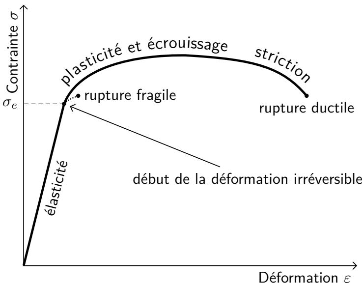
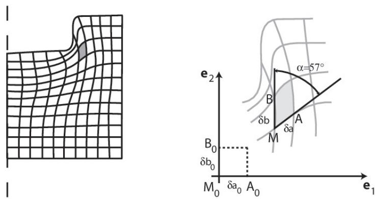
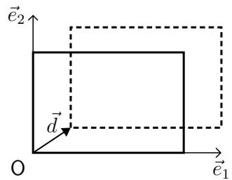
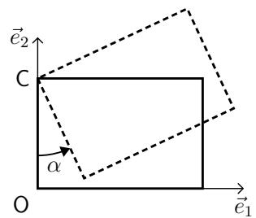
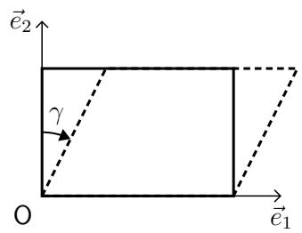
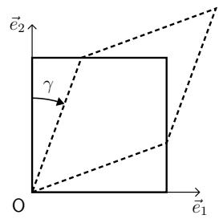
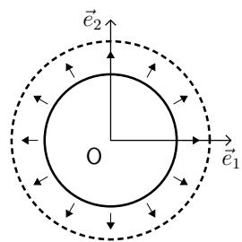
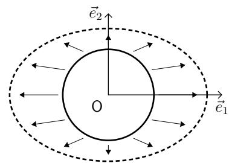

# 第2章 连续介质的变形（Chapitre 2 --- Déformations des milieux continus）

> 对照来源：[教师课件 PDF](IMMC_CM_Chap2_2025-2026.pdf)、[原文转换稿](IMMC_CM_Chap2_2025-2026.md)、[课堂转录 cour2](cour2.md)。正文沿课件 2.1–2.2 的顺序保留公式与图；转录实际讲到 2.1.5，2.2 主要仍据课件，不把它写成已听到的课堂讲解。

## 2.1 变形的概念（La notion de déformation）

这里我们将以拉格朗日表示为立足点，引入一种对连续介质变形进行表征的第一种方式。

目标是定义数学工具，用来刻画（并在可能的情况下测量）连续介质在运动过程中"变形"的程度： 例如距离、角度等的变化。这是一个困难的问题，我们在此仅给出部分答案， 但这些答案在许多情形下已经足够。

**先观察，再计算。** 两个质点一起平移，虽然位置都变了，它们的间距却可以不变；三个质点围成的角度若变了，就能看出剪切或畸变。因此本章前半段先比较相邻物质点的**长度和夹角**，建立依赖初始配置的变形度量。老师随后才转向欧拉视角的变形速率；[cour2](cour2.md) 的转录止于前半段的基本运动，没有覆盖后面的 2.2 节。

*课堂来源：[cour2](cour2.md)，第 1–36 行及 307–321 行。*

### 2.1.1 变换梯度（Gradient de transformation）

我们已经看到，存在一个向量映射，称为*变换*，记作 $\vec{\varphi}$，使得 

$$
\overrightarrow{OM} = \vec{\varphi}(\overrightarrow{OM_0}) .
$$

对这个关系进行微分，可得：

$$
d\overrightarrow{OM} =
\bigl(\mathrm{grad}\,\vec{\varphi}\bigr)\cdot d\overrightarrow{OM_0}
= F \cdot d\overrightarrow{OM_0}
\tag{2.1}
$$

其中 

$$
F =
\frac{\partial\bigl[\vec{\varphi}(\overrightarrow{OM_0})\bigr]}{\partial \overrightarrow{OM_0}}
= \frac{\partial \overrightarrow{OM}}{\partial \overrightarrow{OM_0}}
= \mathrm{grad}\,\vec{\varphi}
\tag{2.2}
$$

$F$ 是**变换梯度算子**[^1]（无量纲）。 它等于：

- 若只有刚体平移、没有转动或内部变形，则为恒等算子 $I$；

- 若没有变形但可以存在刚体类型的旋转和/或刚体类型的平移，则 $F$ 为*正定向等距向量算子*[^2]；

- 若无旋转，则 $F$ 为对称算子（$F^T = F$）。

**它为什么是矩阵？** $\varphi$ 给出三个当前位置坐标，$F_{ij}=\partial x_i/\partial X_j$ 记录初始坐标 $X_j$ 变化一点时，当前位置的第 $i$ 个坐标怎样变化。于是邻近质点间的小向量满足 $\mathrm d\vec x=F\,\mathrm d\vec X$。$F$ 比单个质点的位移多提供了“邻居之间如何相对移动”的信息，但 $F$ 本身还同时含有刚体旋转；不能把 $F-I$ 在任何运动下都叫作变形。

*课堂来源：[cour2](cour2.md)，第 37–64 行；最后一句依据后文 $C=F^TF$ 的定义澄清课堂简写。*

例如，纯平移 $\vec x=\vec X+\vec b(t)$ 给出 $F=I$；刚体转动 $\vec x=Q(t)\vec X+\vec b(t)$ 给出 $F=Q$。两者都没有内部变形，却不要求 $F$ 总等于 $I$。这也解释了为什么下一节要用 $F^TF$ 消去刚体转动的影响。

*课堂来源：[cour2](cour2.md)，第 59–70 行；矩阵式为补充说明。*

### 2.1.2 一种变形的度量（Une mesure de déformation）

#### 初始与当前长度平方的比较（Comparaison des longueurs au carré initiale et actuelle）

我们采用拉格朗日表示。考虑连续介质中的两质点 $M$ 与 $N$， 希望比较 $\|\overrightarrow{MN}\|$ 与 $\|\overrightarrow{M_0N_0}\|$。

我们只在*局部*角度进行讨论，也就是说假设 $N_0$ 与 $M_0$ 无限接近。

这里的“局部”很关键：$F(t,M_0)$ 描述的是 $M_0$ 附近**无限短**物质线段的变化。若两点相隔很远、变换在中间又不均匀，就不能直接用某一点的 $F$ 乘整段距离。老师先把两点靠近，再做一阶展开，正是为下面的长度比较建立适用条件。

*课堂来源：[cour2](cour2.md)，第 71–91 行。*

预备计算：有 

$$
\vec{M} = \vec{\varphi}(t, M_0)
\quad\text{和}\quad
\vec{N} = \vec{\varphi}(t, N_0).
$$

 在 $M_0$ 的邻域内，有[^3]：

$$
\vec{N} = \vec{\varphi}(t, N_0) =
\vec{\varphi}(t, M_0) +
\underbrace{\frac{\partial \vec{\varphi}}{\partial \vec{M_0}}(t, M_0)}_{\text{变换梯度算子 }F(t,M_0)}\, \overrightarrow{M_0N_0}+
\underbrace{\cdots}_{\text{忽略的高阶项}}\tag{2.3}
$$

于是很容易得到，一阶近似下：

$$
\overrightarrow{ON}
= \overrightarrow{OM} + F(t, M_0)\,\overrightarrow{M_0N_0}
\tag{2.4}
$$

从而： 

$$
\overrightarrow{MN}
= \overrightarrow{MO} + \overrightarrow{ON}
= F(t, M_0)\,\overrightarrow{M_0N_0}
\tag{2.5}
$$

初始与当前的长度平方分别为： 

$$
\bigl\|\overrightarrow{MN}\bigr\|^2
= \overrightarrow{MN}^T\,\overrightarrow{MN}
= (F\,\overrightarrow{M_0N_0})^T(F\,\overrightarrow{M_0N_0})
= \overrightarrow{M_0N_0}^T F^T F\,\overrightarrow{M_0N_0}
\tag{2.6}
$$

$$
\bigl\|\overrightarrow{M_0N_0}\bigr\|^2
= \overrightarrow{M_0N_0}^T\,\overrightarrow{M_0N_0}
= \overrightarrow{M_0N_0}^T I\,\overrightarrow{M_0N_0}
\tag{2.7}
$$

因此： 

$$
\overrightarrow{MN}^T\,\overrightarrow{MN} -
\overrightarrow{M_0N_0}^T\,\overrightarrow{M_0N_0} =
\overrightarrow{M_0N_0}^T
\bigl[F^T F - I\bigr]
\overrightarrow{M_0N_0}
\tag{2.8}
$$

#### 右 Cauchy--Green 伸长算子（Opérateur des dilatations de Cauchy-Green droit）

::: definition
算子 

$$
C(t, M_0) = F^T F
\tag{2.9}
$$

 称为**右 Cauchy--Green 伸长算子（或张量）**（opérateur / tenseur des dilatations de Cauchy-Green droit， 无量纲）。
:::

它具有以下性质：

- $C$ 是对称算子[^4]；

- 分量 $C_{ij}$ 在 $i=j$ 时，对应于沿最初与 $\vec{e}_i$ 方向一致的方向上的伸长平方（即在初始配置中沿 $\vec{e}_i$ 的方向）；

- 分量 $C_{ij}$ 在 $i\neq j$ 时，对应于最初分别沿 $\vec{e}_i$ 与 $\vec{e}_j$（且初始时相互正交）方向的"纤维"之间角度的变化；

- 若对所有 $t, M_0$ 有 $C = I$，则连续介质执行的是刚体运动。

**别把“伸长比例”和 $C_{ii}$ 当成同一个数。** 初始沿第 $i$ 个基向量的短线段，若当前长度是原来的 $\lambda_i$ 倍，则 $C_{ii}=\lambda_i^2$。课堂用泡沫长度加倍来提问：伸长比例是 $\lambda_i=2$，而 $C_{ii}=4$；$C$ 保留了初始状态对应的单位项。非对角项涉及原本正交的线段在变形后夹角的余弦，同时还乘上各自伸长比例，不能只把它读成“角度数值”。

*课堂来源：[cour2](cour2.md)，第 103–122 行；平方与非对角项的区分依据式 (2.6)–(2.9)。*

#### Green--Lagrange 变形算子（Opérateur de déformations Green-Lagrange）

::: definition
算子 

$$
E(t, M_0)
= \frac{1}{2}\bigl[F^T F - I\bigr]
= \frac{1}{2}[C - I]
\tag{2.10}
$$

 称为**Green--Lagrange 变形算子（或张量）**（opérateur / tenseur des déformations de Green-Lagrange， 无量纲）。
:::

它具有以下性质：

- $E$ 是对称算子；

- 分量 $E_{ij}$ 在 $i=j$ 时，对应于沿最初与 $\vec{e}_i$ 方向一致的方向上的长度平方相对差异（即在初始配置中沿 $\vec{e}_i$ 的方向）；

- 分量 $E_{ij}$ 在 $i\neq j$ 时，对应于最初分别沿 $\vec{e}_i$ 与 $\vec{e}_j$（且初始时相互正交）方向的"纤维"之间角度的变化；

- 若对所有 $t, M_0$ 有 $E = O$（零算子），则连续介质执行的是刚体运动。

**把三个常用数值放在一起。** 一维拉伸中若 $\lambda=L/L_0=1.5$，工程应变是 $(L-L_0)/L_0=0.5$，而 Green–Lagrange 应变是 $E=(\lambda^2-1)/2=0.625$；两者只在小变形时近似相等。课堂口述曾把“长度增加约 50%”与 $E$ 的分量靠近来讲，又马上提醒这里比较的是**长度平方**。计算时以式 (2.10) 为准，不能把 $50\%$ 直接填入 $E$。在这个一维算例中，若 $\lambda=1$，则 $C=1$、$E=0$；三维刚体转动也满足 $C=I$、$E=0$。

*课堂来源：[cour2](cour2.md)，第 112–146 行；$\lambda=1.5$ 的数值是按课件定义补算。*

### 2.1.3 小扰动假设 HPP（Hypothèse des Petites Perturbations）

现在引入一个新的量：位移 

$$
\vec{u}(t, M_0) = \overrightarrow{M_0M(t)} .
$$

 该向量场在任意时刻 $t$ 和对所有 $M_0 \in \Omega_0$ 都是连续的。 有： 

$$
\vec{M}(t) = \vec{M_0} + \vec{u}(t, M_0).
$$

因此：

$$
\begin{aligned}
F(t, M_0)
&= I + \frac{\partial \vec{u}}{\partial M_0}(t, M_0)
= I + \mathrm{grad}\,\vec{u}
= I + \nabla \vec{u},\\[0.3em]
E(t, M_0)
&= \frac{1}{2}\left[
\frac{\partial \vec{u}}{\partial M_0} +
\left(\frac{\partial \vec{u}}{\partial M_0}\right)^T + \left(\frac{\partial \vec{u}}{\partial M_0}\right)^T
\frac{\partial \vec{u}}{\partial M_0}
\right]\\
&= \frac{1}{2}\Bigl[\mathrm{grad}\,\vec{u} + (\mathrm{grad}\,\vec{u})^T + (\mathrm{grad}\,\vec{u})^T\,\mathrm{grad}\,\vec{u} \Bigr]\\
&= \frac{1}{2}\Bigl[\nabla \vec{u} + (\nabla \vec{u})^T + (\nabla \vec{u})^T \nabla \vec{u}
\Bigr].
\tag{2.11}
\end{aligned}
$$

在**小扰动假设 HPP** 下，我们可以通过忽略最后一项来线性化 $E$。 HPP 包含两个子假设：

- 位移相对于区域 $\Omega_0$ 的尺寸来说是"很小的"（或称无穷小的），即 $\|\vec{u}\| \ll \mathrm{diamètre}(\Omega_0),$ 这意味着初始配置 $\Omega_0$ 与当前配置 $\Omega(t)$ 可以近似视为重合；

- 变换是"很小的"（或无穷小的），即 $\bigl\|\mathrm{grad}\,\vec{u}\bigr\| \ll 1,$ 其中 $\|A\|$ 在这里可理解为"无穷范数"：$\|A\| = \max_{i,j} |A_{ij}|$。

**为何不能只检查应变小不小？** 精确式 (2.11) 中的二次项在 $\|\nabla\vec u\|\ll1$ 时才可忽略。二维刚体旋转 $90^\circ$ 的例子很能暴露问题：取 $F=Q=\begin{psmallmatrix}0&-1\\1&0\end{psmallmatrix}$，则精确的 $E=(Q^TQ-I)/2=0$；但 $\varepsilon=\operatorname{sym}(Q-I)=-I$，误报了变形。物体明明没被拉长，只是转了很大的角度。大幅**均匀平移**则有 $\nabla\vec u=0$，在线性化应变公式中仍给出零；不过若还要把初始和当前空间区域近似重合，课件列出的“小位移”条件仍须单独检查。两种“小”服务于不同近似，不能互相替代。

*课堂来源：[cour2](cour2.md)，第 147–215 行；$90^\circ$ 的矩阵计算为补充算例。*

#### 备注 2.1

"小变换"（或无穷小变换）这一假设本身蕴含：

- 变形是小的（或无穷小的）：$\|E\| \ll 1$；

- 旋转是小的（或无穷小的）：$\|\omega\| \ll 1$，其中 $\omega$ 对应于 $\mathrm{grad}\,\vec{u}$ 的反对称部分。

然而，因为这只是*蕴含*关系而非等价关系， 其逆命题是错误的：也就是说，"小变形"并不必然意味着"小变换"。

在这种情形下，我们得到线性化变形，其通过张量 $\varepsilon$（无量纲）表示： 

$$
\begin{aligned}
\varepsilon(t, M_0)
&= \frac{1}{2}\left[\frac{\partial \vec{u}}{\partial M_0}+\left(\frac{\partial \vec{u}}{\partial M_0}\right)^T\right]\\
&= \frac{1}{2}\bigl[\mathrm{grad}\,\vec{u}+ (\mathrm{grad}\,\vec{u})^T\bigr]\\
&= \frac{1}{2}\bigl[\nabla \vec{u}+ (\nabla \vec{u})^T\bigr].
\tag{2.12}
\end{aligned}
$$

### 2.1.4 笛卡尔坐标中的表达式（Expression en coordonnées cartésiennes）

我们选取一个正交归一基 $B = (\vec{e}_1,\vec{e}_2,\vec{e}_3)$。记 

$$
\vec{u}(t, M_0) = u_1(t, M_0)\,\vec{e}_1+ u_2(t, M_0)\,\vec{e}_2+ u_3(t, M_0)\,\vec{e}_3
\tag{2.13}
$$

或用矩阵记号写为： 

$$
\vec{u} =
\begin{bmatrix}
u_1\\
u_2\\
u_3
\end{bmatrix}_{(\vec{e}_1,\vec{e}_2,\vec{e}_3)} .
\tag{2.14}
$$

我们还将使用记号 

$$
\frac{\partial \bullet}{\partial X_i} = \bullet_{,i}
$$

来表示对 $M_0$ 的第 $i$ 个坐标的偏导。于是（采用显然的记法[^5]）：

$$
\begin{aligned}
x_i &= X_i + u_i(t, X_1, X_2, X_3),\\
F_{ij} &= \delta_{ij} + u_{i,j},\\
E_{ij} &= \frac{1}{2}\left[u_{i,j} + u_{j,i} + \sum_{k=1}^3 u_{k,i}u_{k,j}\right].
\end{aligned}
\tag{2.15}
$$

至于线性化变形，我们通过忽略最后一项得到： 

$$
\varepsilon_{ij} = \frac{1}{2}\bigl(u_{i,j} + u_{j,i}\bigr).
\tag{2.16}
$$

**读分量。** $\varepsilon_{11}=\partial u_1/\partial X_1$ 是沿第一方向的微小相对伸长；$\varepsilon_{12}=(\partial u_1/\partial X_2+\partial u_2/\partial X_1)/2$ 与两个方向的相对剪切有关。工程上常用的剪切应变 $\gamma_{12}=2\varepsilon_{12}$，不要把符号 $\gamma$ 与张量分量直接混为一谈。这里的“工程应变” $\Delta L/L_0$ 与精确 Green–Lagrange 应变在小变形时才近似相同。

*课堂来源：[cour2](cour2.md)，第 194–217 行；剪切应变的因子 2 是根据式 (2.16) 的补充说明。*

在 HPP 框架下，人们常谈到"工程变形"（déformation de l'ingénieur）， 这是一种简化视角。它对应于线性化变形张量 $\varepsilon$ 的对角分量，分别对应各个方向。 可以将其理解为长度的相对变化： 

$$
\varepsilon = \frac{\Delta L}{L_0} = \frac{L - L_0}{L_0}.
$$

#### 变形的相容性（Compatibilité des déformations）

线性化变形场 $\varepsilon$ 来源于位移场 $\vec{u}$，而 $\vec{u}$ 是连续的，因此它的形式受到约束。 变形场的连续性通过一组称为"*变形相容方程*"（équations de compatibilité des déformations） 的方程组来保证：

$$
\mathrm{rot}\bigl((\mathrm{rot}\,\varepsilon^T)\bigr) = O
\quad\Longleftrightarrow\quad
\omega_{ij,kl} = \omega_{ij,lk}
\quad\text{其中}\quad
\omega_{ij,k} = \varepsilon_{ik,j} - \varepsilon_{jk,i}
\tag{2.17}
$$

也可以写成 

$$
\varepsilon_{ik,jl} - \varepsilon_{jk,il}
= \varepsilon_{il,jk} - \varepsilon_{jl,ik}
\tag{2.18}
$$

或者

$$
\varepsilon_{ik,jl} + \varepsilon_{jl,ik}
= \varepsilon_{il,jk} + \varepsilon_{jk,il}
\tag{2.19}
$$

或者

$$
\varepsilon_{ij,kl} + \varepsilon_{kl,ij}
= \varepsilon_{ik,jl} + \varepsilon_{jl,ik}.
\tag{2.20}
$$

**为什么还要“相容”？** 一个对称应变张量在三维有 6 个独立分量，但它们不能任意指定，因为它们必须来自同一个连续位移场的 3 个分量。相容方程检查这些空间导数能否彼此配合。课堂给出一个省事的充分情形：若每个 $\varepsilon_{ij}$ 都是空间坐标的常数或仿射函数，所有二阶空间导数都为零，式 (2.18)–(2.20) 自动成立。这只说明**局部微分相容条件**通过；在更复杂区域上恢复全局位移场，还须考虑边界和区域条件。

*课堂来源：[cour2](cour2.md)，第 218–250 行；最后一句限定了口述“必定相容”的适用范围。*

### 2.1.5 变形的一些实际方面（Aspects pratiques sur les déformations）

#### 变形的数量级（Ordre de grandeur des déformations）

一条典型的拉伸曲线示于图 2.1，其中展示了弹性变形区和不可逆（塑性）变形区。 除此之外，还给出一些数量级：

- 钢材的弹性区：$10^{-4}$ 到 $10^{-2}$（即 0.01% 到 1%）；

- 钢材的塑性区：$10^{-2}$ 到 $10^{-1}$（即 1% 到 10%）；

- 钢材的成形过程：$10^{-1}$ 或更大（即 10% 或以上）；

- 混凝土在压缩破坏时的变形：$10^{-3}$（即 0.1%）。

图 2.1 ------ *典型拉伸曲线，对应延性钢材（实线）和脆性材料（虚线）。 标示出弹性区、塑性区（塑性与加工硬化、缩颈）以及延性 / 脆性断裂区域。 $\sigma_e$ 表示不可逆变形的起始应力。*

**怎样读图 2.1？** 横轴是变形，纵轴是应力。老师强调，“脆”主要指材料在破坏前能积累的不可逆变形很少，并不是“施加一点力就必然断”；“延性”则指越过弹性阶段后仍能继续发生明显塑性变形。钢材和混凝土的数值只是课件给出的数量级，实际界限取决于材料、加载方式和所用应变定义。课程后续主要使用弹性范围内的模型，不把图中塑性段当成线弹性计算可直接覆盖的范围。

*课堂来源：[cour2](cour2.md)，第 251–278 行。*

#### 变形的实验测量方法（Méthodes expérimentales de mesure des déformations）

- **网格法**（méthode des grilles，参见图 2.2）：

设初始网格在某方向上的长度增量为 $\delta a_0$、另一方向为 $\delta b_0$， 当前配置中对应长度增量分别为 $\delta a$ 与 $\delta b$，且两方向间夹角为 $\alpha$， 则有

$$
E_{11} = \frac{1}{2}\left(\frac{\delta a^2}{\delta a_0^2} - 1\right),
\qquad
E_{12} = \frac{1}{2}\,\frac{\delta a\,\delta b}{\delta a_0\,\delta b_0}\cos\alpha.
$$

- 位移传感器（capteur de déplacement）；

- 应变计（jauges de déformation）；

- 2D 图像相关方法（corrélation d'images 2D）： 先测量（离散的）位移场，然后计算梯度；

- X 射线衍射（diffraction des rayons X）；

- 等等。

图 2.2 ------ *网格法原理示意图（Principe de la méthode des grilles）。*

**测量方法的共同目标。** 网格法与图像相关法先观察材料表面点如何移动，再由相邻点的距离、夹角或位移梯度估计变形；贴在表面的单个应变计主要给出一个位置、一个方向的信息，要组合多个方向才能重建更多分量。X 射线衍射则利用晶面间距的变化获取另一尺度上的信息。测到位移、测到局部应变、测到晶格间距并不是同一种原始数据，比较结果时要说明测量尺度与推断步骤。

*课堂来源：[cour2](cour2.md)，第 279–305 行。*

#### 一些基本运动（Quelques mouvements de base）

图 2.3 ------ *若干特殊运动的示意描述（Description schématique de mouvements particuliers）。*

- **(a) 匀速平移（Translation uniforme）**： 此处为沿向量 $\vec{d}$ 的平移。示意：原点 $O$，基向量 $\vec{e}_1,\vec{e}_2$， 整个图形刚体式地平移一个向量 $\vec{d}$。

- **(b) 匀速旋转（Rotation uniforme）**： 此处绕点 $C$ 为中心，以角度 $\alpha$ 旋转。示意：平面内以 $C$ 为中心的刚体旋转。

- **(c) 简单滑移（Glissement simple）**： 此处滑移角为 $\gamma$。示意：一组平行直线相互之间产生相对剪切位移。

- **(d) 纯滑移（Glissement pur）**： 此处滑移角为 $\gamma$。图中两个方向的线段共同改变方向；它与 (c) 的单向推移方式不同，不能据此说所有线段都“无伸缩”。

- **(e) 各向同性膨胀（Dilatation isotrope）**： 此处 $\lambda_1 = \lambda_2$，即各方向伸长相同。

- **(f) 各向异性膨胀（Dilatation anisotrope）**： 此处 $\lambda_1 = 1{,}5\,\lambda_2$，即一个主方向伸长是另一个方向的 $1.5$ 倍。

**把图 2.3 当作辨认练习。** (a)、(b) 只改变整体位置或方向，是刚体运动；(c) 像把一摞扑克牌的上端横向推开，原先垂直的两条材料线不再垂直，即使面积可以保持不变也发生了变形；(d) 图示的两个方向都参与变化；(e)、(f) 则比较各方向的伸长比例是否相同。判断时先盯住同一对物质点的间距和原本相交的材料线夹角，不要只看轮廓有没有平移。课堂在“simple shear / pure shear”的命名上也提醒它们是惯用名称，具体运动仍应由变换式或图形判断。

*课堂来源：[cour2](cour2.md)，第 306–325 行；(c)、(d) 的读图说明对照原课件图 2.3。*

## 2.2 变形速率（Le taux de déformation）

这里我们将引入另一种表征连续介质"变形"的方式， 这次采用欧拉表示，即不依赖某个特定参考配置。

### 2.2.1 速度场的梯度（Gradient du champ de vitesse）

我们仍然在点 $M$ 邻域的局部角度，以及给定时刻 $t$ 下进行讨论。 对于 $M$ 邻近的某点 $N$，在一阶展开下，有：

$$
\vec{V}(t, N) =
\vec{V}(t, M) +
\underbrace{\frac{\partial \vec{V}}{\partial \vec{M}}(t, M)}_{\substack{\text{速度的梯度}\\\text{gradient de la vitesse}}}
\,\overrightarrow{MN} +
\underbrace{\cdots}_{\text{忽略的高阶项}} .
\tag{2.21}
$$

算子

$$
\frac{\partial \vec{V}}{\partial \vec{M}}(t, M)
$$

 是速度场在 $M$ 点、时刻 $t$ 的**欧拉梯度**[^6]。

通常，我们将梯度分解为其对称部分与反对称部分之和： 

$$
\frac{\partial \vec{V}}{\partial \vec{M}}(t, M)
= D(t, M) + \Omega(t, M) .
\tag{2.22}
$$

其中

$$
D(t, M)
= \frac{1}{2}\biggl[ \frac{\partial \vec{V}}{\partial \vec{M}}(t, M) + \biggl(\frac{\partial \vec{V}}{\partial \vec{M}}(t, M)\biggr)^T \biggr] \quad\text{（对称矩阵）},
\tag{2.23}
$$

$$
\Omega(t, M)
= \frac{1}{2}\biggl[\frac{\partial \vec{V}}{\partial \vec{M}}(t, M)-\biggl(\frac{\partial \vec{V}}{\partial \vec{M}}(t, M)\biggr)^T\biggr]
\quad\text{（反对称矩阵：对角为零，非对角元互为相反数）}.
\tag{2.24}
$$

例如，可以写成矩阵形式： 

$$
\Omega =
\begin{bmatrix}
0   & -\omega_3 &  \omega_2 \\
\omega_3 & 0   & -\omega_1 \\
-\omega_2 & \omega_1 & 0
\end{bmatrix}
\quad\text{其中}\quad
\begin{cases}
\omega_k = \omega_k(t, M) = -\dfrac{1}{2}\,\varepsilon_{ijk}\,\Omega_{ij},\\[0.3em]
\Omega_{ij} = -\,\varepsilon_{ijk}\,\omega_k,
\end{cases}
\tag{2.25}
$$

 $\vec{\omega}$ 为**旋转速率向量**（vecteur taux de rotation）， $\varepsilon_{ijk}$ 为 Levi-Civita 符号（参见附录 B）。

### 2.2.2 刚体的情形（Cas d'un corps rigide）

若 $M$ 的邻域相对于参考系 $R$ 做刚体运动，则有：

$$
\vec{V}(t, N) =
\vec{V}(t, M) + \vec{\omega}(t) \wedge \overrightarrow{M(t)N(t)} .
\tag{2.26}
$$

若 $M$ 与 $N$ 足够接近，则有：

$$
\overrightarrow{MN} = d\vec{M}
\quad\Rightarrow\quad
\frac{d}{dt}\overrightarrow{MN} =
\frac{d}{dt}(d\vec{M})
\overset{\text{Schwarz 定理}}{ = }
d\vec{V}(t, M).
\tag{2.27}
$$

另一方面： 

$$
\begin{aligned}
\frac{d}{dt}\overrightarrow{MN}
&= \frac{d}{dt}\overrightarrow{MO} + \frac{d}{dt}\overrightarrow{ON}
= -\,\vec{V}(t, M) + \vec{V}(t, N)\\
&\overset{(2.26)}{\Longrightarrow}
\frac{d}{dt}\overrightarrow{MN}
= \vec{\omega}(t)\wedge \overrightarrow{M(t)N(t)} .
\tag{2.28}
\end{aligned}
$$

因此 

$$
d\vec{V}(t, M)
= \vec{\omega}(t) \wedge \overrightarrow{M(t)N(t)}
= \vec{\omega}(t) \wedge d\vec{M},
\tag{2.29}
$$

 从而 

$$
d\vec{V}(t, M)
= \vec{\omega}(t)\wedge d\vec{M}
\quad\Longleftrightarrow\quad
\frac{\partial \vec{V}}{\partial \vec{M}}(t, M)
= \mathrm{grad}_M \vec{V}(t, M)
= \vec{\omega}(t)\wedge .
\tag{2.30}
$$

由于速度梯度可以分解为对称部分 $D$ 与反对称部分 $\Omega$， 因此得到： 

$$
D(t, M) = 0,
\qquad
\Omega(t, M) = \vec{\omega}(t)\wedge .
\tag{2.31}
$$

### 2.2.3 变形速率与旋转速率的定义（Définition du taux de déformation et taux de rotation）

::: definition
算子 $D$，即速度梯度的对称部分，称为在 $M$ 点、时刻 $t$ 的**变形速率算子**（opérateur taux de déformation）， 其量纲为 $\mathrm{s}^{-1}$： 

$$
D(t, M) = 
\frac{1}{2}\left[\frac{\partial \vec{V}}{\partial \vec{M}}(t, M) +
\left(\frac{\partial \vec{V}}{\partial \vec{M}}(t, M)\right)^T \right]
= \frac{1}{2}\bigl[\mathrm{grad}\,\vec{V} + (\mathrm{grad}\,\vec{V})^T\bigr].
\tag{2.32}
$$

:::

#### 与变换梯度的联系（Lien avec le gradient de la transformation）

$$
\frac{\partial \vec{V}}{\partial \vec{M}} = \dot{F}\,F^{-1},
\qquad
D = \frac{1}{2}\bigl[\dot{F}\,F^{-1} + F^{-T}\dot{F}^T\bigr],
\qquad
\dot{E} = F^T D F.
\tag{2.33}
$$

#### 与刚体运动的联系（Lien avec les mouvements de corps rigide）

如果在某一时刻 $t$，对 $\Omega(t)$ 中的所有点 $M$ 都有 $D=0$， 则速度场是一个*扭转矢量场*（torseur），即： 

$$
\vec{V}(t, M)
= \vec{A}(t) + \vec{\omega}(t)\wedge \overrightarrow{OM}.
\tag{2.34}
$$

若这一性质对所有 $t$（或仅在某个时间区间 $[t_1,t_2]$ 上）成立， 则该连续介质进行的是刚体运动（可能仅在该时间区间上）。

#### 备注 2.2

可以证明： 

$$
\vec{\omega} = \frac{1}{2}\,\mathrm{rot}\,\vec{V}(M).
\tag{2.35}
$$

::: definition
算子 $\Omega$，即速度梯度的反对称部分，称为在 $M$ 点、时刻 $t$ 的**旋转速率算子**（opérateur taux de rotation）： 

$$
\Omega(t, M) =
\frac{1}{2}\left[\frac{\partial \vec{V}}{\partial \vec{M}}(t, M) - \left(\frac{\partial \vec{V}}{\partial \vec{M}}(t, M)\right)^T\right]
= \frac{1}{2}\bigl[\mathrm{grad}\,\vec{V} - (\mathrm{grad}\,\vec{V})^T\bigr].
\tag{2.36}
$$

:::

### 2.2.4 特殊流动（Écoulements particuliers）

#### 不可压流动（Incompressible）

若且唯若 

$$
\mathrm{div}\,E\vec{V}
= \mathrm{Tr}(\mathrm{grad}\,E\vec{V})
= \mathrm{Tr}\,D
= 0,
$$

 则称该流动为**不可压**。

#### 稳态流动（Stationnaire）

若且唯若欧拉速度场与时间无关： 

$$
\frac{\partial E\vec{V}}{\partial t}
= \vec{0},
$$

 则称该流动为**稳态**（或**常流**，permanent）。

#### 无旋流动（Irrotationnel）

若且唯若 

$$
\mathrm{rot}\,E\vec{V} = \vec{0},
$$

 则称该流动为**无旋**。

#### 层流（Laminaire）

若不存在湍流，即流体以不互相穿越的"层"形式流动， 并紧贴其所绕过的固体边界，则称该流动为**层流**。

在工程中，人们常作一种（有些滥用的）简化，即假设： 

$$
\text{层流} \;\Rightarrow\; (\mathrm{grad}\,\vec{V})\cdot \vec{V}\ \text{可忽略}.
$$

#### 缓慢流动（Rampant）

若某流动的运动变得"迟缓"，即难以被驱动、容易被停止， 以致可以完全忽略惯性力的效应，尤其是由对流项 

$$
(\mathrm{grad}\,\vec{V})\cdot \vec{V}
$$

 产生的效应，则称该流动为**缓慢流**（écoulement rampant）。

[^1]: 在正交笛卡尔坐标中，拉格朗日梯度算子由一个 $3\times 3$ 矩阵表示，其元素为偏导数 $\partial \bullet / \partial X_j$。

[^2]: 一个正定向（或称"正的"）等距向量算子，对应于一个正交算子，或者说是一个旋转矩阵。若 $F$ 具有这一性质，则有 $F^T F = I$ 且 $\det F = 1$。

[^3]: 这条公式类似于有限增量公式（la formule des accroissements finis）。

[^4]: 在正交基中，一个对称算子的矩阵为对称矩阵，即等于它的转置矩阵。

[^5]: $\delta_{ij}$ 为单位矩阵的 $(i,j)$ 元素：若 $i\neq j$ 则 $\delta_{ij}=0$，若 $i=j$ 则 $\delta_{ij}=1$。

[^6]: 在正交笛卡尔坐标中，梯度算子由一个 $3\times 3$ 矩阵表示，其元素为偏导数 $\partial \bullet / \partial x_j$。
