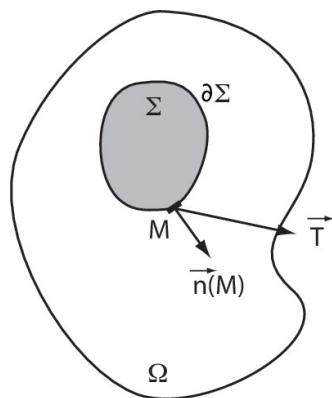
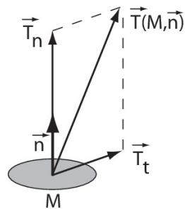
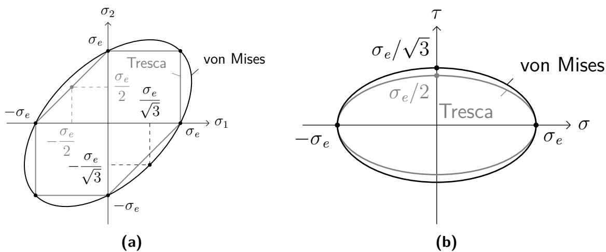

# 内力的示意------应力的概念

在刚体力学中，我们通常不必为每一个固体单独示意其内部作用力（又称为内聚力）。 然而，在可变形的连续介质力学中，这种忽略不再可能。 本章的目的是引入对这些内部作用力的精确示意。

## 外力的示意回顾

### 广义力矩（Torseur）的概念

**定义 3.1** 一个广义力矩（torseur）定义为一个等射向量场 $M \mapsto \vec{H}(M)$，满足： 

$$
\forall M, \forall N : \vec{H}(M) \cdot \overrightarrow{MN} = \vec{H}(N) \cdot \overrightarrow{MN} \tag{3.1}
$$

可证明存在唯一一个向量 $\vec{R}$，称为该广义力矩的**合力**，使得： 

$$
\forall M, \forall N : \vec{H}(N) = \vec{H}(M) + \vec{R} \wedge \overrightarrow{MN} \tag{3.2}
$$

向量 $\vec{H}(M)$ 称为该广义力矩在点 $M$ 的**力矩**。 一个广义力矩完全由其合力与在某一点 $M$ 的力矩确定，这两者称为该广义力矩在 $M$ 的**化简要素**： 

$$
\left\{
\begin{array}{l}
\vec{R} \\
\vec{H}(M)
\end{array}
\right\}_M
$$

两个广义力矩 $T_1$ 与 $T_2$ 之间的常规运算（加法、减法、相等等）均在相同参考点上对其化简要素进行同样的运算。例如： 

$$
T_1 + T_2 =
\left\{
\begin{array}{l}
\vec{R}_1 + \vec{R}_2 \\
\vec{H}_1(A) + \vec{H}_2(A)
\end{array}
\right\}_A
=
\left\{
\begin{array}{l}
\vec{R}_1 + \vec{R}_2 \\
\vec{H}_1(A) + \vec{H}_2(B) + \vec{R}_2 \wedge \overrightarrow{BA}
\end{array}
\right\}_A \tag{3.3}
$$

**定义 3.2** 称一个广义力矩为**滑移系（glisseur）**，如果存在至少一个点 $A$，其力矩为零。 若合力非零，则力矩在直线 $(A, \vec{R})$ 上的所有点均为零；若合力也为零，则该广义力矩为零广义力矩。

### 质点的情况

设 $M$ 为质量 $m$ 的质点。 外界对 $M$ 的作用通常可简化为作用在 $M$ 点的单一"力"，即一个**滑移系广义力矩**，其在 $M$ 的化简要素为：

$$
\text{合力：} \vec{F}, \quad \text{力矩：} \vec{0}
$$

若参考系 $R$ 为伽利略参考系，则动力学基本原理（PFD）给出： 

$$
m \dfrac{d^2 \overrightarrow{OM}}{dt^2} = \vec{F} \tag{3.4}
$$

### 刚体的情况

对于一个刚体 $\Sigma$，外界的作用通常可分为三类力：

#### 体积力（Efforts volumiques）

某些力可以用体积内的力密度场 $M \mapsto \vec{f}_v(M)$ 表示。 与之对应的广义力矩在任意点 $A$ 的化简要素为： 

$$
\left\{
\begin{array}{l}
\vec{R} = \displaystyle \int_{\Sigma} \vec{f}_v(M) \, dV \\
\vec{H}(A) = \displaystyle \int_{\Sigma} \overrightarrow{AM} \wedge \vec{f}_v(M) \, dV
\end{array}
\right\}_A \tag{3.5}
$$

以单位 $\{\text{N}, \text{N·m}\}$ 表示。 例如重力就是这种类型的力，其密度 $\vec{f}_v$ 单位为 N·m$^{-3}$。

#### 表面力（Efforts surfaciques）

有些力可通过边界 $\partial \Sigma$（或部分边界）上的面力密度 $\vec{T}(M)$ 表示。 对应的广义力矩在任意点 $A$ 的化简要素为： 

$$
\left\{
\begin{array}{l}
\vec{R} = \displaystyle \int_{\partial \Sigma} \vec{T}(M)\, dS \\
\vec{H}(A) = \displaystyle \int_{\partial \Sigma} \overrightarrow{AM} \wedge \vec{T}(M)\, dS
\end{array}
\right\}_A \tag{3.6}
$$

例如，流体对固体施加的压力型作用力即属此类。 $\vec{T}(M)$ 的单位为 N·m$^{-2}$。

#### 集中力（Efforts concentrés）

在刚体某点 $C$ 上施加一力 $\vec{F}$ 与一力矩 $\vec{H}(C)$，则对应的广义力矩为： 

$$
\left\{
\begin{array}{l}
\vec{F} \\
\vec{H}(C)
\end{array}
\right\}_C \tag{3.7}
$$

以 $\{\text{N}, \text{N·m}\}$ 表示。

#### 刚体的动力学基本原理

若参考系 $R$ 为伽利略参考系，则将动力学基本原理应用于刚体 $\Sigma$，可写为：

$$
\text{刚体的动力学广义力矩} = \text{外力广义力矩}
$$

即： 

$$
\int_{\Sigma} \rho \, \vec{\Gamma}(M/R)\, dV
=
\int_{\Sigma} \vec{f}_v(M)\, dV
+ \int_{\partial \Sigma} \vec{T}(M)\, dS
+ \vec{F}
\tag{3.8}
$$

以及力矩形式： 

$$
\int_{\Sigma} \overrightarrow{AM} \wedge \rho \, \vec{\Gamma}(M/R)\, dV
=
\int_{\Sigma} \overrightarrow{AM} \wedge \vec{f}_v(M)\, dV
+ \int_{\partial \Sigma} \overrightarrow{AM} \wedge \vec{T}(M)\, dS
+ \left[ \vec{H}(C) + \overrightarrow{AC} \wedge \vec{F} \right]
\tag{3.9}
$$

其中 $\rho$ 为密度（通常以 $\text{kg·m}^{-3}$ 表示）。

---

### 连续介质的情况

为描述外界对连续介质 $\Omega$ 的作用，主要采用以下两种示意方式：

- **表面力：** 在边界 $\partial \Omega$（或其部分）上定义面力密度场 

$$
M \mapsto \vec{T}(M)
$$

 这些力可已知或未知。若已知，记为 $\vec{T}_d$。

- **体积力：** 在体积 $\Omega$（或其部分）内定义体积力密度场 

$$
M \mapsto \vec{f}_v(M)
$$

 一般作为已知外力数据，记为 $\vec{f}_d$。

**备注 3.1** 在初步分析中，我们排除对连续介质施加"集中力"的情况。 此类力往往导致数学上的奇异性，超出课程范围。 但在特定类型的连续体（如"梁"模型）中，可适当引入。

**备注 3.2** 本章仅研究"柯西型（Cauchy）"经典介质，即假定不存在体积力矩密度。 更精细复杂的模型（例如含微结构介质）虽可建立，但不在此讨论范围。

---

**补充说明** 在上文的合力平衡式中： 

$$
\int_{\Sigma} \rho\, \vec{\Gamma}(M/R)\, dV
$$

 为**动态合力**； 而 

$$
\int_{\Sigma} \overrightarrow{AM} \wedge \rho\, \vec{\Gamma}(M/R)\, dV
$$

 为点 $A$ 处的**动态力矩**。 这两式常称为"动力学一般定理"，实质上是动力学基本原理（PFD）的另一种形式。

## 内力的示意

### 基本假设

*图 3.1：内力示意。*

考虑连续介质 $\Omega$ 的一部分 $\Sigma$，其内部边界为 $\partial \Sigma$（见图略）。 我们将通过描述 $\Omega - \Sigma$ 对 $\Sigma$ 的作用来示意 $\Omega$ 内部的内力。 作如下两条假设：

1.  $\Omega - \Sigma$ 对 $\Sigma$ 的作用仅为定义在 $\partial \Sigma$ 上的**表面力**， 其分布由面力密度矢量 $\vec{T}$ 给出；

2.  在边界 $\partial \Sigma$ 上任意点 $M$，面力密度 $\vec{T}$ 仅依赖于该点处外法向单位矢量 $\vec{n}(M)$，即： 

$$
\vec{T} = \vec{T}(M, \vec{n}(M))
\tag{3.10}
$$

---

### 应力算子的定义（柯西定理）

**定理 3.1（柯西定理）** 存在一个线性算子 $\boldsymbol{\sigma}$（称为**柯西应力张量**），在 $\Omega$ 的每一点 $M$ 定义，使得： 

$$
\vec{T}(M, \vec{n}) = \boldsymbol{\sigma}(M) \vec{n} = \boldsymbol{\sigma}(M) \cdot \vec{n}
\tag{3.11}
$$

**定义 3.3** 算子 $\boldsymbol{\sigma}(M)$ 称为**点 $M$ 处的应力算子**。

**定义 3.4** 向量 $\vec{T}(M, \vec{n})$ 称为**点 $M$ 在方向 $\vec{n}$ 上的应力向量**。

---

#### 应力算子的对称性

应力算子满足： 

$$
\boldsymbol{\sigma}(M) = [\boldsymbol{\sigma}(M)]^T
$$

 即应力张量是对称的。

---

### 应力算子在一点的性质

#### 物理量纲

应力张量的各分量具有"压力"的量纲，即单位面积上的力。 因此单位为帕斯卡（Pa），或其倍数 MPa、GPa，对应 N·m$^{-2}$。

微元表面 $dS$ 上由 $\Omega - \Sigma$ 作用于 $\Sigma$ 的力为： 

$$
d\vec{f} = \boldsymbol{\sigma} \vec{n}\, dS = \boldsymbol{\sigma} \cdot \vec{n}\, dS
\tag{3.12}
$$

例如： 

$$
\begin{array}{ll}
\text{大气压：} & p_a = 1.01325 \times 10^5 \ \text{Pa} \approx 0.1\,\text{MPa} \\
\text{自行车轮胎压力：} & p \approx 6 \text{ 至 } 10\,\text{bar} \\
\text{软钢屈服强度：} & 200 \text{ 至 } 250\,\text{MPa}
\end{array}
$$

---

#### 法向应力与切向应力

*图 3.2：法向应力与切向应力。*

**定义 3.5（法向应力）** 在方向 $\vec{n}$ 上的法向应力为应力向量在 $\vec{n}$ 方向上的投影： 

$$
\vec{T}_n = T_n \vec{n} = (\vec{n}^T \boldsymbol{\sigma} \vec{n}) \vec{n} = (\vec{n} \cdot \boldsymbol{\sigma} \cdot \vec{n}) \vec{n}
\tag{3.13}
$$

**定义 3.6（切向应力）** 在方向 $\vec{n}$ 上的切向应力为应力向量在与 $\vec{n}$ 垂直平面上的投影： 

$$
\vec{T}_t = \boldsymbol{\sigma} \vec{n} - \vec{T}_n = \boldsymbol{\sigma} \cdot \vec{n} - \vec{T}_n
\tag{3.14}
$$

常用符号 $(T_n, T_t)$ 或 $(\sigma_n, \sigma_t)$ 来表示法向与切向应力。

有时也将切向应力称为**剪应力（cisaillement）**。

---

#### 应力互等定理

对任意两方向 $\vec{n}_1, \vec{n}_2$，有： 

$$
\vec{n}_2^T \boldsymbol{\sigma} \vec{n}_1 = \vec{n}_1^T \boldsymbol{\sigma} \vec{n}_2
\quad \Longleftrightarrow \quad
\vec{n}_2 \cdot \boldsymbol{\sigma} \cdot \vec{n}_1 = \vec{n}_1 \cdot \boldsymbol{\sigma} \cdot \vec{n}_2
\tag{3.15}
$$

### 应力算子的分解与主应力方向

#### 球形部分与偏差部分

应力张量 $\boldsymbol{\sigma}$ 可分解为球形部分与偏差部分，这构成一种张量基。

**定义（球形部分）** 应力张量的球形部分 $\boldsymbol{\sigma}_S$ 与静水压力 $p$ 相关，定义为： 

$$
\boldsymbol{\sigma}_S = \text{sphe}(\boldsymbol{\sigma}) = \frac{1}{3} \text{Tr}(\boldsymbol{\sigma})\, \mathbf{I} = -p\,\mathbf{I}
\quad \Rightarrow \quad
p = -\frac{\text{Tr}(\boldsymbol{\sigma})}{3}
\tag{3.16}
$$

**定义（偏差部分）** 应力张量的偏差部分（或称"应力偏张量"）记为 $\boldsymbol{\sigma}_D$，定义为： 

$$
\boldsymbol{\sigma}_D = \text{dev}(\boldsymbol{\sigma})
= \boldsymbol{\sigma} - \frac{1}{3} \text{Tr}(\boldsymbol{\sigma})\, \mathbf{I}
\tag{3.17}
$$

且满足： 

$$
\text{Tr}(\boldsymbol{\sigma}_D) = 0
$$

---

#### 主方向与主应力

**定义 3.7（主方向）** 若存在单位向量 $\vec{n}$ 满足： 

$$
\boldsymbol{\sigma} \vec{n} = \sigma \vec{n}
\tag{3.18}
$$

 则称 $\vec{n}$ 为**应力主方向**，$\sigma$ 为对应的**主应力**。

在三维空间中，应力张量 $\boldsymbol{\sigma}$ 有三个特征值（主应力）与三个正交特征方向（主方向）： 

$$
\boldsymbol{\sigma} \vec{n}_i = \sigma_i \vec{n}_i, \quad i = 1, 2, 3
\tag{3.19}
$$

**定义 3.8** 实数 $\sigma_i$ 称为在方向 $\vec{n}_i$ 上的**主应力**。

存在一组正交归一基 $(\vec{n}_1, \vec{n}_2, \vec{n}_3)$，使得 $\boldsymbol{\sigma}$ 的矩阵在此基下为对角形式： 

$$
[\boldsymbol{\sigma}]_{(\vec{n}_1,\vec{n}_2,\vec{n}_3)} =
\begin{bmatrix}
\sigma_1 & 0 & 0 \\
0 & \sigma_2 & 0 \\
0 & 0 & \sigma_3
\end{bmatrix}
$$

---

### 常见的应力张量形式

以下各类应力状态的分量可随时间或空间变化。

#### 球形应力状态

**定义 3.9** 若应力张量为： 

$$
\boldsymbol{\sigma} = \sigma \mathbf{I} =
\begin{bmatrix}
\sigma & 0 & 0 \\
0 & \sigma & 0 \\
0 & 0 & \sigma
\end{bmatrix}_{(\vec{e}_1,\vec{e}_2,\vec{e}_3)}
\tag{3.20}
$$

 则称为**球形应力状态**。此时各方向应力相等。

---

#### 单轴应力状态

**定义 3.10** 若应力张量为： 

$$
\boldsymbol{\sigma} =
\begin{bmatrix}
\sigma_{11} & 0 & 0 \\
0 & 0 & 0 \\
0 & 0 & 0
\end{bmatrix}_{(\vec{e}_1,\vec{e}_2,\vec{e}_3)}
\tag{3.21}
$$

 则称为沿 $\vec{e}_1$ 方向的**单轴应力状态**。 若 $\sigma_{11} > 0$ 为拉伸，$\sigma_{11} < 0$ 为压缩。

---

#### 平面应力状态

**定义 3.11** 若在垂直于 $\vec{e}_1$ 的平面内存在应力分量： 

$$
\boldsymbol{\sigma} =
\begin{bmatrix}
0 & 0 & 0 \\
0 & \sigma_{22} & \sigma_{23} \\
0 & \sigma_{23} & \sigma_{33}
\end{bmatrix}_{(\vec{e}_1,\vec{e}_2,\vec{e}_3)}
\tag{3.22}
$$

 则称为**平面应力状态**。

---

#### 反平面应力状态

**定义 3.12** 若在 $\vec{e}_1$ 方向的反平面剪切应力为： 

$$
\boldsymbol{\sigma} =
\begin{bmatrix}
\sigma_{11} & \sigma_{12} & \sigma_{13} \\
\sigma_{12} & 0 & 0 \\
\sigma_{13} & 0 & 0
\end{bmatrix}_{(\vec{e}_1,\vec{e}_2,\vec{e}_3)}
\tag{3.23}
$$

 则称为**反平面应力状态**。

---

#### 纯剪切应力状态

**定义 3.13** 若应力张量为： 

$$
\boldsymbol{\sigma} =
\begin{bmatrix}
0 & \tau & 0 \\
\tau & 0 & 0 \\
0 & 0 & 0
\end{bmatrix}_{(\vec{e}_1,\vec{e}_2,\vec{e}_3)}
\tag{3.24}
$$

 则称为**纯剪切应力状态**。

在主轴系中（旋转 $45^\circ$，令 $\vec{n}_3 = \vec{e}_3$）： 

$$
\boldsymbol{\sigma} =
\begin{bmatrix}
\tau & 0 & 0 \\
0 & -\tau & 0 \\
0 & 0 & 0
\end{bmatrix}_{(\vec{n}_1,\vec{n}_2,\vec{n}_3)}
\tag{3.25}
$$

---

#### 纯扭转应力状态

**定义 3.14** 若以圆柱坐标系 $(\vec{e}_r, \vec{e}_\theta, \vec{e}_z)$ 表示，纯扭转应力张量为： 

$$
\boldsymbol{\sigma} =
\begin{bmatrix}
0 & 0 & 0 \\
0 & 0 & \tau \\
0 & \tau & 0
\end{bmatrix}_{(\vec{e}_r,\vec{e}_\theta,\vec{e}_z)}
\tag{3.26}
$$

---

### 符号约定

我们采用最常见的约定： **拉伸应力为正，压缩应力为负。**

# 基本的结构设计准则

## 等效应力的概念

材料的屈服极限通常以标量形式给出（单位同应力或压力）。 为了将某点的应力状态（张量形式）与该材料的拉伸屈服极限 $\sigma_e$（或英语文献中的 $\sigma_y$）进行比较， 必须定义一个**等效应力**。 等效应力是一个将张量应力状态映射为标量应力值的函数。

---

## von Mises 准则

这是一个基于**偏应变能**的能量型屈服准则， 非常适用于金属和具有延展性的合金。

**定义 3.15** von Mises 等效应力 $\sigma_{VM}$ 可由应力偏张量的第二不变量定义为： 

$$
\sigma_{VM} = \sqrt{\frac{3}{2} \, \text{Tr}(\boldsymbol{\sigma}_D \, \boldsymbol{\sigma}_D)}
= \sqrt{\frac{3}{2}\, \boldsymbol{\sigma}_D : \boldsymbol{\sigma}_D}
= \sqrt{\frac{3}{2} \, \sigma^D_{ij}\sigma^D_{ij}}
= \sqrt{\frac{3}{2}\left(\boldsymbol{\sigma} : \boldsymbol{\sigma} - \frac{(\text{Tr}\boldsymbol{\sigma})^2}{3}\right)}
\tag{3.27}
$$

若用主应力 $\sigma_1, \sigma_2, \sigma_3$ 表示，则： 

$$
\sigma_{VM} =
\sqrt{\frac{(\sigma_1 - \sigma_2)^2 + (\sigma_2 - \sigma_3)^2 + (\sigma_1 - \sigma_3)^2}{2}}
\tag{3.28}
$$

**von Mises 准则：** 

$$
\sigma_{VM} \leq \sigma_e
\tag{3.29}
$$

其中 $\sigma_e$ 为材料的拉伸屈服极限。

**备注 3.6** 球形（静水）部分的应力不出现在 $\sigma_{VM}$ 的表达式中。 因此在此准则下，纯静水载荷（即使强度很大）不会引起塑性或破坏。

---

## Tresca 准则

Tresca 准则基于**最大剪应力** $\tau_{max}$。 通过分析不同方向的剪切作用（可用三圆 Mohr 图表示）可得： 

$$
\tau_{max} = 
\max_{\|\vec{t}\|=1,\|\vec{n}\|=1,\vec{t}\perp\vec{n}}
\left|\,\vec{t} \cdot \boldsymbol{\sigma} \cdot \vec{n}\,\right|
= \max_{i,j} \left|\frac{\sigma_i - \sigma_j}{2}\right|
\tag{3.30}
$$

**定义 3.16** Tresca 等效应力定义为： 

$$
\sigma_{Tr} = \max_{i,j} |\sigma_i - \sigma_j|
\tag{3.31}
$$

其中 $\sigma_i$ 为主应力。

**Tresca 准则：** 

$$
\sigma_{Tr} \leq \sigma_e
\quad \text{或等价地} \quad
\tau_{max} \leq \tau_e
\tag{3.32}
$$

其中 $\tau_e$ 为材料的剪切屈服极限，通常有 $\tau_e = \sigma_e / 2$。

---

## Rankine 准则

对于脆性或准脆性材料（如混凝土、玻璃、铸铁等）， 可采用**Rankine 准则**，假设当某一主应力达到材料的破坏强度 $\sigma_R$ 时发生破坏。 定义如下： 

$$
\sigma_{Ra} = \max_i (\sigma_i)
\quad \text{且} \quad
\sigma_{Ra} \leq \sigma_R
\tag{3.33}
$$

---

## 强度设计条件

若以某准则定义的等效应力 $\sigma_{eq}$（如 von Mises 或 Tresca）作为控制量， 则设计条件为： 

$$
\sigma_{VM} \leq \frac{\sigma_e}{C_s}
\quad \text{或} \quad
\sigma_{Tr} \leq \frac{\sigma_e}{C_s} = \frac{2\tau_e}{C_s}
\tag{3.34}
$$

其中： 

$$
\sigma_e \text{为拉伸屈服强度}, \quad
\tau_e \text{为剪切屈服强度}, \quad
C_s \geq 1 \text{为安全系数。}
$$

---

## 平面应力下的 von Mises 与 Tresca 比较

*图 3.3：双轴拉伸与拉伸—剪切工况的准则比较。*

设 $\boldsymbol{\sigma}$ 为平面应力张量，其主方向下表示为：

#### 双轴拉伸：

$$
\boldsymbol{\sigma} =
\begin{bmatrix}
\sigma_1 & 0 & 0 \\
0 & \sigma_2 & 0 \\
0 & 0 & 0
\end{bmatrix}_{(\vec{e}_1,\vec{e}_2,\vec{e}_3)}

$$

#### 拉伸--剪切组合：

$$
\boldsymbol{\sigma} =
\begin{bmatrix}
\sigma & \tau & 0 \\
\tau & 0 & 0 \\
0 & 0 & 0
\end{bmatrix}_{(\vec{e}_1,\vec{e}_2,\vec{e}_3)}

$$

在双轴拉伸下，Tresca 准则给出： 

$$
\max(|\sigma_1|, |\sigma_2|, |\sigma_1 - \sigma_2|) \leq \sigma_e
$$

 而 von Mises 准则为： 

$$
\sigma_1^2 + \sigma_2^2 - \sigma_1\sigma_2 \leq \sigma_e^2
$$

 在拉伸--剪切情况下， Tresca 准则： 

$$
\sqrt{\sigma^2 + 4\tau^2} \leq \sigma_e

$$

 von Mises 准则： 

$$
\sqrt{\sigma^2 + 3\tau^2} \leq \sigma_e

$$

**备注 3.7** 在相同屈服极限 $\sigma_e$ 下， Tresca 准则定义的弹性域比 von Mises 更小， 因此 Tresca 更保守； 而 von Mises 对应的屈服面更圆滑，不存在角点不连续。
