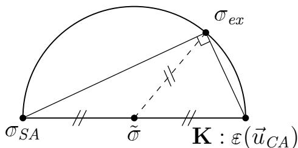

# 第 8 章 弹性力学中的能量定理（Les théorèmes de l’énergie en élasticité）

本章以静力学、小扰动假设和线弹性为前提，构造便于近似求解的变分形式。Hooke 算子 $\mathbf K$ 可随位置变化，也不必各向同性：

$$
\boldsymbol\sigma=\mathbf K:\boldsymbol\varepsilon(\vec u). \tag{8.1}
$$

方法可用于三维弹性，也可延伸至梁、板、壳、二维弹性和稳态热传导。

求解的场 $(\vec u,\boldsymbol\sigma)$ 应满足位移边界条件、平衡方程、牵引边界条件及本构关系：

$$
\vec u=\vec u_d\quad(M\in\partial\Omega_u),\qquad\vec u\text{ 还需具有适当正则性}. \tag{8.2}
$$

$$
\operatorname{div}\boldsymbol\sigma+\vec f_d=\vec0\quad(M\in\Omega),\qquad
\boldsymbol\sigma\vec n=\vec T_d\quad(M\in\partial\Omega_T). \tag{8.3}
$$

$$
\boldsymbol\sigma=\mathbf K:\boldsymbol\varepsilon(\vec u). \tag{8.4}
$$

记真实解为 $(\vec u_{ex},\boldsymbol\sigma_{ex})$。在适当条件下，应力唯一；位移的唯一性还需消去刚体运动。

## 8.1 可容许场回顾

### 8.1.1 运动学可容位移

**定义 8.1**：满足 (8.2) 的位移场称为运动学可容（CA）。**定义 8.2**：位移边界数据为零的场称为零运动学可容（CAZ）：

$$
\vec u^\star=\vec0\quad(M\in\partial\Omega_u),\qquad\vec u^\star\text{ 具有适当正则性}. \tag{8.5}
$$

原 PDF 的 (8.5) 左边写成 $\vec u$，但本段明确讨论 $\vec u^\star$；此处按定义统一符号。两个 CA 场之差是 CAZ；给定一个 CA 场 $\vec u_0$ 后，所有 CA 场可写为 $\vec u_0+\vec u^\star$。CA 场构成仿射空间 $\mathcal U_{ad}$，CAZ 场构成向量空间 $\mathcal U_0$。

### 8.1.2 静力学可容应力

**定义 8.3**：满足 (8.3) 的应力场称为静力学可容（SA）。**定义 8.4**：载荷数据均为零时的场称为零静力学可容（SAZ）：

$$
\operatorname{div}\boldsymbol\sigma^\star=\vec0\quad(M\in\Omega),\qquad
\boldsymbol\sigma^\star\vec n=\vec0\quad(M\in\partial\Omega_T). \tag{8.6}
$$

两个 SA 场之差是 SAZ；给定 $\boldsymbol\sigma_0\in\mathcal S_{ad}$ 后，任意 SA 场为 $\boldsymbol\sigma_0+\boldsymbol\sigma^\star$，其中 $\boldsymbol\sigma^\star\in\mathcal S_0$。

### 8.1.3 正交性

在应力场空间 $\mathcal S$ 上，用逆 Hooke 算子定义内积与范数：

$$
\langle\boldsymbol\sigma_1,\boldsymbol\sigma_2\rangle_{\mathcal S}
=\int_\Omega\boldsymbol\sigma_1:\mathbf K^{-1}:\boldsymbol\sigma_2\,\mathrm dV,
\qquad\|\boldsymbol\sigma\|_{\mathcal S}=\sqrt{\langle\boldsymbol\sigma,\boldsymbol\sigma\rangle_{\mathcal S}}.
$$

这里要求 $\mathbf K$ 对对称应力空间正定且可逆。若 $\vec u^\star$ 是 CAZ、$\boldsymbol\sigma^\star$ 是 SAZ，分部积分并利用零边界项得到：

$$
\int_\Omega\boldsymbol\sigma^\star:\boldsymbol\varepsilon(\vec u^\star)\,\mathrm dV=0. \tag{8.7}
$$

因此 $\boldsymbol\sigma^\star$ 与 $\mathbf K:\boldsymbol\varepsilon(\vec u^\star)$ 在上述应力内积下正交。

## 8.2 以本构关系误差重述问题

对 CA 位移和 SA 应力组成的场对，唯一可能尚未满足的是本构关系。其本构误差为 $\boldsymbol\sigma-\mathbf K:\boldsymbol\varepsilon(\vec u)$。若该误差的 $\mathcal S$ 范数为零，则本构关系几乎处处成立；在适当连续性假设下可说处处成立。

定义非负目标：

$$
\Psi(\vec u,\boldsymbol\sigma)=\frac12\|\boldsymbol\sigma-\mathbf K:\boldsymbol\varepsilon(\vec u)\|_{\mathcal S}^2
=\frac12\int_\Omega[\boldsymbol\sigma-\mathbf K:\boldsymbol\varepsilon(\vec u)]:\mathbf K^{-1}:[\boldsymbol\sigma-\mathbf K:\boldsymbol\varepsilon(\vec u)]\,\mathrm dV.
$$

课件的第一种最小化形式是：

$$
(\vec u_{ex},\boldsymbol\sigma_{ex})\in\operatorname*{arg\,min}_{\vec u\in\mathcal U_{ad},\,\boldsymbol\sigma\in\mathcal S_{ad}}\Psi(\vec u,\boldsymbol\sigma). \tag{8.8}
$$

真实解使 $\Psi=0$。反过来，只有在最小值为零且可达到时，该极小化解才是弹性问题的真实解。

## 8.3 能量定理

### 8.3.1 解耦

由 8.1.3 的正交性，$\Psi$ 在 CA/SA 场对上拆为位移势能与应力补能之和：

$$
\begin{aligned}
E_p(\vec u)&=\frac12\int_\Omega\boldsymbol\varepsilon(\vec u):\mathbf K:\boldsymbol\varepsilon(\vec u)\,\mathrm dV
-\int_\Omega\vec f_d\cdot\vec u\,\mathrm dV-\int_{\partial\Omega_T}\vec T_d\cdot\vec u\,\mathrm dS,\\
E_c(\boldsymbol\sigma)&=\frac12\int_\Omega\boldsymbol\sigma:\mathbf K^{-1}:\boldsymbol\sigma\,\mathrm dV
-\int_{\partial\Omega_u}(\boldsymbol\sigma\vec n)\cdot\vec u_d\,\mathrm dS.
\end{aligned} \tag{8.9}
$$

$$
\min_{\vec u\in\mathcal U_{ad},\,\boldsymbol\sigma\in\mathcal S_{ad}}\Psi
=\min_{\vec u\in\mathcal U_{ad}}E_p(\vec u)+\min_{\boldsymbol\sigma\in\mathcal S_{ad}}E_c(\boldsymbol\sigma). \tag{8.10}
$$

### 8.3.2 最小势能定理

真实位移使 $E_p$ 在 CA 场中最小：

$$
\vec u_{ex}\in\operatorname*{arg\,min}_{\vec u\in\mathcal U_{ad}}E_p(\vec u). \tag{8.11}
$$

$E_p$ 的第一项是弹性应变能，后两项是给定体力和面力做功的负值。求得位移后，由本构关系计算真实应力。

### 8.3.3 从势能导出整体平衡

令 $\vec u=\vec u_{ex}+\lambda\vec u^\star$，$\vec u^\star\in\mathcal U_0$，则：

$$
\left.\frac{\mathrm d}{\mathrm d\lambda}E_p(\vec u_{ex}+\lambda\vec u^\star)\right|_{\lambda=0}=0
\quad(\forall\vec u^\star\in\mathcal U_0). \tag{8.12}
$$

展开得到：

$$
\int_\Omega\boldsymbol\varepsilon(\vec u_{ex}):\mathbf K:\boldsymbol\varepsilon(\vec u^\star)\,\mathrm dV
=\int_\Omega\vec f_d\cdot\vec u^\star\,\mathrm dV
+\int_{\partial\Omega_T}\vec T_d\cdot\vec u^\star\,\mathrm dS. \tag{8.13}
$$

代入 $\boldsymbol\sigma_{ex}=\mathbf K:\boldsymbol\varepsilon(\vec u_{ex})$，便回到整体平衡的弱形式。

### 8.3.4 最小补能定理

真实应力使 $E_c$ 在 SA 场中最小：

$$
\boldsymbol\sigma_{ex}\in\operatorname*{arg\,min}_{\boldsymbol\sigma\in\mathcal S_{ad}}E_c(\boldsymbol\sigma). \tag{8.14}
$$

补能第一项是用应力表示的弹性应变能；第二项是反力在给定位移上做功的负值。得到应力后，用逆本构关系求应变，再积分求位移。

## 8.4 补充性质

### 8.4.1 真实能量的上下界

对于任意 CA 位移 $\vec u_{CA}$ 和 SA 应力 $\boldsymbol\sigma_{SA}$：

$$
-E_c(\boldsymbol\sigma_{SA})\leq-E_c(\boldsymbol\sigma_{ex})
=E_p(\vec u_{ex})\leq E_p(\vec u_{CA}). \tag{8.15}
$$

所以真实势能在左侧的 $-E_c(\boldsymbol\sigma_{SA})$ 和右侧的 $E_p(\vec u_{CA})$ 之间。特别地，$E_c(\boldsymbol\sigma_{SA})\geq E_c(\boldsymbol\sigma_{ex})$。

### 8.4.2 应力空间中的勾股定理

Prager–Synge 定理：

$$
\|\boldsymbol\sigma_{SA}-\mathbf K:\boldsymbol\varepsilon(\vec u_{CA})\|_{\mathcal S}^{2}
=\|\boldsymbol\sigma_{ex}-\boldsymbol\sigma_{SA}\|_{\mathcal S}^{2}
+\|\boldsymbol\sigma_{ex}-\mathbf K:\boldsymbol\varepsilon(\vec u_{CA})\|_{\mathcal S}^{2}. \tag{8.16}
$$

*图 8.1：应力空间中的勾股关系。*

两条直角边的长度均不超过斜边长度，因此：

$$
\begin{aligned}
\|\boldsymbol\sigma_{ex}-\boldsymbol\sigma_{SA}\|_{\mathcal S}&\leq\|\boldsymbol\sigma_{SA}-\mathbf K:\boldsymbol\varepsilon(\vec u_{CA})\|_{\mathcal S},\\
\|\boldsymbol\sigma_{ex}-\mathbf K:\boldsymbol\varepsilon(\vec u_{CA})\|_{\mathcal S}&\leq\|\boldsymbol\sigma_{SA}-\mathbf K:\boldsymbol\varepsilon(\vec u_{CA})\|_{\mathcal S}.
\end{aligned} \tag{8.17}
$$

再令 $\widetilde{\boldsymbol\sigma}=[\boldsymbol\sigma_{SA}+\mathbf K:\boldsymbol\varepsilon(\vec u_{CA})]/2$。直角三角形斜边中点到直角顶点的距离为斜边的一半，故：

$$
\|\boldsymbol\sigma_{ex}-\widetilde{\boldsymbol\sigma}\|_{\mathcal S}
=\frac12\|\boldsymbol\sigma_{SA}-\mathbf K:\boldsymbol\varepsilon(\vec u_{CA})\|_{\mathcal S}. \tag{8.18}
$$
