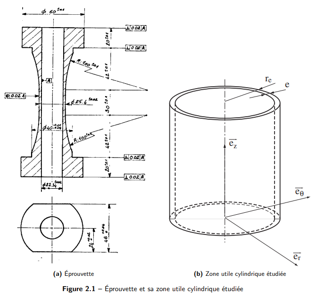
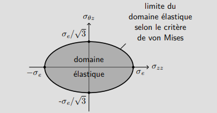

::: center
**巴黎-萨克雷高等师范学院**\
**CHPS 二年级硕士**\
**连续介质力学导论（IMMC）**\
**TD6 --- 弹性问题求解（修正版）**
:::

# 题目 1 --- Navier 方法

研究一个圆柱形管道的某些变形，该管的高度为 $h$，内半径为 $R_1$，外半径为 $R_2$。 内壁受到压力 $p_1$，外壁受到压力 $p_2$。两端被固定，使得管子长度不发生变化。 我们假设在小扰动范围内，忽略体力，并认为介质是均匀、各向同性且弹性的（Lamé 系数为 $\lambda$ 和 $\mu$）。 在这些条件下，寻找仅具有径向分量 $u(r)$ 的位移场。

## 问题 1.1：建立问题------几何、方程与边界条件，并说明它们属于运动学还是静力学。

**解答：**

定义圆柱域：$r \in [R_1, R_2], \ z \in [0, h]$

#### 运动学可容性方程（CA）：

$$
\varepsilon = \frac{1}{2}(\nabla \vec{u} + \nabla^{T}\vec{u})
$$

**边界条件（位移给定）：** $\vec{u} = \vec{u_d}$，对于 $\forall M \in \partial \Omega_u$

- 下表面（管子不伸长）：$\vec{u}(z=0)\cdot \vec{e_z} = 0$

- 上表面（管子不伸长）：$\vec{u}(z=h)\cdot \vec{e_z} = 0$

#### 静力学可容性方程（SA）：

$$
\mathrm{div}\, \boldsymbol{\sigma} + \vec{f_d} = \rho \vec{\Gamma}, \quad \forall M \in \Omega
$$

 但由于问题为静力学且忽略体力，因此： 

$$
\mathrm{div}\, \boldsymbol{\sigma} = \vec{0}, \quad \forall M \in \Omega
$$

**边界条件（应力给定）：** 

$$
\boldsymbol{\sigma}\cdot \vec{n} = \vec{T_d}, \quad \forall M \in \partial \Omega_T
$$

- 内压：$\boldsymbol{\sigma}(r=R_1)\cdot \vec{n}(R_1) = -p_1 \vec{n}(R_1)$

- 外压：$\boldsymbol{\sigma}(r=R_2)\cdot \vec{n}(R_2) = -p_2 \vec{n}(R_2)$

- 下表面自由滑动： 

$$
[\boldsymbol{\sigma}(z=0)\cdot \vec{n}(z=0)]\cdot \vec{e_r} = 0,\quad 
      [\boldsymbol{\sigma}(z=0)\cdot \vec{n}(z=0)]\cdot \vec{e_\theta} = 0
$$

- 上表面自由滑动： 

$$
[\boldsymbol{\sigma}(z=h)\cdot \vec{n}(z=h)]\cdot \vec{e_r} = 0,\quad 
      [\boldsymbol{\sigma}(z=h)\cdot \vec{n}(z=h)]\cdot \vec{e_\theta} = 0
$$

#### 本构关系：

$$
\boldsymbol{\sigma} = K : \varepsilon(\vec{u}) = 2\mu \varepsilon + \lambda \, \mathrm{Tr}(\varepsilon) \mathbf{I}, \quad \forall M \in \Omega
$$

**备注：**

1.  在整个边界上，对于每个分量 $i \in \{r, \theta, z\}$，要么位移分量固定，要么应力分量固定。因此问题是适定的，存在唯一的应力与应变解。

2.  唯一被限制的位移方向是沿 $\vec{e_z}$，因此刚体平移和转动仍可能在 $(\vec{e_r}, \vec{e_\theta})$ 平面内发生。若不进一步约束其他位移，解在位移上不唯一。然而，所假设的位移场形式确保不存在刚体运动。

3.  允许径向滑动所以剪切力为0

## 问题 1.2：说明位移场形式 $\vec{u}(M) = u(r)\vec{e_r}$ 的合理性。

**解答：** 根据问题的观察：

1.  问题（几何与载荷）在 $\theta$ 方向上具有不变性 $\Rightarrow \frac{\partial}{\partial \theta} = 0$；

2.  位移沿 $\vec{e_z}$ 被约束 $\Rightarrow u_z = 0$；

3.  问题轴对称，且无 $\vec{e_\theta}$ 方向载荷 $\Rightarrow u_\theta = 0$；

4.  问题在 $z$ 方向上也不变 $\Rightarrow \frac{\partial}{\partial z} = 0$。

## 问题 1.3：证明位移场满足

$$
u(r) = \frac{K_1}{r} + K_2 r,
$$

 其中 $K_1$ 和 $K_2$ 为常数。 **解答续：**

回忆：Navier 方程可以写成多种形式，它综合了：

- 平衡方程：$\mathrm{div}\,\boldsymbol{\sigma} + \vec{f_d} = \rho \vec{\Gamma}$；

- 本构关系：$\boldsymbol{\sigma} = 2\mu \varepsilon + \lambda \, \mathrm{Tr}(\varepsilon)\mathbf{I}$；

- 运动学关系：$\varepsilon = \tfrac{1}{2}(\nabla \vec{u} + \nabla^T \vec{u})$。

写成第一种形式为： 

$$
\mu \Delta \vec{u} + (\lambda + \mu)\nabla(\mathrm{div}\,\vec{u}) + \vec{f_v} = \rho \vec{\Gamma}
$$

其适用条件为：

- 小扰动假设（HPP）；

- 材料为线性各向同性弹性体；

- 材料均匀（至少在分段上）。

利用恒等式 

$$
\nabla \times (\nabla \times \vec{V}) = \nabla(\mathrm{div}\,\vec{V}) - \Delta \vec{V},
$$

 可得到两种等价形式：

$$
\begin{aligned}
(\lambda + 2\mu)\Delta \vec{u} + (\lambda + \mu)\nabla\times(\nabla\times \vec{u}) + \vec{f_v} &= \rho \vec{\Gamma}, \\
(\lambda + 2\mu)\nabla(\mathrm{div}\,\vec{u}) - \mu \nabla\times(\nabla\times \vec{u}) + \vec{f_v} &= \rho \vec{\Gamma}.
\end{aligned}
$$

根据运动特征（是否有旋转、是否不可压），某些项可忽略，因此应先分析运动特性再选用适当形式。

我们寻求形如 

$$
\vec{u} = u(r)\vec{e_r} = \left( \frac{K_1}{r} + K_2 r \right)\vec{e_r}
$$

 的位移场。

**分析：**

- 该位移场描述的是无旋运动（粒子仅沿径向收缩或扩张），因此 $\nabla\times(\nabla\times\vec{u}) = 0$。

- 在柱坐标下，对于仅依赖 $r$ 的纯径向函数，$\nabla(\mathrm{div}\,\vec{u})$ 的形式更容易积分，而 $\Delta \vec{u}$ 涉及两个复杂项。

故选择第三种形式： 

$$
(\lambda + 2\mu)\nabla(\mathrm{div}\,\vec{u}) - \mu \nabla\times(\nabla\times \vec{u}) + \vec{f_v} = \rho \vec{\Gamma}.
$$

 在本题中 $\vec{f_v} = 0$ 且 $\nabla\times(\nabla\times\vec{u}) = 0$，因此简化为： 

$$
(\lambda + 2\mu)\nabla(\mathrm{div}\,\vec{u}) = \vec{0}.
$$

展开得： 

$$
\frac{\partial}{\partial r}\left[\frac{1}{r}\frac{\partial}{\partial r}(r u)\right] = 0.
$$

**第一次积分：** 

$$
\frac{1}{r}\frac{\partial}{\partial r}(ru) = C_1 \quad \Rightarrow \quad \frac{\partial}{\partial r}(ru) = C_1 r.
$$

**第二次积分：** 

$$
ru = \frac{C_1}{2}r^2 + C_2 \quad \Rightarrow \quad u = \frac{C_1}{2}r + \frac{C_2}{r}.
$$

因此： 

$$
u(r) = \frac{K_1}{r} + K_2 r.
$$

## 问题 1.4：利用边界条件求常数 $K_1$ 和 $K_2$。

**解答：**

位移边界条件（CA）不会提供关于 $K_1$ 和 $K_2$ 的信息： 

$$
\begin{cases}
\vec{u}(z=0)\cdot \vec{e_z} = 0,\\
\vec{u}(z=h)\cdot \vec{e_z} = 0,
\end{cases}
\quad \Rightarrow \quad 0=0.
$$

在使用应力边界条件前，需要确定应力张量 $\boldsymbol{\sigma}$ 的形式。

**步骤：**

1.  计算位移梯度张量；

2.  推导应变张量 $\varepsilon$；

3.  由本构关系得到应力张量。

$$
\nabla \vec{u} =
\begin{pmatrix}
-\dfrac{K_1}{r^2} + K_2 & 0 & 0\\
0 & \dfrac{K_1}{r^2} + K_2 & 0\\
0 & 0 & 0
\end{pmatrix}
\Rightarrow
\varepsilon = \frac{1}{2}(\nabla \vec{u} + \nabla^T \vec{u}) =
\begin{pmatrix}
-\dfrac{K_1}{r^2} + K_2 & 0 & 0\\
0 & \dfrac{K_1}{r^2} + K_2 & 0\\
0 & 0 & 0
\end{pmatrix}.
$$

迹为 $\mathrm{Tr}(\varepsilon) = 2K_2$。 因此： 

$$
\boldsymbol{\sigma} = 2\mu\varepsilon + \lambda \, \mathrm{Tr}(\varepsilon)\mathbf{I}
=
\begin{pmatrix}
-2\mu \dfrac{K_1}{r^2} + 2(\lambda + \mu)K_2 & 0 & 0\\
0 & 2\mu \dfrac{K_1}{r^2} + 2(\lambda + \mu)K_2 & 0\\
0 & 0 & 2\lambda K_2
\end{pmatrix}.
$$

**边界条件（应力）：** 

$$
\boldsymbol{\sigma}(r=R_1)\cdot \vec{n}(R_1) = -p_1 \vec{n}(R_1)
\Rightarrow
2\mu\dfrac{K_1}{(R_1)^2} - 2(\lambda+\mu)K_2 = p_1,
$$

 

$$
\boldsymbol{\sigma}(r=R_2)\cdot \vec{n}(R_2) = -p_2 \vec{n}(R_2)
\Rightarrow
-2\mu\dfrac{K_1}{(R_2)^2} + 2(\lambda+\mu)K_2 = -p_2.
$$

两式组成的线性系统解为： 

$$
K_1 = \frac{p_1 - p_2}{2\mu} \cdot
\frac{(R_1 R_2)^2}{(R_2)^2 - (R_1)^2},
\qquad
K_2 = \frac{1}{2(\lambda+\mu)} \cdot
\frac{p_1 (R_1)^2 - p_2 (R_2)^2}{(R_2)^2 - (R_1)^2}.
$$

**备注：**

- $K_1$ 的符号取决于 $p_1 - p_2$；

- 若 $p_2 > p_1$，则 $K_2$ 可为负，否则为正。

## 问题 1.5：求 Tresca 等效应力，并据此得到管壁厚度 $e$ 的设计条件。

**解答：**

应力张量为对角形式，因此主应力即为其对角分量。Tresca 等效应力定义为： 

$$
\sigma_{Tr} = \max_{i,j} |\sigma_i - \sigma_j|.
$$

由上式得： 

$$
|\sigma_r - \sigma_\theta| = 2\mu \left|\frac{2K_1}{r^2}\right|,\quad
|\sigma_r - \sigma_z| = 2\mu \left|\frac{K_1}{r^2} - K_2\right|,\quad
|\sigma_\theta - \sigma_z| = 2\mu \left|\frac{K_1}{r^2} + K_2\right|.
$$

若考虑 $p_2 = 0$，则常数化简为： 

$$
K_1 = \frac{p_1}{2\mu}
\frac{(R_1 R_2)^2}{(R_2)^2 - (R_1)^2} > 0,
\qquad
K_2 = \frac{p_1}{2(\lambda+\mu)}
\frac{(R_1)^2}{(R_2)^2 - (R_1)^2} > 0.
$$

注意到： 

$$
\frac{K_1/r^2}{K_2} = \frac{\lambda + \mu}{\mu} \left(\frac{R_2}{r}\right)^2
\approx 2.5\left(\frac{R_2}{r}\right)^2 > 1, \quad \forall r \in [R_1, R_2].
$$

 因此： 

$$
\frac{K_1}{r^2} > K_2, \quad \forall r \in [R_1, R_2].
$$

由此得到： 

$$
\begin{aligned}
|\sigma_r - \sigma_\theta| &= 2\mu\left(\frac{2K_1}{r^2}\right), \\
|\sigma_\theta - \sigma_z| &= 2\mu\left(\frac{K_1}{r^2} + K_2\right), \\
|\sigma_r - \sigma_z| &= 2\mu\left(\frac{K_1}{r^2} - K_2\right),
\end{aligned}
$$

并且满足： 

$$
2\frac{K_1}{r^2} > \frac{K_1}{r^2} + K_2 > \frac{K_1}{r^2} - K_2
\Rightarrow |\sigma_r - \sigma_\theta| > |\sigma_\theta - \sigma_z| > |\sigma_r - \sigma_z|.
$$

因此 Tresca 等效应力为： 

$$
\sigma_{Tr}(r) = |\sigma_r - \sigma_\theta| = 2\mu\left(\frac{2K_1}{r^2}\right)
= 2p_1 \frac{r^2}{r^2} \left[\frac{(R_1 R_2)^2}{(R_2)^2 - (R_1)^2}\right],
$$

 即： 

$$
\sigma_{Tr}(r) = 2p_1 \frac{(R_1 R_2)^2}{r^2\left[(R_2)^2 - (R_1)^2\right]}.
$$

它在 $r=R_1$ 处达到最大值： 

$$
\max_r[\sigma_{Tr}(r)] = \sigma_{Tr}(R_1) = 2p_1 \frac{(R_2)^2}{(R_2)^2 - (R_1)^2}.
$$

为使结构不发生不可逆变形（塑性或断裂），需满足： 

$$
\max_r[\sigma_{Tr}(r)] \le \sigma_e
\quad \Leftrightarrow \quad
2p_1\frac{(R_2)^2}{(R_2)^2 - (R_1)^2} \le \sigma_e.
$$

整理得： 

$$
2p_1(R_2)^2 \le \sigma_e[(R_2)^2 - (R_1)^2],
$$

 

$$
(R_2)^2(2p_1 - \sigma_e) \le -\sigma_e (R_1)^2.
$$

由于 $2p_1 < \sigma_e$，因此： 

$$
(R_2)^2 \ge -\frac{\sigma_e}{2p_1 - \sigma_e}(R_1)^2
= \frac{\sigma_e}{\sigma_e - 2p_1}(R_1)^2.
$$

取正平方根： 

$$
R_2 \ge R_1 \sqrt{\frac{\sigma_e}{\sigma_e - 2p_1}}.
$$

由 $e = R_2 - R_1$ 可得： 

$$
R_1 + e \ge R_1 \sqrt{\frac{\sigma_e}{\sigma_e - 2p_1}},
$$

 因此厚度应满足： 

$$
e \ge R_1 \left[\sqrt{\frac{\sigma_e}{\sigma_e - 2p_1}} - 1\right].
$$

**结论：**

- 该条件给出了在内压 $p_1$ 作用下的最小安全厚度；

- 其推导基于小变形假设、线性弹性与轴对称无体力条件；

- 当 $p_2 \ll p_1$、材料为钢且 $2\lambda \approx 3\mu$ 时，该结果可直接用于薄壁管的初步尺寸设计。

# 题目说明

我们考虑一根用于拉伸--扭转实验的试样的有效区段（见图 2.1a）。 这种试样用于实验确定材料（如钢）的弹性域形状。 该有效区建模为一个薄壁圆柱管（见图 2.1b），内半径为 $r_i$，外半径为 $r_e = r_i + e$，长度为 $L$，其中 $e$ 相对 $r_i$ 和 $r_e$ 很小。

假设在小扰动范围内分析静态情况。忽略体力。材料服从线性各向同性弹性关系。采用与基底 $(\vec{e_r}, \vec{e_\theta}, \vec{e_z})$ 相关的圆柱坐标系 $(r,\theta,z)$。

圆柱端面受均匀分布的力： 沿 $\vec{e_z}$ 方向的合力在 $z=L$ 处为 $+N$，在 $z=0$ 处为 $-N$。 在 $\vec{e_r}$ 方向上的合力为零。 扭转载荷由端面的位移施加： 

$$
u_\theta(z=0)=0,\qquad u_\theta(z=L)=\alpha L r,
$$

 其中 $\alpha$ 为给定常数（单位长度扭转角）。

# 纯拉伸------按应力求解（$\alpha=0$）

## 问题 2.1：写出问题方程，区分边界条件、平衡方程与本构关系。

定义分析区域：$r\in[r_i,r_e]$, $\theta\in[0,2\pi]$, $z\in[0,L]$。

#### 运动学可容性方程（CA）

$$
\varepsilon = \frac{1}{2}(\nabla \vec{u} + \nabla^T \vec{u})
\tag{CA1}
$$

- 位移场 $\vec{u}$ 在域 $\Omega$ 内连续且可积；

- 应变场 $\varepsilon$ 可兼容。

边界条件（CA）： 

$$
\begin{aligned}
u_\theta(z=0)\cdot \vec{e_\theta} = 0, \tag{CA2}\\
u_\theta(z=L)\cdot \vec{e_\theta} = 0. \tag{CA3}
\end{aligned}
$$

#### 静力学可容性方程（SA）

$$
\mathrm{div}\,\boldsymbol{\sigma}=0,\quad \forall M\in\Omega
\tag{SA1}
$$

 边界条件：

- 内外表面自由： 

$$
\boldsymbol{\sigma}(r_i)\cdot \vec{n} = \boldsymbol{\sigma}(r_e)\cdot \vec{n} = 0;
      \tag{SA2, SA3}
$$

- 下端面 $z=0$： 

$$
\sigma_{rz}=0,\quad \sigma_{zz}=\frac{N}{S};
      \tag{SA4, SA5}
$$

- 上端面 $z=L$： 

$$
\sigma_{rz}=0,\quad \sigma_{zz}=\frac{N}{S}.
      \tag{SA6, SA7}
$$

#### 本构关系（以 $E,\nu$ 表示）

$$
\varepsilon = \frac{1+\nu}{E}\boldsymbol{\sigma} - \frac{\nu}{E}(\mathrm{Tr}\,\boldsymbol{\sigma})\mathbf{I}.
\tag{RdC}
$$

## 问题 2.2：求解该问题。

由于几何与载荷均轴对称，有： 

$$
\frac{\partial}{\partial \theta}=0,\qquad u_\theta=0.
$$

 假设仅存在轴向应力： 

$$
\boldsymbol{\sigma}=
\begin{pmatrix}
0 & 0 & 0\\
0 & 0 & 0\\
0 & 0 & \sigma_{zz}
\end{pmatrix}.
$$

#### 局部平衡：

$$
\frac{\partial \sigma_{zz}}{\partial z}=0\Rightarrow\sigma_{zz}=\text{常数}=\frac{N}{S}.
\tag{2.11}
$$

#### 本构关系：

$$
\varepsilon_{zz}=\frac{\sigma_{zz}}{E},\quad
\varepsilon_{rr}=\varepsilon_{\theta\theta}=-\nu\frac{\sigma_{zz}}{E}.
$$

 由应变积分得到位移： 

$$
u_r=-\nu\frac{N}{ES}r,\qquad
u_z=\frac{N}{ES}(z+C_1).
$$

 常数 $C_1$ 表示刚体平移；若取 $u_z(0)=0$，则 $C_1=0$。

#### 最终结果：

$$
\vec{u}=
\frac{N}{ES}
\begin{pmatrix}
-\nu r\\[0.3em]
0\\[0.3em]
z
\end{pmatrix},
\qquad
\boldsymbol{\sigma}=
\frac{N}{S}
\begin{pmatrix}
0&0&0\\
0&0&0\\
0&0&1
\end{pmatrix}.
$$

#### 备注：

解在应力与应变上唯一，但位移存在一个未约束的刚体平移。

# 纯扭转------按位移求解（$N = 0$）

## 问题 2.4：回顾位移法求解的基本步骤

位移法的思路如下：

1.  建立问题（几何、边界、方程）；

2.  根据几何与载荷对称性，提出一个运动学可容的位移场 $\vec{u}$；

3.  由 $\vec{u}$ 计算应变场 $\varepsilon$；

4.  由应变场计算应力场 $\boldsymbol{\sigma}$；

5.  检查静力学可容性（平衡方程与边界条件是否满足）；若不满足，返回第 2 步调整假设。

## 问题 2.5：建立扭转问题的方程体系

几何区域：$r \in [r_i, r_e],\ z \in [0, L]$。

#### 运动学可容性方程（CA）

$$
\varepsilon = \frac{1}{2}(\nabla \vec{u} + \nabla^T \vec{u})
$$

 **边界条件：** 

$$
\begin{cases}
u_\theta(r, z=0) = 0,\\[0.4em]
u_\theta(r, z=L) = \alpha L r.
\end{cases}
$$

 其余方向（$r,z$）无约束条件。

#### 静力学可容性方程（SA）

$$
\mathrm{div}\,\boldsymbol{\sigma}=0, \quad \forall M\in\Omega.
$$

 边界条件：

- 内外壁自由：$\boldsymbol{\sigma}(r_i)\cdot \vec{n} = \boldsymbol{\sigma}(r_e)\cdot \vec{n} = 0$；

- 上下端面剪应力为零： 

$$
\boldsymbol{\sigma}(r,z=0)\cdot \vec{n}\cdot \vec{e_r}=0, \quad 
      \boldsymbol{\sigma}(r,z=L)\cdot \vec{n}\cdot \vec{e_r}=0.
$$

#### 本构关系

$$
\boldsymbol{\sigma} = 2\mu\varepsilon + \lambda(\mathrm{Tr}\,\varepsilon)\mathbf{I}.
$$

## 问题 2.6：提出位移场形式并确定条件

假设位移为： 

$$
\vec{u}(M) = f(r)g(z)\vec{e_\theta}.
$$

#### 理由：

- 由于问题为轴对称，$\frac{\partial}{\partial\theta}=0$；

- 扭转载荷仅作用于 $\vec{e_\theta}$ 方向 ⇒ 位移只在环向；

- $f(r)$ 与 $g(z)$ 的分离形式可简化方程求解；

- 小角度假设（HPP）下，纵向纤维长度几乎不变，因而分离变量合理。

#### 边界条件推导：

$$
u_\theta(r,z=0)=f(r)g(0)=0 \Rightarrow g(0)=0,
$$

 

$$
u_\theta(r,z=L)=f(r)g(L)=\alpha L r \Rightarrow f(r)=\alpha r,\ g(L)=L.
$$

 因此取： 

$$
g(z)=z,\quad f(r)=\alpha r.
$$

 最终： 

$$
\boxed{\vec{u}(r,z)=\alpha r z\,\vec{e_\theta}.}
$$

## 问题 2.7：求应变张量与应力张量

由 HPP： 

$$
\nabla \vec{u} =
\begin{pmatrix}
0 & -\dfrac{f(r)g(z)}{r} & 0\\
f'(r)g(z) & 0 & f(r)g'(z)\\
0 & 0 & 0
\end{pmatrix}
=
\begin{pmatrix}
0 & -\alpha g(z) & 0\\
\alpha g(z) & 0 & \alpha r g'(z)\\
0 & 0 & 0
\end{pmatrix}.
$$

 于是： 

$$
\varepsilon = \frac{1}{2}
\begin{pmatrix}
0 & 0 & 0\\
0 & 0 & \alpha r g'(z)\\
0 & \alpha r g'(z) & 0
\end{pmatrix},
\qquad
\mathrm{Tr}\,\varepsilon = 0.
$$

应力为： 

$$
\boldsymbol{\sigma} = 2\mu\varepsilon =
\mu
\begin{pmatrix}
0 & 0 & 0\\
0 & 0 & \alpha r g'(z)\\
0 & \alpha r g'(z) & 0
\end{pmatrix}.
$$

## 问题 2.8：求解扭转问题的完整解

平衡方程： 

$$
-\mathrm{div}\,\boldsymbol{\sigma} = 0
\quad \Rightarrow \quad
\frac{\partial \sigma_{\theta z}}{\partial z}=0.
$$

 因此： 

$$
g''(z)=0 \Rightarrow g(z)=A z + B.
$$

 边界条件： 

$$
g(0)=0, \quad g(L)=L \Rightarrow A=1,\ B=0.
$$

 最终： 

$$
g(z)=z, \quad \vec{u}=\alpha r z\,\vec{e_\theta}.
$$

应力张量： 

$$
\boldsymbol{\sigma} =
\alpha\mu r
\begin{pmatrix}
0 & 0 & 0\\
0 & 0 & 1\\
0 & 1 & 0
\end{pmatrix}.
$$

#### 验证边界条件：

内、外壁及上下端面的法向力与切向力均为零，因此满足 CA 与 SA。

#### 结论：

$$
\boxed{
\vec{u} = \alpha r z\,\vec{e_\theta}, \qquad
\boldsymbol{\sigma} = \alpha \mu r
\begin{pmatrix}
0 & 0 & 0\\
0 & 0 & 1\\
0 & 1 & 0
\end{pmatrix}.
}
$$

## 问题 2.9：薄壁假设对剪应力 $\sigma_{\theta z}$ 的影响

薄壁假设意味着： 

$$
e = r_e - r_i \ll r_i \Rightarrow r_e \approx r_i.
$$

 于是： 

$$
\sigma_{\theta z} \approx \alpha \mu r_e = \text{常数}.
$$

 因此各截面在变形后仍保持直线状态。 剪应力最大值位于 $r=r_e$： 

$$
\tau_{\max} = \alpha \mu r_e.
\tag{2.20}
$$

# 拉伸与扭转的叠加

## 问题 2.10：计算扭矩并验证结果

剪应力为： 

$$
\sigma_{\theta z} = \alpha \mu r.
$$

扭矩： 

$$
M = \int_S r\,\sigma_{\theta z}\, \mathrm{d}S
   = 2\pi \int_{r_i}^{r_e} r^2 \sigma_{\theta z}\,\mathrm{d}r
   = 2\pi\mu\alpha \int_{r_i}^{r_e} r^3\,\mathrm{d}r
   = \frac{\pi\mu\alpha}{2}(r_e^4 - r_i^4).
$$

 若 $e \ll r_i$，近似为： 

$$
M \approx 2\pi \mu \alpha r_i^3 e.
\tag{2.21}
$$

#### 验证：

此表达式与经典薄壁扭转理论一致，且 $\sigma_{\theta z}$ 随半径线性变化。

---

## 问题 2.11：拉伸与扭转的组合应力场

由于材料为线性弹性体，拉伸与扭转的位移场可直接叠加： 

$$
\vec{u}_{\text{tot}} = \vec{u}_{\text{traction}} + \vec{u}_{\text{torsion}}.
$$

因此： 

$$
\boxed{
\vec{u} =
\begin{pmatrix}
-\nu \dfrac{N}{ES}r\\[0.4em]
\alpha r z\\[0.4em]
\dfrac{N}{ES}z
\end{pmatrix}.
}
$$

应力张量为： 

$$
\boxed{
\boldsymbol{\sigma} =
\begin{pmatrix}
0 & 0 & 0\\
0 & 0 & \alpha\mu r\\
0 & \alpha\mu r & \dfrac{N}{S}
\end{pmatrix}.
}
$$

---

## 问题 2.12：根据 Tresca 与 von Mises 准则确定屈服条件

#### 主应力：

应力张量的非零部分为 $(\theta,z)$ 平面上的 $2\times2$ 子块： 

$$
\begin{pmatrix}
0 & \alpha\mu r\\
\alpha\mu r & \dfrac{N}{S}
\end{pmatrix}.
$$

 求特征值： 

$$
\sigma_{1,2} = \frac{1}{2}\left[\frac{N}{S} \pm \sqrt{\left(\frac{N}{S}\right)^2 + 4(\alpha\mu r)^2}\right],
\quad \sigma_3 = 0.
$$

---

#### Tresca 准则：

$$
\sigma_{Tr} = \max_{i,j}|\sigma_i - \sigma_j|
= \max\big(|\sigma_1 - \sigma_2|,\,|\sigma_1 - \sigma_3|,\,|\sigma_2 - \sigma_3|\big).
$$

 由于 $\sigma_1 > 0 > \sigma_2$，最大差为 $|\sigma_1 - \sigma_2|$，因此： 

$$
\sigma_{Tr} = \sqrt{\left(\frac{N}{S}\right)^2 + 4(\alpha\mu r)^2}.
$$

 屈服条件： 

$$
\boxed{
\sqrt{\left(\frac{N}{S}\right)^2 + 4(\alpha\mu r_e)^2} = \sigma_e.
}
\tag{2.22}
$$

---

#### von Mises 准则：

$$
\sigma_{vM} = 
\sqrt{\frac{1}{2}\big[(\sigma_1 - \sigma_2)^2 + (\sigma_2 - \sigma_3)^2 + (\sigma_3 - \sigma_1)^2\big]}.
$$

 代入 $\sigma_3=0$ 并化简得： 

$$
\sigma_{vM} =
\sqrt{\left(\frac{N}{S}\right)^2 + 3(\alpha\mu r)^2}.
$$

 屈服条件： 

$$
\boxed{
\left(\frac{N}{S}\right)^2 + 3(\alpha\mu r_e)^2 = \sigma_e^2.
}
\tag{2.23}
$$

---

#### 图形表示：

Tresca 与 von Mises 准则在 $(\sigma_{zz},\sigma_{\theta z})$ 平面上分别形成一个\*\*六边形\*\*与一个\*\*椭圆\*\*屈服域。

---

#### 解释：

\- \*\*Tresca 准则\*\*对应最大剪应力达到极限； - \*\*von Mises 准则\*\*对应能量密度达到屈服能量； - 对于钢等延性金属，两者给出的屈服面近似； - 当 $\alpha\!=\!0$ 时退化为纯拉伸； - 当 $N\!=\!0$ 时退化为纯扭转。

# 题目背景

考虑一个球形行星，半径为 $R$，材料为各向同性线弹性体，密度为 $\rho$。 研究其在自身重力作用下的静力平衡状态及温度场分布。

忽略自转和外部载荷，采用球坐标系 $(r,\theta,\phi)$，其中 $r \in [0, R]$。

---

# 第一部分：自重引起的应力分布

## 问题 3.1：建立平衡方程

对任意小体积元，静力平衡方程为： 

$$
-\mathrm{div}\,\boldsymbol{\sigma} + \rho \vec{g} = 0,
$$

 其中 $\vec{g}$ 为重力加速度。

由于球对称性，$\vec{g}=g(r)\vec{e_r}$，应力张量为： 

$$
\boldsymbol{\sigma} =
\begin{pmatrix}
\sigma_{rr} & 0 & 0\\
0 & \sigma_{\theta\theta} & 0\\
0 & 0 & \sigma_{\phi\phi}
\end{pmatrix}.
$$

平衡方程化为径向分量： 

$$
\frac{d\sigma_{rr}}{dr} + \frac{2}{r}(\sigma_{rr} - \sigma_{\theta\theta}) + \rho g(r) = 0.
\tag{3.1}
$$

---

## 问题 3.2：确定重力场表达式

行星内部任意半径 $r$ 处的重力加速度为： 

$$
g(r) = \frac{G M(r)}{r^2},
\quad \text{其中}\quad M(r) = \int_0^r 4\pi \rho s^2\,ds = \frac{4}{3}\pi \rho r^3.
$$

 代入得： 

$$
\boxed{g(r) = \frac{4}{3}\pi G \rho r.}
\tag{3.2}
$$

 这说明重力随半径线性增大，表面处为 $g(R) = \frac{4}{3}\pi G\rho R$。

---

## 问题 3.3：写出边界条件

在球心 $r=0$： 

$$
\sigma_{rr}\ \text{有限},\quad \text{即}\quad \frac{d\sigma_{rr}}{dr}\bigg|_{r=0}=0.
\tag{3.3}
$$

 在表面 $r=R$： 

$$
\sigma_{rr}(R)=0.
\tag{3.4}
$$

---

## 问题 3.4：利用弹性关系求解应力场

假设小变形下的位移场为球对称形式： 

$$
\vec{u}(r) = u(r)\vec{e_r}.
$$

 根据应变定义： 

$$
\varepsilon_{rr} = \frac{du}{dr},\quad
\varepsilon_{\theta\theta} = \varepsilon_{\phi\phi} = \frac{u}{r}.
$$

 体积应变： 

$$
\varepsilon_v = \varepsilon_{rr} + 2\frac{u}{r}.
$$

 根据线弹性本构关系： 

$$
\sigma_{rr} = 2\mu \varepsilon_{rr} + \lambda \varepsilon_v, \quad
\sigma_{\theta\theta} = 2\mu \varepsilon_{\theta\theta} + \lambda \varepsilon_v.
$$

 代入平衡方程 (3.1)： 

$$
\frac{d\sigma_{rr}}{dr} + \frac{2}{r}(\sigma_{rr}-\sigma_{\theta\theta}) + \rho g(r) = 0.
$$

 化简并整理为 $u(r)$ 的微分方程： 

$$
(\lambda+2\mu)\frac{d^2u}{dr^2} + \frac{2(\lambda+2\mu)}{r}\frac{du}{dr} - \frac{2(\lambda+2\mu)}{r^2}u + \rho g(r)=0.
\tag{3.5}
$$

 将 $g(r)$ 替换为 (3.2)： 

$$
(\lambda+2\mu)\left(\frac{d^2u}{dr^2} + \frac{2}{r}\frac{du}{dr} - \frac{2u}{r^2}\right)
+ \frac{4}{3}\pi G \rho^2 r = 0.
$$

## 问题 3.5：求解位移场 $u(r)$

方程 (3.5)： 

$$
(\lambda+2\mu)\left(\frac{d^2u}{dr^2} + \frac{2}{r}\frac{du}{dr} - \frac{2u}{r^2}\right)
+ \frac{4}{3}\pi G \rho^2 r = 0.
$$

 两边同时除以 $(\lambda+2\mu)$： 

$$
\frac{d^2u}{dr^2} + \frac{2}{r}\frac{du}{dr} - \frac{2u}{r^2}
= -\frac{4\pi G \rho^2}{3(\lambda+2\mu)}\,r.
\tag{3.6}
$$

---

#### 通解：

齐次方程部分： 

$$
\frac{d^2u_h}{dr^2} + \frac{2}{r}\frac{du_h}{dr} - \frac{2u_h}{r^2} = 0.
$$

 其解为： 

$$
u_h(r) = A r + \frac{B}{r^2}.
$$

特解部分设为 $u_p = C r^3$，代入 (3.6)： 

$$
6C + \frac{6C}{r} - \frac{2C r^3}{r^2} = -\frac{4\pi G\rho^2}{3(\lambda+2\mu)}\,r.
$$

 化简后得： 

$$
10C = -\frac{4\pi G\rho^2}{3(\lambda+2\mu)} \quad \Rightarrow \quad C = -\frac{2\pi G\rho^2}{15(\lambda+2\mu)}.
$$

因此通解为： 

$$
\boxed{
u(r) = A r + \frac{B}{r^2} - \frac{2\pi G\rho^2}{15(\lambda+2\mu)}r^3.
}
\tag{3.7}
$$

---

## 问题 3.6：应用边界条件求常数 $A,B$

\(1\) 在球心 $r=0$：位移有限 ⇒ $B=0$。

\(2\) 在表面 $r=R$：$\sigma_{rr}(R)=0$。

由本构关系： 

$$
\sigma_{rr} = (2\mu+\lambda)\frac{du}{dr} + 2\lambda \frac{u}{r}.
$$

 计算： 

$$
\frac{du}{dr} = A - 3\frac{2\pi G\rho^2}{15(\lambda+2\mu)}r^2
= A - \frac{2\pi G\rho^2}{5(\lambda+2\mu)}r^2.
$$

代入： 

$$
\sigma_{rr} = (2\mu+\lambda)\left(A - \frac{2\pi G\rho^2}{5(\lambda+2\mu)}r^2\right)
+ 2\lambda\left(A - \frac{2\pi G\rho^2}{15(\lambda+2\mu)}r^2\right).
$$

 整理： 

$$
\sigma_{rr} = A(3\lambda+2\mu)
- \frac{2\pi G\rho^2 r^2}{15(\lambda+2\mu)}(3\lambda+6\mu).
$$

表面条件 $\sigma_{rr}(R)=0$： 

$$
A(3\lambda+2\mu)
- \frac{2\pi G\rho^2 R^2}{15(\lambda+2\mu)}(3\lambda+6\mu)=0,
$$

 解得： 

$$
A = \frac{2\pi G\rho^2 R^2(3\lambda+6\mu)}{15(\lambda+2\mu)(3\lambda+2\mu)}.
\tag{3.8}
$$

因此： 

$$
\boxed{
u(r) =
\frac{2\pi G\rho^2 R^2(3\lambda+6\mu)}{15(\lambda+2\mu)(3\lambda+2\mu)}\,r
- \frac{2\pi G\rho^2}{15(\lambda+2\mu)}r^3.
}
\tag{3.9}
$$

---

## 问题 3.7：求应力分布 $\sigma_{rr}$ 与 $\sigma_{\theta\theta}$

利用： 

$$
\varepsilon_{rr} = \frac{du}{dr}, \quad
\varepsilon_{\theta\theta} = \frac{u}{r}.
$$

 

$$
\sigma_{rr} = (2\mu+\lambda)\varepsilon_{rr} + 2\lambda\varepsilon_{\theta\theta}, \qquad
\sigma_{\theta\theta} = \lambda\varepsilon_{rr} + 2(\mu+\lambda)\varepsilon_{\theta\theta}.
$$

代入 (3.9)： 

$$
\varepsilon_{rr} =
\frac{du}{dr}
= \frac{2\pi G\rho^2 R^2(3\lambda+6\mu)}{15(\lambda+2\mu)(3\lambda+2\mu)} 
- \frac{2\pi G\rho^2}{5(\lambda+2\mu)}r^2,
$$

 

$$
\varepsilon_{\theta\theta} =
\frac{u}{r}
= \frac{2\pi G\rho^2 R^2(3\lambda+6\mu)}{15(\lambda+2\mu)(3\lambda+2\mu)} 
- \frac{2\pi G\rho^2}{15(\lambda+2\mu)}r^2.
$$

经过代入与化简得到： 

$$
\boxed{
\sigma_{rr}(r) =
\frac{2\pi G\rho^2}{15(\lambda+2\mu)}(R^2 - r^2)(3\lambda+6\mu),
}
\tag{3.10}
$$

 

$$
\boxed{
\sigma_{\theta\theta}(r) =
\frac{2\pi G\rho^2}{15(\lambda+2\mu)}(3R^2 - r^2)(\lambda+3\mu).
}
\tag{3.11}
$$

可见 $\sigma_{rr}$ 在表面处为 0，在中心最大； $\sigma_{\theta\theta}$ 在中心也有最大值但约为其 1.5 倍。

# 第二部分：行星地壳与温度场（非均匀温度）

上面的计算假设整个星体都是同一种固体材料并参与承载。实际上，只有外层地壳是固态，具有明显的力学刚度； 地壳以下为高温黏性流动的地幔，其在弹性模型中通常不考虑承载作用。

因此，将行星简化为：

- 内半径 $R_i$（地壳内表面）；

- 外半径 $R$（行星外表面）；

- 地壳材料为各向同性、线性弹性，参数为 $E,\ \nu,\ K,\ \alpha_v$，

  其中 $K$ 为等温体积压缩模量，$\alpha_v$ 为体积膨胀系数。

内表面的温度为 $T_0$，外表面温度取为 $0$。 给定地壳内部温度分布： 

$$
T(r) = \frac{R_i}{R - R_i}T_0\left(\frac{R}{r} - 1\right).
\tag{3.2}
$$

由对称性可知位移场仍为纯径向形式： 

$$
\vec{u}(r) = u(r)\,\vec{e_r}.
$$

## 问题 3.7：写出各方程（非等温、空心球）

考虑半径在 $[R_i,\ R]$ 的空心球壳。

#### 运动学方程（CA）

$$
\varepsilon = \frac{1}{2}\left(\nabla \vec{u} + \nabla^T\vec{u}\right),
\quad \forall M\in\Omega,
$$

 要求 $\vec{u}$ 连续且应变场可兼容。

无位移型边界条件（地壳内外表面均自由膨胀）。

#### 静力学方程（SA）

忽略体力，局部平衡： 

$$
-\mathrm{div}\,\boldsymbol{\sigma}=0, \quad \forall M\in\Omega.
\tag{3.33}
$$

地壳内外表面均自由： 

$$
\boldsymbol{\sigma}(R_i)\cdot\vec{n}=0, \qquad
\boldsymbol{\sigma}(R)\cdot\vec{n}=0.
\tag{3.34}
$$

由于没有位移边界条件，整体平衡条件化为"外载合力与合矩为 0"，在本题中显然满足。

#### 非等温本构关系

存在"自由热膨胀"应变： 

$$
\varepsilon^{\text{th}} = \frac{\alpha_v}{3}\,\delta T\,\mathbf{I},
$$

 其中 $\delta T = T(r) - T_{\text{ref}}$，这里可取 $T_{\text{ref}}=0$，即 $\delta T = T(r)$。

总应变： 

$$
\varepsilon^{\text{tot}} = \varepsilon^{\text{el}} + \varepsilon^{\text{th}}.
$$

弹性本构（只对弹性应变）： 

$$
\boldsymbol{\sigma} = 2\mu \varepsilon^{\text{el}} + \lambda\,\mathrm{Tr}(\varepsilon^{\text{el}})\mathbf{I}.
$$

把 $\varepsilon^{\text{el}} = \varepsilon^{\text{tot}} - \varepsilon^{\text{th}}$ 代入，可写成： 

$$
\boxed{
\boldsymbol{\sigma}
= 2\mu\varepsilon + \lambda\,\mathrm{Tr}(\varepsilon)\mathbf{I}
- K\alpha_v\,\delta T\,\mathbf{I},
}
\tag{3.37}
$$

 其中 $K$ 为体积模量，满足 $3K=3\lambda+2\mu$。

## 问题 3.8：由 Navier 方程得到 $u(r)$ 的形式

在非等温情形下，Navier 方程写成： 

$$
(\lambda+2\mu)\,\nabla(\mathrm{div}\,\vec{u})
- \mu\,\nabla\times(\nabla\times\vec{u})
- K\alpha_v \nabla T
= 0.
$$

位移场为纯径向、且仅随 $r$ 变化： 

$$
\vec{u}(r) = u(r)\,\vec{e_r},
$$

 此时 $\nabla\times(\nabla\times\vec{u}) = 0$，方程简化为： 

$$
(\lambda+2\mu)\,\nabla(\mathrm{div}\,\vec{u})
= K\alpha_v \nabla T.
$$

在球坐标下，对于仅依赖 $r$ 的径向场，有公式： 

$$
\nabla(\mathrm{div}\,\vec{u}) 
\quad\Rightarrow\quad
\frac{\partial}{\partial r}
\left[\frac{1}{r^2}\frac{\partial}{\partial r}(r^2 u)\right]\vec{e_r}.
$$

因此： 

$$
(\lambda+2\mu)\frac{\partial}{\partial r}
\left[\frac{1}{r^2}\frac{\partial}{\partial r}(r^2 u)\right]
= K\alpha_v\,\frac{dT}{dr}.
$$

由题给温度： 

$$
T(r) = \frac{R_i}{R-R_i}T_0\left(\frac{R}{r} - 1\right)
\quad\Rightarrow\quad
\frac{dT}{dr}
= -\frac{R_i}{R-R_i}T_0\,\frac{R}{r^2}.
$$

令 

$$
C_0 = \frac{K\alpha_v T_0}{\lambda+2\mu}
\frac{R R_i}{R-R_i} > 0,
$$

 则方程为： 

$$
\frac{\partial}{\partial r}
\left[\frac{1}{r^2}\frac{\partial}{\partial r}(r^2 u)\right]
= -\frac{C_0}{r^2}.
\tag{3.40'}
$$

#### 第一次积分：

$$
\frac{1}{r^2}\frac{d}{dr}(r^2 u) = \frac{C_0}{r} + 3C_1,
$$

 其中 $C_1$ 为积分常数。

#### 第二次积分：

$$
\frac{d}{dr}(r^2 u) = C_0 r + 3C_1 r^2
\quad\Rightarrow\quad
r^2 u = \frac{C_0}{2}r^2 + C_1 r^3 + C_2.
$$

因此： 

$$
\boxed{
u(r) = \frac{C_0}{2} + C_1 r + \frac{C_2}{r^2}.
}
\tag{3.41}
$$

## 问题 3.9：求应变与应力张量

由 $u(r)$ 计算位移梯度： 

$$
\frac{du}{dr} = C_1 - \frac{2C_2}{r^3}.
$$

在球坐标中有： 

$$
\varepsilon_{rr} = \frac{du}{dr},
\qquad
\varepsilon_{\theta\theta} = \varepsilon_{\phi\phi} = \frac{u}{r}
= \frac{C_0}{2r} + C_1 + \frac{C_2}{r^3}.
$$

可写为： 

$$
\varepsilon =
\begin{pmatrix}
C_1 - \dfrac{2C_2}{r^3} & 0 & 0\\
0 & \dfrac{C_0}{2r} + C_1 + \dfrac{C_2}{r^3} & 0\\
0 & 0 & \dfrac{C_0}{2r} + C_1 + \dfrac{C_2}{r^3}
\end{pmatrix}.
\tag{3.42}
$$

体积应变： 

$$
\mathrm{Tr}(\varepsilon)
= \varepsilon_{rr} + \varepsilon_{\theta\theta} + \varepsilon_{\phi\phi}
= \frac{C_0}{r} + 3C_1.
$$

利用非等温本构关系： 

$$
\boldsymbol{\sigma} =
\begin{pmatrix}
\sigma_{rr} & 0 & 0\\
0 & \sigma_{\theta\theta} & 0\\
0 & 0 & \sigma_{\phi\phi}
\end{pmatrix},
$$

 

$$
\begin{cases}
\sigma_{rr} = \lambda\,\mathrm{Tr}(\varepsilon) + 2\mu\varepsilon_{rr} - K\alpha_v \delta T(r),\\[0.3em]
\sigma_{\theta\theta} = \lambda\,\mathrm{Tr}(\varepsilon) + 2\mu\varepsilon_{\theta\theta} - K\alpha_v \delta T(r),\\[0.3em]
\sigma_{\phi\phi} = \sigma_{\theta\theta}.
\end{cases}
$$

 即： 

$$
\boxed{
\begin{aligned}
\sigma_{rr} &= \lambda\left(\frac{C_0}{r} + 3C_1\right)
+ 2\mu\left(C_1 - \frac{2C_2}{r^3}\right)
- K\alpha_v \delta T(r),\\[0.4em]
\sigma_{\theta\theta} &= \lambda\left(\frac{C_0}{r} + 3C_1\right)
+ 2\mu\left(\frac{C_0}{2r} + C_1 + \frac{C_2}{r^3}\right)
- K\alpha_v \delta T(r).
\end{aligned}
}
\tag{3.44}
$$

## 问题 3.10：利用自由表面条件求 $C_1,C_2$

自由表面条件： 

$$
\sigma_{rr}(R_i) = 0,\qquad \sigma_{rr}(R) = 0.
$$

注意： 

$$
T(R_i) = T_0 \ \Rightarrow\ \delta T(R_i) = T_0, \qquad
T(R) = 0 \ \Rightarrow\ \delta T(R) = 0.
$$

在 $r = R_i$ 处： 

$$
\lambda\frac{C_0}{R_i} + (3\lambda+2\mu)C_1 - \frac{4\mu C_2}{R_i^3} - K\alpha_v T_0 = 0.
\tag{3.45}
$$

在 $r = R$ 处： 

$$
\lambda\frac{C_0}{R} + (3\lambda+2\mu)C_1 - \frac{4\mu C_2}{R^3} = 0.
\tag{3.46}
$$

两式联立，解得： 

$$
\boxed{
C_2 = -\frac{K\alpha_v T_0}{2(\lambda+2\mu)}
\frac{(R R_i)^3}{R^3 - R_i^3} < 0,
}
\tag{3.53}
$$

 

$$
\boxed{
C_1 = -\frac{\alpha_v T_0}{3(\lambda+2\mu)}
\left(
\mu\,\frac{(R R_i)^3}{R^3 - R_i^3}
+ \lambda\,\frac{R_i}{R - R_i}
\right) < 0.
}
\tag{3.54}
$$

## 问题 3.11：求最大剪应力及其位置

主应力即为对角分量： 

$$
\sigma_1 = \sigma_{rr},\quad
\sigma_2 = \sigma_{\theta\theta},\quad
\sigma_3 = \sigma_{\phi\phi} = \sigma_{\theta\theta}.
$$

最大剪应力： 

$$
\tau_{\max}(r) = \frac{1}{2}|\sigma_{rr} - \sigma_{\theta\theta}|.
$$

由 (3.44) 两式相减： 

$$
\sigma_{rr} - \sigma_{\theta\theta}
= -\mu\frac{C_0}{r} - 6\mu\frac{C_2}{r^3},
$$

 因此： 

$$
\boxed{
\tau_{\max}(r) = \frac{\mu}{2r}\left|\;C_0 + 6\frac{C_2}{r^2}\;\right|.
}
\tag{3.55'}
$$

将 $C_0>0,\ C_2<0$ 代入，可见 $\tau_{\max}(r)$ 在壳体内有一最大值。 对 $\tau_{\max}(r)$ 关于 $r$ 求导并令其为 0，可得剪应力首先达到材料剪切屈服的半径 $r=r^\star$。

计算表明，最大剪应力通常出现在靠近内表面处（$r \approx R_i$），此处更易发生剪切破坏。

::: flushright
修正版日期：2025年10月17日
:::
