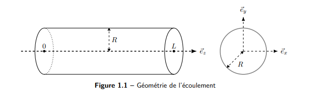

::: center
**巴黎-萨克雷高等师范学院**\
**CHPS 二年级硕士**\
**连续介质力学导论（IMMC）**\
**TD7 ---**
:::

# 题目描述

考虑一均匀、牛顿型、不可压缩流体在一圆截面直管中的定常流动。 流体密度为 $\rho$，动力黏度为 $\mu$（体积黏度为 $\lambda$），管道半径为 $R$，管轴为水平的 $O\vec{e}_z$，如图 图 1 所示。

入口截面 $S_0$ 处压力为 $P_0$，出口截面 $S_L$ 处压力为 $P_L$，记 $\Delta P = P_0 - P_L > 0$。忽略重力。 假设流动为单向流动。

目标：求

- 速度分布；

- 壁面剪应力；

- 规则压降系数。

## 问题 1.1：在假设条件下写出方程与边界条件

#### 假设解释

- H1：定常流（稳态） 

$$
\frac{\partial (\cdot)}{\partial t} = 0.
$$

- H2：轴对称流 

$$
\frac{\partial (\cdot)}{\partial \theta} = 0.
$$

- H3：单向流（仅沿 $z$ 向） 

$$
\vec{V} = v(r,z)\,\vec{e}_z.
$$

- H4：流体不可压缩 

$$
\rho = \text{常数}
      \quad\Rightarrow\quad
      \nabla\cdot\vec{V} = 0
$$

 （质量守恒）。

- H5：流体均匀 

$$
\rho(M,t) = \rho(t),\quad
      \mu(M,t) = \mu_0.
$$

- H6：无体力 

$$
\vec{f}_d = \vec{0}.
$$

- H7：牛顿流体，动力黏度 $\mu$、体积黏度 $\lambda$。

#### 基本方程

定常、均匀、牛顿、不可压缩流体的局部控制方程为：

- 质量守恒（连续性方程）： 

$$
\frac{\partial \rho}{\partial t} + \nabla\cdot(\rho \vec{V})
      = \frac{d\rho}{dt} + \rho\,\nabla\cdot\vec{V} = 0.
      \tag{*1.1}
$$

- 动量守恒（局部平衡方程）： 

$$
\,\nabla\cdot\boldsymbol{\sigma} + \vec{f}_d
      = \rho\frac{d\vec{V}}{dt}
      = \rho\left(
          \frac{\partial \vec{V}}{\partial t} + (\nabla\vec{V})\cdot\vec{V}
      \right).
      \tag{*1.2}
$$

- 牛顿流体的本构关系： 

$$
\boldsymbol{\sigma}
      = 2\mu\,\boldsymbol{D} + \left(\lambda\,\mathrm{Tr}\,\boldsymbol{D} - p\right)\mathbf{I},
      \quad
      \boldsymbol{D} = \frac{1}{2}\left(\nabla\vec{V} + \nabla^T\vec{V}\right).
      \tag{*1.3}
$$

#### Navier--Stokes 方程

对均匀牛顿流体，动量方程与本构关系可组合成 Navier--Stokes 形式：

$$
\mu\,\Delta\vec{V} + (\lambda+\mu)\,\nabla(\nabla\cdot\vec{V})
- \nabla p + \vec{f}_d
= \rho\left(\frac{\partial \vec{V}}{\partial t} + (\nabla\vec{V})\cdot\vec{V}\right).
$$

在 H4（不可压缩，$\nabla\cdot\vec{V} = 0$）、H1（定常）、H6（无体力）下简化为： 

$$
\mu\,\Delta\vec{V} - \nabla p
= \rho\,(\nabla\vec{V})\cdot\vec{V}.
\tag{*1.8}
$$

#### 边界条件（C.L.）

- 管壁不可渗、且粘附条件（无滑移），管壁静止： 

$$
\vec{V}(r=R) = \vec{V}_{\text{wall}} = \vec{0}.
      \tag{*1.4}
$$

- 入口、出口给定压力： 

$$
p(z=0) = P_0,\qquad
      p(z=L) = P_L.
      \tag{*1.5}
$$

## 问题 1.2：求速度场与压力场，并计算平均速度 $V_m$，用 $V_m$ 表示速度分布

#### 连续性方程

由 H4（或 H1+H5），质量守恒式 (\*1.1) 化为： 

$$
\nabla\cdot\vec{V} = 0
\quad\Rightarrow\quad
\mathrm{Tr}\,\boldsymbol{D} = 0.
\tag{*1.6}
$$

在柱坐标中，$\vec{V} = v(r,z)\vec{e}_z$， 

$$
\nabla\cdot\vec{V} = \frac{\partial v}{\partial z} = 0
\quad\Rightarrow\quad
v(r,z) = v(r).
\tag{*1.7}
$$

#### Navier--Stokes 方程的简化

由 (\*1.8)： 

$$
\mu\,\Delta\vec{V} - \nabla p = \rho\,(\nabla\vec{V})\cdot\vec{V}.
\tag{*1.9}
$$

计算右端对流项。 在柱坐标下， 

$$
\vec{V} =
\begin{pmatrix}
0\\[0.3em]
0\\[0.3em]
v(r)
\end{pmatrix},
\quad
\nabla\vec{V} =
\begin{pmatrix}
0 & 0 & 0\\
0 & 0 & 0\\
\dfrac{\partial v}{\partial r} & 0 & 0
\end{pmatrix}.
$$

于是： 

$$
\rho\,(\nabla\vec{V})\cdot\vec{V}
= \rho
\begin{pmatrix}
0\\
0\\
0
\end{pmatrix}
= \vec{0}.
\tag{*1.10}
$$

因此： 

$$
\mu\,\Delta\vec{V} - \nabla p = \vec{0}.
$$

又因 $\vec{V} = v(r)\vec{e}_z$，且只随 $r$ 变化，有 

$$
\Delta\vec{V} = (\Delta v)\,\vec{e}_z.
$$

 于是： 

$$
\nabla p = \mu\,(\Delta v)\,\vec{e}_z.
\tag{*1.11}
$$

分量形式： 

$$
\frac{\partial p}{\partial r} = 0 \quad\Rightarrow\quad p = p(z),
\tag{*1.12}
$$

 

$$
\frac{\partial p}{\partial \theta} = 0 \quad\text{（与 H2 轴对称一致）},
\tag{*1.13}
$$

 

$$
\frac{\partial p}{\partial z} = \mu\,\Delta v.
\tag{*1.14}
$$

边界条件写为：

- 管壁无滑移： 

$$
\vec{V}(r=R) = \vec{0};
      \tag{*1.15}
$$

- $z=0$ 与 $z=L$ 截面压力： 

$$
p(z=0) = P_0,\quad p(z=L) = P_L.
      \tag{*1.16}
$$

由于 (\*1.14) 的左边仅依赖于 $z$，右边仅依赖于 $r$，两边必为常数： 

$$
\frac{dp}{dz} = \mu\,\Delta v = A = \text{常数}.
\tag{*1.17}
$$

积分得： 

$$
p(z) = Az + B.
$$

用边界条件确定 $A,B$： 

$$
\begin{cases}
p(0) = P_0 = B,\\[0.3em]
p(L) = P_L = AL + B,
\end{cases}
\quad\Rightarrow\quad
A = \dfrac{P_L - P_0}{L} = -\dfrac{\Delta P}{L}.
$$

因此： 

$$
p(z) = -\frac{\Delta P}{L}z + P_0.
\tag{*1.18}
$$

又由 $\mu\,\Delta v = A$，得： 

$$
\mu\,\Delta v = -\frac{\Delta P}{L},
\quad v(R) = 0.
\tag{*1.19}
$$

在柱坐标中，$v=v(r)$ 时， 

$$
\Delta v = \frac{1}{r}\frac{d}{dr}\left(r\,\frac{dv}{dr}\right).
$$

所以： 

$$
\mu\,\frac{1}{r}\frac{d}{dr}\left(r\,\frac{dv}{dr}\right) = -\frac{\Delta P}{L}.
$$

积分： 

$$
\frac{d}{dr}\left(r\,\frac{dv}{dr}\right)
= -\frac{\Delta P}{\mu L}\,r,
$$

$$
r\,\frac{dv}{dr}
= -\frac{\Delta P}{2\mu L}r^2 + C_1,
$$

$$
\frac{dv}{dr}
= -\frac{\Delta P}{2\mu L}r + \frac{C_1}{r}.
$$

再次积分： 

$$
v(r)
= -\frac{\Delta P}{4\mu L}r^2 + C_1\ln r + C_2.
\tag{*1.20}
$$

为使 $v(r)$ 在 $r=0$ 有限，必须 $C_1 = 0$： 

$$
v(r=0)\ \text{有限} \Rightarrow C_1 = 0.
\tag{*1.21}
$$

利用边界条件 $v(R)=0$： 

$$
0 = -\frac{\Delta P}{4\mu L}R^2 + C_2
\quad\Rightarrow\quad
C_2 = \frac{\Delta P}{4\mu L}R^2.
\tag{*1.22}
$$

最终得到速度分布： 

$$
\boxed{
v(r) = \frac{\Delta P}{4\mu L}\left(R^2 - r^2\right)
= \frac{\Delta P\,R^2}{4\mu L}\left(1 - \frac{r^2}{R^2}\right).
}
\tag{*1.23}
$$

#### 平均速度 $V_m$ 与分布表达

截面积 $S = \pi R^2$，平均速度定义为： 

$$
V_m = \frac{1}{S}\int_S \vec{V}\cdot\vec{n}\,dS
= \frac{1}{\pi R^2}\int_0^{2\pi}\int_0^R v(r)\,r\,dr\,d\theta.
$$

代入 $v(r)$： 

$$
V_m
= \frac{1}{\pi R^2}\int_0^{2\pi}\int_0^R
\frac{\Delta P}{4\mu L}\left(R^2 - r^2\right)r\,dr\,d\theta.
$$

计算： 

$$
\int_0^R (R^2 - r^2)r\,dr
= \int_0^R (R^2 r - r^3)\,dr
= \left[\frac{R^2 r^2}{2} - \frac{r^4}{4}\right]_0^R
= \frac{R^4}{2} - \frac{R^4}{4}
= \frac{R^4}{4}.
$$

于是： 

$$
V_m
= \frac{1}{\pi R^2}\cdot 2\pi\cdot\frac{\Delta P}{4\mu L}\cdot\frac{R^4}{4}
= \frac{\Delta P}{8\mu L}R^2.
\tag{*1.24}
$$

因此： 

$$
\boxed{
V_m = \frac{\Delta P\,R^2}{8\mu L}.
}
$$

把 $v(r)$ 用 $V_m$ 表示： 

$$
v(r)
= \frac{\Delta P\,R^2}{4\mu L}\left(1 - \frac{r^2}{R^2}\right)
= 2\,\frac{\Delta P\,R^2}{8\mu L}\left(1 - \frac{r^2}{R^2}\right)
= 2V_m\left(1 - \frac{r^2}{R^2}\right).
$$

$$
\boxed{
v(r) = 2V_m\left[1 - \left(\frac{r}{R}\right)^2\right].
}
\tag{*1.25}
$$

## 问题 1.3：计算体积流量与质量流量

体积流量： 

$$
Q_v = \int_S \vec{V}\cdot\vec{n}\,dS
= \int_S v(r)\,dS
= V_m S
= \pi R^2 V_m.
$$

代入 $V_m$ 得到： 

$$
Q_v
= \pi R^2\cdot\frac{\Delta P\,R^2}{8\mu L}
= \frac{\pi R^4}{8\mu L}\Delta P.
\tag{*1.26}
$$

质量流量定义： 

$$
Q_m = \int_S \rho\,\vec{V}\cdot\vec{n}\,dS.
\tag{*1.27}
$$

对均匀不可压缩流体，$\rho=\text{常数}$： 

$$
Q_m = \rho\int_S \vec{V}\cdot\vec{n}\,dS
= \rho\,Q_v.
\tag{*1.28}
$$

## 问题 1.4：求壁面剪应力 $\tau_p$

壁面上的应力向量： 

$$
\boldsymbol{\sigma}\cdot\vec{n}
= \left[(\boldsymbol{\sigma}\cdot\vec{n})\cdot\vec{n}\right]\vec{n}
+ \left[(\boldsymbol{\sigma}\cdot\vec{n})\cdot\vec{t}\right]\vec{t}.
\tag{*1.29}
$$

我们关注切向分量： 

$$
(\vec{t}\cdot\boldsymbol{\sigma}\cdot\vec{n})\,\vec{t}
= \tau_p\,\vec{t}.
\tag{*1.30}
$$

这里 $\vec{n} = \vec{e}_r$，$\vec{t} = \vec{e}_z$。

#### 方法一：局部法------由本构关系计算

速度梯度： 

$$
\nabla\vec{V}
=
\begin{pmatrix}
0 & 0 & 0\\
0 & 0 & 0\\
\dfrac{dv}{dr} & 0 & 0
\end{pmatrix}.
\tag{*1.31}
$$

对称部分（变形速率张量）： 

$$
\boldsymbol{D}
= \frac{1}{2}\left(\nabla\vec{V} + \nabla^T\vec{V}\right)
=
\frac{1}{2}
\begin{pmatrix}
0 & 0 & \dfrac{dv}{dr}\\
0 & 0 & 0\\
\dfrac{dv}{dr} & 0 & 0
\end{pmatrix}.
\tag{*1.32}
$$

由 $v(r) = 2V_m\left(1 - \dfrac{r^2}{R^2}\right)$， 

$$
\frac{dv}{dr}
= -4V_m\frac{r}{R^2}.
$$

在 $r=R$ 处： 

$$
\boldsymbol{D}(r=R)
=
-2\frac{V_m}{R}
\begin{pmatrix}
0 & 0 & 1\\
0 & 0 & 0\\
1 & 0 & 0
\end{pmatrix}.
\tag{*1.33}
$$

应力张量： 

$$
\boldsymbol{\sigma}
= 2\mu\boldsymbol{D} - p\,\mathbf{I},
$$

 在 $r=R$ 处（只写出关键分量）： 

$$
\boldsymbol{\sigma}(r=R)
=
\begin{pmatrix}
-p(z) & 0 & -\dfrac{\Delta P\,R}{2L}\\
0 & -p(z) & 0\\
-\dfrac{\Delta P\,R}{2L} & 0 & -p(z)
\end{pmatrix}.
\tag{*1.34}
$$

壁面切向剪应力： 

$$
\tau_p
= \left[\boldsymbol{\sigma}(r=R)\cdot\vec{n}\right]\cdot\vec{t}
= \left[\boldsymbol{\sigma}(r=R)\cdot\vec{e}_r\right]\cdot\vec{e}_z
= -\frac{\Delta P\,R}{2L}.
$$

也可写成： 

$$
\boxed{
\tau_p = -\frac{R}{2L}\Delta P
= -\,\frac{4\mu V_m}{R}.
}
\tag{*1.35}
$$

#### 方法二：整体法------控制体受力平衡

考虑长度为 $dz$ 的圆柱形流体体元（半径 $R$）。 在截面 $z$ 处压力为 $p$，在 $z+dz$ 处为 $p+dp$，圆柱侧壁上为剪应力 $\tau_p$。

沿 $\vec{e}_z$ 方向的力平衡： 

$$
p\pi R^2 - (p+dp)\pi R^2 + (2\pi R\,\tau_p)\,dz = 0.
$$

整理： 

$$
-\pi R^2\,dp + 2\pi R\,\tau_p\,dz = 0
\quad\Rightarrow\quad
\tau_p = \frac{R}{2}\frac{dp}{dz}.
$$

又因 

$$
\frac{dp}{dz} = -\frac{\Delta P}{L},
$$

 故： 

$$
\boxed{
\tau_p = -\frac{R}{2}\frac{\Delta P}{L},
}
\tag{*1.36}
$$

 与方法一结果一致。

# 附录：柱坐标下的常用算子公式

在柱坐标 $(r,\theta,z)$ 中，基矢为 $(\vec{e}_r,\vec{e}_\theta,\vec{e}_z)$。

#### 标量 $f$ 的梯度

$$
\nabla f
= \frac{\partial f}{\partial r}\,\vec{e}_r
+ \frac{1}{r}\frac{\partial f}{\partial \theta}\,\vec{e}_\theta
+ \frac{\partial f}{\partial z}\,\vec{e}_z.
$$

#### 向量 $\vec{U}=(U_r,U_\theta,U_z)$ 的梯度

$$
\nabla\vec{U}
=
\begin{pmatrix}
\dfrac{\partial U_r}{\partial r} &
\dfrac{1}{r}\dfrac{\partial U_r}{\partial \theta} - \dfrac{U_\theta}{r} &
\dfrac{\partial U_r}{\partial z}
\\[0.7em]
\dfrac{\partial U_\theta}{\partial r} &
\dfrac{1}{r}\dfrac{\partial U_\theta}{\partial \theta} + \dfrac{U_r}{r} &
\dfrac{\partial U_\theta}{\partial z}
\\[0.7em]
\dfrac{\partial U_z}{\partial r} &
\dfrac{1}{r}\dfrac{\partial U_z}{\partial \theta} &
\dfrac{\partial U_z}{\partial z}
\end{pmatrix}.
$$

#### 向量 $\vec{U}$ 的散度

$$
\nabla\cdot\vec{U}
= \frac{1}{r}\frac{\partial (rU_r)}{\partial r}
+ \frac{1}{r}\frac{\partial U_\theta}{\partial \theta}
+ \frac{\partial U_z}{\partial z}.
$$

#### 向量 $\vec{U}$ 的旋度

$$
\nabla\times\vec{U}
= \left(
\frac{1}{r}\frac{\partial U_z}{\partial \theta}
- \frac{\partial U_\theta}{\partial z}
\right)\vec{e}_r
+ \left(
\frac{\partial U_r}{\partial z}
- \frac{\partial U_z}{\partial r}
\right)\vec{e}_\theta
+ \left(
\frac{1}{r}\frac{\partial (rU_\theta)}{\partial r}
- \frac{1}{r}\frac{\partial U_r}{\partial \theta}
\right)\vec{e}_z.
$$

#### 标量 $f$ 的 Laplace 算子

$$
\Delta f
= \frac{1}{r}\frac{\partial}{\partial r}\left(
r\,\frac{\partial f}{\partial r}
\right)
+ \frac{1}{r^2}\frac{\partial^2 f}{\partial \theta^2}
+ \frac{\partial^2 f}{\partial z^2}.
$$

#### 向量 $\vec{U}$ 的 Laplace 算子

$$
\Delta\vec{U}
=
\left(
\Delta U_r - \frac{U_r}{r^2} - \frac{2}{r^2}\frac{\partial U_\theta}{\partial \theta}
\right)\vec{e}_r
+ \left(
\Delta U_\theta + \frac{2}{r^2}\frac{\partial U_r}{\partial \theta} - \frac{U_\theta}{r^2}
\right)\vec{e}_\theta
+ (\Delta U_z)\,\vec{e}_z.
$$

::: flushright
TD7 修正版 ------ 2025 年 10 月 17 日
:::
