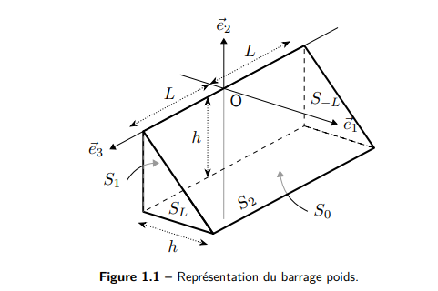
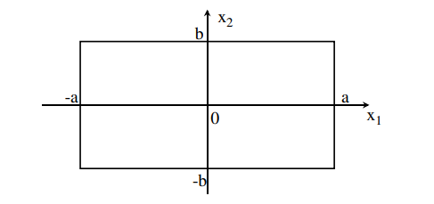

# 习题 1 ------ 重力坝

研究在水作用下的重力坝的平衡问题。坝体假定为线弹性体，其几何与边界如图 1.1 所示。

该重力坝在面 $S_0$ 上与地基刚接（固支），在面 $S_2$ 上无外力作用，在面 $S_1$ 上受到一给定的面力分布 $\bm{F}$。在面 $S_l$ 与 $S_{-l}$ 上法向位移被约束为零，但切向上无外力（切向自由）。给定 

$$
\bm{F} = -p\,\frac{x_2}{h}\,\mathbf{e}_1,
$$

 其中 $p$ 为已知常数。

## 问题 1.1

写出该问题的数学表述及边界条件。该问题是否具有唯一解？

### 问题 1.1：解答

这是一个各向同性、线弹性固体在静力平衡下的边值问题，边界条件为混合型（位移边界与力边界并存）。

若该问题存在精确解 $\{\mathbf{u},\boldsymbol{\sigma}\}$，则应满足：

#### 平衡方程

$$
\operatorname{div}\boldsymbol{\sigma}+ \mathbf{f}_d= \mathbf{0}.
$$

#### 线弹性本构关系

$$
\boldsymbol{\sigma}= K\,\boldsymbol{\varepsilon},
$$

 其中 $K$ 为弹性刚度张量（各向同性弹性中由拉梅常数 $\lambda,\mu$ 决定）。

#### 应变--位移关系（HPP 方程）

$$
\boldsymbol{\varepsilon}= \frac{1}{2}\bigl(\nabla\mathbf{u}+ (\nabla\mathbf{u})^{T}\bigr).
$$

#### 位移边界条件（CA，在 $\partial\Omega_u$ 上）

$$
\left\{
\begin{aligned}
\mathbf{u}_d(x_2=-h) &= \mathbf{0} &&\text{在 } S_0,\\
\mathbf{u}_d(x_3=l)\cdot \mathbf{e}_3 &= 0 &&\text{在 } S_l,\\
\mathbf{u}_d(x_3=-l)\cdot \mathbf{e}_3 &= 0 &&\text{在 } S_{-l}.
\end{aligned}
\right.
$$

#### 力边界条件（SA，在 $\partial\Omega_T$ 上）

$$
\left\{
\begin{aligned}
\boldsymbol{\sigma}\cdot\mathbf{n}\cdot \mathbf{e}_1 &= \mathbf{T}_d\cdot \mathbf{e}_1 = 0 &&\text{在 } S_l,\\
\boldsymbol{\sigma}\cdot\mathbf{n}\cdot \mathbf{e}_2 &= \mathbf{T}_d\cdot \mathbf{e}_2 = 0 &&\text{在 } S_l,\\[2pt]
\boldsymbol{\sigma}\cdot\mathbf{n}\cdot \mathbf{e}_1 &= \mathbf{T}_d\cdot \mathbf{e}_1 = 0 &&\text{在 } S_{-l},\\
\boldsymbol{\sigma}\cdot\mathbf{n}\cdot \mathbf{e}_2 &= \mathbf{T}_d\cdot \mathbf{e}_2 = 0 &&\text{在 } S_{-l},\\[2pt]
\boldsymbol{\sigma}\cdot\mathbf{n}&= \mathbf{T}_d= \bm{F} = -p\,\dfrac{x_2}{h}\,\mathbf{e}_1 &&\text{在 } S_1,\\[2pt]
\boldsymbol{\sigma}\cdot\mathbf{n}&= \mathbf{T}_d= \mathbf{0} &&\text{在 } S_2.
\end{aligned}
\right.
$$

其中各边界面的外法向为 

$$
\left\{
\begin{aligned}
\mathbf{n}&= -\mathbf{e}_2 &&\text{在 } S_0,\\
\mathbf{n}&= -\mathbf{e}_1 &&\text{在 } S_1,\\
\mathbf{n}&= \dfrac{1}{\sqrt{2}}(\mathbf{e}_1+\mathbf{e}_2) &&\text{在 } S_2,\\
\mathbf{n}&= \mathbf{e}_3 &&\text{在 } S_l,\\
\mathbf{n}&= -\mathbf{e}_3 &&\text{在 } S_{-l}.
\end{aligned}
\right.
$$

对整个边界 $\partial\Omega$ 而言，位移 $\mathbf{u}_d$ 与边界力 $\mathbf{T}_d$ 在给定的坐标基底（此处为笛卡尔基底）下的每一分量 $i$ 均被确定：要么指定该分量的位移（CA），要么指定相应的应力矢量分量（SA）。因此边界条件在 $\partial\Omega$ 上是完全确定的。

此外，刚体运动在平移与转动上均被约束（例如通过在 $S_0$ 上的固支）。在这些假设下，该线弹性边值问题的解是唯一的。

（原文页脚：Correction de TD 1, Version du 29 octobre 2024）

## 问题 1.2

给出运动学可容许位移场的空间 $U_{\mathrm{ad}}$ 的定义，并写出弹性势能。

### 问题 1.2：解答

我们可以寻找两类近似解：

- 运动学可容许解 $\{\mathbf{u}_{\mathrm{CA}},\boldsymbol{\sigma}_{\mathrm{CA}}\}$（通过给定位移场来逼近）；

- 静力学可容许解 $\{\mathbf{u}_{\mathrm{SA}},\boldsymbol{\sigma}_{\mathrm{SA}}\}$（通过给定应力场来逼近）。

<!-- -->

- 运动学可容许位移空间：近似解中的位移场 $\mathbf{u}_{\mathrm{CA}}$ 属于空间 $U_{\mathrm{ad}}$；

- 静力学可容许应力空间：近似解中的应力场 $\boldsymbol{\sigma}_{\mathrm{SA}}$ 属于空间 $S_{\mathrm{ad}}$；

- 条件：对一个运动学可容许位移场而言，必须满足：

  - 满足所有位移边界条件（CA）；

  - 在区域内连续且足够光滑（至少一阶空间可导）。

在所有边界条件均被满足的前提下，若精确解满足 

$$
\boldsymbol{\sigma}- K\,\boldsymbol{\varepsilon}= \mathbf{0},
$$

 而我们构造的近似解也满足该关系，则此近似解即为精确解。更一般地，我们通过能量的方式来衡量近似解与精确解之间的偏差，并将弹性能分解为两部分：势能与互补能。

#### 本构关系误差（课程中给出的表达）

$$
e^2 = \Psi = \frac{1}{2}\int_{\Omega} \bigl(\boldsymbol{\sigma}_{\mathrm{SA}} - K\,\boldsymbol{\varepsilon}(\mathbf{u}_{\mathrm{CA}})\bigr) : K^{-1}\bigl(\boldsymbol{\sigma}_{\mathrm{SA}} - K\,\boldsymbol{\varepsilon}(\mathbf{u}_{\mathrm{CA}})\bigr)\,\mathrm{d}\Omega \;\ge 0.
$$

该表达可分解为两个能量项： 

$$
\Psi = E_p(\mathbf{u}_{\mathrm{CA}}) + E_c(\boldsymbol{\sigma}_{\mathrm{SA}}),
$$

 其中

#### 势能

$$
E_p(\mathbf{u}_{\mathrm{CA}}) =
\int_{\Omega} \frac{1}{2}\,\boldsymbol{\varepsilon}(\mathbf{u}_{\mathrm{CA}}) : K\,\boldsymbol{\varepsilon}(\mathbf{u}_{\mathrm{CA}})\,\mathrm{d}\Omega
-
\int_{\partial\Omega_T} \mathbf{u}_{\mathrm{CA}}\cdot \mathbf{T}_d\,\mathrm{d}\Sigma
-
\int_{\Omega} \mathbf{u}_{\mathrm{CA}}\cdot \mathbf{f}_d\,\mathrm{d}\Omega.
$$

#### 互补能

$$
E_c(\boldsymbol{\sigma}_{\mathrm{SA}}) =
\int_{\Omega} \frac{1}{2}\,\boldsymbol{\sigma}_{\mathrm{SA}} : K^{-1}\boldsymbol{\sigma}_{\mathrm{SA}}\,\mathrm{d}\Omega
-
\int_{\partial\Omega_u} \mathbf{u}_d\cdot (\boldsymbol{\sigma}_{\mathrm{SA}}\cdot\mathbf{n})\,\mathrm{d}\Sigma.
$$

当且仅当 

$$
\Psi = E_p + E_c = 0
\quad\Longleftrightarrow\quad
E_p = -E_c
$$

 时，近似解即为精确解。

在本题中，我们采用势能最小原理的途径，即通过构造一个运动学可容许的位移场来近似求解，从而引出势能 $E_p(\mathbf{u}_{\mathrm{CA}})$ 的最小化问题。

（原文页脚：Correction de TD 2, Version du 29 octobre 2024）

## 问题 1.3

我们构造如下形式的试探位移场： 

$$
\bm{u}^\star = \left(\frac{x_2}{h} + 1\right)\bigl(K_1\,\mathbf{e}_1 + K_2\,\mathbf{e}_2\bigr).
$$

- 验证 $\bm{u}^\star$ 是否为运动学可容许的位移场；

- 计算常数 $K_1$ 与 $K_2$；

- 讨论该解是否为该问题的精确解。

### 问题 1.3：解答

令 

$$
\bm{u}^\star = \left(\frac{x_2}{h} + 1\right)\bigl(K_1\,\mathbf{e}_1 + K_2\,\mathbf{e}_2\bigr).
$$

#### 1. 运动学可容许性

首先检查该场是否为 CA（运动学可容许）：

- 在整个区域 $\Omega$ 上，$\bm{u}^\star$ 显然是连续且一阶可导的；

- 检查位移边界条件： 

$$
\left\{
          \begin{aligned}
          \bm{u}^\star(x_2=-h) &= \mathbf{0} &&\text{在 } S_0,\\
          \bm{u}^\star(x_3=l)\cdot \mathbf{e}_3 &= 0 &&\text{在 } S_l,\\
          \bm{u}^\star(x_3=-l)\cdot \mathbf{e}_3 &= 0 &&\text{在 } S_{-l}.
          \end{aligned}
          \right.
$$

 可见所有 CA 型边界条件都满足。

因此，$\bm{u}^\star$ 是一个运动学可容许的试探位移场。

#### 2. 计算 $K_1$ 与 $K_2$

计算位移梯度、应变张量以及通过 Hooke 定律得到的应力张量。

$$
\nabla\bm{u}^\star = \frac{1}{h}
\begin{pmatrix}
0 & K_1 & 0\\
0 & K_2 & 0\\
0 & 0   & 0
\end{pmatrix},
\qquad
\boldsymbol{\varepsilon}(\bm{u}^\star) = \frac{1}{2h}
\begin{pmatrix}
0    & K_1 & 0\\
2K_2 & 0   & \text{sym}\\
0    & \text{sym} & 0
\end{pmatrix}.
$$

应用 Hooke 定律得到应力 

$$
K\,\boldsymbol{\varepsilon}(\bm{u}^\star) = \frac{1}{h}
\begin{pmatrix}
\lambda K_2 & \mu K_1 & 0\\
(\lambda+2\mu)K_2 & 0 & \text{sym}\\
0 & \text{sym} & \lambda K_2
\end{pmatrix},
$$

 从而可得到弹性能密度 

$$
\frac{1}{2}\,\boldsymbol{\varepsilon}(\bm{u}^\star) : K\,\boldsymbol{\varepsilon}(\bm{u}^\star)
= \frac{1}{2h^2}\bigl[\mu K_1^2 + (\lambda+2\mu)K_2^2\bigr].
$$

 （注意进行双重缩并时，非对角项会出现两次。）

接下来计算势能 

$$
E_p(\bm{u}^\star) =
\int_{\Omega} \frac{1}{2}\,\boldsymbol{\varepsilon}(\bm{u}^\star):K\,\boldsymbol{\varepsilon}(\bm{u}^\star)\,\mathrm{d}\Omega
-
\int_{\partial\Omega_T} \bm{u}^\star\cdot \mathbf{T}_d\,\mathrm{d}\Sigma
-
\int_{\Omega} \bm{u}^\star\cdot \mathbf{f}_d\,\mathrm{d}\Omega.
$$

本题中没有体力项（$\mathbf{f}_d=\mathbf{0}$），体积分变为 

$$
\int_{\Omega} \frac{1}{2}\,\boldsymbol{\varepsilon}(\bm{u}^\star):K\,\boldsymbol{\varepsilon}(\bm{u}^\star)\,\mathrm{d}\Omega
= \frac{1}{2h^2}
\int_{\Omega}\bigl[\mu K_1^2 + (\lambda+2\mu)K_2^2\bigr]\,\mathrm{d}\Omega.
$$

已知体积 $V(\Omega)=l\,h^2$，故 

$$
\int_{\Omega}\bigl[\mu K_1^2 + (\lambda+2\mu)K_2^2\bigr]\,\mathrm{d}\Omega
= l\,h^2\bigl[\mu K_1^2 + (\lambda+2\mu)K_2^2\bigr],
$$

 从而 

$$
\int_{\Omega} \frac{1}{2}\,\boldsymbol{\varepsilon}(\bm{u}^\star):K\,\boldsymbol{\varepsilon}(\bm{u}^\star)\,\mathrm{d}\Omega
= \frac{l}{2}\bigl[\mu K_1^2 + (\lambda+2\mu)K_2^2\bigr].
$$

再看边界 $S_1$ 上的外力做功： 

$$
\mathbf{T}_d= \bm{F} = -p\,\frac{x_2}{h}\,\mathbf{e}_1 \quad\text{在 } S_1,
$$

 于是 

$$
\int_{S_1} \bm{u}^\star\cdot\mathbf{T}_d\,\mathrm{d}\Sigma
= \int_{S_1}
\left(\frac{x_2}{h} + 1\right)
\bigl(K_1\mathbf{e}_1 + K_2\mathbf{e}_2\bigr)\cdot
\left(-p\,\frac{x_2}{h}\,\mathbf{e}_1\right)\,\mathrm{d}\Sigma.
$$

 代入可得 

$$
E_p(\bm{u}^\star)
= \frac{l}{2}\bigl[\mu K_1^2 + (\lambda+2\mu)K_2^2\bigr]
- p\,l\,\frac{h}{3}\,K_1.
$$

#### 势能最小原理

根据势能最小原理 

$$
\{K_1,K_2\} = \operatorname*{argmin}_{K_1,K_2} E_p(\bm{u}^\star),
$$

 这会导致以下方程组 

$$
\left\{
\begin{aligned}
\frac{\partial E_p}{\partial K_1} &= 0,\\
\frac{\partial E_p}{\partial K_2} &= 0,
\end{aligned}
\right.
\qquad\Longrightarrow\qquad
\left\{
\begin{aligned}
\mu l\,K_1 - p l\,\frac{h}{3} &= 0,\\
(\lambda+2\mu)K_2 &= 0.
\end{aligned}
\right.
$$

因此 

$$
K_1 = \frac{p h}{3\mu},
\qquad
K_2 = 0.
$$

#### 关于"先积分后求导"与"先求导后积分"的备注

也可以先对 $K_1,K_2$ 求导，再进行空间积分。这在积分上、下限不依赖于 $K_1,K_2$ 时是合法的。一种一般形式为 

$$
\frac{\partial}{\partial x}
\int_{a(x)}^{b(x)} f(x,y)\,\mathrm{d}y
=
\int_{a(x)}^{b(x)} \frac{\partial f}{\partial x}(x,y)\,\mathrm{d}y
+ f\bigl(x,b(x)\bigr)\,\frac{\partial b}{\partial x}
- f\bigl(x,a(x)\bigr)\,\frac{\partial a}{\partial x}.
$$

 在多数问题中，当未知参数数目不大（例如不超过 4 个）时，这样的操作在计算上是有利的。

由于势能对 $(K_1,K_2)$ 是严格正定的二次型，因此若存在极值，则必为唯一的最小值。

代回 $K_1,K_2$ 后得到的试探场即为对应的"最佳"近似解。

#### 3. 是否为精确解？

为了判断 $\bm{u}^\star$ 是否为精确解，需要进一步计算其应变与应力场并检查是否满足所有平衡与边界条件。

由上面得到 

$$
\boldsymbol{\varepsilon}(\bm{u}^\star) =
\frac{p}{6\mu}
\begin{pmatrix}
0 & 1 & 0\\
0 & 0 & \text{sym}\\
0 & \text{sym} & 0
\end{pmatrix},
\qquad
\boldsymbol{\sigma}_{\mathrm{CA}} = K\,\boldsymbol{\varepsilon}(\bm{u}^\star) =
\frac{p}{3}
\begin{pmatrix}
0 & 1 & 0\\
0 & 0 & \text{sym}\\
0 & \text{sym} & 0
\end{pmatrix}.
$$

检查：

- 平衡方程：由于 $\boldsymbol{\sigma}_{\mathrm{CA}}$ 在 $\Omega$ 内为常量， 

$$
-\operatorname{div}\boldsymbol{\sigma}_{\mathrm{CA}} = \mathbf{0},
$$

 因此平衡条件在体内是满足的。

- 边界力条件：

  - 在 $S_l$ 上，$\mathbf{n}=\mathbf{e}_3$，可验证 $\boldsymbol{\sigma}_{\mathrm{CA}}\cdot\mathbf{n}=\mathbf{0}$，与该面的零外力条件兼容；

  - 在 $S_{-l}$ 上，$\mathbf{n}=-\mathbf{e}_3$，同样有 $\boldsymbol{\sigma}_{\mathrm{CA}}\cdot\mathbf{n}=\mathbf{0}$，满足零外力条件；

  - 在 $S_1$ 上，$\mathbf{n}=-\mathbf{e}_1$，有 

$$
\boldsymbol{\sigma}_{\mathrm{CA}}\cdot\mathbf{n}= -\frac{p}{3}\,\mathbf{e}_2
                    \neq -p\,\frac{x_2}{h}\,\mathbf{e}_1 = \bm{F},
$$

 因此在 $S_1$ 上的 SA 条件并未满足；

  - 在 $S_2$ 上，$\mathbf{n}=\dfrac{1}{\sqrt{2}}(\mathbf{e}_1+\mathbf{e}_2)$，得到 

$$
\boldsymbol{\sigma}_{\mathrm{CA}}\cdot\mathbf{n}=
                    \frac{p}{3\sqrt{2}}(\mathbf{e}_1+\mathbf{e}_2)\neq \mathbf{0},
$$

 而该面应为自由面（零外力），故同样不满足 SA 条件。

综上，虽然 $\bm{u}^\star$ 是一个运动学可容许的场，并且对给定的两参数形式来说它使势能达到最小，但对应的应力场并未满足所有力边界条件，因此 *它并不是该边值问题的精确解*。

（原文页脚：Correction de TD 3, Version du 29 octobre 2024）

#### 变体：考虑坝体自重

本题的一个变体是将坝体自重引入为体力项，即 

$$
\mathbf{f}_d= -\rho g\,\mathbf{e}_2,
$$

 其中 $\rho$ 为坝体材料密度，$g$ 为重力加速度。此时在势能表达式中需要额外加入 

$$
-\int_{\Omega}\mathbf{u}\cdot\mathbf{f}_d\,\mathrm{d}\Omega
$$

 一项，并相应地重新进行能量最小化分析。

（原文页脚：Correction de TD 4, Version du 29 octobre 2024）

# 习题 2 ------ 矩形块受压

研究一个矩形弹性体（称为"块"或"试样"）在两块平行、平面且刚性的压板之间的平面变形， 如图 2.1 所示。假设压板与试样之间的接触无滑移。

两侧面 $x_1 = \pm a$ 为自由面（无外力）。 压板在上表面 $x_2 = b$（分别在下表面 $x_2 = -b$）上施加位移 $-U\,\mathbf{e}_2$（分别为 $U\,\mathbf{e}_2$），其中 $U$ 为已知常数。 忽略体力。位移分量为 $u_1, u_2$（且 $u_3=0$）。

由于几何与载荷的对称性： 

$$
u_1(x_1,x_2)\ \text{关于}\ x_1\ \text{为奇函数，关于}\ x_2\ \text{为偶函数；}\qquad
u_2(x_1,x_2)\ \text{关于}\ x_1\ \text{为偶函数，关于}\ x_2\ \text{为奇函数。}
$$

因此只需研究四分之一区域： 

$$
\Omega = \{\,0 \le x_1 \le a,\; 0 \le x_2 \le b\,\}.
$$

该问题为平面应变问题，因此： 

$$
\sigma_{13} = \sigma_{23} = 0, \qquad \sigma_{33} = \nu(\sigma_{11} + \sigma_{22}),
$$

 其中 $\nu$ 为泊松比。

## 问题 2.1

写出问题的数学表达及边界条件。

### 问题 2.1：解答

这是一个二维线弹性、各向同性、无体力、混合边界条件的静力平衡问题。

在平面应变条件下： 

$$
\boldsymbol{\varepsilon} =
\begin{pmatrix}
\varepsilon_{11} & \varepsilon_{12} & 0\\
\varepsilon_{12} & \varepsilon_{22} & 0\\
0 & 0 & 0
\end{pmatrix},\qquad
\boldsymbol{\sigma} =
\begin{pmatrix}
\sigma_{11} & \sigma_{12} & 0\\
\sigma_{12} & \sigma_{22} & 0\\
0 & 0 & \sigma_{33}
\end{pmatrix},\quad
\sigma_{33} = \nu(\sigma_{11} + \sigma_{22}).
$$

若存在精确解 $\{\mathbf{u}, \boldsymbol{\sigma}\}$，则应满足：

#### 位移场

$$
\mathbf{u}(x_1,x_2) = u_1(x_1,x_2)\,\mathbf{e}_1 + u_2(x_1,x_2)\,\mathbf{e}_2.
$$

#### 应变定义（HPP 方程）

$$
\boldsymbol{\varepsilon} = \frac{1}{2}\left(\nabla\mathbf{u} + (\nabla\mathbf{u})^{T}\right).
$$

#### 平衡方程

$$
\operatorname{div}\boldsymbol{\sigma} + \mathbf{f}_d = \mathbf{0}.
$$

#### 线弹性本构关系

$$
\boldsymbol{\sigma} = K\,\boldsymbol{\varepsilon}.
$$

#### 位移边界条件（CA，$\partial\Omega_u$ 上）

$$
\left\{
\begin{aligned}
\mathbf{u}(x_1 = 0)\cdot \mathbf{e}_1 &= 0 &\text{（关于 } x_1 \text{ 的对称）},\\
\mathbf{u}(x_2 = 0)\cdot \mathbf{e}_1 &= 0 &\text{（关于 } x_2 \text{ 的对称）},\\
\mathbf{u}(x_2 = b) &= -U\,\mathbf{e}_2 &\text{（无滑移位移边界）}.
\end{aligned}
\right.
$$

#### 力边界条件（SA，$\partial\Omega_T$ 上）

由于对称面上的应力张量必为对角形式，故剪应力 $\sigma_{12}=0$： 

$$
\left\{
\begin{aligned}
\mathbf{T}(x_1=0)\cdot \mathbf{e}_2 &= \sigma_{12} = 0,\\
\mathbf{T}(x_2=0)\cdot \mathbf{e}_1 &= \sigma_{12} = 0,\\
\mathbf{T}(x_1=a) &= \boldsymbol{\sigma}(x_1=a)\cdot \mathbf{e}_1 = \mathbf{0}.
\end{aligned}
\right.
$$

因此对整个边界 $\partial\Omega$，每个方向（$\mathbf{e}_1$ 或 $\mathbf{e}_2$）上要么位移已知，要么外力已知。 刚体运动被位移边界阻止，解在应力与位移上唯一。

## 问题 2.2

定义运动学可容许位移场空间 $U_{\mathrm{ad}}$。

### 问题 2.2：解答

$$
\mathbf{u}\in U_{\mathrm{ad}}
\quad\Longleftrightarrow\quad
\left\{
\begin{aligned}
\mathbf{u}(x_1=0)\cdot\mathbf{e}_1 &= 0,\\
\mathbf{u}(x_2=0)\cdot\mathbf{e}_2 &= 0,\\
\mathbf{u}(x_2=b) &= -U\,\mathbf{e}_2.
\end{aligned}
\right.
$$

或写成： 

$$
\mathbf{u} = \mathbf{u}^\star + \lambda\,\mathbf{u}_0,
$$

 其中 $\mathbf{u}^\star$ 满足非齐次边界条件，$\mathbf{u}_0$ 为零位移边界（CAZ）场。

## 问题 2.3

为什么 $U_{\mathrm{ad}}$ 是仿射空间？ 如何通过变量替换得到相应的零位移可容许向量空间 $U_0$？

### 问题 2.3：解答

在 Ritz 法中，构造： 

$$
\mathbf{u} = \mathbf{u}^\star + \sum_i \beta_i\,\mathbf{u}^0_i,
$$

 其中 $\mathbf{u}^\star$ 满足非齐次 CA 边界，$\mathbf{u}^0_i\in U_0$ 为零边界的可容许位移场。

因此：

- $U_{\mathrm{ad}}$ 是仿射空间；

- $U_0$ 是关联的向量空间，包含零向量；

- 各 $\beta_i$ 为优化参数，通过最小化势能或互补能求得。

## 问题 2.4

在 $U_0$ 的二维子空间中取基底： 

$$
\mathbf{u}^0_1 = x_1\,\frac{x_2^2 - b^2}{b^2}\,\mathbf{e}_1,
\qquad
\mathbf{u}^0_2 = x_2\,\frac{x_2^2 - b^2}{b^2}\,\mathbf{e}_2.
$$

求解该问题的近似解。

### 问题 2.4：解答

取 

$$
\mathbf{u} = \mathbf{u}^\star + \beta_1\,\mathbf{u}^0_1 + \beta_2\,\mathbf{u}^0_2,
\qquad
\mathbf{u}^\star = -U\,\frac{x_2}{b}\,\mathbf{e}_2.
$$

经验证，$\mathbf{u}^0_1,\mathbf{u}^0_2$ 均为 CAZ，$\mathbf{u}^\star$ 为 CA 特解。

#### 1. 位移梯度与应变：

$$
\nabla\mathbf{u} = \frac{1}{b^2}
\begin{pmatrix}
(x_2^2-b^2)\beta_1 & 2x_1x_2\beta_1 & 0\\
0 & (3x_2^2-b^2)\beta_2 - bU & 0\\
0 & 0 & 0
\end{pmatrix},
\quad
\boldsymbol{\varepsilon}(\mathbf{u}) = \frac{1}{b^2}
\begin{pmatrix}
(x_2^2-b^2)\beta_1 & x_1x_2\beta_1 & 0\\
x_1x_2\beta_1 & (3x_2^2-b^2)\beta_2 - bU & 0\\
0 & 0 & 0
\end{pmatrix}.
$$

#### 2. 应力张量：

$$
K\boldsymbol{\varepsilon}(\mathbf{u}) = \frac{1}{b^2}
\Bigl(
[(\lambda+2\mu)(x_2^2-b^2)\beta_1 + \lambda((3x_2^2-b^2)\beta_2 - bU)]\,\mathbf{e}_1\otimes\mathbf{e}_1
+ 2\mu x_1x_2\beta_1(\mathbf{e}_1\otimes\mathbf{e}_2 + \mathbf{e}_2\otimes\mathbf{e}_1)
$$

 

$$
+ [\lambda(x_2^2-b^2)\beta_1 + (\lambda+2\mu)((3x_2^2-b^2)\beta_2 - bU)]\,\mathbf{e}_2\otimes\mathbf{e}_2
+ \lambda[(x_2^2-b^2)\beta_1 + (3x_2^2-b^2)\beta_2 + bU]\,\mathbf{e}_3\otimes\mathbf{e}_3
\Bigr).
$$

#### 3. 弹性能密度：

$$
e_d(\mathbf{u}) = \frac{1}{2b^4}\Bigl[
(\lambda+2\mu)\bigl(\beta_2(b^2-3x_2^2)+bU\bigr)^2
+ 2\beta_1\lambda(b^2-x_2^2)\bigl(\beta_2(b^2-3x_2^2)+bU\bigr)
$$

 

$$
+ \beta_1^2\bigl(2\mu(b^4-2x_2^2(b^2-x_1^2)+x_2^4) + \lambda(b^2-x_2^2)^2\bigr)
\Bigr].
$$

#### 4. 弹性能：

$$
E_d(\mathbf{u}) = \frac{a}{90b}\Bigl[
4\beta_1^2(5a^2\mu + 6b^2(\lambda+2\mu))
+ 9(\lambda+2\mu)(4b^2\beta_2^2 + 5U^2)
+ 12b\beta_1\lambda(2b\beta_2 + 5U)
\Bigr].
$$

 自由面 $x_1=a$ 上无外力，故外功为零，势能 $E_p = E_d$。

#### 5. 势能最小化：

$$
\frac{\partial E_p}{\partial \beta_1} = \frac{2a}{45b}\Bigl[2\beta_1(5a^2\mu + 6b^2(\lambda+2\mu)) + 3b\lambda(2b\beta_2 + 5U)\Bigr]=0,
$$

 

$$
\frac{\partial E_p}{\partial \beta_2} = \frac{4ab}{15}\,[3(\lambda+2\mu)\beta_2 + \lambda\beta_1] = 0.
$$

 解得： 

$$
\left\{
\begin{aligned}
\beta_1 &= -\dfrac{15b\lambda(\lambda+2\mu)U}{2[5a^2\mu(\lambda+2\mu) + b^2(5\lambda^2 + 24\lambda\mu + 24\mu^2)]},\\[6pt]
\beta_2 &= \dfrac{5b\lambda^2 U}{2[5a^2\mu(\lambda+2\mu) + b^2(5\lambda^2 + 24\lambda\mu + 24\mu^2)]}.
\end{aligned}
\right.
$$

#### 6. 代回位移场：

$$
\mathbf{u}(x_1,x_2)
=
U\,\frac{x_2}{2b}
\begin{pmatrix}
\dfrac{15\lambda(\lambda+2\mu)(b^2 - x_2^2)}
      {5\mu(\lambda+2\mu)a^2 + b^2(5\lambda^2+24\lambda\mu+24\mu^2)}\\[10pt]
\dfrac{5\lambda^2(x_2^2 - b^2)}
      {5\mu(\lambda+2\mu)a^2 + b^2(5\lambda^2+24\lambda\mu+24\mu^2)} - 2\\[4pt]
0
\end{pmatrix}.
$$

#### 7. 是否为精确解？

若检查： 

$$
-\operatorname{div}(K\,\boldsymbol{\varepsilon}(\mathbf{u})) = \mathbf{0},
\qquad
K\,\boldsymbol{\varepsilon}(\mathbf{u})\cdot\mathbf{n} = \mathbf{T}_d,
$$

 在自由面 $x_1=a$ 上可得： 

$$
K\,\boldsymbol{\varepsilon}(\mathbf{u}(x_1=a))\cdot\mathbf{e}_1
=
\frac{1}{b^2}
\begin{pmatrix}
-\lambda[\beta_2(b^2-3x_2^2)+bU]+(\lambda+2\mu)\beta_1(b^2-x_2^2)\\[4pt]
2a\mu\beta_1x_2\\[4pt]
0
\end{pmatrix}.
$$

 代入 $\beta_1,\beta_2$，结果一般不为零： 

$$
K\,\boldsymbol{\varepsilon}(\mathbf{u})\cdot\mathbf{n}\neq\mathbf{0}
\quad\Rightarrow\quad
\text{不满足自由面零外力的 SA 条件。}
$$

 因此该解是势能意义下的最优近似，但并非严格精确解。

（原文页脚：Correction de TD 9, Version du 29 octobre 2024）
