# 01-threads · 原文校对稿

[原始 PDF](01-threads.pdf) · [中文详解](01-threads_zh.md) · [课程目录](README.md)

对应实验：线程与同步（[中文版](../Labs/tp-threads/tp-threads_zh.html) · [英文原版](../Labs/tp-threads/tp-threads.html)）

> 以 PDF 内嵌文字层重建，按原页和文字块分离正文、代码与图注，修复 MinerU 的混栏、页脚入代码及语言标签问题。保留原课件的用词和代码疑点，不将其悄悄改写为正确程序。代码块有时是逐步展示中的片段；图形、数学排版、颜色和箭头以各页展开后的原图为准。

[重要勘误](ERRATA.md)

<a id="page-1"></a>

## 第 1 页 · Page 1

Processes, threads and

synchronizations

Master in computer science of IP Paris

Master CHPS of Paris Saclay

Gaël Thomas

> 校对：进程与程序、隔离和通信。

<details>
<summary>查看第 1 页原图（图形、代码布局与标注）</summary>

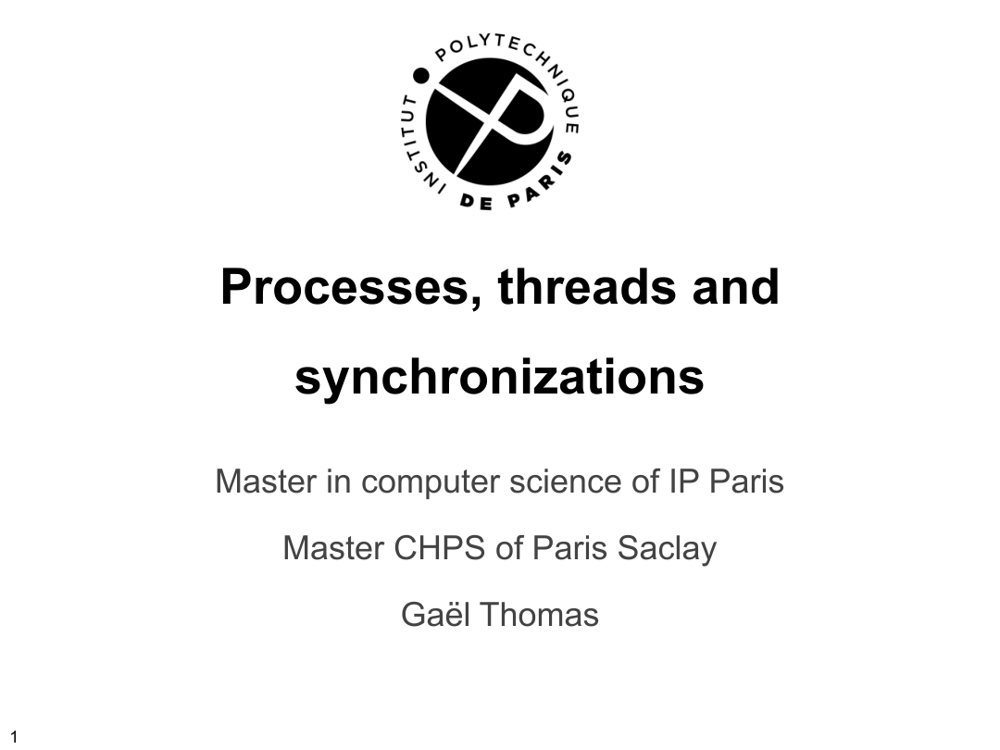

</details>

<a id="page-2"></a>

## 第 2 页 · Definition of a process

- A process is a running instance of a program

- Allow the execution of different programs in parallel (e.g., fortnite and chrome)
- Allow the execution of the same program multiple times (e.g., two instances of emacs for two different users)

- The operating system is in charge of

- Managing the life cycle of the processes (start, stop)
- Allowing processes to communicate (signals, pipes, sockets…)
- (Regularly) running the processes on the processors
- Isolating the processes (no shared memory by default)

- A process is roughly a virtualization of a complete machine

> 校对：进程与程序、隔离和通信。

<details>
<summary>查看第 2 页原图（图形、代码布局与标注）</summary>

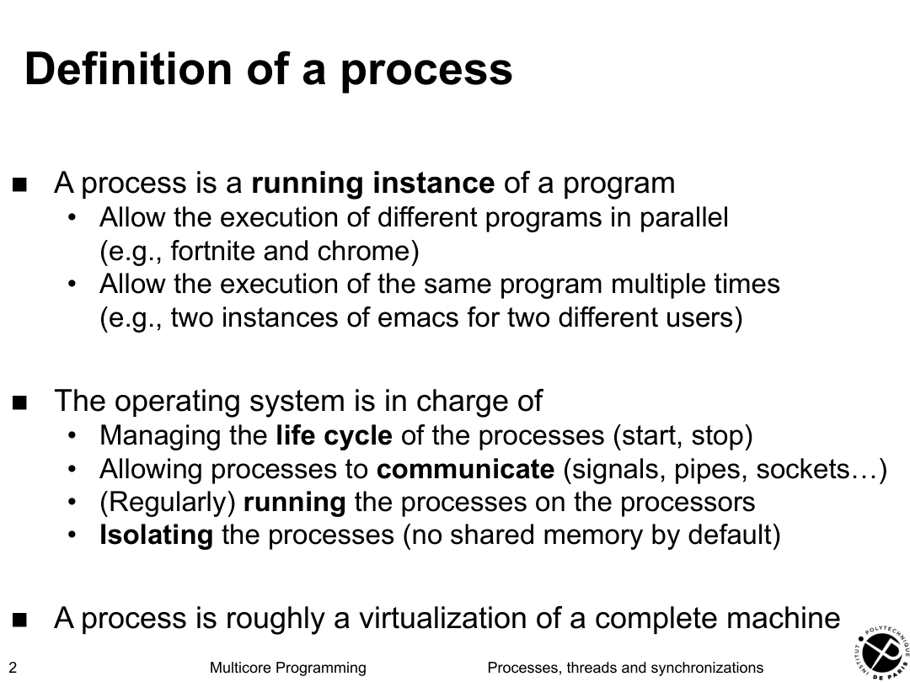

</details>

<a id="page-3"></a>

## 第 3 页 · From the call frame to the thread

- During execution, when it starts a function, the process creates

a call frame

图内标签：`add`

- Contains

- the arguments of the functions
- its local variables
- a link to the caller
- Frees the call frame at the end of the call

图内标签：`x`

图内标签：`1`

图内标签：`y`

图内标签：`2`

图内标签：`z`

图内标签：`3`

```text
int add(int x, int y) {
  int z = x + y;
  return z;
}
```

图内标签：`main`

图内标签：`1 / argc`

```text
int main(int argc, char** argv) {
  printf("%d\n", add(1, 2));
}
```

图内标签：`0x??? / argv`

> 校对：覆盖标注使 OCR 断词；从 PDF 恢复正文，栈与 PC 作为模型。

<details>
<summary>查看第 3 页原图（图形、代码布局与标注）</summary>

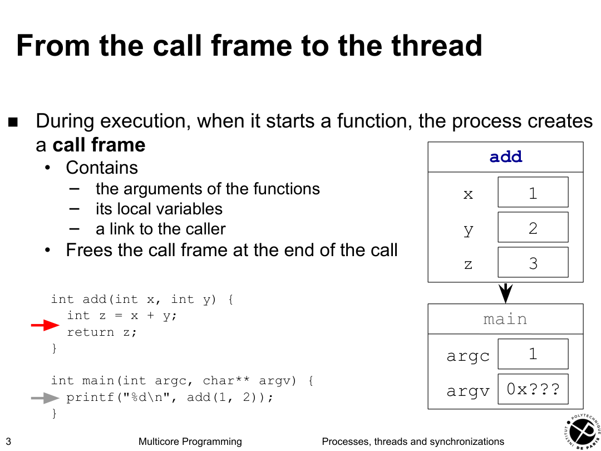

</details>

<a id="page-4"></a>

## 第 4 页 · From the call frame to the thread

- During execution, when it starts a function, the process creates

a call frame

图内标签：`add`

- Contains

Stack (of call frames)

- the arguments of the functions
- its local variables
- a link to the caller
- Frees the call frame at the end of the call

图内标签：`x`

图内标签：`1`

图内标签：`y`

图内标签：`2`

图内标签：`z`

图内标签：`3`

```text
int add(int x, int y) {
  int z = x + y;
  return z;
}
```

Next instruction to be

executed

图内标签：`main`

图内标签：`1 / argc`

```text
int main(int argc, char** argv) {
  printf("%d\n", add(1, 2));
}
```

图内标签：`0x??? / argv`

> 校对：OCR覆盖标注残片已从PDF重建；图示不能保证物理栈布局。

<details>
<summary>查看第 4 页原图（图形、代码布局与标注）</summary>

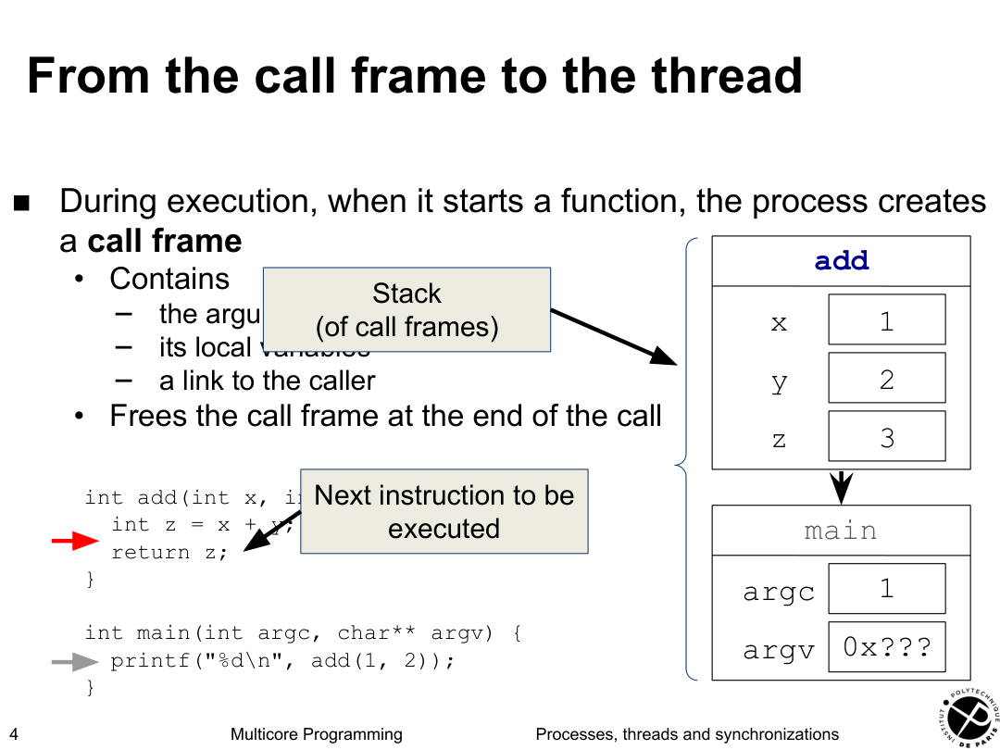

</details>

<a id="page-5"></a>

## 第 5 页 · From the call frame to the thread

- During execution, when it starts a function, the process creates

a call frame

- Contains

- the arguments of the functions
- its local variables
- a link to the caller
- Frees the call frame at the end of the call

- A thread is an execution context executable by a CPU

- A stack of call frames (e.g., main calls add)
- The next instruction to be executed (e.g., the return z)

- An operating system schedules the threads on the CPUs

> 校对：覆盖标注使 OCR 断词；从 PDF 恢复正文，栈与 PC 作为模型。

<details>
<summary>查看第 5 页原图（图形、代码布局与标注）</summary>

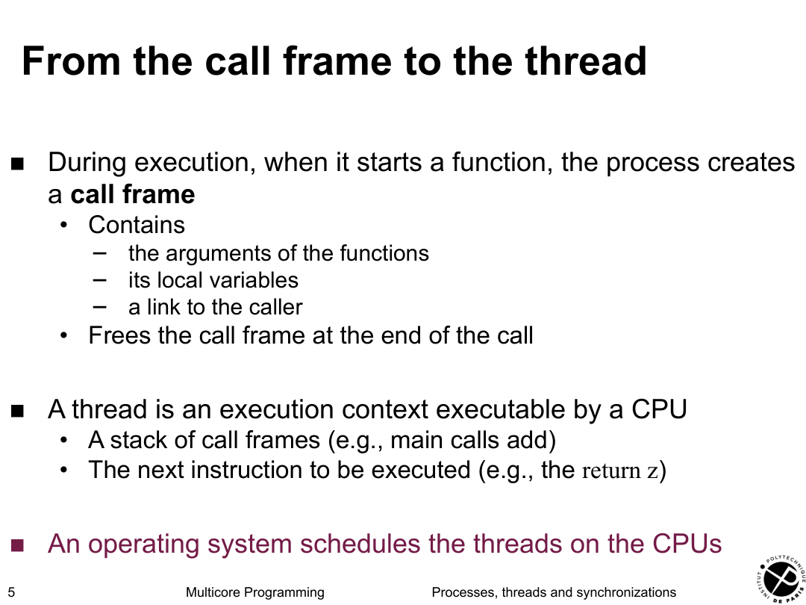

</details>

<a id="page-6"></a>

## 第 6 页 · Processes and threads

- A process contains

- A memory (data, code, heap)
- One or more threads (each with its stack and its next instruction)

- A process always starts with a single thread

- A process may create more threads to increase parallelism

- The operating system can then schedule the multiple threads on the multiple CPUs in parallel

- A process dies when its last thread terminates

> 校对：地址空间共享；第9页补充进程退出条件。

<details>
<summary>查看第 6 页原图（图形、代码布局与标注）</summary>

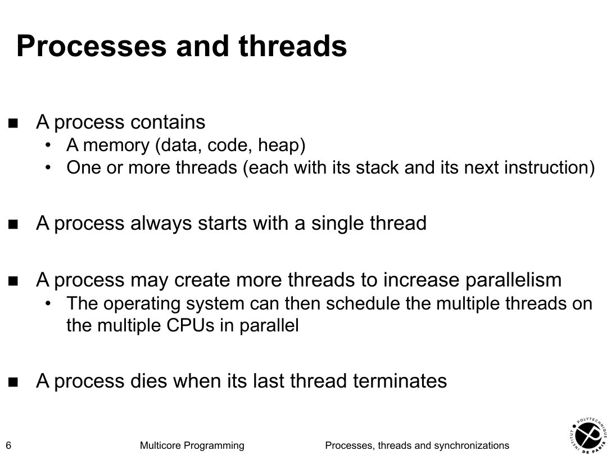

</details>

<a id="page-7"></a>

## 第 7 页 · Thread identification

- Type that can hold a thread identifier: pthread_t

- Identifier of the running thread: pthread_t pthread_self()

> 校对：地址空间共享；第9页补充进程退出条件。

<details>
<summary>查看第 7 页原图（图形、代码布局与标注）</summary>

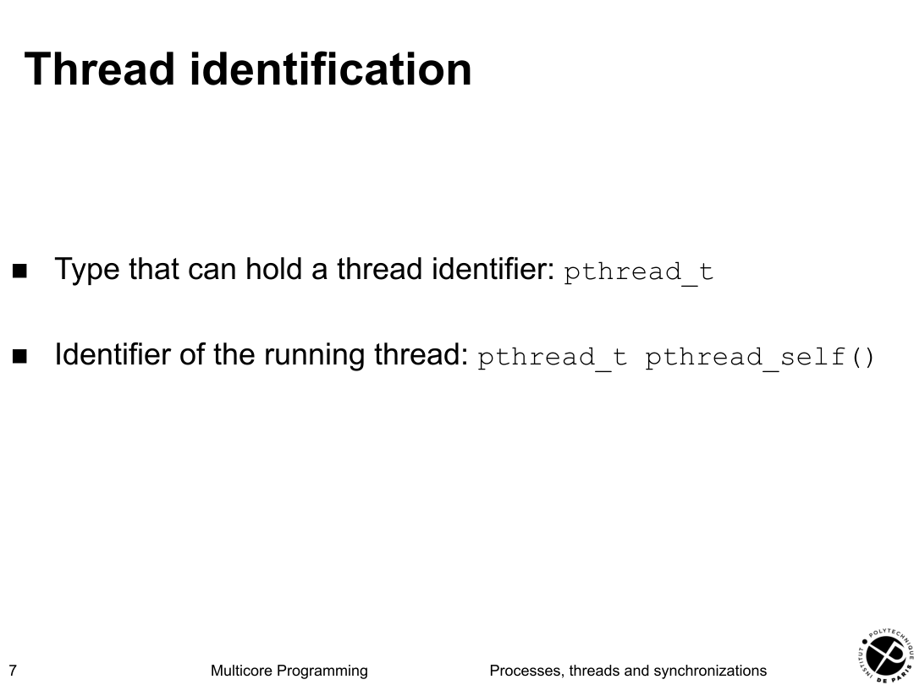

</details>

<a id="page-8"></a>

## 第 8 页 · Thread creation

```text
int pthread_create(pthread_t* tid, pthread_attr_t* 
attr, void* (*start_routine)(void*), void* arg)
```

- Create and start a new thread
- The new thread starts in the function start_routine
- The start_routine function receives the argument arg
- pthread_create fills *tid with the identifier of the new thread
- pthread_attr_t gives attribute (scheduling, stack pointer…)

```text
void* f(void* arg) { printf("f is running\n"); return NULL; }
```

```text
int main(int argc, char** argv) {
  pthread_t tid;
  pthread_create(&tid, NULL, f, NULL);
  printf("main is running in parallel with f\n");
}
```

> 校对：课件pthread_create省const且例子未join；中文注明。

<details>
<summary>查看第 8 页原图（图形、代码布局与标注）</summary>

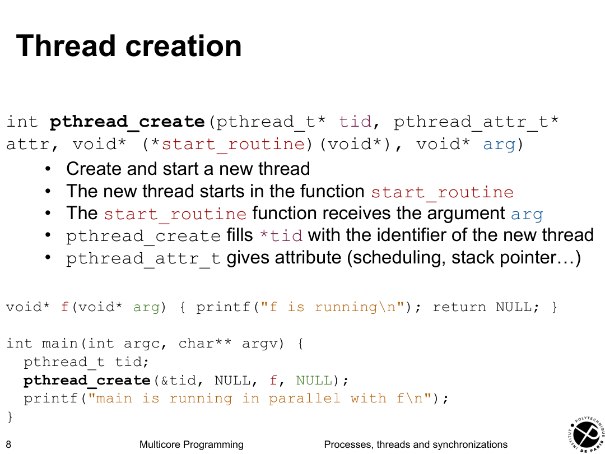

</details>

<a id="page-9"></a>

## 第 9 页 · Thread termination

- After an explicit call to pthread_exit(void* retval)

- At the end of the start_rountine

- The system also terminates all the threads of a process when:

- The main function returns
- One of the threads of the process calls exit

> 校对：原文start_rountine拼写；退出进程与线程区别。

<details>
<summary>查看第 9 页原图（图形、代码布局与标注）</summary>

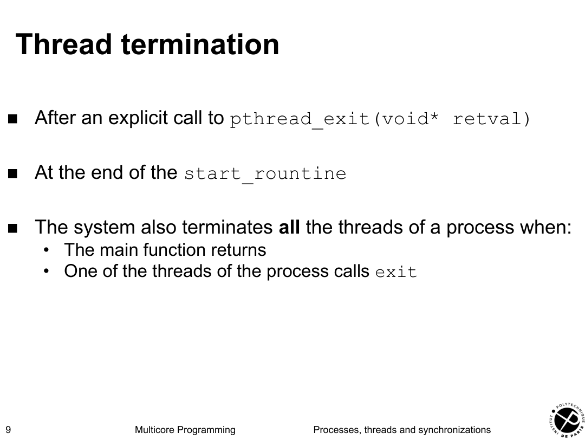

</details>

<a id="page-10"></a>

## 第 10 页 · Waiting the termination of a thread

```text
int pthread_join(pthread_t thread, void** 
pretval);
```

```text
void* f(void* arg) { 
  printf("f is running\n"); 
  return (void*)0x42; 
}
```

```text
int main(int argc, char** argv) {
  pthread_t tid;
  void* retval;
  pthread_create(&tid, NULL, f, NULL);
  printf("main is running in parallel with f\n");
  pthread_join(tid, &retval);
  printf("f terminated with retval %p\n", retval);
}
```

> 校对：0x42是教学返回指针值不可直接解引用。

<details>
<summary>查看第 10 页原图（图形、代码布局与标注）</summary>

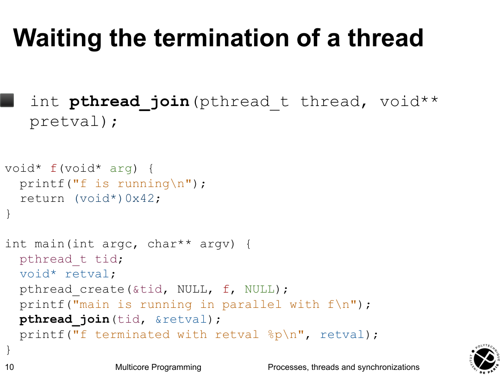

</details>

<a id="page-11"></a>

## 第 11 页 · Detached mode

- By default, a thread is in the joinable mode

- When the thread dies, the system keeps its return value, which consumes system resources
- Another thread can use pthread_join to retrieve this value

- In detached mode

- The system immediately frees all the system resources used by a thread when it exits
- It is impossible to retrieve its return value

- You can change the mode of a thread to detached

- Through a call to pthread_detach(pthread_t tid)
- By using the pthread_attr_t in pthread_create

> 校对：create/exit/join/detach；示例片段不作生产代码。

<details>
<summary>查看第 11 页原图（图形、代码布局与标注）</summary>

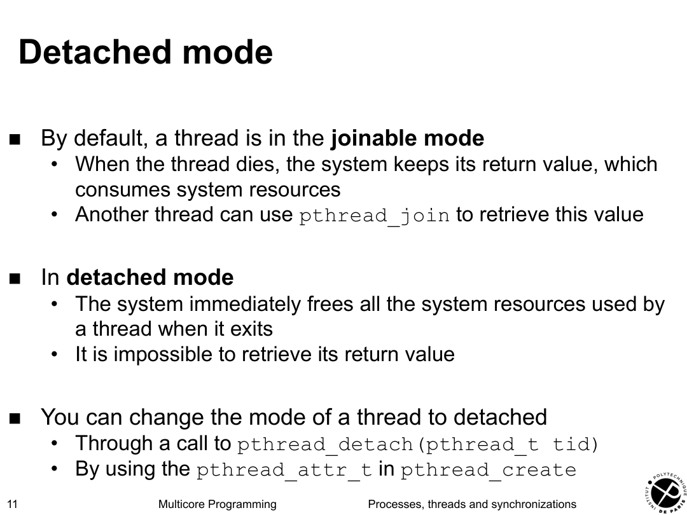

</details>

<a id="page-12"></a>

## 第 12 页 · Shared variables and inconsistencies

- The threads of a process share the same memory

- When a thread modifies a variable, the other threads see the modification
- Concurrent accesses may lead to inconsistencies

```text
int balance = 1000;
```

图内标签：`Thread 1`

图内标签：`Thread 2`

```text
a. void credit() { 
b.   int tmp = balance; 
c.   tmp = tmp + 100;
d.   balance = tmp;
e. }
```

```text
f. void debit() { 
g.   int tmp = balance;
h.   tmp = tmp - 1;
i.   balance = tmp;
j. }
```

- Possible schedule: fg abcde hij => the credit of 100 is lost!

> 校对：交错例子不穷尽C数据竞争行为。

<details>
<summary>查看第 12 页原图（图形、代码布局与标注）</summary>

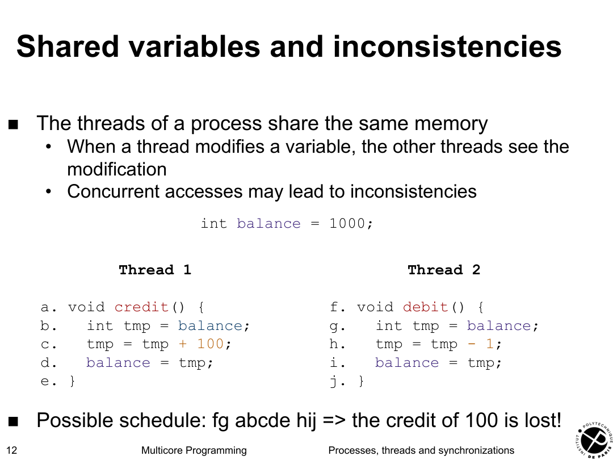

</details>

<a id="page-13"></a>

## 第 13 页 · Principle to avoid inconsistencies

- Prevent two sections of code that access the same shared

variables to execute at the same time

- We say that the sequences of instructions are in mutual exclusions

- Definition: a critical section is a section of code in mutual

exclusion

- Critical sections execute entirely one after the other
- We say that a critical section executes atomically

- A critical section is often in mutual exclusion with itself

> 校对：完整读改写由同一把锁保护。

<details>
<summary>查看第 13 页原图（图形、代码布局与标注）</summary>

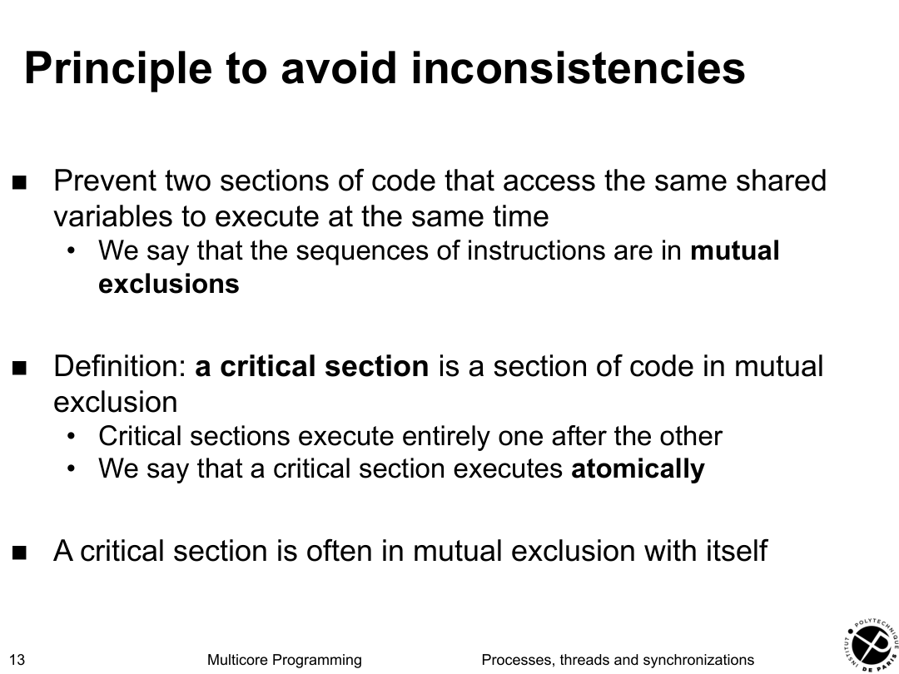

</details>

<a id="page-14"></a>

## 第 14 页 · Implementation of mutual exclusion

- Mutex: a lock in mutual exclusion

- Two possible states: busy or free
- At each time, only one thread can own (have marked as busy) the mutex

- A mutex provides two operations

- Lock acquisition: waits if the lock is busy and then changes its state from free to busy
- Lock release: marks the lock as free

- The two operations seem to execute atomically

> 校对：完整读改写由同一把锁保护。

<details>
<summary>查看第 14 页原图（图形、代码布局与标注）</summary>

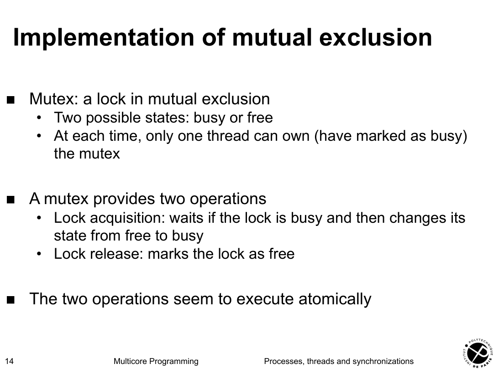

</details>

<a id="page-15"></a>

## 第 15 页 · Implementation of mutual exclusion

- Implementation:

- pthread_mutex_lock: acquire a mutex
- pthread_mutex_unlock: release a mutex

```text
int balance = 1000;
pthread_mutex_t m = PTHREAD_MUTEX_INITIALIZER;
```

图内标签：`Thread 1`

图内标签：`Thread 2`

```text
void credit() {
  pthread_mutex_lock(&m);
  int tmp = balance; 
  tmp = tmp + 100;
  balance = tmp;
  pthread_mutex_unlock(&m);
}
```

```text
void debit() {
  pthread_mutex_lock(&m);
  int tmp = balance; 
  tmp = tmp - 1;
  balance = tmp;
  pthread_mutex_unlock(&m);
}
```

> 校对：完整读改写由同一把锁保护。

<details>
<summary>查看第 15 页原图（图形、代码布局与标注）</summary>

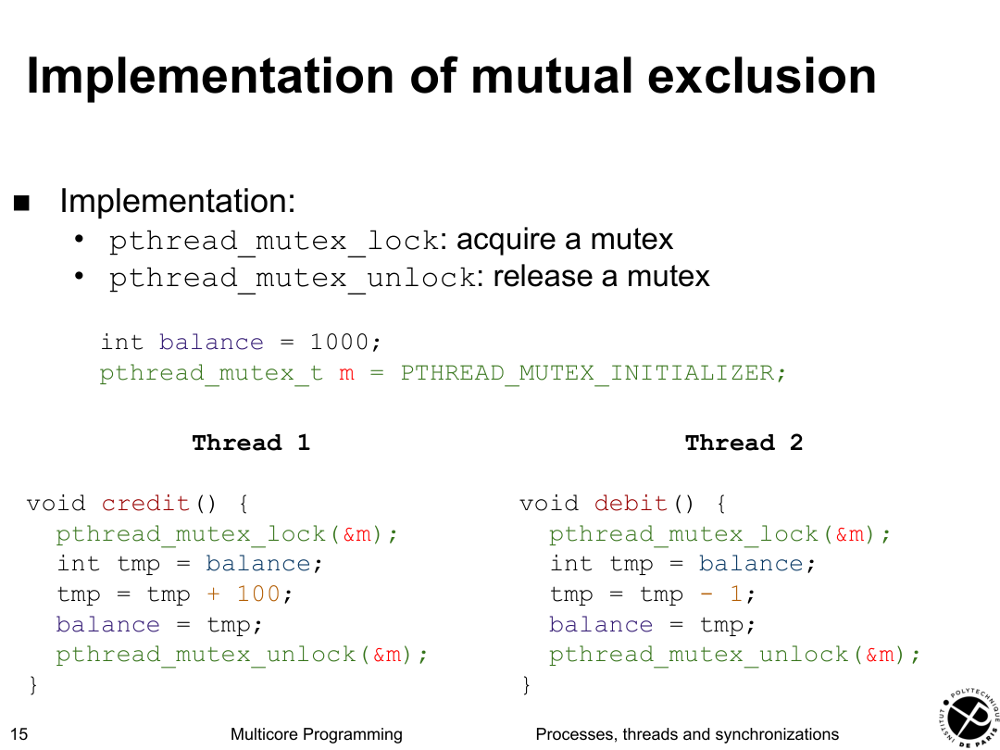

</details>

<a id="page-16"></a>

## 第 16 页 · Monitor

- Allows a thread to wait for a certain condition to become true

- Built with a mutex and a variable condition

```text
char* msg = NULL; 
pthread_mutex_t m = PTHREAD_MUTEX_INITIALIZER;
pthread_cond_t c = PTHREAD_COND_INITIALIZER;
```

图内标签：`Thread 1`

图内标签：`Thread 2`

```text
void send() {
  pthread_mutex_lock(&m);
  msg = "Hello!"; 
  pthread_cond_signal(&c);
  pthread_mutex_unlock(&m);
}
```

```text
void recv() {
  pthread_mutex_lock(&m);
  while(msg == NULL)
    pthread_cond_wait(&c, &m);
  printf("Message: %s\n", msg);
  pthread_mutex_unlock(&m);
}
```

> 校对：signal不储存事件，while谓词必须保留。

<details>
<summary>查看第 16 页原图（图形、代码布局与标注）</summary>

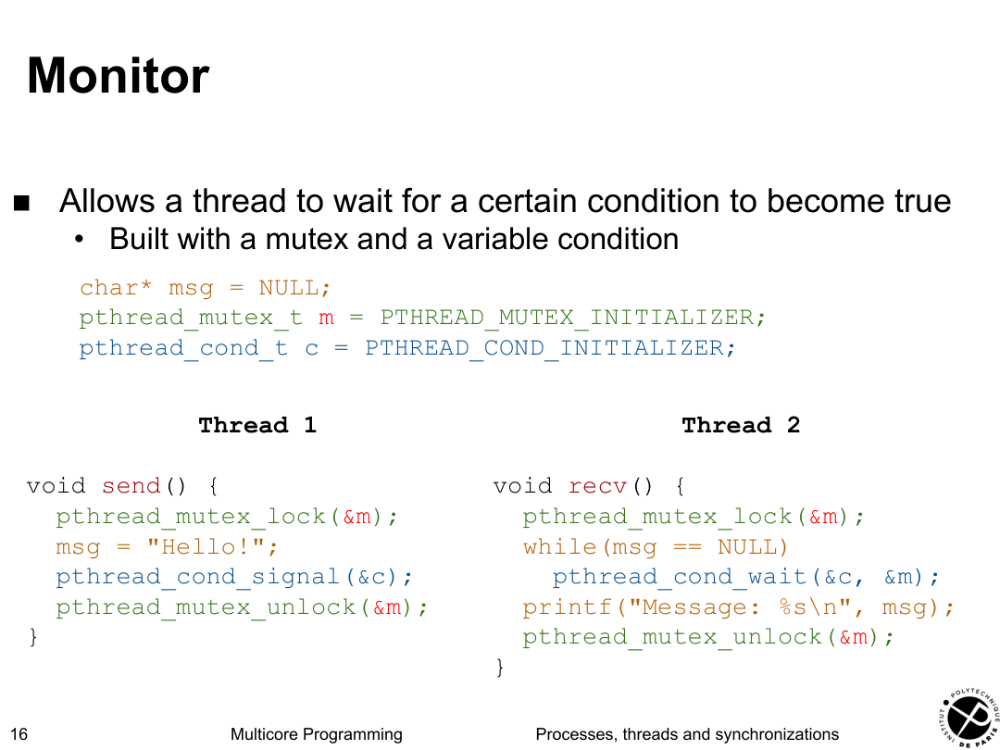

</details>

<a id="page-17"></a>

## 第 17 页 · Monitor

- Allow a thread to wait for a certain condition to become true

- Built with a mutex and a variable condition

- Interface

- Release mutex, sleep on cond, and re-acquire mutex pthread_cond_wait(&cond, &mutex)

- Wake up one thread that sleeps on cond pthread_cond_signal(&cond):

- Wake up all the threads that sleep on cond pthread_cond_broadcast(&cond):

> 校对：谓词循环与原子释放/等待；重取锁。

<details>
<summary>查看第 17 页原图（图形、代码布局与标注）</summary>

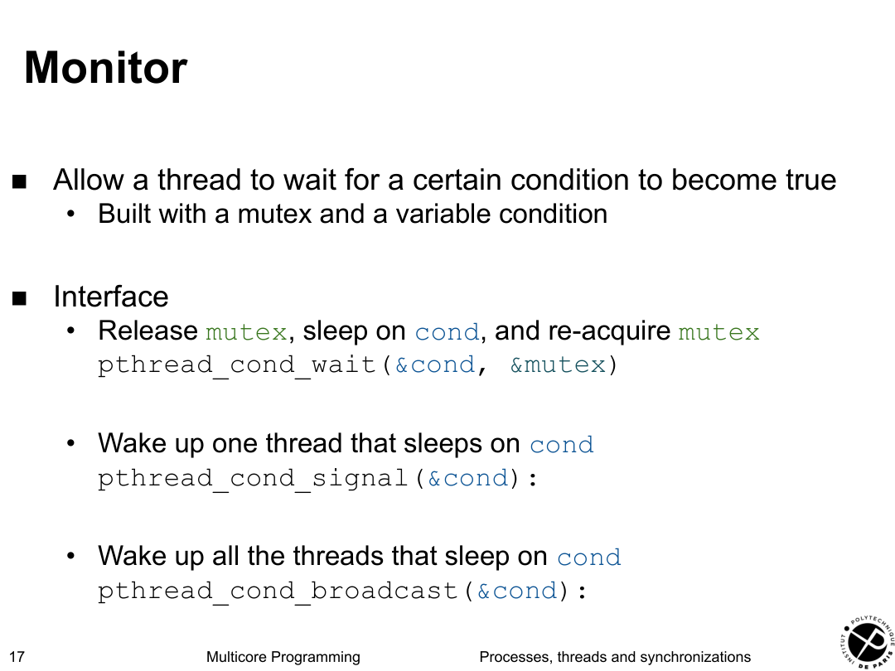

</details>

<a id="page-18"></a>

## 第 18 页 · To take away

- Thread life cycle

- pthread_create: create a thread
- pthread_self: return the thread identifier
- pthread_exit: quit a thread
- pthread_join: wait for the termination of a thread

- Synchronization

- pthread_mutex_lock: take a lock
- pthread_mutex_unlock: release a lock
- pthread_cond_wait: wait on a condition variable
- pthread_cond_signal: wake up a thread that waits on a condition variable
- pthread_cond_broadcast: wake up all the threads that wait on a condition variable

> 校对：生命周期和同步接口分组。

<details>
<summary>查看第 18 页原图（图形、代码布局与标注）</summary>

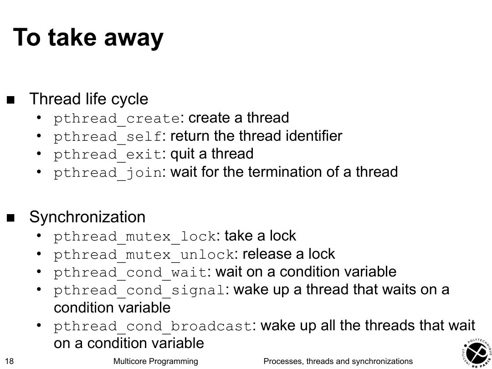

</details>

## 原 OCR 图片保留索引

以下按原始 OCR 引用顺序保留，方便核对裁切范围；准确页码以逐页原图为准。

- [提取图 001](Images/01-threads/image_001.jpg)
- [提取图 002](Images/01-threads/image_002.jpg)
- [提取图 003](Images/01-threads/image_003.jpg)
- [提取图 004](Images/01-threads/image_004.jpg)
- [提取图 005](Images/01-threads/image_005.jpg)
