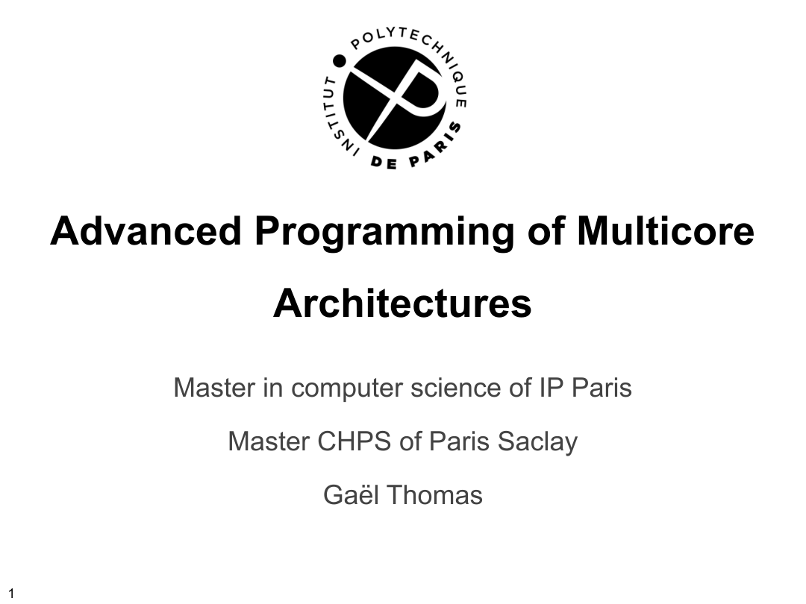
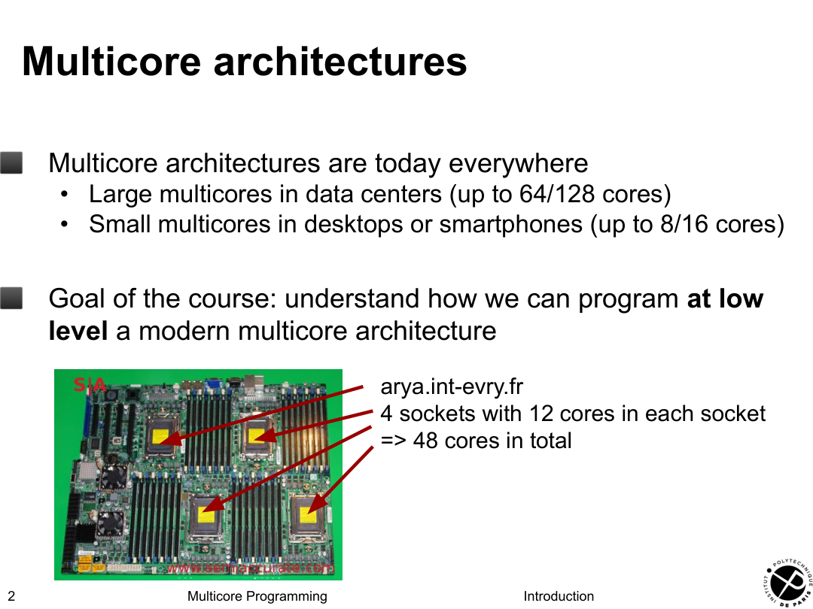
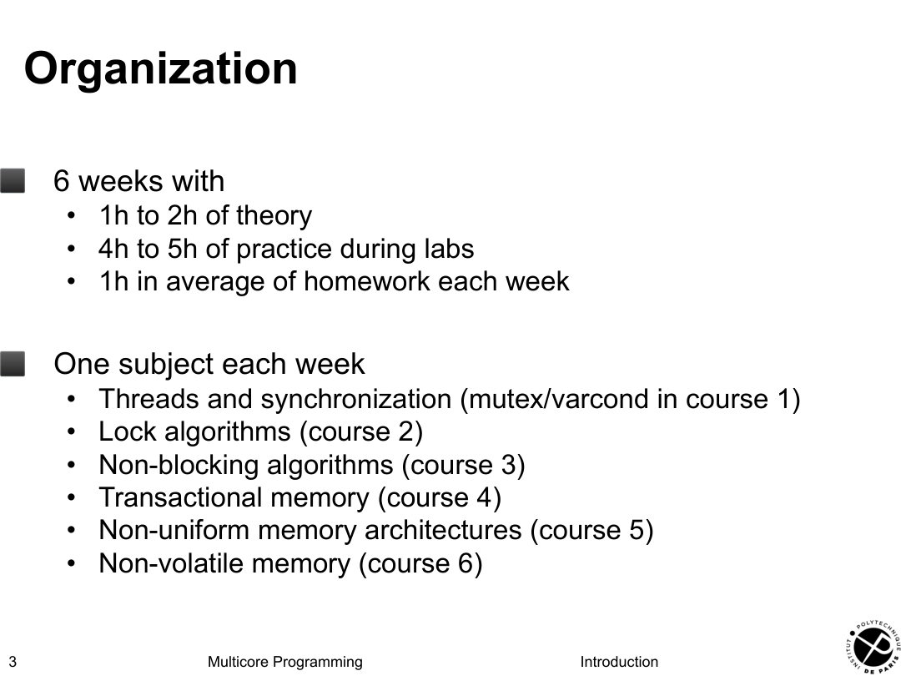
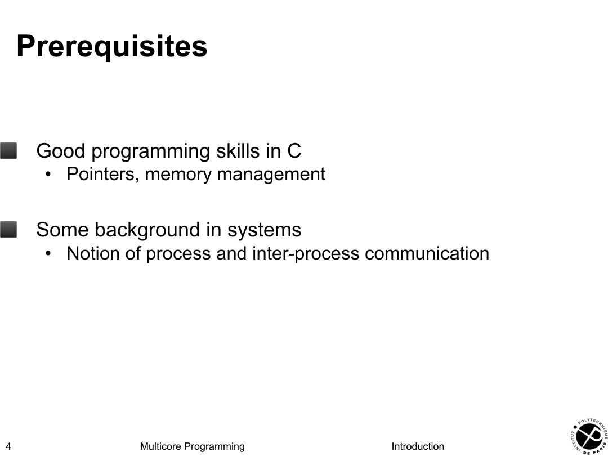

# 01-welcome · 原文校对稿

[原始 PDF](01-welcome.pdf) · [中文详解](01-welcome_zh.md) · [课程目录](README.md)

> 以 PDF 内嵌文字层重建，按原页和文字块分离正文、代码与图注，修复 MinerU 的混栏、页脚入代码及语言标签问题。保留原课件的用词和代码疑点，不将其悄悄改写为正确程序。代码块有时是逐步展示中的片段；图形、数学排版、颜色和箭头以各页展开后的原图为准。

[重要勘误](ERRATA.md)

## 第 1 页 · Page 1

Advanced Programming of Multicore

Architectures

Master in computer science of IP Paris

Master CHPS of Paris Saclay

Gaël Thomas

> 校对：封面与作者信息。

查看第 1 页原图（图形、代码布局与标注）

## 第 2 页 · Multicore architectures

- 

Multicore architectures are today everywhere

- Large multicores in data centers (up to 64/128 cores)
- Small multicores in desktops or smartphones (up to 8/16 cores)

- 

Goal of the course: understand how we can program at low level a modern multicore architecture

arya.int-evry.fr 4 sockets with 12 cores in each socket => 48 cores in total

> 校对：4×12=48 核；历史配置不作当前规格。

查看第 2 页原图（图形、代码布局与标注）

## 第 3 页 · Organization

- 

6 weeks with

- 1h to 2h of theory
- 4h to 5h of practice during labs
- 1h in average of homework each week

- 

One subject each week

- Threads and synchronization (mutex/varcond in course 1)
- Lock algorithms (course 2)
- Non-blocking algorithms (course 3)
- Transactional memory (course 4)
- Non-uniform memory architectures (course 5)
- Non-volatile memory (course 6)

> 校对：六周安排与六个主题。

查看第 3 页原图（图形、代码布局与标注）

## 第 4 页 · Prerequisites

- 

Good programming skills in C

- Pointers, memory management

- 

Some background in systems

- Notion of process and inter-process communication

> 校对：C 指针、内存管理与系统基础。

查看第 4 页原图（图形、代码布局与标注）

## 原 OCR 图片保留索引

以下按原始 OCR 引用顺序保留，方便核对裁切范围；准确页码以逐页原图为准。

- [提取图 001](Images/01-welcome/image_001.jpg)
