# 02-locks · 原文校对稿

[原始 PDF](02-locks.pdf) · [中文详解](02-locks_zh.md) · [课程目录](README.md)

对应实验：锁算法（[中文版](../Labs/tp-locks/tp-locks_zh.html) · [英文原版](../Labs/tp-locks/tp-locks.html)）

> 以 PDF 内嵌文字层重建，按原页和文字块分离正文、代码与图注，修复 MinerU 的混栏、页脚入代码及语言标签问题。保留原课件的用词和代码疑点，不将其悄悄改写为正确程序。代码块有时是逐步展示中的片段；图形、数学排版、颜色和箭头以各页展开后的原图为准。

[重要勘误](ERRATA.md)

<a id="page-1"></a>

## 第 1 页 · Page 1

Lock implementations

Master in computer science of IP Paris

Master CHPS of Paris Saclay

Gaël Thomas

> 校对：代码示意与实现区分；p2原课件条件错误。

<details>
<summary>查看第 1 页原图（图形、代码布局与标注）</summary>

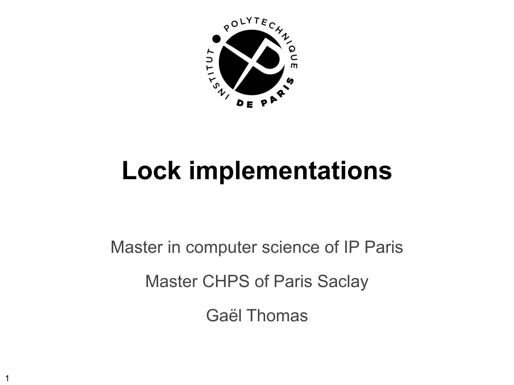

</details>

<a id="page-2"></a>

## 第 2 页 · Atomic operation (informal definition)

- At high-level, an atomic operation is an operation that seems

to execute instantaneously

- pthread_mutex_lock is a typical atomic operation that

executes something like:

```text
enum { FREE, BUSY };
typedef struct { int state; } pthread_mutex_t;
#define PTHREAD_MUTEX_INITIALIZER = { FREE };
```

Another thread cannot

```text
void pthread_mutex_lock(pthread_mutex_t* mutex) {
  while(mutex->state == FREE) { }
    
  mutex->state = BUSY;
}
```

take the lock here

because pthread_mutex_lock

executes atomically

> 校对：原文FREE等待条件反向；宏含=和分号；旁注曾混入OCR代码。

<details>
<summary>查看第 2 页原图（图形、代码布局与标注）</summary>

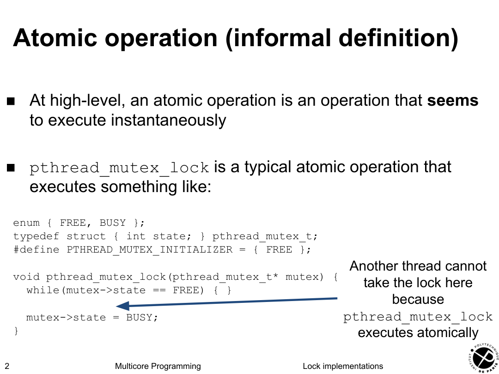

</details>

<a id="page-3"></a>

## 第 3 页 · How can we build atomic operation?

Problem: we cannot implement pthread_mutex_lock with pthread_mutex_lock since we are implementing pthread_mutex_lock!

> 校对：代码示意与实现区分；p2原课件条件错误。

<details>
<summary>查看第 3 页原图（图形、代码布局与标注）</summary>

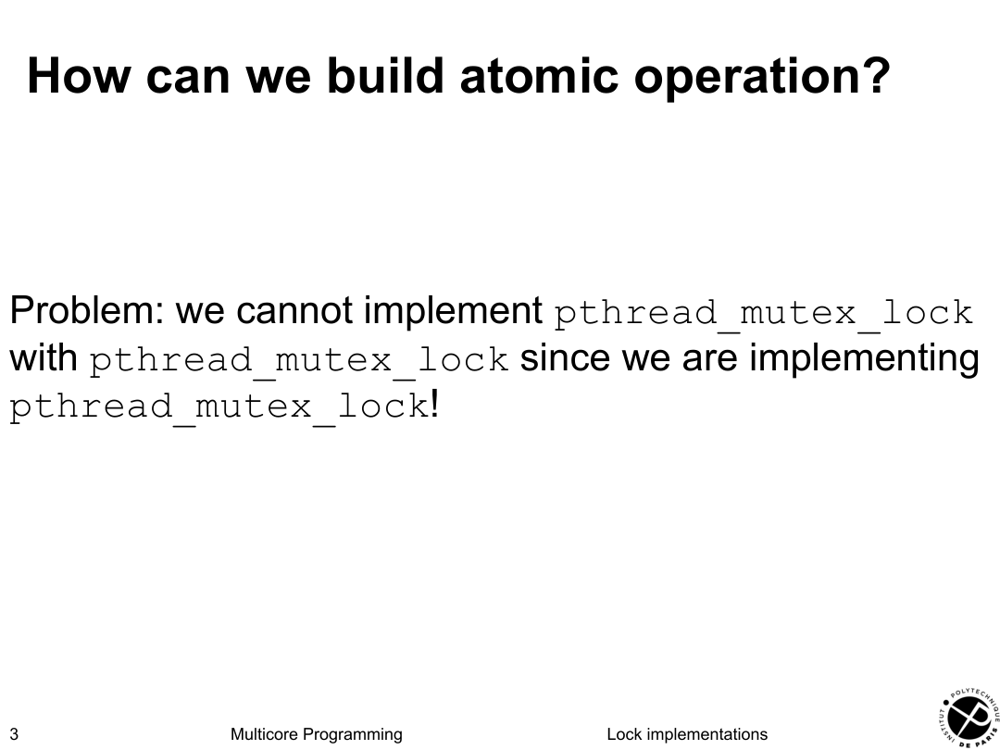

</details>

<a id="page-4"></a>

## 第 4 页 · Menu

1. The Bakery algorithm

a. A first model of machine b. The algorithm

2. Background

3. Lock algorithms

> 校对：代码示意与实现区分；p2原课件条件错误。

<details>
<summary>查看第 4 页原图（图形、代码布局与标注）</summary>

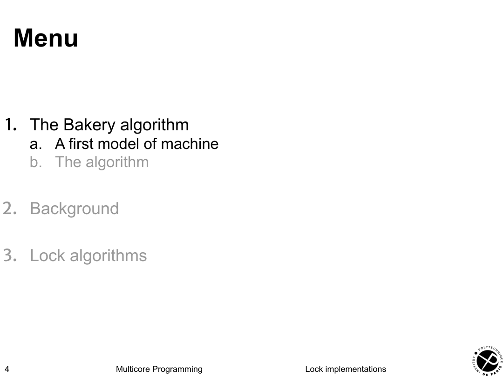

</details>

<a id="page-5"></a>

## 第 5 页 · How can we build atomic operation?

- Before everything, we need a model of machine

- At this step, we consider a simple machine model that:

- Atomically reads and writes a machine word (32bits and 64bits)

```text
int x = 0;
```

图内标签：`Thread 1`

图内标签：`Thread 2`

```text
x = 0x101;
```

```text
tmp = x;
```

Here: tmp = 0 or 0x101 (not 0x100 nor 0x001)

> 校对：原子字访问与排序假设；覆盖页按原图处理。

<details>
<summary>查看第 5 页原图（图形、代码布局与标注）</summary>

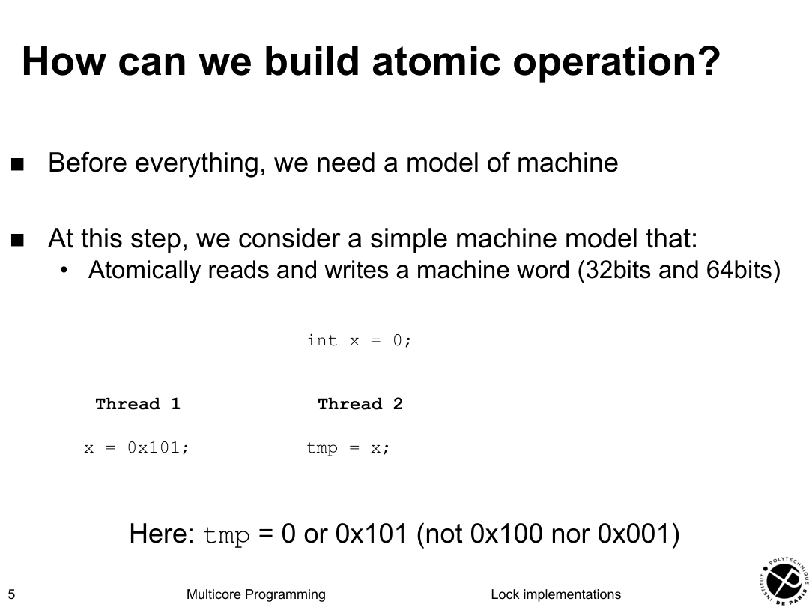

</details>

<a id="page-6"></a>

## 第 6 页 · How can we build atomic operation?

- Before everything, we need a model of machine

- At this step, we consider a simple machine model that:

- Atomically reads and writes a machine word (32bits and 64bits)

```text
int x = 0;
```

Be careful!

In general, this hypothesis does not hold!

图内标签：`Thread 1`

图内标签：`Thread 2`

```text
x = 0x101;
```

(it’s true with a pentium, but not with all the

```text
tmp = x;
```

possible existing or future processors)

Here: tmp = 0 or 0x101 (not 0x1n00 or 0x001)

> 校对：原子字访问与排序假设；覆盖页按原图处理。

<details>
<summary>查看第 6 页原图（图形、代码布局与标注）</summary>

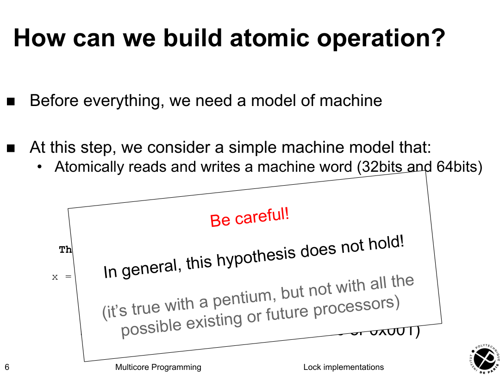

</details>

<a id="page-7"></a>

## 第 7 页 · How can we build atomic operation?

- Before everything, we need a model of machine

- At this step, we consider a simple abstract machine that:

- Atomically reads and writes a machine word (32bits and 64bits)
- Does not reorder the instructions

```text
int x = 0;
int y = 0;
```

图内标签：`Thread 1`

图内标签：`Thread 2`

```text
x = 0x101;
y = 0x202;
```

```text
t2 = y;
t1 = x;
```

Here, t2 = 0x202 => t1 = 0x101

> 校对：原子字访问与排序假设；覆盖页按原图处理。

<details>
<summary>查看第 7 页原图（图形、代码布局与标注）</summary>

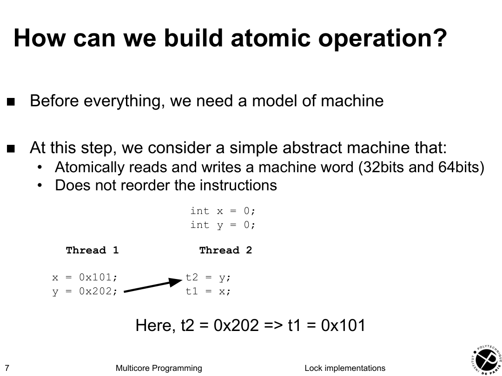

</details>

<a id="page-8"></a>

## 第 8 页 · How can we build atomic operation?

- Before everything, we need a model of machine

- At this step, we consider a simple abstract machine that:

- Atomically reads and writes a machine word (32bits and 64bits)
- Does not reorder the instructions

```text
int x = 0;
int y = 0;
```

Be careful!

In general, this hypothesis does not hold!

图内标签：`Thread 1`

图内标签：`Thread 2`

```text
x = 0x101;
y = 0x202;
```

```text
t2 = y;
t1 = x;
```

(for two writes, it’s true with a pentium, but not

for a read that succeeds a write!)

Here, t1 = 0x101 => t2 = 0x202

> 校对：遮挡页的底层条件与p7不一致，采用p7清晰模型。

<details>
<summary>查看第 8 页原图（图形、代码布局与标注）</summary>

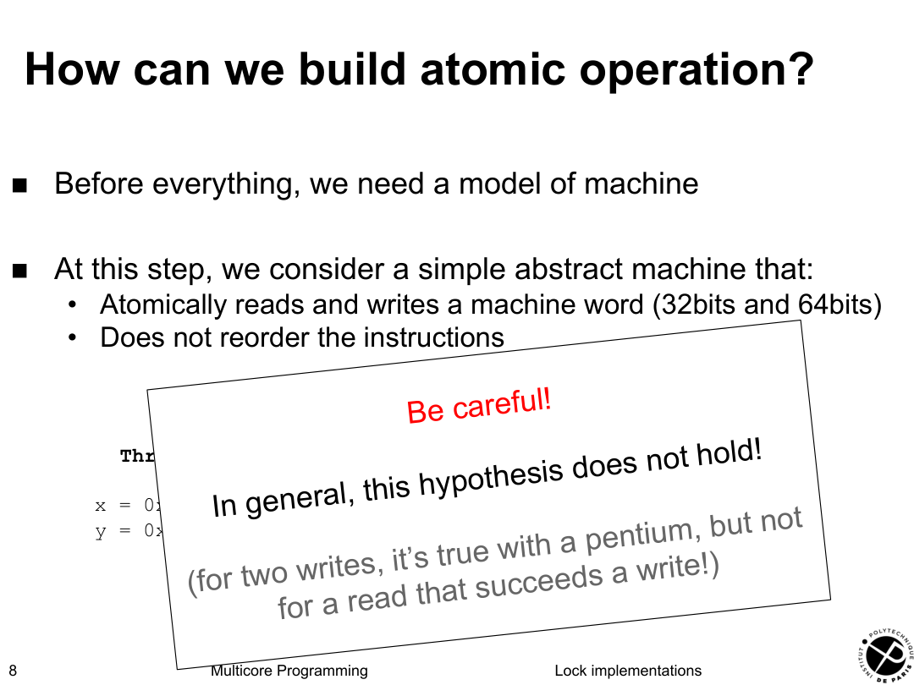

</details>

<a id="page-9"></a>

## 第 9 页 · Menu

1. The Bakery algorithm

a. A first model of machine b. The algorithm

2. Background

3. Lock algorithms

> 校对：二元组顺序、entering窗口与O(N)扫描。

<details>
<summary>查看第 9 页原图（图形、代码布局与标注）</summary>

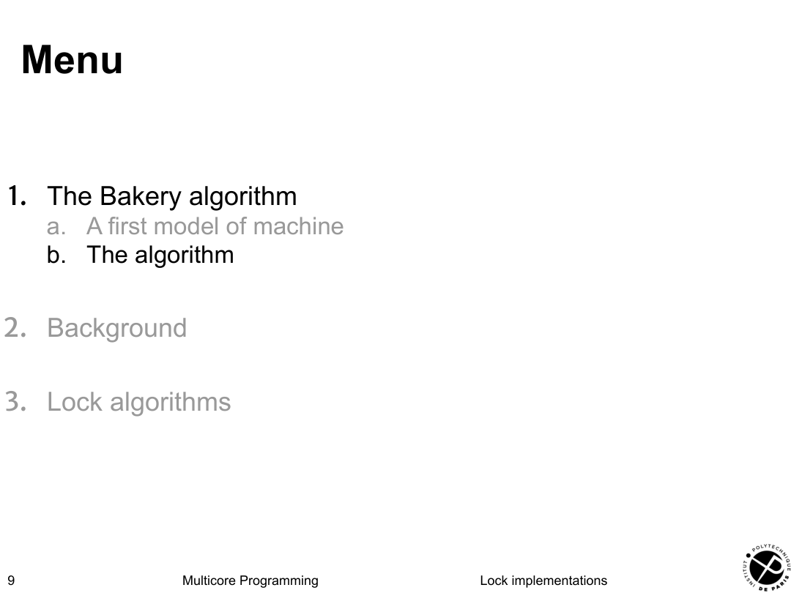

</details>

<a id="page-10"></a>

## 第 10 页 · The bakery algorithm (Lamport 1974)

- Principle

- Simulates a bakery where people are waiting to order
- Each waiter has a number
- A waiter can order if all the waiters with lowest number are already served

- Problem: how can we choose a number?

- Idea: ask to the other waiters and choose the highest one + 1
- New problem: if two waiters asks at the same time, they will have the same number
- In this case, since we are polite, the oldest is served first (we suppose that birth dates are unique)

> 校对：二元组顺序、entering窗口与O(N)扫描。

<details>
<summary>查看第 10 页原图（图形、代码布局与标注）</summary>

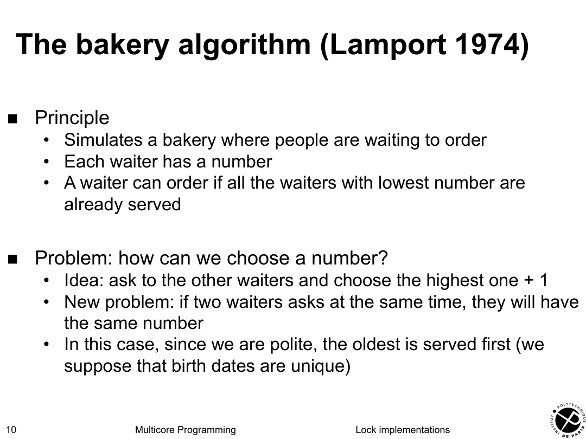

</details>

<a id="page-11"></a>

## 第 11 页 · The bakery algorithm (Lamport 1974)

- We suppose our simple machine model

```text
int entering[N]; /* initialized to false */
int num[N];      /* initialized to 0 */
```

```text
void lock(int self) { /* thread number self calls lock */
  entering[self] = true;
  num[self] = 1 + max(num[0], …, num[N-1]);
  entering[self] = false;
```

```text
restart:
  for(int i=0; i<N; i++) {
    if(entering[i]) { } /* wait until i receives its number */
    if(num[i] && num[i] < num[self]) goto restart;
    if(num[i] && num[i] == num[self] && i < self) goto restart;
  }
}
```

```text
void unlock(int self) { num[self] = 0; } /* outside */
```

> 校对：原文if(entering[i]){}不等待；应为等待循环。

<details>
<summary>查看第 11 页原图（图形、代码布局与标注）</summary>

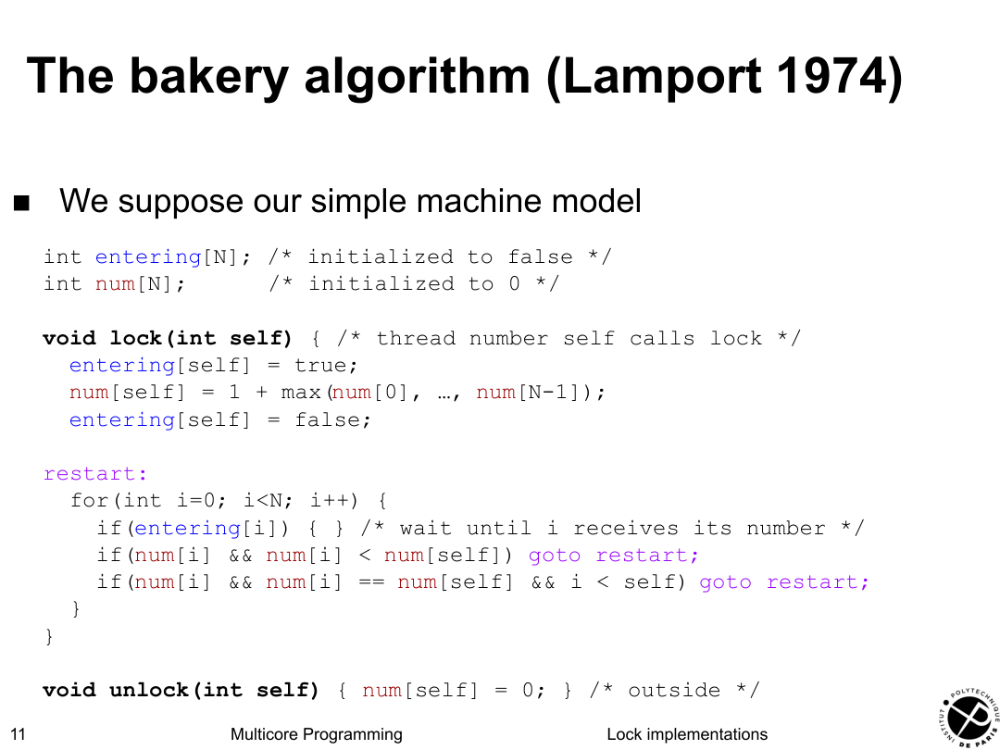

</details>

<a id="page-12"></a>

## 第 12 页 · Why the entering variable

- Suppose that we don’t have entering

- Processes 2 and 3 enter at the same time
- Process 2 computes the max+1, but is preempted before writing it to num
- Process 3 executes and computes the same max+1
- Process 3 enters the critical section, but is preempted before unlock
- Process 2 is elected and enters the critical section since 2 < 3
- => we have two processes in the critical section

- Entering prevents the thread 3 to enters the critical section

because thread 3 sees entering[2] = true

> 校对：二元组顺序、entering窗口与O(N)扫描。

<details>
<summary>查看第 12 页原图（图形、代码布局与标注）</summary>

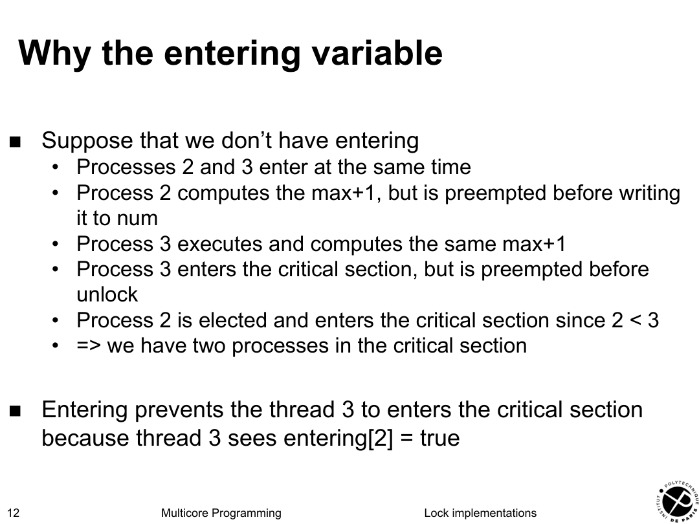

</details>

<a id="page-13"></a>

## 第 13 页 · The bakery algorithm (Lamport 1974)

- Beautiful algorithm

- Only requires write atomicity (and no reordering of the instructions)

- But the algorithm is slow

- Reads at least 4 memory locations per thread

- One to compute max
- Two for entering
- One to check that the thread has the maximum number
- => (better) complexity in O(N) in term of reads where N is the number of threads

> 校对：maximum与算法优先最小二元组不符；计数为示意。

<details>
<summary>查看第 13 页原图（图形、代码布局与标注）</summary>

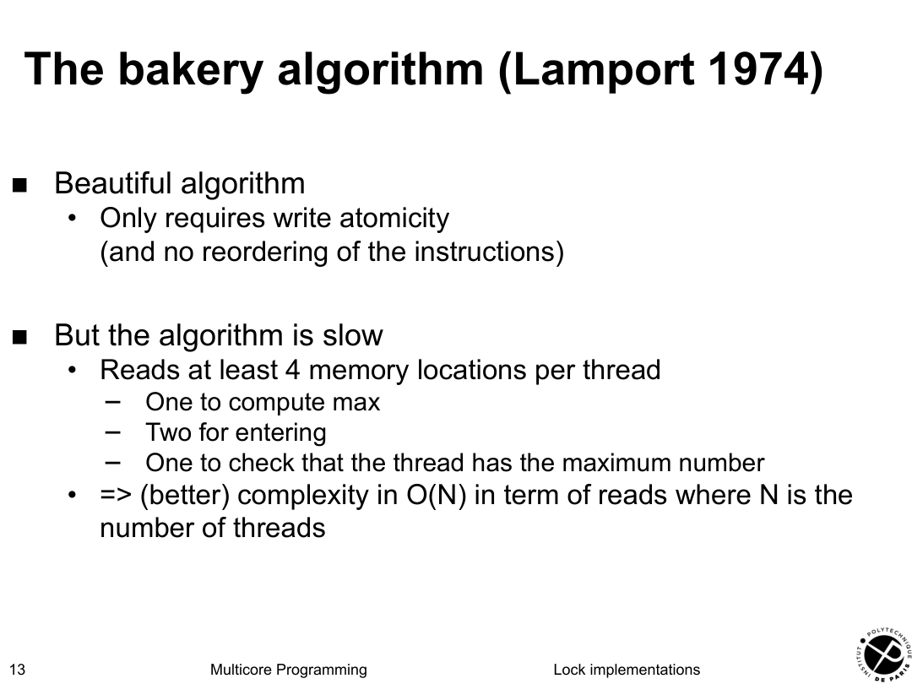

</details>

<a id="page-14"></a>

## 第 14 页 · We need help from the hardware

- We need special instructions to optimize the lock

implementation

- But before, we have to understand how a processor behaves

a. The cache protocol b. Load and store atomicity c. Memory ordering

> 校对：共享/独占是简化模型；缓存行争用。

<details>
<summary>查看第 14 页原图（图形、代码布局与标注）</summary>

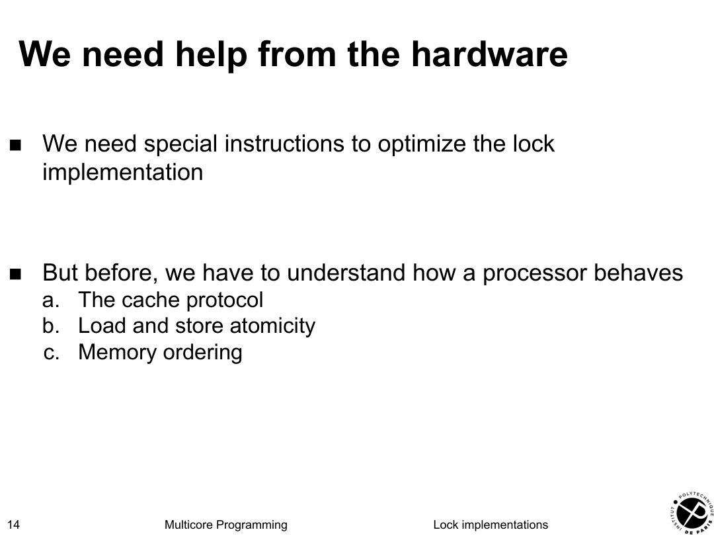

</details>

<a id="page-15"></a>

## 第 15 页 · Menu

1. The Bakery algorithm

2. Background

a. The cache protocol b. Load and store atomicity c. Memory ordering

3. Lock algorithms

> 校对：共享/独占是简化模型；缓存行争用。

<details>
<summary>查看第 15 页原图（图形、代码布局与标注）</summary>

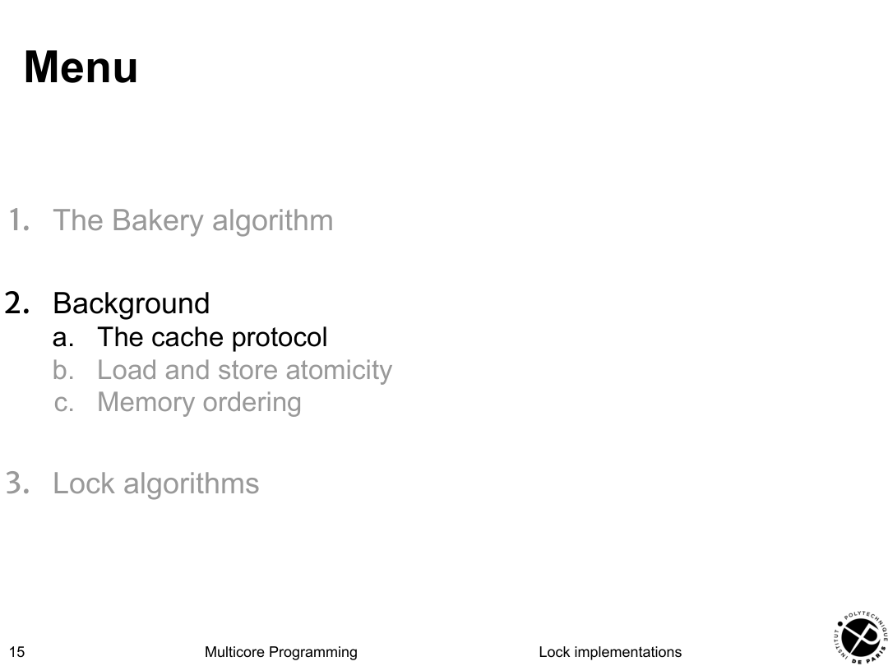

</details>

<a id="page-16"></a>

## 第 16 页 · The cache protocol

- A cache of the processor contains copies of memory location

- Cache lines of 64 bytes for most pentium
- Implements a read-write lock

- One writer or multiple readers
- In case of read, the cache line is in the shared state (multiple readers)
- In case of write, it is in the exclusive state (only one writer)

```text
int tab[2];
Thread 1
```

图内标签：`Thread 2`

```text
tab[0] = 42;
```

```text
tab[1] = 666;
```

Cache line: [42 0] Cache line: [0, 666] If multiple writers at the same time, almost

impossible to not lose one of the writes

> 校对：共享/独占是简化模型；缓存行争用。

<details>
<summary>查看第 16 页原图（图形、代码布局与标注）</summary>

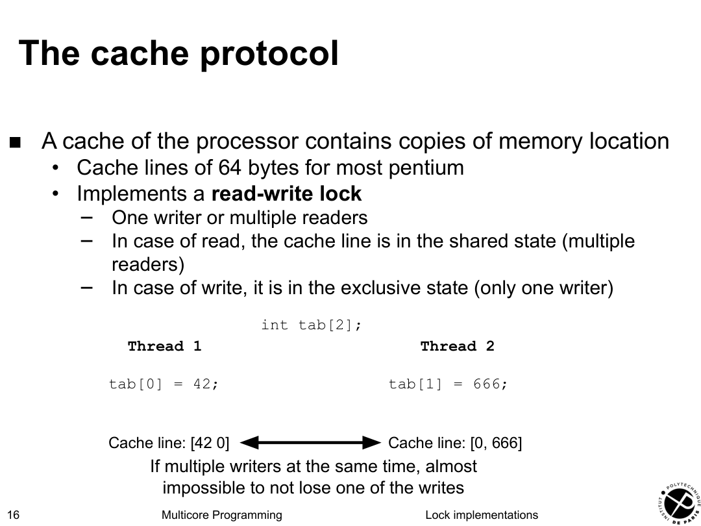

</details>

<a id="page-17"></a>

## 第 17 页 · The cache protocol

- In case of store, the cache protocol acquires a cache line in

exclusive state in order to ensure consistency

- Without exclusion during stores, the processor may lose stores

```text
int tab[2];
Thread 1
```

图内标签：`Thread 2`

```text
tab[0] = 42;
```

```text
tab[1] = 666;
```

Cache line: [42 0] Cache line: [0, 666] If multiple writers at the same time, almost

impossible to not lose one of the stores

> 校对：共享/独占是简化模型；缓存行争用。

<details>
<summary>查看第 17 页原图（图形、代码布局与标注）</summary>

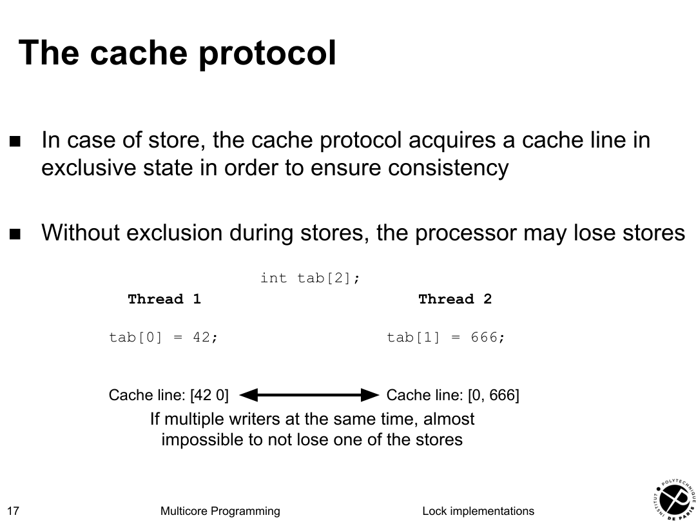

</details>

<a id="page-18"></a>

## 第 18 页 · Implementation of the cache protocol

- In case of load, if the line is not in the cache

- Loads the line from another core or from the main memory
- Ensures that other cores do not hold the line in exclusive state
- Marks the cache line as shared

- In case of store, if the line is not in the cache

- Loads the line from another core or from the main memory
- Invalidates the other copies in the other cores
- Marks the cache line as exclusive

- In case of store, if the line is in the cache but is shared

- Invalidates the other copies in the other cores
- Marks the cache line as exclusive

> 校对：共享/独占是简化模型；缓存行争用。

<details>
<summary>查看第 18 页原图（图形、代码布局与标注）</summary>

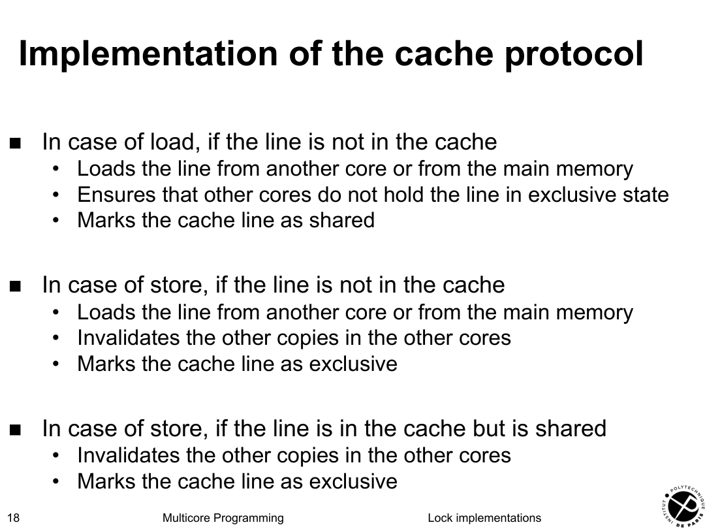

</details>

<a id="page-19"></a>

## 第 19 页 · The cache protocol

- Consequence: if many threads running on different cores write

the same cache line, the memory buses saturates

- Consequence for lock algorithms

- Try to avoid many threads writing the same memory location

> 校对：共享/独占是简化模型；缓存行争用。

<details>
<summary>查看第 19 页原图（图形、代码布局与标注）</summary>

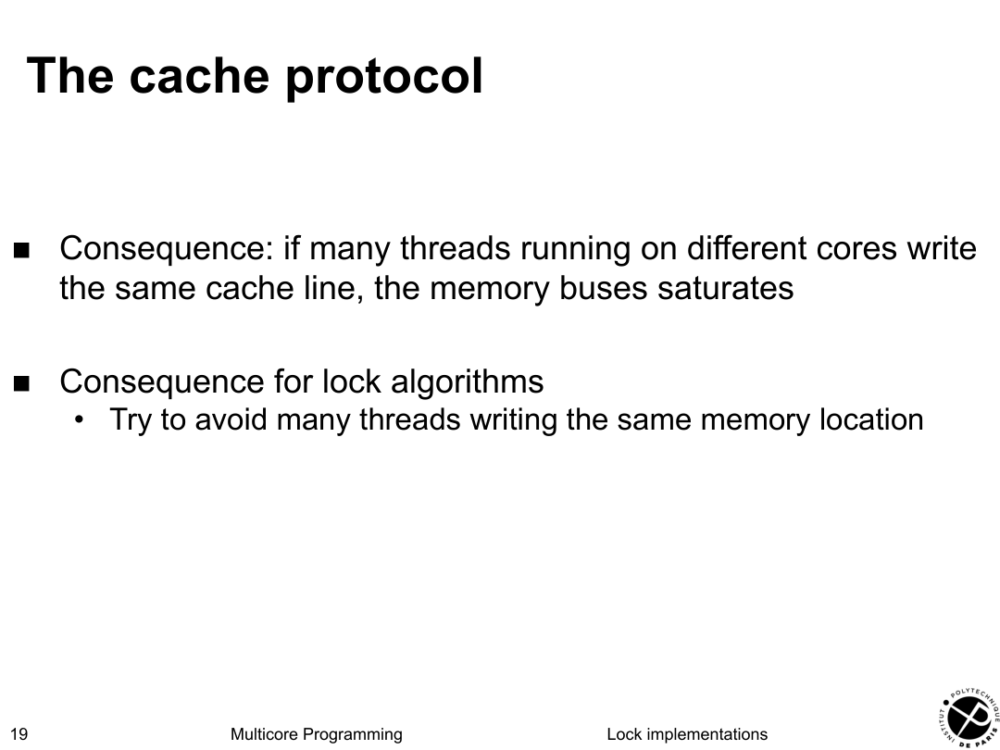

</details>

<a id="page-20"></a>

## 第 20 页 · Menu

1. The Bakery algorithm

2. Background

a. The cache protocol b. Load and store atomicity c. Memory ordering

3. Lock algorithms

> 校对：共享/独占是简化模型；缓存行争用。

<details>
<summary>查看第 20 页原图（图形、代码布局与标注）</summary>

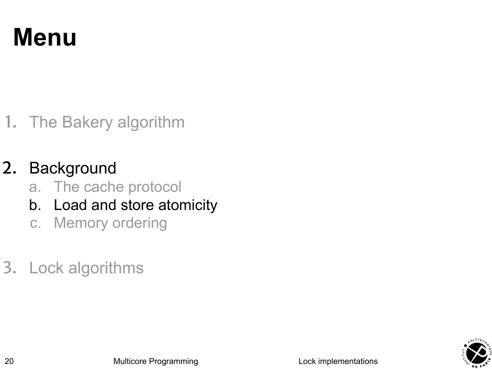

</details>

<a id="page-21"></a>

## 第 21 页 · Load and store atomicity

- A load or a store of a machine word is not necessarily atomic

- It’s the case with a pentium
- But not necessarily with any processor that may appear in the future!

- In order to ensure load and store atomicity in C

- atomic_load(&var): ensures load atomicity
- atomic_store(&var, value) : ensures store atomicity
- In this case, var should be declared as _Atomic, e.g., int _Atomic var;

- Note: these operations have also an effect on ordering

> 校对：TSO不替代语言同步；relaxed仍有对象原子性。

<details>
<summary>查看第 21 页原图（图形、代码布局与标注）</summary>

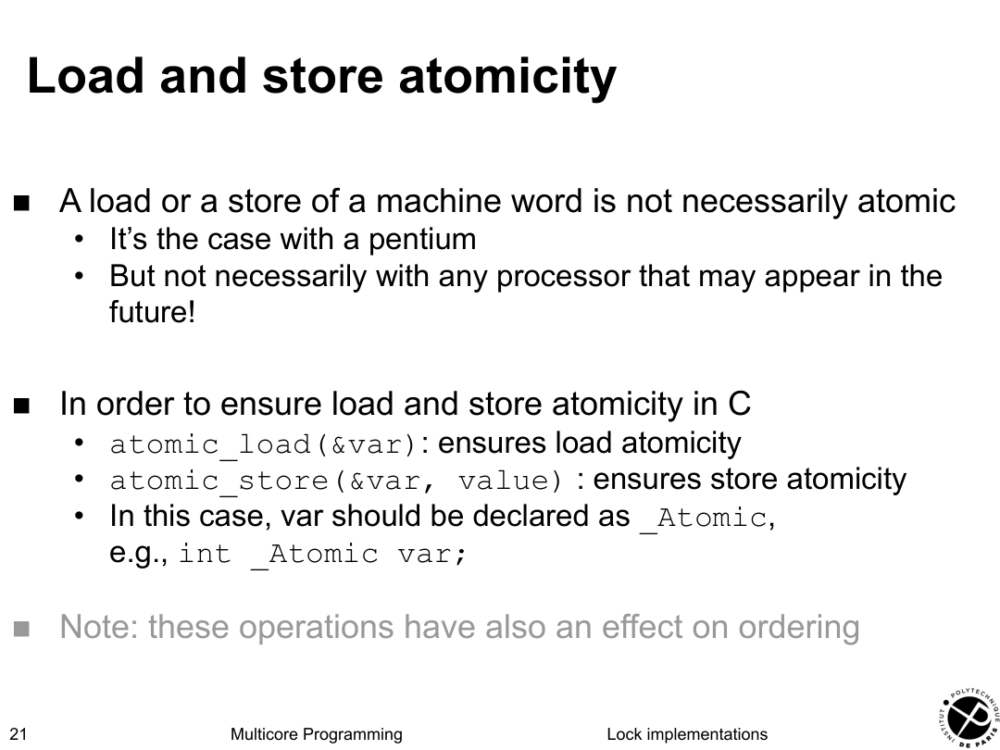

</details>

<a id="page-22"></a>

## 第 22 页 · Menu

1. The Bakery algorithm

2. Background

a. The cache protocol b. Load and store atomicity c. Memory ordering

3. Lock algorithms

> 校对：TSO不替代语言同步；relaxed仍有对象原子性。

<details>
<summary>查看第 22 页原图（图形、代码布局与标注）</summary>

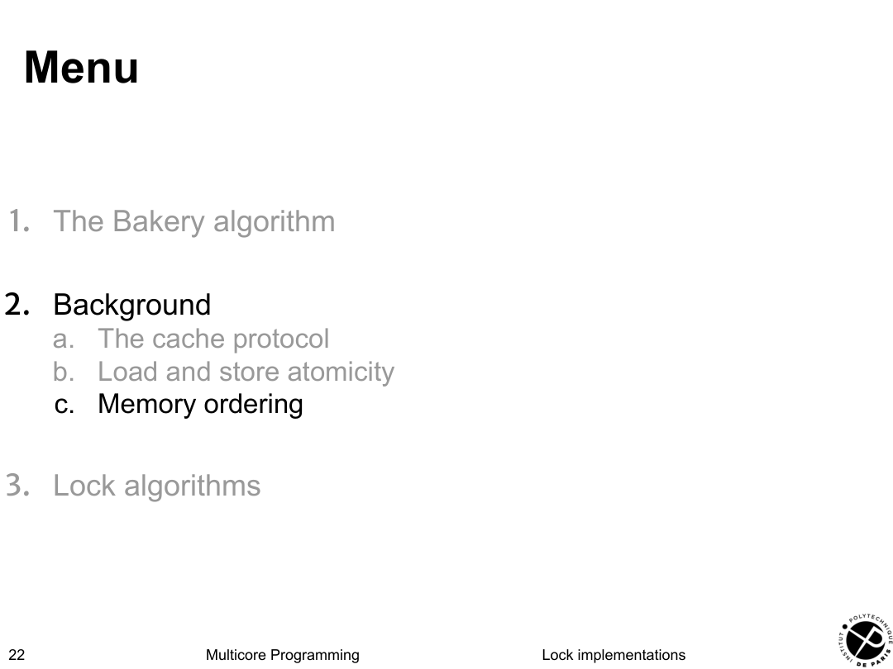

</details>

<a id="page-23"></a>

## 第 23 页 · Memory ordering

- A processor may emit the instructions out-of-order

(as soon as it ensures that a thread reads its own last write)

- A processor may reorder

- Two stores on two different memory locations

- store @a1, v1
- store @a2, v2
- Two loads on two different memory locations

- v1 = load @a1
- v2 = load @a2
- A load after a store on two different memory locations

- store @a1, v1
- v2 = load @a2
- A store after a load on two different memory locations

> 校对：TSO不替代语言同步；relaxed仍有对象原子性。

<details>
<summary>查看第 23 页原图（图形、代码布局与标注）</summary>

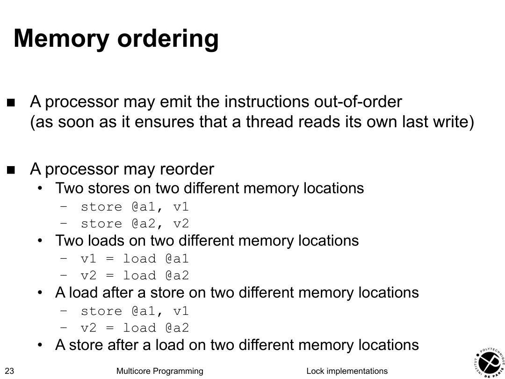

</details>

<a id="page-24"></a>

## 第 24 页 · Each language and each processor has  its own memory ordering model

- Pentium: total store order

- Ensure atomicity for 64-bits loads and stores
- Does not reorder a load after a load
- Does not reorder a store after a store
- Does not reorder a store after a load
- But may reorder a load after a store

```text
int hasMessage = false;
char* message = NULL;
```

图内标签：`Thread 1`

图内标签：`Thread 2`

```text
message = "hello";
hasMessage = true;
```

```text
while(!hasMessage) { }
printf(message);
```

Correct code (store after store in thread 1 and load after load in thread 2)

> 校对：普通C消息示例不能只凭TSO认定正确。

<details>
<summary>查看第 24 页原图（图形、代码布局与标注）</summary>

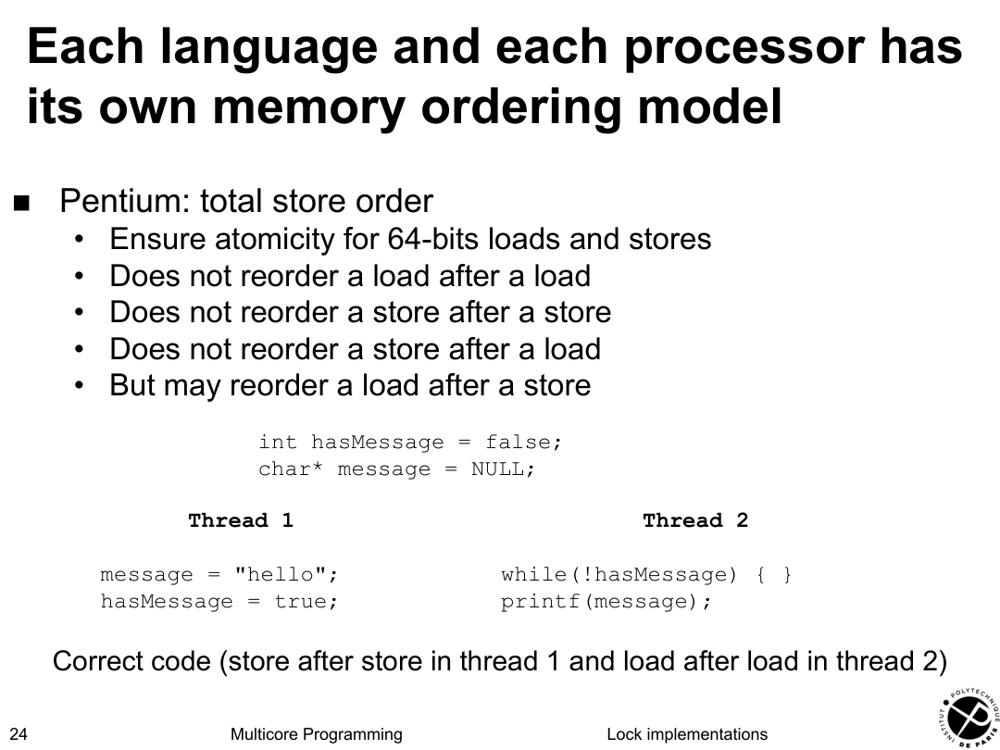

</details>

<a id="page-25"></a>

## 第 25 页 · Each language and each processor has  its own memory ordering model

- Java memory model

- Any ordering is possible (except around volatile accesses and lock/unlock)

- ARM memory model

- Weaker than TSO

```text
int hasMessage = false;
char* message = NULL;
```

图内标签：`Thread 1`

图内标签：`Thread 2`

```text
message = "hello";
hasMessage = true;
```

```text
while(!hasMessage) { }
printf(message);
```

Possible segmentation fault in printf in Java or on a ARM

> 校对：Java/ARM描述过度概括，不作可移植代码证明。

<details>
<summary>查看第 25 页原图（图形、代码布局与标注）</summary>

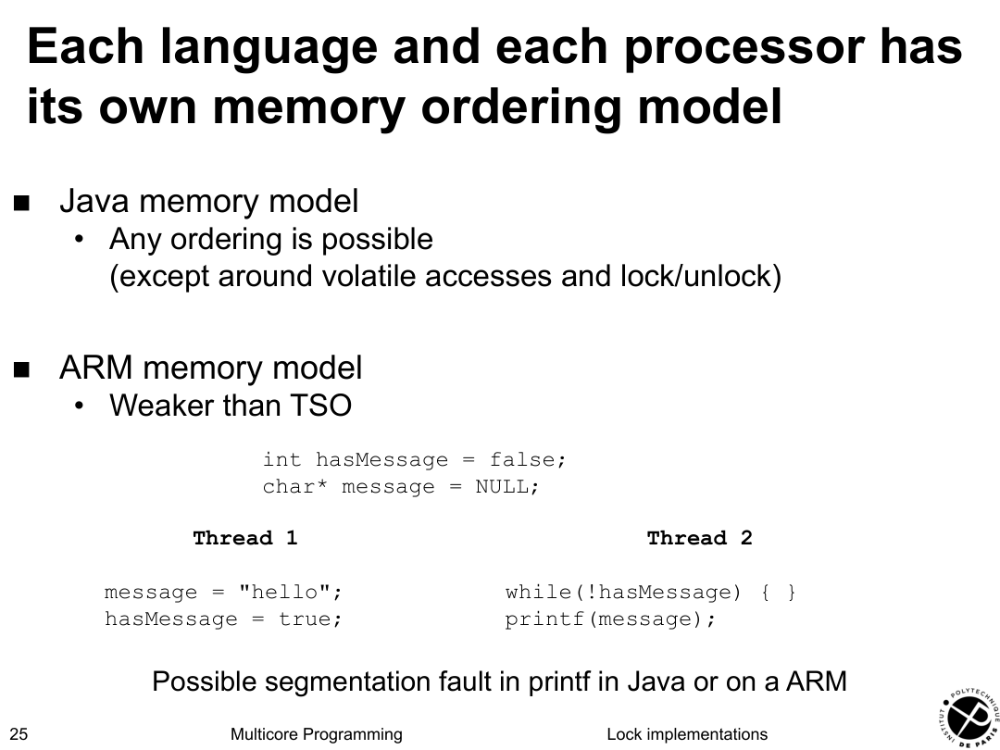

</details>

<a id="page-26"></a>

## 第 26 页 · Preventing reordering with assembly  instructions

- A processor provides special instructions

- For example, with a pentium

- mfence: full memory fence prevents any reordering of loads or stores before or after the instruction

- lfence: load fence prevents the reordering of the loads before or after the instruction (useful with special instructions that have a load semantic, e.g., rdtsc)
- sfence: store fence prevents the reordering of the stores before or after the instruction (useful with special instructions that have a store semantic, e.g., clwb)

> 校对：TSO不替代语言同步；relaxed仍有对象原子性。

<details>
<summary>查看第 26 页原图（图形、代码布局与标注）</summary>

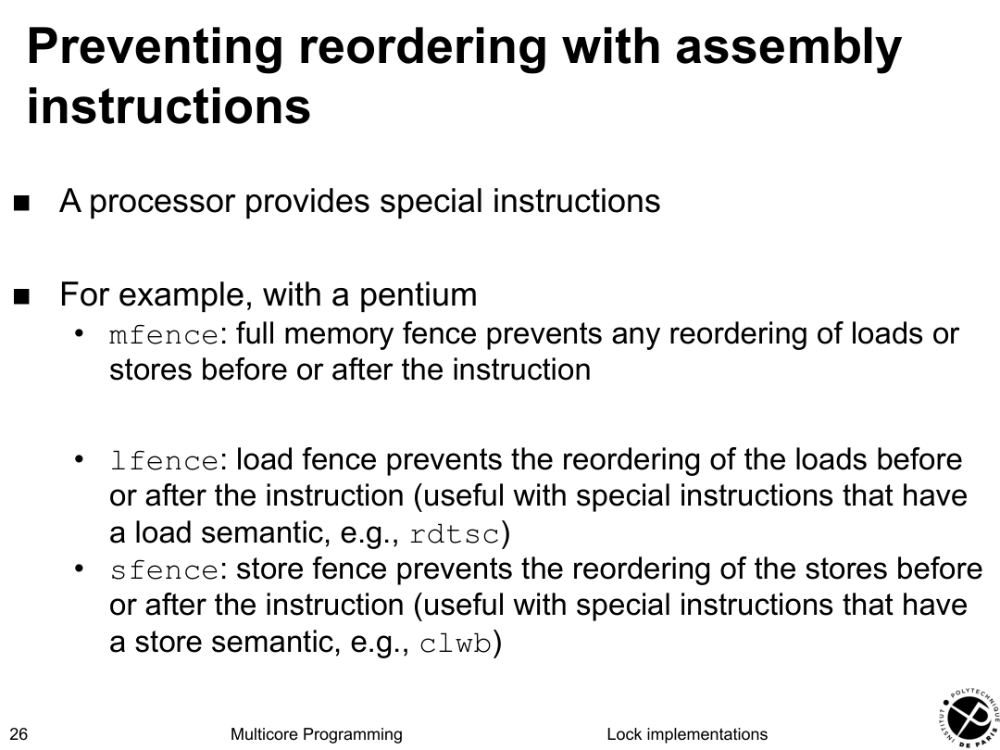

</details>

<a id="page-27"></a>

## 第 27 页 · Preventing reordering in C

- The developer can explicitly specify the ordering semantic with

atomic loads and stores

```text
•
value <- atomic_load_explicit(&addr, order)
•
atomic_store_explicit(&addr, value, order)
```

order can have the values

- memory_order_relaxed
- memory_order_consume
- memory_order_acquire
- memory_order_release
- memory_order_acq_rel
- memory_order_seq_cst (default value with atomic_load and atomic_store)

> 校对：TSO不替代语言同步；relaxed仍有对象原子性。

<details>
<summary>查看第 27 页原图（图形、代码布局与标注）</summary>

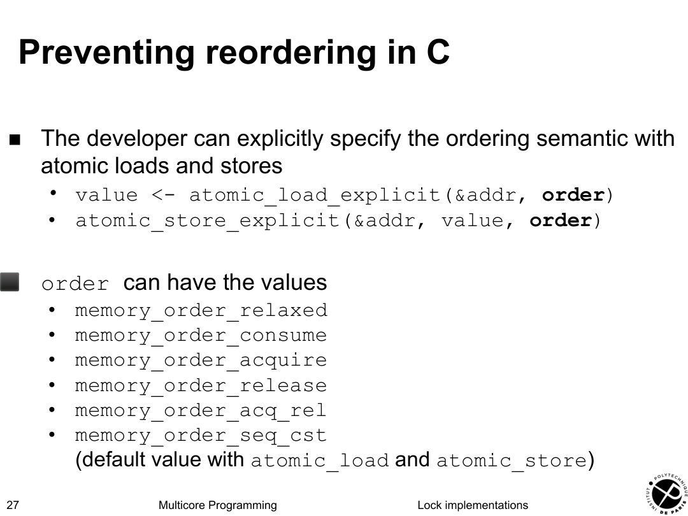

</details>

<a id="page-28"></a>

## 第 28 页 · Relaxed semantic

- Any reordering is possible

- Note that this is the case for the non-atomic operations in C

```text
int _Atomic x = 0;
int _Atomic y = 0;
```

```text
Thread 1
atomic_store_explicit(&x, 0x101, memory_order_relaxed); // A
atomic_store_explicit(&y, 0x101, memory_order_relaxed); // B
```

```text
Thread 2
r2 = atomic_load_explicit(&y, memory_order_relaxed); // C
r1 = atomic_load_explicit(&x, memory_order_relaxed); // D
```

- Possible values: r1 = 0 et r2 = 0x101

- B executed before A => B C D A scheduling
- D executed before C => D A B C scheduling

> 校对：TSO不替代语言同步；relaxed仍有对象原子性。

<details>
<summary>查看第 28 页原图（图形、代码布局与标注）</summary>

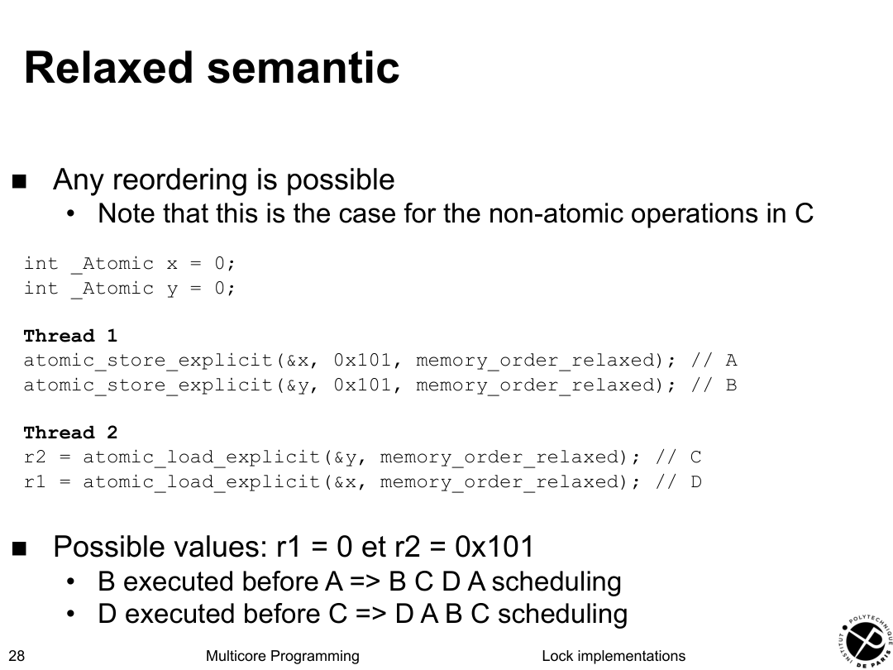

</details>

<a id="page-29"></a>

## 第 29 页 · Relaxed semantic

Important

Here, r0 and r1 can only have the values 0 or 0x101

- Any reordering is possible

If we don’t use atomic operations, r0 and r1 can

- Note that this is the case for the non-atomic operations in C

additionally have the values 0x100 or 0x001

```text
int _Atomic x = 0;
int _Atomic y = 0;
```

```text
Thread 1
atomic_store_explicit(&x, 0x101, memory_order_relaxed); // A
atomic_store_explicit(&y, 0x101, memory_order_relaxed); // B
```

```text
Thread 2
r2 = atomic_load_explicit(&y, memory_order_relaxed); // C
r1 = atomic_load_explicit(&x, memory_order_relaxed); // D
```

- Possible values: r1 = 0 et r2 = 0x101

- B executed before A => B C D A scheduling
- D executed before C => D A B C scheduling

> 校对：图文层叠；非原子C数据竞争不能仅按撕裂枚举。

<details>
<summary>查看第 29 页原图（图形、代码布局与标注）</summary>

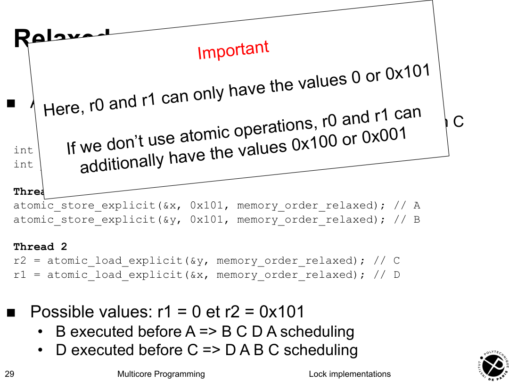

</details>

<a id="page-30"></a>

## 第 30 页 · Release-acquire semantic

- Principle

- Each visible effect that precedes a store in release is visible before the corresponding load
- Each visible effect that succeeds a load in acquire is NOT visible before the correspond store in release

```text
int _Atomic x = 0; int y = 0; int z = 0;
```

```text
Thread 1
z = 1; // A
y = 17; // B
atomic_store_explicit(x, 42, memory_order_release); // C
```

```text
Thread 2
r1 = atomic_load_explicit(x, memory_order_acquire); // D
r2 = y; // E
r3 = z; // F
```

If r1 == 42, then y==17 and z==1

> 校对：原文atomic接口缺&；未读到发布值时普通数据读取不安全。

<details>
<summary>查看第 30 页原图（图形、代码布局与标注）</summary>

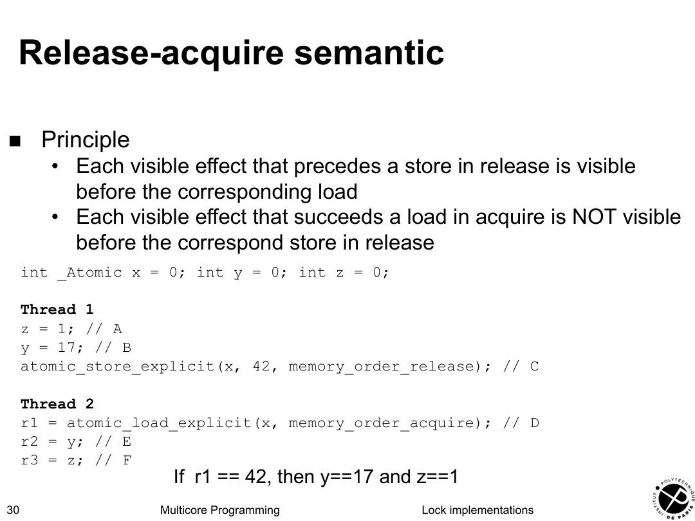

</details>

<a id="page-31"></a>

## 第 31 页 · Release-consume semantic

- As release-acquire, but only for variables that “carry” a

dependency

- So confusing that wrongly implemented in many compilers
- The use of release-consume is currently discouraged!

```text
int _Atomic x = 0; int y = 0; int z = 0;
```

```text
Thread1:
x = 42; // A
y = 42; // B
atomic_store_explicit(&z, x, memory_order_release); // C
```

```text
Thread2:
r1 = atomic_load_explicit(&z, memory_order_consume); // D
r2 = y; // E
r3 = x; // F
```

If r1 == 42, then r3 = 42 (because of the dependency

between z and x in C), but r2 may be equal to 0

> 校对：原文z非原子且读取端没有所述依赖。

<details>
<summary>查看第 31 页原图（图形、代码布局与标注）</summary>

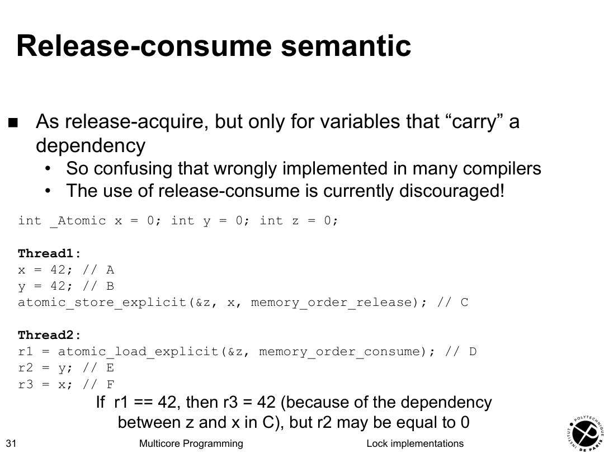

</details>

<a id="page-32"></a>

## 第 32 页 · The sequential consistency semantic

- As release-acquire, but also ensures that all the threads see

the atomic stores in sequential consistency in the same order

```text
int _Atomic x = 0; int _Atomic y = 0;
```

```text
Thread 1: atomic_store(&x, 1); // A
Thread 2: atomic_store(&y, 1); // B
Thread 3: r1 = atomic_load(&x); r2 = atomic_load(&y);
Thread 4: r3 = atomic_load(&x); r4 = atomic_load(&y);
```

If r1 = 1 and r2 = 0, then

● A executed before B for thread 3 ● Because of sequential consistency, it’s also the case for thread 4 ● r3 = 0 and r4 = 1 is thus impossible (B before A for thread 4)

With only release-acquire, we could have r3 = 0 and r4 = 1

> 校对：原图读顺序下存在合法SC反例；已穷举验证。

<details>
<summary>查看第 32 页原图（图形、代码布局与标注）</summary>

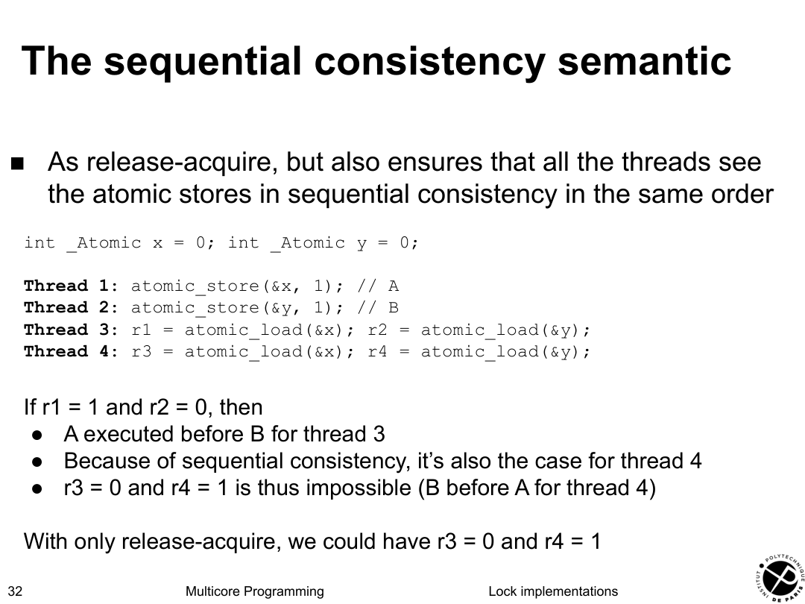

</details>

<a id="page-33"></a>

## 第 33 页 · Note

- In the remainder of the lectures, in order to simplify the codes

- We don’t explicitly specify atomic loads and stores x = 0x101 means atomic_store(&x, 0x101)
- We always suppose the sequential consistency semantic (even when a weaker semantic leads to a correct behavior)

- In the labs, you will

- Have to explicitly use atomic_load/atomic_store for the shared variables
- Have to try to identify if a weaker semantic such as acquire-release or even relaxed leads to a correct behavior

> 校对：省略调用但假设SC原子；RMW工具。

<details>
<summary>查看第 33 页原图（图形、代码布局与标注）</summary>

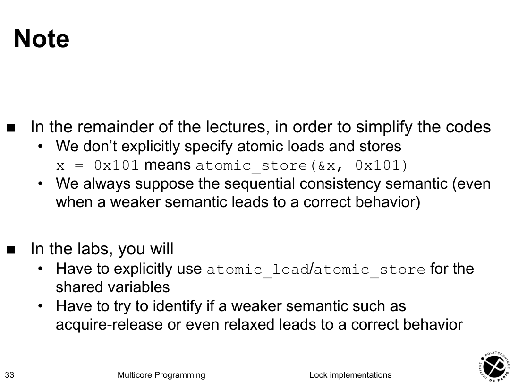

</details>

<a id="page-34"></a>

## 第 34 页 · And now...

- We are now able to implement the bakery algorithm in C 😀

- In order to implement efficient lock algorithms, we still need

load-modify-store operations that atomically

- Load a value
- Modify the value
- Store the value

- Three important operations

```text
•
atomic_exchange
•
atomic_fetch_add
•
atomic_compare_exchange_strong
```

- Note: add _explicit to specify the memory order semantic

> 校对：省略调用但假设SC原子；RMW工具。

<details>
<summary>查看第 34 页原图（图形、代码布局与标注）</summary>

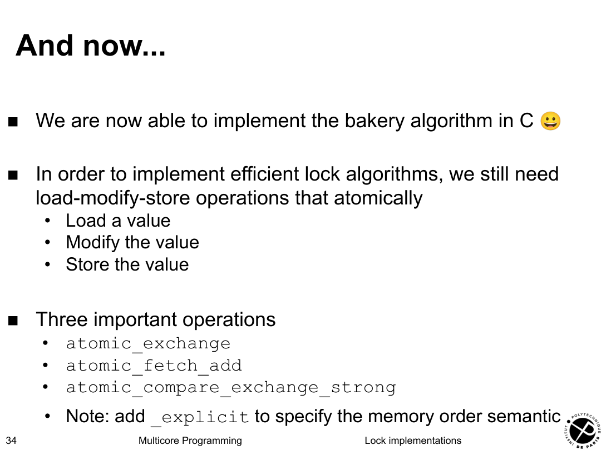

</details>

<a id="page-35"></a>

## 第 35 页 · Menu

1. The Bakery algorithm

2. Background

3. Lock algorithms

a. The spinlock b. The ticket lock c. The MCS lock

> 校对：旧值判断与缓存行反复写；性能绝对表述加边界。

<details>
<summary>查看第 35 页原图（图形、代码布局与标注）</summary>

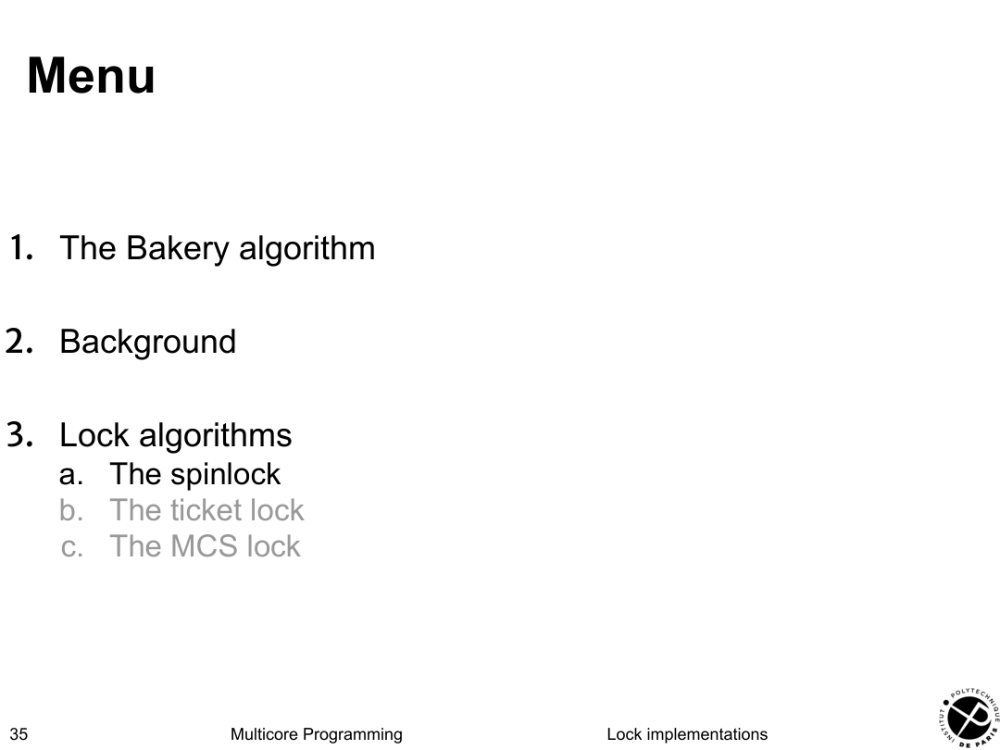

</details>

<a id="page-36"></a>

## 第 36 页 · The tool: atomic_exchange 

- Atomically exchange a value

```text
type atomic_exchange(type _Atomic* addr, type value) {
  type res = *addr;
  *addr = value;
  return res;
}
```

Executed atomically

> 校对：旧值判断与缓存行反复写；性能绝对表述加边界。

<details>
<summary>查看第 36 页原图（图形、代码布局与标注）</summary>

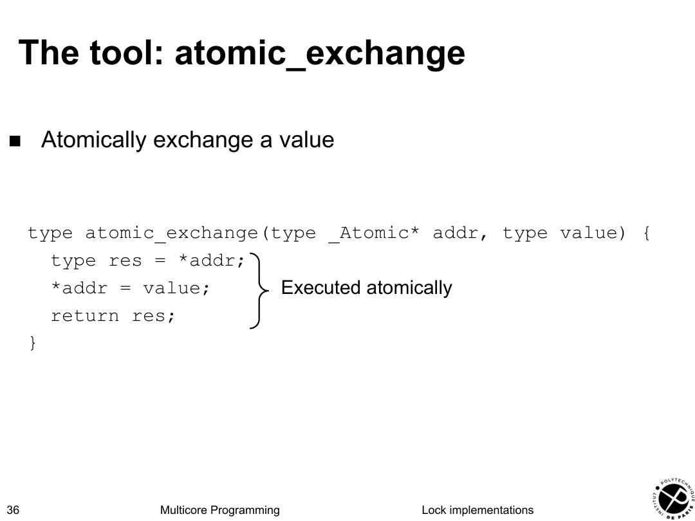

</details>

<a id="page-37"></a>

## 第 37 页 · Implementation of an atomic  load-modify-store operation

- On a pentium, relies on the cache protocol

- Acquire the cache line in exclusive mode
- And “locks” the cache line in the cache during the execution of the load-modify-store instruction
- Another core has thus to wait to acquire the cache line in shared or exclusive state

> 校对：旧值判断与缓存行反复写；性能绝对表述加边界。

<details>
<summary>查看第 37 页原图（图形、代码布局与标注）</summary>

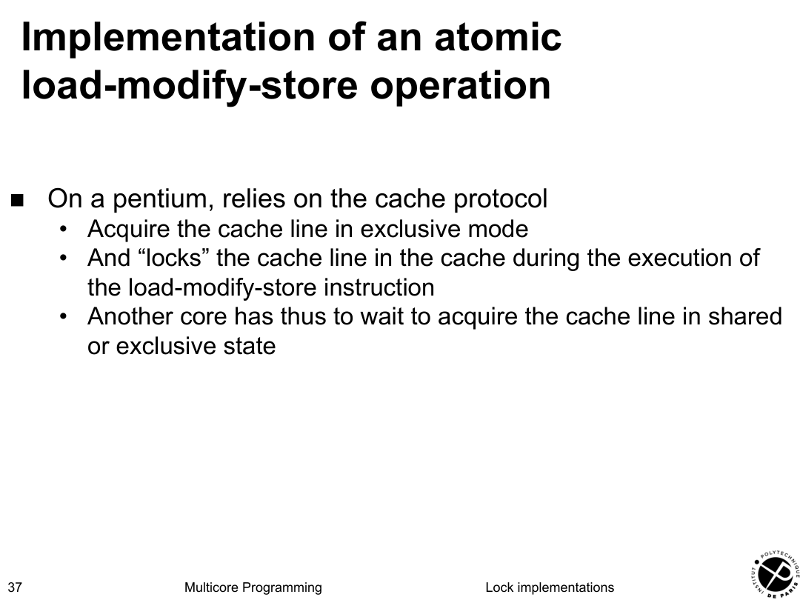

</details>

<a id="page-38"></a>

## 第 38 页 · Implementation of an atomic  load-modify-store operation

Important

The atomicity of load-modify-store operation does not

require a global consensus with the other cores. It only consists in locking the cache line in the local L1

- On a pentium, relies on the cache protocol

- Acquire the cache line in exclusive mode
- And “locks” the cache line in the cache during the execution of the load-modify-store instruction
- Another core has thus to wait to acquire the cache line in shared or exclusive state

cache of the core during few cycles.

As a consequence, an atomic operation does not

have a performance cost because of the

atomicity!

The cost comes from: (i) the write that invalidates the

other copies and (ii) the memory ordering that

prevents out-of-order execution

> 校对：原子性无成本说法过强，仅保留通信/排序动机。

<details>
<summary>查看第 38 页原图（图形、代码布局与标注）</summary>

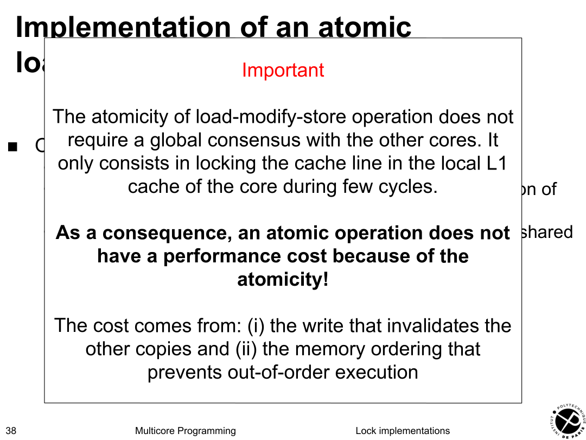

</details>

<a id="page-39"></a>

## 第 39 页 · The spinlock

- The spinlock is the most simple lock implementation

- Principle: spins while a lock is in the BUSY state
- Only requires the atomic_exchange operation

```text
enum { FREE, BUSY };
int _Atomic lock = FREE;
```

```text
void lock(int _Atomic* lock) {
  while(atomic_exchange(lock, BUSY) != FREE) { }
}
```

```text
void unlock(int _Atomic* lock) {
  atomic_store(lock, FREE);
}
```

Note: the acquire-release semantic gives a correct behavior

> 校对：变量lock与函数lock同名是片段，非完整可编译程序。

<details>
<summary>查看第 39 页原图（图形、代码布局与标注）</summary>

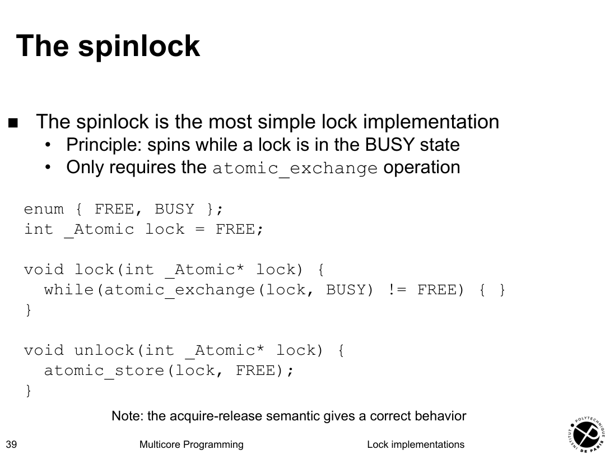

</details>

<a id="page-40"></a>

## 第 40 页 · The spinlock

- The spinlock is the most simple lock implementation

- Principle: spins while a lock is in the BUSY state
- Only requires the atomic_exchange operation

- Very efficient if the lock is almost always FREE

- Very inefficient in case of contention

- The cache line that holds the lock variable continuously bounces between the cores

- Recall the cache protocol: in case of write, a core acquires a

cache line in the exclusive state and invalidates thus the copies in the other cores

> 校对：旧值判断与缓存行反复写；性能绝对表述加边界。

<details>
<summary>查看第 40 页原图（图形、代码布局与标注）</summary>

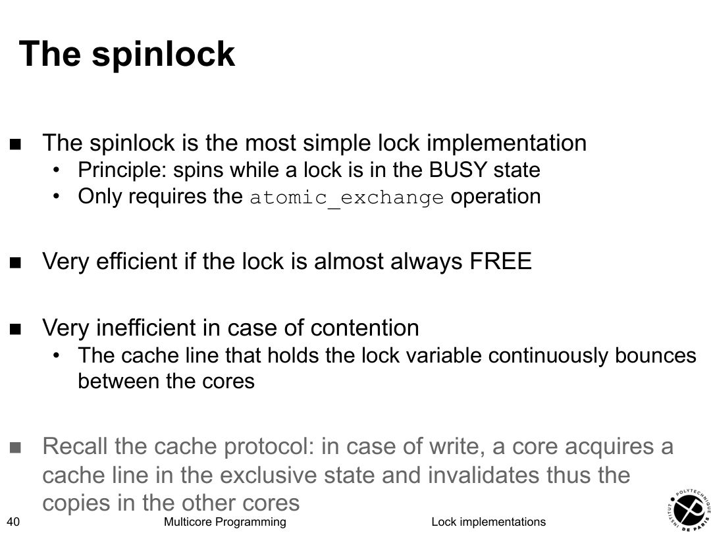

</details>

<a id="page-41"></a>

## 第 41 页 · Menu

1. The Bakery algorithm

2. Background

3. Lock algorithms

a. The spinlock b. The ticket lock c. The MCS lock

> 校对：fetch_add返回旧号；等待屏幕；回绕前提。

<details>
<summary>查看第 41 页原图（图形、代码布局与标注）</summary>

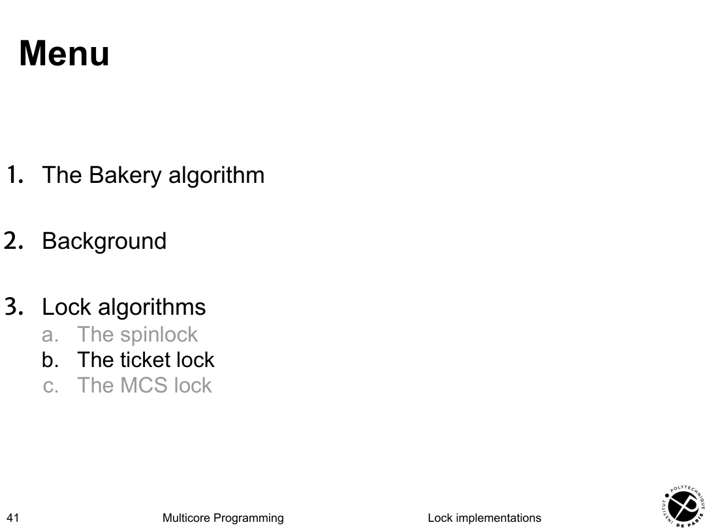

</details>

<a id="page-42"></a>

## 第 42 页 · The tool: atomic_fetch_add

- Atomically adds a value to a memory location and returns the

original value

```text
type atomic_fetch_add(type _Atomic* addr, type n) {
  type res = *addr;
  *addr += n;
  return res;
}
```

Executed atomically

> 校对：fetch_add返回旧号；等待屏幕；回绕前提。

<details>
<summary>查看第 42 页原图（图形、代码布局与标注）</summary>

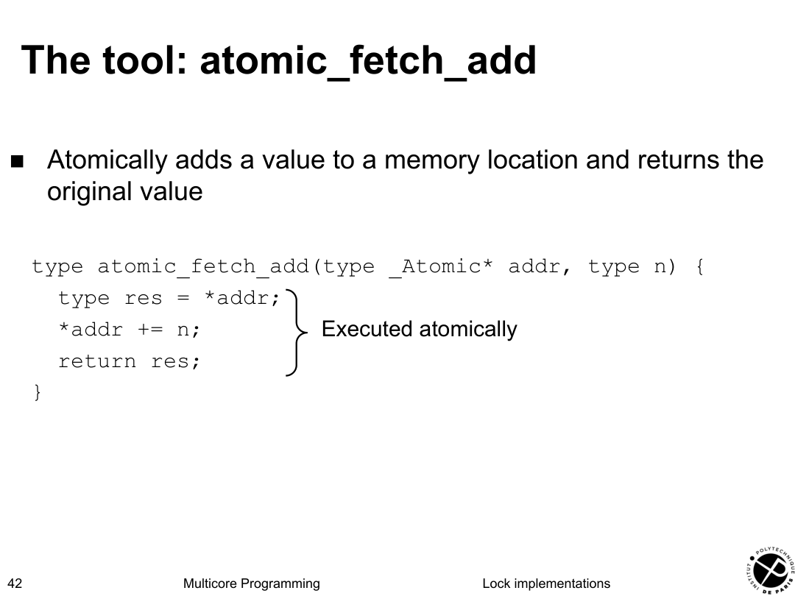

</details>

<a id="page-43"></a>

## 第 43 页 · The ticket lock

- Very efficient lock implementation used in the Linux kernel

- Based on atomic_fetch_add
- Simulates a ticket with a number such as the one used at a post office

- A client takes a ticket with a number, which atomically increments a counter for the next client
- The postman increments another counter on a screen when a client leaves the post office
- When the counter given by the ticket is equal to the counter given by the screen, the client is served

- Conceptually close to the Bakery algorithm

> 校对：fetch_add返回旧号；等待屏幕；回绕前提。

<details>
<summary>查看第 43 页原图（图形、代码布局与标注）</summary>

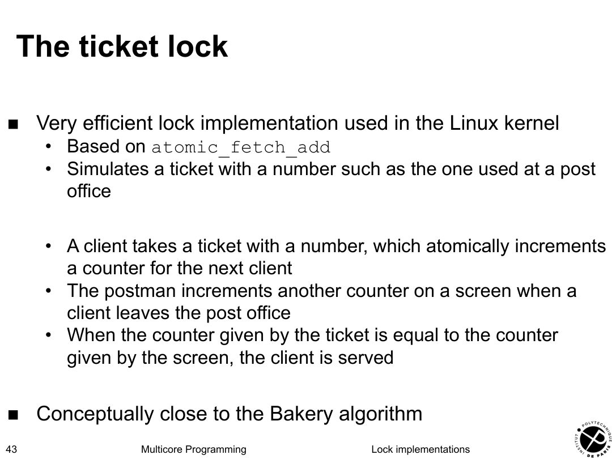

</details>

<a id="page-44"></a>

## 第 44 页 · The ticket lock

```text
struct ticket_lock {
  int _Atomic ticket;
  int _Atomic screen;
}; /* initialized to (0, 0) */
```

```text
void lock(struct ticket_lock* t) {
  int my = atomic_fetch_add(&t->ticket, 1);
  while(atomic_load(&t->screen) < my) { }
}
```

```text
void unlock(struct ticket_lock* t) {
  atomic_fetch_add(&t->screen, 1);
}
```

> 校对：<my使用无回绕假设；不推广到有限有符号计数。

<details>
<summary>查看第 44 页原图（图形、代码布局与标注）</summary>

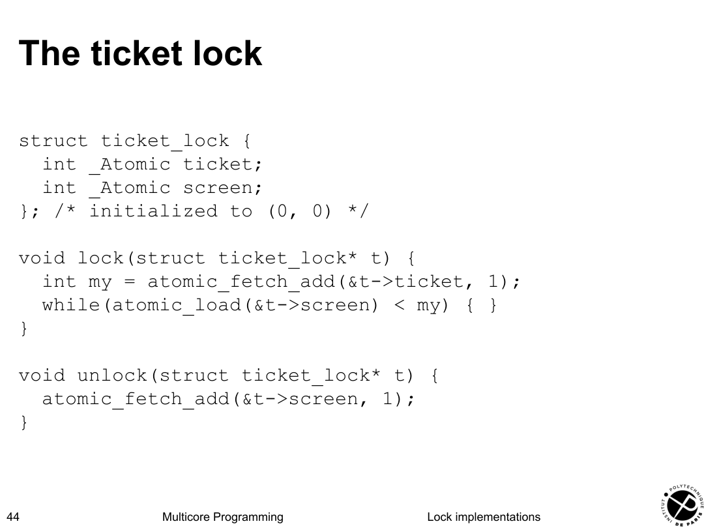

</details>

<a id="page-45"></a>

## 第 45 页 · The ticket lock

The threads spin with a load operation and not

with a load-modify-store operation, which avoids the cache line bounces caused by the

```text
struct ticket_lock {
  int _Atomic ticket;
  int _Atomic screen;
}; /* initialized to (0, 0) */
```

cache line invalidations

```text
void lock(struct ticket_lock* t) {
  int my = atomic_fetch_add(&t->ticket, 1);
  while(atomic_load(&t->screen) < my) { }
}
```

```text
void unlock(struct ticket_lock* t) {
  atomic_fetch_add(&t->screen, 1);
}
```

> 校对：fetch_add返回旧号；等待屏幕；回绕前提。

<details>
<summary>查看第 45 页原图（图形、代码布局与标注）</summary>

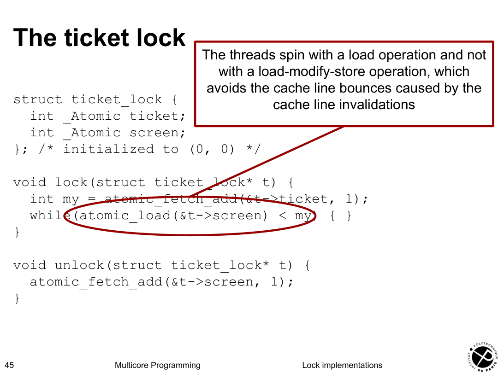

</details>

<a id="page-46"></a>

## 第 46 页 · The ticket lock

The threads spin with a load operation and not

with a load-modify-store operation, which avoids the cache line bounces caused by the

```text
struct ticket_lock {
  int _Atomic ticket;
  int _Atomic screen;
}; /* initialized to (0, 0) */
```

cache line invalidations

```text
void lock(struct ticket_lock* t) {
  int my = atomic_fetch_add(&t->ticket, 1);
  while(atomic_load(&t->screen) < my) { }
}
```

```text
void unlock(struct ticket_lock* t) {
  atomic_fetch_add(&t->screen, 1);
}
```

However, all the threads spin while loading the

same memory location

We can probably do better!

> 校对：fetch_add返回旧号；等待屏幕；回绕前提。

<details>
<summary>查看第 46 页原图（图形、代码布局与标注）</summary>

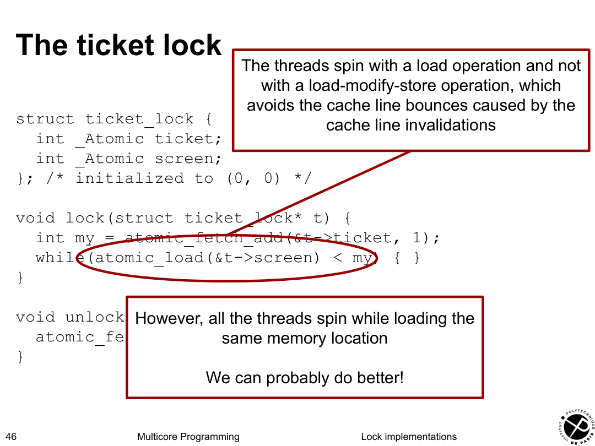

</details>

<a id="page-47"></a>

## 第 47 页 · Menu

1. The Bakery algorithm

2. Background

3. Lock algorithms

a. The spinlock b. The ticket lock c. The MCS lock

> 校对：C CAS布尔返回及expected写回；string原文拼写错误。

<details>
<summary>查看第 47 页原图（图形、代码布局与标注）</summary>


</details>

<a id="page-48"></a>

## 第 48 页 · The tools:  atomic_compare_exchange_strong

- Like exchange, but only if the variable has a given value

```text
bool atomic_compare_exchange_string(type _Atomic* addr,
                                    type* expected,
                                    type value) {
  if(*addr == *expected) { /* success */
    *addr = value;         /* exchange */
    return true;
  } else {                 /* fail */
    *expected = *addr;/* replace *expected by actual */
    return false;
  }
}
```

> 校对：函数名原文string，标题strong；C CAS与返回旧值版本区分。

<details>
<summary>查看第 48 页原图（图形、代码布局与标注）</summary>

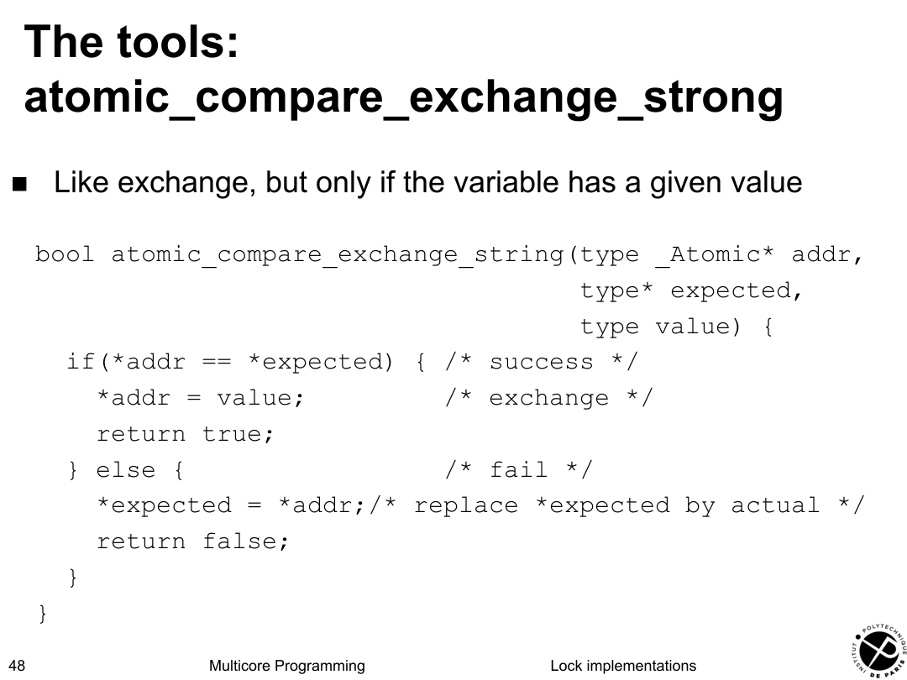

</details>

<a id="page-49"></a>

## 第 49 页 · The tools: the _Thread_local storage

- We often need global per-thread variable

- To store a thread number
- For thread-specific data structures

- The _Thread_local storage class specifier

- Define a global variable
- With a per-thread semantic (one variable per thread)

- Example

```text
•
_Thread_local int myId;
```

> 校对：C CAS布尔返回及expected写回；string原文拼写错误。

<details>
<summary>查看第 49 页原图（图形、代码布局与标注）</summary>

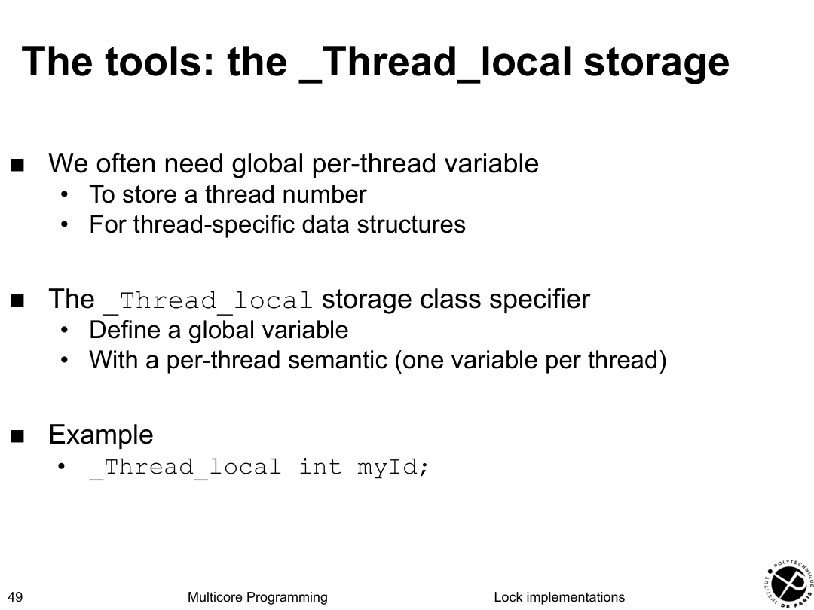

</details>

<a id="page-50"></a>

## 第 50 页 · The MCS lock [ASPLOS’91]

- Principle:

- Create a FIFO of processes that waits for the lock
- The lock owner wakes up the next in the list

- Advantages

- Totally fair
- Each waiter spins alone on its memory location
- The thread owner only wakes up the next in the FIFO queue

- Drawback

- Subject to the convoy effect, especially when the process contains more threads than the number of cores

John M. Mellor-Crummey, Michael L. Scott: Synchronization without Contention. ASPLOS 1991

> 校对：队尾交换、next链接窗口、FIFO与convoy。

<details>
<summary>查看第 50 页原图（图形、代码布局与标注）</summary>

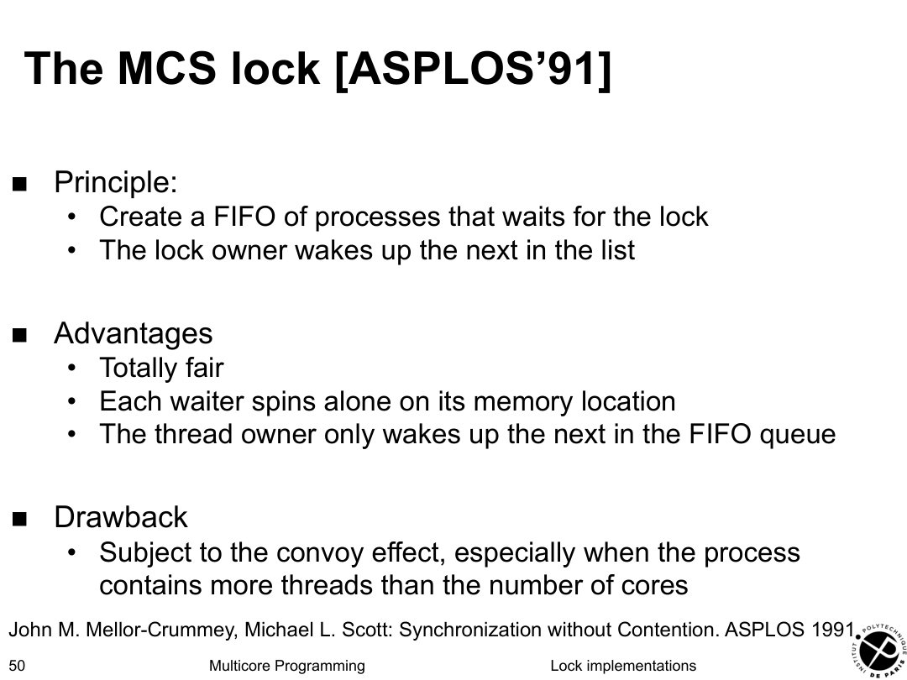

</details>

<a id="page-51"></a>

## 第 51 页 · The MCS lock [ASPLOS’91]

```text
struct node { struct node* _Atomic next; bool _Atomic isFree; };
```

```text
_Thread_local struct node my;
struct node* _Atomic lock = NULL;
```

NULL means that the

lock is free

```text
void my_lock() {
  my.next = NULL;    my.isFree = false;
  struct node* p = atomic_exchange(&lock, &my);
  if(p) {
    atomic_store(&p->next, &my);
    while(!atomic_load(&my.isFree)) { }
```

If the lock is already taken

add my in the waiting queue

```text
  }
}
```

[...]

NULL

FALSE

TRUE

my owner

lock

> 校对：队尾交换、next链接窗口、FIFO与convoy。

<details>
<summary>查看第 51 页原图（图形、代码布局与标注）</summary>

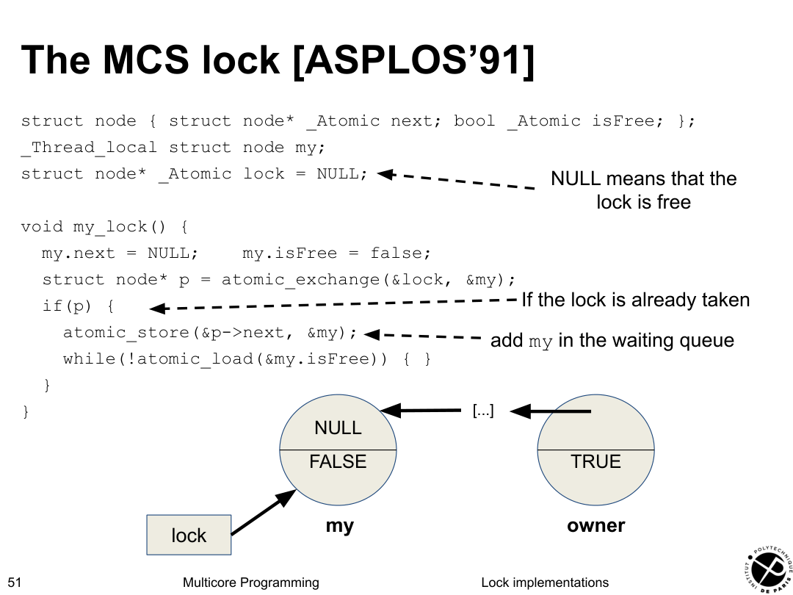

</details>

<a id="page-52"></a>

## 第 52 页 · The MCS lock [ASPLOS’91]

```text
void my_lock() {
```

```text
  my.next = NULL;    my.isFree = false;
  struct node* p = atomic_exchange(&lock, &my);
  if(p) {
    atomic_store(&p->next, &my);
    while(!atomic_load(&my.isFree)) { }
  }
}
```

If my.next is still null

And if my is still at the

```text
void my_unlock() {
```

head of the queue

```text
  struct node* expected = &my;
  if(!atomic_load(&my.next) 
     && atomic_compare_exchange_strong(&lock, &expected, NULL))
    return;
  while(!atomic_load(&my.next)) { }
  atomic_store(&my.next->isFree, true);
}
```

No waiter => return

Wait while the next waiter

has not yet installed the

next pointer Release the next

waiter

> 校对：head旁注实为全局队尾比较；节点生命期与链接窗口。

<details>
<summary>查看第 52 页原图（图形、代码布局与标注）</summary>

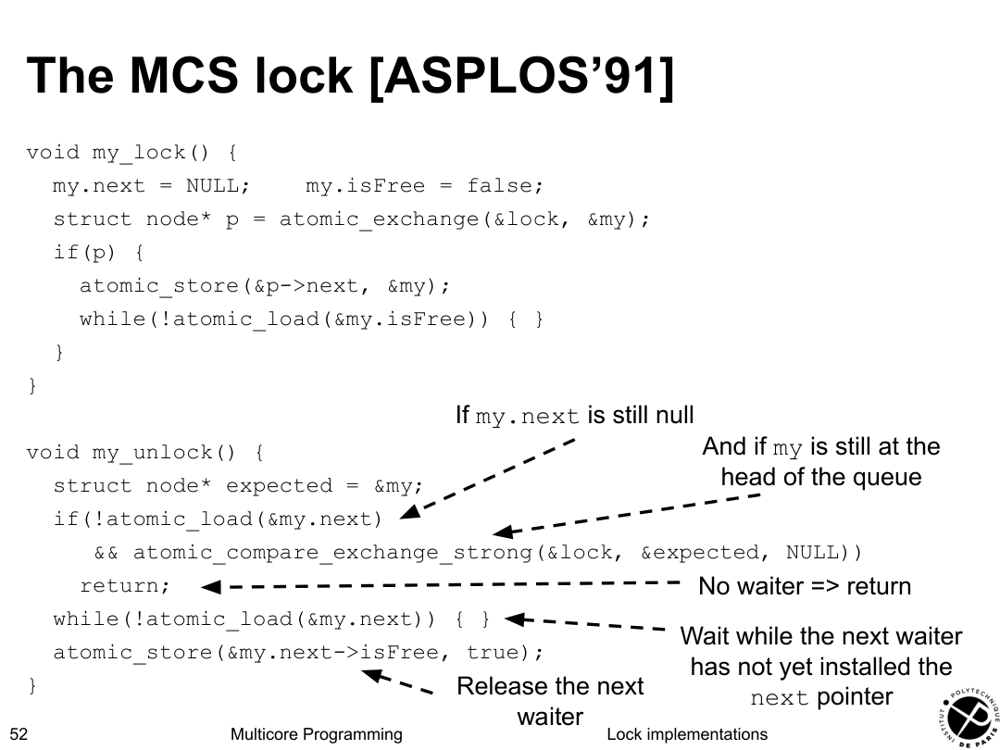

</details>

<a id="page-53"></a>

## 第 53 页 · To take away

- The Bakery algorithm
- atomic_load and atomic_store
- Memory ordering

- Relaxed
- Release-acquire
- Release-consume
- Sequential consistency
- atomic load-modify-store operations

- Exchange to implement the spinlock
- Fetch and add to implement the ticket lock
- Compare and swap to implement the MCS lock

> 校对：比较等待位置与通信模式。

<details>
<summary>查看第 53 页原图（图形、代码布局与标注）</summary>

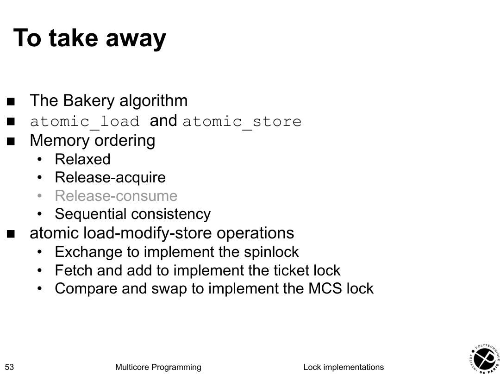

</details>

## 原 OCR 图片保留索引

以下按原始 OCR 引用顺序保留，方便核对裁切范围；准确页码以逐页原图为准。

- [提取图 001](Images/02-locks/image_001.jpg)
- [提取图 002](Images/02-locks/image_002.jpg)
- [提取图 003](Images/02-locks/image_003.jpg)
- [提取图 004](Images/02-locks/image_004.jpg)
- [提取图 005](Images/02-locks/image_005.jpg)
- [提取图 006](Images/02-locks/image_006.jpg)
- [提取图 007](Images/02-locks/image_007.jpg)
- [提取图 008](Images/02-locks/image_008.jpg)
- [提取图 009](Images/02-locks/image_009.jpg)
