# 03-non-blocking · 原文校对稿

[原始 PDF](03-non-blocking.pdf) · [中文详解](03-non-blocking_zh.md) · [课程目录](README.md)

对应实验：非阻塞算法（[中文版](../Labs/tp-non-blocking/tp-non-blocking_zh.html) · [英文原版](../Labs/tp-non-blocking/tp-non-blocking.html)）

> 以 PDF 内嵌文字层重建，按原页和文字块分离正文、代码与图注，修复 MinerU 的混栏、页脚入代码及语言标签问题。保留原课件的用词和代码疑点，不将其悄悄改写为正确程序。代码块有时是逐步展示中的片段；图形、数学排版、颜色和箭头以各页展开后的原图为准。

[重要勘误](ERRATA.md)

<a id="page-1"></a>

## 第 1 页 · Page 1

Non-blocking algorithms

Master in computer science of IP Paris

Master CHPS of Paris Saclay

Gaël Thomas

> 校对：Amdahl公式与进展等级；原文low应理解为law。

<details>
<summary>查看第 1 页原图（图形、代码布局与标注）</summary>

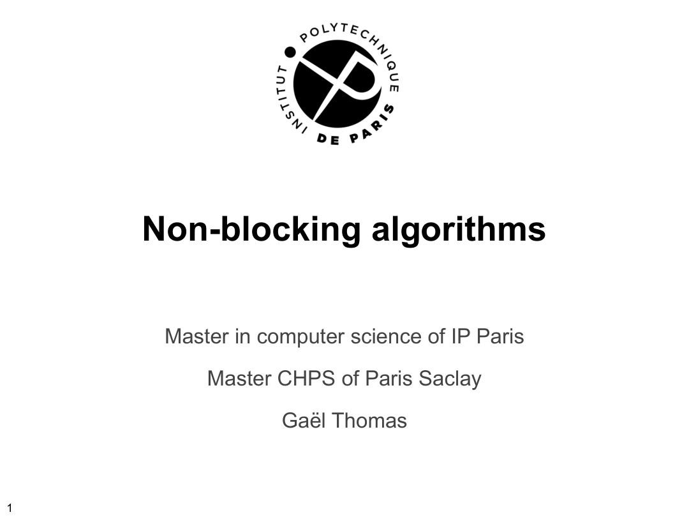

</details>

<a id="page-2"></a>

## 第 2 页 · Limit of lock algorithms

- 

Amdahl low

- T: execution time of the application
- p: percentage of code executable in parallel
- ⇒ T * (1 - p + p/n): execution time with n threads
- ⇒ a = 1/(1 – p + p/n): acceleration
- ⇒ limit when n → ∞ : a → 1/(1 – p)

- 

With numerical value:

- p = 75% ⇒ a → 1/0,25 = 4 when n → ∞ (3,7 with 32 cores)
- p = 95% ⇒ a → 1/0,05 = 20 when n → ∞ (12,55 with 32 cores, 17,42 with 128 cores)

⇒ we have to fight to make the last remaining percents parallel!

> 校对：Amdahl low原文拼写；近似数与模型条件已说明。

<details>
<summary>查看第 2 页原图（图形、代码布局与标注）</summary>

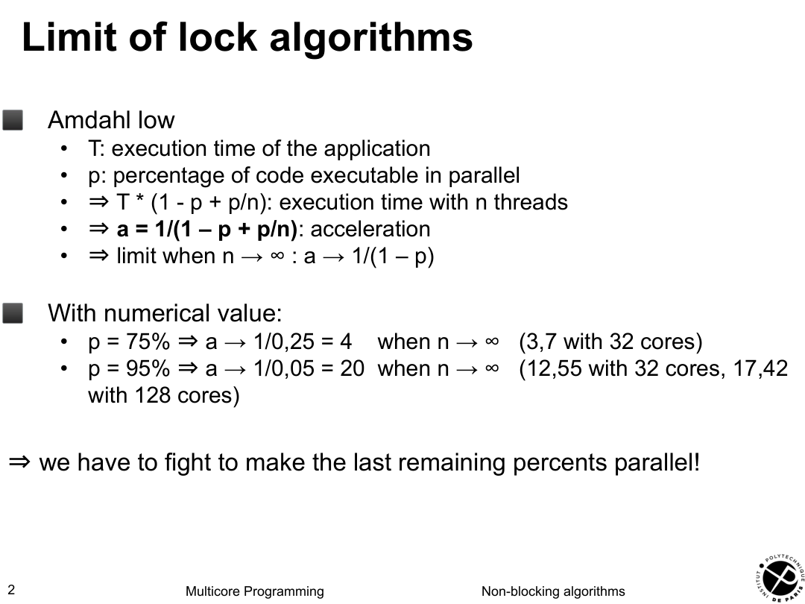

</details>

<a id="page-3"></a>

## 第 3 页 · Non-blocking algorithms

Principle: build algorithm that “do not” block

- Wait-free: each operation terminates in a bounded number of steps

- Lock-free: if we call infinitely often an operation, the operation terminates infinitely often (weakest than wait-free because no bound on the number of steps)

- Obstruction-free: at any point in the program, if a thread executes alone, it terminates its operation in a finite number of steps (weakest than lock-free, imagine two threads that hamper each other)

- Wait-free => Lock-free => Obstruction-free, but the reverse is false

- 

As soon as an operation takes a lock, it is not obstruction-free

> 校对：Amdahl公式与进展等级；原文low应理解为law。

<details>
<summary>查看第 3 页原图（图形、代码布局与标注）</summary>

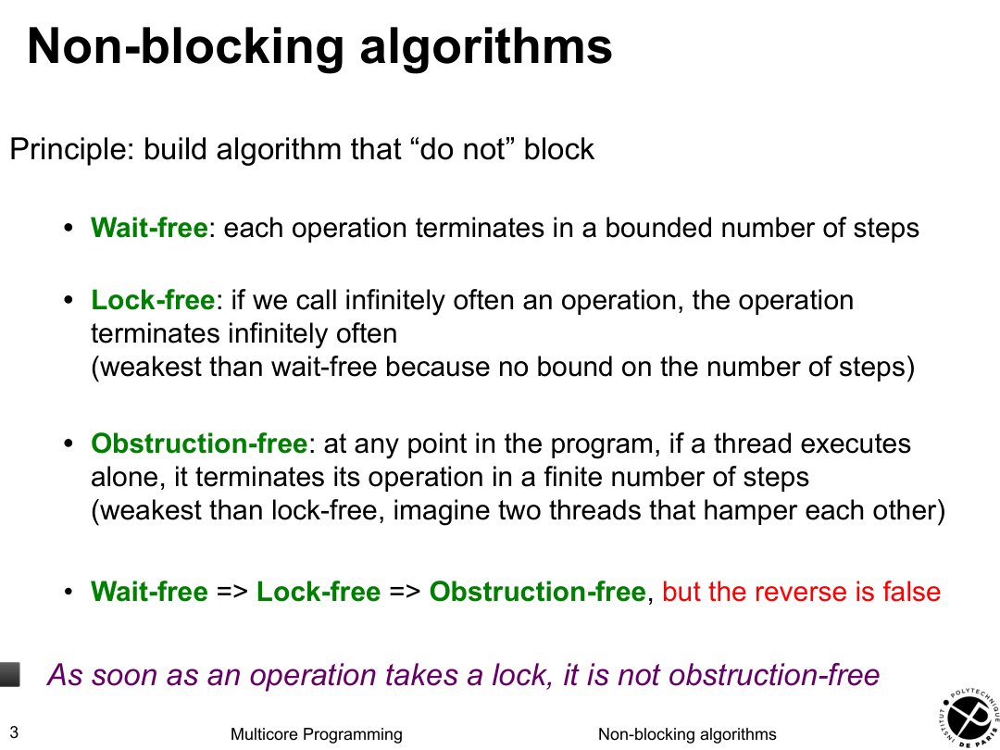

</details>

<a id="page-4"></a>

## 第 4 页 · Non-blocking data structures

1. The stack

2. The queue

3. The linked list

> 校对：节点结构与LIFO；空栈分支尚未展示。

<details>
<summary>查看第 4 页原图（图形、代码布局与标注）</summary>

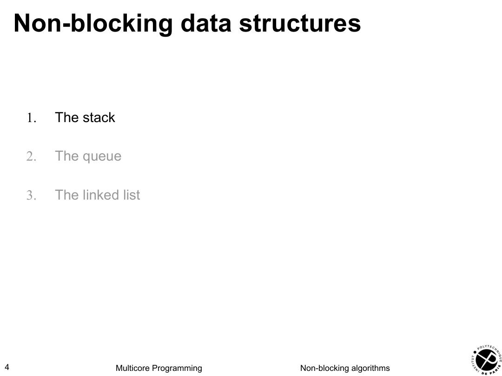

</details>

<a id="page-5"></a>

## 第 5 页 · The stack

Two operations:

- push(Element e): push an element
- Element pop(): pop an element

push(D)

A D B C

pop()

> 校对：节点结构与LIFO；空栈分支尚未展示。

<details>
<summary>查看第 5 页原图（图形、代码布局与标注）</summary>

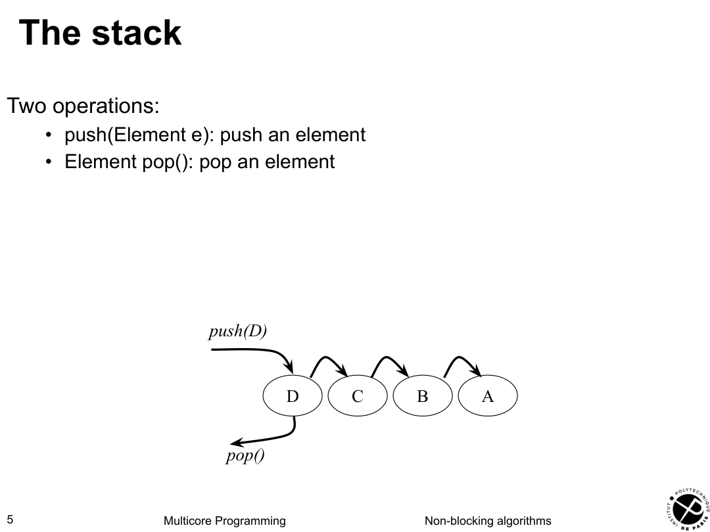

</details>

<a id="page-6"></a>

## 第 6 页 · A stack built with a lock

```text
Class Stack {
  Node    head;
}
```

```text
Class Node {
  Node    next
  Element element;
}
```

Head A

C

D B

> 校对：节点结构与LIFO；空栈分支尚未展示。

<details>
<summary>查看第 6 页原图（图形、代码布局与标注）</summary>

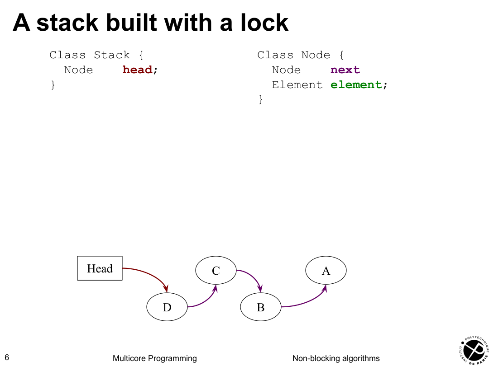

</details>

<a id="page-7"></a>

## 第 7 页 · A stack built with a lock

```text
Class Stack {
  Node    head;
}
```

```text
Class Node {
  Node    next
  Element element;
}
```

```text
sychronized void Stack.push(Element element) {
  Node n = new Node(head, element);
  head = n;
}
synchronized Element pop() {
  Node n = head;
  head = n.next;
  return n.element;
}
```

Head A

C

D B

> 校对：节点结构与LIFO；空栈分支尚未展示。

<details>
<summary>查看第 7 页原图（图形、代码布局与标注）</summary>

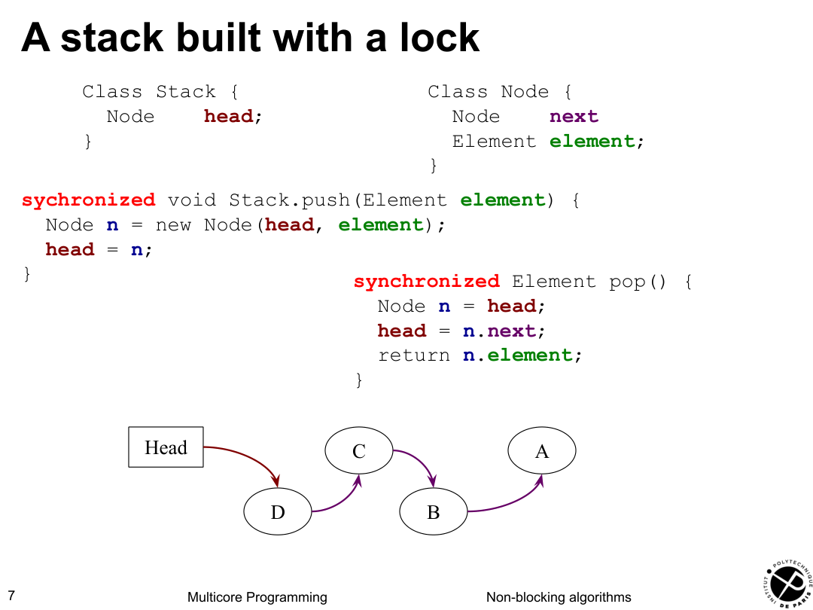

</details>

<a id="page-8"></a>

## 第 8 页 · The lock-free stack (Scott’91)

```text
Class Stack {
  Node    head;
}
```

```text
Class Node {
  Node    next
  Element element;
}
```

Principle: atomic compare and

swap on the head

Head A

C

D B

> 校对：返回旧值CAS、线性化点、失败重试；p11补空栈。

<details>
<summary>查看第 8 页原图（图形、代码布局与标注）</summary>

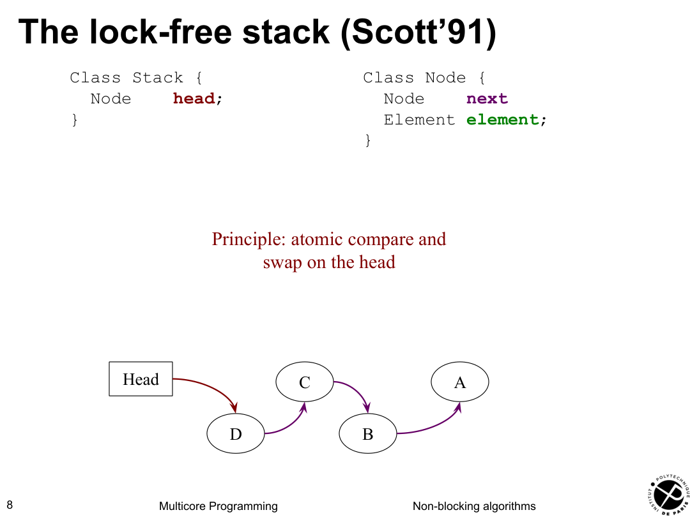

</details>

<a id="page-9"></a>

## 第 9 页 · The lock-free stack (Scott’91)

```text
Class Stack {
  Node    head;
}
```

```text
Class Node {
  Node    next
  Element element;
}
```

```text
void Stack.push(Element element) {
  do {
    Node n = new Node(head, element);
  } while(atomic-cas(&head, n.next, n) != n.next);
}
```

Head A

C

D B

> 校对：循环内分配、变量作用域均为教学伪代码。

<details>
<summary>查看第 9 页原图（图形、代码布局与标注）</summary>

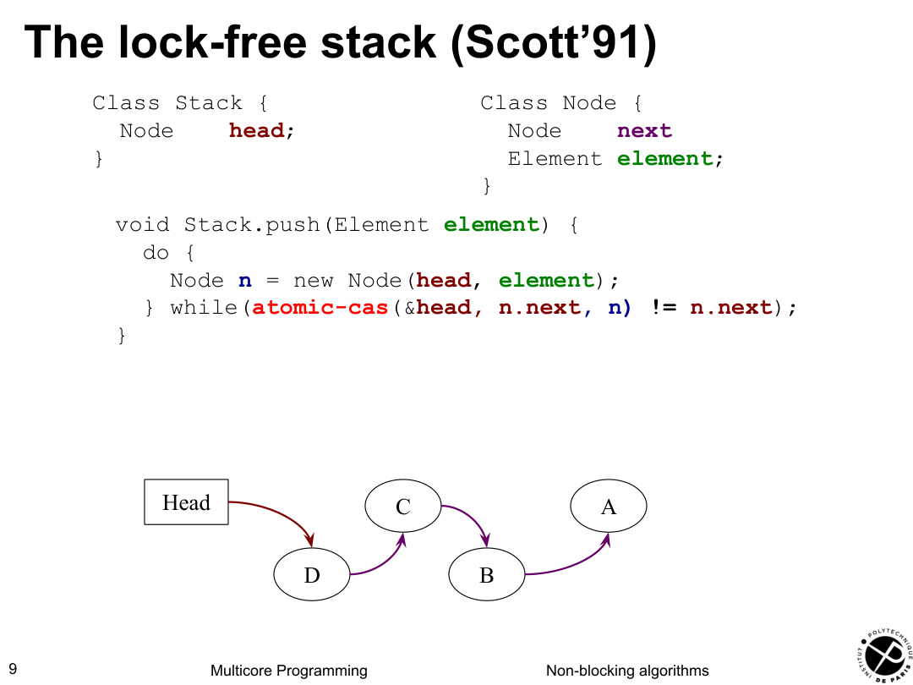

</details>

<a id="page-10"></a>

## 第 10 页 · The lock-free stack (Scott’91)

```text
Class Stack {
  Node    head;
}
```

```text
Class Node {
  Node    next
  Element element;
}
```

```text
void Stack.push(Element element) {
  do {
    Node n = new Node(head, element);
  } while(atomic-cas(&head, n.next, n) != n.next);
}
```

```text
Element Stack.pop() {
  do {
    Node n = head;
  } while(atomic-cas(&head, n, n.next) != n);
  return n.element;
}
```

> 校对：空栈处理至p11才出现。

<details>
<summary>查看第 10 页原图（图形、代码布局与标注）</summary>

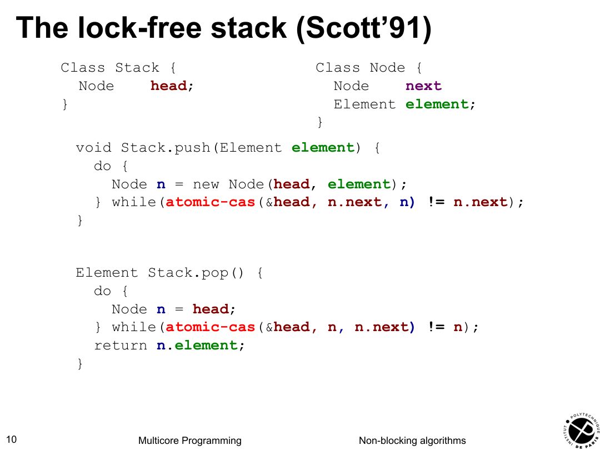

</details>

<a id="page-11"></a>

## 第 11 页 · The lock-free stack (Scott’91)

Lock-free: if the threads call infinitely often push or pop, push or pop are executed

infinitely often (proof: a push or a pop has to succeed to make the CAS of another push or pop fail)

Not wait-free: we can always delay a push with another push that makes the CAS fails

```text
void Stack.push(Element element) {
  do {
    Node n = new Node(head, element);
  } while(atomic-cas(&head, n.next, n) != n.next);
}
Element Stack.pop() {
  do {
    Node n = head;
    if(n == null) error("No such element");
  } while(atomic-cas(&head, n, n.next) != n);
  return n.element;
}
```

> 校对：返回旧值CAS、线性化点、失败重试；p11补空栈。

<details>
<summary>查看第 11 页原图（图形、代码布局与标注）</summary>

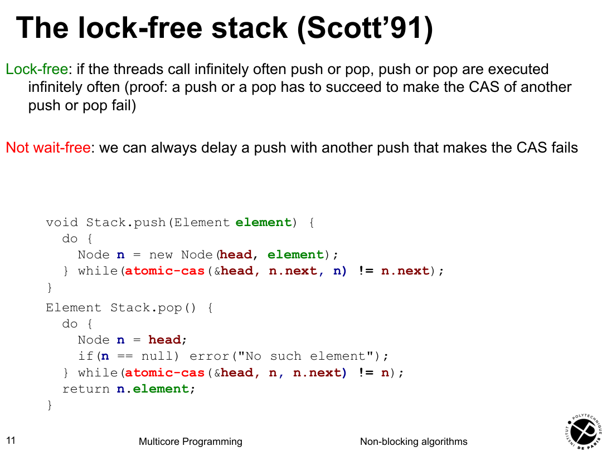

</details>

<a id="page-12"></a>

## 第 12 页 · Non-blocking data structures

1. The stack

2. The queue

3. The linked list

> 校对：FIFO、head/tail及空队列分支边界。

<details>
<summary>查看第 12 页原图（图形、代码布局与标注）</summary>

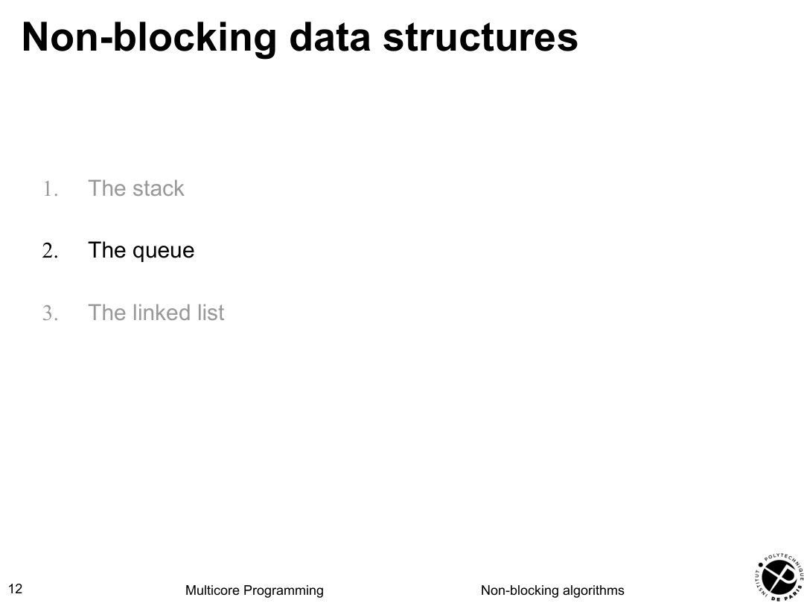

</details>

<a id="page-13"></a>

## 第 13 页 · The queue

Two operations :

- void enqueue(Element e): adds the element at the tail of the queue
- Element dequeue(): remove the element at the head of the queue

Head D

B

A C

Tail

> 校对：FIFO、head/tail及空队列分支边界。

<details>
<summary>查看第 13 页原图（图形、代码布局与标注）</summary>

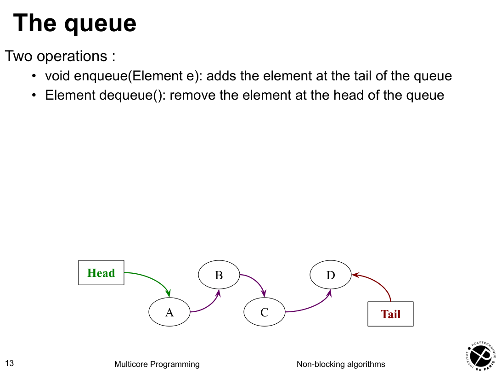

</details>

<a id="page-14"></a>

## 第 14 页 · The queue implemented with a lock

```text
Class Queue {
  Node    head = null;
  Node    tail = null;
}
```

```text
Class Node {
  Node    next;
  Element element;
}
```

Head D

B

A C

Tail

> 校对：FIFO、head/tail及空队列分支边界。

<details>
<summary>查看第 14 页原图（图形、代码布局与标注）</summary>

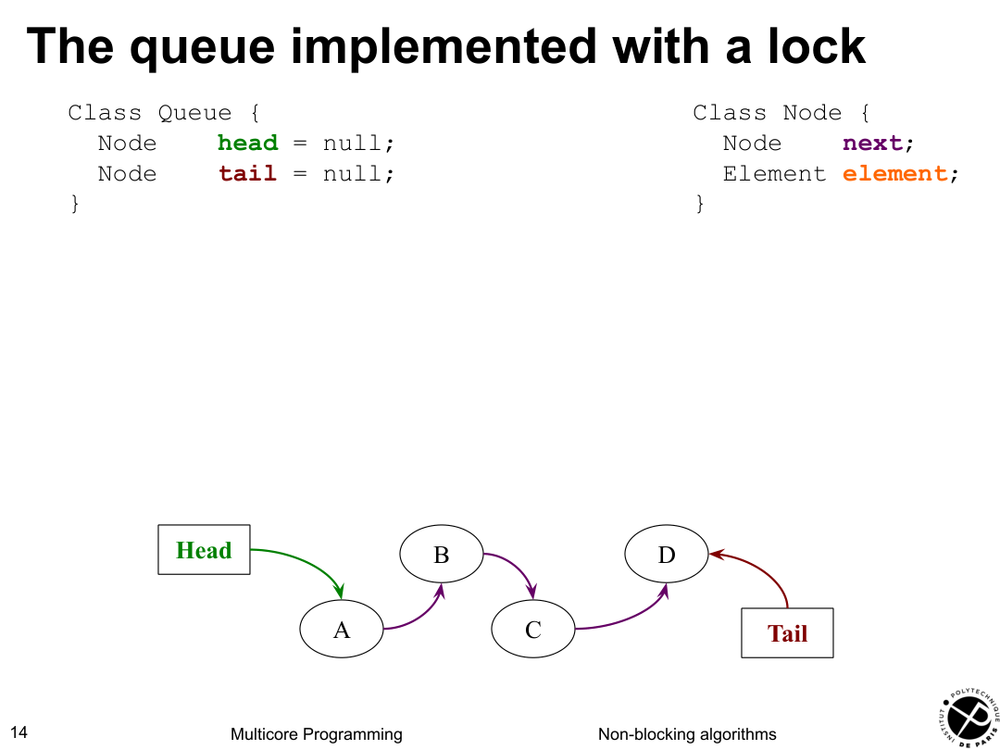

</details>

<a id="page-15"></a>

## 第 15 页 · The queue implemented with a lock

```text
Class Queue {
  Node    head = null;
  Node    tail = null;
}
```

```text
Class Node {
  Node    next;
  Element element;
}
```

```text
synchronized void Queue.enqueue(Element e) {
  Node n = new Node(null, e);
  if(tail != null) { tail.next = n; }
  else { head = n; }
  tail = n; 
}
```

E

Head D

B

A C

Tail

> 校对：FIFO、head/tail及空队列分支边界。

<details>
<summary>查看第 15 页原图（图形、代码布局与标注）</summary>

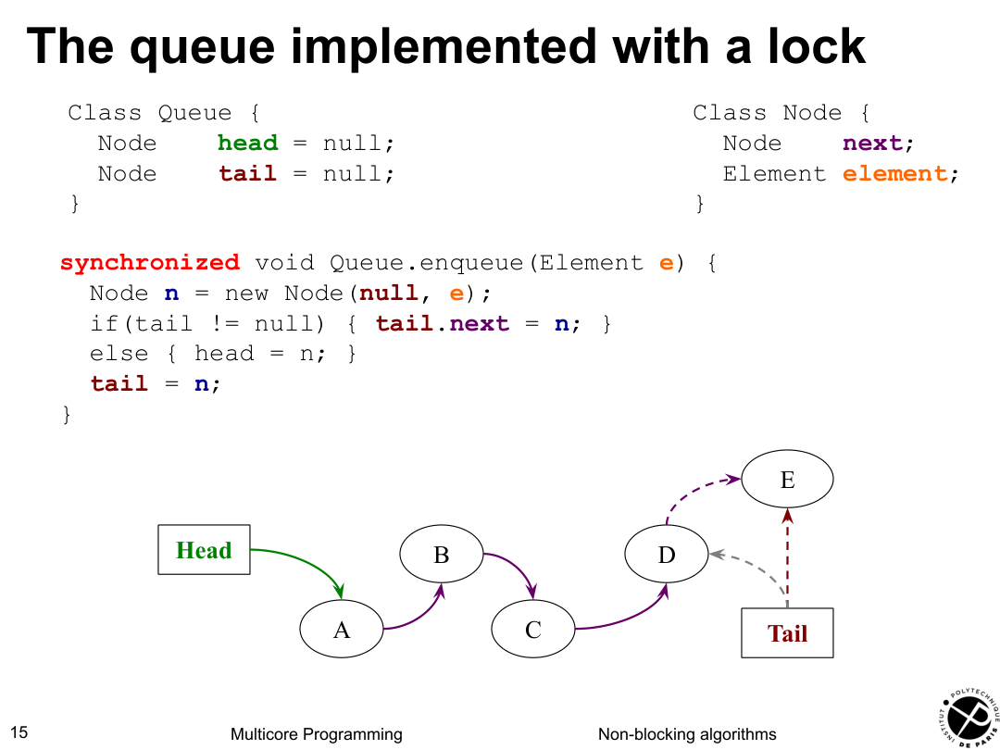

</details>

<a id="page-16"></a>

## 第 16 页 · The queue implemented with a lock

```text
Class Queue {
  Node    head = null;
  Node    tail = null;
}
```

```text
Class Node {
  Node    next;
  Element element;
}
```

```text
synchronized Element Queue.dequeue() {
  Node n = head;
  head = n.next;
  if(head == null) tail = null;
  return n.element;
}
```

Head D

B

A C

Tail

> 校对：空队列分支未展示，不当作完整实现。

<details>
<summary>查看第 16 页原图（图形、代码布局与标注）</summary>

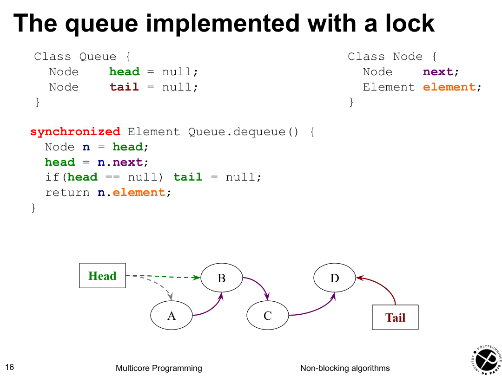

</details>

<a id="page-17"></a>

## 第 17 页 · The lock-free queue

Principles:

- Always keep a fake node in the list to simplify the initialization
- Update tail lazily
- Invariants: at each step
- The node after the head, if it exists is the first enqueued node
- The lists that start with head and tail have at least a common node
- The last node of these lists is the last enqueued node

Last

First

Head Fake

Tail can be late

Will be updated lazily during the

Tail

next enqueue

> 校对：dummy与允许滞后的tail；不能提前释放旧节点。

<details>
<summary>查看第 17 页原图（图形、代码布局与标注）</summary>

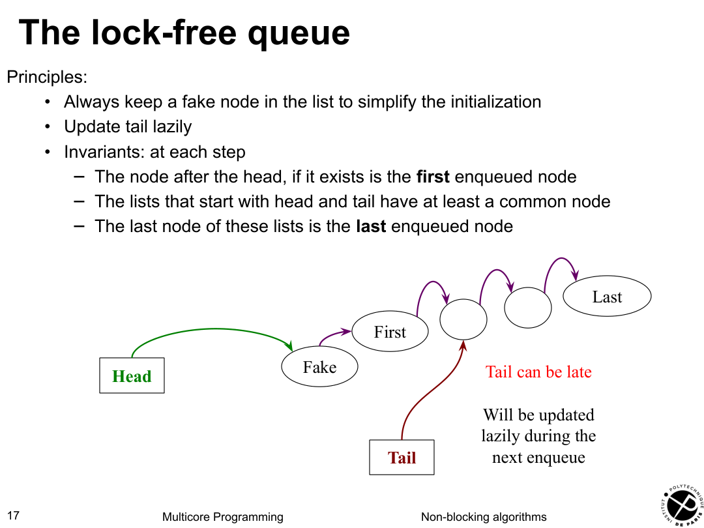

</details>

<a id="page-18"></a>

## 第 18 页 · The lock-free queue

Principles:

- Always keep a fake node in the list to simplify the initialization
- Update tail lazily
- Invariants: at each step
- The node after the head, if it exists is the first enqueued node

- The lists that start with head and tail have at least a common node
- The last node of these lists is the last enqueued node

Last

First

Head Fake

Tail could even be before first!

Tail

> 校对：dummy与允许滞后的tail；不能提前释放旧节点。

<details>
<summary>查看第 18 页原图（图形、代码布局与标注）</summary>

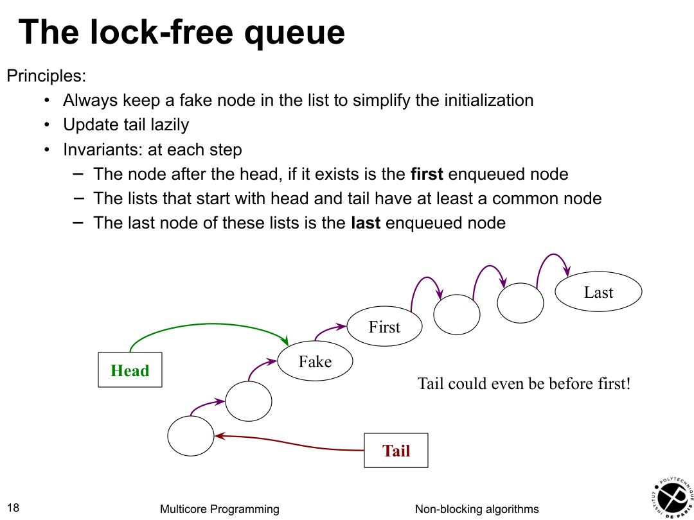

</details>

<a id="page-19"></a>

## 第 19 页 · The lock-free queue

```text
Class Queue {
  Node    head = new Node(null, null);
  Node    tail = head;
}
```

```text
Class Node {
  Node    next;
  Element element;
}
```

Fake

Head

Tail

> 校对：dummy与允许滞后的tail；不能提前释放旧节点。

<details>
<summary>查看第 19 页原图（图形、代码布局与标注）</summary>

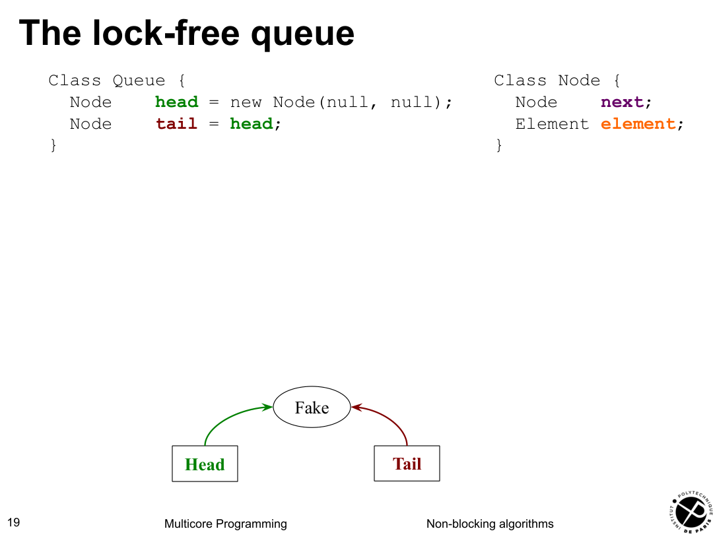

</details>

<a id="page-20"></a>

## 第 20 页 · The lock-free queue: enqueue

Enqueue A

```text
void Queue.enqueue(Element e) {
  Node node = new Node(null, e);
  do {
    Node old = tail;
    while(old.next != NULL) {
      CAS(&tail, old, old.next); old = tail; }
  } while(CAS(&old.next, null, node) != null);
```

node

```text
  CAS(&tail, old, node); 
}
```

A

Fake

Head

Tail

> 校对：末端next的成功CAS才是入队生效点。

<details>
<summary>查看第 20 页原图（图形、代码布局与标注）</summary>

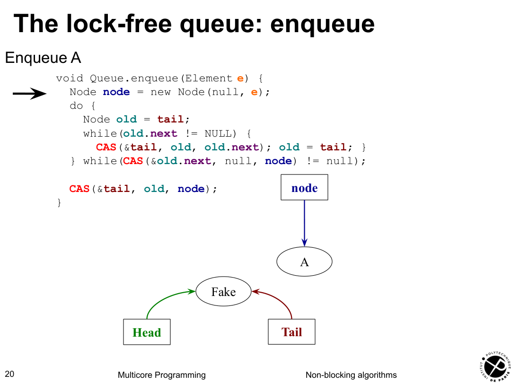

</details>

<a id="page-21"></a>

## 第 21 页 · The lock-free queue: enqueue

Enqueue A

```text
void Queue.enqueue(Element e) {
  Node node = new Node(null, e);
  do {
    Node old = tail;
    while(old.next != NULL) {
      CAS(&tail, old, old.next); old = tail; }
  } while(CAS(&old.next, null, node) != null);
```

node

```text
  CAS(&tail, old, node); 
}
```

old

A

Fake

Head

Tail

> 校对：末端next的成功CAS才是入队生效点。

<details>
<summary>查看第 21 页原图（图形、代码布局与标注）</summary>

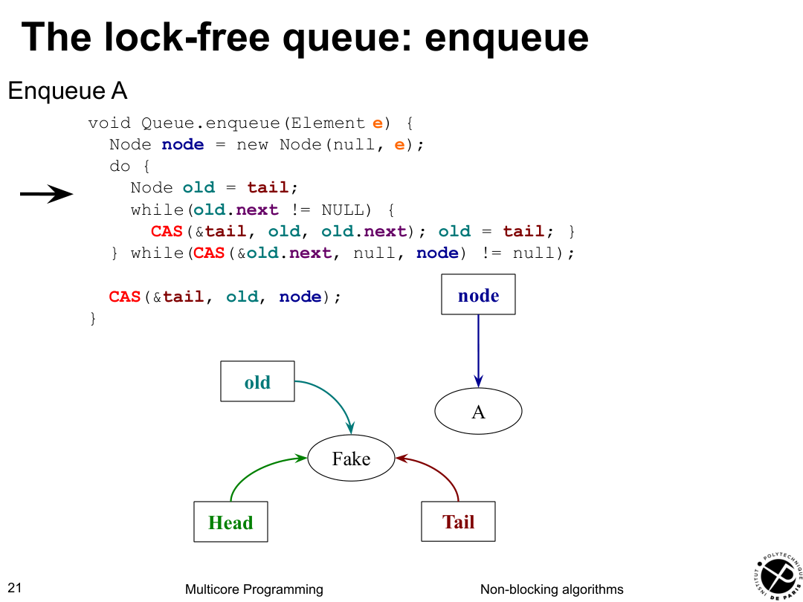

</details>

<a id="page-22"></a>

## 第 22 页 · The lock-free queue: enqueue

Enqueue A

```text
void Queue.enqueue(Element e) {
  Node node = new Node(null, e);
  do {
    Node old = tail;
    while(old.next != NULL) {
      CAS(&tail, old, old.next); old = tail; }
  } while(CAS(&old.next, null, node) != null);
```

node

```text
  CAS(&tail, old, node); 
}
```

old

A

Fake

Head

Tail

> 校对：末端next的成功CAS才是入队生效点。

<details>
<summary>查看第 22 页原图（图形、代码布局与标注）</summary>

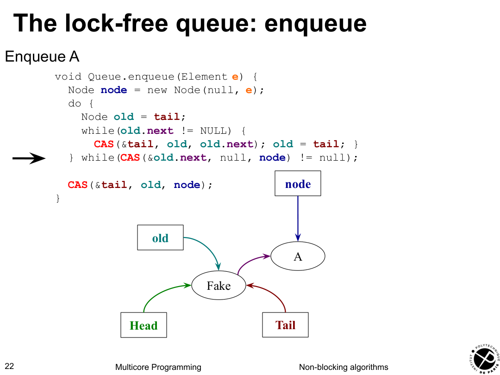

</details>

<a id="page-23"></a>

## 第 23 页 · The lock-free queue: enqueue

Enqueue A

```text
void Queue.enqueue(Element e) {
  Node node = new Node(null, e);
  do {
    Node old = tail;
    while(old.next != NULL) {
      CAS(&tail, old, old.next); old = tail; }
  } while(CAS(&old.next, null, node) != null);
```

node

```text
  CAS(&tail, old, node); 
}
```

old

A

Fake

Head

Tail

> 校对：末端next的成功CAS才是入队生效点。

<details>
<summary>查看第 23 页原图（图形、代码布局与标注）</summary>

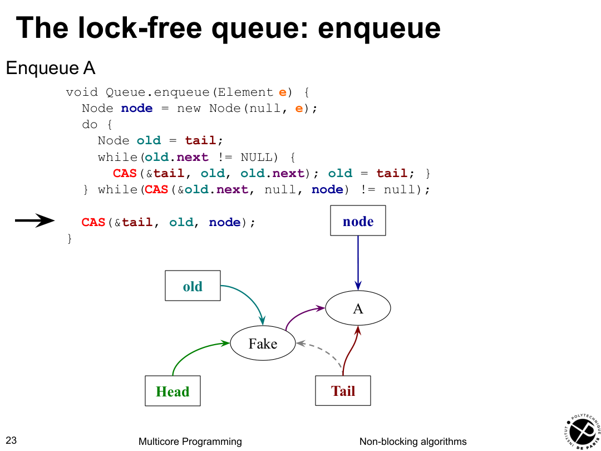

</details>

<a id="page-24"></a>

## 第 24 页 · The lock-free queue: enqueue

Enqueue C and B in parallel

```text
void Queue.enqueue(Element e) {
  Node node = new Node(null, e);
  do {
    Node old = tail;
    while(old.next != NULL) {
      CAS(&tail, old, old.next); old = tail; }
  } while(CAS(&old.next, null, node) != null);
```

node

```text
  CAS(&tail, old, node); 
}
```

C

A

Fake

Head

Tail

> 校对：逐页保存动画；冲突、帮助tail追赶、再次链接。

<details>
<summary>查看第 24 页原图（图形、代码布局与标注）</summary>

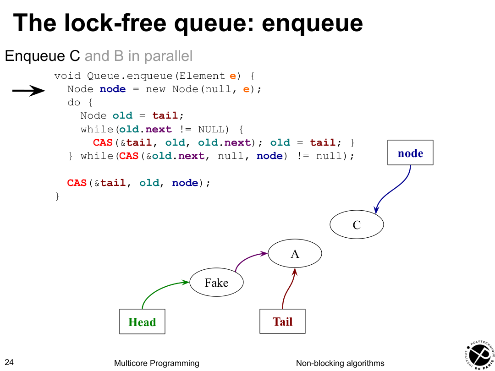

</details>

<a id="page-25"></a>

## 第 25 页 · The lock-free queue: enqueue

Enqueue C and B in parallel

```text
void Queue.enqueue(Element e) {
  Node node = new Node(null, e);
  do {
    Node old = tail;
    while(old.next != NULL) {
      CAS(&tail, old, old.next); old = tail; }
  } while(CAS(&old.next, null, node) != null);
```

node

```text
  CAS(&tail, old, node); 
}
```

old

C

A

Fake

Head

Tail

> 校对：逐页保存动画；冲突、帮助tail追赶、再次链接。

<details>
<summary>查看第 25 页原图（图形、代码布局与标注）</summary>

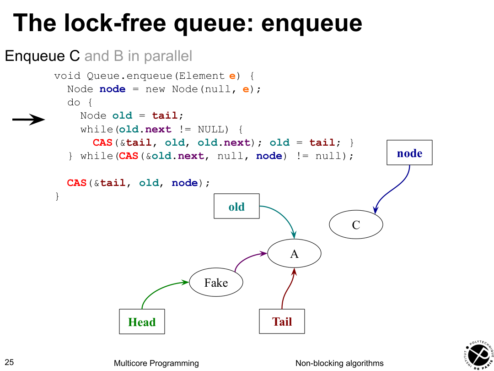

</details>

<a id="page-26"></a>

## 第 26 页 · The lock-free queue: enqueue

Enqueue C and B in parallel

```text
void Queue.enqueue(Element e) {
  Node node = new Node(null, e);
  do {
    Node old = tail;
    while(old.next != NULL) {
      CAS(&tail, old, old.next); old = tail; }
  } while(CAS(&old.next, null, node) != null);
```

```text
  CAS(&tail, old, node); 
}
```

node

C

A

B

Fake

Head

Tail

> 校对：逐页保存动画；冲突、帮助tail追赶、再次链接。

<details>
<summary>查看第 26 页原图（图形、代码布局与标注）</summary>

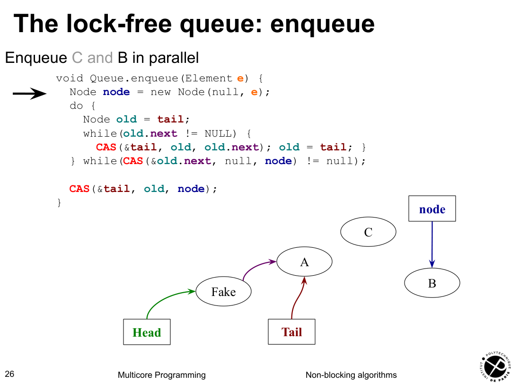

</details>

<a id="page-27"></a>

## 第 27 页 · The lock-free queue: enqueue

Enqueue C and B in parallel

```text
void Queue.enqueue(Element e) {
  Node node = new Node(null, e);
  do {
    Node old = tail;
    while(old.next != NULL) {
      CAS(&tail, old, old.next); old = tail; }
  } while(CAS(&old.next, null, node) != null);
```

```text
  CAS(&tail, old, node); 
}
```

node old

C

A

B

Fake

Head

Tail

> 校对：逐页保存动画；冲突、帮助tail追赶、再次链接。

<details>
<summary>查看第 27 页原图（图形、代码布局与标注）</summary>

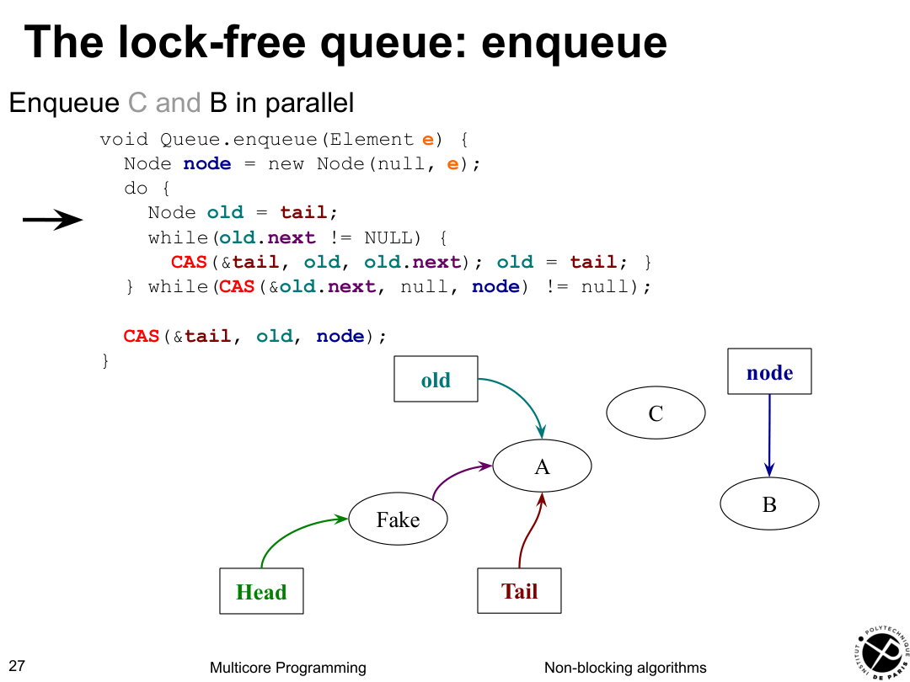

</details>

<a id="page-28"></a>

## 第 28 页 · The lock-free queue: enqueue

Enqueue C and B in parallel

```text
void Queue.enqueue(Element e) {
  Node node = new Node(null, e);
  do {
    Node old = tail;
    while(old.next != NULL) {
      CAS(&tail, old, old.next); old = tail; }
  } while(CAS(&old.next, null, node) != null);
```

```text
  CAS(&tail, old, node); 
}
```

node old

C

A

B

Fake

Head

Tail

> 校对：逐页保存动画；冲突、帮助tail追赶、再次链接。

<details>
<summary>查看第 28 页原图（图形、代码布局与标注）</summary>

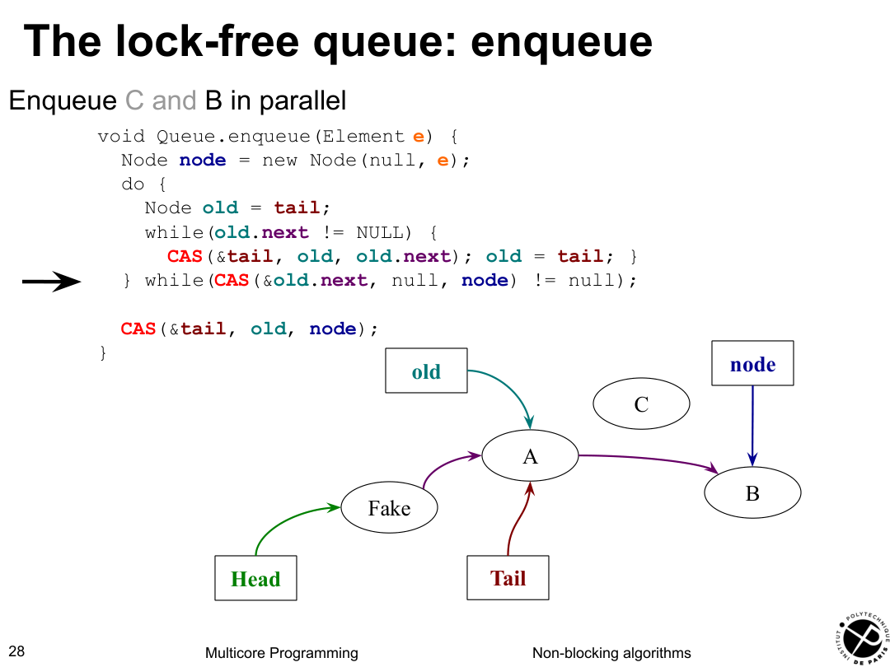

</details>

<a id="page-29"></a>

## 第 29 页 · The lock-free queue: enqueue

Enqueue C and B in parallel

```text
void Queue.enqueue(Element e) {
  Node node = new Node(null, e);
  do {
    Node old = tail;
    while(old.next != NULL) {
      CAS(&tail, old, old.next); old = tail; }
  } while(CAS(&old.next, null, node) != null);
```

```text
  CAS(&tail, old, node); 
}
```

node old

C

A

B

Fake

Head

Tail

> 校对：逐页保存动画；冲突、帮助tail追赶、再次链接。

<details>
<summary>查看第 29 页原图（图形、代码布局与标注）</summary>

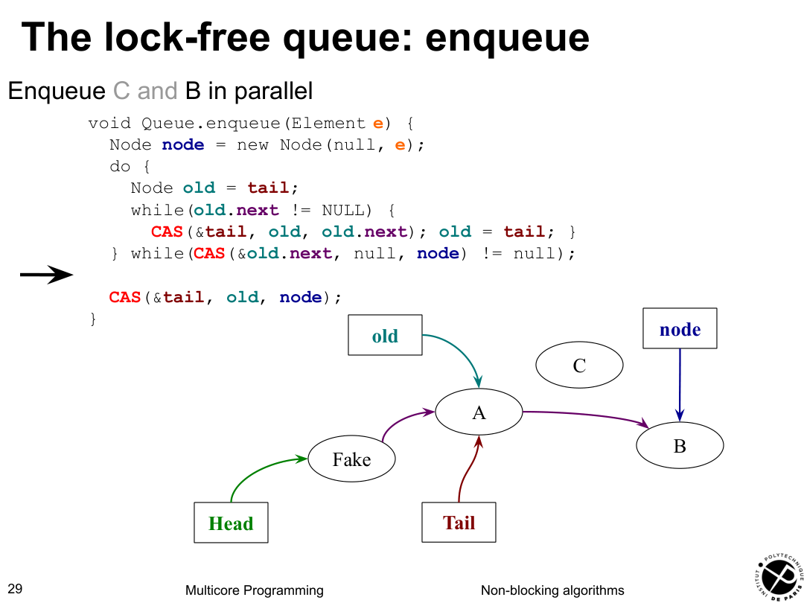

</details>

<a id="page-30"></a>

## 第 30 页 · The lock-free queue: enqueue

Enqueue C and B in parallel

```text
void Queue.enqueue(Element e) {
  Node node = new Node(null, e);
  do {
    Node old = tail;
    while(old.next != NULL) {
      CAS(&tail, old, old.next); old = tail; }
  } while(CAS(&old.next, null, node) != null);
```

node

```text
  CAS(&tail, old, node); 
}
```

old

C

A

B

Fake

Head

Tail

> 校对：逐页保存动画；冲突、帮助tail追赶、再次链接。

<details>
<summary>查看第 30 页原图（图形、代码布局与标注）</summary>

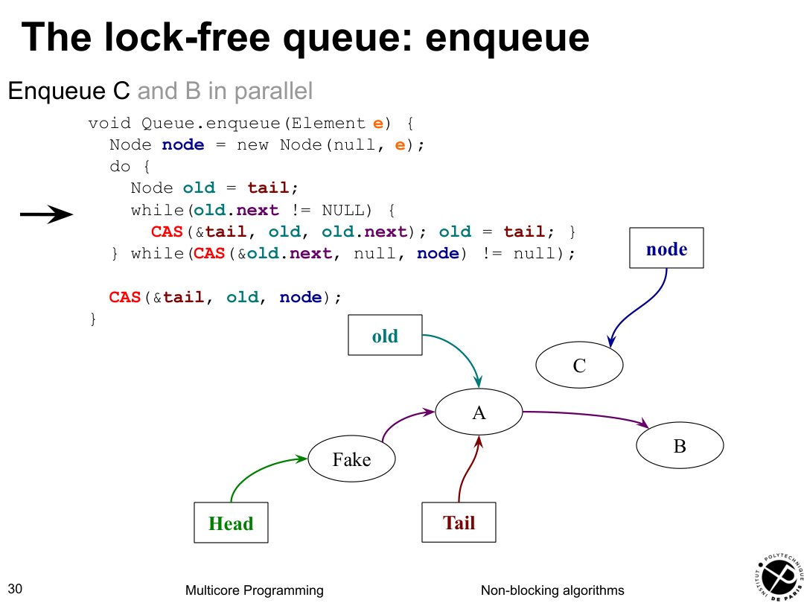

</details>

<a id="page-31"></a>

## 第 31 页 · The lock-free queue: enqueue

Enqueue C and B in parallel

```text
void Queue.enqueue(Element e) {
  Node node = new Node(null, e);
  do {
    Node old = tail;
    while(old.next != NULL) {
      CAS(&tail, old, old.next); old = tail; }
  } while(CAS(&old.next, null, node) != null);
```

C pend en charge l’avancement

de tail pour B

node

```text
  CAS(&tail, old, node); 
}
```

old

C

A

B

Fake

Head

Tail

> 校对：法语注释为C帮助B移动tail；不是代码。

<details>
<summary>查看第 31 页原图（图形、代码布局与标注）</summary>

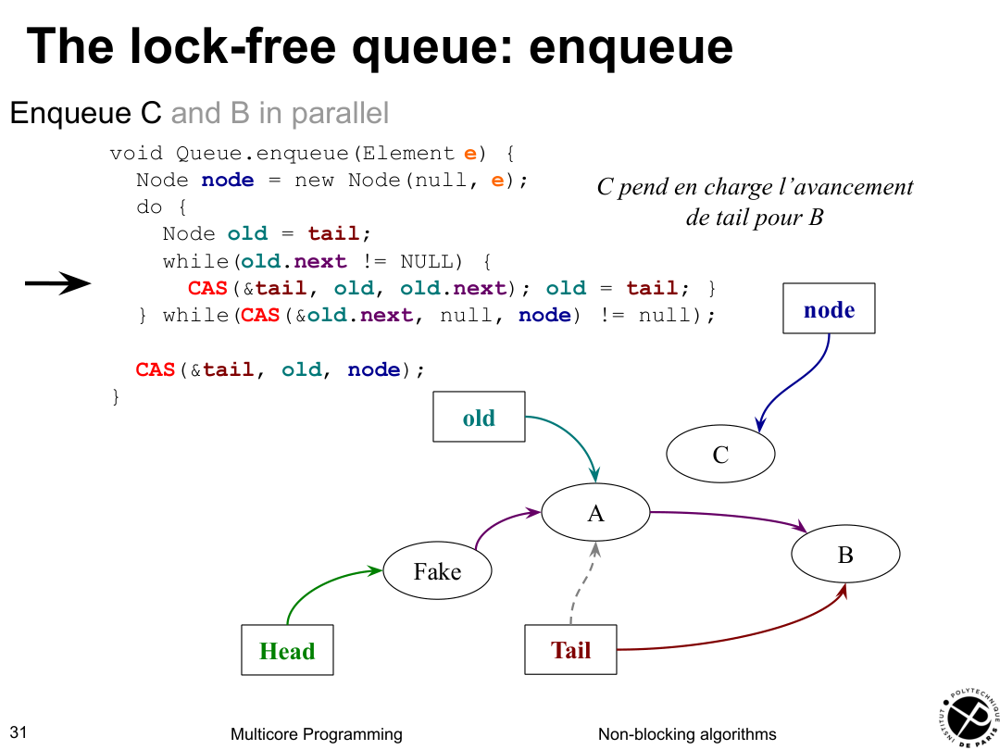

</details>

<a id="page-32"></a>

## 第 32 页 · The lock-free queue: enqueue

Enqueue C and B in parallel

```text
void Queue.enqueue(Element e) {
  Node node = new Node(null, e);
  do {
    Node old = tail;
    while(old.next != NULL) {
      CAS(&tail, old, old.next); old = tail; }
  } while(CAS(&old.next, null, node) != null);
```

node

```text
  CAS(&tail, old, node); 
}
```

old

C

A

B

Fake

Head

Tail

> 校对：逐页保存动画；冲突、帮助tail追赶、再次链接。

<details>
<summary>查看第 32 页原图（图形、代码布局与标注）</summary>

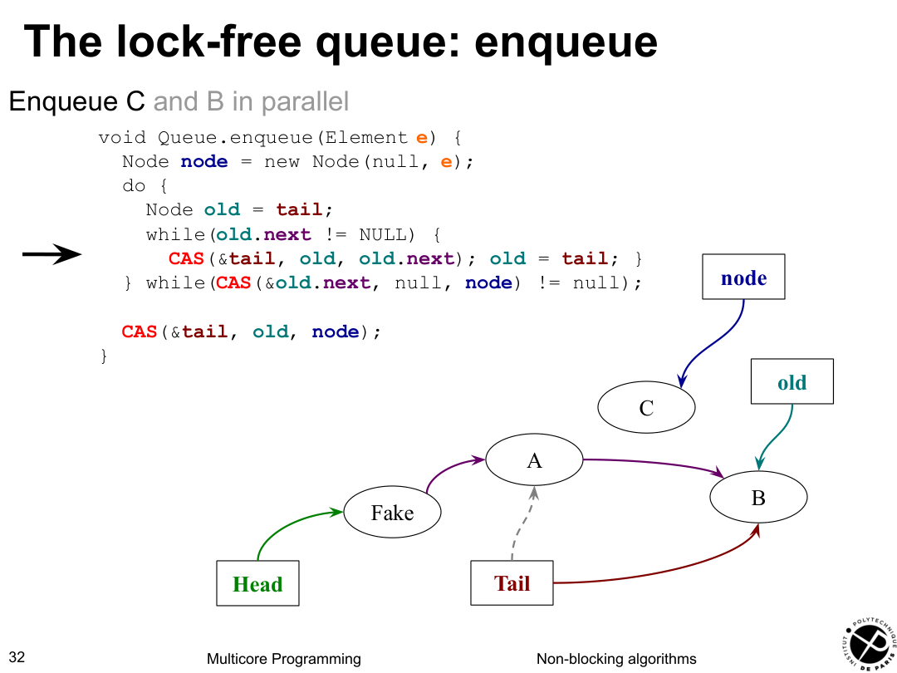

</details>

<a id="page-33"></a>

## 第 33 页 · The lock-free queue: enqueue

Enqueue C and B in parallel

```text
void Queue.enqueue(Element e) {
  Node node = new Node(null, e);
  do {
    Node old = tail;
    while(old.next != NULL) {
      CAS(&tail, old, old.next); old = tail; }
  } while(CAS(&old.next, null, node) != null);
```

node

```text
  CAS(&tail, old, node); 
}
```

old

C

A

B

Fake

Head

Tail

> 校对：逐页保存动画；冲突、帮助tail追赶、再次链接。

<details>
<summary>查看第 33 页原图（图形、代码布局与标注）</summary>

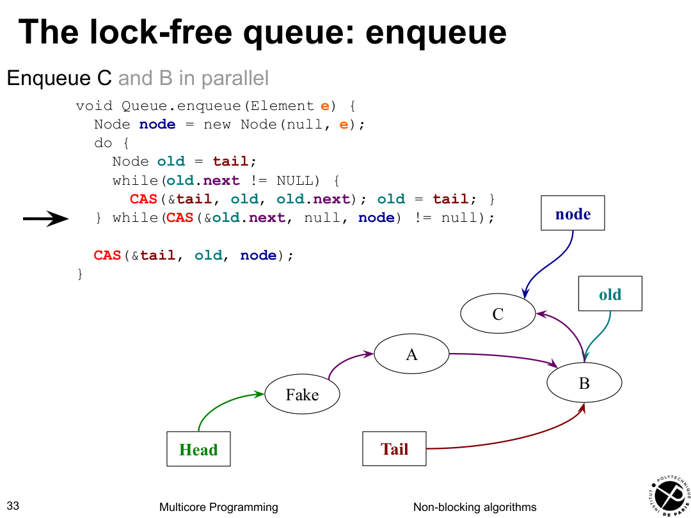

</details>

<a id="page-34"></a>

## 第 34 页 · The lock-free queue: enqueue

Enqueue C and B in parallel

```text
void Queue.enqueue(Element e) {
  Node node = new Node(null, e);
  do {
    Node old = tail;
    while(old.next != NULL) {
      CAS(&tail, old, old.next); old = tail; }
  } while(CAS(&old.next, null, node) != null);
```

node

```text
  CAS(&tail, old, node); 
}
```

old

C

A

B

Fake

Head

Tail

> 校对：逐页保存动画；冲突、帮助tail追赶、再次链接。

<details>
<summary>查看第 34 页原图（图形、代码布局与标注）</summary>

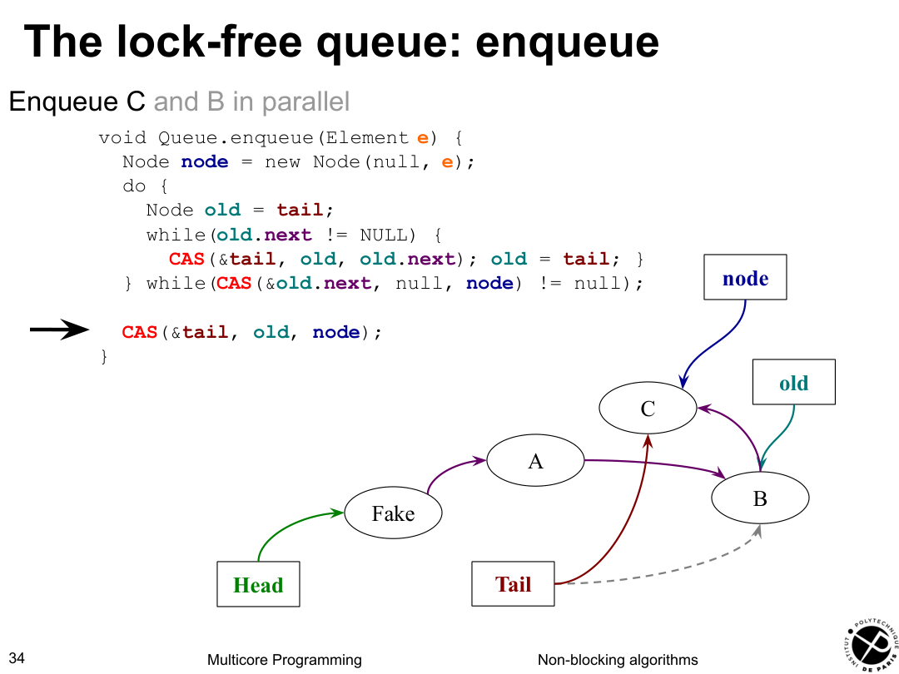

</details>

<a id="page-35"></a>

## 第 35 页 · The lock-free queue: enqueue

Enqueue C and B in parallel

```text
void Queue.enqueue(Element e) {
  Node node = new Node(null, e);
  do {
    Node old = tail;
    while(old.next != NULL) {
      CAS(&tail, old, old.next); old = tail; }
  } while(CAS(&old.next, null, node) != null);
```

```text
  CAS(&tail, old, node); 
}
```

node old

C

A

B

Fake

Head

Tail

> 校对：逐页保存动画；冲突、帮助tail追赶、再次链接。

<details>
<summary>查看第 35 页原图（图形、代码布局与标注）</summary>

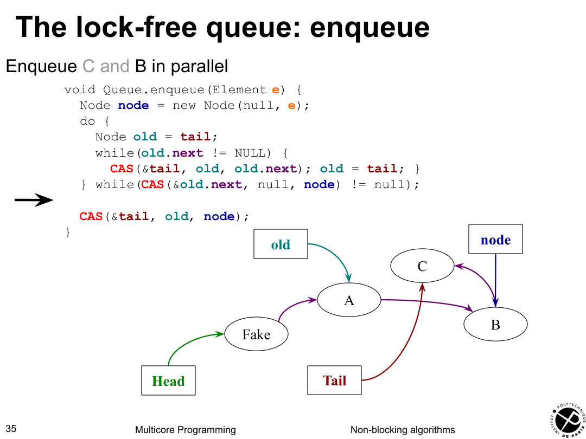

</details>

<a id="page-36"></a>

## 第 36 页 · The lock-free queue: enqueue

Enqueue C and B in parallel

```text
void Queue.enqueue(Element e) {
  Node node = new Node(null, e);
  do {
    Node old = tail;
    while(old.next != NULL) {
      CAS(&tail, old, old.next); old = tail; }
  } while(CAS(&old.next, null, node) != null);
```

```text
  CAS(&tail, old, node); 
}
```

node old

C

A

B

Fake

Head

Tail

> 校对：逐页保存动画；冲突、帮助tail追赶、再次链接。

<details>
<summary>查看第 36 页原图（图形、代码布局与标注）</summary>

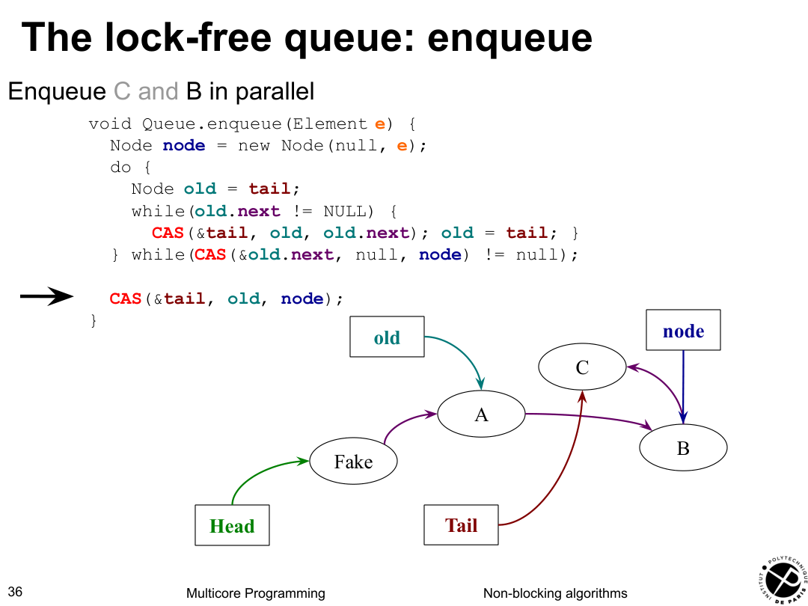

</details>

<a id="page-37"></a>

## 第 37 页 · The lock-free queue: dequeue

```text
Element Queue.dequeue() {
  do {
    Node res = head;
    if(res.next == null) return null;
  } while(CAS(&head, res, res.next) != res);
```

```text
  return res.next.value;
}
```

C

res

A

B

Fake

Head

Tail

> 校对：新哨兵和返回值；value/element原文命名不一致。

<details>
<summary>查看第 37 页原图（图形、代码布局与标注）</summary>

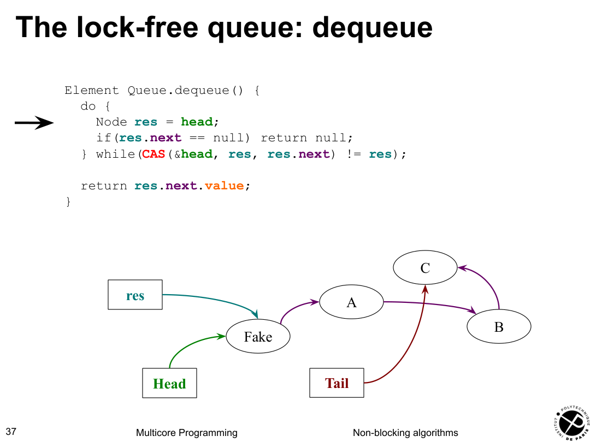

</details>

<a id="page-38"></a>

## 第 38 页 · The lock-free queue: dequeue

```text
Element Queue.dequeue() {
  do {
    Node res = head;
    if(res.next == null) return null;
  } while(CAS(&head, res, res.next) != res);
```

```text
  return res.next.value;
}
```

C

res

A

B

Fake

Head

Tail

> 校对：新哨兵和返回值；value/element原文命名不一致。

<details>
<summary>查看第 38 页原图（图形、代码布局与标注）</summary>


</details>

<a id="page-39"></a>

## 第 39 页 · The lock-free queue: dequeue

```text
Element Queue.dequeue() {
  do {
    Node res = head;
    if(res.next == null) return null;
  } while(CAS(&head, res, res.next) != res);
```

```text
  return res.next.value;
}
```

New fake

C

node

res

A

B

Fake

Head

Tail

> 校对：value与element原文字段不一致。

<details>
<summary>查看第 39 页原图（图形、代码布局与标注）</summary>

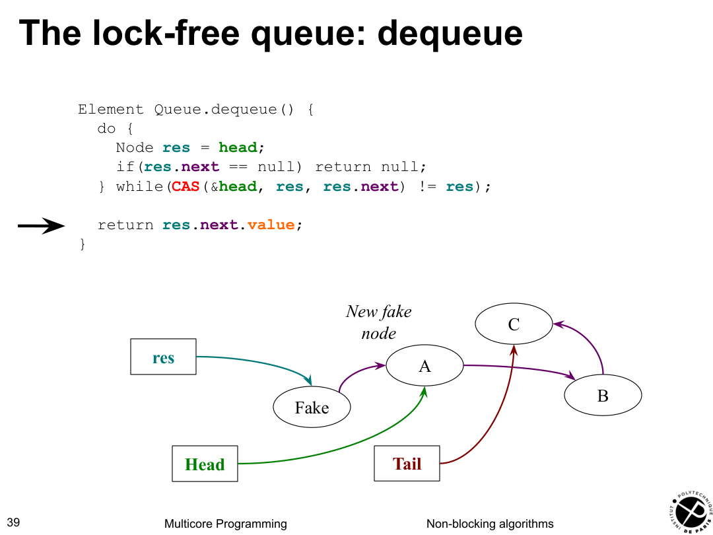

</details>

<a id="page-40"></a>

## 第 40 页 · The lock-free queue

Lock-free: if the threads call infinitely often enqueue or dequeue, enqueue or

dequeue are executed infinitely often (proof: an enqueue or a queue has to succeed to make the CAS of another enqueue or dequeue fail)

Not wait-free: we can always delay an enqueue with another enqueue that

makes the CAS fails

> 校对：辅助tail CAS不能一概等同完整操作结束。

<details>
<summary>查看第 40 页原图（图形、代码布局与标注）</summary>

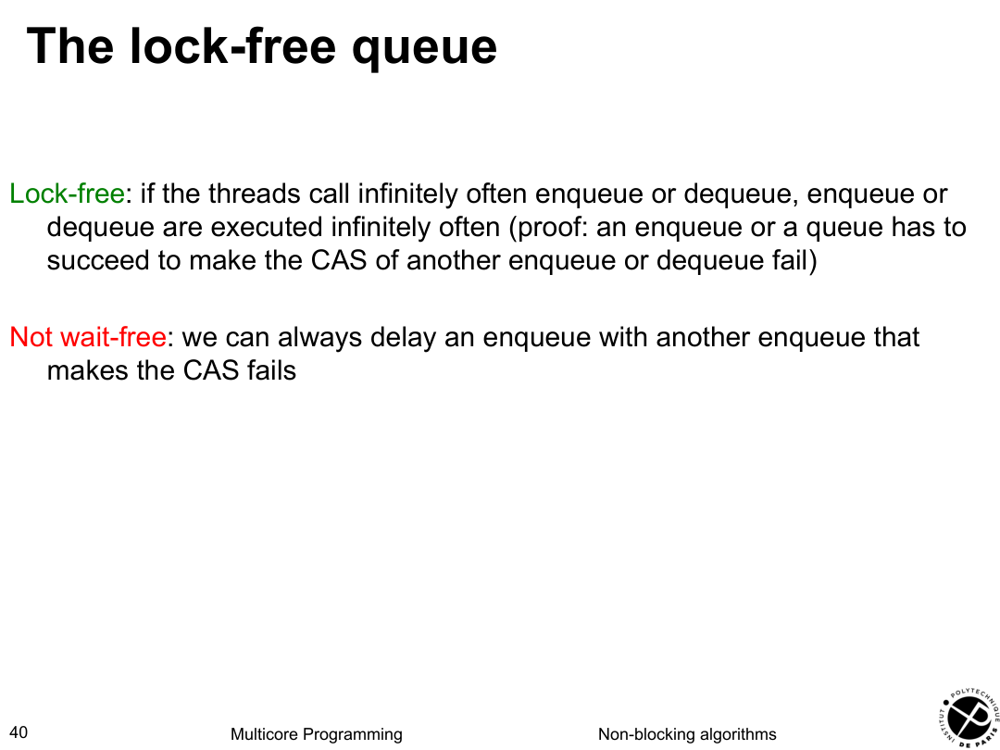

</details>

<a id="page-41"></a>

## 第 41 页 · Non-blocking data structures

1. The stack

2. The queue

3. The linked list

> 校对：逻辑删除标记嵌入自身next；不是立即free。

<details>
<summary>查看第 41 页原图（图形、代码布局与标注）</summary>

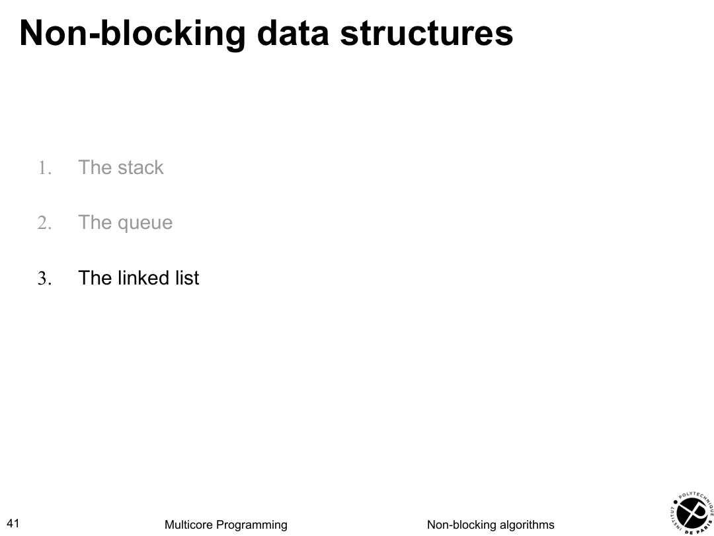

</details>

<a id="page-42"></a>

## 第 42 页 · The linked list

Main problem: insert and remove at the same place

X

B

A

C

Liste

> 校对：逻辑删除标记嵌入自身next；不是立即free。

<details>
<summary>查看第 42 页原图（图形、代码布局与标注）</summary>

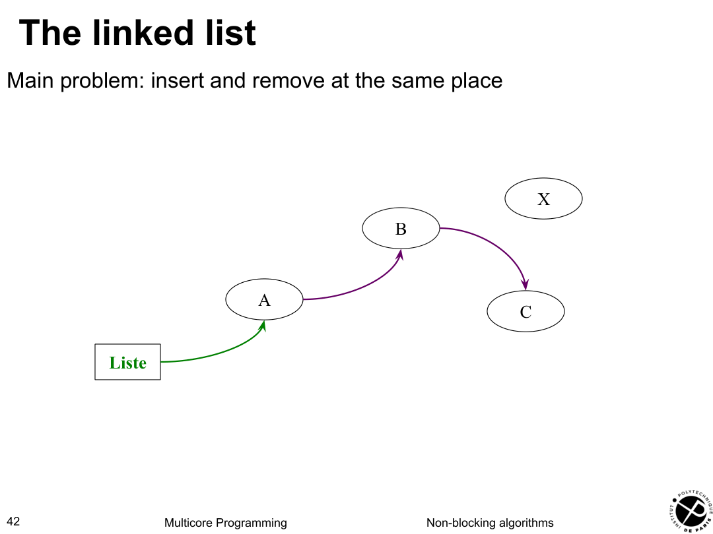

</details>

<a id="page-43"></a>

## 第 43 页 · The linked list

Main problem: insert and remove at the same place

Insertion location

X

B

A

C

Liste

> 校对：逻辑删除标记嵌入自身next；不是立即free。

<details>
<summary>查看第 43 页原图（图形、代码布局与标注）</summary>

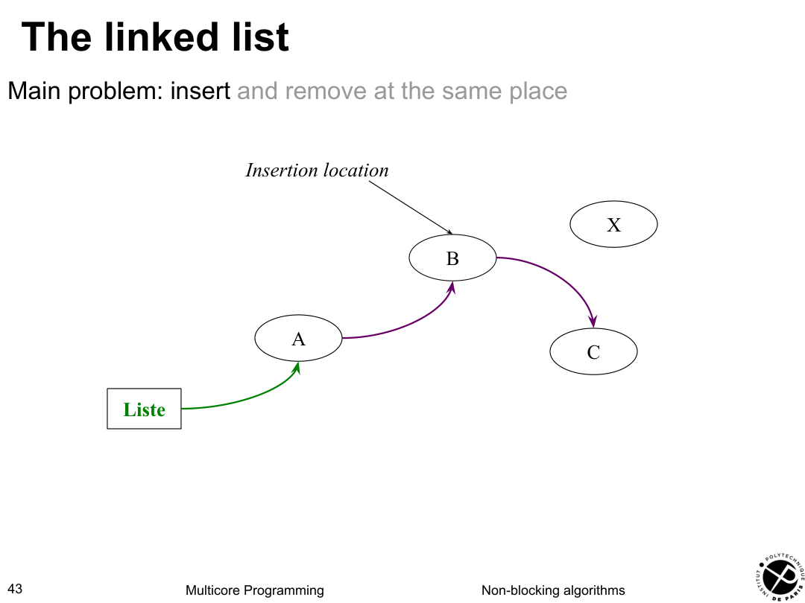

</details>

<a id="page-44"></a>

## 第 44 页 · The linked list

Main problem: insert and remove at the same place

Insertion location

X

B

A

C

Liste

> 校对：逻辑删除标记嵌入自身next；不是立即free。

<details>
<summary>查看第 44 页原图（图形、代码布局与标注）</summary>

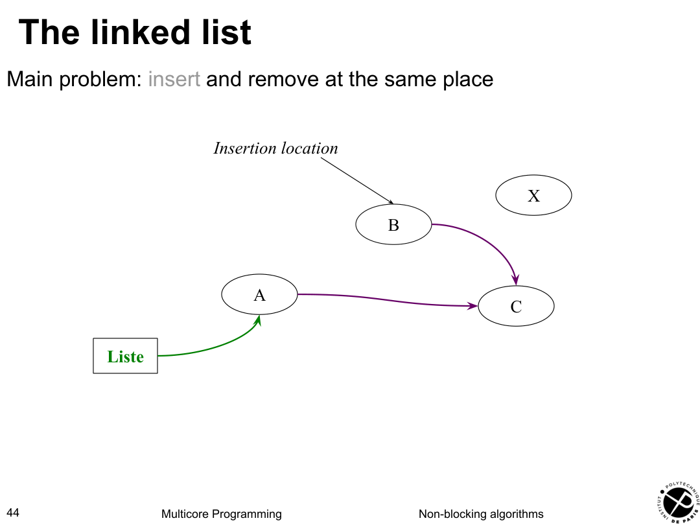

</details>

<a id="page-45"></a>

## 第 45 页 · The linked list

Main problem: insert and remove at the same place

Insertion location

X

B

A

C

Liste

> 校对：逻辑删除标记嵌入自身next；不是立即free。

<details>
<summary>查看第 45 页原图（图形、代码布局与标注）</summary>

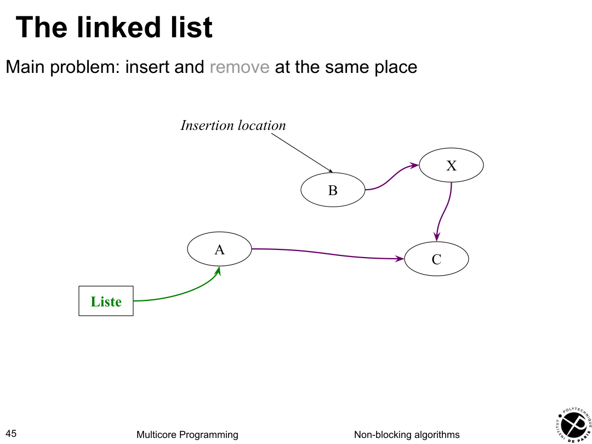

</details>

<a id="page-46"></a>

## 第 46 页 · The linked list

Principle (Tim Harris, DISC 2001)

- Each node has a color
- A white node is present, a grey node is deleted
- If the color of a node changes during an insertion, restart

X

B

A

C

Liste

> 校对：逻辑删除标记嵌入自身next；不是立即free。

<details>
<summary>查看第 46 页原图（图形、代码布局与标注）</summary>

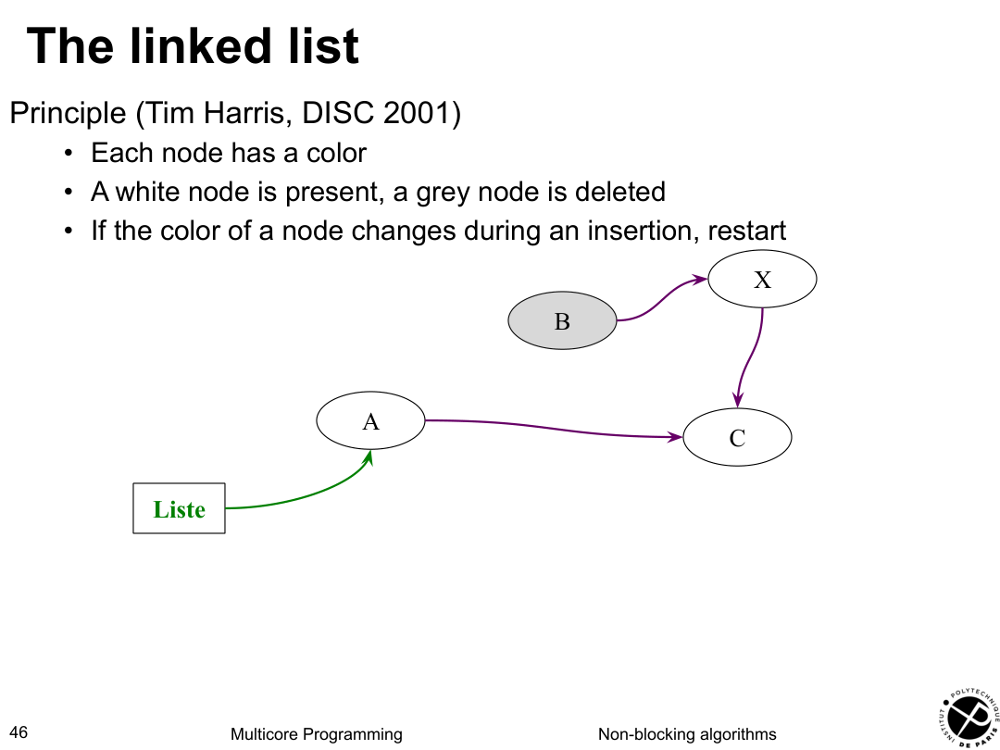

</details>

<a id="page-47"></a>

## 第 47 页 · The linked list

Principle (Tim Harris, DISC 2001)

- Each node has a color
- A white node is present, a grey node is deleted
- If the color of a node changes during an insertion, restart

X

B

CAS

C

Problem:

- If we CAS the next pointer, we can not see if a color changes

Solution:

- Embeds the color in the next pointer

> 校对：逻辑删除标记嵌入自身next；不是立即free。

<details>
<summary>查看第 47 页原图（图形、代码布局与标注）</summary>

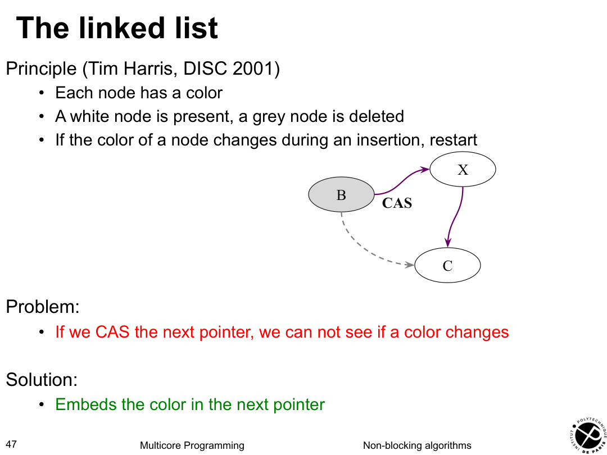

</details>

<a id="page-48"></a>

## 第 48 页 · The linked list

```text
typedef uintptr_t coloredPointer;
```

```text
Node pointer(coloredPointer ptr) { return (Node)(ptr & -2); }
int mark(coloredPointer ptr) { return ptr & 1; }
```

```text
Class Node {
  coloredPointer next;
  Element        element;
};
```

- 

Ideas:

- In order to delete a node, marks it grey (modify its coloredPointer)
- When a thread find a deleted node during an insert or a delete, try to remove it from the list (garbage collect)

> 校对：最低位标记依赖对齐；摘链不等于释放。

<details>
<summary>查看第 48 页原图（图形、代码布局与标注）</summary>

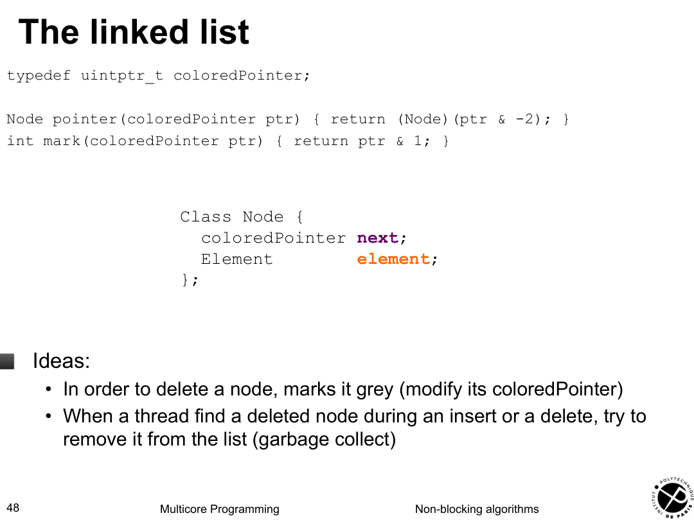

</details>

<a id="page-49"></a>

## 第 49 页 · Delete: the traversal

```text
void del(coloredPointer* plist, int value) {
restart:
  coloredPointer* pred = plist;
  while(!found) {
    Node cur = pointer(*pred);
```

12 17 22 root

plist

```text
    pred = &cur->next;
  } }
```

> 校对：pred是链接地址；帮助摘链成功后留在同一pred。

<details>
<summary>查看第 49 页原图（图形、代码布局与标注）</summary>

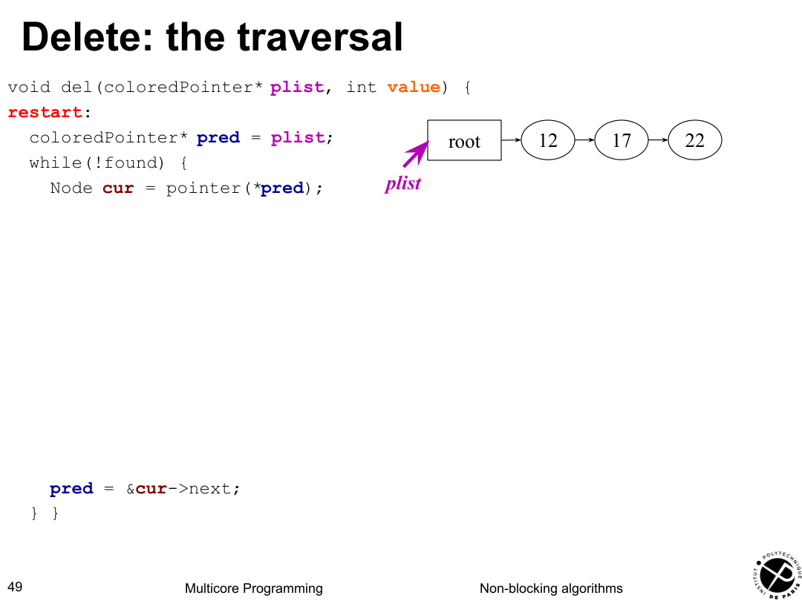

</details>

<a id="page-50"></a>

## 第 50 页 · Delete: the traversal

```text
void del(coloredPointer* plist, int value) {
restart:
  coloredPointer* pred = plist;
  while(!found) {
    Node cur = pointer(*pred);
```

12 17 22 root

pred

plist

```text
    pred = &cur->next;
  } }
```

> 校对：pred是链接地址；帮助摘链成功后留在同一pred。

<details>
<summary>查看第 50 页原图（图形、代码布局与标注）</summary>

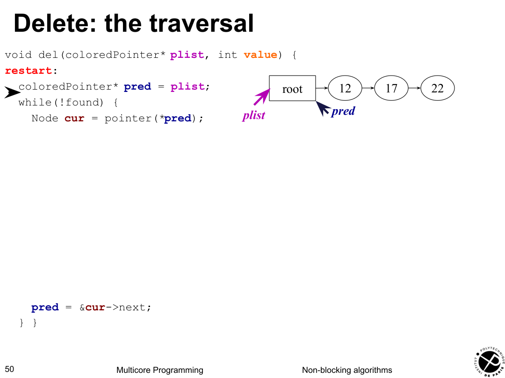

</details>

<a id="page-51"></a>

## 第 51 页 · Delete: the traversal

```text
void del(coloredPointer* plist, int value) {
restart:
  coloredPointer* pred = plist;
  while(!found) {
    Node cur = pointer(*pred);
```

cur

12 17 22 root

pred

plist

```text
    pred = &cur->next;
  } }
```

> 校对：pred是链接地址；帮助摘链成功后留在同一pred。

<details>
<summary>查看第 51 页原图（图形、代码布局与标注）</summary>

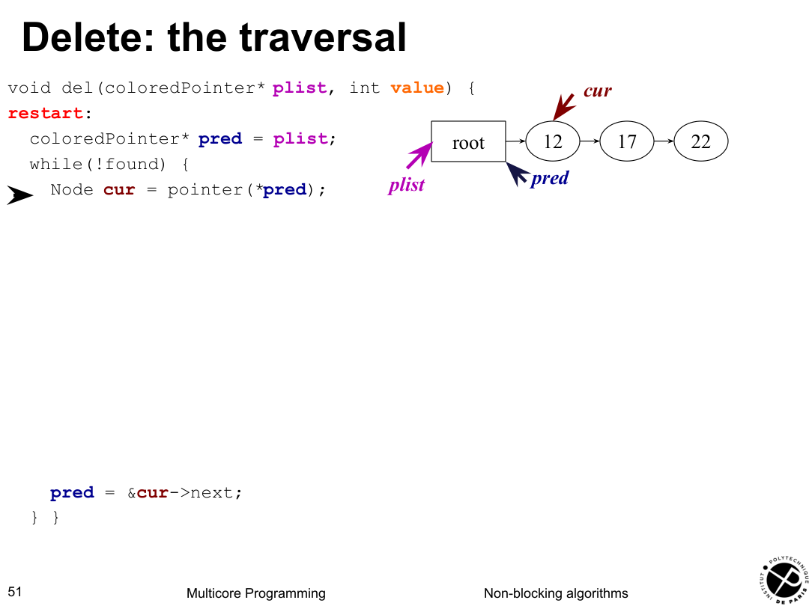

</details>

<a id="page-52"></a>

## 第 52 页 · Delete: the traversal

```text
void del(coloredPointer* plist, int value) {
restart:
  coloredPointer* pred = plist;
  while(!found) {
    Node cur = pointer(*pred);
```

cur

12 17 22 root

plist

pred

```text
    pred = &cur->next;
  } }
```

> 校对：pred是链接地址；帮助摘链成功后留在同一pred。

<details>
<summary>查看第 52 页原图（图形、代码布局与标注）</summary>

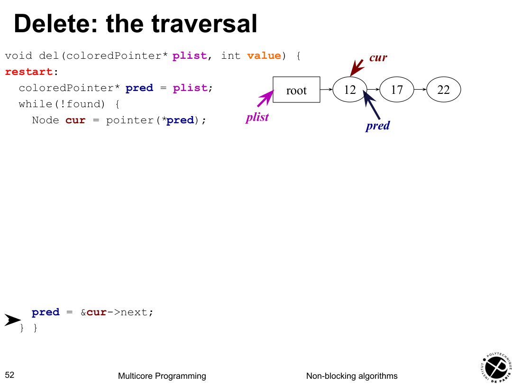

</details>

<a id="page-53"></a>

## 第 53 页 · Delete: the traversal

```text
void del(coloredPointer* plist, int value) {
restart:
  coloredPointer* pred = plist;
  while(!found) {
    Node cur = pointer(*pred);
```

cur

12 17 22 root

plist

pred

```text
    pred = &cur->next;
  } }
```

> 校对：pred是链接地址；帮助摘链成功后留在同一pred。

<details>
<summary>查看第 53 页原图（图形、代码布局与标注）</summary>

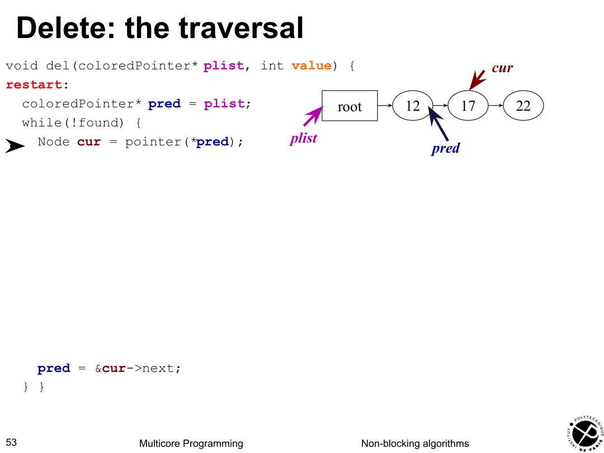

</details>

<a id="page-54"></a>

## 第 54 页 · Delete: remove the deleted nodes

```text
void del(coloredPointer* plist, int value) {
restart:
  coloredPointer* pred = plist;
  while(!found) {
    Node cur = pointer(*pred);
```

cur

12 17 22 root

plist

pred

Principle: opportunistically remove the deleted nodes

```text
    if(mark(cur->next)) {                 /* cur is deleted */
      if(CAS(pred, cur, pointer(cur->next)) != cur) goto restart;
      else continue;
    }
    pred = &cur->next;
  } }
```

> 校对：pred是链接地址；帮助摘链成功后留在同一pred。

<details>
<summary>查看第 54 页原图（图形、代码布局与标注）</summary>

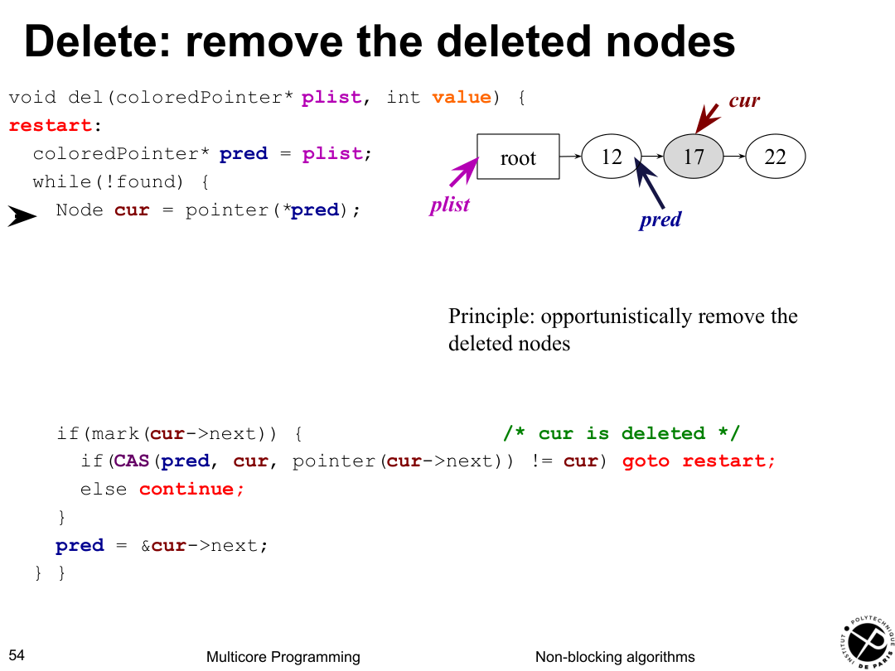

</details>

<a id="page-55"></a>

## 第 55 页 · Delete: remove the deleted nodes

```text
void del(coloredPointer* plist, int value) {
restart:
  coloredPointer* pred = plist;
  while(!found) {
    Node cur = pointer(*pred);
```

cur

12 17 22 root

plist

pred

Principle: opportunistically remove the deleted nodes

```text
    if(mark(cur->next)) {                 /* cur is deleted */
      if(CAS(pred, cur, pointer(cur->next)) != cur) goto restart;
      else continue;
    }
    pred = &cur->next;
  } }
```

> 校对：pred是链接地址；帮助摘链成功后留在同一pred。

<details>
<summary>查看第 55 页原图（图形、代码布局与标注）</summary>

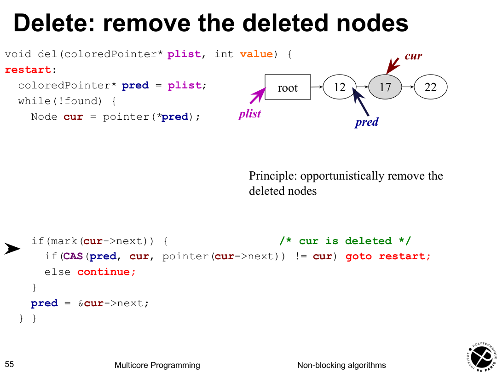

</details>

<a id="page-56"></a>

## 第 56 页 · Delete: remove the deleted nodes

```text
void del(coloredPointer* plist, int value) {
restart:
  coloredPointer* pred = plist;
  while(!found) {
    Node cur = pointer(*pred);
```

cur

12 17 22 root

plist

pred

Principle: opportunistically remove the deleted nodes

```text
    if(mark(cur->next)) {                 /* cur is deleted */
      if(CAS(pred, cur, pointer(cur->next)) != cur) goto restart;
      else continue;
    }
    pred = &cur->next;
  } }
```

The CAS can fail because

pred is concurrently marked grey A new node is inserted after pred

> 校对：pred是链接地址；帮助摘链成功后留在同一pred。

<details>
<summary>查看第 56 页原图（图形、代码布局与标注）</summary>

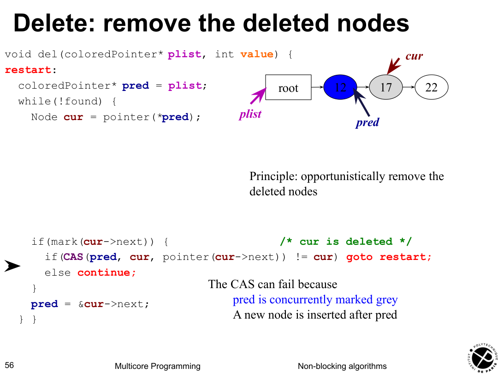

</details>

<a id="page-57"></a>

## 第 57 页 · Delete: remove the deleted nodes

```text
void del(coloredPointer* plist, int value) {
restart:
  coloredPointer* pred = plist;
  while(!found) {
    Node cur = pointer(*pred);
```

cur

12 17 22 root

plist

pred

Principle: opportunistically remove the deleted nodes

```text
    if(mark(cur->next)) {                 /* cur is deleted */
      if(CAS(pred, cur, pointer(cur->next)) != cur) goto restart;
      else continue;
    }
    pred = &cur->next;
  } }
```

Suppose that the CAS succeeds

> 校对：pred是链接地址；帮助摘链成功后留在同一pred。

<details>
<summary>查看第 57 页原图（图形、代码布局与标注）</summary>

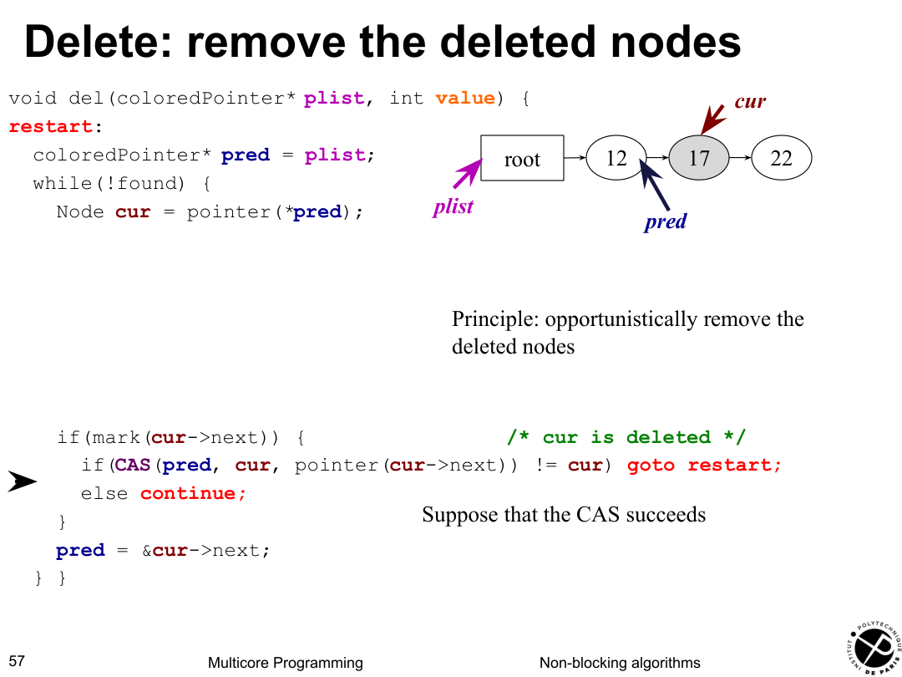

</details>

<a id="page-58"></a>

## 第 58 页 · Delete: remove the deleted nodes

```text
void del(coloredPointer* plist, int value) {
restart:
  coloredPointer* pred = plist;
  while(!found) {
    Node cur = pointer(*pred);
```

cur

12 17 22 root

plist

pred

Principle: opportunistically remove the deleted nodes

```text
    if(mark(cur->next)) {                 /* cur is deleted */
      if(CAS(pred, cur, pointer(cur->next)) != cur) goto restart;
      else continue;
    }
    pred = &cur->next;
  } }
```

> 校对：pred是链接地址；帮助摘链成功后留在同一pred。

<details>
<summary>查看第 58 页原图（图形、代码布局与标注）</summary>

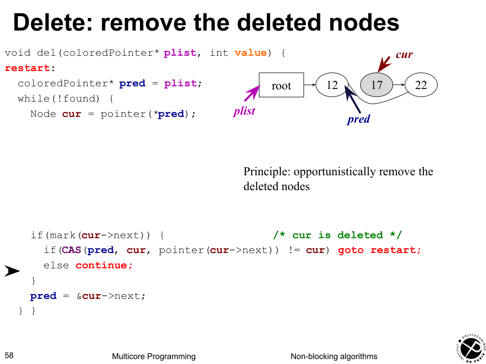

</details>

<a id="page-59"></a>

## 第 59 页 · Delete: remove the deleted nodes

```text
void del(coloredPointer* plist, int value) {
restart:
  coloredPointer* pred = plist;
  while(!found) {
    Node cur = pointer(*pred);
```

cur

12 17 22 root

plist

pred

Principle: opportunistically remove the deleted nodes

```text
    if(mark(cur->next)) {                 /* cur is deleted */
      if(CAS(pred, cur, pointer(cur->next)) != cur) goto restart;
      else continue;
    }
    pred = &cur->next;
  } }
```

> 校对：pred是链接地址；帮助摘链成功后留在同一pred。

<details>
<summary>查看第 59 页原图（图形、代码布局与标注）</summary>

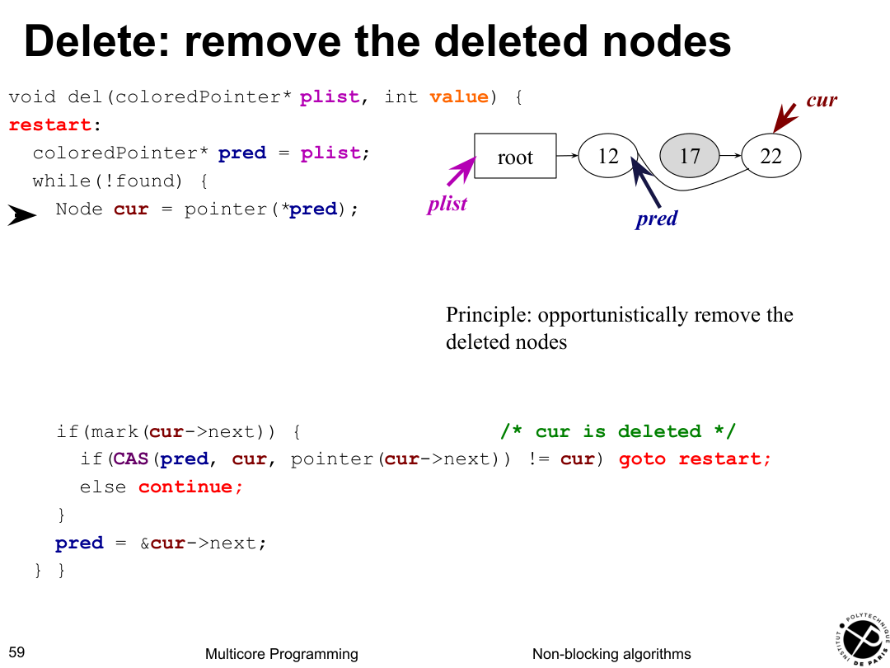

</details>

<a id="page-60"></a>

## 第 60 页 · Delete: marks a node deleted

```text
void del(coloredPointer* plist, int value) {
restart:
  coloredPointer* pred = plist;
  while(!found) {
    Node cur = pointer(*pred);
```

cur

12 17 22 root

plist

pred

We suppose value = 17

```text
    if(cur->value == value) {             /* found! */
      do { n = cur->next; } while(CAS(&cur->next, n, n | 1) != n);
      found = 1; }
```

```text
    if(mark(cur->next)) {                 /* cur is deleted */
      if(CAS(pred, cur, pointer(cur->next)) != cur) goto restart;
      else continue;
    }
    pred = &cur->next;
  } }
```

> 校对：found未完整初始化、n未声明，是逐步片段。

<details>
<summary>查看第 60 页原图（图形、代码布局与标注）</summary>


</details>

<a id="page-61"></a>

## 第 61 页 · Delete: marks a node deleted

```text
void del(coloredPointer* plist, int value) {
restart:
  coloredPointer* pred = plist;
  while(!found) {
    Node cur = pointer(*pred);
```

cur

12 17 22 root

plist

pred

We suppose value = 17

```text
    if(cur->value == value) {             /* found! */
      do { n = cur->next; } while(CAS(&cur->next, n, n | 1) != n);
      found = 1; }
```

```text
    if(mark(cur->next)) {                 /* cur is deleted */
      if(CAS(pred, cur, pointer(cur->next)) != cur) goto restart;
      else continue;
    }
    pred = &cur->next;
  } }
```

> 校对：标记成功与摘链成功区分；并发插入14导致重试。

<details>
<summary>查看第 61 页原图（图形、代码布局与标注）</summary>

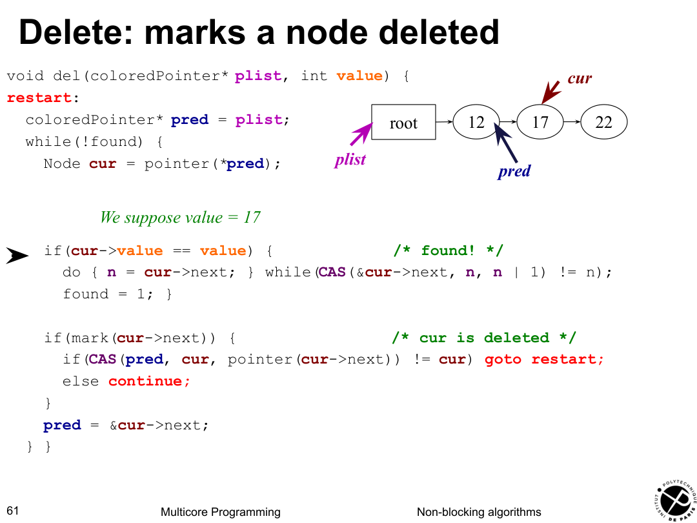

</details>

<a id="page-62"></a>

## 第 62 页 · Delete: marks a node deleted

```text
void del(coloredPointer* plist, int value) {
restart:
  coloredPointer* pred = plist;
  while(!found) {
    Node cur = pointer(*pred);
```

cur

12 17 22 root

plist

pred

We suppose value = 17

```text
    if(cur->value == value) {             /* found! */
      do { n = cur->next; } while(CAS(&cur->next, n, n | 1) != n);
      found = 1; }
```

```text
    if(mark(cur->next)) {                 /* cur is deleted */
      if(CAS(pred, cur, pointer(cur->next)) != cur) goto restart;
      else continue;
    }
    pred = &cur->next;
  } }
```

The CAS may fail because of

node 17 is already removed by another thread an insert between 17 and 22

> 校对：标记成功与摘链成功区分；并发插入14导致重试。

<details>
<summary>查看第 62 页原图（图形、代码布局与标注）</summary>

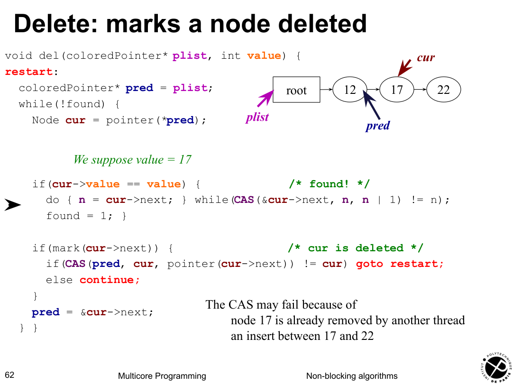

</details>

<a id="page-63"></a>

## 第 63 页 · Delete: marks a node deleted

```text
void del(coloredPointer* plist, int value) {
restart:
  coloredPointer* pred = plist;
  while(!found) {
    Node cur = pointer(*pred);
```

cur

12 17 22 root

plist

pred

We suppose value = 17

```text
    if(cur->value == value) {             /* found! */
      do { n = cur->next; } while(CAS(&cur->next, n, n | 1) != n);
      found = 1; }
```

```text
    if(mark(cur->next)) {                 /* cur is deleted */
      if(CAS(pred, cur, pointer(cur->next)) != cur) goto restart;
      else continue;
    }
    pred = &cur->next;
  } }
```

> 校对：标记成功与摘链成功区分；并发插入14导致重试。

<details>
<summary>查看第 63 页原图（图形、代码布局与标注）</summary>

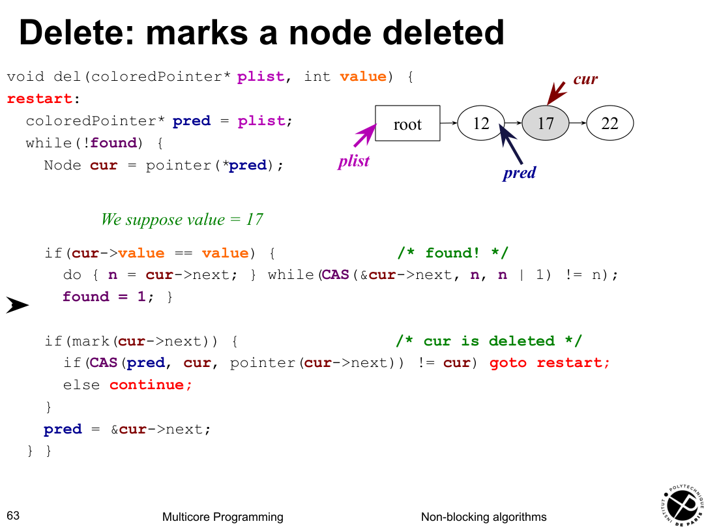

</details>

<a id="page-64"></a>

## 第 64 页 · Delete: marks a node deleted

```text
void del(coloredPointer* plist, int value) {
restart:
  coloredPointer* pred = plist;
  while(!found) {
    Node cur = pointer(*pred);
```

cur

12 17 22 root

plist

pred

We suppose value = 17

```text
    if(cur->value == value) {             /* found! */
      do { n = cur->next; } while(CAS(&cur->next, n, n | 1) != n);
      found = 1; }
```

```text
    if(mark(cur->next)) {                 /* cur is deleted */
      if(CAS(pred, cur, pointer(cur->next)) != cur) goto restart;
      else continue;
    }
    pred = &cur->next;
  } }
```

> 校对：标记成功与摘链成功区分；并发插入14导致重试。

<details>
<summary>查看第 64 页原图（图形、代码布局与标注）</summary>

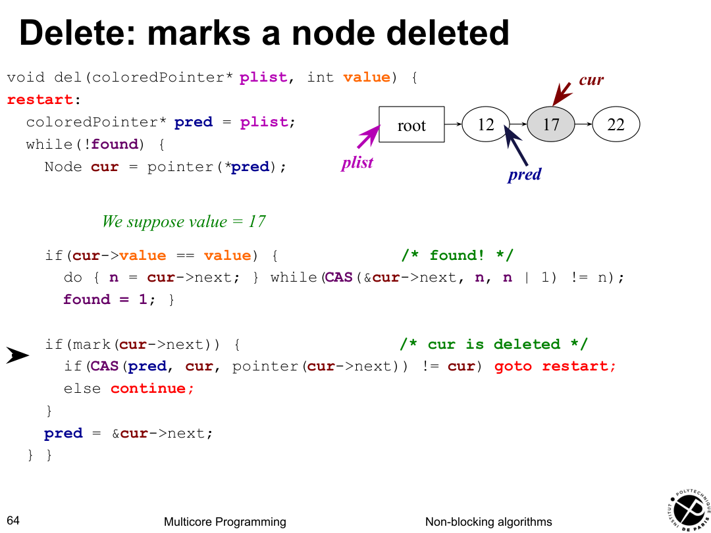

</details>

<a id="page-65"></a>

## 第 65 页 · Delete: marks a node deleted

```text
void del(coloredPointer* plist, int value) {
restart:
  coloredPointer* pred = plist;
  while(!found) {
    Node cur = pointer(*pred);
```

14

cur

12 17 22 root

plist

pred

We suppose value = 17

```text
    if(cur->value == value) {             /* found! */
      do { n = cur->next; } while(CAS(&cur->next, n, n | 1) != n);
      found = 1; }
```

```text
    if(mark(cur->next)) {                 /* cur is deleted */
      if(CAS(pred, cur, pointer(cur->next)) != cur) goto restart;
      else continue;
    }
    pred = &cur->next;
  } }
```

Imagine that another thread inserts the node

14 concurrently

=> goto restart

> 校对：标记成功与摘链成功区分；并发插入14导致重试。

<details>
<summary>查看第 65 页原图（图形、代码布局与标注）</summary>

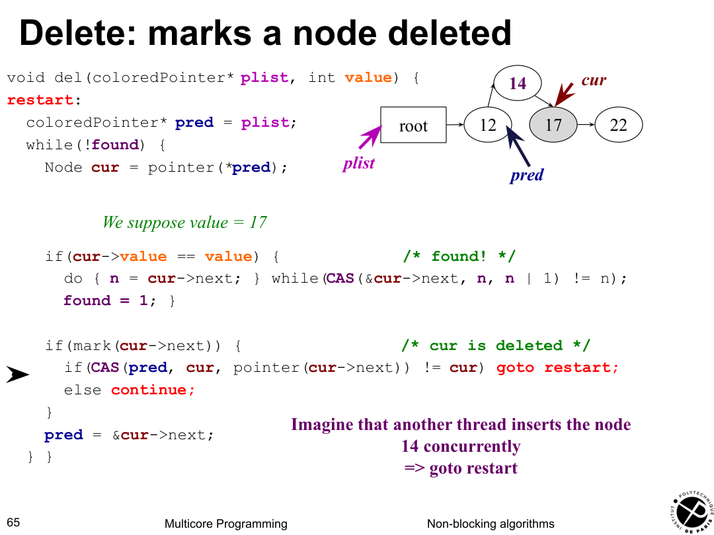

</details>

<a id="page-66"></a>

## 第 66 页 · Delete: marks a node deleted

```text
void del(coloredPointer* plist, int value) {
restart:
  coloredPointer* pred = plist;
  while(!found) {
    Node cur = pointer(*pred);
```

14

12 17 22 root

pred plist

We suppose value = 17

```text
    if(cur->value == value) {             /* found! */
      do { n = cur->next; } while(CAS(&cur->next, n, n | 1) != n);
      found = 1; }
```

```text
    if(mark(cur->next)) {                 /* cur is deleted */
      if(CAS(pred, cur, pointer(cur->next)) != cur) goto restart;
      else continue;
    }
    pred = &cur->next;
  } }
```

Imagine that another thread inserts the node

14 concurrently

=> goto restart => not removed from the list since found = 1

> 校对：标记成功与摘链成功区分；并发插入14导致重试。

<details>
<summary>查看第 66 页原图（图形、代码布局与标注）</summary>

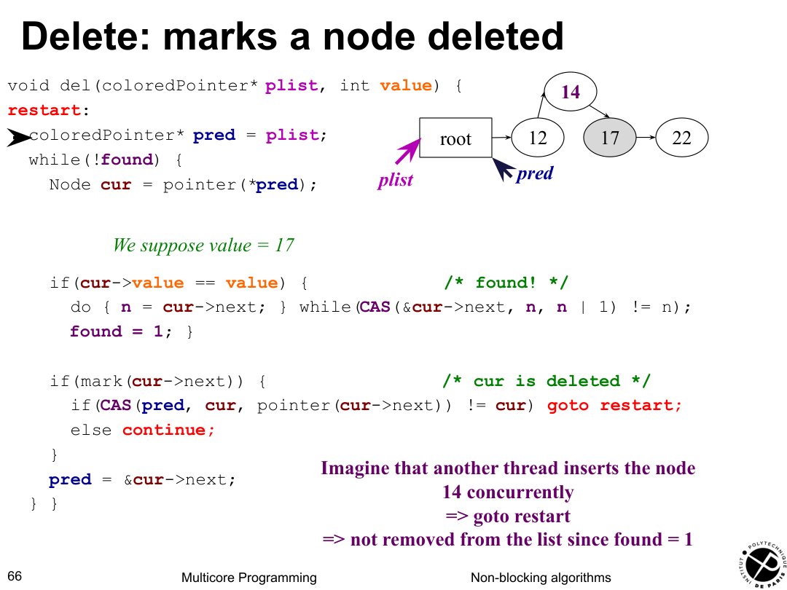

</details>

<a id="page-67"></a>

## 第 67 页 · Delete: marks a node deleted

```text
void del(coloredPointer* plist, int value) {
restart:
  coloredPointer* pred = plist;
  while(!found) {
    Node cur = pointer(*pred);
```

14

12 17 22 root

pred plist

We suppose value = 17

```text
    if(cur->value == value) {             /* found! */
      do { n = cur->next; } while(CAS(&cur->next, n, n | 1) != n);
      found = 1; }
```

```text
    if(mark(cur->next)) {                 /* cur is deleted */
      if(CAS(pred, cur, pointer(cur->next)) != cur) goto restart;
      else continue;
    }
    pred = &cur->next;
  } }
```

Not a problem because the next thread that will traverse the list will remove the node 17!

Imagine that another thread inserts the node

14 concurrently

=> goto restart => not removed from the list since found = 1

> 校对：逻辑删除可完成而物理节点尚在。

<details>
<summary>查看第 67 页原图（图形、代码布局与标注）</summary>

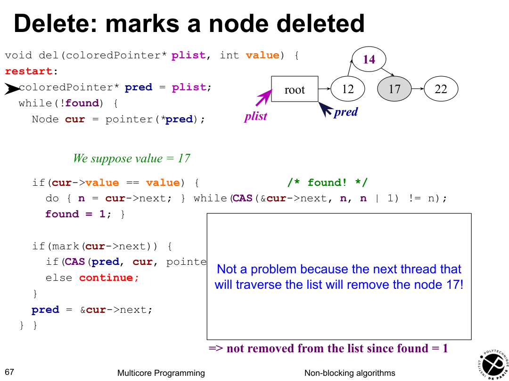

</details>

<a id="page-68"></a>

## 第 68 页 · Delete: not found

```text
void del(coloredPointer* plist, int value) {
restart:
  coloredPointer* pred = plist;
  while(!found) {
    Node cur = pointer(*pred);
    if(cur == null || value < cur->value) /* not found */
      return 0;
```

cur

12 17 22 root

plist

pred

```text
    if(cur->value == value) {             /* found! */
      do { n = cur->next; } while(CAS(&cur->next, n, n | 1) != n);
      found = 1; }
```

```text
    if(mark(cur->next)) {                 /* cur is deleted */
      if(CAS(pred, cur, pointer(cur->next)) != cur) goto restart;
      else continue;
    }
    pred = &cur->next;
  } }
```

We suppose value = 13

> 校对：void函数return 0是原文伪代码不一致。

<details>
<summary>查看第 68 页原图（图形、代码布局与标注）</summary>

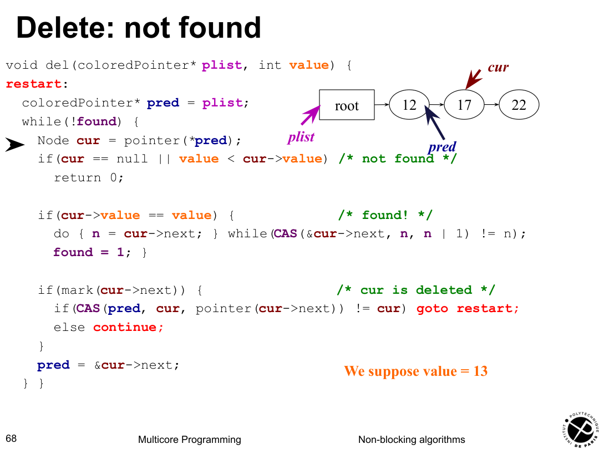

</details>

<a id="page-69"></a>

## 第 69 页 · Delete: not found

```text
void del(coloredPointer* plist, int value) {
restart:
  coloredPointer* pred = plist;
  while(!found) {
    Node cur = pointer(*pred);
    if(cur == null || value < cur->value) /* not found */
      return 0;
```

cur

12 17 22 root

plist pred

```text
    if(cur->value == value) {             /* found! */
      do { n = cur->next; } while(CAS(&cur->next, n, n | 1) != n);
      found = 1; }
```

```text
    if(mark(cur->next)) {                 /* cur is deleted */
      if(CAS(pred, cur, pointer(cur->next)) != cur) goto restart;
      else continue;
    }
    pred = &cur->next;
  } }
```

We suppose value = 13

=> leave the function when cur reaches the node

17 (13 < 17)

> 校对：有序链在cur>value时停止。

<details>
<summary>查看第 69 页原图（图形、代码布局与标注）</summary>

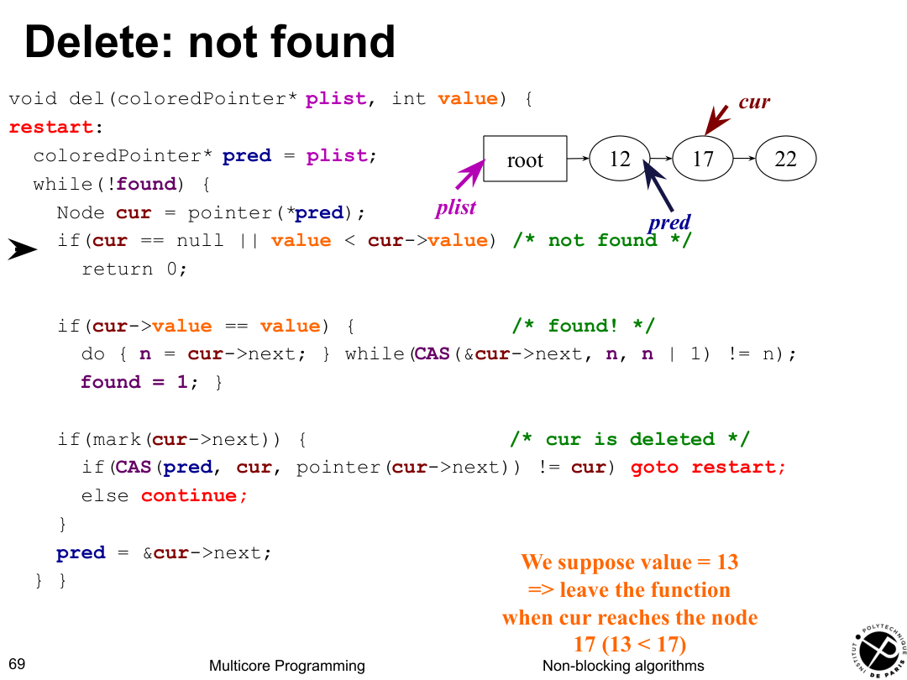

</details>

<a id="page-70"></a>

## 第 70 页 · Add: the traversal

```text
void add(coloredPointer* plist, int value) {
restart:
  coloredPointer* pred = plist;
  while(true) {
    Node cur = pointer(*pred);
```

cur

12 17 22 root

plist pred

```text
    if(mark(cur->next)) {                /* cur is deleted */
      if(CAS(pred, cur, pointer(cur->next)) != cur) goto restart;
      else continue;
    }
```

```text
    pred = &cur->next; 
  } 
}
```

Insert: same principle, we remove the deleted

node during the traversal

> 校对：CAS验证前驱链接和标记；重复键语义未定义。

<details>
<summary>查看第 70 页原图（图形、代码布局与标注）</summary>

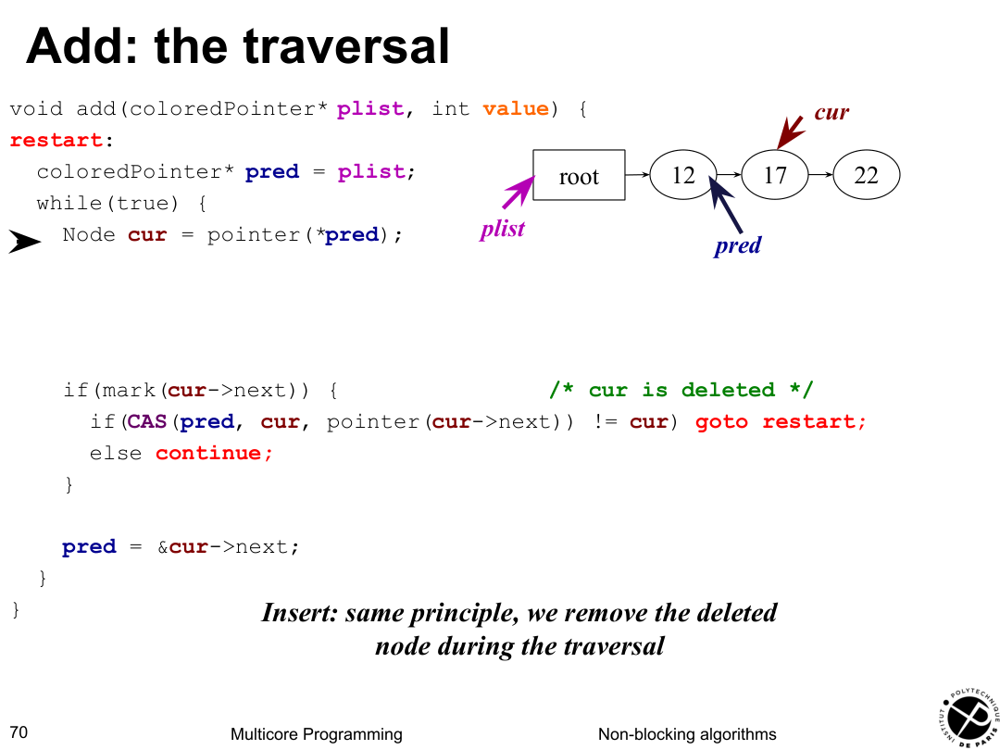

</details>

<a id="page-71"></a>

## 第 71 页 · Add: the insertion

```text
void add(coloredPointer* plist, int value) {
restart:
  coloredPointer* pred = plist;
  while(true) {
    Node cur = pointer(*pred);
    if(cur == null || value < cur->value) /* insertion */
      if(CAS(pred, cur, new Node(cur, value)) != cur) goto restart;
      else return;
    
    if(mark(cur->next)) {                /* cur is deleted */
      if(CAS(pred, cur, pointer(cur->next)) != cur) goto restart;
      else continue;
    }
```

cur

12 17 22 root

plist

pred

```text
    pred = &cur->next; 
  } 
}
```

Exemple: value = 14

> 校对：未定义重复键语义，不能宣称为严格集合API。

<details>
<summary>查看第 71 页原图（图形、代码布局与标注）</summary>

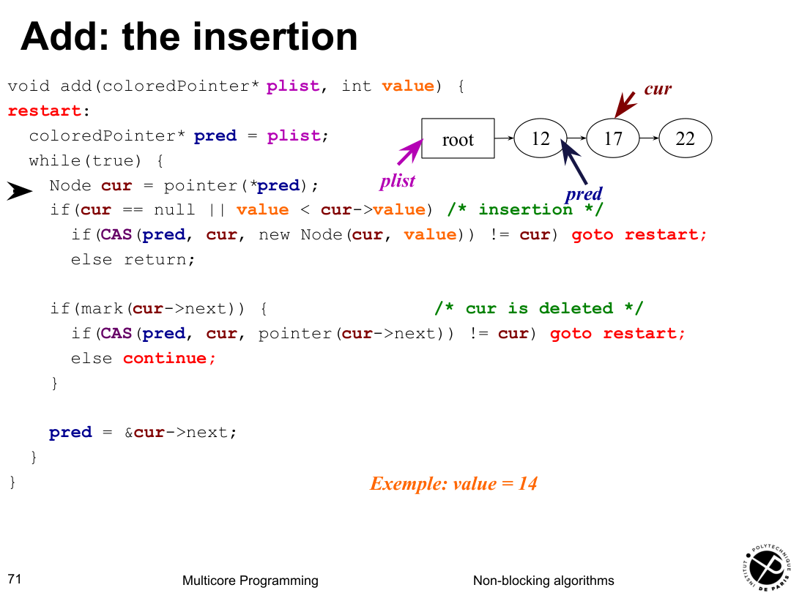

</details>

<a id="page-72"></a>

## 第 72 页 · Add: the insertion

```text
void add(coloredPointer* plist, int value) {
restart:
  coloredPointer* pred = plist;
  while(true) {
    Node cur = pointer(*pred);
    if(cur == null || value < cur->value) /* insertion */
      if(CAS(pred, cur, new Node(cur, value)) != cur) goto restart;
      else return;
    
    if(mark(cur->next)) {                /* cur is deleted */
      if(CAS(pred, cur, pointer(cur->next)) != cur) goto restart;
      else continue;
    }
```

cur

12 17 22 root

plist

pred

```text
    pred = &cur->next; 
  } 
}
```

Exemple: value = 14

> 校对：CAS验证前驱链接和标记；重复键语义未定义。

<details>
<summary>查看第 72 页原图（图形、代码布局与标注）</summary>

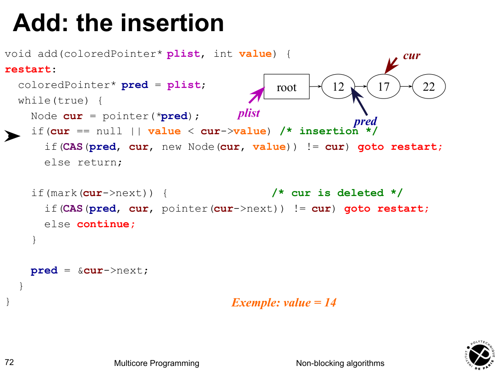

</details>

<a id="page-73"></a>

## 第 73 页 · Add: the insertion

```text
void add(coloredPointer* plist, int value) {
restart:
  coloredPointer* pred = plist;
  while(true) {
    Node cur = pointer(*pred);
    if(cur == null || value < cur->value) /* insertion */
      if(CAS(pred, cur, new Node(cur, value)) != cur) goto restart;
      else return;
    
    if(mark(cur->next)) {                /* cur is deleted */
      if(CAS(pred, cur, pointer(cur->next)) != cur) goto restart;
      else continue;
    }
```

cur

12 17 22 root

plist

pred

The CAS may fail for two reasons:

```text
    pred = &cur->next; 
  } 
}
```

12 becomes grey (deleted) another node is inserted between 12 and 17

> 校对：CAS验证前驱链接和标记；重复键语义未定义。

<details>
<summary>查看第 73 页原图（图形、代码布局与标注）</summary>

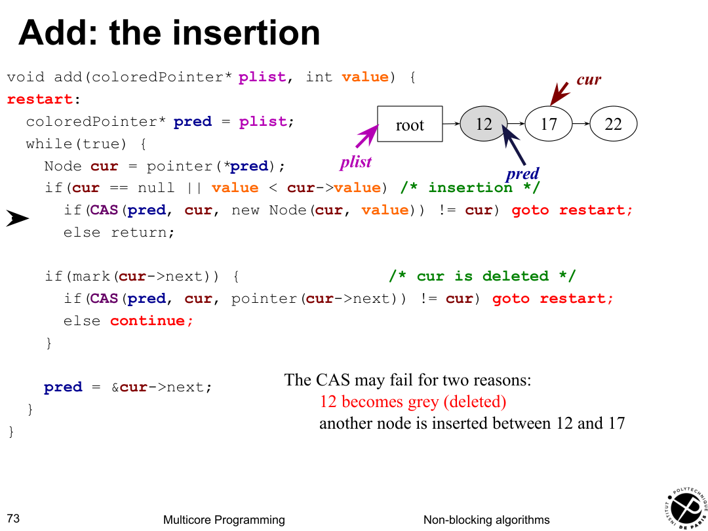

</details>

<a id="page-74"></a>

## 第 74 页 · Add: the insertion

```text
void add(coloredPointer* plist, int value) {
restart:
  coloredPointer* pred = plist;
  while(true) {
    Node cur = pointer(*pred);
    if(cur == null || value < cur->value) /* insertion */
      if(CAS(pred, cur, new Node(cur, value)) != cur) goto restart;
      else return;
    
    if(mark(cur->next)) {                /* cur is deleted */
      if(CAS(pred, cur, pointer(cur->next)) != cur) goto restart;
      else continue;
    }
```

cur

12 17 22 root

plist pred

```text
    pred = &cur->next; 
  } 
}
```

> 校对：CAS验证前驱链接和标记；重复键语义未定义。

<details>
<summary>查看第 74 页原图（图形、代码布局与标注）</summary>


</details>

<a id="page-75"></a>

## 第 75 页 · Add: the insertion

```text
void add(coloredPointer* plist, int value) {
restart:
  coloredPointer* pred = plist;
  while(true) {
    Node cur = pointer(*pred);
    if(cur == null || value < cur->value) /* insertion */
      if(CAS(pred, cur, new Node(cur, value)) != cur) goto restart;
      else return;
    
    if(mark(cur->next)) {                /* cur is deleted */
      if(CAS(pred, cur, pointer(cur->next)) != cur) goto restart;
      else continue;
    }
```

14

cur

12 17 22 root

plist

pred

```text
    pred = &cur->next; 
  } 
}
```

> 校对：CAS验证前驱链接和标记；重复键语义未定义。

<details>
<summary>查看第 75 页原图（图形、代码布局与标注）</summary>

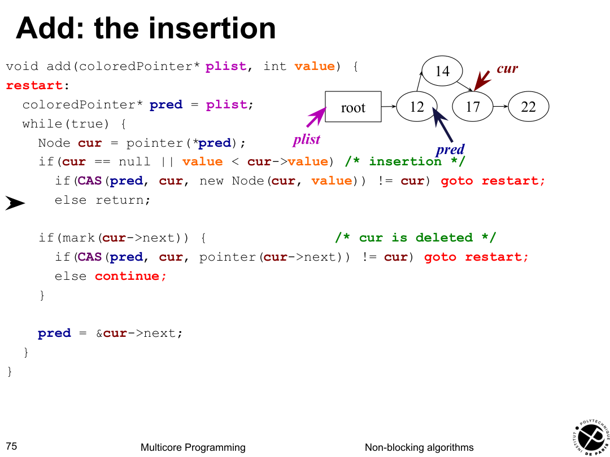

</details>

<a id="page-76"></a>

## 第 76 页 · To take away

- 

Three levels of non blocking algorithms from the strongest to the weakest

- Wait-free
- Lock-free
- Obstruction-free

- 

Three lock-free algorithms

- The stack: especially simple
- The queue: enforces invariants
- The linked list: enforces invariants and helps to remove deleted node during a traversal

- 

For each lock-free algorithm, we have a linearization point, i.e., a point in the program where the operation succeeds and becomes visible

> 校对：线性化不等于完整证明；补充生命周期和ABA边界。

<details>
<summary>查看第 76 页原图（图形、代码布局与标注）</summary>

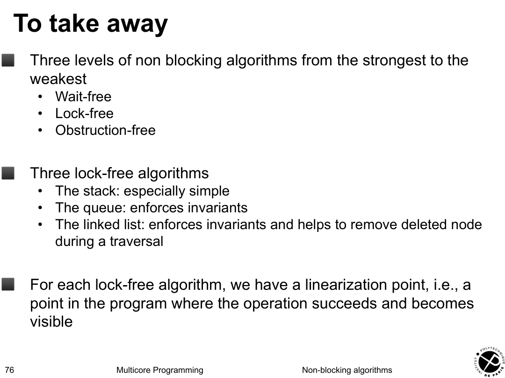

</details>

## 原 OCR 图片保留索引

以下按原始 OCR 引用顺序保留，方便核对裁切范围；准确页码以逐页原图为准。

- [提取图 001](Images/03-non-blocking/image_001.jpg)
- [提取图 002](Images/03-non-blocking/image_002.jpg)
- [提取图 003](Images/03-non-blocking/image_003.jpg)
- [提取图 004](Images/03-non-blocking/image_004.jpg)
- [提取图 005](Images/03-non-blocking/image_005.jpg)
- [提取图 006](Images/03-non-blocking/image_006.jpg)
- [提取图 007](Images/03-non-blocking/image_007.jpg)
- [提取图 008](Images/03-non-blocking/image_008.jpg)
- [提取图 009](Images/03-non-blocking/image_009.jpg)
- [提取图 010](Images/03-non-blocking/image_010.jpg)
- [提取图 011](Images/03-non-blocking/image_011.jpg)
- [提取图 012](Images/03-non-blocking/image_012.jpg)
- [提取图 013](Images/03-non-blocking/image_013.jpg)
- [提取图 014](Images/03-non-blocking/image_014.jpg)
- [提取图 015](Images/03-non-blocking/image_015.jpg)
- [提取图 016](Images/03-non-blocking/image_016.jpg)
- [提取图 017](Images/03-non-blocking/image_017.jpg)
- [提取图 018](Images/03-non-blocking/image_018.jpg)
- [提取图 019](Images/03-non-blocking/image_019.jpg)
- [提取图 020](Images/03-non-blocking/image_020.jpg)
- [提取图 021](Images/03-non-blocking/image_021.jpg)
- [提取图 022](Images/03-non-blocking/image_022.jpg)
- [提取图 023](Images/03-non-blocking/image_023.jpg)
- [提取图 024](Images/03-non-blocking/image_024.jpg)
- [提取图 025](Images/03-non-blocking/image_025.jpg)
- [提取图 026](Images/03-non-blocking/image_026.jpg)
- [提取图 027](Images/03-non-blocking/image_027.jpg)
- [提取图 028](Images/03-non-blocking/image_028.jpg)
- [提取图 029](Images/03-non-blocking/image_029.jpg)
- [提取图 030](Images/03-non-blocking/image_030.jpg)
- [提取图 031](Images/03-non-blocking/image_031.jpg)
- [提取图 032](Images/03-non-blocking/image_032.jpg)
- [提取图 033](Images/03-non-blocking/image_033.jpg)
- [提取图 034](Images/03-non-blocking/image_034.jpg)
- [提取图 035](Images/03-non-blocking/image_035.jpg)
- [提取图 036](Images/03-non-blocking/image_036.jpg)
- [提取图 037](Images/03-non-blocking/image_037.jpg)
- [提取图 038](Images/03-non-blocking/image_038.jpg)
- [提取图 039](Images/03-non-blocking/image_039.jpg)
- [提取图 040](Images/03-non-blocking/image_040.jpg)
- [提取图 041](Images/03-non-blocking/image_041.jpg)
- [提取图 042](Images/03-non-blocking/image_042.jpg)
- [提取图 043](Images/03-non-blocking/image_043.jpg)
- [提取图 044](Images/03-non-blocking/image_044.jpg)
- [提取图 045](Images/03-non-blocking/image_045.jpg)
- [提取图 046](Images/03-non-blocking/image_046.jpg)
- [提取图 047](Images/03-non-blocking/image_047.jpg)
- [提取图 048](Images/03-non-blocking/image_048.jpg)
- [提取图 049](Images/03-non-blocking/image_049.jpg)
- [提取图 050](Images/03-non-blocking/image_050.jpg)
- [提取图 051](Images/03-non-blocking/image_051.jpg)
- [提取图 052](Images/03-non-blocking/image_052.jpg)
- [提取图 053](Images/03-non-blocking/image_053.jpg)
- [提取图 054](Images/03-non-blocking/image_054.jpg)
- [提取图 055](Images/03-non-blocking/image_055.jpg)
- [提取图 056](Images/03-non-blocking/image_056.jpg)
- [提取图 057](Images/03-non-blocking/image_057.jpg)
- [提取图 058](Images/03-non-blocking/image_058.jpg)
- [提取图 059](Images/03-non-blocking/image_059.jpg)
- [提取图 060](Images/03-non-blocking/image_060.jpg)
- [提取图 061](Images/03-non-blocking/image_061.jpg)
- [提取图 062](Images/03-non-blocking/image_062.jpg)
- [提取图 063](Images/03-non-blocking/image_063.jpg)
- [提取图 064](Images/03-non-blocking/image_064.jpg)
- [提取图 065](Images/03-non-blocking/image_065.jpg)
- [提取图 066](Images/03-non-blocking/image_066.jpg)
- [提取图 067](Images/03-non-blocking/image_067.jpg)
- [提取图 068](Images/03-non-blocking/image_068.jpg)
- [提取图 069](Images/03-non-blocking/image_069.jpg)
- [提取图 070](Images/03-non-blocking/image_070.jpg)
- [提取图 071](Images/03-non-blocking/image_071.jpg)
- [提取图 072](Images/03-non-blocking/image_072.jpg)
- [提取图 073](Images/03-non-blocking/image_073.jpg)
