# 04-stm · 原文校对稿

[原始 PDF](04-stm.pdf) · [中文详解](04-stm_zh.md) · [课程目录](README.md)

对应实验：事务内存（[中文版](../Labs/tp-stm/tp-stm_zh.html) · [英文原版](../Labs/tp-stm/tp-stm.html)）

> 以 PDF 内嵌文字层重建，按原页和文字块分离正文、代码与图注，修复 MinerU 的混栏、页脚入代码及语言标签问题。保留原课件的用词和代码疑点，不将其悄悄改写为正确程序。代码块有时是逐步展示中的片段；图形、数学排版、颜色和箭头以各页展开后的原图为准。

[重要勘误](ERRATA.md)

<a id="page-1"></a>

## 第 1 页 · Page 1

Transactional memory

Master in computer science of IP Paris

Master CHPS of Paris Saclay

Gaël Thomas

> 校对：组合动机；第3页初值和操作标签问题。

<details>
<summary>查看第 1 页原图（图形、代码布局与标注）</summary>


</details>

<a id="page-2"></a>

## 第 2 页 · Limitation of lock-based algorithms

- 

Large critical section hampers performance

- 

Problems with fine-grain locking schemes or lock-free algorithms

- Makes the code complex and hard to maintain
- Makes the code difficult to reuse (invariant are often only in the mind of the initial developer, locks have to be taken in a given order)
- Bugs are hard to find
- Code is not composable (one data structure => one algorithm)
- Makes de code difficult to prove

- 

Idea of transactional memory (TM)

- Offers a high-level API that simplifies development
- Tries to be as efficient as lock-free algorithms

> 校对：组合动机；第3页初值和操作标签问题。

<details>
<summary>查看第 2 页原图（图形、代码布局与标注）</summary>

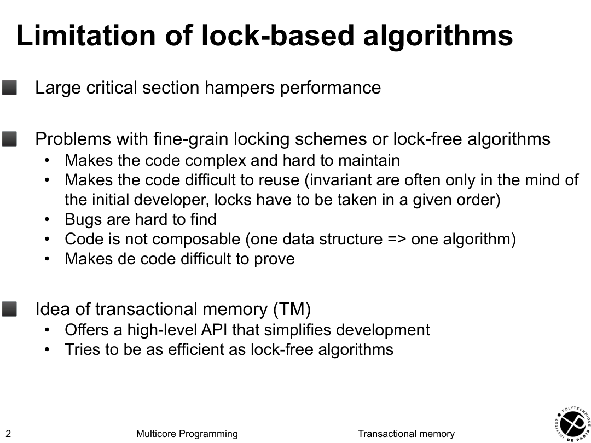

</details>

<a id="page-3"></a>

## 第 3 页 · Transactional memory: principle

- 

A single universal construct: the atomic block

- A block of code that appears to be executed instantaneously

a. atomic { b. tmp = x; c. tmp = tmp + 1; d. x = tmp; e. }

f. atomic { g. tmp = x; h. tmp = tmp * 2; i. x = tmp; j. }

Two possible schedulings: [b,c,e] then [g,h,i] (⇒ 44) or [g,h,i] then [b,c,e] (⇒ 43)

- 

Advantages

- Simplifies the code: we don’t have to know which locks we have to take (and in which order we have to take the locks) to access a variable
- Avoids many bugs (deadlocks, starvation)

> 校对：结果44/43需x初值21，原页未显式给出；b,c,e标签应包含写回d。

<details>
<summary>查看第 3 页原图（图形、代码布局与标注）</summary>

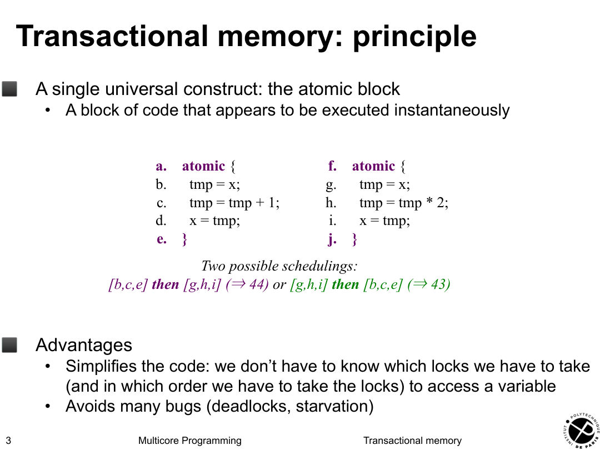

</details>

<a id="page-4"></a>

## 第 4 页 · From locks to TM

- 

At high-level

- Transform each critical section by an atomic block
- Remove the underlying locks

synchronized(o) if(!x) { x = true; doSomething(); } }

atomic { if(!x) { x = true; doSomething(); } }

> 校对：组合动机；第3页初值和操作标签问题。

<details>
<summary>查看第 4 页原图（图形、代码布局与标注）</summary>

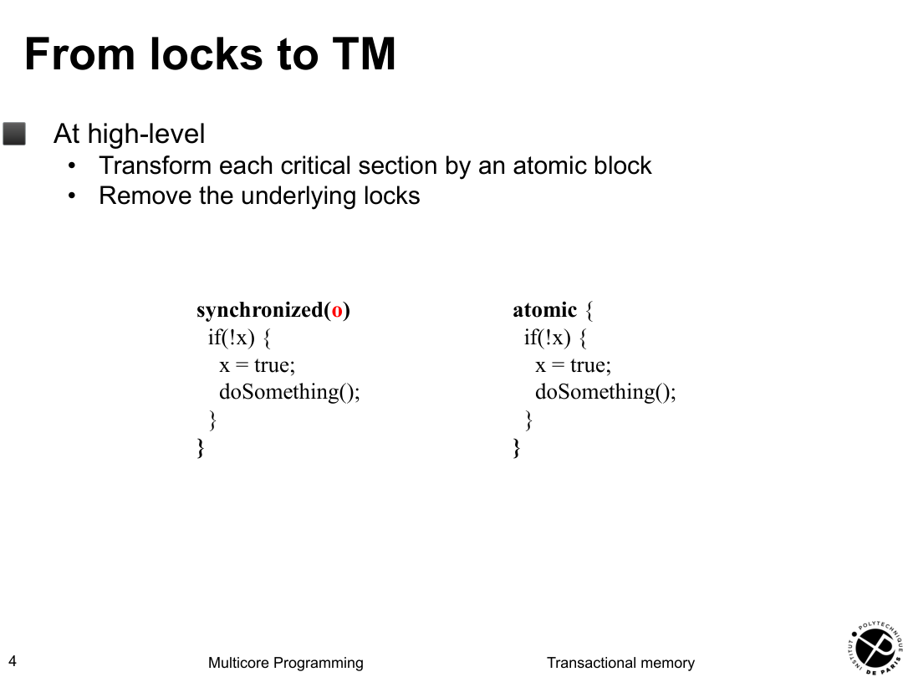

</details>

<a id="page-5"></a>

## 第 5 页 · From condition variables to TM

- 

We often use locks with variable conditions to wait for an event

- 

Transactional memory provides a notion of retry [Harris’05]

- Wait until a read variable is modified

synchronized(o) { while(!x) o.wait() }

synchronized(o) { x = true; o.notify(); }

atomic { while(!x) retry; }

atomic { x = true; }

4

2

1

commit: x modified ⇒ wake up the waiters

Waits with read-set = { x }

3

> 校对：外层重试、orElse；队列端点原文不一致。

<details>
<summary>查看第 5 页原图（图形、代码布局与标注）</summary>

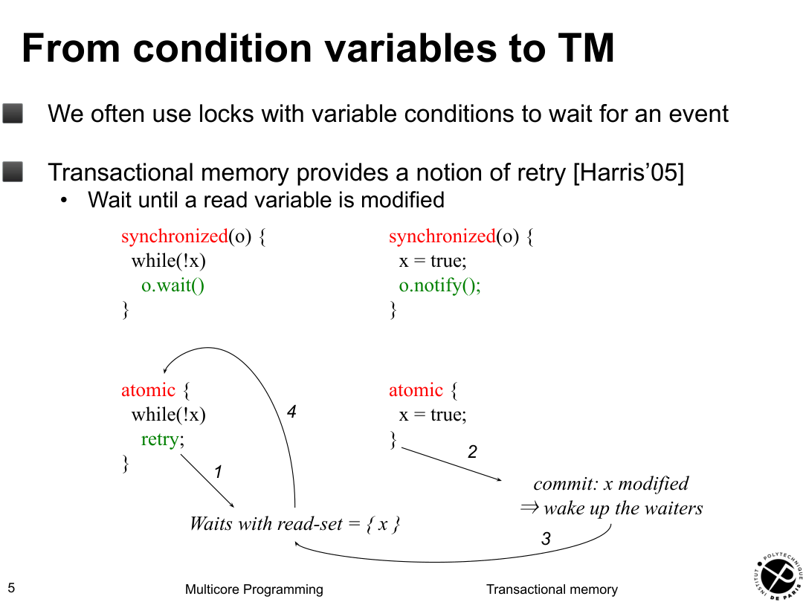

</details>

<a id="page-6"></a>

## 第 6 页 · Composability

If A and B are two atomic blocks, we can easily compose them

Example: a queue

atomic move(Queue dst, Queue src) { Elmt e = src.deq(); dst.enq(e); }

atomic Elmt deq() atomic void enq(Elmt e);

time deq enq move

atomic

atomic

time enq

> 校对：外层重试、orElse；队列端点原文不一致。

<details>
<summary>查看第 6 页原图（图形、代码布局与标注）</summary>

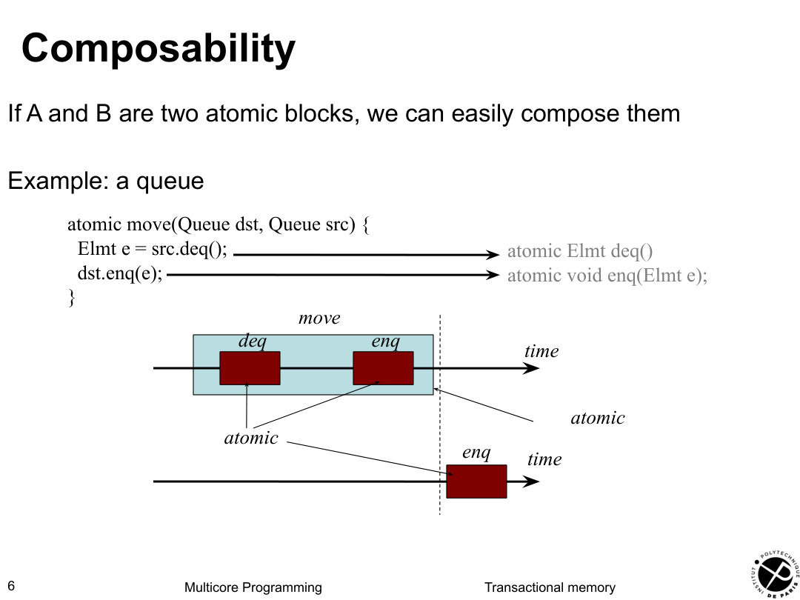

</details>

<a id="page-7"></a>

## 第 7 页 · Composability and retry (1/2)

A queue implementation with retry

class Queue { LinkedList<Elmt> queue; }

void enq(Elmt e) { atomic { if(queue.size() == MAX_SIZE) retry; queue.addLast() } }

Elmt deq() { atomic { if(queue.empty()) retry; return queue.removeLast() } }

Wake up the waiting transaction

Wait until one of the read variable

is modified and

restart the transaction

> 校对：addLast缺e；addLast/removeLast不是FIFO。

<details>
<summary>查看第 7 页原图（图形、代码布局与标注）</summary>

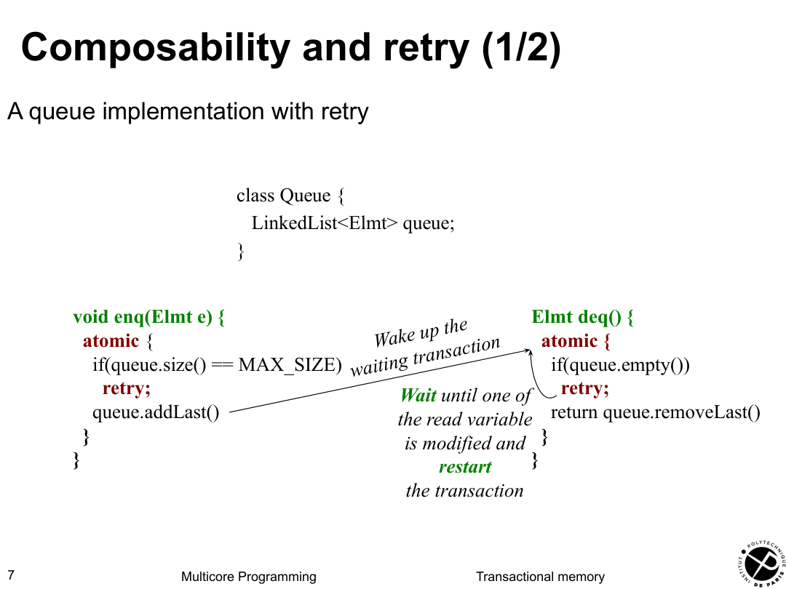

</details>

<a id="page-8"></a>

## 第 8 页 · Composability and retry (2/2)

Retry is also composable: retry restarts from the outer transaction

Retry

Retry

atomic move(Queue dst, Queue src) { Elmt e = src.deq(); dst.enq(e); }

atomic Elmt deq() atomic void enq(Elmt e);

time deq enq move

Restart

atomic atomic

time enq

> 校对：外层重试、orElse；队列端点原文不一致。

<details>
<summary>查看第 8 页原图（图形、代码布局与标注）</summary>

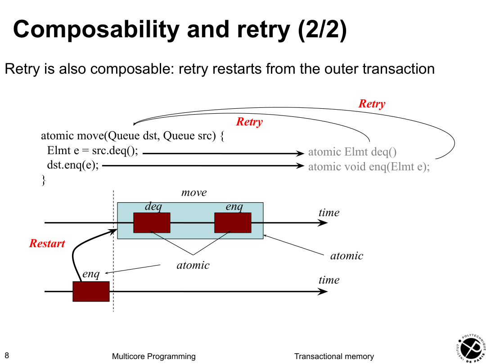

</details>

<a id="page-9"></a>

## 第 9 页 · Composability by alternative

Problem: how to reuse a blocking queue to implement a non-blocking one

Solution: the orElse construct

Elmt deqNoWait() { atomic { return deq(); } orElse { return null; } }

Execute first block

In case of retry

Continue with the orElse block

If retry again, continue with next orElse block or restart from the beginning

> 校对：外层重试、orElse；队列端点原文不一致。

<details>
<summary>查看第 9 页原图（图形、代码布局与标注）</summary>

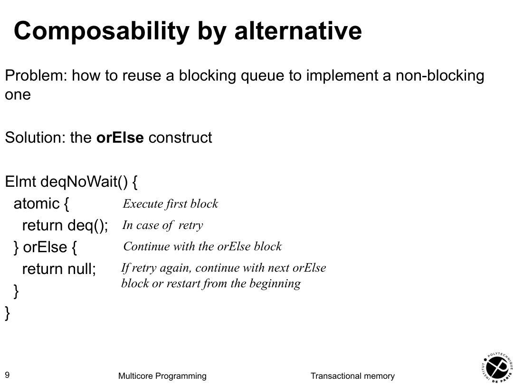

</details>

<a id="page-10"></a>

## 第 10 页 · Design of a TM runtime

- 

Pessimistic solution: use a single lock

- Acquire the lock when the atomic block starts
- Release the lock when the atomic blocks ends
- => often especially inefficient!

- 

Optimistic solution: abort in case of conflict

- Execute an atomic block without taking a lock, as a transaction in DB
- In case of conflict, abort the transaction

- 

But, what is a conflict?

- A conflict appears when a transaction cannot execute atomically

- another transaction Y can observe an ephemeral state that only exists inside a transaction X
- One of the variable read by a transaction X is modified by another transaction Y during the execution of X

> 校对：redo/undo和检测时机；HTM/STM性能不作普遍结论。

<details>
<summary>查看第 10 页原图（图形、代码布局与标注）</summary>

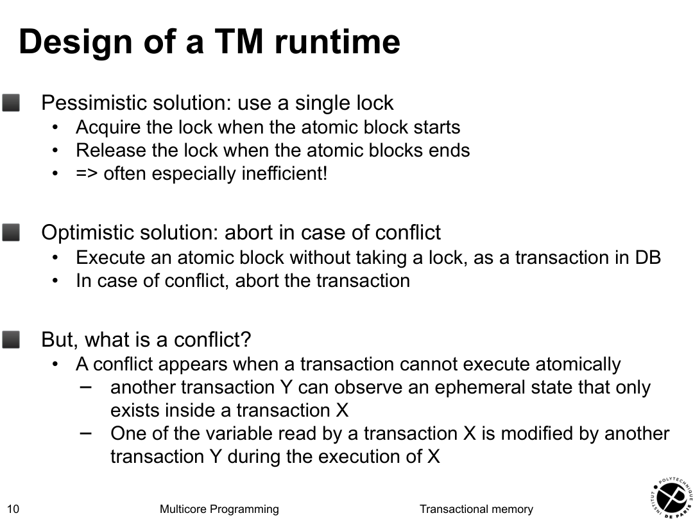

</details>

<a id="page-11"></a>

## 第 11 页 · Read-write conflict

- 

Read-write conflicts

- Let X and Y be two transactions and A a variable
- Double write with a reader

- X writes b in A and then c in A
- Y reads b from A, while b would never have existed if X had executed atomically
- Double read with a writer

- X writes b in A (writer)
- Y reads a from A and then b from A, which means that Y didn’t execute atomically (X is executed “during” Y, which is impossible if Y is atomic)

- 

In case of conflict, we can/have to abort the reader, the writer or both

> 校对：redo/undo和检测时机；HTM/STM性能不作普遍结论。

<details>
<summary>查看第 11 页原图（图形、代码布局与标注）</summary>

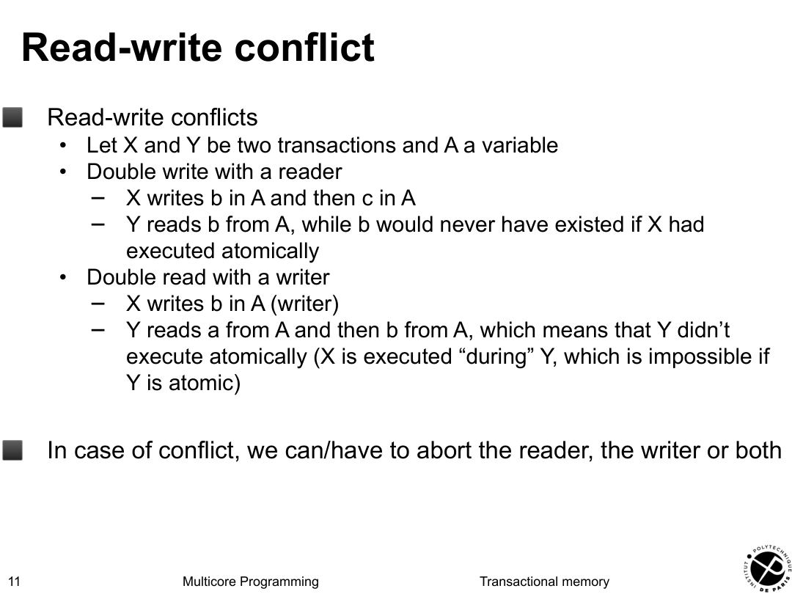

</details>

<a id="page-12"></a>

## 第 12 页 · Two main possible designs

- 

Deferred update (redo log)

- X writes in a redo log
- If X commits, applis the redo log to main memory
- => more work in case of commit
- => avoids by design the double write conflict, we only have to handle double read conflict (read twice a variable modified by another transaction)

- 

Immediate (undo log)

- X writes in main memory and in an undo log
- If X aborts, undo the operations recorded in the undo log
- => more work in case of abort
- => subject to both double write conflicts and double read conflicts

> 校对：redo/undo和检测时机；HTM/STM性能不作普遍结论。

<details>
<summary>查看第 12 页原图（图形、代码布局与标注）</summary>

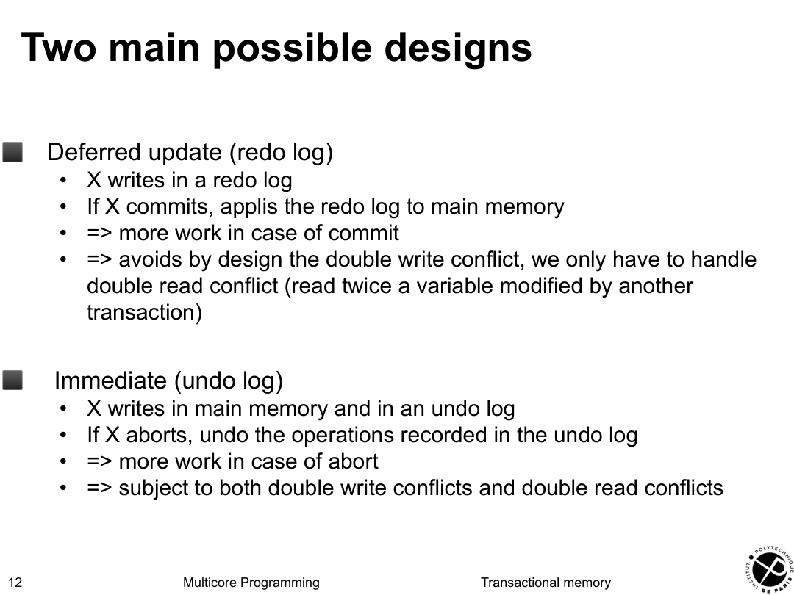

</details>

<a id="page-13"></a>

## 第 13 页 · Deferred-update TM

Efficient if many aborts

a. atomic { b. tmp = x; c. tmp = tmp + 1; d. x = tmp; e. }

f. atomic { g. tmp = x; h. tmp = tmp * 2; i. x = tmp; j. }

Memory

x = 20

tmp = 20

tmp = 20

abort()

commit()

tmp = 40

Memory

tmp = 21

Read set = { x } Write set = { x } Conflict!

x = 40

Play the log at commit in case of commit Read set = { x }

> 校对：redo/undo和检测时机；HTM/STM性能不作普遍结论。

<details>
<summary>查看第 13 页原图（图形、代码布局与标注）</summary>

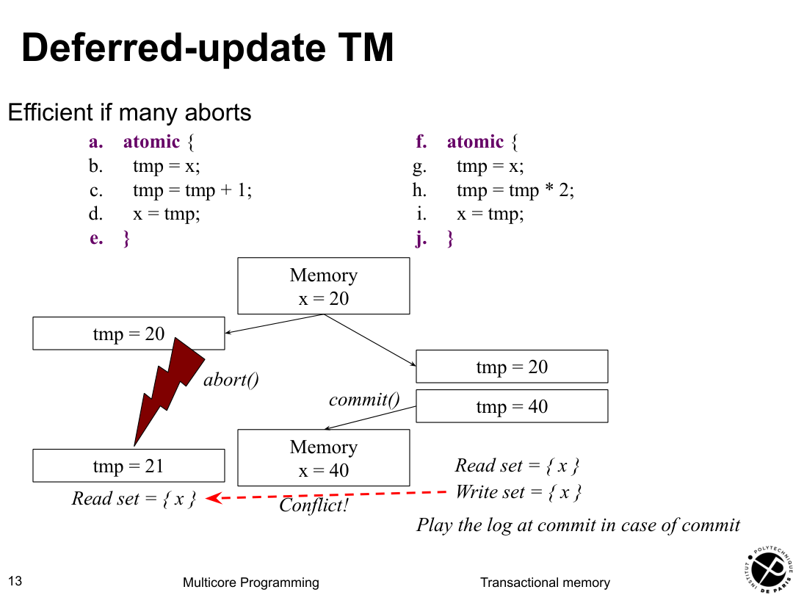

</details>

<a id="page-14"></a>

## 第 14 页 · Immediate TM

Efficient if many commits

x = 3, y = 20, z=30

a. atomic { b. z = y + 7;

f. atomic {

x = 3, y = 20, z=27

Read set = { y }

g. y = x * 2;

x = 3, y = 6, z=27

Write set = { y } abort()

x = 3, y = 6, z=30

h. }

c. }

Note: the undo log is not represented

> 校对：redo/undo和检测时机；HTM/STM性能不作普遍结论。

<details>
<summary>查看第 14 页原图（图形、代码布局与标注）</summary>

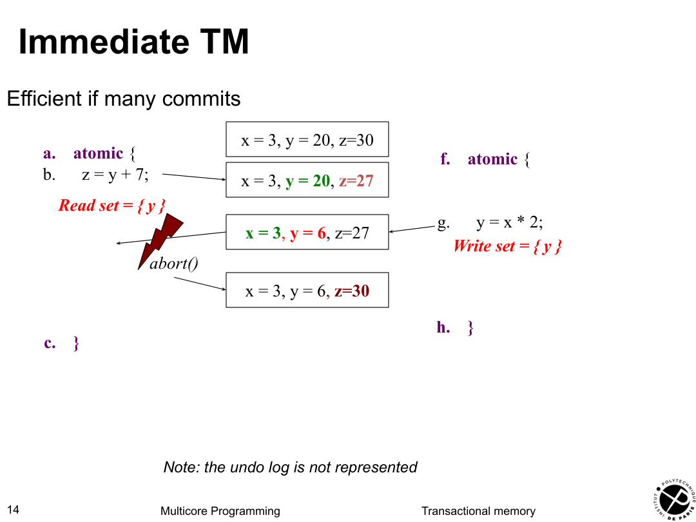

</details>

<a id="page-15"></a>

## 第 15 页 · Conflict detection

Two possible solutions:

Eager: abort as soon as the runtime detects a conflict

Code instrumentation for each read and each write

Lazy: check the conflict only at the end of the transaction

Avoid instrumenting all the reads or all the writes Possible inconsistency if a transaction continues to run with invalid values

(typically in case of double read conflicts)

> 校对：redo/undo和检测时机；HTM/STM性能不作普遍结论。

<details>
<summary>查看第 15 页原图（图形、代码布局与标注）</summary>

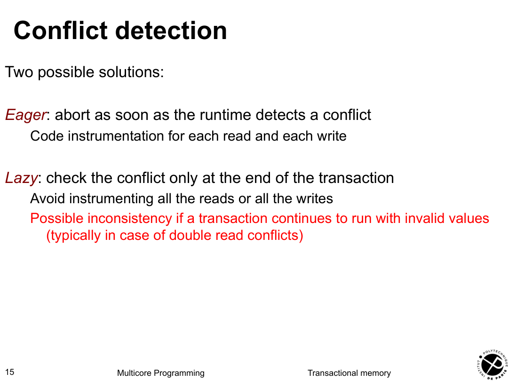

</details>

<a id="page-16"></a>

## 第 16 页 · Implementation techniques

- Hardware transactional memory (HTM) Use the processor cache to build a deferred-update TM Often use a lazy detection mechanism (explicit instruction to check the conflicts)

+ very efficient - size limited to the cache => inadequate for large transactions

- Software transactional memory (STM) Code instrumentation injected by a compiler - slower + can handle any size

- Hybrid Transactional memory (HyTM) In hardware if possible and switches to software otherwise

> 校对：HTM容量、检测时机和STM任意大小是简化概括。

<details>
<summary>查看第 16 页原图（图形、代码布局与标注）</summary>

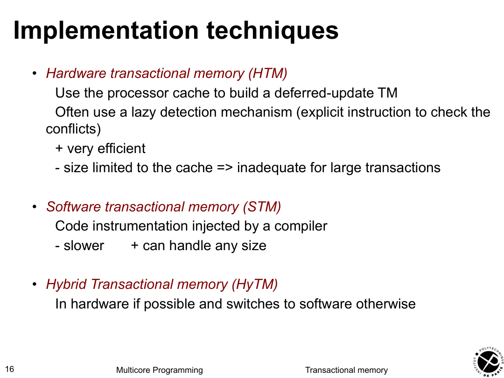

</details>

<a id="page-17"></a>

## 第 17 页 · Naive algorithm

Deferred-update and pure lazy STM with a lock during commit

Principle :

Memory

- Associate a counter to each memory cell
- Read: record the counter in a local memory
- Write: write in a local memory
- At the end of the transaction
- Ensure that the counters are not modified
- In case of commit (counter not modified)

Cell Counter

a

17

b

13

c

2

d

26

- increments the counter in main memory
- propagates the values in main memory
- In case of abort (counter modified)

e

83

- Simply ignores the local memory

> 校对：读集合与写集合；a=31,c=23,b=23；版本列单列。

<details>
<summary>查看第 17 页原图（图形、代码布局与标注）</summary>

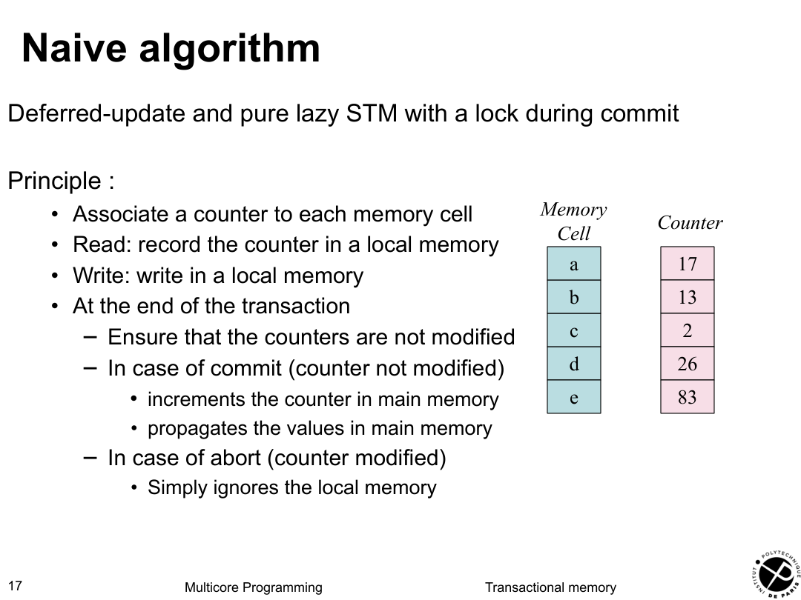

</details>

<a id="page-18"></a>

## 第 18 页 · Naive algorithm

Memory

Local log

a

10

17

a

a. atomic { b. a = a + b; c. c = a - e; d. b = c; e. } 83

b

21

13

b

c

7

2

c

d

26

d

e

8

83

e

Value

Name Counter

> 校对：读集合与写集合；a=31,c=23,b=23；版本列单列。

<details>
<summary>查看第 18 页原图（图形、代码布局与标注）</summary>

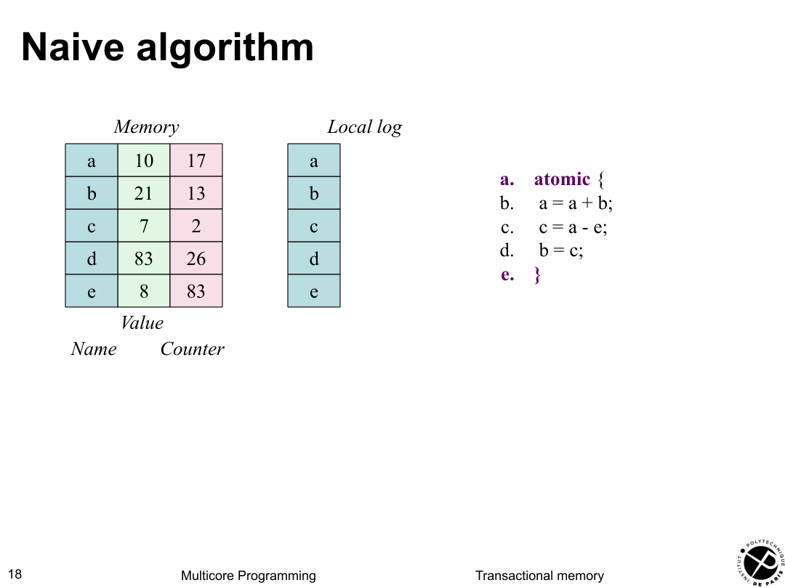

</details>

<a id="page-19"></a>

## 第 19 页 · Naive algorithm

Memory

Local log

a

10

17

a

31

17

a. atomic { b. a = a + b; c. c = a - e; d. b = c; e. } 83

b

21

13

b

13

c

7

2

c

d

26

d

e

8

83

e

Value

Name Counter

> 校对：读集合与写集合；a=31,c=23,b=23；版本列单列。

<details>
<summary>查看第 19 页原图（图形、代码布局与标注）</summary>

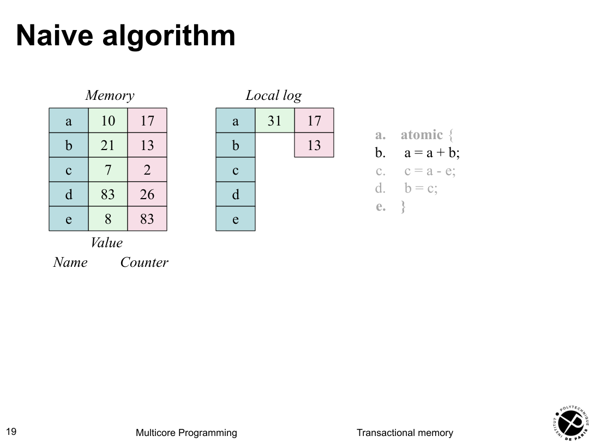

</details>

<a id="page-20"></a>

## 第 20 页 · Naive algorithm

Memory

Local log

a

10

17

a

31

17

a. atomic { b. a = a + b; c. c = a - e; d. b = c; e. } 83

b

21

13

b

13

c

7

2

c

23

d

26

d

e

8

83

e

83

Value

Name Counter

> 校对：读集合与写集合；a=31,c=23,b=23；版本列单列。

<details>
<summary>查看第 20 页原图（图形、代码布局与标注）</summary>

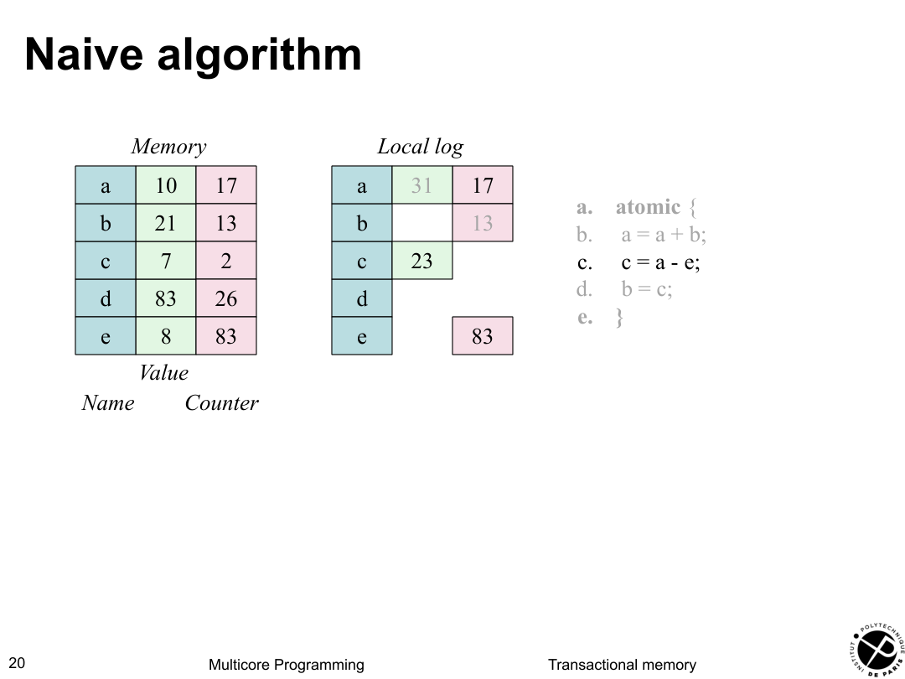

</details>

<a id="page-21"></a>

## 第 21 页 · Naive algorithm

Memory

Local log

a

10

17

a

31

17

a. atomic { b. a = a + b; c. c = a - e; d. b = c; e. } 83

b

21

13

b

23

13

c

7

2

c

23

d

26

d

e

8

83

e

83

Value

Name Counter

> 校对：读集合与写集合；a=31,c=23,b=23；版本列单列。

<details>
<summary>查看第 21 页原图（图形、代码布局与标注）</summary>

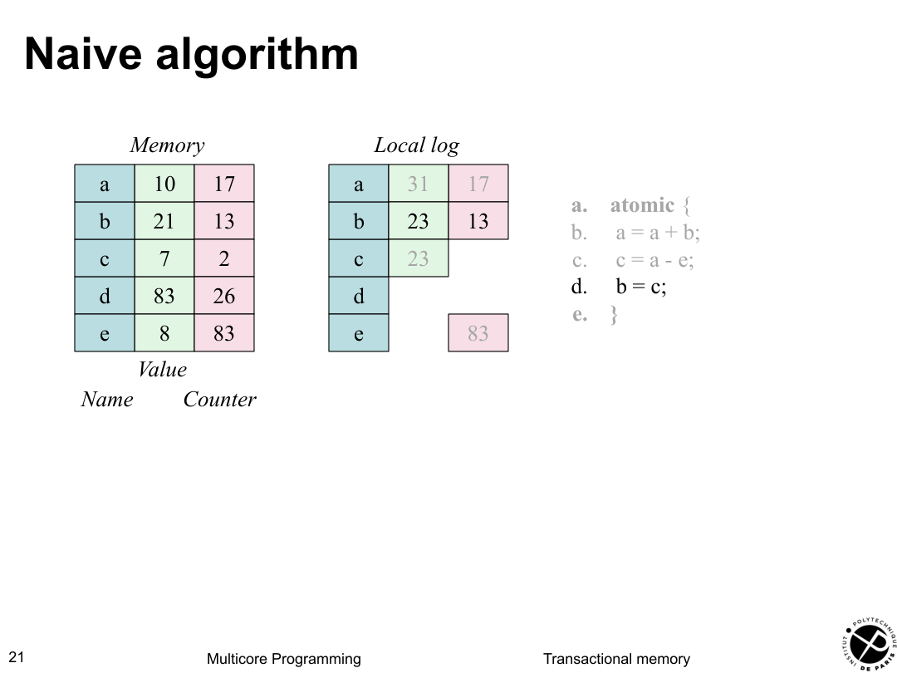

</details>

<a id="page-22"></a>

## 第 22 页 · Naive algorithm

Memory

Local log

a

10

17

a

31

17

a. atomic { b. a = a + b; c. c = a - e; d. b = c; e. } 83

b

21

13

b

23

13

c

7

2

c

23

d

26

d

e

8

83

e

83

Value

Name Counter

a

31

18

b

23

14

Memory state after commit

c

23

3

d

83

26

e

8

83

> 校对：读集合与写集合；a=31,c=23,b=23；版本列单列。

<details>
<summary>查看第 22 页原图（图形、代码布局与标注）</summary>

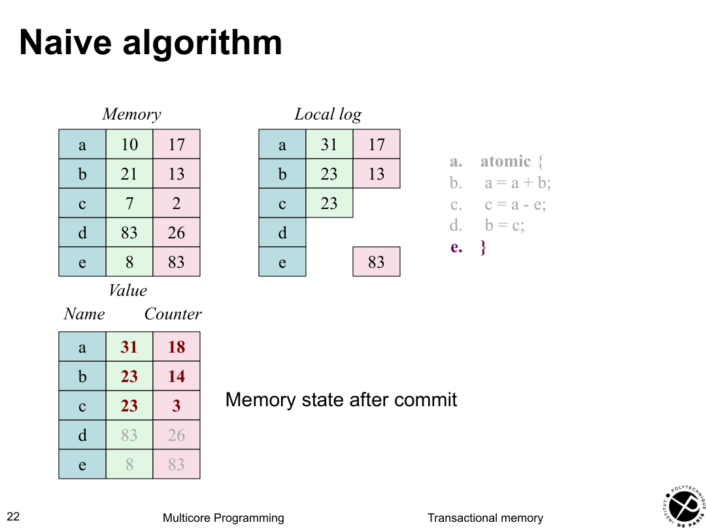

</details>

<a id="page-23"></a>

## 第 23 页 · Issue: zombie transactions

a. atomic { b. if(x != null) c. x.f(); d. }

e. atomic { f. x = null; g. }

ref 17 x

> 校对：不能等到提交才验证；再次使用与再次版本检查区别。

<details>
<summary>查看第 23 页原图（图形、代码布局与标注）</summary>

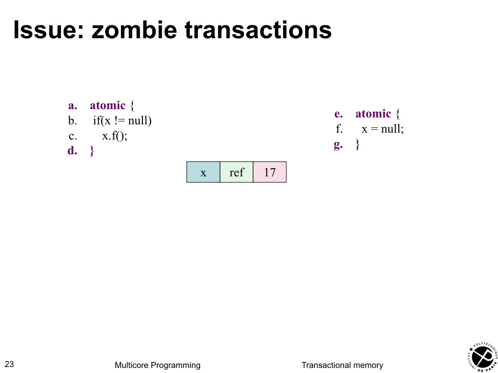

</details>

<a id="page-24"></a>

## 第 24 页 · Issue: zombie transactions

a. atomic { b. if(x != null) c. x.f(); d. }

e. atomic { f. x = null; g. }

ref 17 x

17 x a, b

> 校对：不能等到提交才验证；再次使用与再次版本检查区别。

<details>
<summary>查看第 24 页原图（图形、代码布局与标注）</summary>

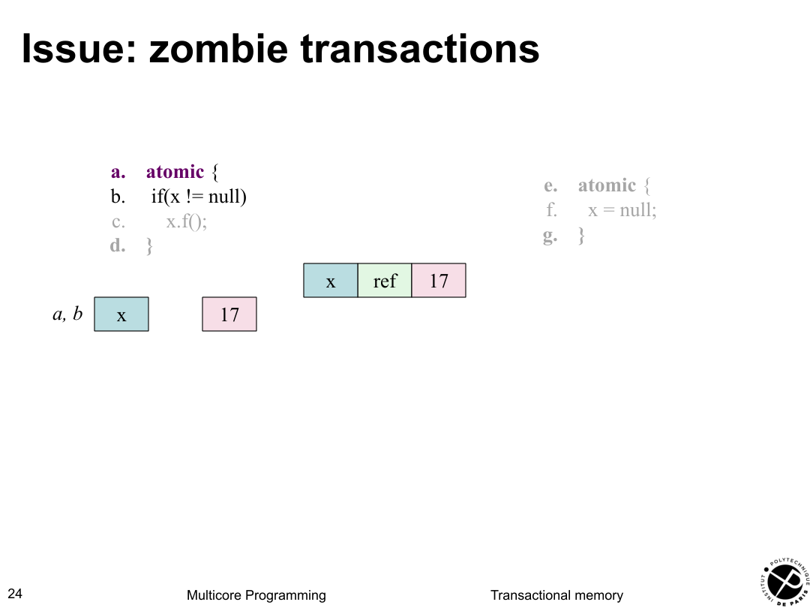

</details>

<a id="page-25"></a>

## 第 25 页 · Issue: zombie transactions

a. atomic { b. if(x != null) c. x.f(); d. }

e. atomic { f. x = null; g. }

ref 17 x

17 x a, b

null x

e, f

> 校对：不能等到提交才验证；再次使用与再次版本检查区别。

<details>
<summary>查看第 25 页原图（图形、代码布局与标注）</summary>

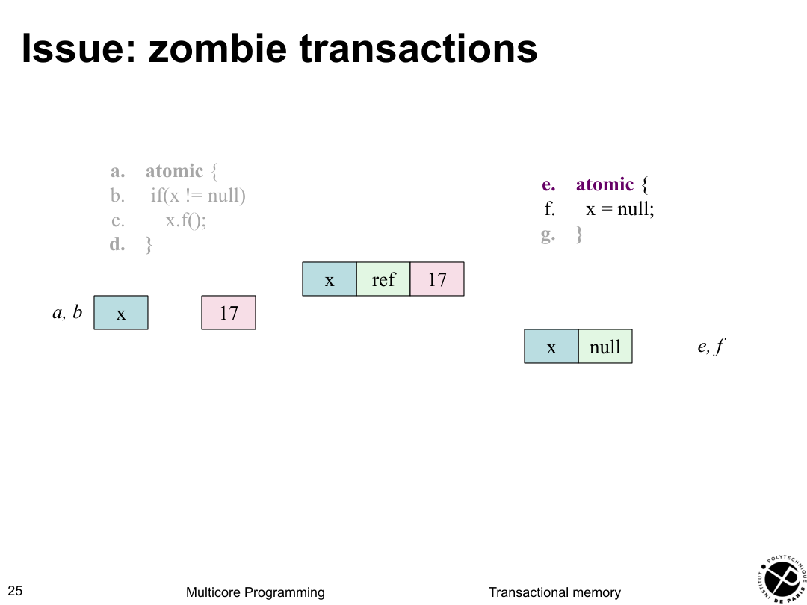

</details>

<a id="page-26"></a>

## 第 26 页 · Issue: zombie transactions

a. atomic { b. if(x != null) c. x.f(); d. }

e. atomic { f. x = null; g. }

ref 17 x

17 x a, b

commit

null x

e, f

null 18 x

g

> 校对：不能等到提交才验证；再次使用与再次版本检查区别。

<details>
<summary>查看第 26 页原图（图形、代码布局与标注）</summary>

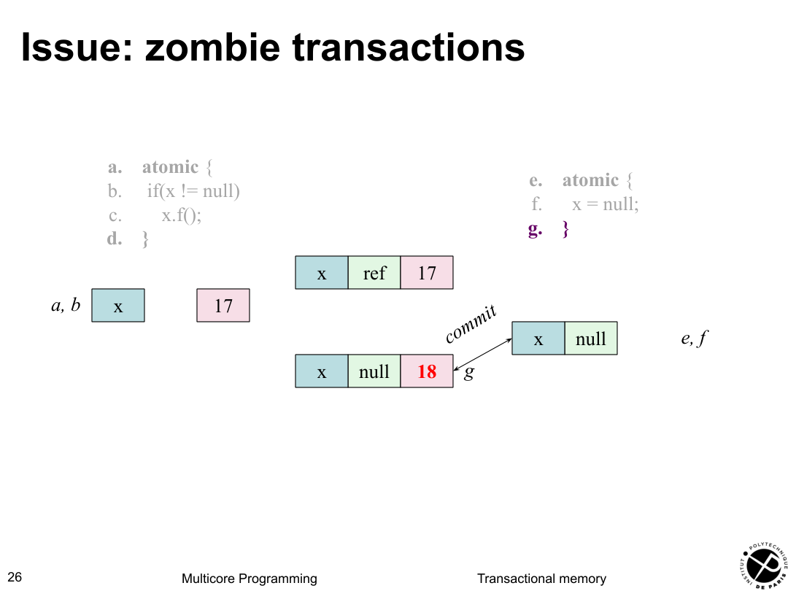

</details>

<a id="page-27"></a>

## 第 27 页 · Issue: zombie transactions

a. atomic { b. if(x != null) c. x.f(); d. }

e. atomic { f. x = null; g. }

ref 17 x

17 x a, b

Conflict

null x

e, f

null 18 x

g

> 校对：不能等到提交才验证；再次使用与再次版本检查区别。

<details>
<summary>查看第 27 页原图（图形、代码布局与标注）</summary>

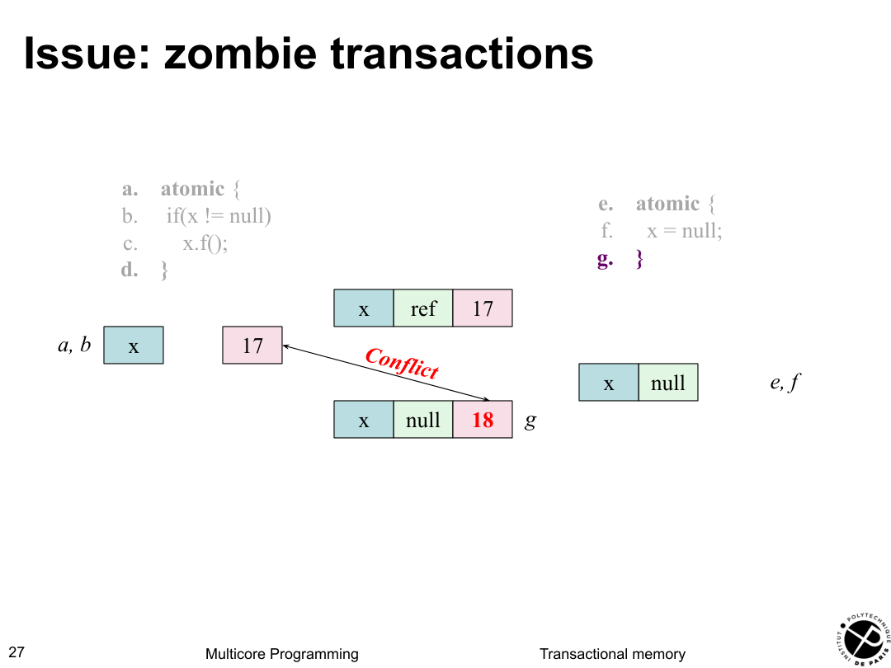

</details>

<a id="page-28"></a>

## 第 28 页 · Issue: zombie transactions

a. atomic { b. if(x != null) c. x.f(); d. }

e. atomic { f. x = null; g. }

ref 17 x

17 x a, b

Conflict

null x

e, f

null 18 x

g

c: NullPointerException

Problem: the transaction does not read x again!

> 校对：原文not read x again按缺少版本复验理解。

<details>
<summary>查看第 28 页原图（图形、代码布局与标注）</summary>

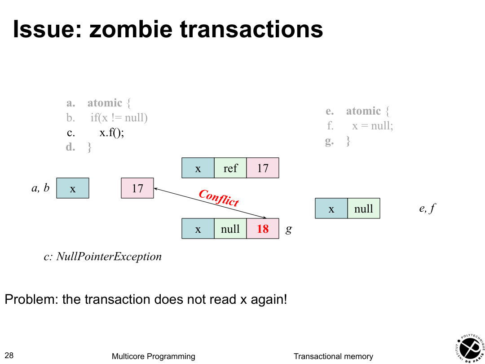

</details>

<a id="page-29"></a>

## 第 29 页 · Issue: zombie transactions

a. atomic { b. if(x != null) c. x.f(); d. }

e. atomic { f. x = null; g. }

ref 17 x

17 x a, b

Conflict

null x

e, f

null 18 x

g

c: NullPointerException

Naive solution: read again the x counter at line c and abort

> 校对：不能等到提交才验证；再次使用与再次版本检查区别。

<details>
<summary>查看第 29 页原图（图形、代码布局与标注）</summary>

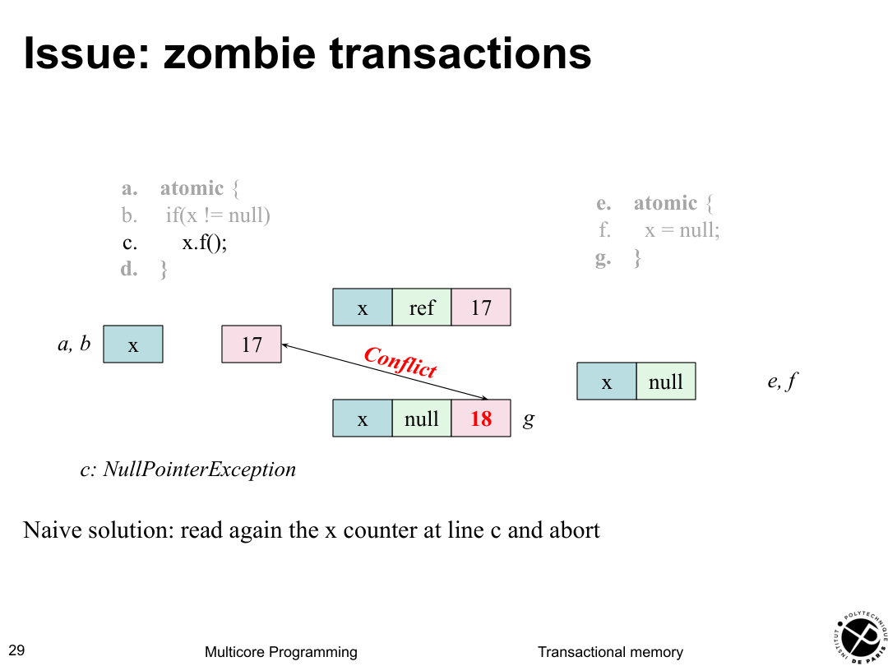

</details>

<a id="page-30"></a>

## 第 30 页 · Issue: another zombie transaction

Initially: x = 4, y = 5

a. atomic { b. t1 = x; c. t2 = y; d. p = 1/(t1-t2) e. }

f. atomic { g. x = 217; h. y = 4; i. } 4 17 x

5 83 y

Reading the counter at each read is not enough Let suppose the invariant x != y

> 校对：旧x=4加新y=4产生除零；终态均满足x!=y。

<details>
<summary>查看第 30 页原图（图形、代码布局与标注）</summary>

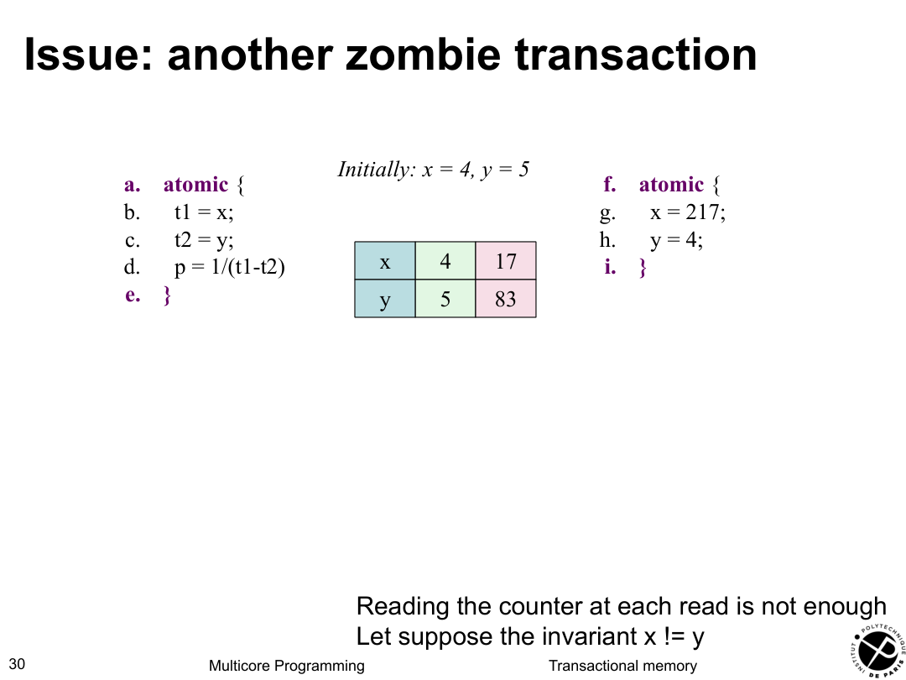

</details>

<a id="page-31"></a>

## 第 31 页 · Issue: another zombie transaction

Initially: x = 4, y = 5

a. atomic { b. t1 = x; c. t2 = y; d. p = 1/(t1-t2) e. }

f. atomic { g. x = 217; h. y = 4; i. } 4 17 x

5 83 y

17 x a,b : t1 = 4

Reading the counter at each read is not enough Let suppose the invariant x != y

> 校对：旧x=4加新y=4产生除零；终态均满足x!=y。

<details>
<summary>查看第 31 页原图（图形、代码布局与标注）</summary>

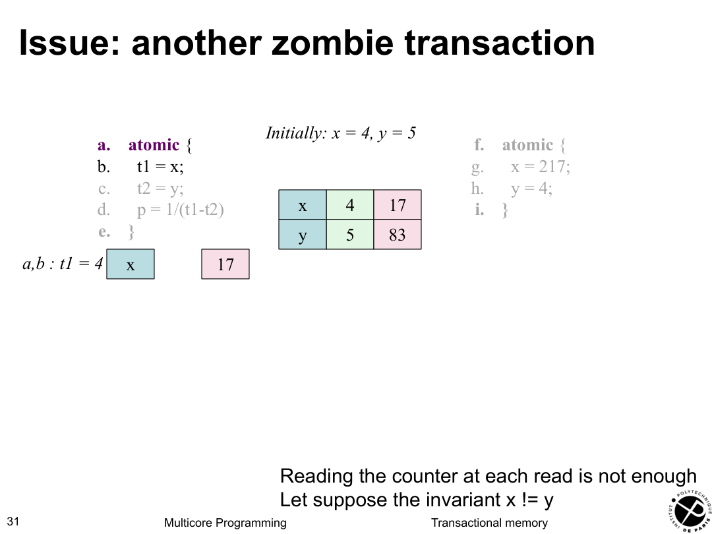

</details>

<a id="page-32"></a>

## 第 32 页 · Issue: another zombie transaction

Initially: x = 4, y = 5

a. atomic { b. t1 = x; c. t2 = y; d. p = 1/(t1-t2) e. }

f. atomic { g. x = 217; h. y = 4; i. } 4 17 x

5 83 y

17 x a,b : t1 = 4

217 x

f, g, h

4 y

Reading the counter at each read is not enough Let suppose the invariant x != y

> 校对：旧x=4加新y=4产生除零；终态均满足x!=y。

<details>
<summary>查看第 32 页原图（图形、代码布局与标注）</summary>

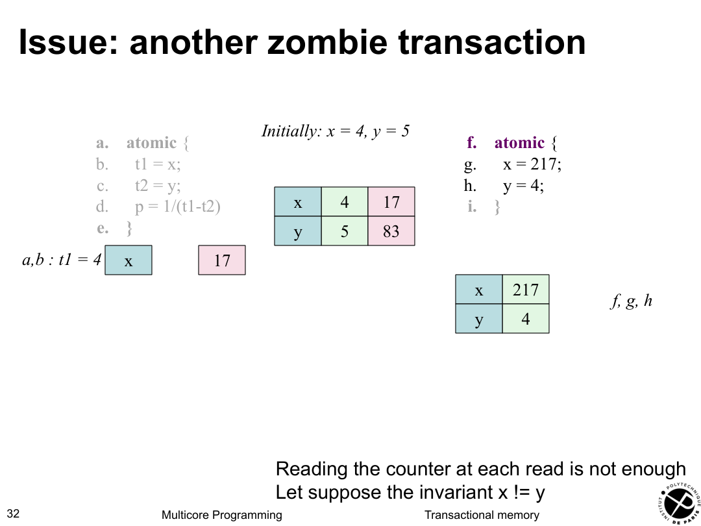

</details>

<a id="page-33"></a>

## 第 33 页 · Issue: another zombie transaction

Initially: x = 4, y = 5

a. atomic { b. t1 = x; c. t2 = y; d. p = 1/(t1-t2) e. }

f. atomic { g. x = 217; h. y = 4; i. } 4 17 x

5 83 y

17 x a,b : t1 = 4

commit

217 x

f, g, h

4 y

217 18 x

i

4 84 y

Reading the counter at each read is not enough Let suppose the invariant x != y

> 校对：旧x=4加新y=4产生除零；终态均满足x!=y。

<details>
<summary>查看第 33 页原图（图形、代码布局与标注）</summary>

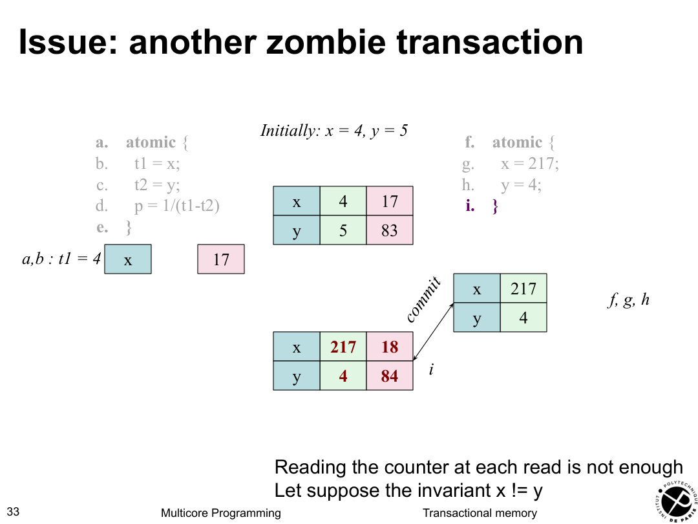

</details>

<a id="page-34"></a>

## 第 34 页 · Issue: another zombie transaction

Initially: x = 4, y = 5

a. atomic { b. t1 = x; c. t2 = y; d. p = 1/(t1-t2) e. }

f. atomic { g. x = 217; h. y = 4; i. } 4 17 x

5 83 y

17 x a,b : t1 = 4

Conflict

217 x

f, g, h

4 y

217 18 x

i

4 84 y

Reading the counter at each read is not enough Let suppose the invariant x != y

> 校对：旧x=4加新y=4产生除零；终态均满足x!=y。

<details>
<summary>查看第 34 页原图（图形、代码布局与标注）</summary>

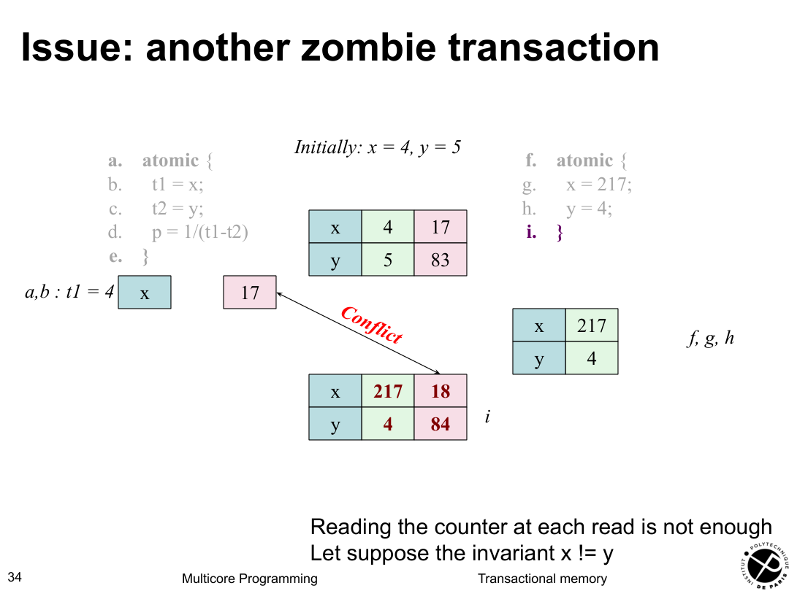

</details>

<a id="page-35"></a>

## 第 35 页 · Issue: another zombie transaction

Initially: x = 4, y = 5

a. atomic { b. t1 = x; c. t2 = y; d. p = 1/(t1-t2) e. }

f. atomic { g. x = 217; h. y = 4; i. } 4 17 x

5 83 y

17 x a,b : t1 = 4

Conflict

217 x

f, g, h

4 y

217 18 x

i

4 84 y

84 y c : t1 = 4,

t2 = 4

Problem: we cannot see that y was modified after the beginning of the transaction Crash because t1 - t2 = 0

Reading the counter at each read is not enough Let suppose the invariant x != y

> 校对：跨对象不一致即使最终abort也可能先导致异常。

<details>
<summary>查看第 35 页原图（图形、代码布局与标注）</summary>

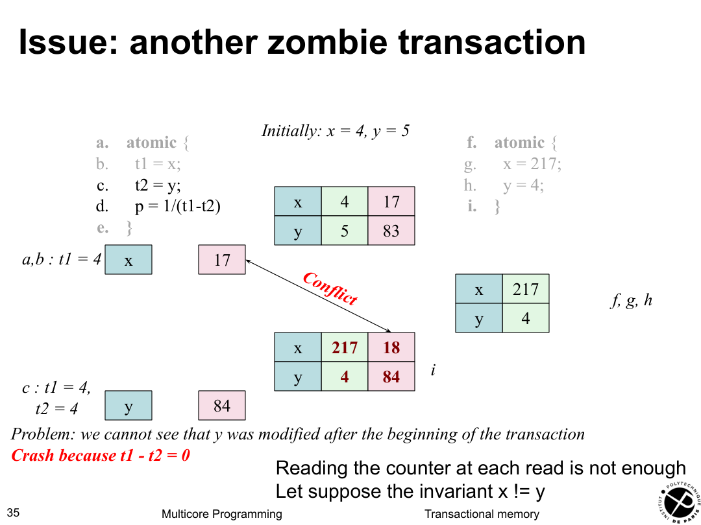

</details>

<a id="page-36"></a>

## 第 36 页 · Complete algorithm

Solution to avoid zombie transactions: a global clock

At each time, the counter of a variable has to be lower than the global clock

⇒ ensures that the variable was not modified after the beginning of the transaction

> 校对：版本>=开始时钟中止；写版本100再将G增至101。

<details>
<summary>查看第 36 页原图（图形、代码布局与标注）</summary>

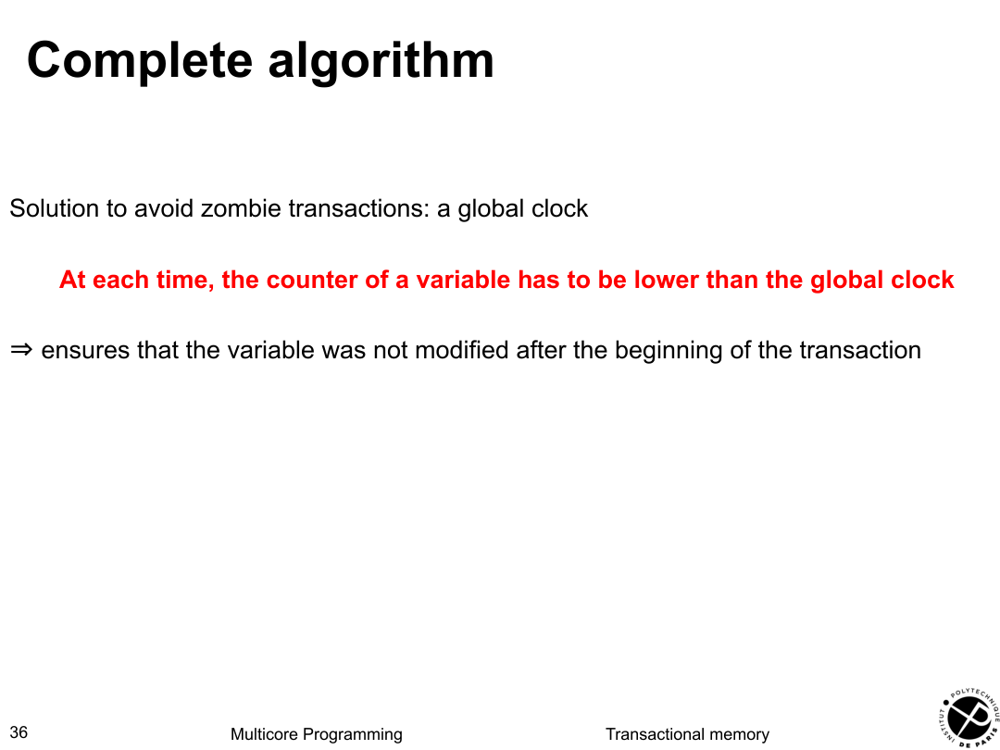

</details>

<a id="page-37"></a>

## 第 37 页 · Full implementation

Start transaction

- Copy the global clock in a local clock

For each read

- Abort if the counter of the variable is greater or equal than the local clock
- Adds the variable to the read set otherwise

For each write

- Add the variable and its value in the write set

End transaction:

- If exists var in read set >=local clock, abort
- For each var in write set, update its value and its counter (to current global clock)
- Increment global clock

37

> 校对：>=与写版本后增时钟的约定保持一致。

<details>
<summary>查看第 37 页原图（图形、代码布局与标注）</summary>

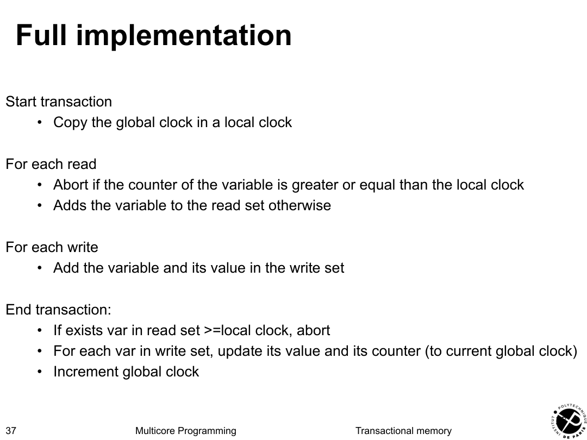

</details>

<a id="page-38"></a>

## 第 38 页 · Full implementation

a. atomic { b. t1 = x; c. t2 = y; d. p = 1/(t1-t2) e. }

f. atomic { g. x = 217; h. y = 4; i. }

90

> 校对：版本>=开始时钟中止；写版本100再将G增至101。

<details>
<summary>查看第 38 页原图（图形、代码布局与标注）</summary>

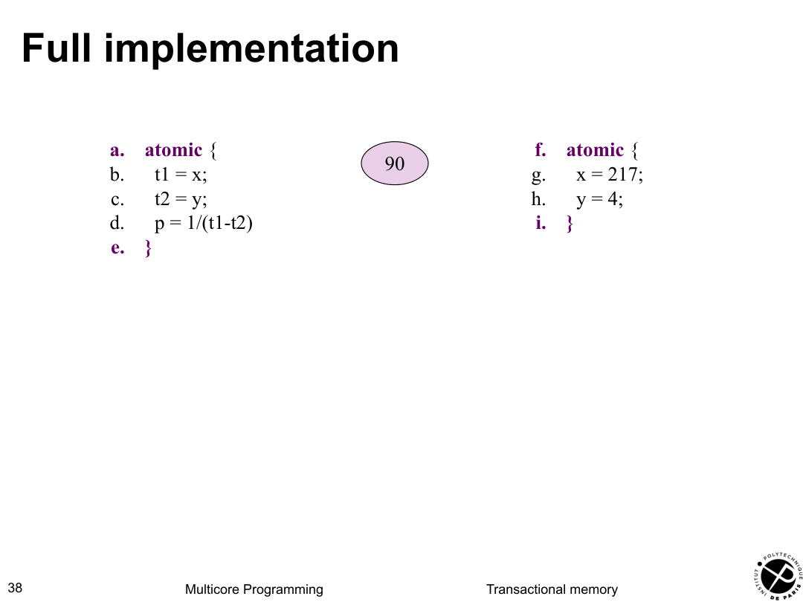

</details>

<a id="page-39"></a>

## 第 39 页 · Full implementation

a. atomic { b. t1 = x; c. t2 = y; d. p = 1/(t1-t2) e. }

f. atomic { g. x = 217; h. y = 4; i. }

90

90

> 校对：版本>=开始时钟中止；写版本100再将G增至101。

<details>
<summary>查看第 39 页原图（图形、代码布局与标注）</summary>

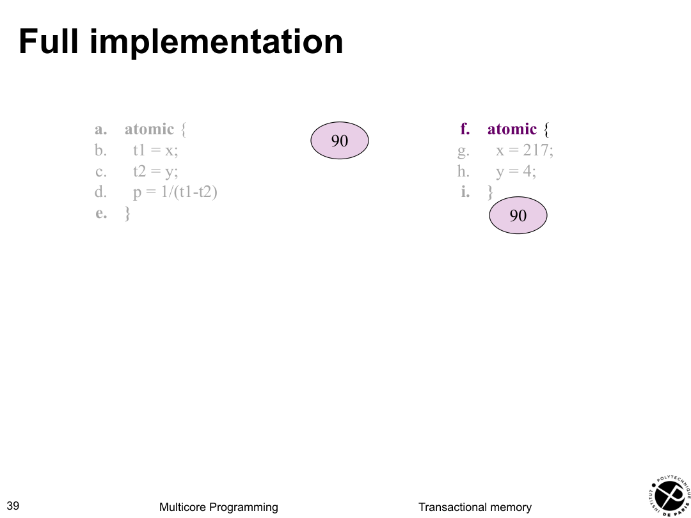

</details>

<a id="page-40"></a>

## 第 40 页 · Full implementation

a. atomic { b. t1 = x; c. t2 = y; d. p = 1/(t1-t2) e. }

f. atomic { g. x = 217; h. y = 4; i. }

90

Other transactions in //

90

100

4 17 x

5 83 y

> 校对：版本>=开始时钟中止；写版本100再将G增至101。

<details>
<summary>查看第 40 页原图（图形、代码布局与标注）</summary>

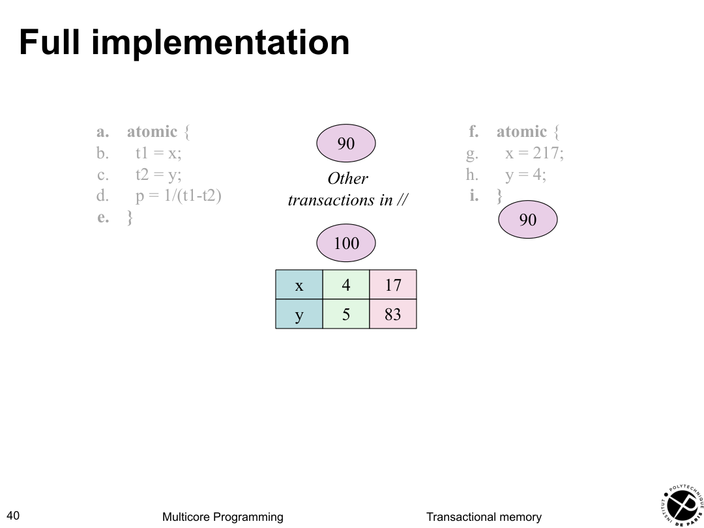

</details>

<a id="page-41"></a>

## 第 41 页 · Full implementation

a. atomic { b. t1 = x; c. t2 = y; d. p = 1/(t1-t2) e. }

f. atomic { g. x = 217; h. y = 4; i. }

90

Other transactions in //

90

100

4 17 x

a

100

5 83 y

> 校对：版本>=开始时钟中止；写版本100再将G增至101。

<details>
<summary>查看第 41 页原图（图形、代码布局与标注）</summary>

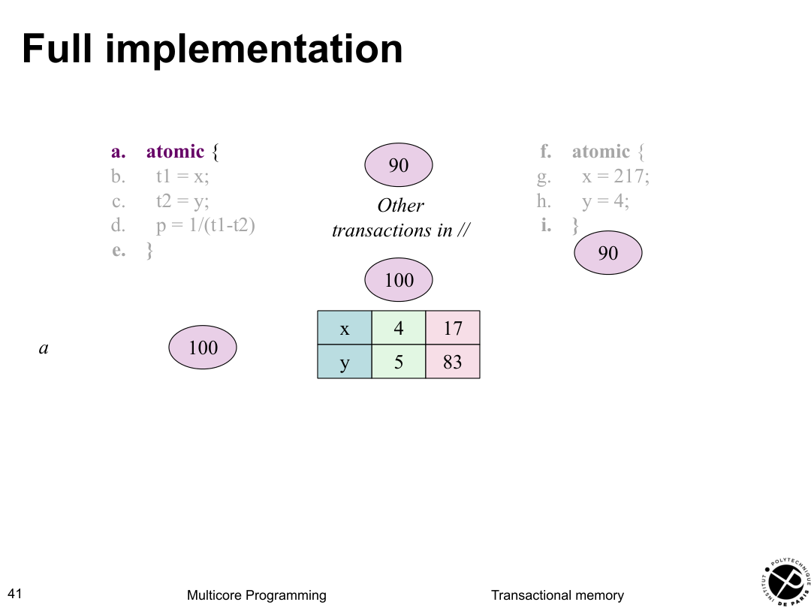

</details>

<a id="page-42"></a>

## 第 42 页 · Full implementation

a. atomic { b. t1 = x; c. t2 = y; d. p = 1/(t1-t2) e. }

f. atomic { g. x = 217; h. y = 4; i. }

90

Other transactions in //

90

100

4 17 x

a

100

5 83 y

b : t1 = 4

x

> 校对：版本>=开始时钟中止；写版本100再将G增至101。

<details>
<summary>查看第 42 页原图（图形、代码布局与标注）</summary>

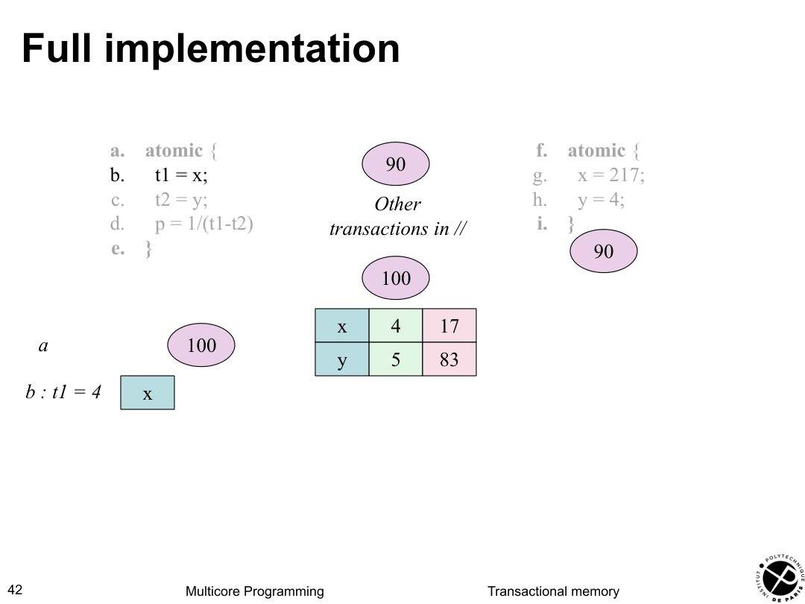

</details>

<a id="page-43"></a>

## 第 43 页 · Full implementation

a. atomic { b. t1 = x; c. t2 = y; d. p = 1/(t1-t2) e. }

f. atomic { g. x = 217; h. y = 4; i. }

90

Other transactions in //

90

100

4 17 x

a

100

5 83 y

b : t1 = 4 217 x

x

4 y g, h

> 校对：版本>=开始时钟中止；写版本100再将G增至101。

<details>
<summary>查看第 43 页原图（图形、代码布局与标注）</summary>

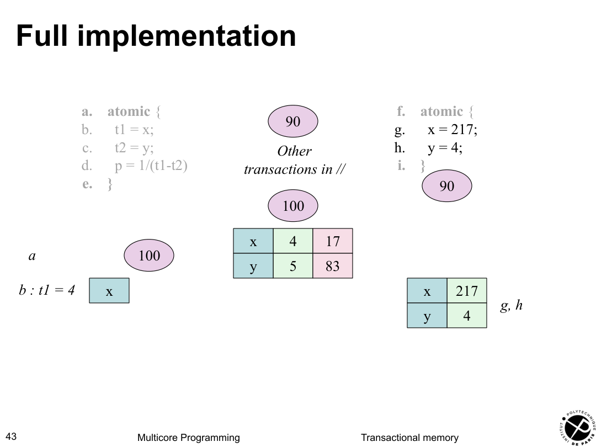

</details>

<a id="page-44"></a>

## 第 44 页 · Full implementation

a. atomic { b. t1 = x; c. t2 = y; d. p = 1/(t1-t2) e. }

f. atomic { g. x = 217; h. y = 4; i. }

90

Other transactions in //

90

100

4 17 x

a

100

5 83 y

b : t1 = 4 217 x

101 x

g, h

4 y

217 100 x

i

4 100 y

> 校对：版本>=开始时钟中止；写版本100再将G增至101。

<details>
<summary>查看第 44 页原图（图形、代码布局与标注）</summary>

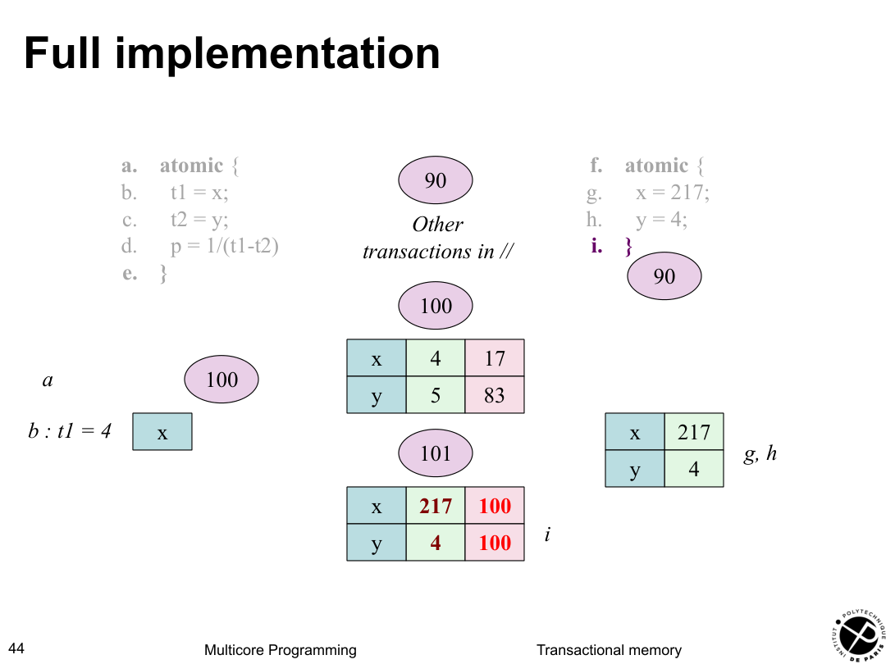

</details>

<a id="page-45"></a>

## 第 45 页 · Full implementation

a. atomic { b. t1 = x; c. t2 = y; d. p = 1/(t1-t2) e. }

f. atomic { g. x = 217; h. y = 4; i. }

90

Other transactions in //

90

100

4 17 x

a

100

5 83 y

b : t1 = 4 217 x

x

101

g, h

4 y

217 100 x

i

4 100 y

c: conflict!

> 校对：版本>=开始时钟中止；写版本100再将G增至101。

<details>
<summary>查看第 45 页原图（图形、代码布局与标注）</summary>

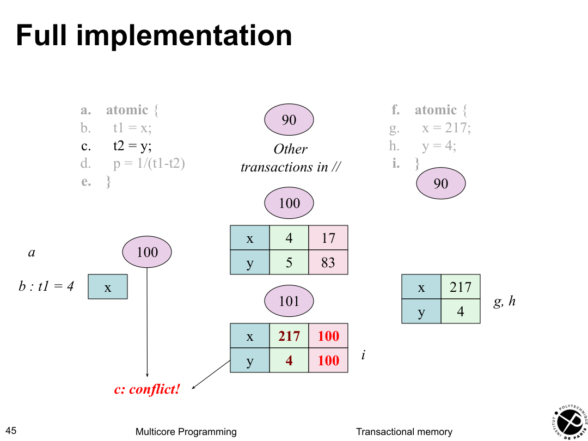

</details>

<a id="page-46"></a>

## 第 46 页 · Implementation

- Memory is an array of pointers to (value, counter)

- Atomically update a pointer to a new (value, counter), but never modify a the value or the counter in an existing (value, counter)

- Don’t try to free a (value, counter): we need a garbage collector because we can not easily know if a (value, counter) is not still used by another thread

> 校对：旧不可变对象不得立即free。

<details>
<summary>查看第 46 页原图（图形、代码布局与标注）</summary>

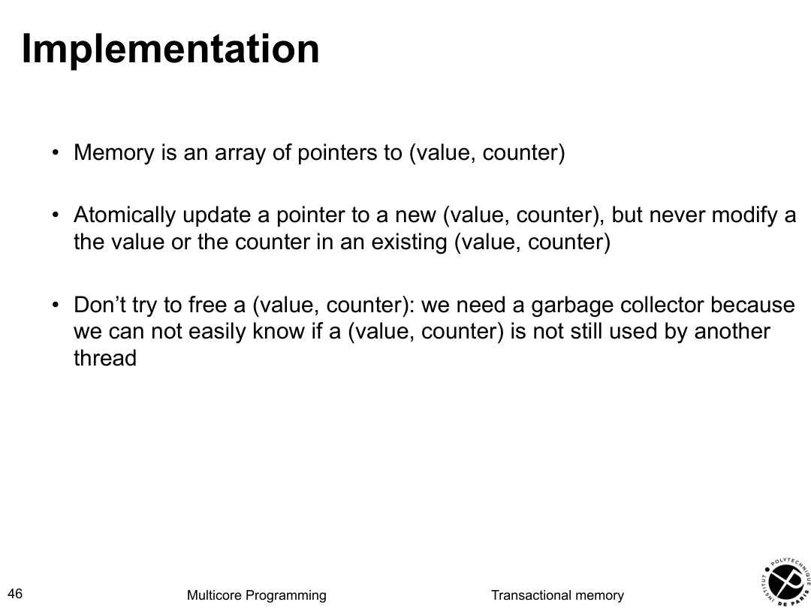

</details>

<a id="page-47"></a>

## 第 47 页 · Implementation

```text
class Value {
  int value;
  int counter;
}
```

```text
class Memory {
  static Value values[];
  static int   clock;
}
```

```text
class TX {
  HashSet<int>      readSet;
  HashMap<int, int> writeSet;
  int               clock;
}
```

> 校对：不可变值版本对、read-your-writes、提交锁、回收。

<details>
<summary>查看第 47 页原图（图形、代码布局与标注）</summary>

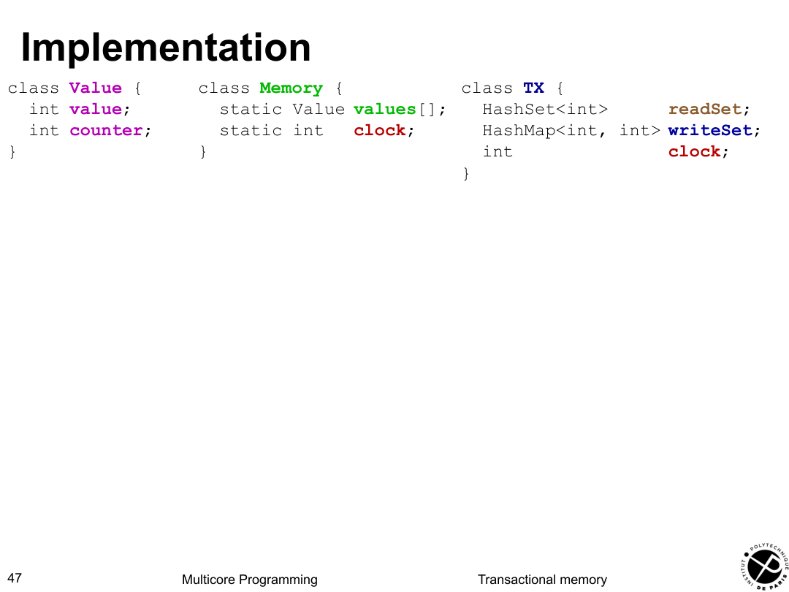

</details>

<a id="page-48"></a>

## 第 48 页 · Implementation

```text
class Value {
  int value;
  int counter;
}
```

```text
class Memory {
  static Value values[];
  static int   clock;
}
```

```text
class TX {
  HashSet<int>      readSet;
  HashMap<int, int> writeSet;
  int               clock;
}
```

```text
void TX.begin() { 
  clock    = Memory.clock; 
  readSet  = new HashSet(); 
  writeSet = new HashMap();
}
```

Start a transaction: copy the

global clock

> 校对：不可变值版本对、read-your-writes、提交锁、回收。

<details>
<summary>查看第 48 页原图（图形、代码布局与标注）</summary>

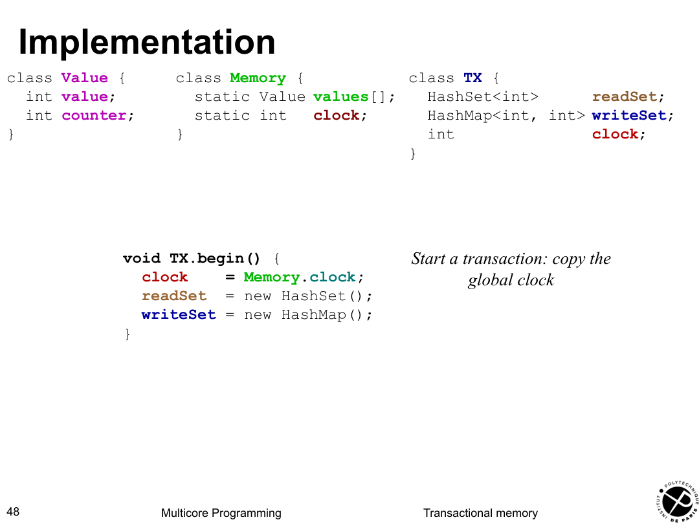

</details>

<a id="page-49"></a>

## 第 49 页 · Implementation

```text
class Value {
  int value;
  int counter;
}
```

```text
class Memory {
  static Value values[];
  static int   clock;
}
```

```text
class TX {
  HashSet<int>      readSet;
  HashMap<int, int> writeSet;
  int               clock;
}
```

Deferred update: write

```text
void TX.write(int idx, int value) {
  writeSet.put(idx, value);
}
```

in a local variable

> 校对：不可变值版本对、read-your-writes、提交锁、回收。

<details>
<summary>查看第 49 页原图（图形、代码布局与标注）</summary>

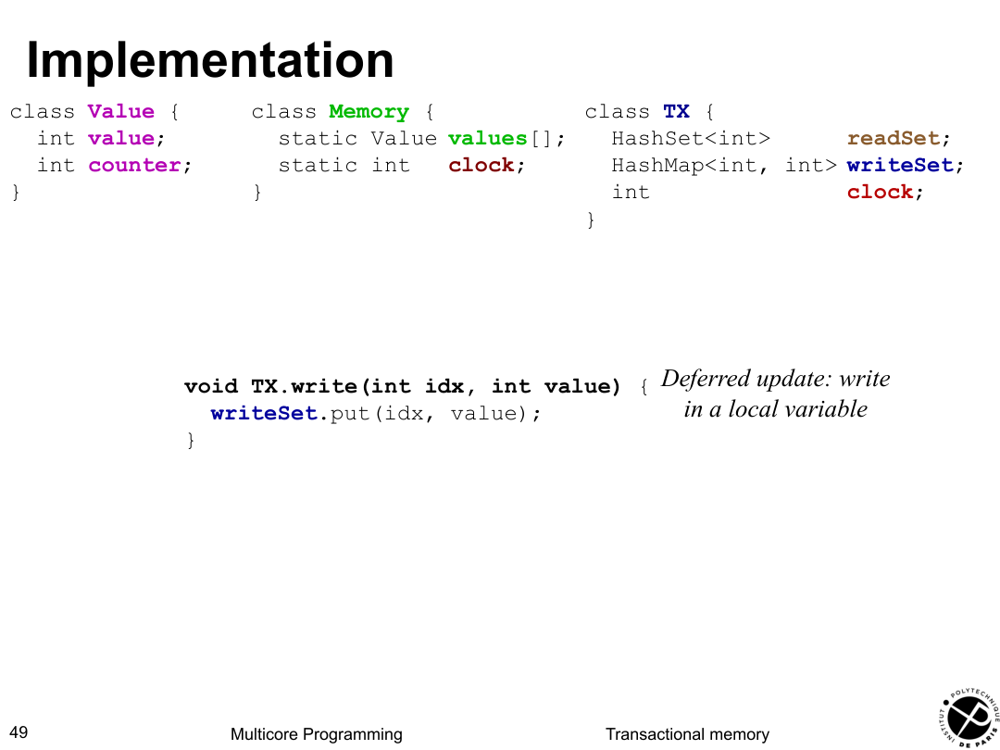

</details>

<a id="page-50"></a>

## 第 50 页 · Implementation

```text
class Value {
  int value;
  int counter;
}
```

```text
class Memory {
  static Value values[];
  static int   clock;
}
```

```text
class TX {
  HashSet<int>      readSet;
  HashMap<int, int> writeSet;
  int               clock;
}
```

```text
int TX.read(int idx) {
  if(writeSet.contains(idx))
    return writeSet.get(idx);
```

If a local write exists, use it

```text
  Value value = Memory.values[idx];
```

```text
  if(value.counter >= clock) 
    abort();
```

Abort of value was modified by

another transaction

```text
  readSet.add(idx);
  
  return value.value;  
}
```

> 校对：不可变值版本对、read-your-writes、提交锁、回收。

<details>
<summary>查看第 50 页原图（图形、代码布局与标注）</summary>

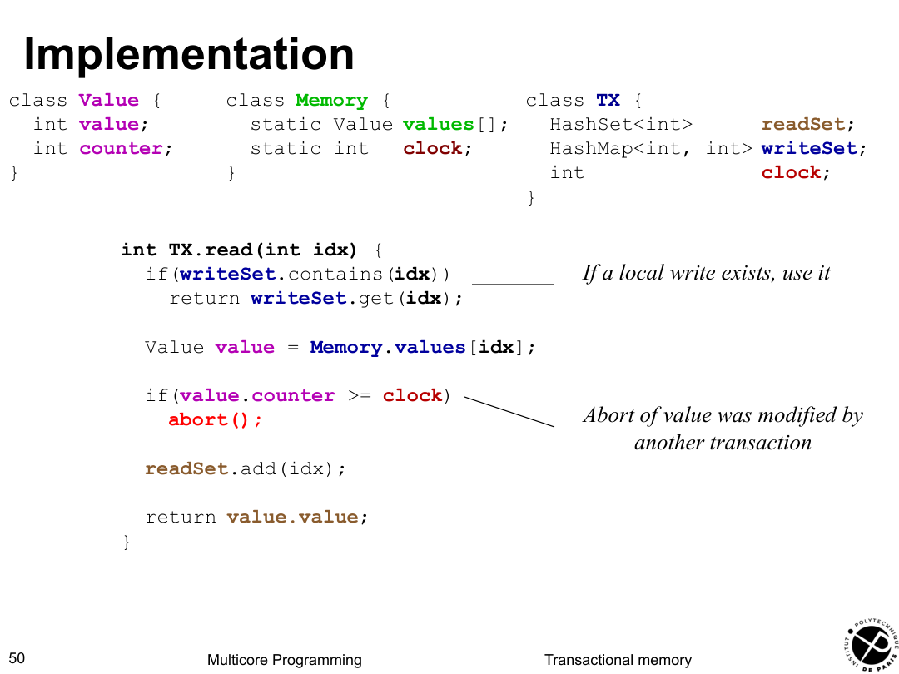

</details>

<a id="page-51"></a>

## 第 51 页 · Implementation

```text
class Value {
  int value;
  int counter;
}
```

```text
class Memory {
  static Value values[];
  static int   clock;
}
```

```text
class TX {
  HashSet<int>      readSet;
  HashMap<int, int> writeSet;
  int               clock;
}
```

```text
void TX.commit() {
  synchronized(Memory.values) { // Take a lock during a commit
    for(int idx : readSet)
      if(Memory.values[idx].counter >= clock) abort();
    
    // ok, commit!
    for(Map<int, Value> entry : writeSet.entrySet()) {
      Value v = new Value(entry.getValue(), Memory.clock);
      Memory.values[entry.getKey()] = v;
    }
```

Reader/writer conflict?

Record the written

values and updates the

counters

```text
    Memory.clock++;
  }
}
```

For each transaction that begin after

this line, the writes are consistent

(counter < clock)

> 校对：伪Java类型不一致；提交锁不自动同步无锁读取端。

<details>
<summary>查看第 51 页原图（图形、代码布局与标注）</summary>

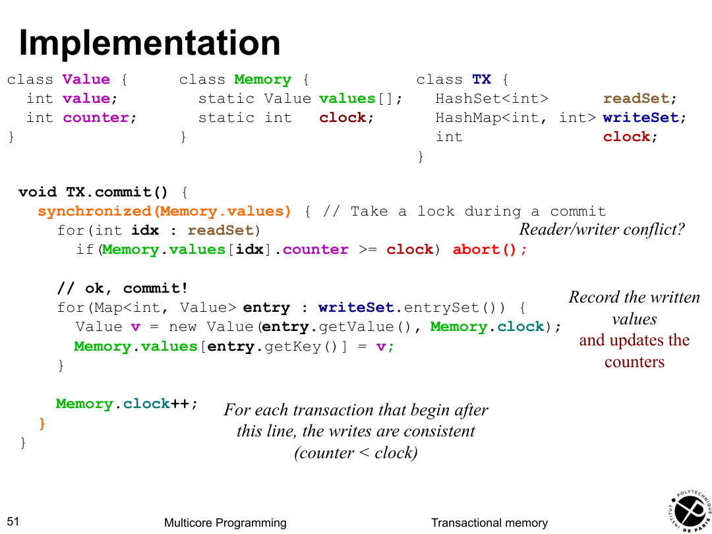

</details>

<a id="page-52"></a>

## 第 52 页 · Implementation

Problem:

Two transactions abort each other Restart ⇒ they will probably abort each other

Solution:

- Introduce a random dalay that increases exponentially (backoff)

```text
int backoff(int n) {
  Thread.sleep(1+(int)(n*Math.random()));
  return n < 512 ? n<<1 : n;
}
```

```text
void doTransaction() {
  n = 16;
  try {              tx.begin(); …; tx.commit();     }
  catch(TXAbort e) { n = backoff(n); doTransaction();  }
}
```

> 校对：递归重设n=16破坏指数退避状态。

<details>
<summary>查看第 52 页原图（图形、代码布局与标注）</summary>

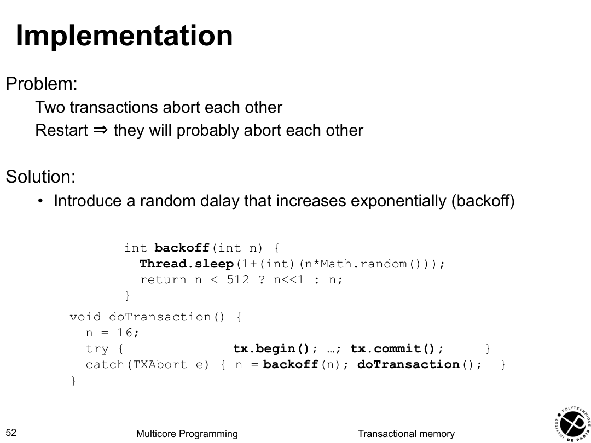

</details>

<a id="page-53"></a>

## 第 53 页 · Transaction and Input/Output

```text
atomic {
  if(x > 42)
    launchMissile();
}
```

Aborting an input/output is not always possible

Solution:

- Ensures that the transaction can still commit before the I/O
- Marks the transaction as unabortable ⇒Complexify the code

> 校对：abort不能回滚外部副作用。

<details>
<summary>查看第 53 页原图（图形、代码布局与标注）</summary>

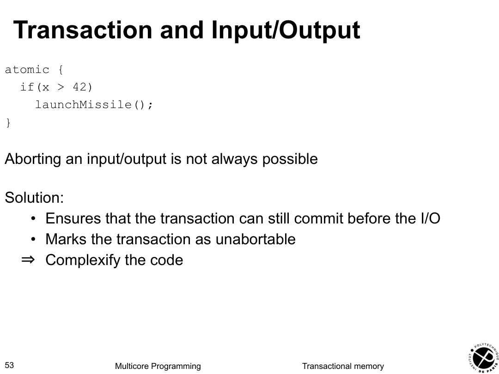

</details>

<a id="page-54"></a>

## 第 54 页 · To take away

Transactional memory simplifies the development of concurrent

applications

- No deadlock, no starvation
- Composability (inner transactions, retry, orElse)

Implementation is difficult: performance are far from perfect

- STM: less efficient than fine grain locking schemes [Rossback07]
- HTM: only for corner case where the transaction fits in the L1 cache
- HyTM: switching from HTM to STM is costly

Performance evaluation:

- 100 threads increment 10’000 times a counter on a 2-core
- 3,0s in STM without backoff, 0, 48s in STM with backoff, 0,19s with a lock)

> 校对：无死锁/无饥饿不是无条件保证；性能仅历史配置。

<details>
<summary>查看第 54 页原图（图形、代码布局与标注）</summary>

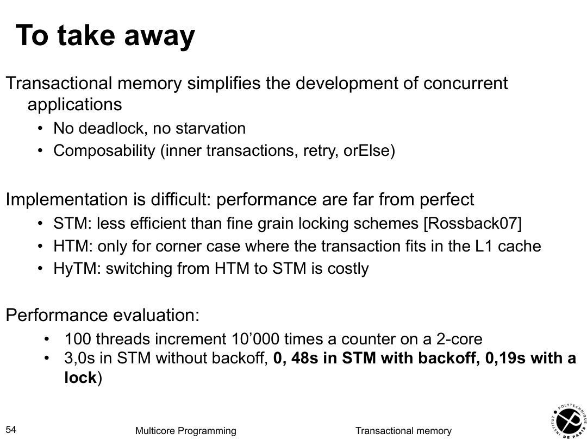

</details>

## 原 OCR 图片保留索引

以下按原始 OCR 引用顺序保留，方便核对裁切范围；准确页码以逐页原图为准。

- [提取图 001](Images/04-stm/image_001.jpg)
- [提取图 002](Images/04-stm/image_002.jpg)
- [提取图 003](Images/04-stm/image_003.jpg)
- [提取图 004](Images/04-stm/image_004.jpg)
- [提取图 005](Images/04-stm/image_005.jpg)
- [提取图 006](Images/04-stm/image_006.jpg)
- [提取图 007](Images/04-stm/image_007.jpg)
- [提取图 008](Images/04-stm/image_008.jpg)
- [提取图 009](Images/04-stm/image_009.jpg)
- [提取图 010](Images/04-stm/image_010.jpg)
- [提取图 011](Images/04-stm/image_011.jpg)
- [提取图 012](Images/04-stm/image_012.jpg)
- [提取图 013](Images/04-stm/image_013.jpg)
- [提取图 014](Images/04-stm/image_014.jpg)
- [提取图 015](Images/04-stm/image_015.jpg)
- [提取图 016](Images/04-stm/image_016.jpg)
- [提取图 017](Images/04-stm/image_017.jpg)
- [提取图 018](Images/04-stm/image_018.jpg)
- [提取图 019](Images/04-stm/image_019.jpg)
- [提取图 020](Images/04-stm/image_020.jpg)
- [提取图 021](Images/04-stm/image_021.jpg)
- [提取图 022](Images/04-stm/image_022.jpg)
- [提取图 023](Images/04-stm/image_023.jpg)
- [提取图 024](Images/04-stm/image_024.jpg)
- [提取图 025](Images/04-stm/image_025.jpg)
- [提取图 026](Images/04-stm/image_026.jpg)
- [提取图 027](Images/04-stm/image_027.jpg)
- [提取图 028](Images/04-stm/image_028.jpg)
- [提取图 029](Images/04-stm/image_029.jpg)
- [提取图 030](Images/04-stm/image_030.jpg)
- [提取图 031](Images/04-stm/image_031.jpg)
- [提取图 032](Images/04-stm/image_032.jpg)
- [提取图 033](Images/04-stm/image_033.jpg)
- [提取图 034](Images/04-stm/image_034.jpg)
