# 05-numa · 原文校对稿

[原始 PDF](05-numa.pdf) · [中文详解](05-numa_zh.md) · [课程目录](README.md)

对应实验：NUMA（[中文版](../Labs/tp-numa/tp-numa_zh.html) · [英文原版](../Labs/tp-numa/tp-numa.html)）

> 以 PDF 内嵌文字层重建，按原页和文字块分离正文、代码与图注，修复 MinerU 的混栏、页脚入代码及语言标签问题。保留原课件的用词和代码疑点，不将其悄悄改写为正确程序。代码块有时是逐步展示中的片段；图形、数学排版、颜色和箭头以各页展开后的原图为准。

[重要勘误](ERRATA.md)

<a id="page-1"></a>

## 第 1 页 · Page 1

Non uniform memory architectures

Master in computer science of IP Paris

Master CHPS of Paris Saclay

Gaël Thomas

> 校对：历史曲线；核数、频率、功耗不混为性能。

<details>
<summary>查看第 1 页原图（图形、代码布局与标注）</summary>

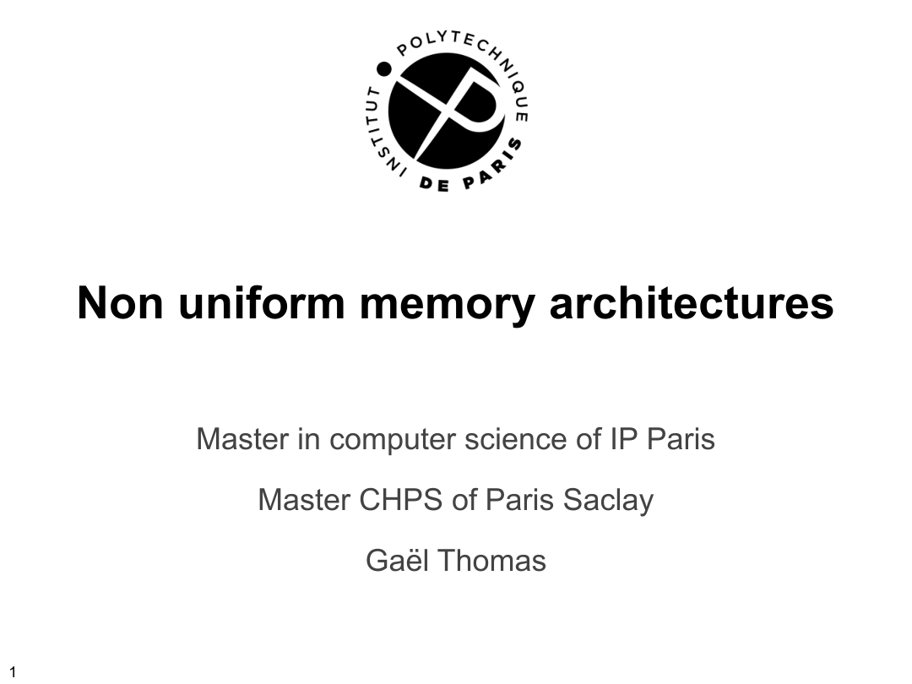

</details>

<a id="page-2"></a>

## 第 2 页 · We need computing power

- To analyze large datasets

- To perform large computations

- To handle many clients

> 校对：历史曲线；核数、频率、功耗不混为性能。

<details>
<summary>查看第 2 页原图（图形、代码布局与标注）</summary>

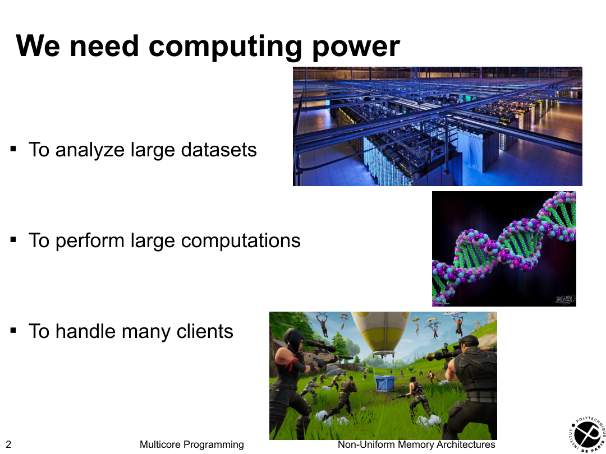

</details>

<a id="page-3"></a>

## 第 3 页 · The computing power is in the CPU

> 校对：历史曲线；核数、频率、功耗不混为性能。

<details>
<summary>查看第 3 页原图（图形、代码布局与标注）</summary>

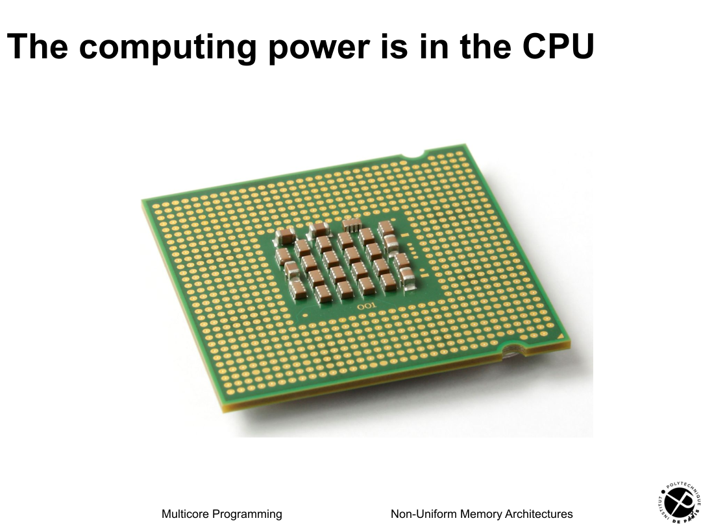

</details>

<a id="page-4"></a>

## 第 4 页 · (Old) computing power trends

Moore’s low: #transistors x2 each 1.5 year

# transistors (thousands) Single step Perf (SpecINT)

Frequency (MHz) ⇒ processing power

Typical (electrical) power (Watts)

> 校对：Moore low原文拼写与历史趋势。

<details>
<summary>查看第 4 页原图（图形、代码布局与标注）</summary>

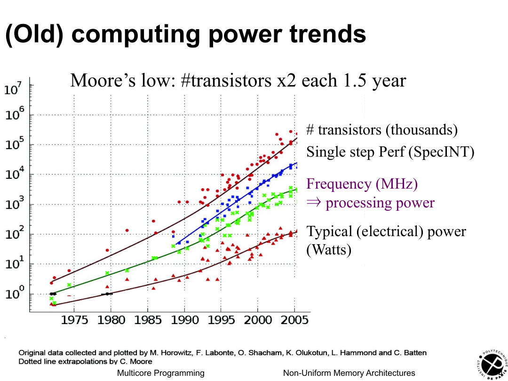

</details>

<a id="page-5"></a>

## 第 5 页 · But frequency increases ⇒ electrical  power increases

Helicopter GEN H-4

(4 passenger)

Washing machine

Typical (electrical) power (Watts)

> 校对：历史曲线；核数、频率、功耗不混为性能。

<details>
<summary>查看第 5 页原图（图形、代码布局与标注）</summary>

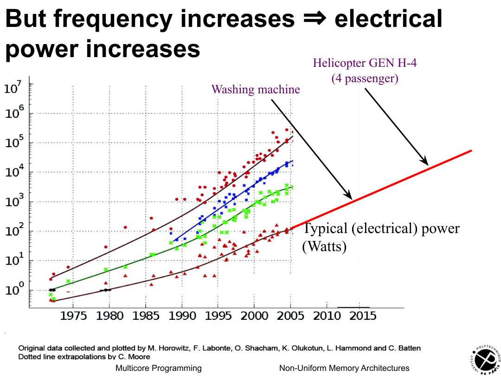

</details>

<a id="page-6"></a>

## 第 6 页 · Fortunately, the Moore’s law still hold

# transistors (thousands)

Typical (electrical) power (Watts)

> 校对：历史曲线；核数、频率、功耗不混为性能。

<details>
<summary>查看第 6 页原图（图形、代码布局与标注）</summary>

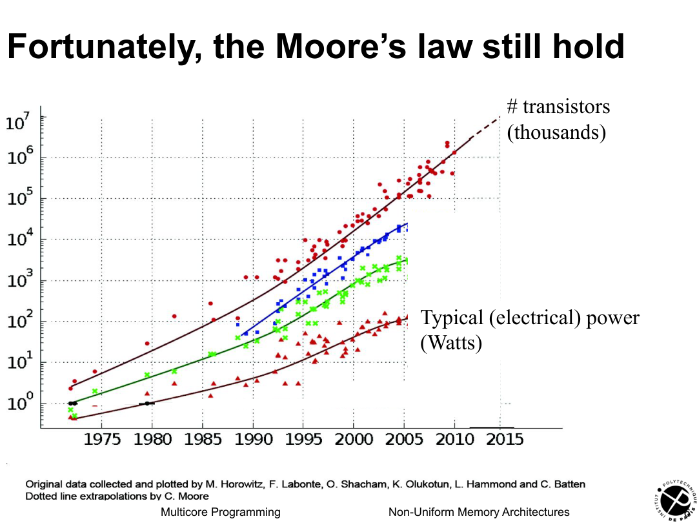

</details>

<a id="page-7"></a>

## 第 7 页 · Today: we increase power by increasing  the number of cores

# transistors (thousands)

Single step Perf (SpecINT)

Frequency (MHz)

Typical power (Watts)

# cores

> 校对：历史曲线；核数、频率、功耗不混为性能。

<details>
<summary>查看第 7 页原图（图形、代码布局与标注）</summary>

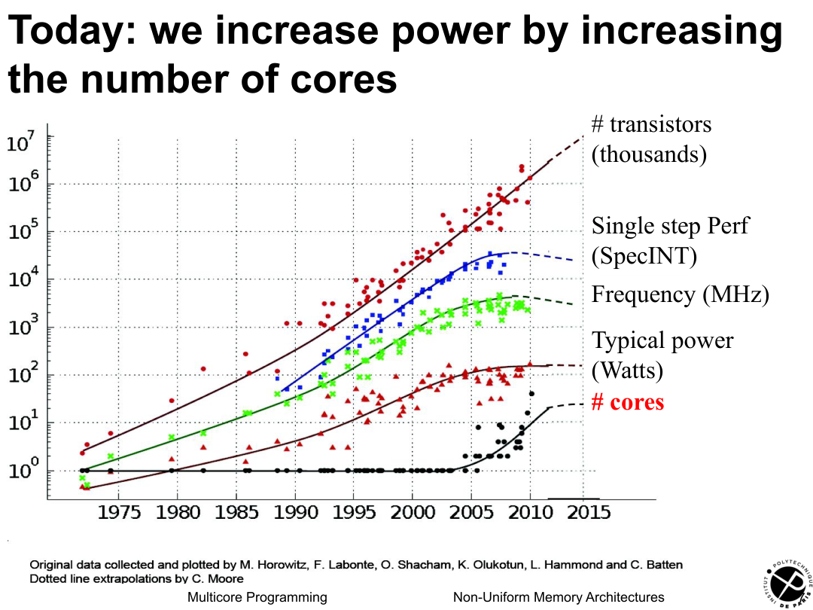

</details>

<a id="page-8"></a>

## 第 8 页 · But programming a multicore is hard

On my laptop at 2k€

#include <stdlib.h>

(2 cores at 2.2GHz)

#define N 100000000

$ time ./bip real 0m0.474s

int main(int argc, char **argv) { int* a = malloc(sizeof(int) * N);

On my server at 15k€

for(int i=1; i<N; i++) { a[i] = a[i] * a[i-1]; } }

(48 cores at 2.2GHz)

$ time ./bip real 0m1.142s

Not really what we can expect

> 校对：未初始化读取、依赖循环、结果未消费，不是可直接复现基准。

<details>
<summary>查看第 8 页原图（图形、代码布局与标注）</summary>

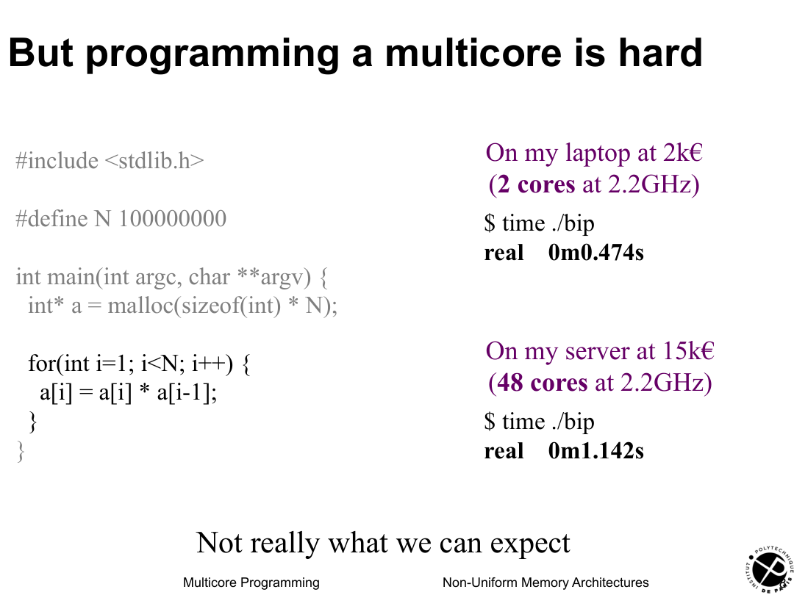

</details>

<a id="page-9"></a>

## 第 9 页 · Multicores radically change the way  we design applications

- 

We have to parallelize our applications

> 校对：未初始化数组和无可观测结果使片段不是严格基准。

<details>
<summary>查看第 9 页原图（图形、代码布局与标注）</summary>

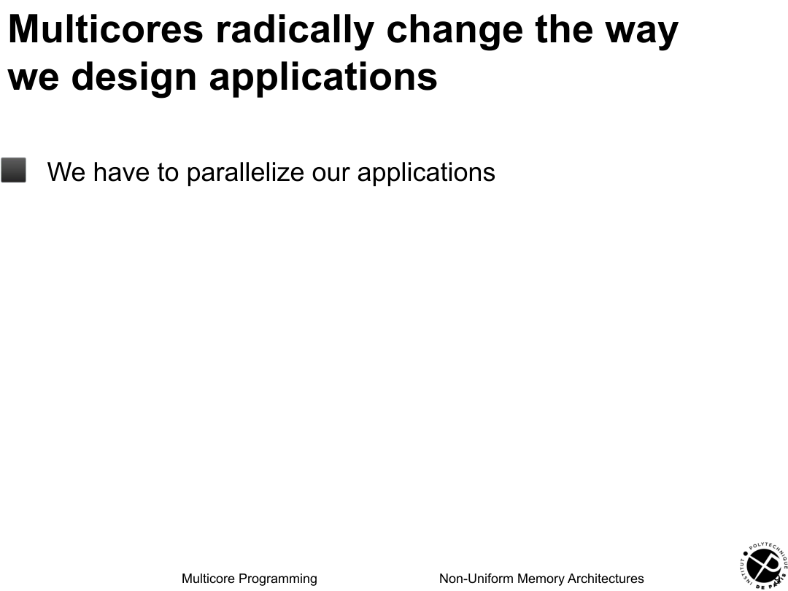

</details>

<a id="page-10"></a>

## 第 10 页 · Multicores radically change the way  we design applications

- 

We have to parallelize our applications

- 

And our parallel algorithms have to scale

> 校对：未初始化数组和无可观测结果使片段不是严格基准。

<details>
<summary>查看第 10 页原图（图形、代码布局与标注）</summary>

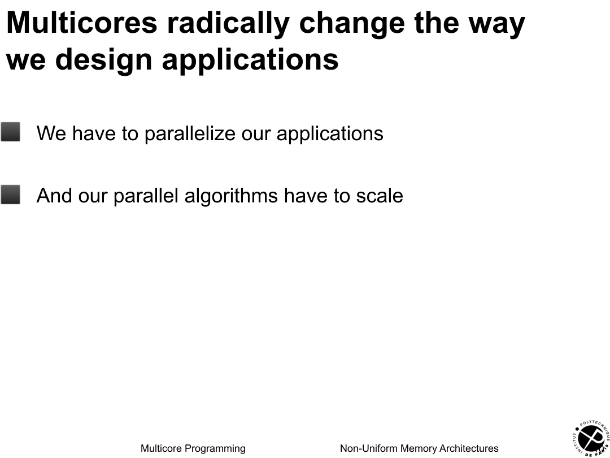

</details>

<a id="page-11"></a>

## 第 11 页 · Multicores radically change the way  we design applications

- 

We have to parallelize our applications

- 

And our parallel algorithms have to scale

But that’s not enough…

We have to handle complex memory architectures

> 校对：未初始化数组和无可观测结果使片段不是严格基准。

<details>
<summary>查看第 11 页原图（图形、代码布局与标注）</summary>

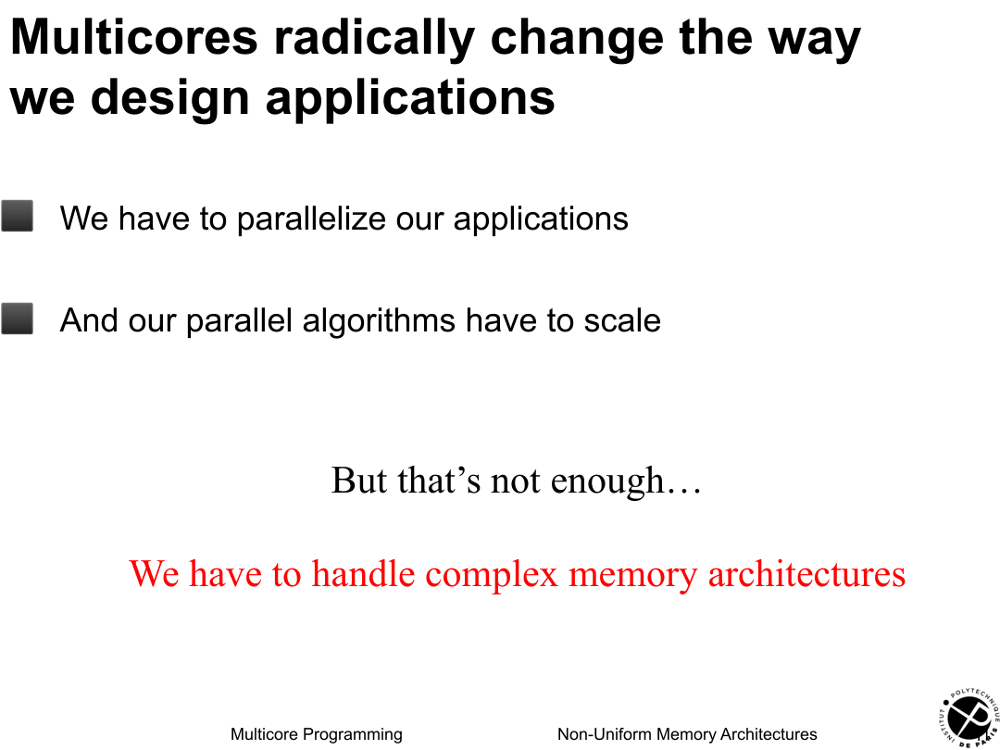

</details>

<a id="page-12"></a>

## 第 12 页 · But memory access latency varies a lot

Lozi@internship11

Core 0 allocates, core 0 accesses => ~5 cycles

Core 3 allocates, core 0 accesses => ~50 cycles

Core 15 allocates, core 0 accesses => ~275 cycles

Core 20 allocates, core 0 accesses => ~380 cycles

# core that accesses

the memory # core that allocates

the memory

12 Benchmark : memal on a 48 cores/4 sockets with 128GB (AMD)

> 校对：缓存与DRAM分开；155/275/380/870为原平台值。

<details>
<summary>查看第 12 页原图（图形、代码布局与标注）</summary>

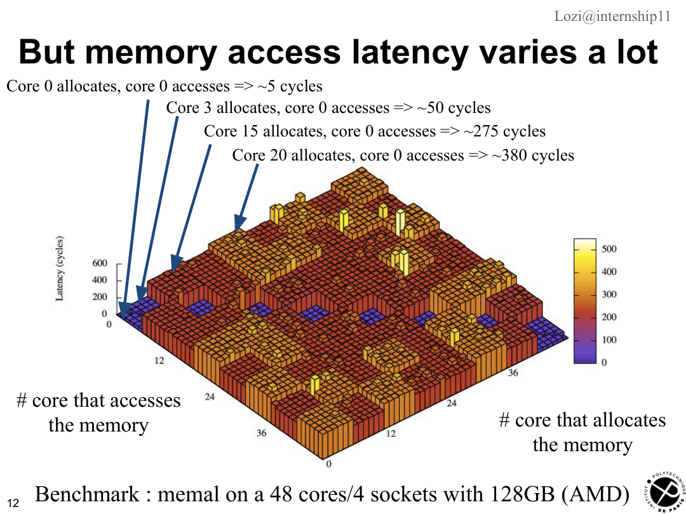

</details>

<a id="page-13"></a>

## 第 13 页 · We have cache effects

~ 5 cycles

L1

L1

L1

L1

L1

L1

~ 15 cycles

L2

L2

L2

L2

L2

L2

~ 50 cycles

L3

> 校对：缓存与DRAM分开；155/275/380/870为原平台值。

<details>
<summary>查看第 13 页原图（图形、代码布局与标注）</summary>

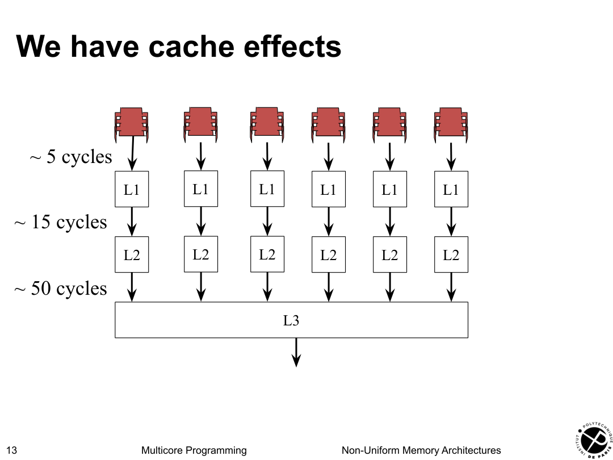

</details>

<a id="page-14"></a>

## 第 14 页 · And, since a single bus does not  scale...

RAM

Why 275 or

350 cycles?

RAM

> 校对：缓存与DRAM分开；155/275/380/870为原平台值。

<details>
<summary>查看第 14 页原图（图形、代码布局与标注）</summary>

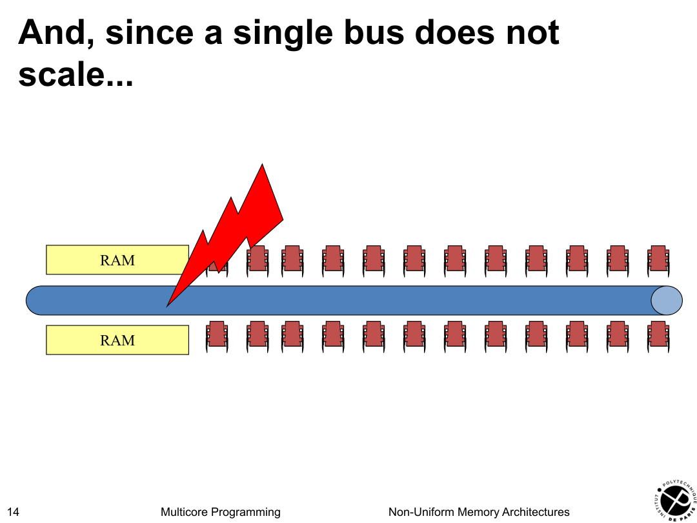

</details>

<a id="page-15"></a>

## 第 15 页 · ...we have complex architectures

Total: 64 cores/128 hyperthreads, 256GB (32x the power of my macbook for 15k€)

4 x Intel Xeon GOLD 6130

16 cores/32 hyperthreads

16 x 8GB

Supermicro X11QPH+

> 校对：256GB与16x8GB局部标注范围未说明，不擅自统一。

<details>
<summary>查看第 15 页原图（图形、代码布局与标注）</summary>

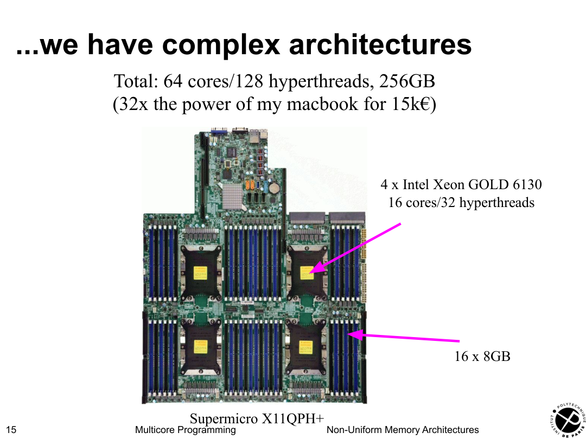

</details>

<a id="page-16"></a>

## 第 16 页 · ...we have complex architectures

Supermicro X11QPH+

> 校对：缓存与DRAM分开；155/275/380/870为原平台值。

<details>
<summary>查看第 16 页原图（图形、代码布局与标注）</summary>

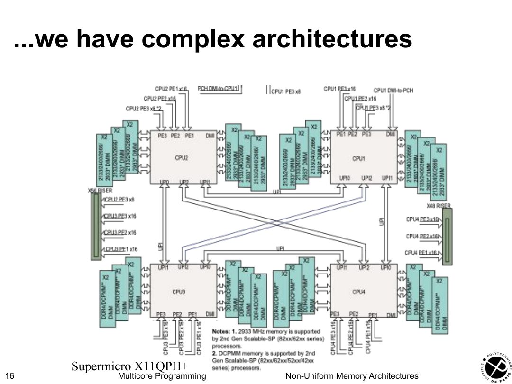

</details>

<a id="page-17"></a>

## 第 17 页 · and non uniform memory accesses

Slow access

Fast access

RAM RAM RAM

Node

Bus

PCIe

Core

PCIe

Interconnect

RAM

RAM RAM

> 校对：缓存与DRAM分开；155/275/380/870为原平台值。

<details>
<summary>查看第 17 页原图（图形、代码布局与标注）</summary>

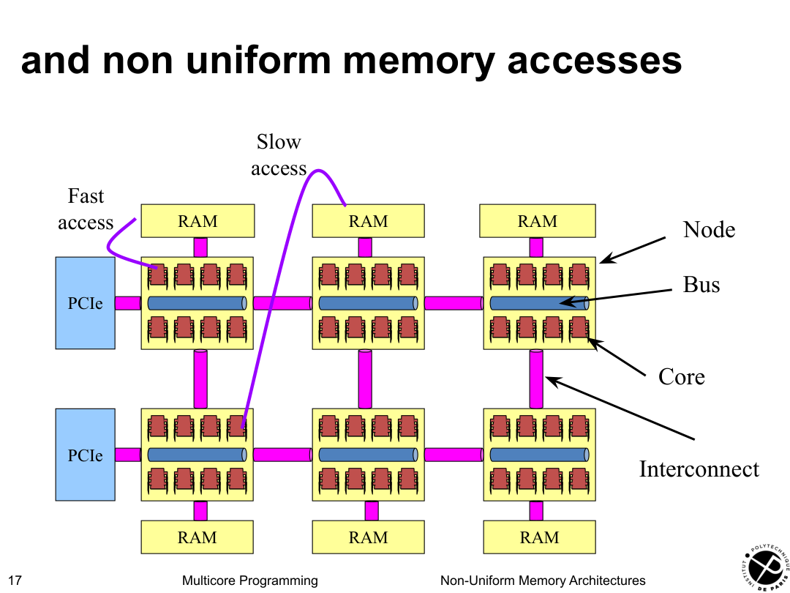

</details>

<a id="page-18"></a>

## 第 18 页 · and non uniform memory accesses

On our 48-core AMD with 8 nodes (6 cores per node)

- Local memory access : 155 cycles - One hop = 275 cycles - Two hops = 380 cycles

x2,5

RAM RAM RAM

Domain

Bus

PCIe

Core

PCIe

Interconnect

RAM

RAM RAM

> 校对：缓存与DRAM分开；155/275/380/870为原平台值。

<details>
<summary>查看第 18 页原图（图形、代码布局与标注）</summary>

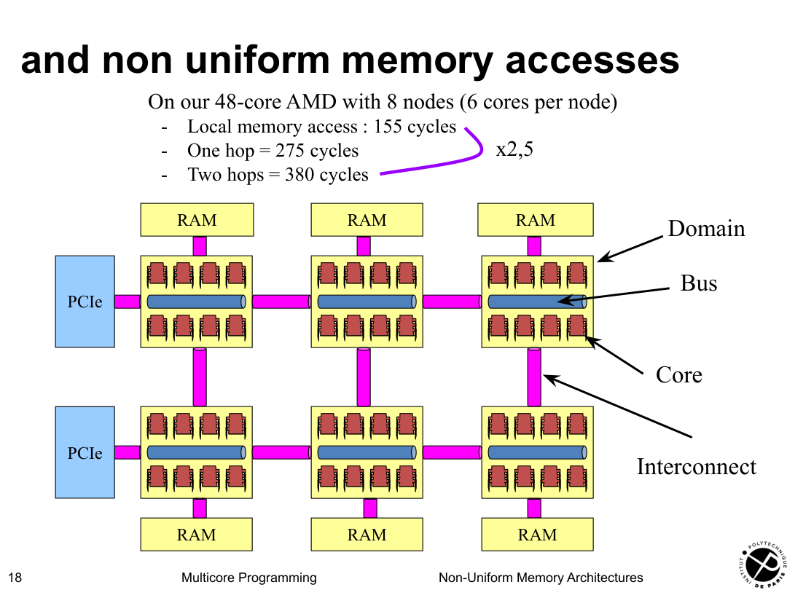

</details>

<a id="page-19"></a>

## 第 19 页 · Memory access latency can collapse

When all the cores access the same node

(but different cache lines)

RAM RAM

870 cycles (6 times a local access)

RAM RAM

> 校对：缓存与DRAM分开；155/275/380/870为原平台值。

<details>
<summary>查看第 19 页原图（图形、代码布局与标注）</summary>

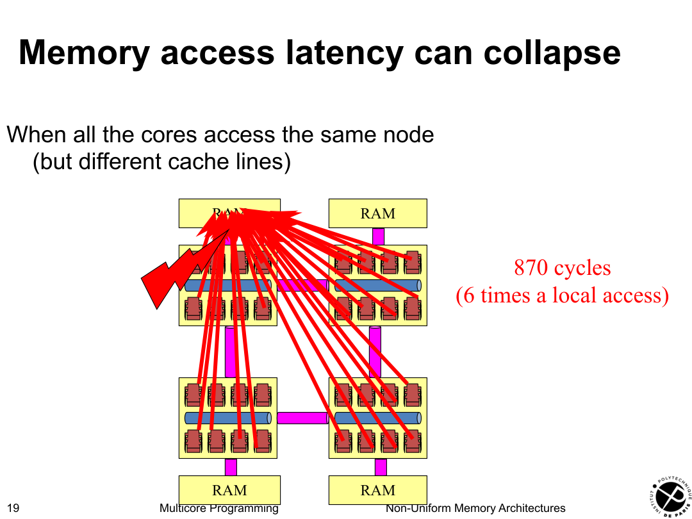

</details>

<a id="page-20"></a>

## 第 20 页 · On a NUMA architecture, we need  memory placement policies

- To avoid the overload of a single NUMA domain

- To avoid the overload of interconnect links

- To enforce memory access locality

> 校对：缓存与DRAM分开；155/275/380/870为原平台值。

<details>
<summary>查看第 20 页原图（图形、代码布局与标注）</summary>

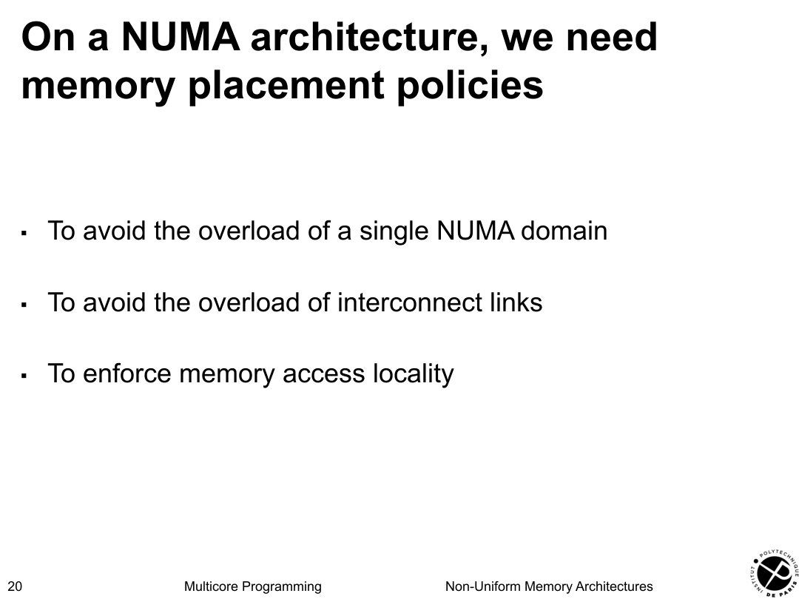

</details>

<a id="page-21"></a>

## 第 21 页 · HowTo: NUMA placement policy

Step 1: choose the physical address of a data

because the physical address space is partitioned among the domains

O n-1 n 2n - 1 2n 3n - 1

RAM RAM RAM

PCIe

PCIe

RAM

RAM RAM

3n 4n - 1 4n 5n - 1 5n 6n - 1

> 校对：虚拟到物理节点；API为简化签名。

<details>
<summary>查看第 21 页原图（图形、代码布局与标注）</summary>

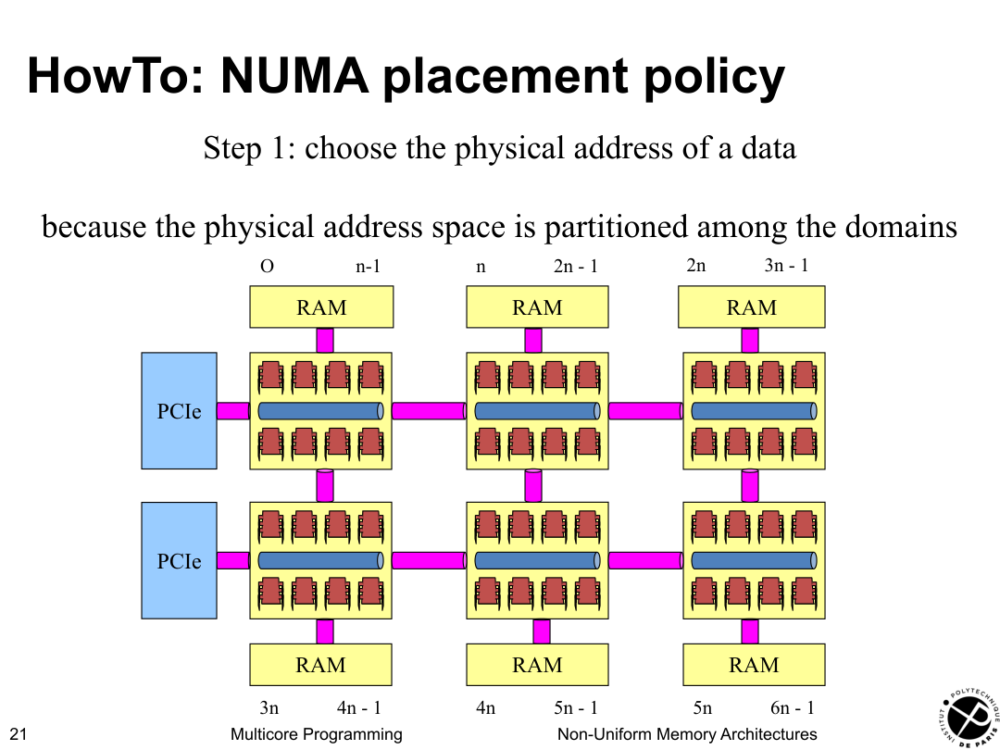

</details>

<a id="page-22"></a>

## 第 22 页 · HowTo: NUMA placement policy

Step 2: leverage the page table

Maps a virtual address to a specific node by mapping the virtual address to a page that belongs to the node

Memory space

Virtual address space

of a process

Page Table

Physical

Address

Space

Node 0 Node 1 Node 2

> 校对：虚拟到物理节点；API为简化签名。

<details>
<summary>查看第 22 页原图（图形、代码布局与标注）</summary>

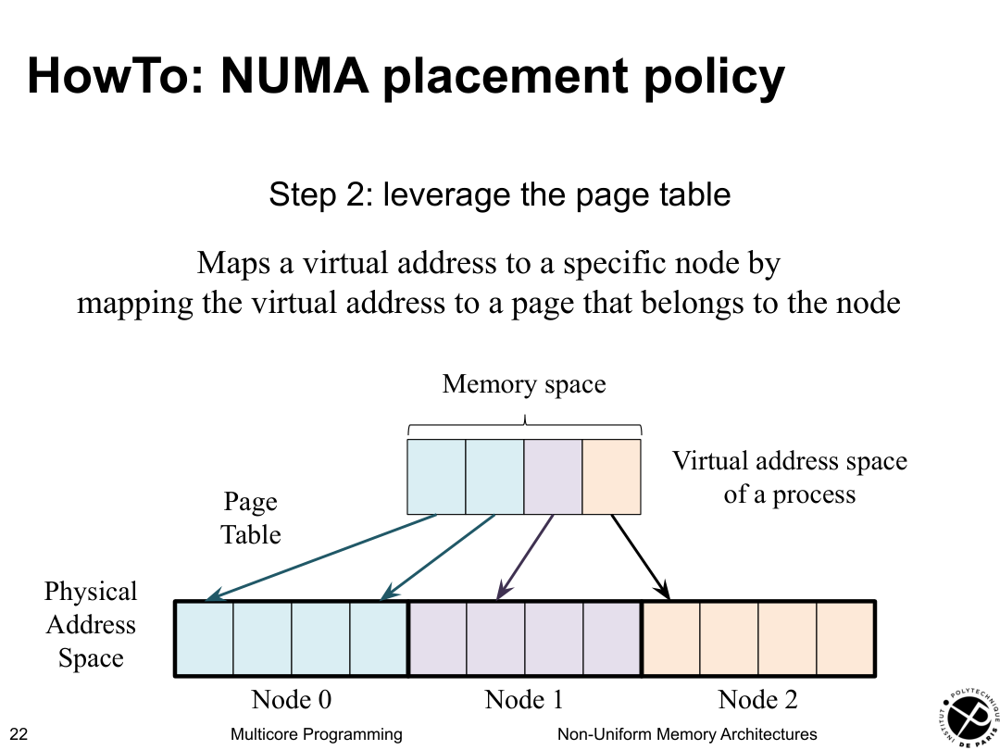

</details>

<a id="page-23"></a>

## 第 23 页 · HowTo: NUMA placement policy

```text
// reserve a virtual address space
struct x* x = mmap(0, sizeof(*x), …);
```

Virtual address space

of a process

Page Table

Physical

Address

Space

Node 0 Node 1 Node 2

> 校对：虚拟到物理节点；API为简化签名。

<details>
<summary>查看第 23 页原图（图形、代码布局与标注）</summary>

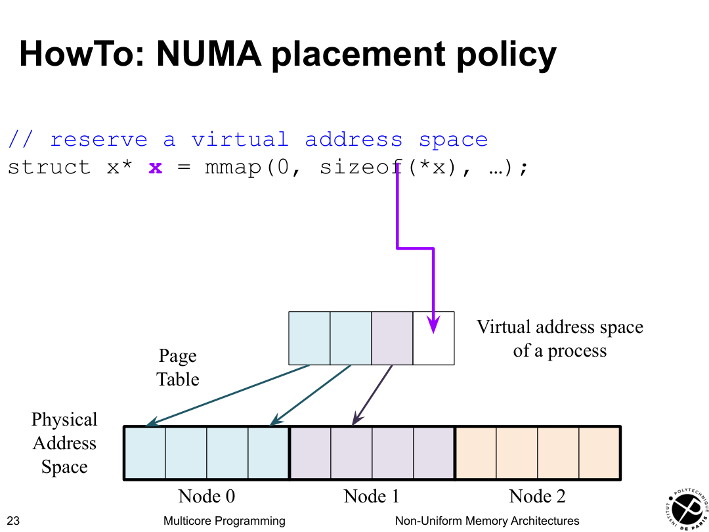

</details>

<a id="page-24"></a>

## 第 24 页 · HowTo: NUMA placement policy

```text
// reserve a virtual address space
struct x* x = mmap(0, sizeof(*x), …); 
// and requires pages from node 2
mbind(x, sizeof(*x), 2);
```

Virtual address space

of a process

Page Table

Physical

Address

Space

Node 0 Node 1 Node 2

> 校对：mbind是简化接口，不可原样调用。

<details>
<summary>查看第 24 页原图（图形、代码布局与标注）</summary>

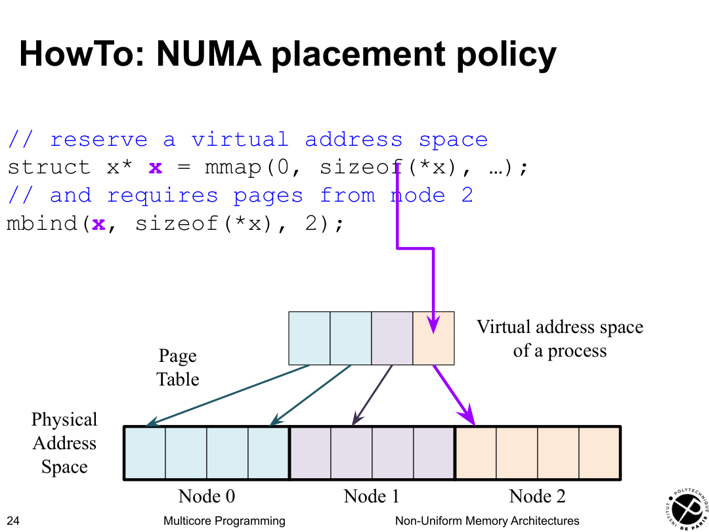

</details>

<a id="page-25"></a>

## 第 25 页 · Main questions

- Does NUMA effect matters in practice?

- If yes, can we mitigate this effect?

> 校对：虚拟到物理节点；API为简化签名。

<details>
<summary>查看第 25 页原图（图形、代码布局与标注）</summary>

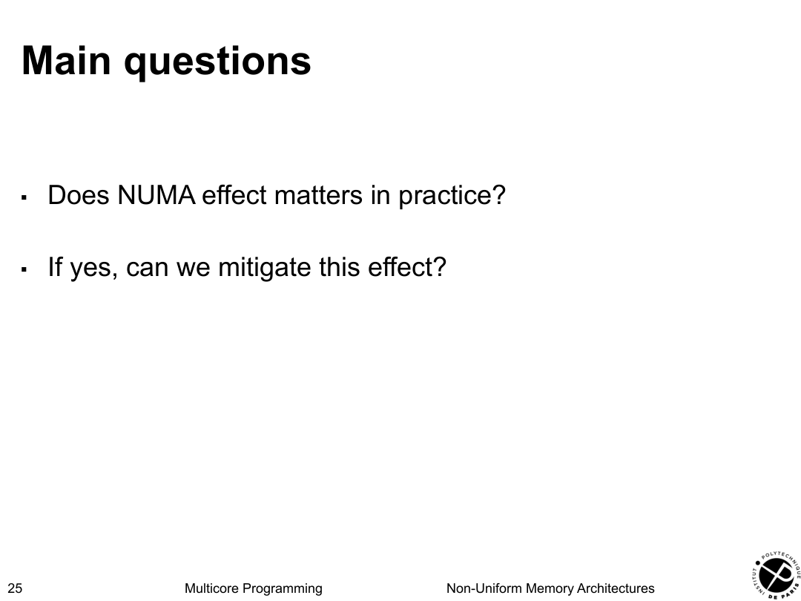

</details>

<a id="page-26"></a>

## 第 26 页 · In theory, NUMA matters

- 

Abstract cache-unfriendly application

- 50% of the instructions access memory
- 30% of the accesses in L1 cache
- 30% of the accesses in L2 cache
- 30% of the accesses in L3 cache

- 

Comparison between best and worst NUMA placements

- Best: all accesses to local node ⇒ ~ 32 cycles/insn
- Worst: all accesses to an overloaded node ⇒ ~ 156 cycles/insn ⇒ overhead of 385% in the worst case

> 校对：条件命中率未明说；32/156取整无法精确推出385%。

<details>
<summary>查看第 26 页原图（图形、代码布局与标注）</summary>

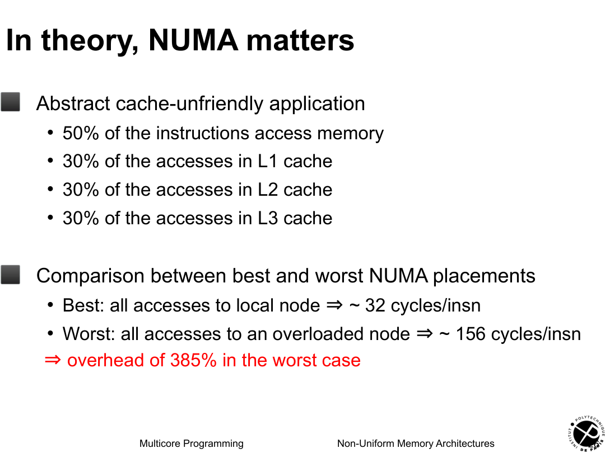

</details>

<a id="page-27"></a>

## 第 27 页 · In theory, NUMA matters

- 

Abstract cache-friendly application

- 50% of the instructions access memory
- 70% of the accesses in L1 cache
- 70% of the accesses in L2 cache
- 70% of the accesses in L3 cache

- 

Comparison between best and worst NUMA placements

- Best: all accesses to local node ⇒ ~ 7 cycles/insn
- Worst: all accesses to an overloaded node ⇒ ~ 17 cycles/insn ⇒ overhead of 137% in the worst case

> 校对：70%为条件概率才合理；7/17不精确推出137%。

<details>
<summary>查看第 27 页原图（图形、代码布局与标注）</summary>


</details>

<a id="page-28"></a>

## 第 28 页 · First study

- 

Goal:

- Understand how Linux manages NUMA
- Understand how applications react to NUMA

- 

How:

- Study a panel of 29 applications from 5 benchmarks (NPB, Parsec, Mosbench, X-stream, YCSB)
- Evaluate various NUMA management policies

> 校对：应用/硬件特定；线程与内存绑定分开。

<details>
<summary>查看第 28 页原图（图形、代码布局与标注）</summary>

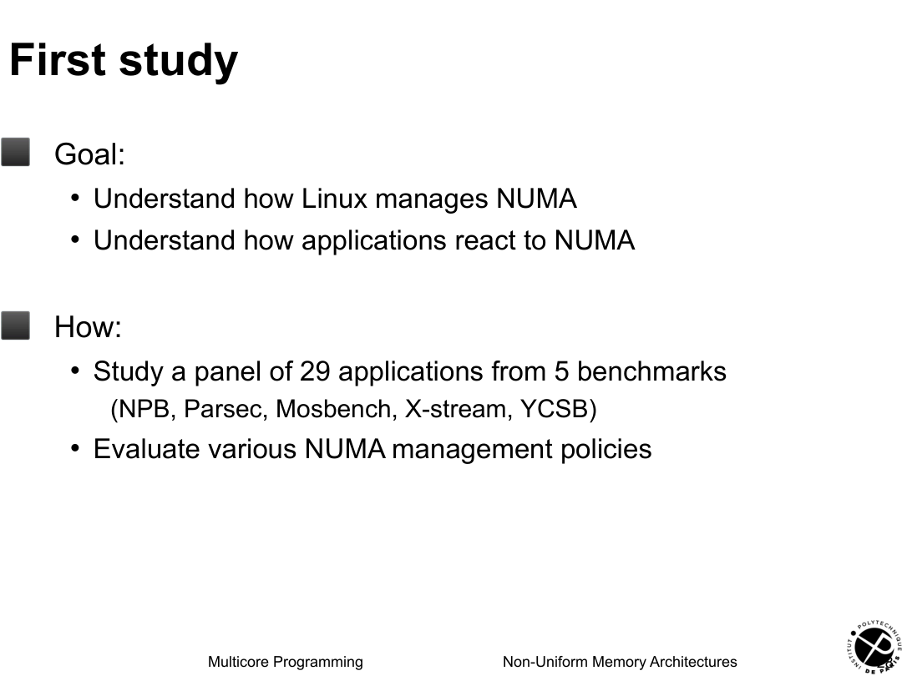

</details>

<a id="page-29"></a>

## 第 29 页 · The hand-tuned policy

- 

Manually place the memory address ranges on the nodes

Memory range 1

Memory range 2

Virtual address space

of a process

Page Table

Physical

Address

Space

Node 0 Node 1 Node 2

> 校对：应用/硬件特定；线程与内存绑定分开。

<details>
<summary>查看第 29 页原图（图形、代码布局与标注）</summary>

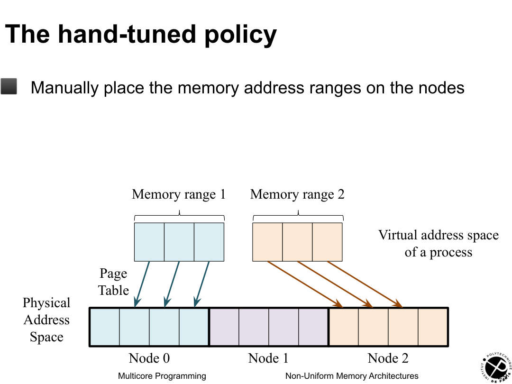

</details>

<a id="page-30"></a>

## 第 30 页 · The hand-tuned policy

- 

Manually place the memory address ranges on the nodes

+ Tune the memory placement for an application

- A lot of engineering effort for only a single application/hardware

Memory range 1

Memory range 2

Virtual address space

of a process

Page Table

Physical

Address

Space

Node 0 Node 1 Node 2

> 校对：应用/硬件特定；线程与内存绑定分开。

<details>
<summary>查看第 30 页原图（图形、代码布局与标注）</summary>

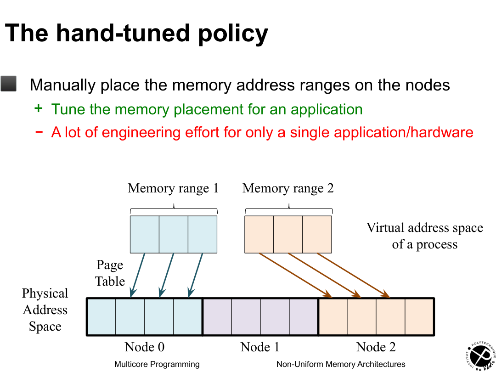

</details>

<a id="page-31"></a>

## 第 31 页 · The hand-tuned policy on Linux

- 

Hand-tuned thread placement

- setaffinity(set of cores): for all the threads of a process
- pthread_setaffinity(set of cores): for a single thread

- 

Hand-tuned memory placement

- mbind(virtual address range, set of nodes) (granularity of a 4k-page)

> 校对：接口名为概念写法；核集合与节点集合不同。

<details>
<summary>查看第 31 页原图（图形、代码布局与标注）</summary>

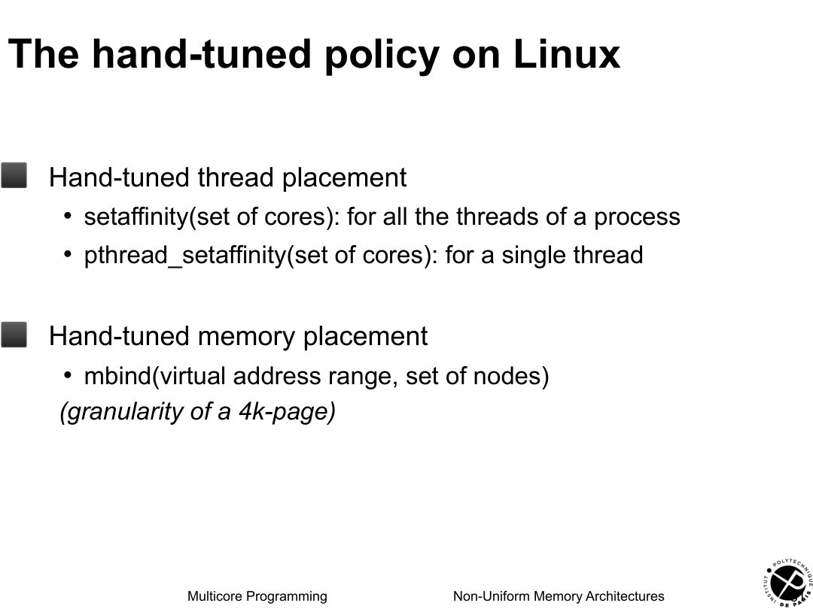

</details>

<a id="page-32"></a>

## 第 32 页 · The interleaved policy

- 

Round-robin from all the nodes

Virtual address space

of a process

Page Table

Physical

Address

Space

Node 0 Node 1 Node 2

> 校对：平衡控制器负载可能增加远程流量。

<details>
<summary>查看第 32 页原图（图形、代码布局与标注）</summary>

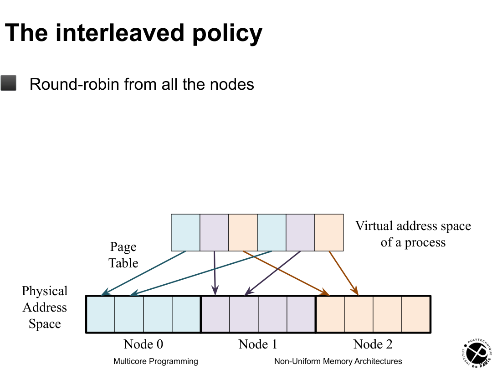

</details>

<a id="page-33"></a>

## 第 33 页 · The interleaved policy

- 

Round-robin from all the nodes

+ Balance the load on all the nodes ⇒ no overloaded node

- Many remote accesses ⇒ interconnect can saturate

Virtual address space

of a process

Page Table

Physical

Address

Space

Node 0 Node 1 Node 2

> 校对：平衡控制器负载可能增加远程流量。

<details>
<summary>查看第 33 页原图（图形、代码布局与标注）</summary>

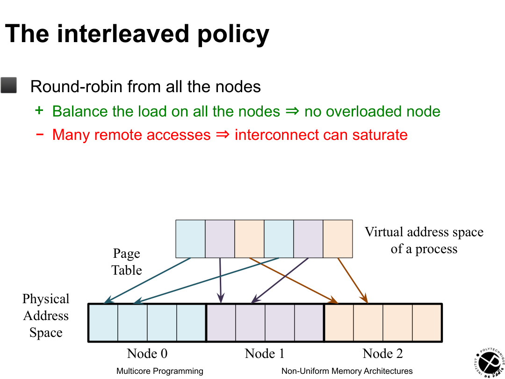

</details>

<a id="page-34"></a>

## 第 34 页 · The first-touch policy

- 

From the node that triggers the first access

- Relies on the lazy mapping used in Linux

Thread running on node 1

Virtual address space

of a process

Page Table Not yet mapped

Physical

Address

Space

Node 0 Node 1 Node 2

> 校对：实际分配时机与首次写入；不是malloc瞬间保证。

<details>
<summary>查看第 34 页原图（图形、代码布局与标注）</summary>

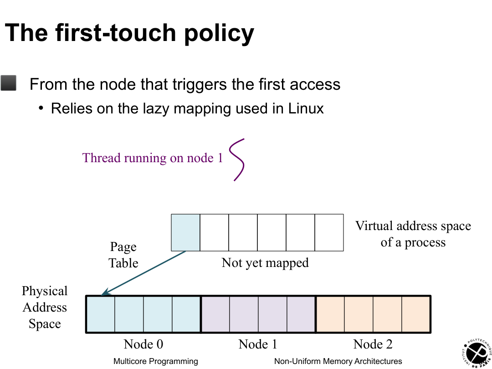

</details>

<a id="page-35"></a>

## 第 35 页 · The first-touch policy

- 

From the node that triggers the first access

- Relies on the lazy mapping used in Linux

Thread running on node 1

Memory access

Virtual address space

of a process

Page Table

Physical

Address

Space

Node 0 Node 1 Node 2

> 校对：实际分配时机与首次写入；不是malloc瞬间保证。

<details>
<summary>查看第 35 页原图（图形、代码布局与标注）</summary>

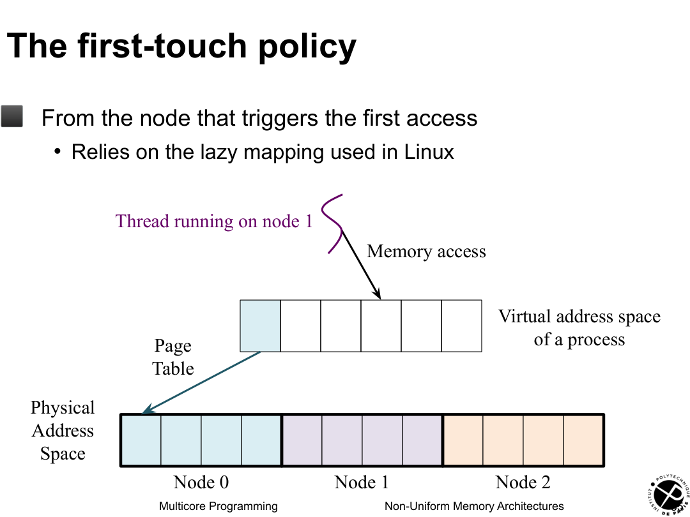

</details>

<a id="page-36"></a>

## 第 36 页 · The first-touch policy

- 

From the node that triggers the first access

- Relies on the lazy mapping used in Linux

Thread running on node 1

Memory access

Virtual address space

of a process

Page Table

Map from node 1

Physical

Address

Space

Node 0 Node 1 Node 2

> 校对：实际分配时机与首次写入；不是malloc瞬间保证。

<details>
<summary>查看第 36 页原图（图形、代码布局与标注）</summary>

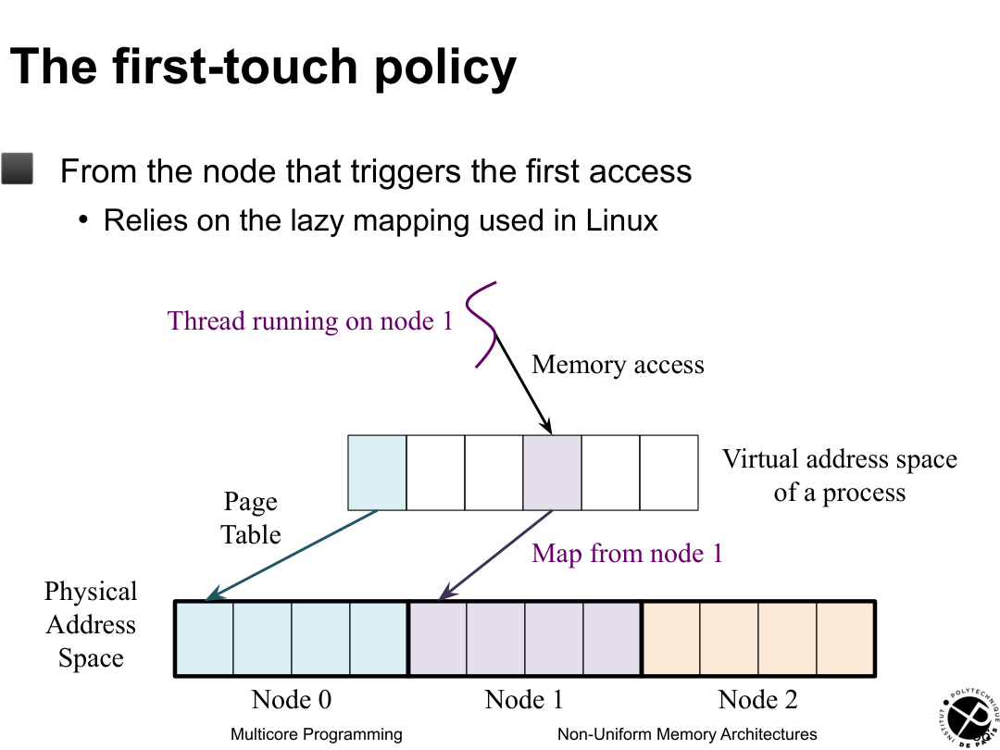

</details>

<a id="page-37"></a>

## 第 37 页 · The first-touch policy

- 

From the node that triggers the first access

+ Perfect locality and no saturation if a thread accesses its

memory - Overloaded nodes if some threads allocate for the others

Virtual address space

of a process

Page Table Map from node 1

Physical

Address

Space

Node 0 Node 1 Node 2

> 校对：实际分配时机与首次写入；不是malloc瞬间保证。

<details>
<summary>查看第 37 页原图（图形、代码布局与标注）</summary>

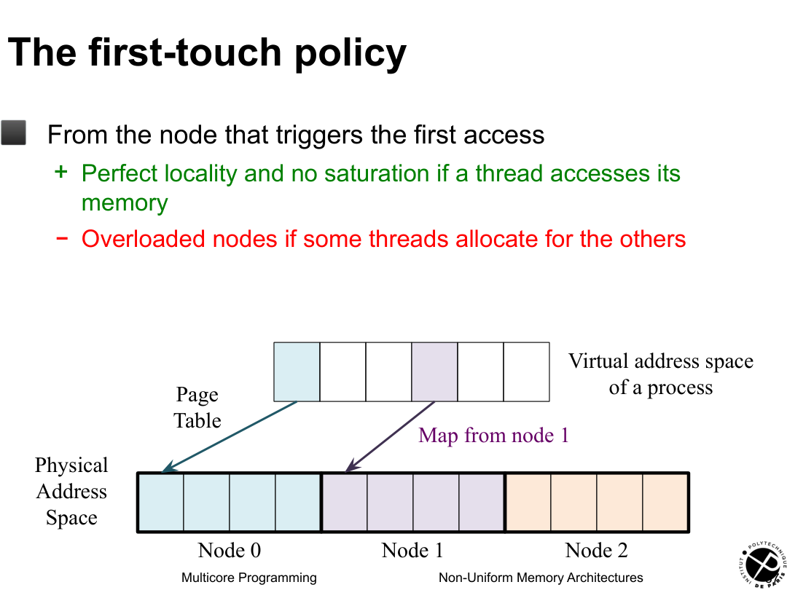

</details>

<a id="page-38"></a>

## 第 38 页 · The Carrefour policy

- 

Proposed by Dashti et al. (ASPLOS’15)

- Rebalance the load on all the nodes
- Prevents the contention of the interconnect

- 

Dynamically migrate a page

- From contended to uncontended nodes in case of contented node
- On the node that uses the page in case of contended interconnect

> 校对：Carrefour原论文为ASPLOS2013而非2015。

<details>
<summary>查看第 38 页原图（图形、代码布局与标注）</summary>

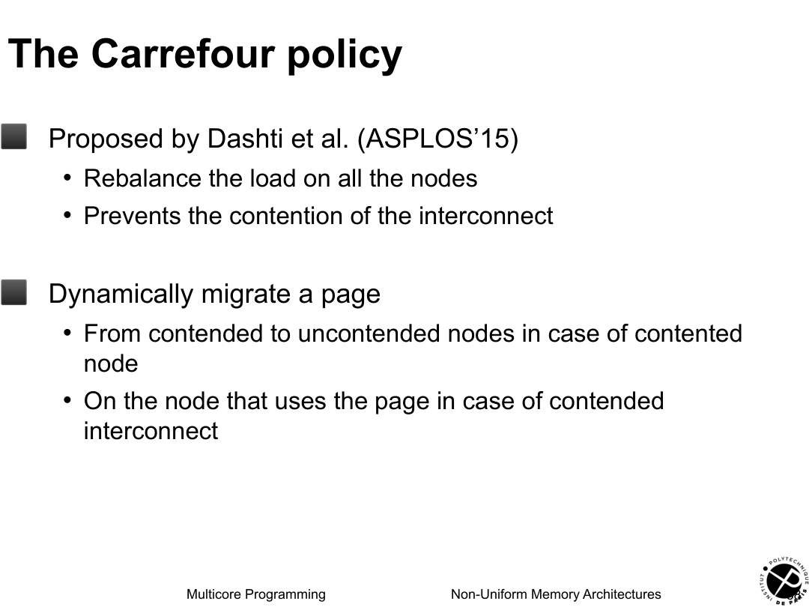

</details>

<a id="page-39"></a>

## 第 39 页 · The Carrefour policy

- 

Proposed by Dashti et al. (ASPLOS’15)

- Rebalance the load on all the nodes
- Prevents the contention of the interconnect

- 

Dynamically migrate a page

- From contended to uncontended nodes in case of contented node
- On the node that uses the page in case of contended interconnect

+ Improves locality and avoid contention in many cases

- Can lead to inefficient placements for applications with different

access patterns during the run

> 校对：原论文年份2013；4KiB页的四种策略。

<details>
<summary>查看第 39 页原图（图形、代码布局与标注）</summary>

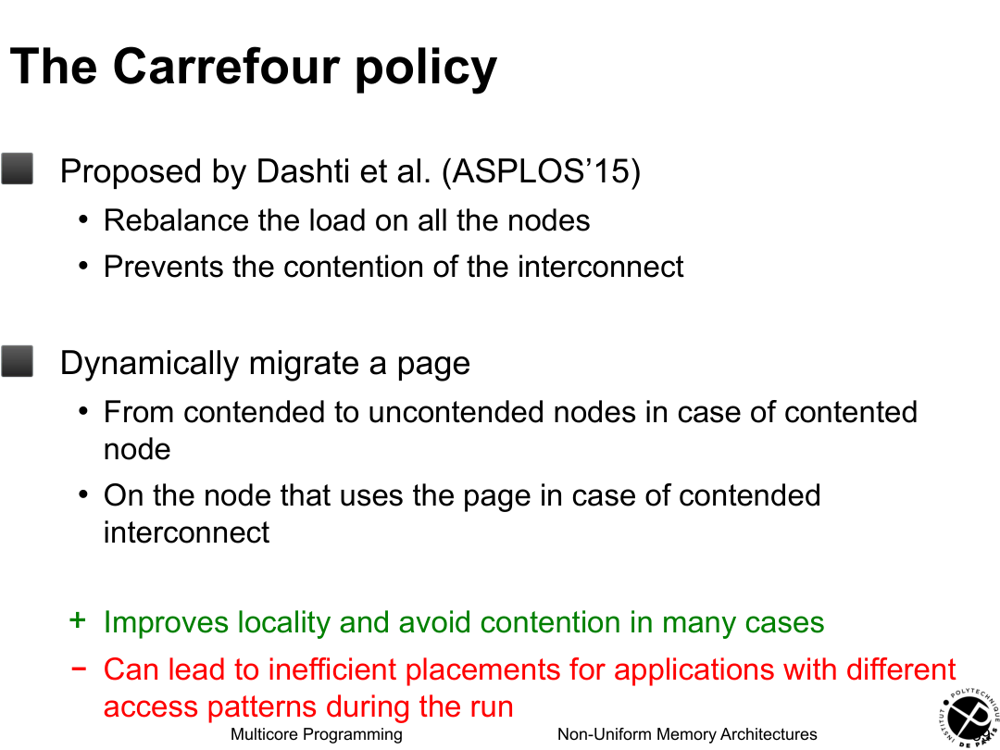

</details>

<a id="page-40"></a>

## 第 40 页 · Evaluated policies

- 

Four combinations

- First-touch (Linux FT)
- First-touch with Carrefour (Linux FT/Carrefour)
- Interleaved (Linux 4K)
- Interleaved with Carrefour (Linux 4K/Carrefour)

- 

Only considers pages of 4KiB

> 校对：原论文年份2013；4KiB页的四种策略。

<details>
<summary>查看第 40 页原图（图形、代码布局与标注）</summary>

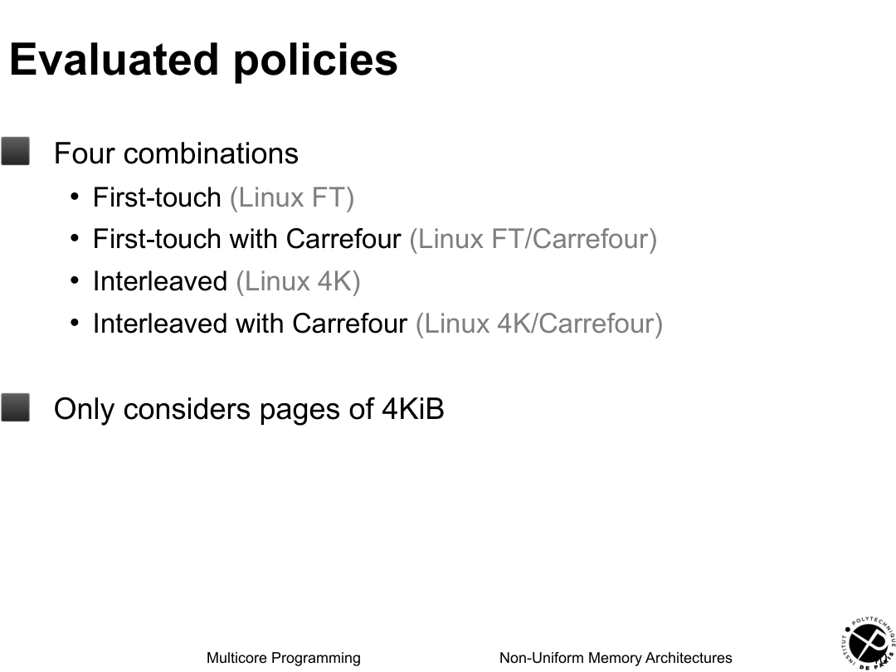

</details>

<a id="page-41"></a>

## 第 41 页 · Evaluation of the NUMA policies

4K win 4K/Carrefour win

FT win FT/Carrefour win

Speedup relative to Linux FT

[presented at Eurosys’17]

> 校对：相对FT加速；四种策略均有胜出情形。

<details>
<summary>查看第 41 页原图（图形、代码布局与标注）</summary>

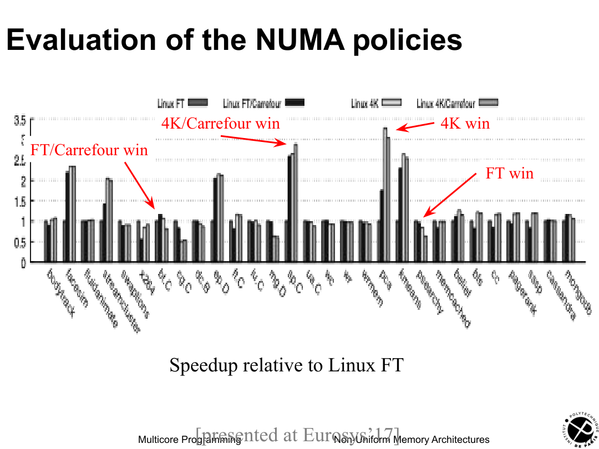

</details>

<a id="page-42"></a>

## 第 42 页 · Evaluation of the NUMA policies

4K win 4K/Carrefour win

FT win FT/Carrefour win First conclusion

All the NUMA policies are important

Each application needs its own NUMA policy

Speedup relative to Linux FT

> 校对：相对FT加速；四种策略均有胜出情形。

<details>
<summary>查看第 42 页原图（图形、代码布局与标注）</summary>

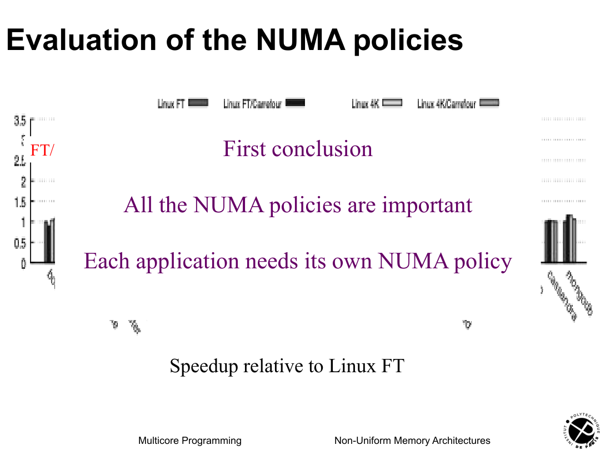

</details>

<a id="page-43"></a>

## 第 43 页 · Second study

- Predict which NUMA policy is the best for an application

- Goal:

- Select the most efficient NUMA policy
- Understand the memory access behavior

> 校对：8节点样本相对标准差复现表；p52文字与图冲突。

<details>
<summary>查看第 43 页原图（图形、代码布局与标注）</summary>

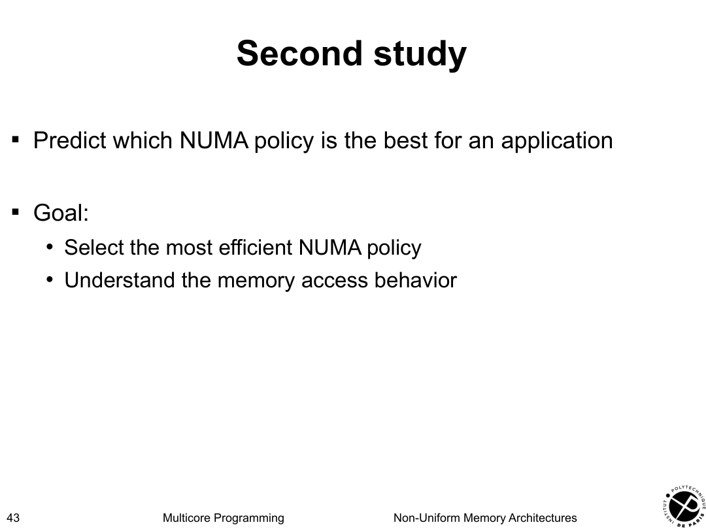

</details>

<a id="page-44"></a>

## 第 44 页 · Predict the NUMA policy

- Measure the memory access imbalance with first-touch

Relative standard deviation around the average #accesses per node

Imbalance 0% 40% 62% 83% 107% 138% 185% 283%

# of accessed nodes

8 7 6 5 4 3 2 1

All the accesses go to a single node Perfect balance

> 校对：按样本标准差n-1可复现283%，总体标准差不能。

<details>
<summary>查看第 44 页原图（图形、代码布局与标注）</summary>

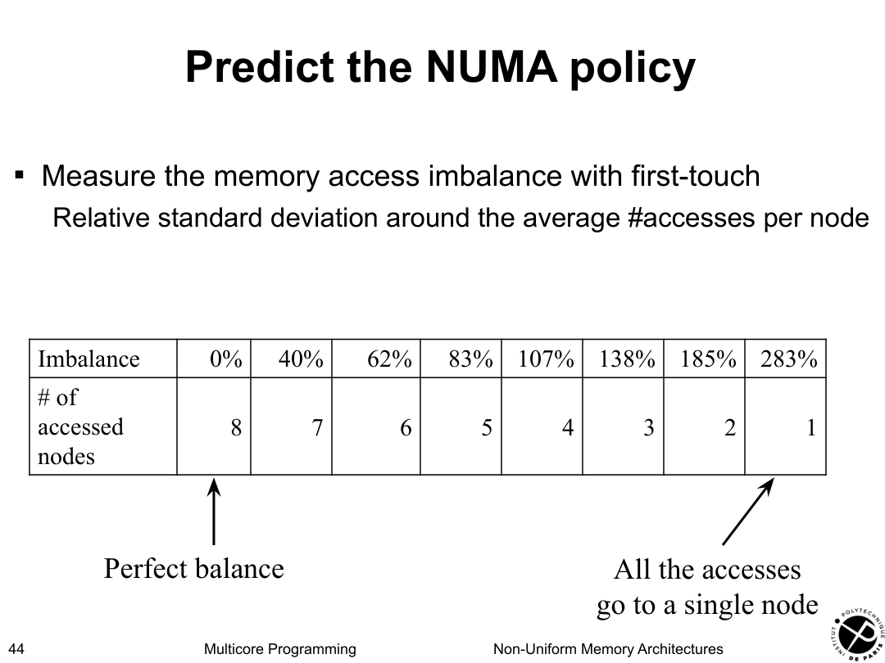

</details>

<a id="page-45"></a>

## 第 45 页 · Predict the NUMA policy

- Measure the memory access imbalance with first-touch

Relative standard deviation around the average #accesses per node

Imbalance 0% 40% 62% 83% 107% 138% 185% 283%

# of accessed nodes

8 7 6 5 4 3 2 1

Low imbalance High imbalance

Moderate imbalance

> 校对：8节点样本相对标准差复现表；p52文字与图冲突。

<details>
<summary>查看第 45 页原图（图形、代码布局与标注）</summary>

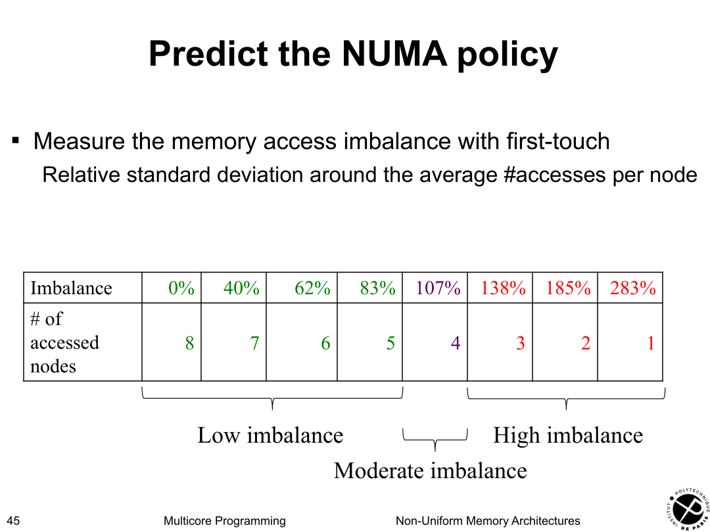

</details>

<a id="page-46"></a>

## 第 46 页 · Predict the NUMA policy

Low imbalance with first-touch Often because we already have a good locality

Imbalance 0% 40% 62% 83% 107% 138% 185% 283%

# of accessed nodes

8 7 6 5 4 3 2 1

Low imbalance

High imbalance

Moderate imbalance

> 校对：8节点样本相对标准差复现表；p52文字与图冲突。

<details>
<summary>查看第 46 页原图（图形、代码布局与标注）</summary>

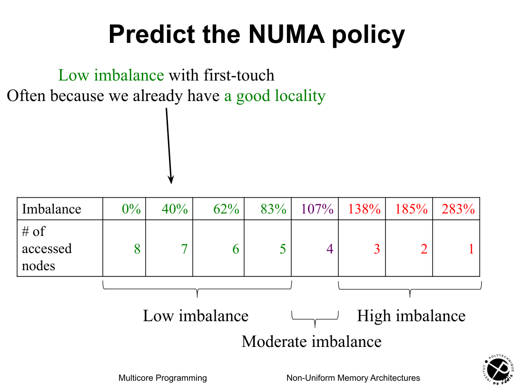

</details>

<a id="page-47"></a>

## 第 47 页 · Predict the NUMA policy

Low imbalance with first-touch Often because we already have a good locality

=> keep first-touch (1% slower than best in average)

Imbalance 0% 40% 62% 83% 107% 138% 185% 283%

# of accessed nodes

8 7 6 5 4 3 2 1

First-touch

High imbalance

Moderate imbalance

> 校对：8节点样本相对标准差复现表；p52文字与图冲突。

<details>
<summary>查看第 47 页原图（图形、代码布局与标注）</summary>

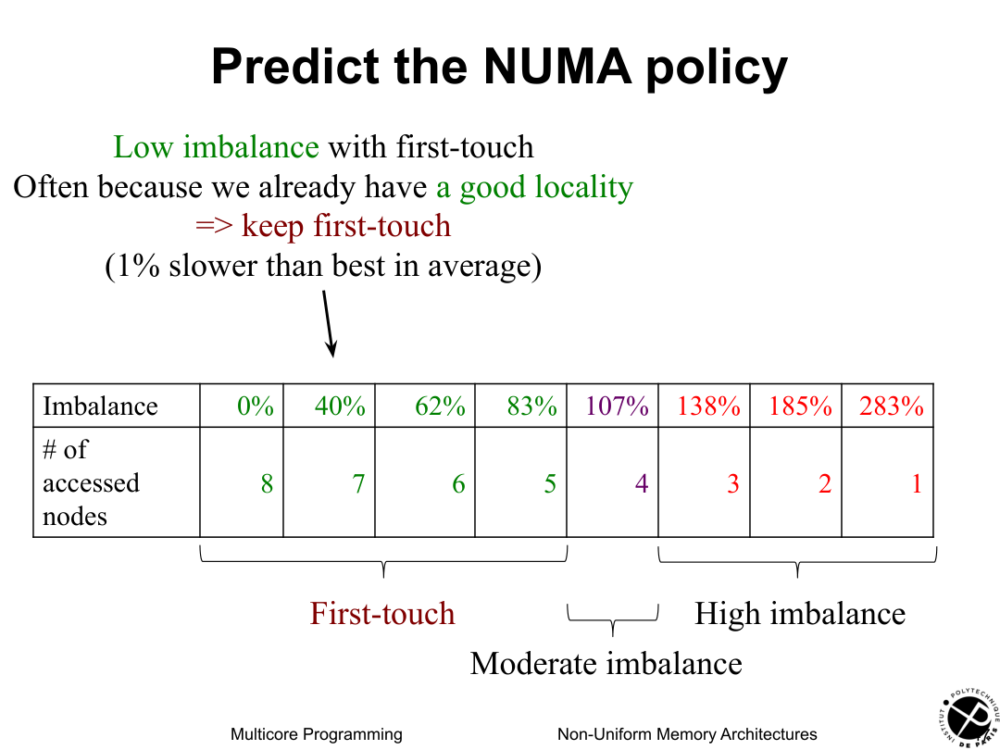

</details>

<a id="page-48"></a>

## 第 48 页 · Predict the NUMA policy

Moderate imbalance with first-touch First-touch roughly balances the load but locality is not perfect

Imbalance 0% 40% 62% 83% 107% 138% 185% 283%

# of accessed nodes

8 7 6 5 4 3 2 1

First-touch

High imbalance

Moderate imbalance

> 校对：8节点样本相对标准差复现表；p52文字与图冲突。

<details>
<summary>查看第 48 页原图（图形、代码布局与标注）</summary>

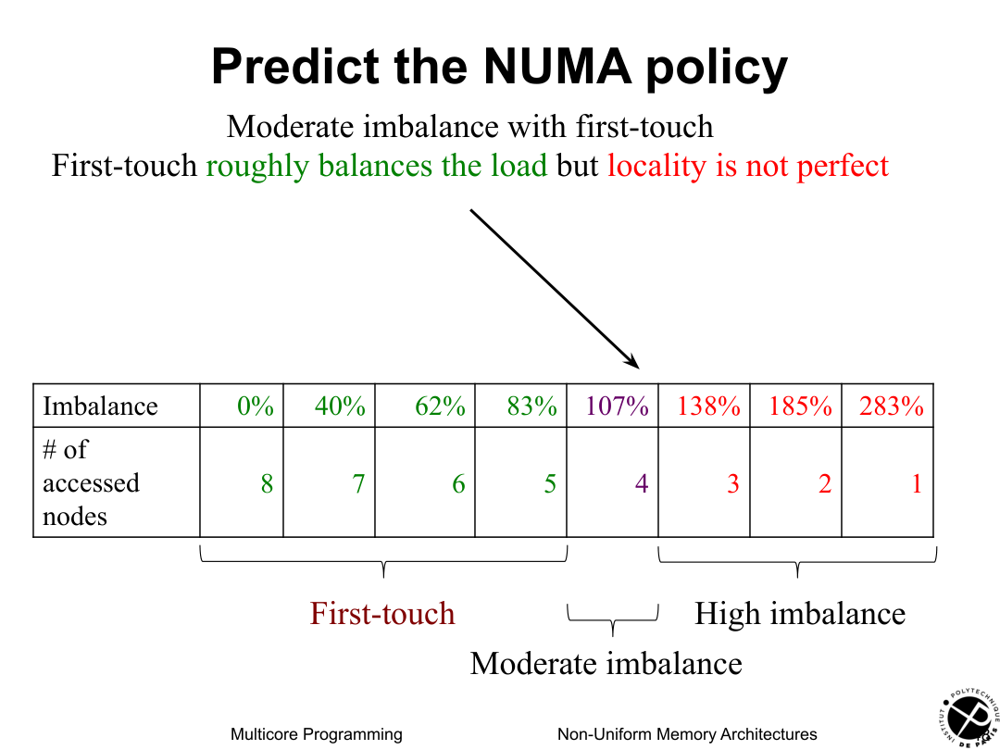

</details>

<a id="page-49"></a>

## 第 49 页 · Predict the NUMA policy

Moderate imbalance with first-touch First-touch roughly balances the load but locality is not perfect

⇒ use First-touch/Carrefour (2% slower than best in average)

Imbalance 0% 40% 62% 83% 107% 138% 185% 283%

# of accessed nodes

8 7 6 5 4 3 2 1

First-touch

High imbalance

First-touch/Carrefour

> 校对：8节点样本相对标准差复现表；p52文字与图冲突。

<details>
<summary>查看第 49 页原图（图形、代码布局与标注）</summary>

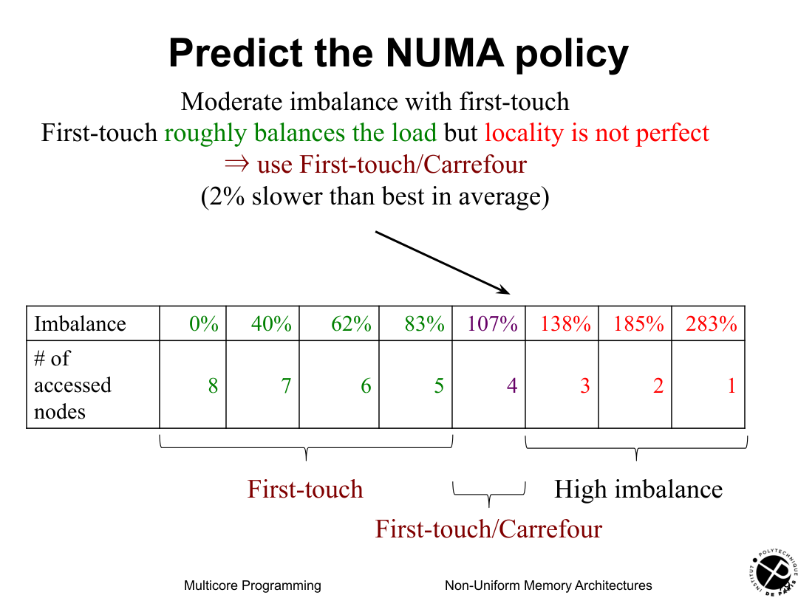

</details>

<a id="page-50"></a>

## 第 50 页 · Predict the NUMA policy

High imbalance with first-touch Interleaved balances the load and Carrefour improves locality

⇒ use Interleaved/Carrefour

Imbalance 0% 40% 62% 83% 107% 138% 185% 283%

# of accessed nodes

8 7 6 5 4 3 2 1

First-touch

Interleaved/Carrefour

First-touch/Carrefour

> 校对：8节点样本相对标准差复现表；p52文字与图冲突。

<details>
<summary>查看第 50 页原图（图形、代码布局与标注）</summary>

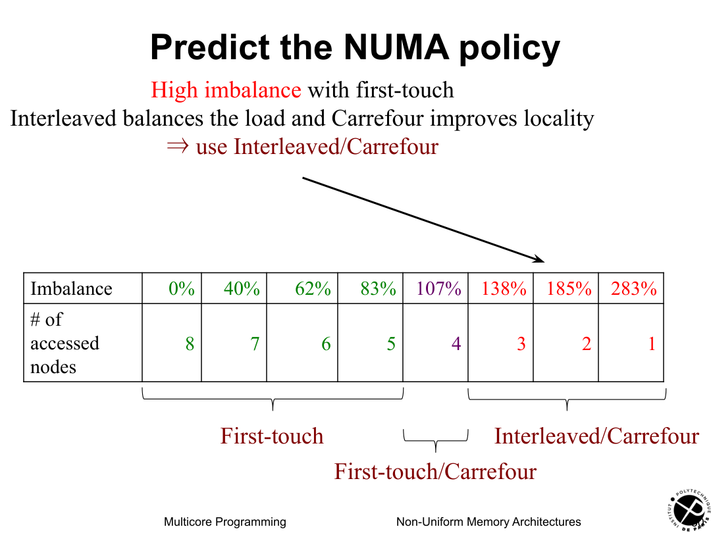

</details>

<a id="page-51"></a>

## 第 51 页 · Predict the NUMA policy

High imbalance with first-touch Interleaved balances the load and Carrefour improves locality

⇒ use Interleaved/Carrefour (2% slower than best in average)

Imbalance 0% 40% 62% 83% 107% 138% 185% 283%

# of accessed nodes

8 7 6 5 4 3 2 1

First-touch

Interleaved/Carrefour

First-touch/Carrefour

> 校对：8节点样本相对标准差复现表；p52文字与图冲突。

<details>
<summary>查看第 51 页原图（图形、代码布局与标注）</summary>

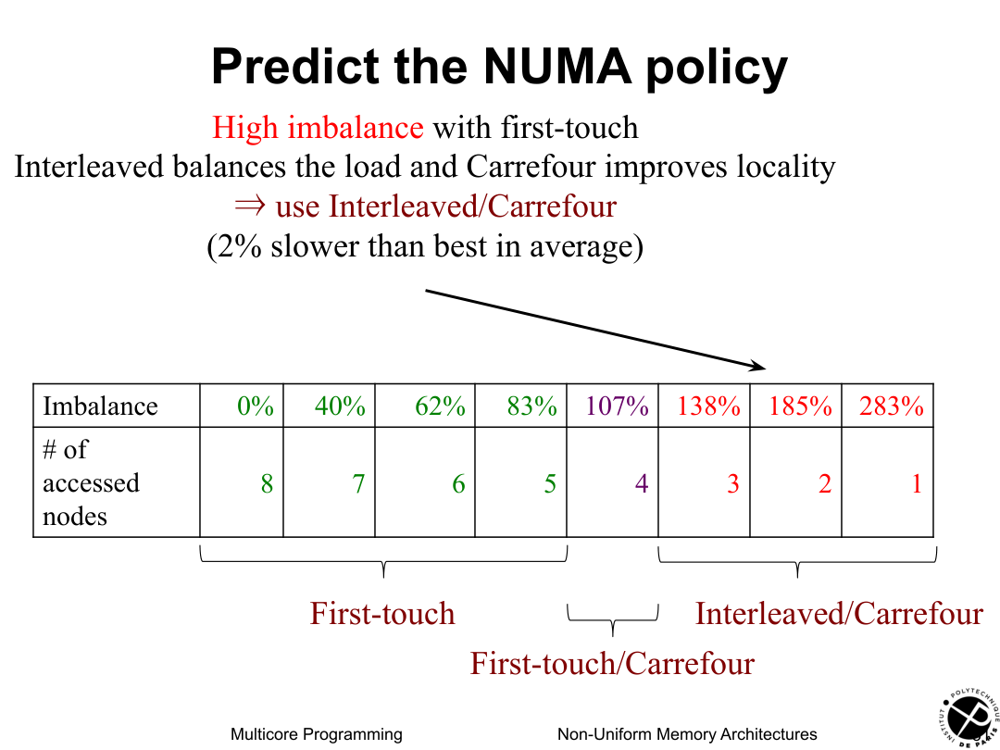

</details>

<a id="page-52"></a>

## 第 52 页 · Predict the NUMA policy

High imbalance with first-touch Interleaved balances the load and Carrefour improves locality

⇒ use First-touch/Carrefour (2% slower than best in average)

Second conclusion

We can reasonably predict the best NUMA policy

of an application

Imbalance 0% 40% 62% 83% 107% 138% 185% 283%

# of accessed nodes

8 7 6 5 4 3 2 1

First-touch

Interleaved/Carrefour

First-touch/Carrefour

> 校对：高不均衡文字FT/Carrefour与图及前页Interleaved/Carrefour矛盾。

<details>
<summary>查看第 52 页原图（图形、代码布局与标注）</summary>

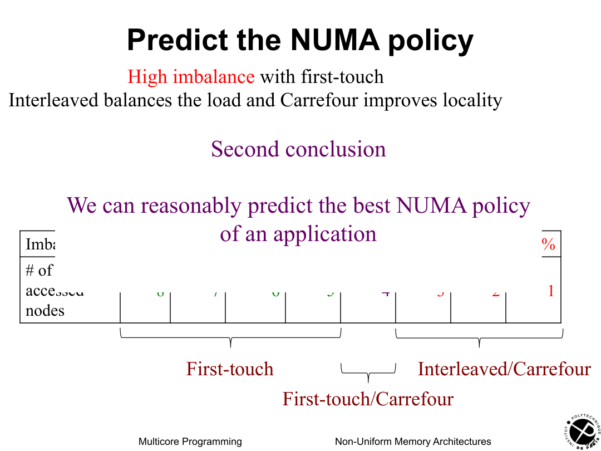

</details>

<a id="page-53"></a>

## 第 53 页 · Third study

- How a data analytic application behaves?

- Page rank query on the friendster dataset with Spark
- Heap of 40GB, JVM with the Parallel Scavenge (PS) GC

Map()

Reduce()

Output data

Input data

Map()

Reduce()

Map()

> 校对：40GB堆；时间/加速比/吞吐三个指标区分。

<details>
<summary>查看第 53 页原图（图形、代码布局与标注）</summary>

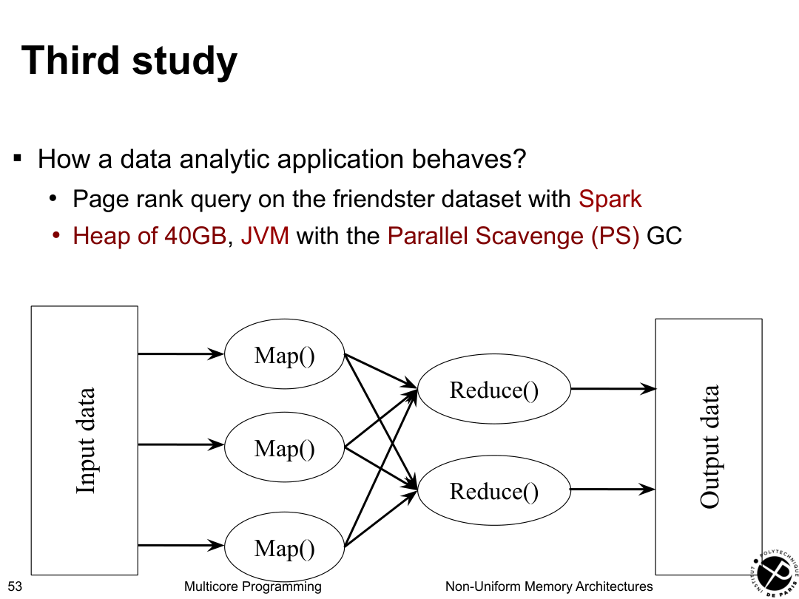

</details>

<a id="page-54"></a>

## 第 54 页 · Application scalability of Spark

Bad scalability after 12 cores

Ideal scalability

Speedup in term

of completion

time

PS

#cores = #threads

Performance of Spark (40GB of heap)

> 校对：40GB堆；时间/加速比/吞吐三个指标区分。

<details>
<summary>查看第 54 页原图（图形、代码布局与标注）</summary>

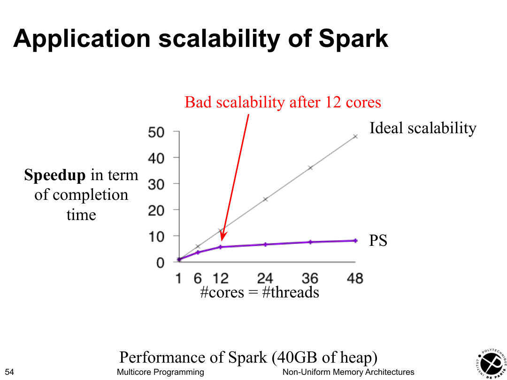

</details>

<a id="page-55"></a>

## 第 55 页 · A bottleneck in the garbage collector

Time spent in the application

Roughly scales with the

number of cores

Completion

Time (s)

#cores = #threads

Time spent in the garbage collector Does not seem to scale after 12 cores

> 校对：40GB堆；时间/加速比/吞吐三个指标区分。

<details>
<summary>查看第 55 页原图（图形、代码布局与标注）</summary>

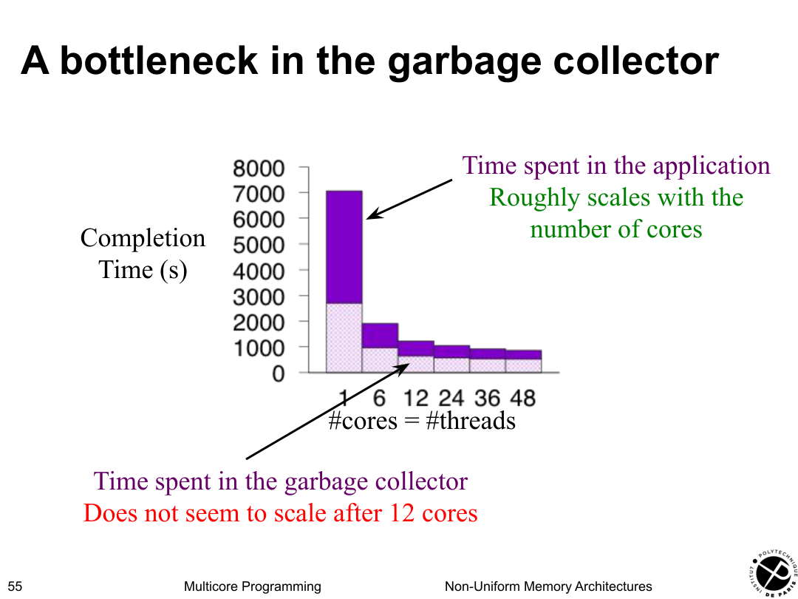

</details>

<a id="page-56"></a>

## 第 56 页 · A bottleneck in the garbage collector

The garbage collector does not scale

GC throughput

(GB collected

Bad scalability after 12 cores

per second)

#cores = #threads used by the GC

Performance of the GC in Spark (40GB of heap)

> 校对：40GB堆；时间/加速比/吞吐三个指标区分。

<details>
<summary>查看第 56 页原图（图形、代码布局与标注）</summary>

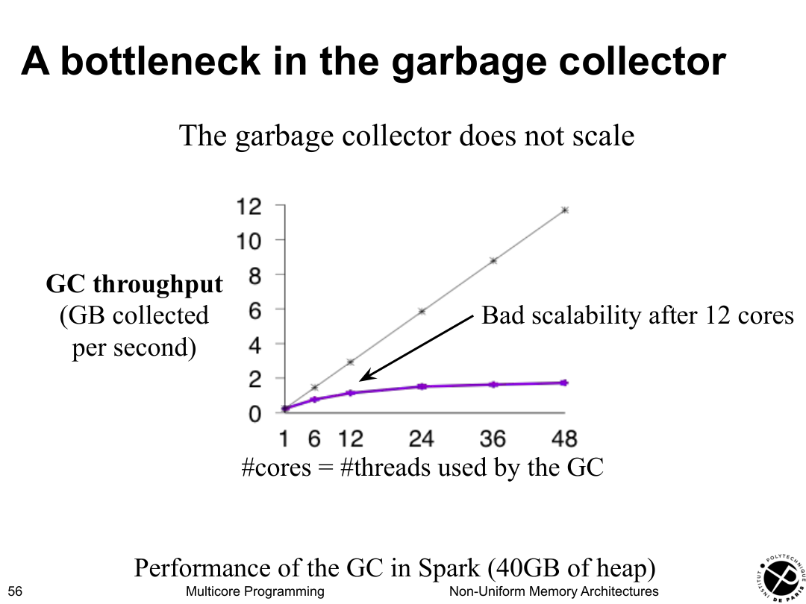

</details>

<a id="page-57"></a>

## 第 57 页 · First optimizations: synchronizations

- Remove useless synchronizations in the garbage collector

- Trades the genericity of the code for better performance

- Optimize the locks

- Futex instead of hand tuned

- Optimized lock-free queue for the work stealing

> 校对：优化锁与队列仍未解决扩展性。

<details>
<summary>查看第 57 页原图（图形、代码布局与标注）</summary>

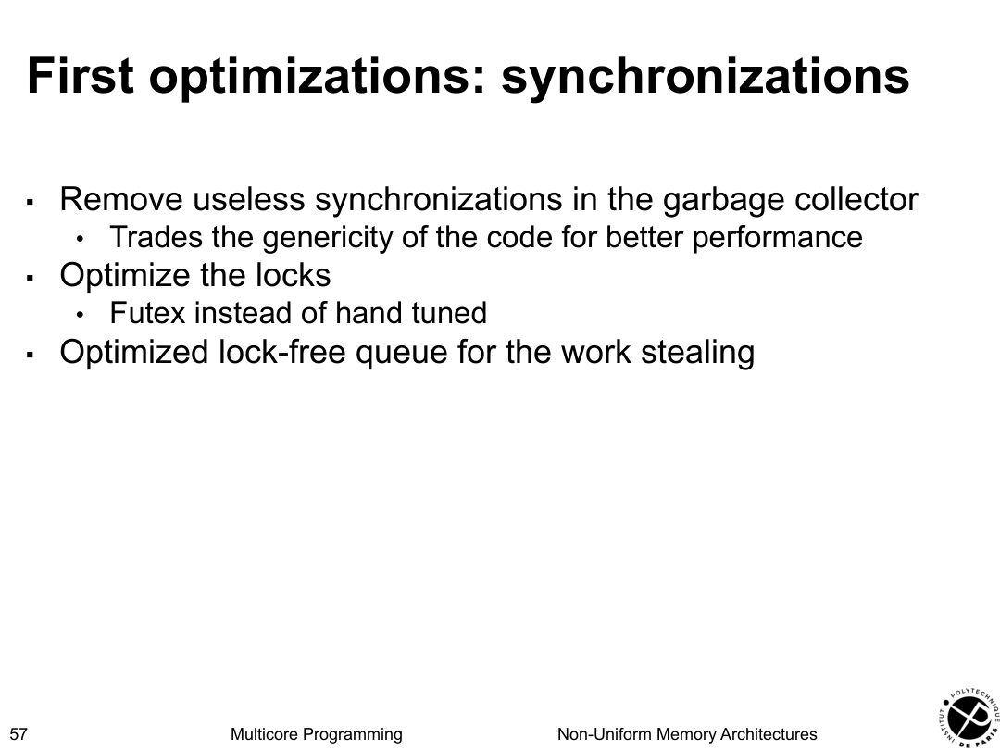

</details>

<a id="page-58"></a>

## 第 58 页 · First optimizations: synchronizations 

- Remove useless synchronizations in the garbage collector

- Trades the genericity of the code for better performance

- Optimize the locks

- Futex instead of hand tuned

- Optimized lock-free queue for the work stealing

Better performance

GC throughput

but does not solve the scalability issue

(GB collected

per second)

gidra@asplos13

> 校对：优化锁与队列仍未解决扩展性。

<details>
<summary>查看第 58 页原图（图形、代码布局与标注）</summary>

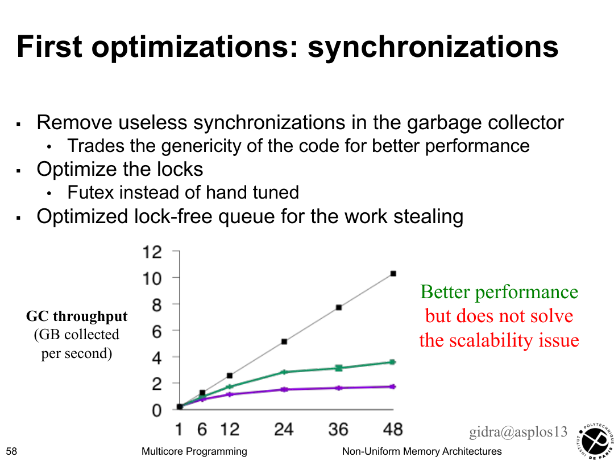

</details>

<a id="page-59"></a>

## 第 59 页 · Second optimizations: NUMAGiC

- The problem: a GC thread accesses any node

Node 0 Node 1

Memory

Memory

GC Thread 0

> 校对：访问工作向数据所在节点移动；逐页保留箭头。

<details>
<summary>查看第 59 页原图（图形、代码布局与标注）</summary>


</details>

<a id="page-60"></a>

## 第 60 页 · Second optimizations: NUMAGiC

- The problem: a GC thread accesses any node

Node 0 Node 1

Memory

Memory

GC Thread 0

> 校对：访问工作向数据所在节点移动；逐页保留箭头。

<details>
<summary>查看第 60 页原图（图形、代码布局与标注）</summary>

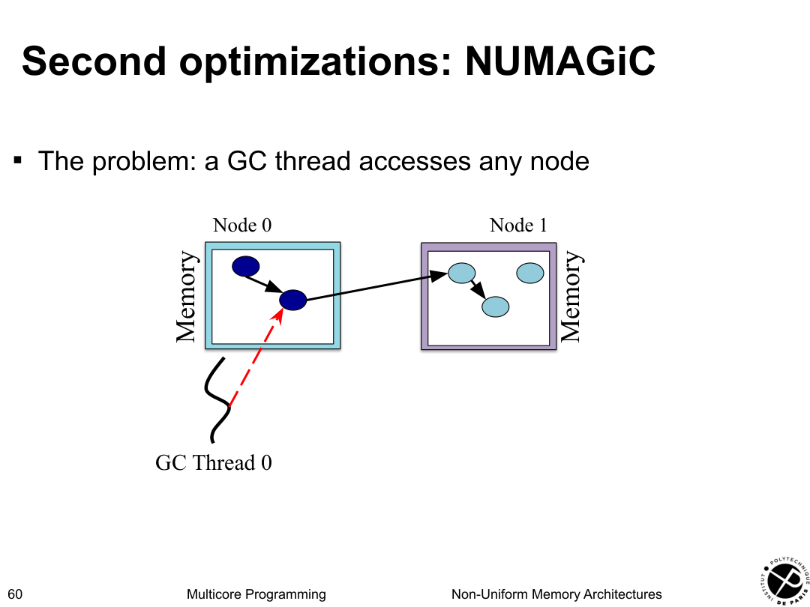

</details>

<a id="page-61"></a>

## 第 61 页 · Second optimizations: NUMAGiC

- The problem: a GC thread accesses any node

Node 0 Node 1

Memory

Memory

Remote accesses!

GC Thread 0

> 校对：访问工作向数据所在节点移动；逐页保留箭头。

<details>
<summary>查看第 61 页原图（图形、代码布局与标注）</summary>

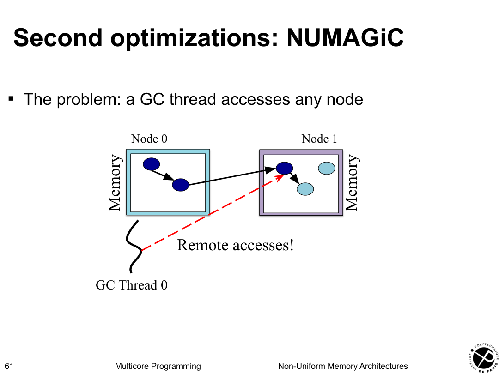

</details>

<a id="page-62"></a>

## 第 62 页 · Second optimizations: NUMAGiC

- Idea: distributed memory => distributed GC design

> 校对：访问工作向数据所在节点移动；逐页保留箭头。

<details>
<summary>查看第 62 页原图（图形、代码布局与标注）</summary>

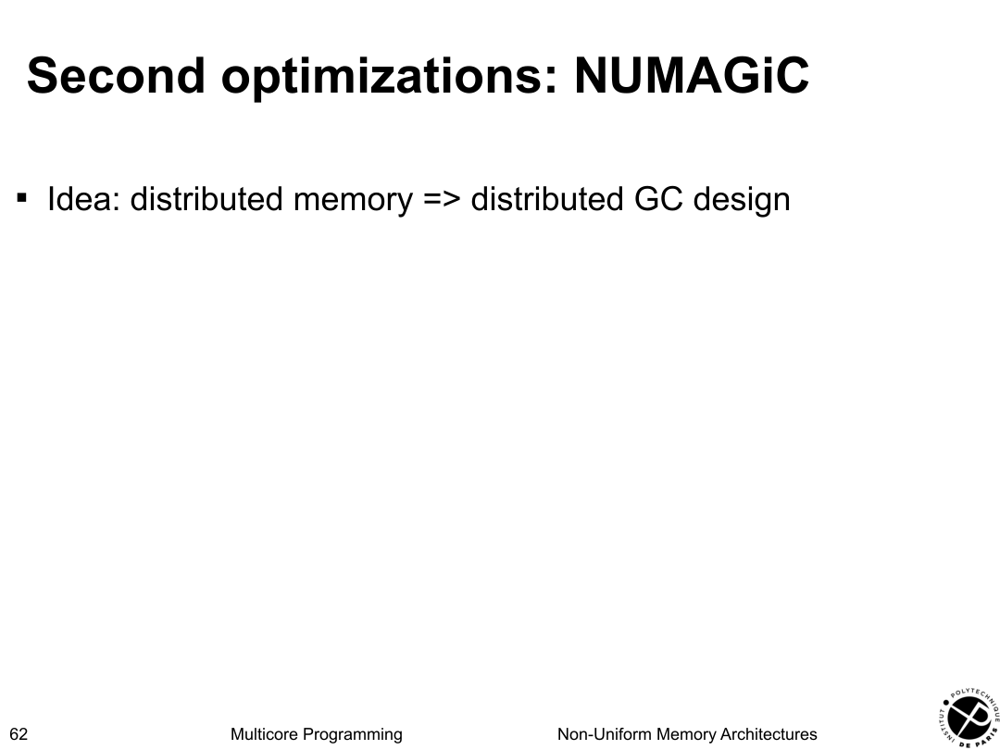

</details>

<a id="page-63"></a>

## 第 63 页 · Second optimizations: NUMAGiC

- Idea: distributed memory => distributed GC design

- Trade remote accesses for messages

Node 0 Node 1

Memory

Memory

GC Thread 0 GC Thread 1

> 校对：访问工作向数据所在节点移动；逐页保留箭头。

<details>
<summary>查看第 63 页原图（图形、代码布局与标注）</summary>

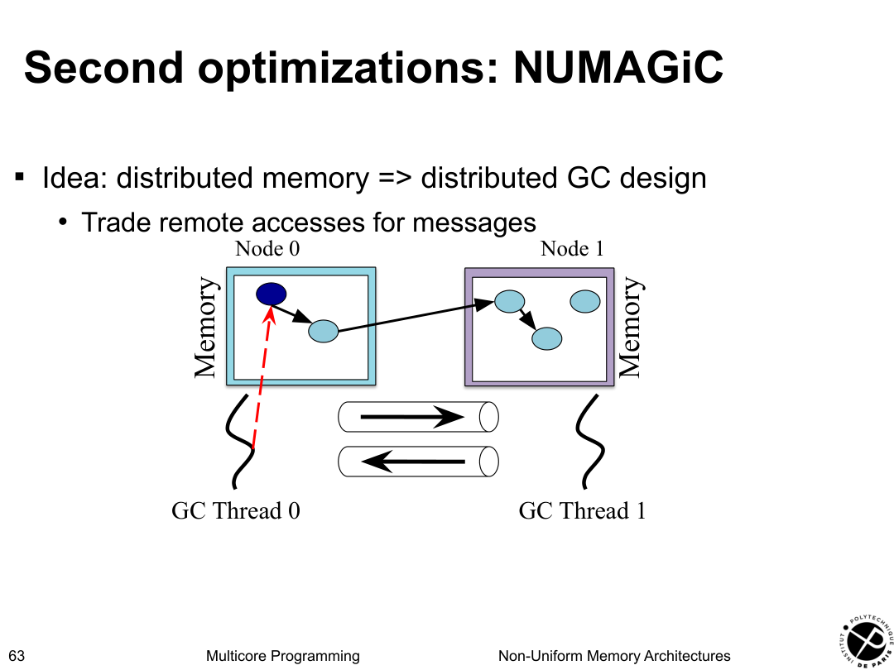

</details>

<a id="page-64"></a>

## 第 64 页 · Second optimizations: NUMAGiC

- Idea: distributed memory => distributed GC design

- Trade remote accesses for messages

Node 0 Node 1

Memory

Memory

GC Thread 0 GC Thread 1

> 校对：访问工作向数据所在节点移动；逐页保留箭头。

<details>
<summary>查看第 64 页原图（图形、代码布局与标注）</summary>

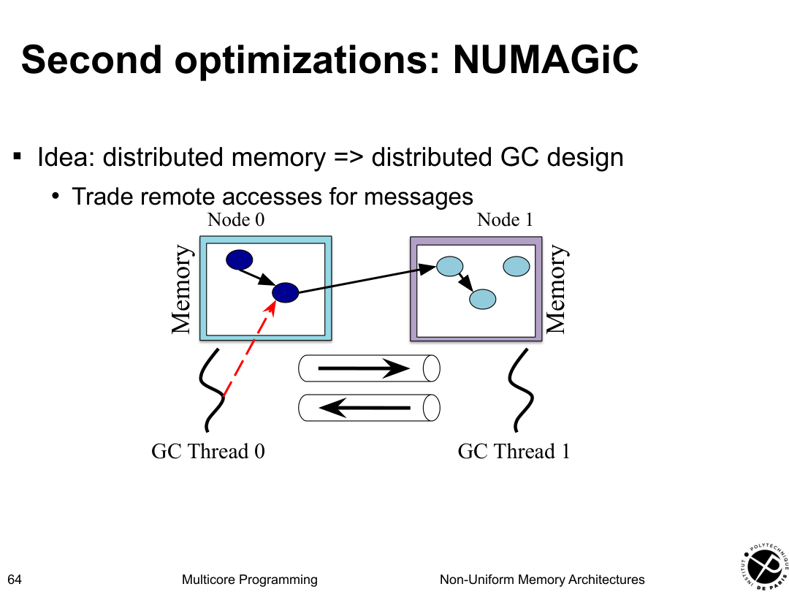

</details>

<a id="page-65"></a>

## 第 65 页 · Second optimizations: NUMAGiC

- Idea: distributed memory => distributed GC design

- Trade remote accesses for messages

Node 0 Node 1

Memory

Memory

GC Thread 0 GC Thread 1

> 校对：访问工作向数据所在节点移动；逐页保留箭头。

<details>
<summary>查看第 65 页原图（图形、代码布局与标注）</summary>

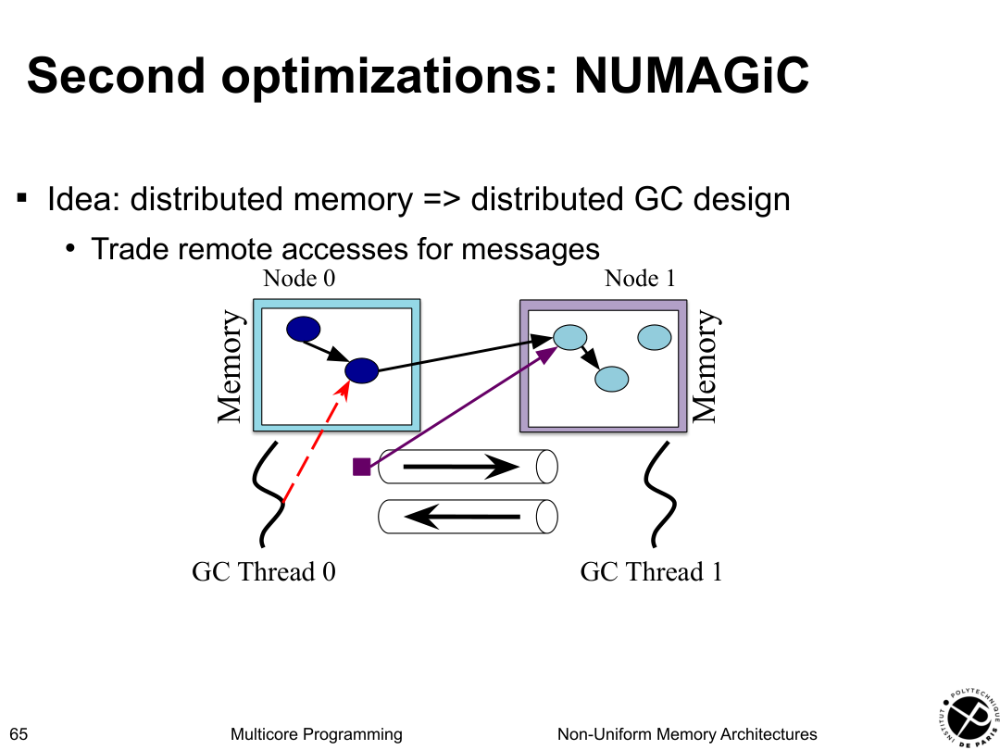

</details>

<a id="page-66"></a>

## 第 66 页 · Second optimizations: NUMAGiC

- Idea: distributed memory => distributed GC design

- Trade remote accesses for messages

Node 0 Node 1

Memory

Memory

GC Thread 0 GC Thread 1

> 校对：访问工作向数据所在节点移动；逐页保留箭头。

<details>
<summary>查看第 66 页原图（图形、代码布局与标注）</summary>

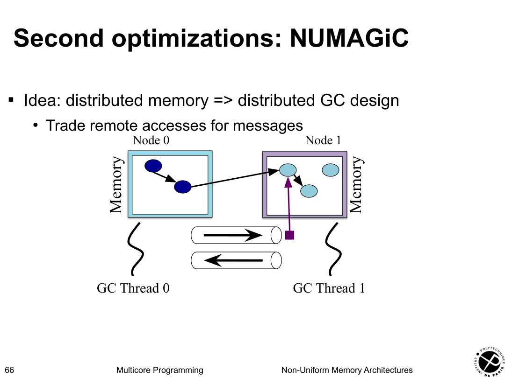

</details>

<a id="page-67"></a>

## 第 67 页 · Second optimizations: NUMAGiC

- Idea: distributed memory => distributed GC design

- Trade remote accesses for messages

Node 0 Node 1

Memory

Memory

GC Thread 0 GC Thread 1

> 校对：访问工作向数据所在节点移动；逐页保留箭头。

<details>
<summary>查看第 67 页原图（图形、代码布局与标注）</summary>

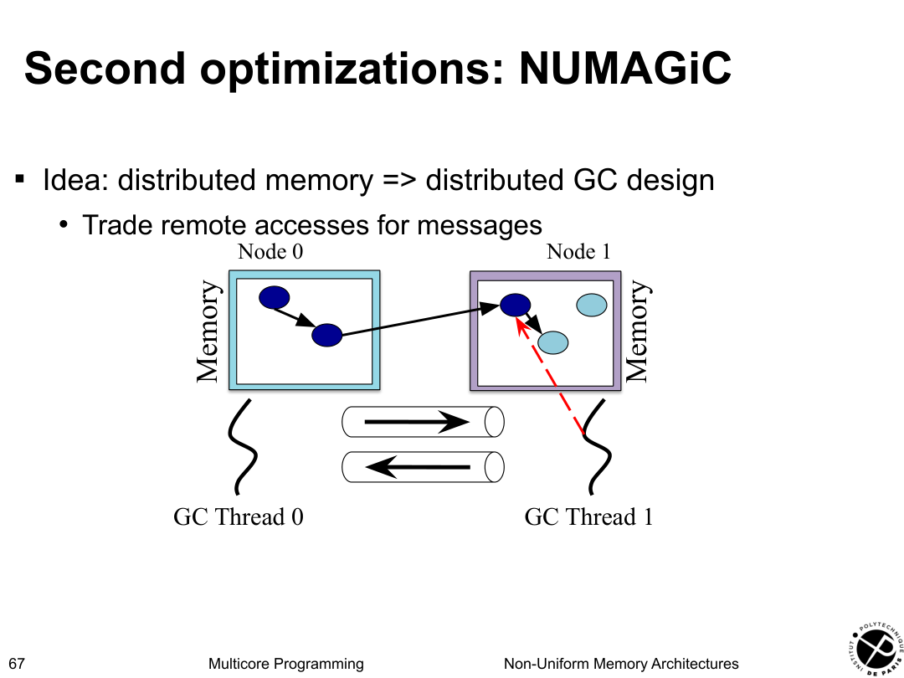

</details>

<a id="page-68"></a>

## 第 68 页 · Second optimizations: NUMAGiC

- Idea: distributed memory => distributed GC design

- Trade remote accesses for messages

Node 0 Node 1

Memory

Memory

GC Thread 0 GC Thread 1

> 校对：访问工作向数据所在节点移动；逐页保留箭头。

<details>
<summary>查看第 68 页原图（图形、代码布局与标注）</summary>

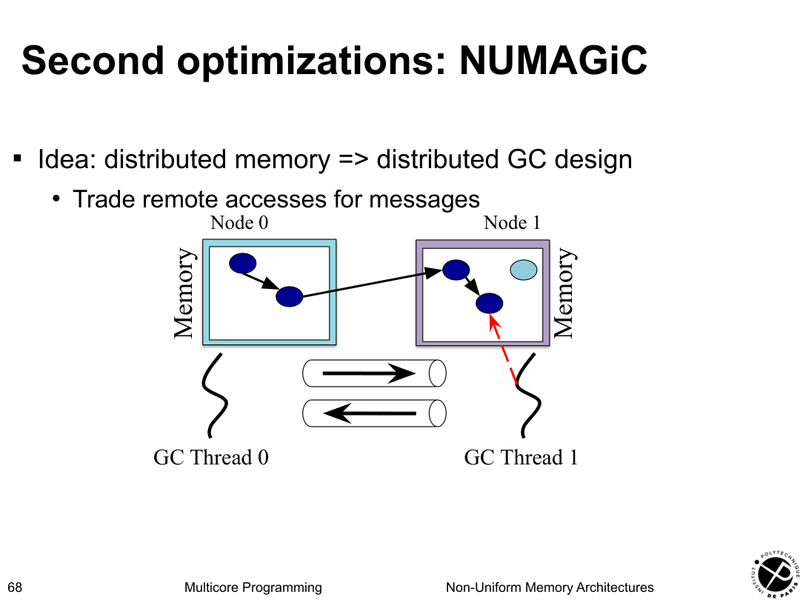

</details>

<a id="page-69"></a>

## 第 69 页 · As is, messages degrades performance 

☹

- Problem: a message is more costly than a remote access

Node 0 Node 1

Too many messages

> 校对：消息有成本；1%是该实验观察。

<details>
<summary>查看第 69 页原图（图形、代码布局与标注）</summary>

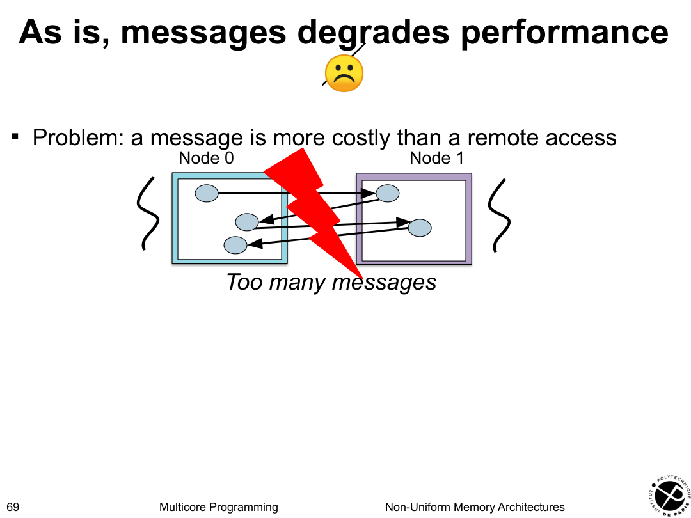

</details>

<a id="page-70"></a>

## 第 70 页 · As is, messages degrades performance 

☹

- Problem: a message is more costly than a remote access

Node 0 Node 1

Too many messages

⇒ Inter-node references must be minimized

> 校对：消息有成本；1%是该实验观察。

<details>
<summary>查看第 70 页原图（图形、代码布局与标注）</summary>

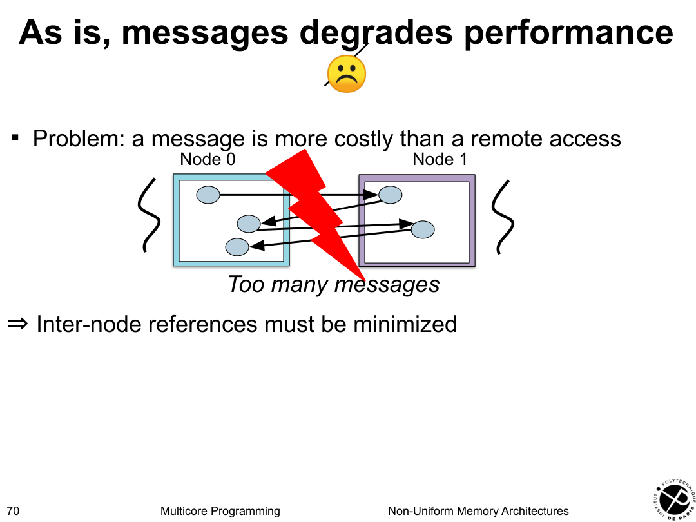

</details>

<a id="page-71"></a>

## 第 71 页 · As is, messages degrades performance 

☹

- Problem: a message is more costly than a remote access

Node 0 Node 1

Too many messages

⇒ Inter-node references must be minimized

- Observation: a thread mostly connects objects it has allocated

Only 1% of references between objects allocated by different threads in Spark

> 校对：消息有成本；1%是该实验观察。

<details>
<summary>查看第 71 页原图（图形、代码布局与标注）</summary>

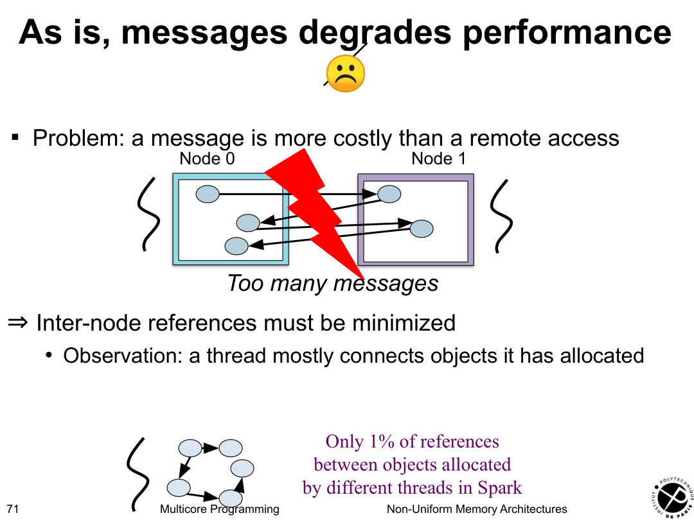

</details>

<a id="page-72"></a>

## 第 72 页 · As is, messages degrades performance 

☹

- Problem: a message is more costly than a remote access

Node 0 Node 1

Too many messages

⇒ Inter-node references must be minimized

- Observation: a thread mostly connects objects it has allocated
- Heuristics: allocate and let the objects on their allocation nodes

> 校对：消息有成本；1%是该实验观察。

<details>
<summary>查看第 72 页原图（图形、代码布局与标注）</summary>

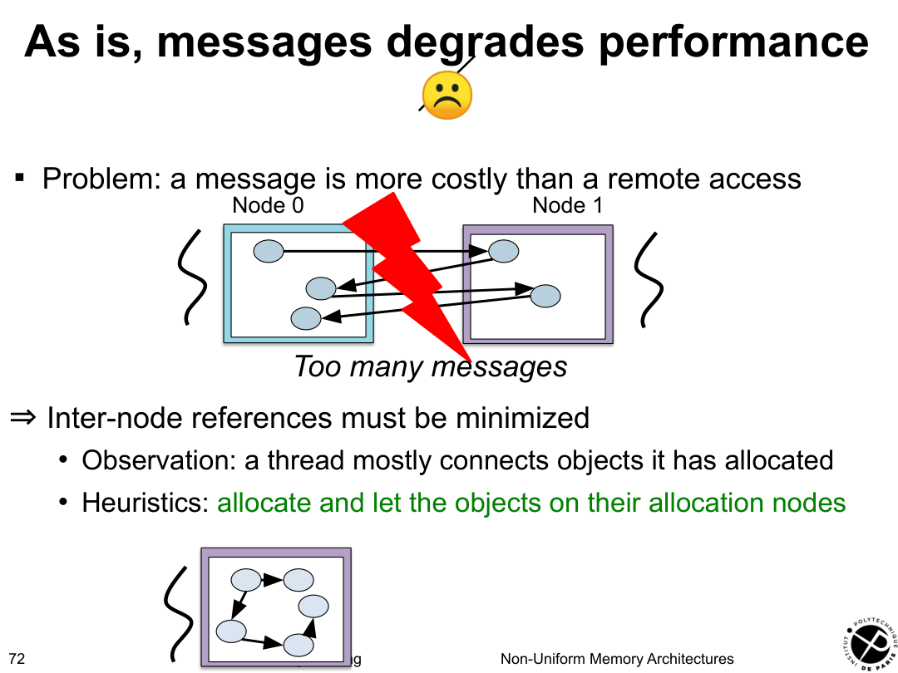

</details>

<a id="page-73"></a>

## 第 73 页 · But few inter-node references degrade 

the parallelism! ☹

Node 0 Node 1

Node 1 idles while node 0 collects its memory

> 校对：本地模式与空闲时远程窃取兼顾平衡。

<details>
<summary>查看第 73 页原图（图形、代码布局与标注）</summary>

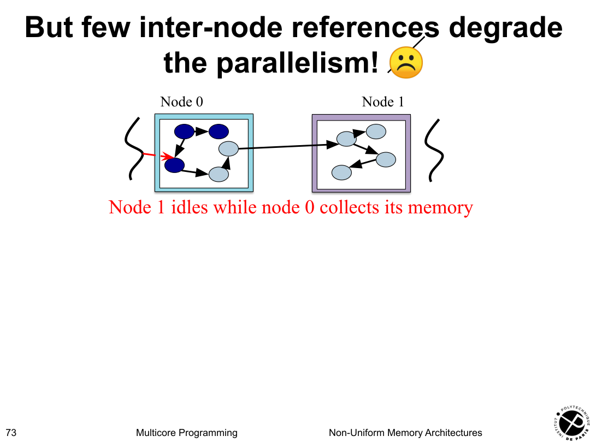

</details>

<a id="page-74"></a>

## 第 74 页 · But few inter-node references degrade 

the parallelism! ☹

Node 0 Node 1

Node 1 idles while node 0 collects its memory

- Solution: adaptive algorithm

- Local mode: send messages when not idling
- Thief mode: steal and access remote objects when idling

> 校对：本地模式与空闲时远程窃取兼顾平衡。

<details>
<summary>查看第 74 页原图（图形、代码布局与标注）</summary>

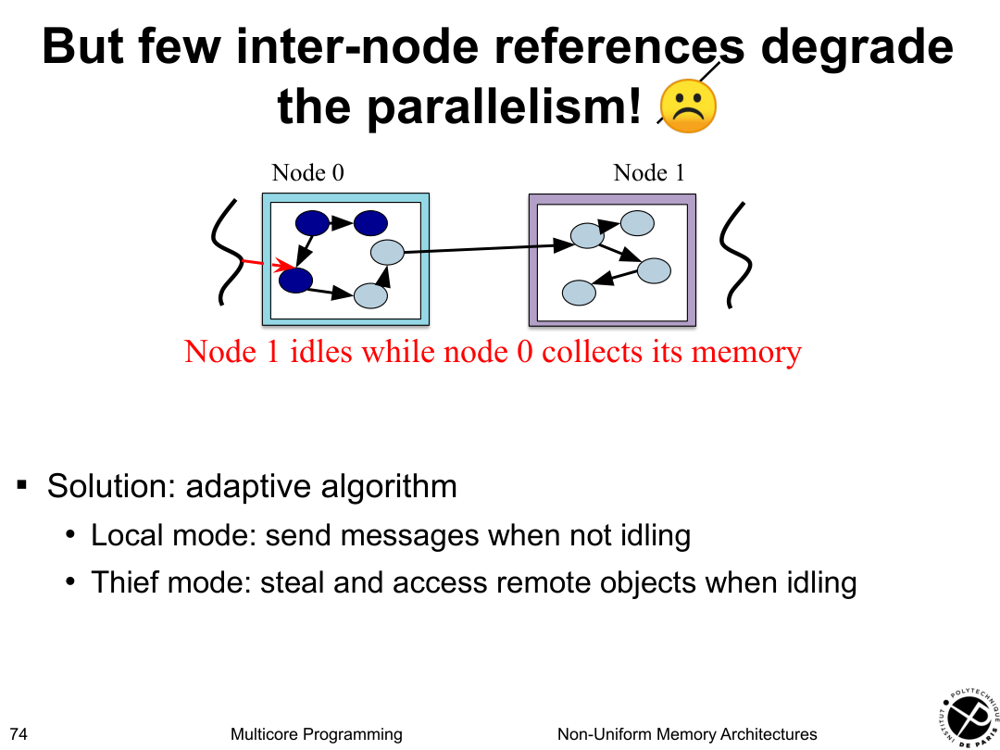

</details>

<a id="page-75"></a>

## 第 75 页 · Performance of NumaGiC

GC throughput

NumaGiC

(GB collected

per second)

synchroPS

SynchroPS + interl.

PS

#cores = #threads

Performance of the GC with Spark (40GB of heap)

> 校对：高处黑色线为参考线；各性能曲线按原图识别。

<details>
<summary>查看第 75 页原图（图形、代码布局与标注）</summary>

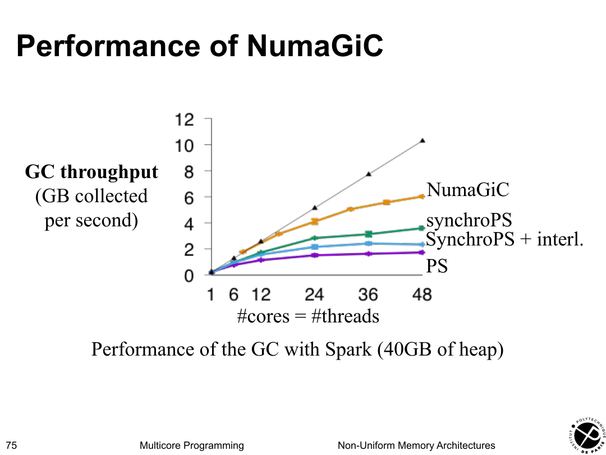

</details>

<a id="page-76"></a>

## 第 76 页 · Performance of the application

Application

NumaGiC

speedup in term of completion time PS

synchroPS

synchroPS + interl.

#cores = #threads

Performance of Spark (40GB of heap)

Completion time divided by two gidra@asplos15

> 校对：分别看吞吐与应用完成时间；高处参考线分离。

<details>
<summary>查看第 76 页原图（图形、代码布局与标注）</summary>

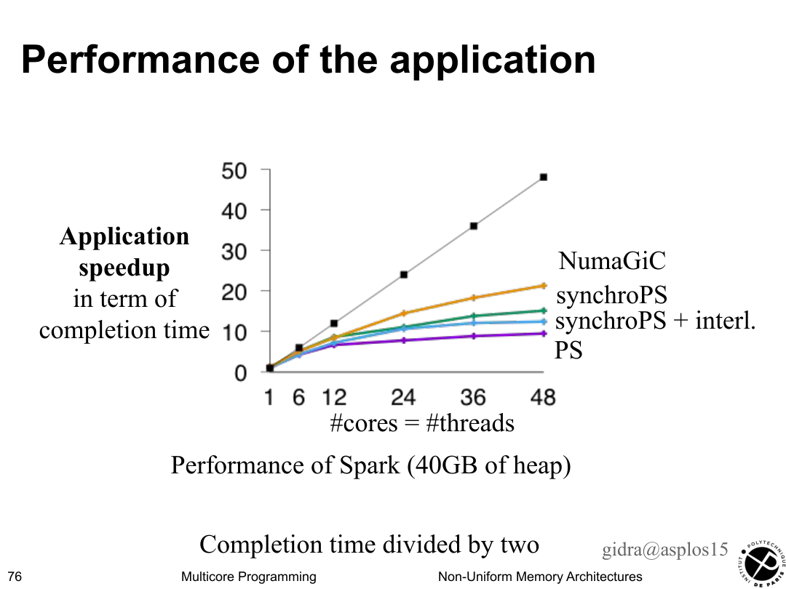

</details>

<a id="page-77"></a>

## 第 77 页 · Third lessons

- NUMA can have a large impact on performance

- On data analytic applications written in Java

- We can design better NUMA policies than the ones proposed

by default in Linux

- Technically inspired by distributed systems

> 校对：分别看吞吐与应用完成时间；高处参考线分离。

<details>
<summary>查看第 77 页原图（图形、代码布局与标注）</summary>

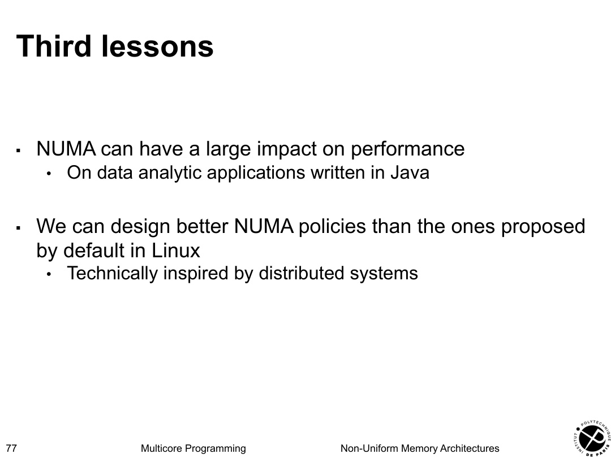

</details>

<a id="page-78"></a>

## 第 78 页 · Fourth study

How a hypervisor behaves on a NUMA machine?

- Study of a set of 29 parallel applications

Parsec, NPB, MosBench, X-stream, YCSB (Cassandra, MangoDB)

- Hypervisor overhead when we increase the #cores

> 校对：MangoDB应理解为MongoDB名称拼写。

<details>
<summary>查看第 78 页原图（图形、代码布局与标注）</summary>

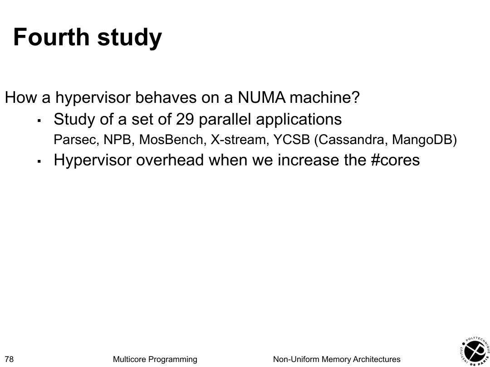

</details>

<a id="page-79"></a>

## 第 79 页 · Fourth study

How a hypervisor behaves on a NUMA machine?

- Study of a set of 29 parallel applications

Parsec, NPB, MosBench, X-stream, YCSB (Cassandra, MangoDB)

- Hypervisor overhead when we increase the #cores

Up to a 9.5 time slowdown in Xen with 48 cores

while overhead is negligible with 1 core

> 校对：vCPU固定映射条件、最佳策略比较与历史开销。

<details>
<summary>查看第 79 页原图（图形、代码布局与标注）</summary>

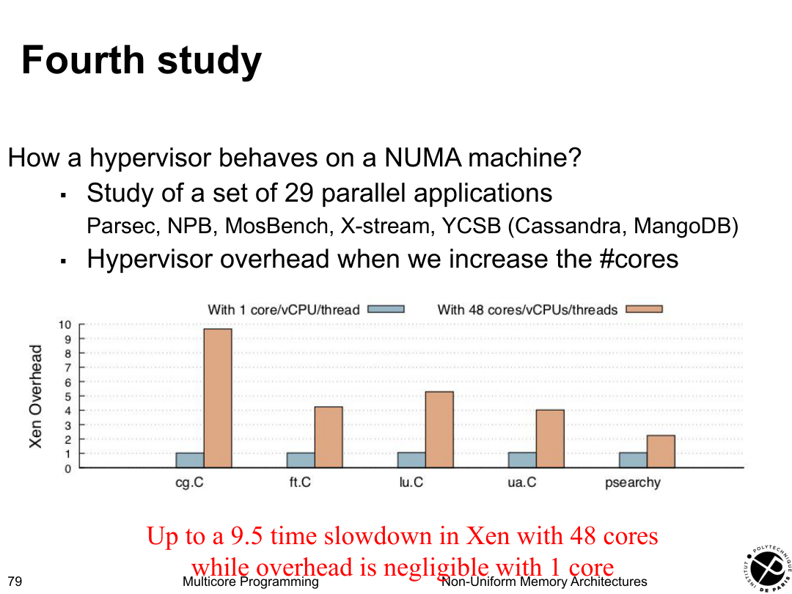

</details>

<a id="page-80"></a>

## 第 80 页 · Memory access latency causes the  overhead

> 校对：vCPU固定映射条件、最佳策略比较与历史开销。

<details>
<summary>查看第 80 页原图（图形、代码布局与标注）</summary>

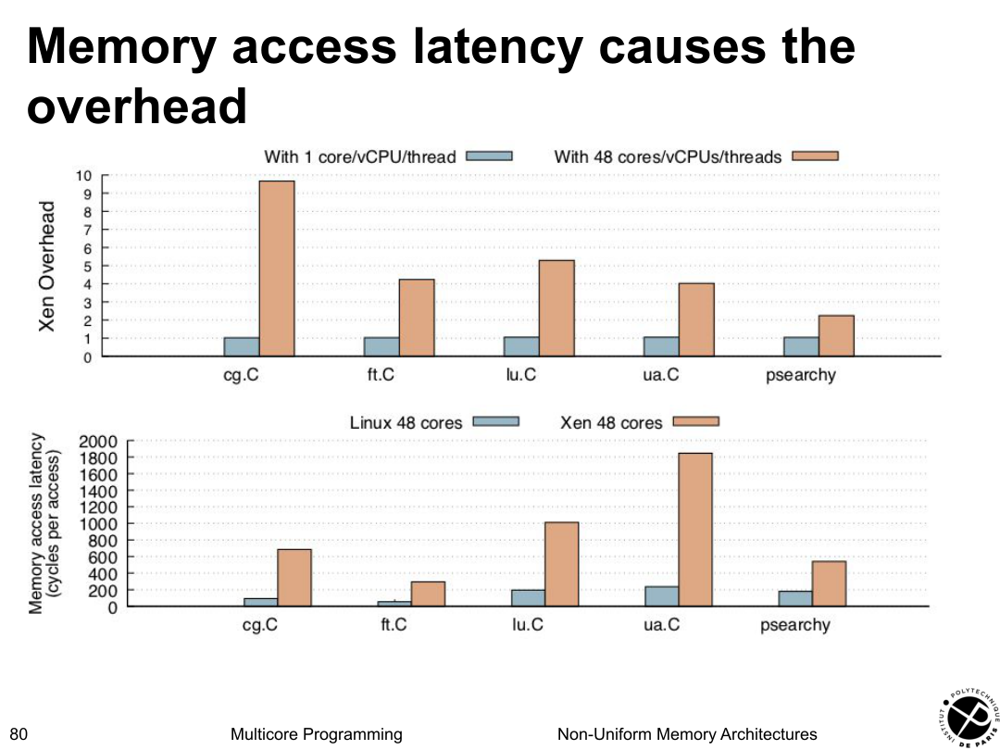

</details>

<a id="page-81"></a>

## 第 81 页 · Solution: XenNUMA

- Implement generic NUMA policies in Xen

- Interleaved: roughly randomize memory access
- First-touch: allocate from the node that triggers the first access
- Carrefour: dynamic policies proposed by Dashti et al.

- Add a new interface between Linux and Xen

- To select a NUMA policy for a process
- To know which pages are allocated to a process In order to allocate a page from the node that triggers the first access

- Rewrite the memory sub-system of Xen

> 校对：vCPU固定映射条件、最佳策略比较与历史开销。

<details>
<summary>查看第 81 页原图（图形、代码布局与标注）</summary>

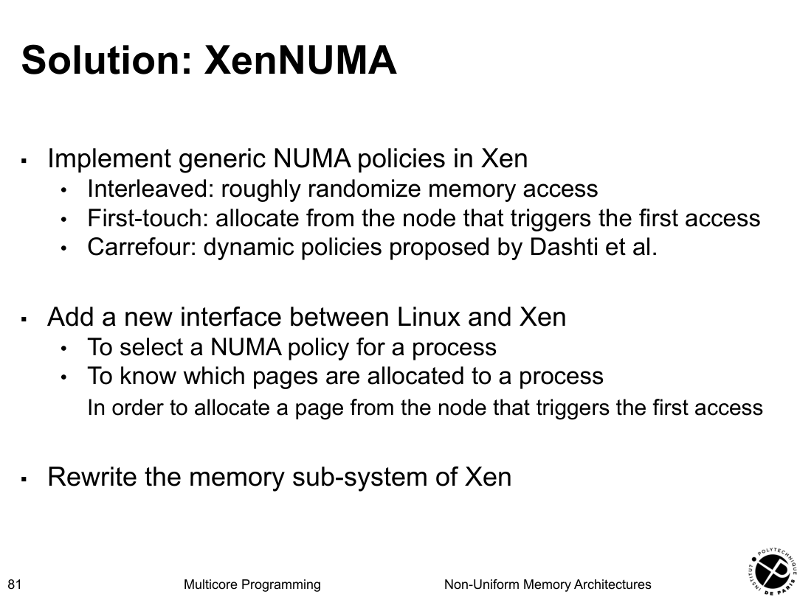

</details>

<a id="page-82"></a>

## 第 82 页 · Overhead of Xen with 48 cores/vCPUs

- Settings: 48 vCPUs (pined) on the 48 pCPUs

- Xen uses the default (nonexistent) NUMA policy
- XenNUMA uses the best possible NUMA policy

- Results:

- Performance improvement of up to 700%
- Virtualization costs less than 50% for

 12/29 applications with Xen  23/29 applications with XenNUMA

voron@eurosys17

> 校对：固定48vCPU/48pCPU；最佳策略选择不等于默认部署。

<details>
<summary>查看第 82 页原图（图形、代码布局与标注）</summary>

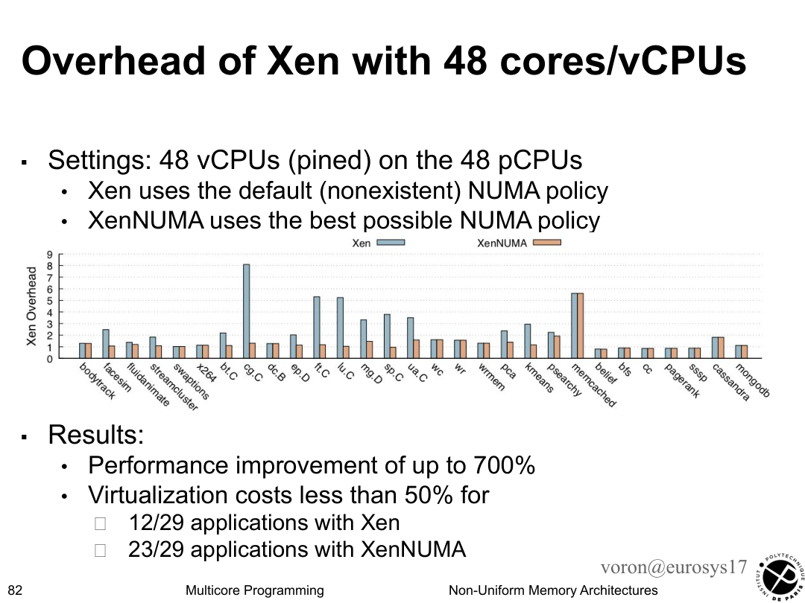

</details>

<a id="page-83"></a>

## 第 83 页 · XenNUMA is not a satisfactory solution because XenNUMA hides the topology

Prevents the use System Runtime Libraries (SLR) optimizations:

- Impossible to use NumaGiC or other application-specific

NUMA policies

- Impossible to use NUMA-aware allocators

- TCMalloc, JEMalloc

=> Bad performance for many applications

> 校对：SLR/SRL原文缩写不统一，中文称运行库。

<details>
<summary>查看第 83 页原图（图形、代码布局与标注）</summary>

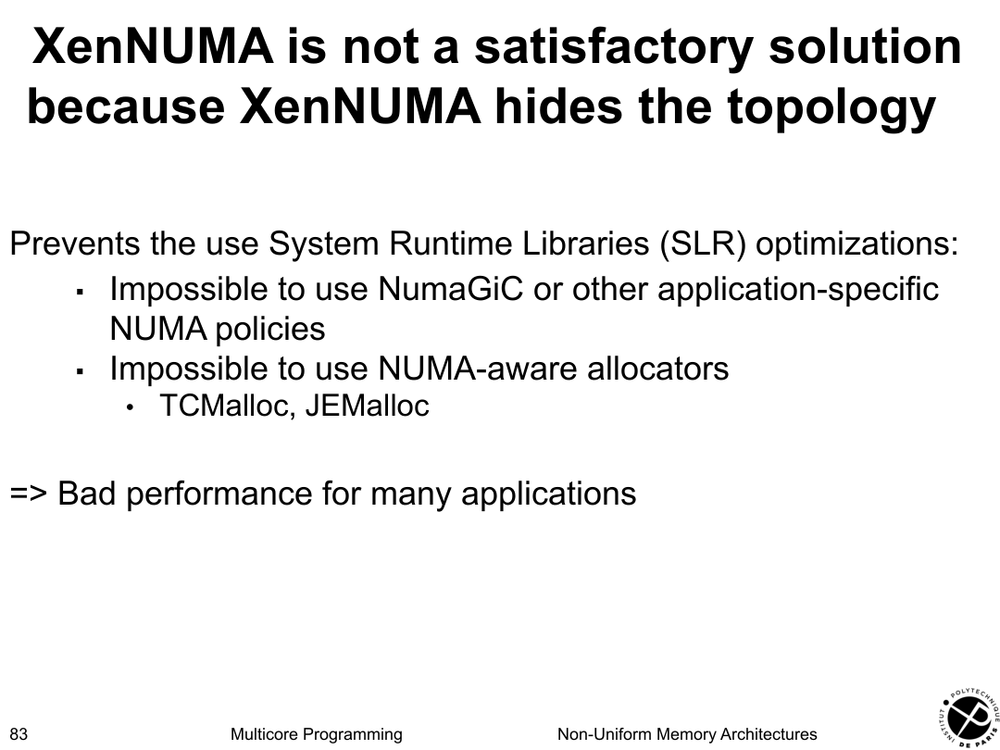

</details>

<a id="page-84"></a>

## 第 84 页 · Exposing the topology is not more  efficient

vNUMA exposes the initial NUMA topology

- But the hypervisor may change the NUMA topology at runtime => makes SLR and OS

work with a stale topology

> 校对：初始拓扑之外还需变化通知；固定和变化两组实验。

<details>
<summary>查看第 84 页原图（图形、代码布局与标注）</summary>

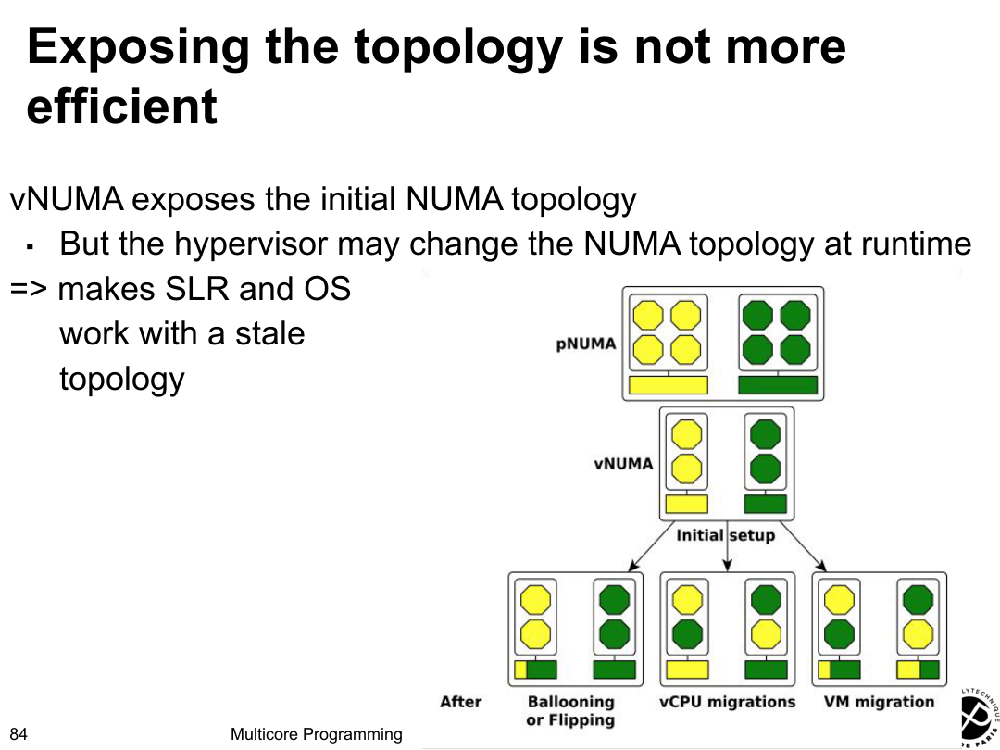

</details>

<a id="page-85"></a>

## 第 85 页 · Exposing the topology is not more  efficient

vNUMA exposes the initial NUMA topology

- But the hypervisor may change the NUMA topology at runtime => makes SLR and OS

work with a stale topology

> 校对：初始拓扑之外还需变化通知；固定和变化两组实验。

<details>
<summary>查看第 85 页原图（图形、代码布局与标注）</summary>

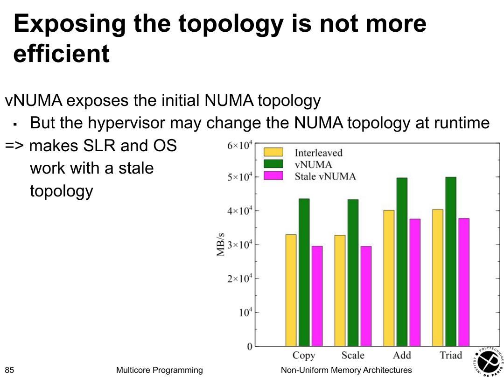

</details>

<a id="page-86"></a>

## 第 86 页 · XPV: eXtended ParaVirtualization

- Expose the initial NUMA topology

- Add notifications when the NUMA topology changes

- Used by the OS and the SLR to update the topology
- Few lines of code changed

> 校对：初始拓扑之外还需变化通知；固定和变化两组实验。

<details>
<summary>查看第 86 页原图（图形、代码布局与标注）</summary>

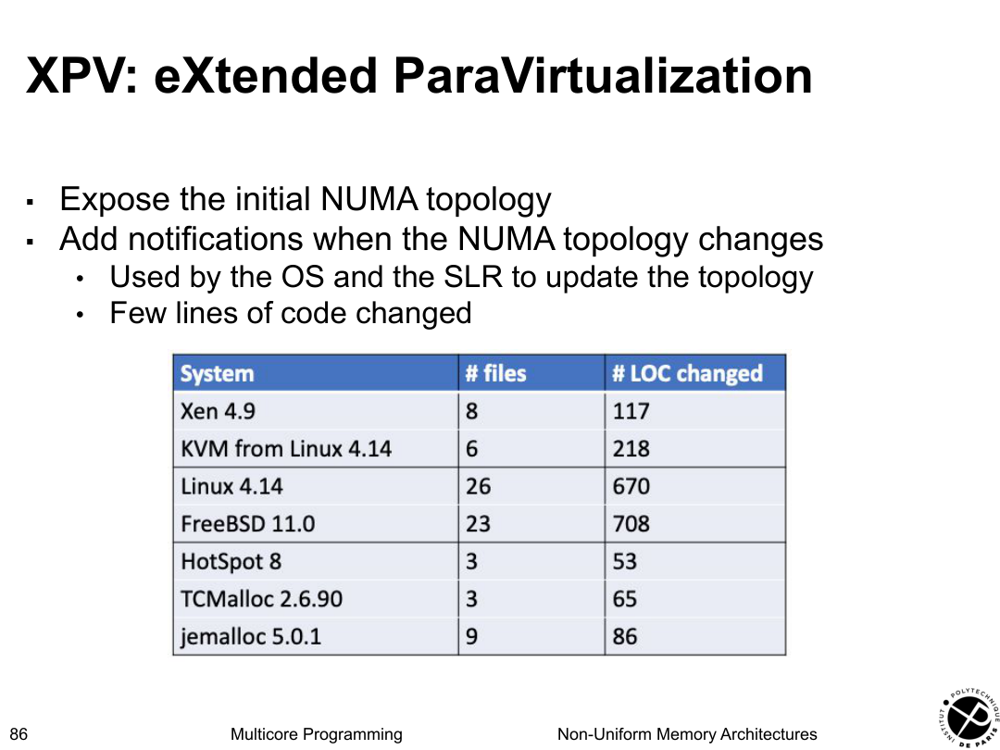

</details>

<a id="page-87"></a>

## 第 87 页 · XPV versus XenNUMA (fixed NUMA  topology)

By exposing the NUMA topology: up to 130% improvement

XenNUMA

policies

> 校对：初始拓扑之外还需变化通知；固定和变化两组实验。

<details>
<summary>查看第 87 页原图（图形、代码布局与标注）</summary>

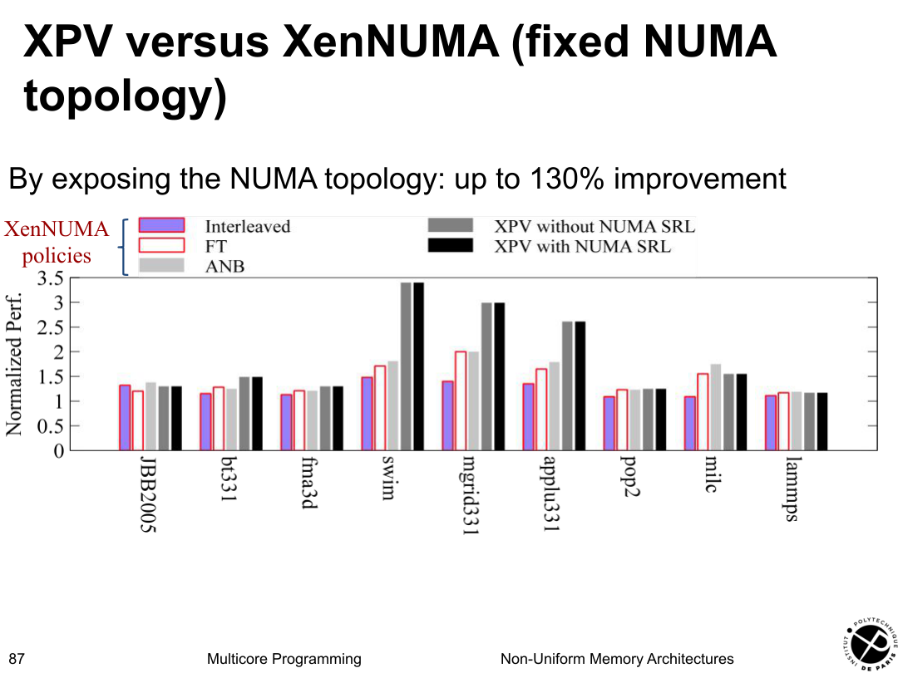

</details>

<a id="page-88"></a>

## 第 88 页 · XPV facing topology changes

- Xen migrates vCPUs to balance the load

- Three identical VMs
- 48 vCPUs/42 pCPUs

88 Improvement: up to 127% bui@eurosys19

> 校对：3 VM和48vCPU/42pCPU条件保留。

<details>
<summary>查看第 88 页原图（图形、代码布局与标注）</summary>

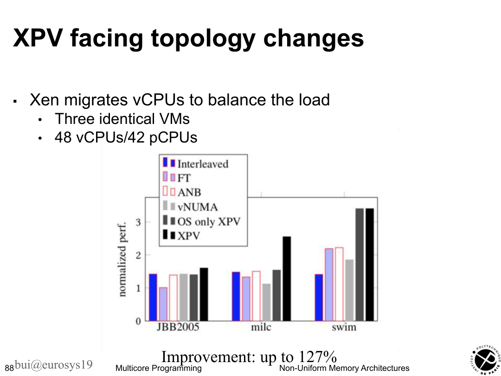

</details>

<a id="page-89"></a>

## 第 89 页 · To take away

- NUMA can have a large impact on performance

- On many parallel applications (both native and Java)

- We can already significantly improve performances with

generic NUMA policies

- We can predict which generic policy can give the best performance

- For some applications/SLRs, we need specific policies

- JVM, Databases, locks, NUMA-aware allocators…

- We can mitigate NUMA effects even in hypervisors

> 校对：通用策略、运行库特定策略和证据采集。

<details>
<summary>查看第 89 页原图（图形、代码布局与标注）</summary>

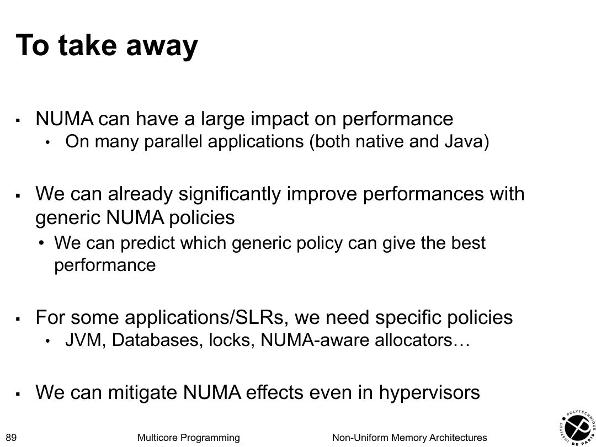

</details>

## 原 OCR 图片保留索引

以下按原始 OCR 引用顺序保留，方便核对裁切范围；准确页码以逐页原图为准。

- [提取图 001](Images/05-numa/image_001.jpg)
- [提取图 002](Images/05-numa/image_002.jpg)
- [提取图 003](Images/05-numa/image_003.jpg)
- [提取图 004](Images/05-numa/image_004.jpg)
- [提取图 005](Images/05-numa/image_005.jpg)
- [提取图 006](Images/05-numa/image_006.jpg)
- [提取图 007](Images/05-numa/image_007.jpg)
- [提取图 008](Images/05-numa/image_008.jpg)
- [提取图 009](Images/05-numa/image_009.jpg)
- [提取图 010](Images/05-numa/image_010.jpg)
- [提取图 011](Images/05-numa/image_011.jpg)
- [提取图 012](Images/05-numa/image_012.jpg)
- [提取图 013](Images/05-numa/image_013.jpg)
- [提取图 014](Images/05-numa/image_014.jpg)
- [提取图 015](Images/05-numa/image_015.jpg)
- [提取图 016](Images/05-numa/image_016.jpg)
- [提取图 017](Images/05-numa/image_017.jpg)
- [提取图 018](Images/05-numa/image_018.jpg)
- [提取图 019](Images/05-numa/image_019.jpg)
- [提取图 020](Images/05-numa/image_020.jpg)
- [提取图 021](Images/05-numa/image_021.jpg)
- [提取图 022](Images/05-numa/image_022.jpg)
- [提取图 023](Images/05-numa/image_023.jpg)
- [提取图 024](Images/05-numa/image_024.jpg)
- [提取图 025](Images/05-numa/image_025.jpg)
- [提取图 026](Images/05-numa/image_026.jpg)
- [提取图 027](Images/05-numa/image_027.jpg)
- [提取图 028](Images/05-numa/image_028.jpg)
- [提取图 029](Images/05-numa/image_029.jpg)
- [提取图 030](Images/05-numa/image_030.jpg)
- [提取图 031](Images/05-numa/image_031.jpg)
- [提取图 032](Images/05-numa/image_032.jpg)
- [提取图 033](Images/05-numa/image_033.jpg)
- [提取图 034](Images/05-numa/image_034.jpg)
- [提取图 035](Images/05-numa/image_035.jpg)
- [提取图 036](Images/05-numa/image_036.jpg)
- [提取图 037](Images/05-numa/image_037.jpg)
- [提取图 038](Images/05-numa/image_038.jpg)
- [提取图 039](Images/05-numa/image_039.jpg)
- [提取图 040](Images/05-numa/image_040.jpg)
- [提取图 041](Images/05-numa/image_041.jpg)
- [提取图 042](Images/05-numa/image_042.jpg)
- [提取图 043](Images/05-numa/image_043.jpg)
- [提取图 044](Images/05-numa/image_044.jpg)
- [提取图 045](Images/05-numa/image_045.jpg)
- [提取图 046](Images/05-numa/image_046.jpg)
- [提取图 047](Images/05-numa/image_047.jpg)
- [提取图 048](Images/05-numa/image_048.jpg)
- [提取图 049](Images/05-numa/image_049.jpg)
- [提取图 050](Images/05-numa/image_050.jpg)
- [提取图 051](Images/05-numa/image_051.jpg)
- [提取图 052](Images/05-numa/image_052.jpg)
- [提取图 053](Images/05-numa/image_053.jpg)
- [提取图 054](Images/05-numa/image_054.jpg)
- [提取图 055](Images/05-numa/image_055.jpg)
- [提取图 056](Images/05-numa/image_056.jpg)
- [提取图 057](Images/05-numa/image_057.jpg)
- [提取图 058](Images/05-numa/image_058.jpg)
- [提取图 059](Images/05-numa/image_059.jpg)
- [提取图 060](Images/05-numa/image_060.jpg)
- [提取图 061](Images/05-numa/image_061.jpg)
- [提取图 062](Images/05-numa/image_062.jpg)
- [提取图 063](Images/05-numa/image_063.jpg)
- [提取图 064](Images/05-numa/image_064.jpg)
- [提取图 065](Images/05-numa/image_065.jpg)
- [提取图 066](Images/05-numa/image_066.jpg)
- [提取图 067](Images/05-numa/image_067.jpg)
- [提取图 068](Images/05-numa/image_068.jpg)
- [提取图 069](Images/05-numa/image_069.jpg)
- [提取图 070](Images/05-numa/image_070.jpg)
- [提取图 071](Images/05-numa/image_071.jpg)
