# 06-nvmm · 原文校对稿

[原始 PDF](06-nvmm.pdf) · [中文详解](06-nvmm_zh.md) · [课程目录](README.md)

对应实验：非易失性内存（[中文版](../Labs/tp-nvmm/tp-nvmm_zh.html) · [英文原版](../Labs/tp-nvmm/tp-nvmm.html)）

> 以 PDF 内嵌文字层重建，按原页和文字块分离正文、代码与图注，修复 MinerU 的混栏、页脚入代码及语言标签问题。保留原课件的用词和代码疑点，不将其悄悄改写为正确程序。代码块有时是逐步展示中的片段；图形、数学排版、颜色和箭头以各页展开后的原图为准。

[重要勘误](ERRATA.md)

<a id="page-1"></a>

## 第 1 页 · Page 1

Non-volatile main memory

Master in computer science of IP Paris

Master CHPS of Paris Saclay

Gaël Thomas

> 校对：原表ns/μs/Gbps保留；概括倍数与逐列不全吻合。

<details>
<summary>查看第 1 页原图（图形、代码布局与标注）</summary>

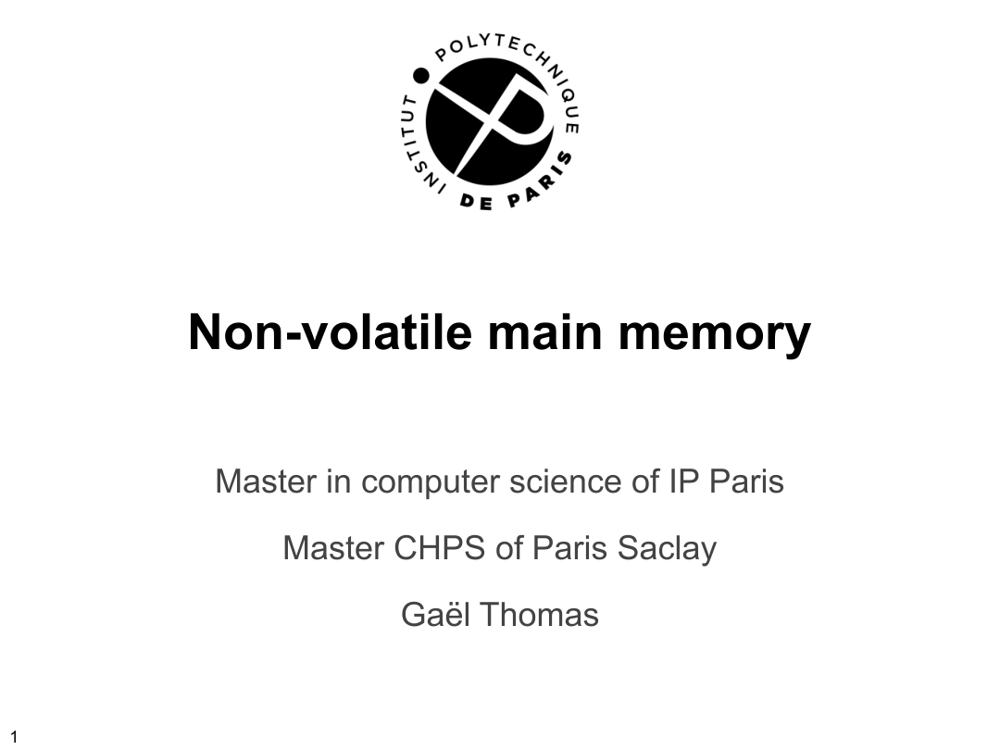

</details>

<a id="page-2"></a>

## 第 2 页 · Non-volatile main memory

Classical volatile memory (DDR4) Persistent storage (flash)

+

=

Non volatile main

memory

Non volatile main memory

- Byte addressability, directly by the processor through the memory bus with normal load/store instructions
- Durability as a SSD
- Performance: between DDR4 and NVMe (SSD through PCIe)

> 校对：原表ns/μs/Gbps保留；概括倍数与逐列不全吻合。

<details>
<summary>查看第 2 页原图（图形、代码布局与标注）</summary>

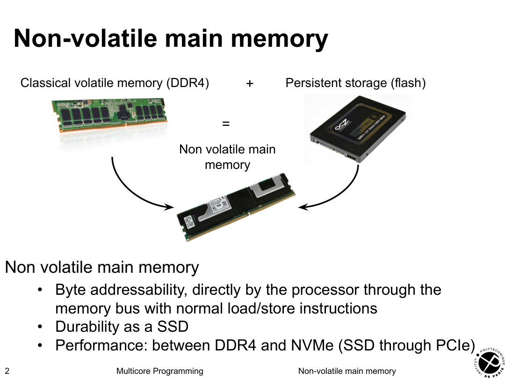

</details>

<a id="page-3"></a>

## 第 3 页 · NVMM performance

- 

Latency

- 2x slower than a DDR4
- 1000x to 10000x faster than a NVMe
- 

Throughput

- 2x to 4x lower than a DDR4
- 4x to 10x higher than a NVMe

| Memory | Sequential read | Sequential write | Sequential bandwidth | Random read | Random write | Random bandwidth |
|---|---|---|---|---|---|---|
| DDR4 | 80 ns | 60 ns | ~100 Gbps | 100 ns | 60 ns | ~100 Gbps |
| Optane DC | 160 ns | 60 ns | 40 Gbps | 300 ns | 120 ns | 14 Gbps |
| NVMe | 250 μs | 250 μs | 3 Gbps | 250 μs | 250 μs | 3 Gbps |

> 校对：单位按PDF；概括性能倍数与表格部分列不一致。

<details>
<summary>查看第 3 页原图（图形、代码布局与标注）</summary>

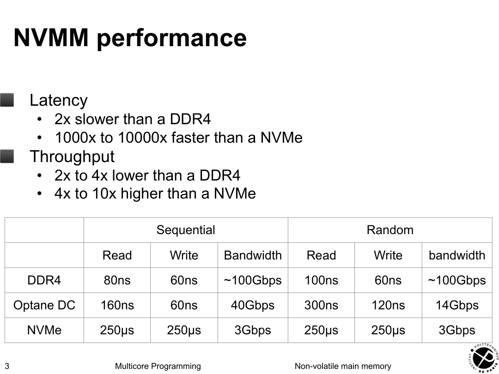

</details>

<a id="page-4"></a>

## 第 4 页 · How to use a NVMM 

- 

At the hardware level

- Recorded by the BIOS as any memory bank
- Marked as non volatile

- 

At the system level with Linux

- Exposed as a device
- Formatted with a direct access file system (DAX)

- Bypass the IO cache => direct load/store to the NVMM
- Accessible with classical IO functions (read, write and mmap)

- In case of mmap, direct access

> 校对：page cache不同于CPU cache；open mode及MAP_SYNC边界。

<details>
<summary>查看第 4 页原图（图形、代码布局与标注）</summary>


</details>

<a id="page-5"></a>

## 第 5 页 · How to use a NVMM with Linux

NVMM exposed as /dev/pmem0 Formatted with ext4-dax => bypass the kernel page cache Mounted in /mnt/nvmm

SSD exposed as /dev/sdb Formatted with ext4 => use the kernel page cache Mounted in /mnt/disk

/mnt/nvmm/... /mnt/disk/...

mounted as mounted as

/dev/pmem0 /dev/sdb

Kernel page cache

(IO cache)

Direct access

Non-direct access file

file system (e.g., ext4-dax)

system (e.g., ext4)

> 校对：page cache不同于CPU cache；open mode及MAP_SYNC边界。

<details>
<summary>查看第 5 页原图（图形、代码布局与标注）</summary>

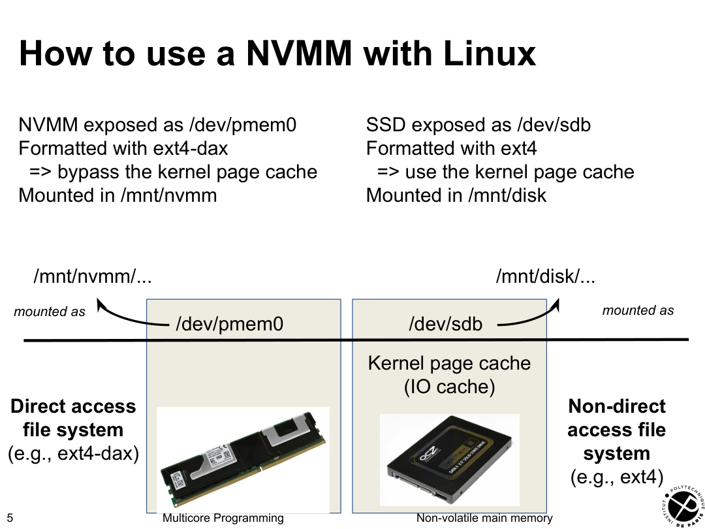

</details>

<a id="page-6"></a>

## 第 6 页 · How to use a NVMM with Linux

```text
int fd = open("/mnt/[nvmm,disk]/myfile", O_RDWR | O_CREAT);
ftruncate(fd, 1024*1024);
char* addr = mmap(NULL, 1024*1024, PROT_READ | PROT_WRITE,
                  MAP_SHARED_VALIDATE | MAP_SYNC, fd, 0);
addr[0] = 'a';
```

write in the volatile page cache, which is

direct write to NVMM

eventually propagated to disk

/mnt/nvmm/... /mnt/disk/...

mounted as mounted as

/dev/pmem0 /dev/sdb

Kernel page cache

(IO cache)

Direct access

Non-direct access file

file system (e.g., ext4-dax)

system (e.g., ext4)

> 校对：O_CREAT缺mode；MAP_SYNC在普通文件上不通用；错误检查省略。

<details>
<summary>查看第 6 页原图（图形、代码布局与标注）</summary>

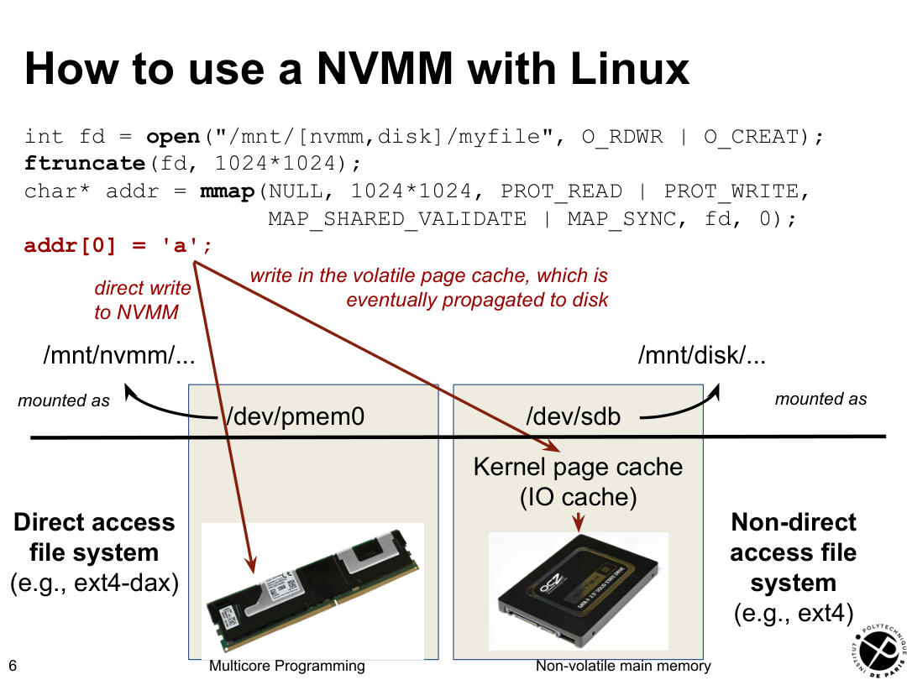

</details>

<a id="page-7"></a>

## 第 7 页 · Crash management

- 

A crash may happen at any time

- At recovery, the NVMM state is still there
- The state is not necessarily consistent
- An application has to cleanup this state

- 

Example

```text
struct id {
  char name[256];
};
```

```text
struct id* id = mmap(...);
```

```text
strcpy(id->name, "Pikachu");
```

In case of crash inside strcpy, id->name may contain inconsistent values (neither "" nor "Pikachu")

> 校对：committed/isCommitted原文混用；初始状态和幂等性前提。

<details>
<summary>查看第 7 页原图（图形、代码布局与标注）</summary>

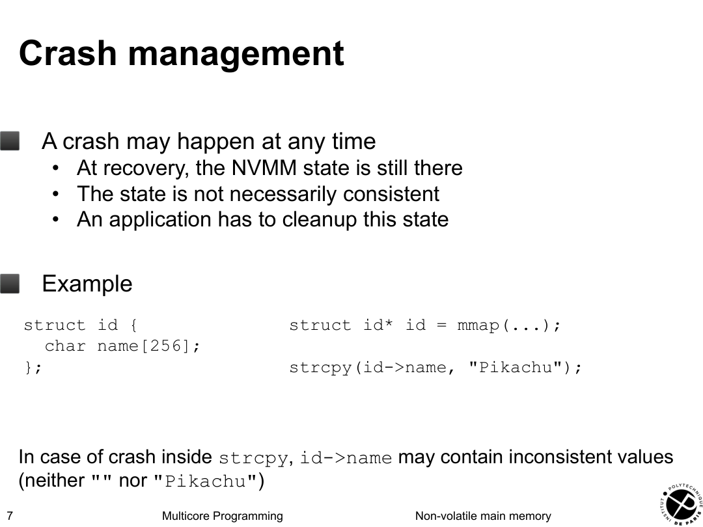

</details>

<a id="page-8"></a>

## 第 8 页 · Crash management

- 

Solution: use transactions!

- Manually manage the transaction (see below)
- Or use a high-level library such as the pmdk

- 

Principle of solution

```text
struct id {
  char name[256];
  bool committed;
};
```

```text
struct id* id = mmap(...);
```

```text
if(!id->isCommitted) { /* recover */
  strcpy(id->name, "Pikachu");
  id->committed = true;
}
```

> 校对：结构committed但条件isCommitted；原课件笔误。

<details>
<summary>查看第 8 页原图（图形、代码布局与标注）</summary>

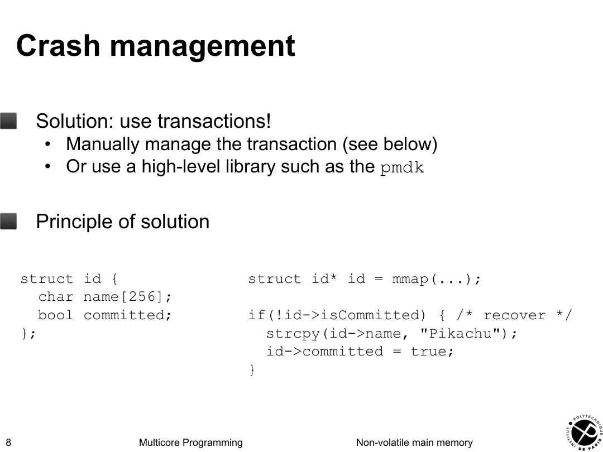

</details>

<a id="page-9"></a>

## 第 9 页 · Out-of-order execution

- 

Modern processors execute instructions out of order

- id->committed may be executed before strcpy
- The NVMM state at recovery is thus unknown with our code

- 

Principle of solution: enforce the ordering

- 

Problem: a memory fence enforces the ordering in the processor cache, but the cache lines can be flushed in any order....

```text
if(!id->isCommitted) { /* recover */
  strcpy(id->name, "Pikachu");
  memory_fence();
  id->committed = true;
}
```

> 校对：committed/isCommitted原文混用；初始状态和幂等性前提。

<details>
<summary>查看第 9 页原图（图形、代码布局与标注）</summary>

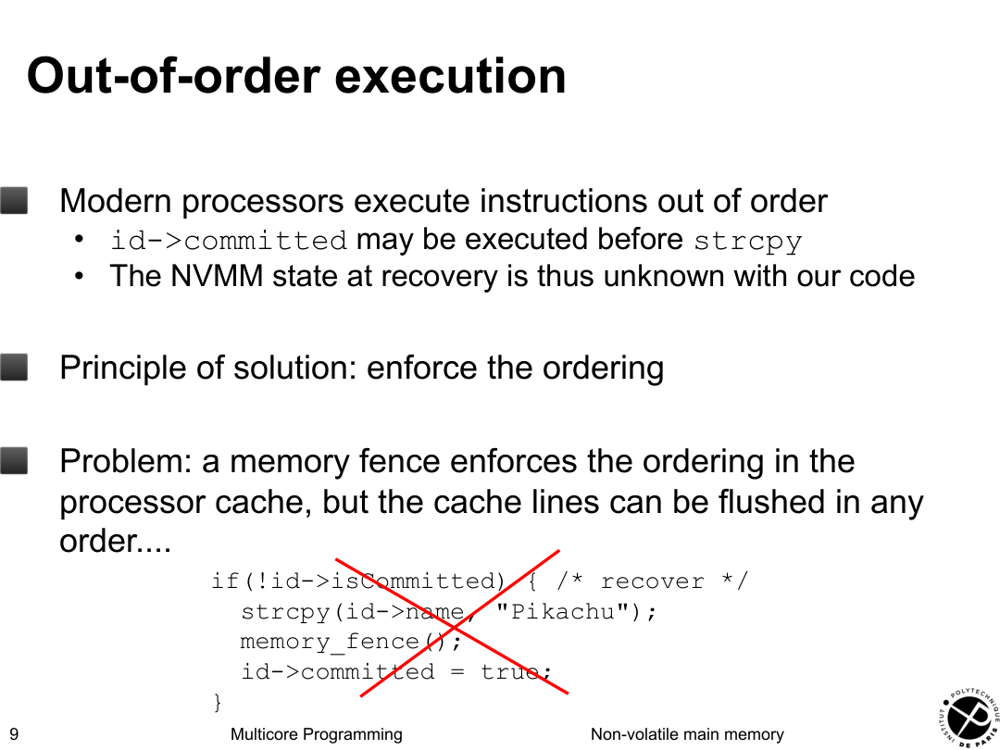

</details>

<a id="page-10"></a>

## 第 10 页 · Fighting out-of-order execution

- 

Introduces two new instructions

- 

pwb(char* addr): adds the cache line that contains addr in a flush queue that ensures a FIFO order

- 

pfence(): ensures that the stores and pwbs that precede are executed before the stores and pwbs that succeed

> 校对：pwb覆盖每条修改行；先数据后标志。

<details>
<summary>查看第 10 页原图（图形、代码布局与标注）</summary>

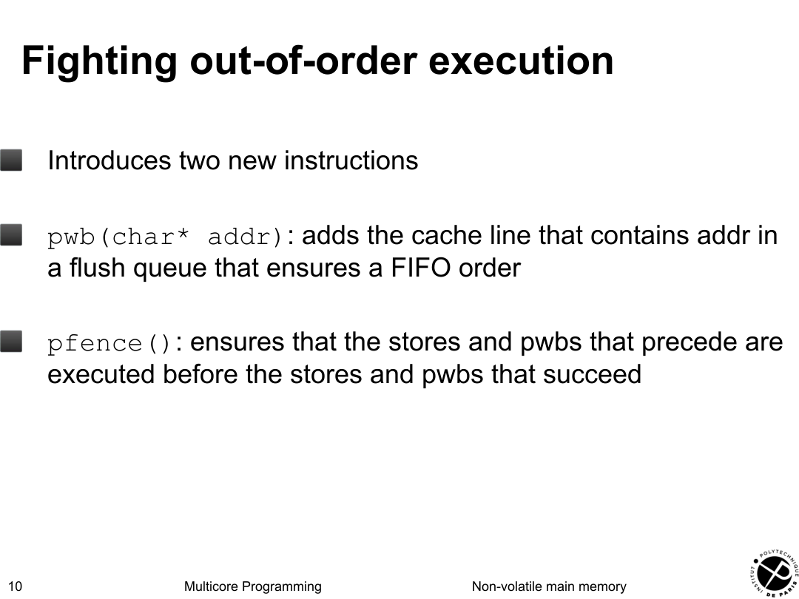

</details>

<a id="page-11"></a>

## 第 11 页 · Fighting out-of-order execution

```text
struct id* id = mmap(...);
```

```text
if(!id->isCommitted) { /* recover */
  strcpy(id->name, "Pikachu");
  pwb(id->name);
  pfence();
  id->committed = true;
  pwb(&id->committed);
}
```

Executed before (same variable)

Executed before (pfence)

Executed before (same variable)

=> the cache line that contains id->committed is flushed after the cache line that contains id->name => id->committed propagated to NVMM after id->name => at recovery (id->committed == true => id->name == "Pikachu")

> 校对：一次pwb只涵盖一行；跨行数据需完整范围，初始标志需保证。

<details>
<summary>查看第 11 页原图（图形、代码布局与标注）</summary>

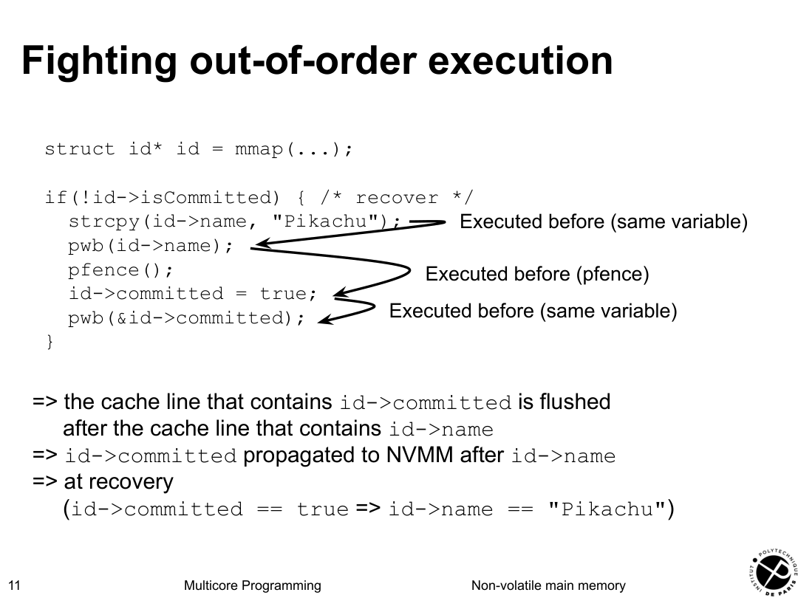

</details>

<a id="page-12"></a>

## 第 12 页 · Stronger guarantees

- 

pwb/pfence only ensures the propagation order of the cache lines

- Does not ensure that a cache line is actually flushed

- 

Sometime, we need stronger guarantees

- For example, only execute a code if a data is durable
- Impossible with only pwb/pfence

- 

Example: durable linearizability, which essentially ensures that a write becomes visible to other threads if the write is durable

> 校对：durable linearizability说明非完整定义。

<details>
<summary>查看第 12 页原图（图形、代码布局与标注）</summary>

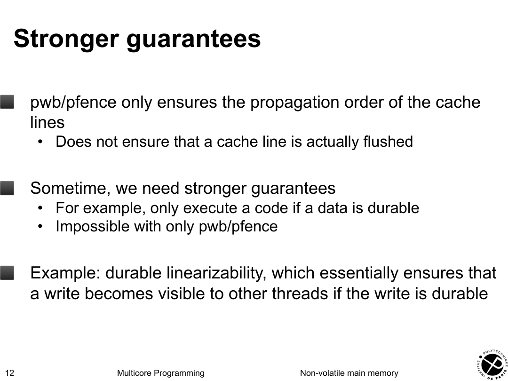

</details>

<a id="page-13"></a>

## 第 13 页 · Stronger guarantees

- 

A third instruction: psync()

- Acts as a pfence()
- And ensures that the cache line is actually propagated to NVMM

```text
struct id {           // NVMM
  char name[256];
  bool committed;
};
_Atomic bool visible;  // volatile memory
```

Thread 1 Thread 2

```text
strcpy(id->name, "Pikachu");
pwb(id->name);
pfence();
id->committed = true;
pwb(&id->committed);
psync();
atomic_store(&visible, true);
```

```text
while(!atomic_load(&visible)) { 
}
```

```text
printf("%s is durable\n",
       id->name);
```

> 校对：visible易失且需初始false；持久域和同步模型前提。

<details>
<summary>查看第 13 页原图（图形、代码布局与标注）</summary>

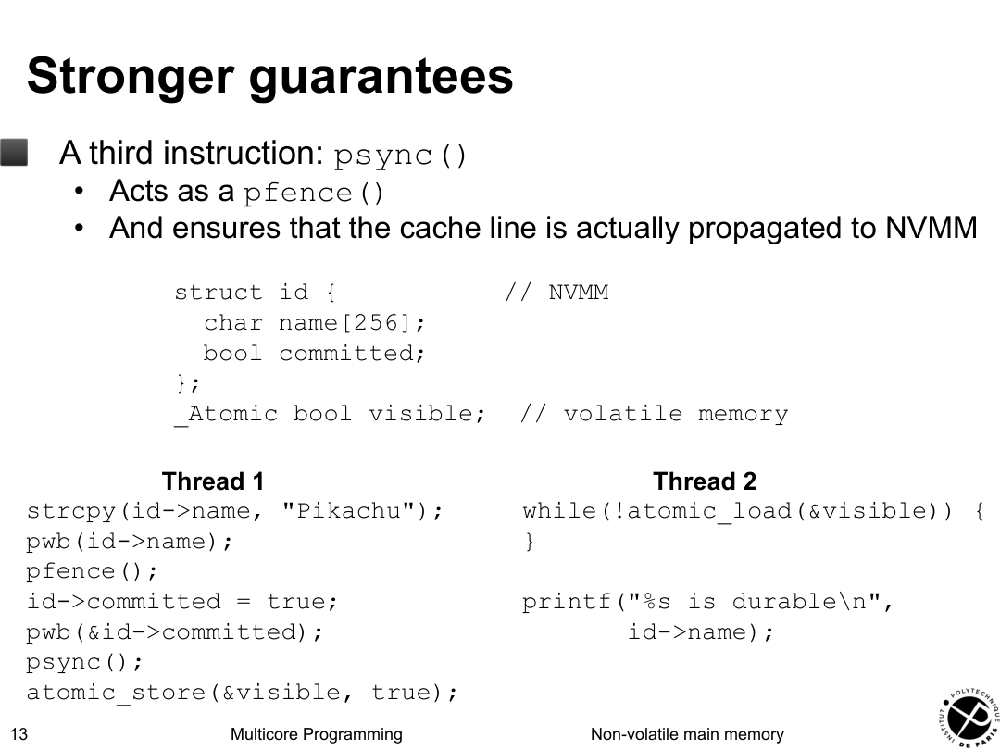

</details>

<a id="page-14"></a>

## 第 14 页 · Implementation with a pentium

- 

pwb implemented with clwb (cache line write back)

- 

pfence implemented with sfence (store fence)

- Pentium is a TSO: already ensures that a store after store is not reordonanced
- The sfence additionally ensures that a clwb is not reordonanced because a clwb is a store-like instruction
- => pfence ensures that the stores and pwb are not reordonanced

- 

psync implemented with sfence (store fence)

- In case of crash, enough residual energy in a pentium to flush the pending cache lines to the NVMM

> 校对：Pentium残余能量不能泛化；持久域决定保证。

<details>
<summary>查看第 14 页原图（图形、代码布局与标注）</summary>

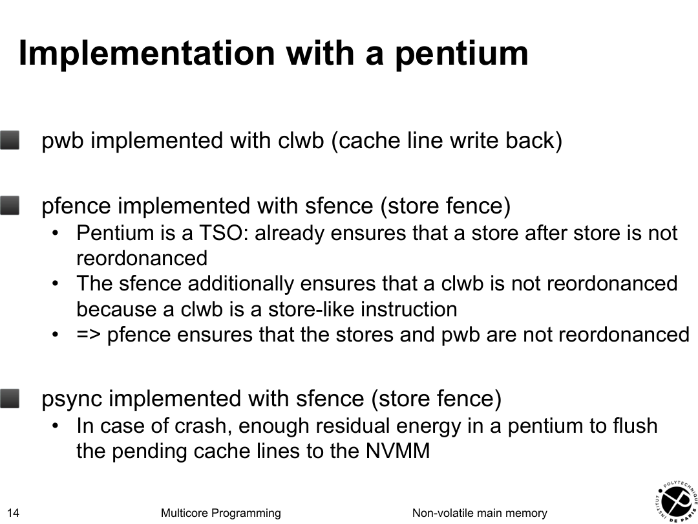

</details>

<a id="page-15"></a>

## 第 15 页 · To take away

- 

NVMM: durability for the cost of volatile memory access

- Same order of magnitude, but slower than DDR4

- 

Exposed in Linux through a direct access file system

- For example ext4-dax
- Direct access with open/mmap

- 

Three new instructions to enforce ordering

- pwb: add a cache line to the flush queue
- pfence: store fence + prevent reordering of pwb
- psync: pfence + ensures cache lines written to NVMM

> 校对：CLWB/SFENCE及持久域；残余能量不是所有CPU保证。

<details>
<summary>查看第 15 页原图（图形、代码布局与标注）</summary>

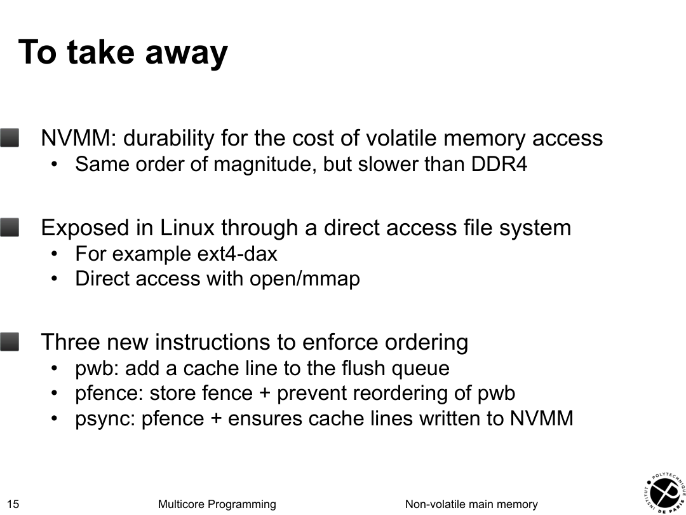

</details>

## 原 OCR 图片保留索引

以下按原始 OCR 引用顺序保留，方便核对裁切范围；准确页码以逐页原图为准。

- [提取图 001](Images/06-nvmm/image_001.jpg)
- [提取图 002](Images/06-nvmm/image_002.jpg)
- [提取图 003](Images/06-nvmm/image_003.jpg)
- [提取图 004](Images/06-nvmm/image_004.jpg)
- [提取图 005](Images/06-nvmm/image_005.jpg)
- [提取图 006](Images/06-nvmm/image_006.jpg)
